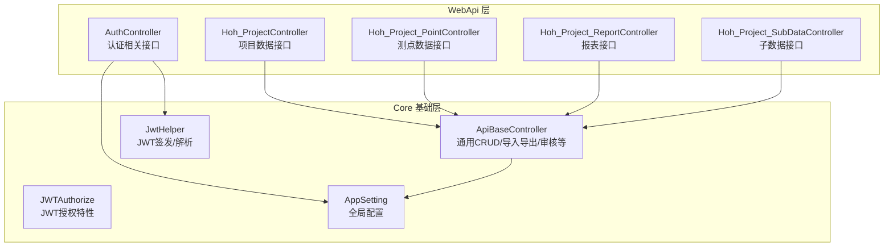
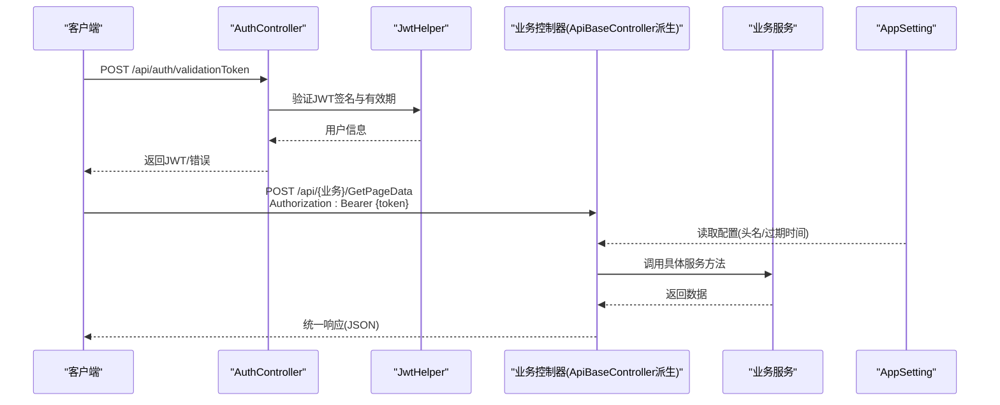
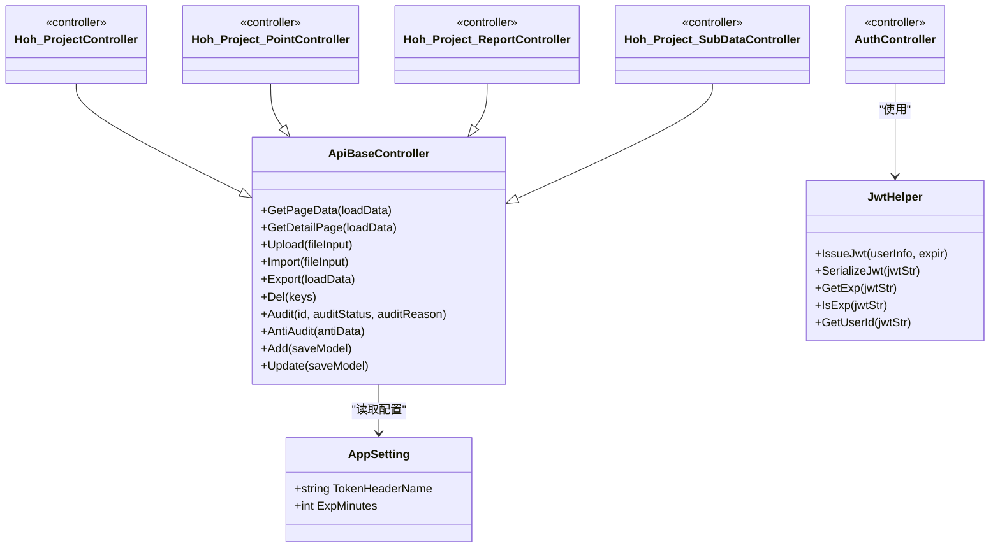
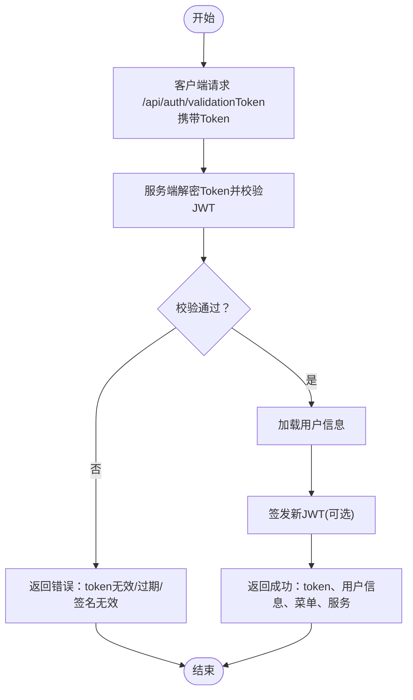

# API接口文档

<cite>
**本文引用的文件**
- [Hoh_ProjectController.cs](file://VolPro.WebApi/Controllers/HeatOfHydration/Hoh_ProjectController.cs)
- [Hoh_Project_PointController.cs](file://VolPro.WebApi/Controllers/HeatOfHydration/Hoh_Project_PointController.cs)
- [Hoh_Project_ReportController.cs](file://VolPro.WebApi/Controllers/HeatOfHydration/Hoh_Project_ReportController.cs)
- [Hoh_Project_SubDataController.cs](file://VolPro.WebApi/Controllers/HeatOfHydration/Hoh_Project_SubDataController.cs)
- [ApiBaseController.cs](file://VolPro.Core/Controllers/Basic/ApiBaseController.cs)
- [JWTAuthorize.cs](file://VolPro.Core/Filters/JWTAuthorize.cs)
- [JwtHelper.cs](file://VolPro.Core/Utilities/JwtHelper.cs)
- [AuthController.cs](file://VolPro.WebApi/Controllers/Auth/AuthController.cs)
- [AppSetting.cs](file://VolPro.Core/Configuration/AppSetting.cs)
- [appsettings.json](file://VolPro.WebApi/appsettings.json)
- [ApiMessage.cs](file://VolPro.Core/Enums/ApiMessage.cs)
- [ApiStatutsCode.cs](file://VolPro.Core/Enums/ApiStatutsCode.cs)
</cite>

## 目录
1. [简介](#简介)
2. [项目结构](#项目结构)
3. [核心组件](#核心组件)
4. [架构总览](#架构总览)
5. [详细组件分析](#详细组件分析)
6. [依赖关系分析](#依赖关系分析)
7. [性能考量](#性能考量)
8. [故障排查指南](#故障排查指南)
9. [结论](#结论)
10. [附录](#附录)

## 简介
本文件为“水化热平台”的完整API接口文档，覆盖所有RESTful端点、认证授权机制、请求/响应格式、参数与校验规则、错误码与状态码、版本控制策略与向后兼容性、使用限制与速率限制建议，以及客户端集成与最佳实践。

## 项目结构
水化热平台基于ASP.NET Core构建，采用控制器-服务-仓储分层架构。API控制器位于WebApi工程的各业务命名空间下，通用的API行为由基础控制器统一提供；认证与授权由JWT中间件与过滤器共同实现；配置项集中于应用配置文件。

图表来源
- [Hoh_ProjectController.cs:11-13](file://VolPro.WebApi/Controllers/HeatOfHydration/Hoh_ProjectController.cs#L11-L13)
- [Hoh_Project_PointController.cs:11-13](file://VolPro.WebApi/Controllers/HeatOfHydration/Hoh_Project_PointController.cs#L11-L13)
- [Hoh_Project_ReportController.cs:11-13](file://VolPro.WebApi/Controllers/HeatOfHydration/Hoh_Project_ReportController.cs#L11-L13)
- [Hoh_Project_SubDataController.cs:11-13](file://VolPro.WebApi/Controllers/HeatOfHydration/Hoh_Project_SubDataController.cs#L11-L13)
- [ApiBaseController.cs:19-41](file://VolPro.Core/Controllers/Basic/ApiBaseController.cs#L19-L41)
- [JWTAuthorize.cs:8-14](file://VolPro.Core/Filters/JWTAuthorize.cs#L8-L14)
- [JwtHelper.cs:21-47](file://VolPro.Core/Utilities/JwtHelper.cs#L21-L47)
- [AppSetting.cs:48-64](file://VolPro.Core/Configuration/AppSetting.cs#L48-L64)

章节来源
- [Hoh_ProjectController.cs:11-13](file://VolPro.WebApi/Controllers/HeatOfHydration/Hoh_ProjectController.cs#L11-L13)
- [ApiBaseController.cs:19-230](file://VolPro.Core/Controllers/Basic/ApiBaseController.cs#L19-L230)
- [AppSetting.cs:48-142](file://VolPro.Core/Configuration/AppSetting.cs#L48-L142)

## 核心组件
- 统一认证与授权
  - JWT签名密钥、发行方、受众、有效期等由配置提供；JWT签发与解析工具类负责生成与校验。
  - 授权特性用于标记控制器或动作需JWT授权。
- 通用API控制器
  - 提供分页查询、明细查询、上传、导入、导出、删除、审核、反审核、新增、编辑等通用动作。
  - 所有业务控制器继承该基础控制器，自动获得统一的鉴权、日志与权限控制。
- 认证控制器
  - 提供多种登录与Token校验流程，包括基于DES加密的临时Token、基于JWT的正式Token、数据看板登录Token等。

章节来源
- [JwtHelper.cs:21-99](file://VolPro.Core/Utilities/JwtHelper.cs#L21-L99)
- [JWTAuthorize.cs:8-14](file://VolPro.Core/Filters/JWTAuthorize.cs#L8-L14)
- [ApiBaseController.cs:37-205](file://VolPro.Core/Controllers/Basic/ApiBaseController.cs#L37-L205)
- [AuthController.cs:45-211](file://VolPro.WebApi/Controllers/Auth/AuthController.cs#L45-L211)

## 架构总览
以下序列图展示典型API调用链路：客户端请求受保护资源，经JWT授权与权限过滤，进入业务控制器，委托基础控制器调用服务层，最终返回统一响应格式。

图表来源
- [AuthController.cs:64-133](file://VolPro.WebApi/Controllers/Auth/AuthController.cs#L64-L133)
- [JwtHelper.cs:54-94](file://VolPro.Core/Utilities/JwtHelper.cs#L54-L94)
- [ApiBaseController.cs:37-41](file://VolPro.Core/Controllers/Basic/ApiBaseController.cs#L37-L41)
- [AppSetting.cs:48-64](file://VolPro.Core/Configuration/AppSetting.cs#L48-L64)

## 详细组件分析

### 认证与授权机制
- JWT签发
  - 使用对称密钥(HMAC SHA256)签发，包含用户标识、签发时间、生效时间、过期时间、发行方、受众等声明。
  - 过期时间默认来自配置，不同场景可覆盖。
- JWT校验
  - 校验签名有效性、发行方与受众、过期时间；解析失败返回明确错误。
- Token传递
  - 默认请求头名为Authorization，值为Bearer {token}。
- 文件访问授权
  - 支持文件访问的额外授权策略（如临时key换取用户态）。

章节来源
- [JwtHelper.cs:21-47](file://VolPro.Core/Utilities/JwtHelper.cs#L21-L47)
- [JwtHelper.cs:54-94](file://VolPro.Core/Utilities/JwtHelper.cs#L54-L94)
- [AppSetting.cs:48-64](file://VolPro.Core/Configuration/AppSetting.cs#L48-L64)
- [AuthController.cs:135-211](file://VolPro.WebApi/Controllers/Auth/AuthController.cs#L135-L211)

### 通用API控制器（ApiBaseController）
- 统一路由前缀
  - 控制器通过继承基础控制器，自动具备统一的路由与权限注解。
- 通用动作
  - 分页查询(GetPageData)、明细查询(GetDetailPage)、上传(Upload)、导入(Import)、导出(Export)、删除(Del)、审核(Audit)、反审核(antiAudit)、新增(Add)、编辑(Update)。
- 权限控制
  - 动作级权限枚举映射到具体权限选项，确保最小权限原则。
- 日志与审计
  - 每个动作均记录操作日志，便于审计与问题追踪。

章节来源
- [ApiBaseController.cs:37-205](file://VolPro.Core/Controllers/Basic/ApiBaseController.cs#L37-L205)

### 水化热业务控制器
- 项目数据控制器
  - 路由：/api/Hoh_Project
  - 继承基础控制器，自动具备通用动作
- 测点数据控制器
  - 路由：/api/Hoh_Project_Point
- 报表数据控制器
  - 路由：/api/Hoh_Project_Report
- 子数据控制器
  - 路由：/api/Hoh_Project_SubData

章节来源
- [Hoh_ProjectController.cs:11-13](file://VolPro.WebApi/Controllers/HeatOfHydration/Hoh_ProjectController.cs#L11-L13)
- [Hoh_Project_PointController.cs:11-13](file://VolPro.WebApi/Controllers/HeatOfHydration/Hoh_Project_PointController.cs#L11-L13)
- [Hoh_Project_ReportController.cs:11-13](file://VolPro.WebApi/Controllers/HeatOfHydration/Hoh_Project_ReportController.cs#L11-L13)
- [Hoh_Project_SubDataController.cs:11-13](file://VolPro.WebApi/Controllers/HeatOfHydration/Hoh_Project_SubDataController.cs#L11-L13)

### 认证控制器（AuthController）
- 获取访问令牌
  - 通过内部流程签发短期或长期令牌，支持DES加密包装。
- 校验Token
  - 对传入的Token进行解密与JWT校验，返回用户信息与菜单、服务列表等。
- 数据看板登录
  - 通过一次性key换取长期Token，用于无感登录场景。

章节来源
- [AuthController.cs:45-52](file://VolPro.WebApi/Controllers/Auth/AuthController.cs#L45-L52)
- [AuthController.cs:64-133](file://VolPro.WebApi/Controllers/Auth/AuthController.cs#L64-L133)
- [AuthController.cs:135-211](file://VolPro.WebApi/Controllers/Auth/AuthController.cs#L135-L211)

## 依赖关系分析

图表来源
- [ApiBaseController.cs:19-230](file://VolPro.Core/Controllers/Basic/ApiBaseController.cs#L19-L230)
- [Hoh_ProjectController.cs:11-13](file://VolPro.WebApi/Controllers/HeatOfHydration/Hoh_ProjectController.cs#L11-L13)
- [Hoh_Project_PointController.cs:11-13](file://VolPro.WebApi/Controllers/HeatOfHydration/Hoh_Project_PointController.cs#L11-L13)
- [Hoh_Project_ReportController.cs:11-13](file://VolPro.WebApi/Controllers/HeatOfHydration/Hoh_Project_ReportController.cs#L11-L13)
- [Hoh_Project_SubDataController.cs:11-13](file://VolPro.WebApi/Controllers/HeatOfHydration/Hoh_Project_SubDataController.cs#L11-L13)
- [AuthController.cs:27-37](file://VolPro.WebApi/Controllers/Auth/AuthController.cs#L27-L37)
- [JwtHelper.cs:13-99](file://VolPro.Core/Utilities/JwtHelper.cs#L13-L99)
- [AppSetting.cs:48-142](file://VolPro.Core/Configuration/AppSetting.cs#L48-L142)

## 性能考量
- 统一响应与日志
  - 基础控制器统一输出响应结构，便于前端处理与后端日志审计。
- 导入/导出
  - 导入/导出为IO密集型操作，建议异步执行并提供进度反馈。
- 缓存与配置
  - 配置集中管理，避免硬编码；可结合Redis提升高并发下的缓存命中率。
- Token有效期
  - 合理设置过期时间，避免频繁刷新导致的抖动。

## 故障排查指南
- 常见错误与定位
  - 参数错误：检查请求体结构与必填字段。
  - Token缺失或无效：确认Authorization头格式与签名。
  - Token过期：根据过期时间提示刷新。
  - 权限不足：确认用户角色与菜单权限。
- 错误码与消息
  - 统一错误消息常量与状态码枚举，便于前后端约定。
- 配置校验
  - 确认JWT密钥、发行方、受众、过期时间、静态文件访问策略等配置正确。

章节来源
- [ApiMessage.cs:7-59](file://VolPro.Core/Enums/ApiMessage.cs#L7-L59)
- [ApiStatutsCode.cs:7-14](file://VolPro.Core/Enums/ApiStatutsCode.cs#L7-L14)
- [AuthController.cs:114-131](file://VolPro.WebApi/Controllers/Auth/AuthController.cs#L114-L131)

## 结论
本API体系以统一的认证授权与基础控制器为核心，覆盖水化热平台主要业务域，提供标准化的CRUD与报表能力。通过JWT与权限过滤保障安全性，配合统一响应与日志体系提升可观测性。建议在生产环境中结合缓存、异步处理与限流策略进一步优化性能与稳定性。

## 附录

### API端点清单与规范

- 通用规范
  - 方法：POST（部分GET，具体以控制器为准）
  - 请求头：Authorization: Bearer {token}
  - 成功响应：统一JSON结构，包含状态码与数据
  - 错误响应：统一JSON结构，包含状态码与错误信息

- 认证相关
  - 获取访问令牌
    - 方法：POST
    - 路由：/api/auth/getAccessToken
    - 请求体：无
    - 响应：包含token
  - 校验Token
    - 方法：POST
    - 路由：/api/auth/validationToken
    - 请求体：{"Token":"..."}
    - 响应：包含status、token、用户名、头像等
  - 数据看板获取临时key
    - 方法：POST
    - 路由：/api/auth/getDataViewAccessToken
    - 响应：返回临时key
  - 数据看板登录换取JWT
    - 方法：POST
    - 路由：/api/auth/getDataViewLoginToken
    - 请求体：{"key":"..."}
    - 响应：包含用户信息、菜单、服务、token等

- 业务数据接口（示例）
  - 项目数据
    - 路由：/api/Hoh_Project
    - 动作：GetPageData、Add、Update、Del、Audit、AntiAudit、Export、Import、Upload、DownLoadTemplate
  - 测点数据
    - 路由：/api/Hoh_Project_Point
    - 动作：同上
  - 报表数据
    - 路由：/api/Hoh_Project_Report
    - 动作：同上
  - 子数据
    - 路由：/api/Hoh_Project_SubData
    - 动作：同上

章节来源
- [AuthController.cs:45-52](file://VolPro.WebApi/Controllers/Auth/AuthController.cs#L45-L52)
- [AuthController.cs:64-133](file://VolPro.WebApi/Controllers/Auth/AuthController.cs#L64-L133)
- [AuthController.cs:135-211](file://VolPro.WebApi/Controllers/Auth/AuthController.cs#L135-L211)
- [ApiBaseController.cs:37-205](file://VolPro.Core/Controllers/Basic/ApiBaseController.cs#L37-L205)

### 请求/响应示例（结构化描述）

- 成功响应
  - 结构：包含状态码、数据、消息等字段
  - 示例字段：status、data、message
- 错误响应
  - 结构：包含状态码、错误信息、提示等
  - 示例字段：status=false、message、code

章节来源
- [AuthController.cs:181-210](file://VolPro.WebApi/Controllers/Auth/AuthController.cs#L181-L210)
- [ApiBaseController.cs:39-40](file://VolPro.Core/Controllers/Basic/ApiBaseController.cs#L39-L40)

### 认证与授权流程

图表来源
- [AuthController.cs:64-133](file://VolPro.WebApi/Controllers/Auth/AuthController.cs#L64-L133)
- [JwtHelper.cs:54-94](file://VolPro.Core/Utilities/JwtHelper.cs#L54-L94)

### 配置与版本控制

- 配置要点
  - JWT密钥、发行方、受众、过期时间、静态文件访问策略等
- 版本控制策略
  - 当前未发现显式API版本号字段；建议在请求头中引入X-API-Version或URL路径版本段以保证向后兼容
- 向后兼容性
  - 建议保留旧接口一段时间，逐步迁移；新增字段采用可选策略

章节来源
- [appsettings.json:58-68](file://VolPro.WebApi/appsettings.json#L58-L68)
- [AppSetting.cs:48-64](file://VolPro.Core/Configuration/AppSetting.cs#L48-L64)

### 使用限制与速率限制建议
- 建议
  - 在网关或中间件层实施IP/用户维度的速率限制
  - 对敏感动作（导入、导出、删除、审核）设置更严格阈值
  - 对Token刷新与登录接口设置防暴力破解策略

### 客户端集成指南与最佳实践
- 集成步骤
  - 先调用认证接口获取Token，后续请求统一携带Authorization头
  - 对过期时间进行监控，临近过期时提前刷新
- 最佳实践
  - 将Token安全存储，避免泄露
  - 对批量导入/导出使用异步接口并轮询结果
  - 统一处理错误码与消息，提供友好的用户提示