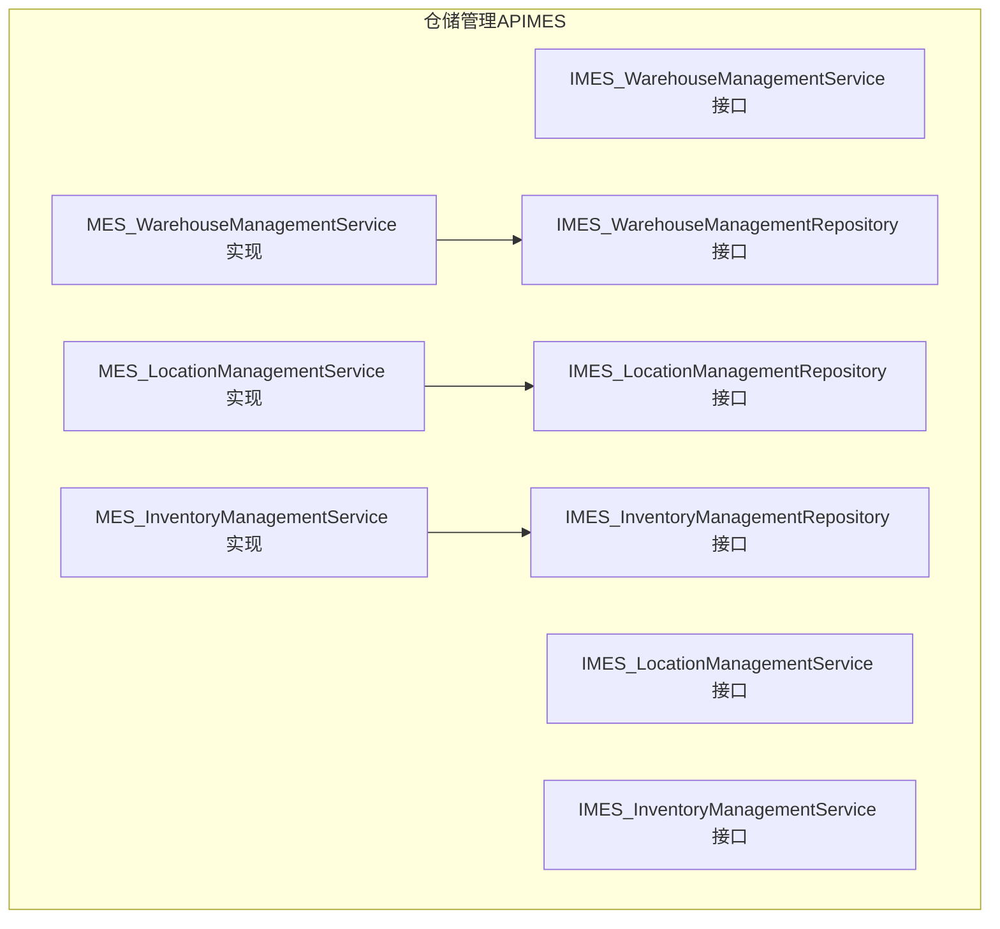
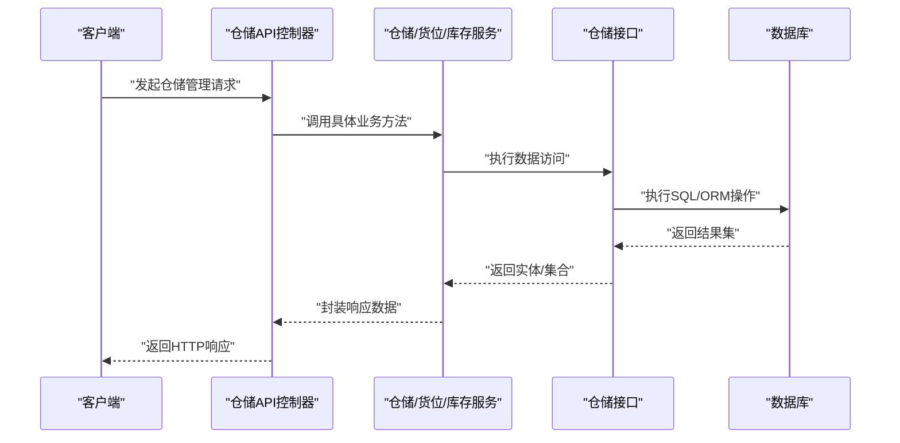
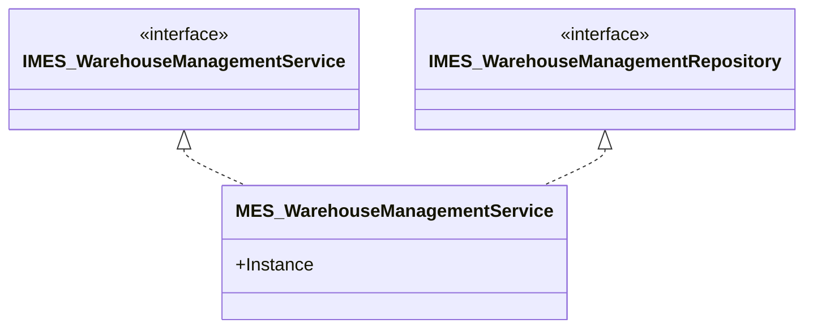
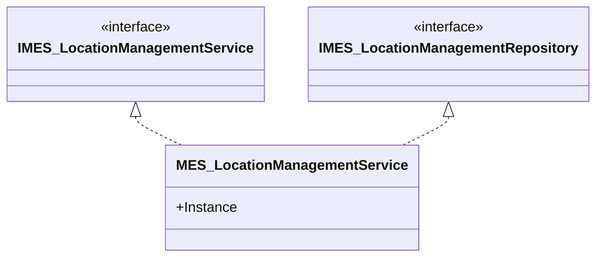
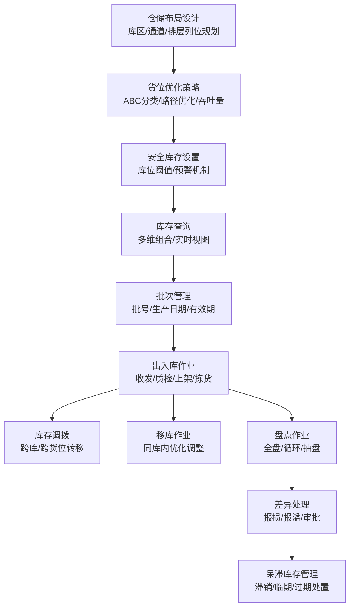
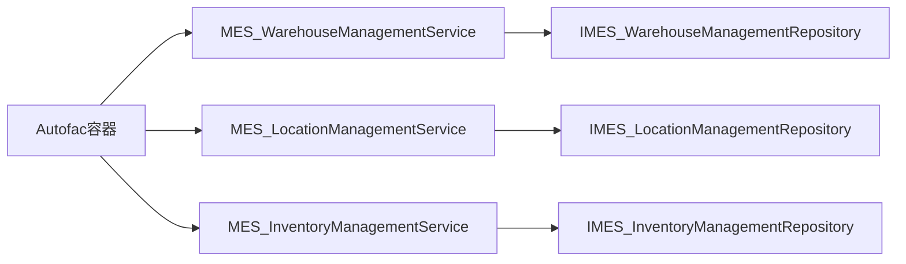

# 仓储管理API

<cite>
**本文引用的文件**
- [IMES_WarehouseManagementService.cs](file://VolPro.Mes/IServices/mes/IMES_WarehouseManagementService.cs)
- [IMES_WarehouseManagementRepository.cs](file://VolPro.Mes/IRepositories/mes/IMES_WarehouseManagementRepository.cs)
- [MES_WarehouseManagementService.cs](file://VolPro.Mes/Services/mes/MES_WarehouseManagementService.cs)
- [IMES_LocationManagementService.cs](file://VolPro.Mes/IServices/mes/IMES_LocationManagementService.cs)
- [IMES_LocationManagementRepository.cs](file://VolPro.Mes/IRepositories/mes/IMES_LocationManagementRepository.cs)
- [MES_LocationManagementService.cs](file://VolPro.Mes/Services/mes/MES_LocationManagementService.cs)
- [IMES_InventoryManagementService.cs](file://VolPro.Mes/IServices/mes/IMES_InventoryManagementService.cs)
- [IMES_InventoryManagementRepository.cs](file://VolPro.Mes/IRepositories/mes/IMES_InventoryManagementRepository.cs)
- [MES_InventoryManagementService.cs](file://VolPro.Mes/Services/mes/MES_InventoryManagementService.cs)
</cite>

## 目录
1. [简介](#简介)
2. [项目结构](#项目结构)
3. [核心组件](#核心组件)
4. [架构总览](#架构总览)
5. [详细组件分析](#详细组件分析)
6. [依赖关系分析](#依赖关系分析)
7. [性能考虑](#性能考虑)
8. [故障排查指南](#故障排查指南)
9. [结论](#结论)
10. [附录](#附录)

## 简介
本文件面向仓储管理API，聚焦仓库管理、货位管理、库存管理三大核心能力，以及与物料管理、生产管理、财务管理等模块的集成思路。基于现有代码库，仓储管理API采用分层架构（接口层-服务层-仓储层），通过MES命名空间下的仓储相关服务与仓储实体进行交互，并以Autofac容器实现依赖注入。本文将从系统架构、组件职责、数据流、处理逻辑、集成点、错误处理与性能优化等方面进行全面阐述。

## 项目结构
仓储管理API位于MES模块中，采用“接口+服务+仓储”的分层设计，分别对应仓储管理、货位管理、库存管理三类业务域。各域均提供IService与IRepository接口及其实现类，形成清晰的职责边界与可扩展性。

**图表来源**
- [IMES_WarehouseManagementService.cs:1-13](file://VolPro.Mes/IServices/mes/IMES_WarehouseManagementService.cs#L1-L13)
- [MES_WarehouseManagementService.cs:1-23](file://VolPro.Mes/Services/mes/MES_WarehouseManagementService.cs#L1-L23)
- [IMES_WarehouseManagementRepository.cs:1-19](file://VolPro.Mes/IRepositories/mes/IMES_WarehouseManagementRepository.cs#L1-L19)
- [IMES_LocationManagementService.cs:1-13](file://VolPro.Mes/IServices/mes/IMES_LocationManagementService.cs#L1-L13)
- [MES_LocationManagementService.cs:1-23](file://VolPro.Mes/Services/mes/MES_LocationManagementService.cs#L1-L23)
- [IMES_LocationManagementRepository.cs:1-19](file://VolPro.Mes/IRepositories/mes/IMES_LocationManagementRepository.cs#L1-L19)
- [IMES_InventoryManagementService.cs:1-13](file://VolPro.Mes/IServices/mes/IMES_InventoryManagementService.cs#L1-L13)
- [MES_InventoryManagementService.cs:1-23](file://VolPro.Mes/Services/mes/MES_InventoryManagementService.cs#L1-L23)
- [IMES_InventoryManagementRepository.cs:1-19](file://VolPro.Mes/IRepositories/mes/IMES_InventoryManagementRepository.cs#L1-L19)

**章节来源**
- [IMES_WarehouseManagementService.cs:1-13](file://VolPro.Mes/IServices/mes/IMES_WarehouseManagementService.cs#L1-L13)
- [IMES_WarehouseManagementRepository.cs:1-19](file://VolPro.Mes/IRepositories/mes/IMES_WarehouseManagementRepository.cs#L1-L19)
- [MES_WarehouseManagementService.cs:1-23](file://VolPro.Mes/Services/mes/MES_WarehouseManagementService.cs#L1-L23)
- [IMES_LocationManagementService.cs:1-13](file://VolPro.Mes/IServices/mes/IMES_LocationManagementService.cs#L1-L13)
- [IMES_LocationManagementRepository.cs:1-19](file://VolPro.Mes/IRepositories/mes/IMES_LocationManagementRepository.cs#L1-L19)
- [MES_LocationManagementService.cs:1-23](file://VolPro.Mes/Services/mes/MES_LocationManagementService.cs#L1-L23)
- [IMES_InventoryManagementService.cs:1-13](file://VolPro.Mes/IServices/mes/IMES_InventoryManagementService.cs#L1-L13)
- [IMES_InventoryManagementRepository.cs:1-19](file://VolPro.Mes/IRepositories/mes/IMES_InventoryManagementRepository.cs#L1-L19)
- [MES_InventoryManagementService.cs:1-23](file://VolPro.Mes/Services/mes/MES_InventoryManagementService.cs#L1-L23)

## 核心组件
- 仓储管理（仓库维度）
  - 接口：IMES_WarehouseManagementService
  - 仓储接口：IMES_WarehouseManagementRepository
  - 实现：MES_WarehouseManagementService
- 货位管理（库位维度）
  - 接口：IMES_LocationManagementService
  - 仓储接口：IMES_LocationManagementRepository
  - 实现：MES_LocationManagementService
- 库存管理（库存维度）
  - 接口：IMES_InventoryManagementService
  - 仓储接口：IMES_InventoryManagementRepository
  - 实现：MES_InventoryManagementService

上述组件遵循统一的分层模式：接口定义业务契约，服务层封装业务逻辑，仓储层负责数据访问；通过Autofac容器按需注入，支持单例实例化与依赖解析。

**章节来源**
- [IMES_WarehouseManagementService.cs:1-13](file://VolPro.Mes/IServices/mes/IMES_WarehouseManagementService.cs#L1-L13)
- [IMES_WarehouseManagementRepository.cs:1-19](file://VolPro.Mes/IRepositories/mes/IMES_WarehouseManagementRepository.cs#L1-L19)
- [MES_WarehouseManagementService.cs:1-23](file://VolPro.Mes/Services/mes/MES_WarehouseManagementService.cs#L1-L23)
- [IMES_LocationManagementService.cs:1-13](file://VolPro.Mes/IServices/mes/IMES_LocationManagementService.cs#L1-L13)
- [IMES_LocationManagementRepository.cs:1-19](file://VolPro.Mes/IRepositories/mes/IMES_LocationManagementRepository.cs#L1-L19)
- [MES_LocationManagementService.cs:1-23](file://VolPro.Mes/Services/mes/MES_LocationManagementService.cs#L1-L23)
- [IMES_InventoryManagementService.cs:1-13](file://VolPro.Mes/IServices/mes/IMES_InventoryManagementService.cs#L1-L13)
- [IMES_InventoryManagementRepository.cs:1-19](file://VolPro.Mes/IRepositories/mes/IMES_InventoryManagementRepository.cs#L1-L19)
- [MES_InventoryManagementService.cs:1-23](file://VolPro.Mes/Services/mes/MES_InventoryManagementService.cs#L1-L23)

## 架构总览
仓储管理API采用分层架构与依赖注入，结合仓储、服务与接口的职责分离，确保高内聚低耦合。整体交互流程如下：

该流程体现了仓储管理API的典型调用链路：控制器接收请求，委派至服务层，服务层通过仓储接口访问数据，最终返回给控制器并由其输出HTTP响应。

**图表来源**
- [IMES_WarehouseManagementService.cs:1-13](file://VolPro.Mes/IServices/mes/IMES_WarehouseManagementService.cs#L1-L13)
- [MES_WarehouseManagementService.cs:1-23](file://VolPro.Mes/Services/mes/MES_WarehouseManagementService.cs#L1-L23)
- [IMES_WarehouseManagementRepository.cs:1-19](file://VolPro.Mes/IRepositories/mes/IMES_WarehouseManagementRepository.cs#L1-L19)
- [IMES_LocationManagementService.cs:1-13](file://VolPro.Mes/IServices/mes/IMES_LocationManagementService.cs#L1-L13)
- [MES_LocationManagementService.cs:1-23](file://VolPro.Mes/Services/mes/MES_LocationManagementService.cs#L1-L23)
- [IMES_LocationManagementRepository.cs:1-19](file://VolPro.Mes/IRepositories/mes/IMES_LocationManagementRepository.cs#L1-L19)
- [IMES_InventoryManagementService.cs:1-13](file://VolPro.Mes/IServices/mes/IMES_InventoryManagementService.cs#L1-L13)
- [MES_InventoryManagementService.cs:1-23](file://VolPro.Mes/Services/mes/MES_InventoryManagementService.cs#L1-L23)
- [IMES_InventoryManagementRepository.cs:1-19](file://VolPro.Mes/IRepositories/mes/IMES_InventoryManagementRepository.cs#L1-L19)

## 详细组件分析

### 仓储管理（仓库维度）
- 职责边界
  - 仓库设置：负责仓库基础信息的增删改查与状态维护。
  - 仓库布局设计：通过与货位管理协同，实现库区、通道、排层列位的规划与优化。
  - 与物料/生产/财务集成：作为上游业务的承载单元，为出入库、移库、盘点等提供仓库维度的上下文。
- 关键接口与实现
  - 接口：IMES_WarehouseManagementService
  - 仓储接口：IMES_WarehouseManagementRepository
  - 实现：MES_WarehouseManagementService（通过Autofac容器获取实例）
- 处理流程（示例：仓库新增/更新）
  - 控制器接收请求参数
  - 服务层校验参数与业务规则
  - 仓储层持久化到数据库
  - 返回成功响应

**图表来源**
- [IMES_WarehouseManagementService.cs:1-13](file://VolPro.Mes/IServices/mes/IMES_WarehouseManagementService.cs#L1-L13)
- [IMES_WarehouseManagementRepository.cs:1-19](file://VolPro.Mes/IRepositories/mes/IMES_WarehouseManagementRepository.cs#L1-L19)
- [MES_WarehouseManagementService.cs:1-23](file://VolPro.Mes/Services/mes/MES_WarehouseManagementService.cs#L1-L23)

**章节来源**
- [IMES_WarehouseManagementService.cs:1-13](file://VolPro.Mes/IServices/mes/IMES_WarehouseManagementService.cs#L1-L13)
- [IMES_WarehouseManagementRepository.cs:1-19](file://VolPro.Mes/IRepositories/mes/IMES_WarehouseManagementRepository.cs#L1-L19)
- [MES_WarehouseManagementService.cs:1-23](file://VolPro.Mes/Services/mes/MES_WarehouseManagementService.cs#L1-L23)

### 货位管理（库位维度）
- 职责边界
  - 货位分配：根据产品特性、存储要求与库位可用性进行智能分配。
  - 货位优化策略：结合ABC分类、周转率、拣货路径等指标优化库位布局。
  - 安全库存设置：在库位层面设置安全阈值，触发补货或预警。
- 关键接口与实现
  - 接口：IMES_LocationManagementService
  - 仓储接口：IMES_LocationManagementRepository
  - 实现：MES_LocationManagementService（通过Autofac容器获取实例）
- 处理流程（示例：库位分配）
  - 控制器接收分配请求
  - 服务层评估库位可用性与产品属性匹配度
  - 仓储层写入分配结果
  - 返回分配结果

**图表来源**
- [IMES_LocationManagementService.cs:1-13](file://VolPro.Mes/IServices/mes/IMES_LocationManagementService.cs#L1-L13)
- [IMES_LocationManagementRepository.cs:1-19](file://VolPro.Mes/IRepositories/mes/IMES_LocationManagementRepository.cs#L1-L19)
- [MES_LocationManagementService.cs:1-23](file://VolPro.Mes/Services/mes/MES_LocationManagementService.cs#L1-L23)

**章节来源**
- [IMES_LocationManagementService.cs:1-13](file://VolPro.Mes/IServices/mes/IMES_LocationManagementService.cs#L1-L13)
- [IMES_LocationManagementRepository.cs:1-19](file://VolPro.Mes/IRepositories/mes/IMES_LocationManagementRepository.cs#L1-L19)
- [MES_LocationManagementService.cs:1-23](file://VolPro.Mes/Services/mes/MES_LocationManagementService.cs#L1-L23)

### 库存管理（库存维度）
- 职责边界
  - 库存查询：支持按仓库、货位、产品、批次、有效期等多维组合查询。
  - 批次管理：跟踪批次号、生产日期、有效期、质量状态等。
  - 有效期控制：临近过期/过期库存预警与处置建议。
  - 出入库作业：产品出入库登记、库存实时更新。
  - 盘点作业：支持全盘、循环盘、抽盘等策略，差异处理与审批流程。
- 关键接口与实现
  - 接口：IMES_InventoryManagementService
  - 仓储接口：IMES_InventoryManagementRepository
  - 实现：MES_InventoryManagementService（通过Autofac容器获取实例）
- 处理流程（示例：库存查询）
  - 控制器接收查询条件
  - 服务层构建查询策略（含过滤、排序、分页）
  - 仓储层执行查询并返回结果
  - 控制器封装响应

**图表来源**
- [IMES_InventoryManagementService.cs:1-13](file://VolPro.Mes/IServices/mes/IMES_InventoryManagementService.cs#L1-L13)
- [IMES_InventoryManagementRepository.cs:1-19](file://VolPro.Mes/IRepositories/mes/IMES_InventoryManagementRepository.cs#L1-L19)
- [MES_InventoryManagementService.cs:1-23](file://VolPro.Mes/Services/mes/MES_InventoryManagementService.cs#L1-L23)

**章节来源**
- [IMES_InventoryManagementService.cs:1-13](file://VolPro.Mes/IServices/mes/IMES_InventoryManagementService.cs#L1-L13)
- [IMES_InventoryManagementRepository.cs:1-19](file://VolPro.Mes/IRepositories/mes/IMES_InventoryManagementRepository.cs#L1-L19)
- [MES_InventoryManagementService.cs:1-23](file://VolPro.Mes/Services/mes/MES_InventoryManagementService.cs#L1-L23)

### 概念性概览
以下为仓储管理业务概念流程图，展示仓储布局设计、货位优化策略、库存ABC分类、安全库存设置、调拨与移库、盘点差异处理、呆滞库存管理等关键环节的协作关系。

（该图为概念性流程示意，不直接映射具体源码文件）

## 依赖关系分析
仓储管理API通过接口与实现解耦，服务层依赖仓储接口，仓储接口再依赖数据库访问层。Autofac容器负责实例化与注入，确保运行时可替换与测试友好。

**图表来源**
- [MES_WarehouseManagementService.cs:1-23](file://VolPro.Mes/Services/mes/MES_WarehouseManagementService.cs#L1-L23)
- [MES_LocationManagementService.cs:1-23](file://VolPro.Mes/Services/mes/MES_LocationManagementService.cs#L1-L23)
- [MES_InventoryManagementService.cs:1-23](file://VolPro.Mes/Services/mes/MES_InventoryManagementService.cs#L1-L23)
- [IMES_WarehouseManagementRepository.cs:1-19](file://VolPro.Mes/IRepositories/mes/IMES_WarehouseManagementRepository.cs#L1-L19)
- [IMES_LocationManagementRepository.cs:1-19](file://VolPro.Mes/IRepositories/mes/IMES_LocationManagementRepository.cs#L1-L19)
- [IMES_InventoryManagementRepository.cs:1-19](file://VolPro.Mes/IRepositories/mes/IMES_InventoryManagementRepository.cs#L1-L19)

**章节来源**
- [MES_WarehouseManagementService.cs:1-23](file://VolPro.Mes/Services/mes/MES_WarehouseManagementService.cs#L1-L23)
- [MES_LocationManagementService.cs:1-23](file://VolPro.Mes/Services/mes/MES_LocationManagementService.cs#L1-L23)
- [MES_InventoryManagementService.cs:1-23](file://VolPro.Mes/Services/mes/MES_InventoryManagementService.cs#L1-L23)
- [IMES_WarehouseManagementRepository.cs:1-19](file://VolPro.Mes/IRepositories/mes/IMES_WarehouseManagementRepository.cs#L1-L19)
- [IMES_LocationManagementRepository.cs:1-19](file://VolPro.Mes/IRepositories/mes/IMES_LocationManagementRepository.cs#L1-L19)
- [IMES_InventoryManagementRepository.cs:1-19](file://VolPro.Mes/IRepositories/mes/IMES_InventoryManagementRepository.cs#L1-L19)

## 性能考虑
- 仓储层优化
  - 使用索引与查询谓词优化，避免全表扫描。
  - 对高频查询建立复合索引（如仓库+货位+产品）。
  - 分页查询与延迟加载，减少一次性数据传输。
- 服务层优化
  - 缓存热点数据（如仓库配置、常用货位信息）。
  - 批量操作（批量上架、批量出库、批量盘点）降低往返次数。
- 容器与并发
  - 合理使用Autofac生命周期，避免长生命周期对象持有短生命周期资源。
  - 并发场景下对关键业务加锁或使用乐观并发控制。
- 监控与日志
  - 记录慢查询与异常，定位性能瓶颈。
  - 对库存变更与盘点差异进行审计追踪。

（本节为通用性能指导，不直接分析具体源码文件）

## 故障排查指南
- 常见问题
  - 依赖注入失败：检查Autofac注册与接口实现是否匹配。
  - 数据访问异常：确认仓储接口实现与数据库连接配置。
  - 参数校验失败：服务层参数验证逻辑未通过，需检查请求体与业务规则。
- 排查步骤
  - 查看服务实例化与注入链路，确认容器注册正确。
  - 在服务层添加日志，记录关键参数与返回值。
  - 对数据库访问层进行单元测试，验证SQL/ORM执行路径。
- 建议
  - 统一异常处理中间件，规范化错误响应。
  - 对关键业务（出入库、盘点）增加事务与回滚策略。

（本节为通用故障排查指导，不直接分析具体源码文件）

## 结论
仓储管理API基于清晰的分层架构与接口契约，实现了仓库、货位、库存三大核心领域的可扩展能力。通过与物料管理、生产管理、财务管理等模块的协同，可支撑完整的仓储作业闭环。建议在后续迭代中完善控制器层与实体模型，补充HTTP端点定义与数据模型，以形成完整的API文档与实现方案。

## 附录
- 集成建议
  - 物料管理：以产品主数据与批次信息为输入，驱动库存与货位分配。
  - 生产管理：以生产计划与BOM为依据，触发原材料出库与半成品入库。
  - 财务管理：以出入库单据为凭证，生成财务账务与成本核算。
- 实施方案
  - 仓储作业效率优化：引入自动化设备接口（WMS/RFID）、路径优化算法与任务调度。
  - 库存成本控制：结合ABC分类与安全库存策略，动态调整补货点与批量，降低资金占用与缺货风险。

（本节为通用实施建议，不直接分析具体源码文件）