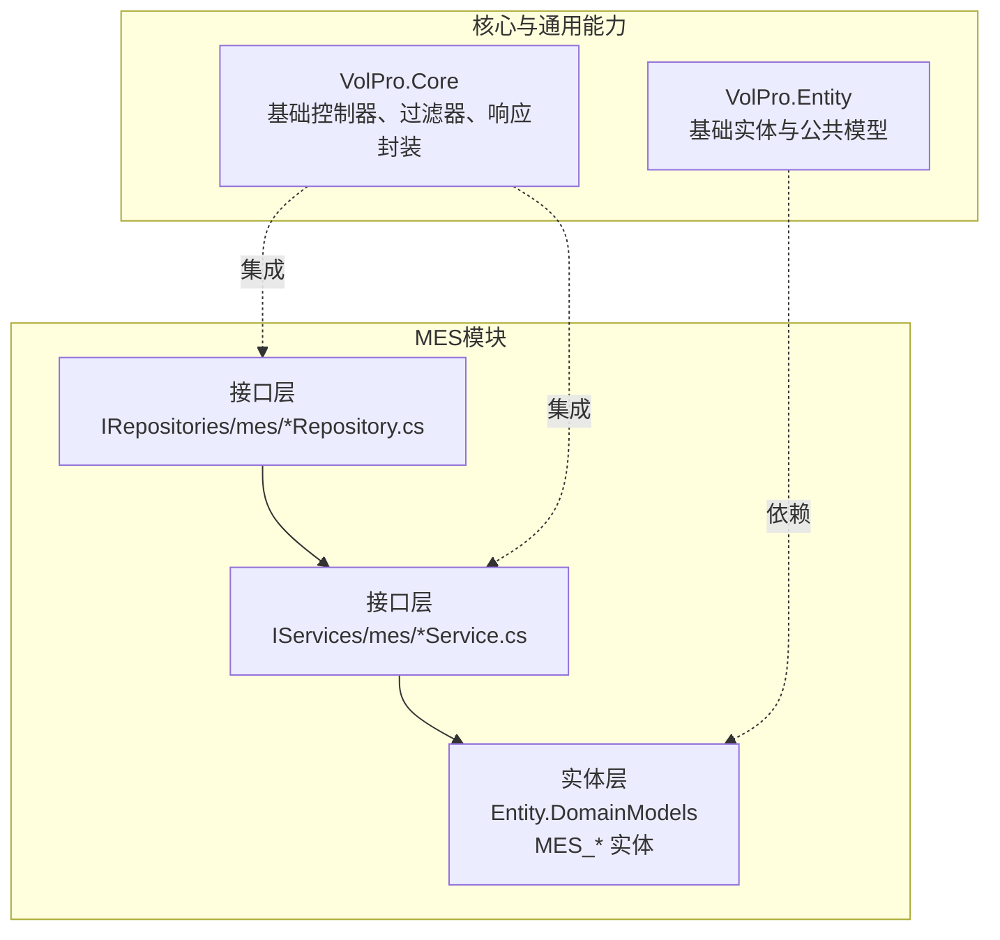
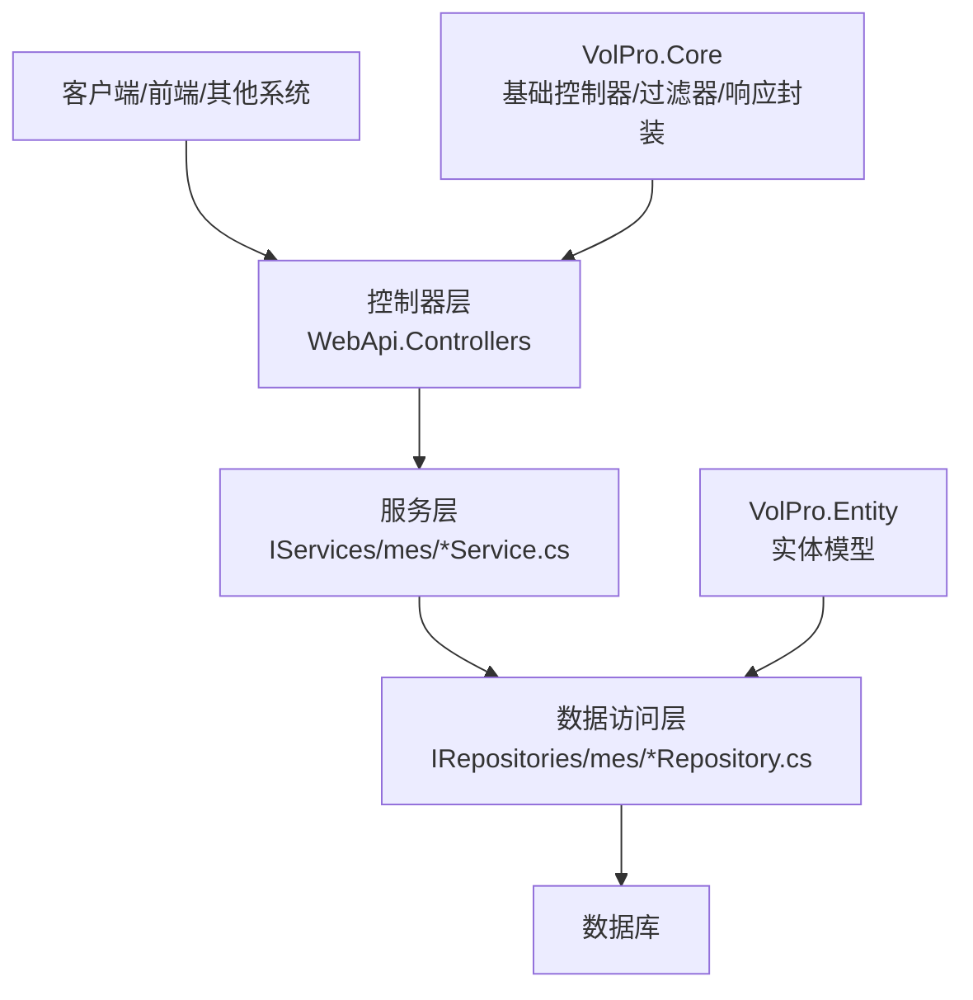
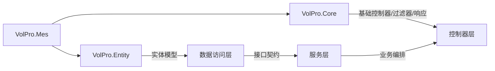

# 制造执行API

<cite>
**本文引用的文件**
- [VolPro.Mes.csproj](file://VolPro.Mes/VolPro.Mes.csproj)
- [IMES_ProductionOrderRepository.cs](file://VolPro.Mes/IRepositories/mes/IMES_ProductionOrderRepository.cs)
- [IMES_ProductionOrderService.cs](file://VolPro.Mes/IServices/mes/IMES_ProductionOrderService.cs)
- [IMES_MaterialRepository.cs](file://VolPro.Mes/IRepositories/mes/IMES_MaterialRepository.cs)
- [IMES_EquipmentManagementRepository.cs](file://VolPro.Mes/IRepositories/mes/IMES_EquipmentManagementRepository.cs)
- [IMES_QualityInspectionRecordRepository.cs](file://VolPro.Mes/IRepositories/mes/IMES_QualityInspectionRecordRepository.cs)
- [IMES_WarehouseManagementRepository.cs](file://VolPro.Mes/IRepositories/mes/IMES_WarehouseManagementRepository.cs)
- [IMES_SchedulingPlanRepository.cs](file://VolPro.Mes/IRepositories/mes/IMES_SchedulingPlanRepository.cs)
</cite>

## 目录
1. [引言](#引言)
2. [项目结构](#项目结构)
3. [核心组件](#核心组件)
4. [架构总览](#架构总览)
5. [详细组件分析](#详细组件分析)
6. [依赖关系分析](#依赖关系分析)
7. [性能考虑](#性能考虑)
8. [故障排查指南](#故障排查指南)
9. [结论](#结论)
10. [附录](#附录)

## 引言
本文件面向制造执行系统（MES）模块的API接口文档，聚焦以下业务域：生产订单管理、物料管理、设备管理、质量管理、仓储管理与调度计划。文档基于仓库中现有的MES接口层与实体层进行梳理，明确各模块的接口职责边界，并给出端点设计原则、数据模型关系、业务流程验证规则与错误处理建议。由于当前仓库未包含具体控制器实现与实体定义文件，本文以接口与项目结构为依据，提供可落地的API设计蓝图与集成策略。

## 项目结构
MES模块采用分层架构，主要由三层构成：
- 接口层（IRepositories、IServices）：定义数据访问与服务契约，便于注入与扩展。
- 实体层（Entity）：承载业务实体与字段约束。
- 控制器层（WebApi）：对外暴露REST API，调用服务层完成业务编排。

图示来源
- [VolPro.Mes.csproj:1-23](file://VolPro.Mes/VolPro.Mes.csproj#L1-L23)

章节来源
- [VolPro.Mes.csproj:1-23](file://VolPro.Mes/VolPro.Mes.csproj#L1-L23)

## 核心组件
本节对MES模块的关键接口进行归类与职责说明，为后续API端点设计提供依据。

- 生产订单管理
  - 接口：IMES_ProductionOrderRepository、IMES_ProductionOrderService
  - 职责：提供生产订单的增删改查、状态流转与明细关联能力
- 物料管理
  - 接口：IMES_MaterialRepository
  - 职责：提供物料主数据与库存相关的数据访问能力
- 设备管理
  - 接口：IMES_EquipmentManagementRepository
  - 职责：提供设备档案、状态与位置等数据访问能力
- 质量管理
  - 接口：IMES_QualityInspectionRecordRepository
  - 职责：提供质量检验记录的数据访问能力
- 仓储管理
  - 接口：IMES_WarehouseManagementRepository
  - 职责：提供仓储出入库、盘点与库存调整等数据访问能力
- 调度计划
  - 接口：IMES_SchedulingPlanRepository
  - 职责：提供生产计划、班次与排程相关数据访问能力

章节来源
- [IMES_ProductionOrderRepository.cs:1-19](file://VolPro.Mes/IRepositories/mes/IMES_ProductionOrderRepository.cs#L1-L19)
- [IMES_ProductionOrderService.cs:1-13](file://VolPro.Mes/IServices/mes/IMES_ProductionOrderService.cs#L1-L13)
- [IMES_MaterialRepository.cs:1-19](file://VolPro.Mes/IRepositories/mes/IMES_MaterialRepository.cs#L1-L19)
- [IMES_EquipmentManagementRepository.cs:1-19](file://VolPro.Mes/IRepositories/mes/IMES_EquipmentManagementRepository.cs#L1-L19)
- [IMES_QualityInspectionRecordRepository.cs:1-19](file://VolPro.Mes/IRepositories/mes/IMES_QualityInspectionRecordRepository.cs#L1-L19)
- [IMES_WarehouseManagementRepository.cs:1-19](file://VolPro.Mes/IRepositories/mes/IMES_WarehouseManagementRepository.cs#L1-L19)
- [IMES_SchedulingPlanRepository.cs:1-19](file://VolPro.Mes/IRepositories/mes/IMES_SchedulingPlanRepository.cs#L1-L19)

## 架构总览
MES模块通过接口层与实体层解耦，控制器层负责HTTP协议转换与业务编排。核心能力包括：
- 基础控制器与统一响应封装（来自VolPro.Core）
- 数据访问与服务抽象（来自MES接口层）
- 实体模型与字段约束（来自VolPro.Entity）

图示来源
- [VolPro.Mes.csproj:17-20](file://VolPro.Mes/VolPro.Mes.csproj#L17-L20)

## 详细组件分析

### 生产订单管理API设计
- 设计原则
  - 使用REST风格端点，遵循资源化命名
  - 统一使用基础控制器返回结构，确保一致的响应格式
  - 对关键字段设置必填与长度限制，避免脏数据进入业务流程
- 端点建议
  - GET /api/production-orders：查询生产订单列表（支持分页、筛选）
  - GET /api/production-orders/{id}：获取单个生产订单详情
  - POST /api/production-orders：创建生产订单
  - PUT /api/production-orders/{id}：更新生产订单
  - DELETE /api/production-orders/{id}：删除生产订单
  - POST /api/production-orders/{id}/cancel：取消生产订单
  - POST /api/production-orders/{id}/complete：完成生产订单
- 请求参数与响应格式
  - 请求参数：采用表单或JSON提交，字段需满足实体约束
  - 响应格式：统一使用基础控制器封装的响应结构
- 业务规则
  - 订单状态机：新建→已下发→执行中→已完成/已取消
  - 关联校验：订单与BOM、工艺路线、人员、设备等的关联完整性
- 错误处理
  - 参数校验失败：返回400及错误信息
  - 业务规则不满足：返回422及业务提示
  - 服务器异常：返回500及错误摘要

章节来源
- [IMES_ProductionOrderRepository.cs:1-19](file://VolPro.Mes/IRepositories/mes/IMES_ProductionOrderRepository.cs#L1-L19)
- [IMES_ProductionOrderService.cs:1-13](file://VolPro.Mes/IServices/mes/IMES_ProductionOrderService.cs#L1-L13)

### 物料管理API设计
- 设计原则
  - 物料主数据与库存分离管理，支持多仓库、多批次
  - 入库/出库与质检联动，保证账实一致
- 端点建议
  - GET /api/materials：查询物料列表
  - GET /api/materials/{id}：获取物料详情
  - POST /api/materials：新增物料
  - PUT /api/materials/{id}：修改物料
  - POST /api/materials/import-batch：批量导入物料
- 请求参数与响应格式
  - 字段必填性与类型校验，单位、规格、供应商等字段约束
- 业务规则
  - 物料编码唯一；安全库存与最高库存阈值控制
  - 入库/出库必须有对应单据支撑
- 错误处理
  - 编码冲突：返回409
  - 库存不足：返回409并提示原因

章节来源
- [IMES_MaterialRepository.cs:1-19](file://VolPro.Mes/IRepositories/mes/IMES_MaterialRepository.cs#L1-L19)

### 设备管理API设计
- 设计原则
  - 设备档案与运行状态实时同步
  - 维保与维修工单闭环管理
- 端点建议
  - GET /api/equipment：查询设备列表
  - GET /api/equipment/{id}：获取设备详情
  - POST /api/equipment：新增设备
  - PUT /api/equipment/{id}：更新设备
  - POST /api/equipment/{id}/maintenance：发起维保任务
  - POST /api/equipment/{id}/repair：发起维修任务
  - GET /api/equipment/{id}/fault-records：查看故障记录
- 请求参数与响应格式
  - 设备编号唯一；关键字段如位置、责任人、启用状态等必填
- 业务规则
  - 设备状态：停用/在用/维修/报废；状态变更需审批
  - 维保周期与到期提醒
- 错误处理
  - 设备不存在：返回404
  - 维保/维修任务冲突：返回409

章节来源
- [IMES_EquipmentManagementRepository.cs:1-19](file://VolPro.Mes/IRepositories/mes/IMES_EquipmentManagementRepository.cs#L1-L19)

### 质量管理API设计
- 设计原则
  - 检验计划驱动检验任务，检验结果闭环
  - 支持首检、巡检、终检与让步放行
- 端点建议
  - GET /api/quality-inspections：查询检验记录列表
  - GET /api/quality-inspections/{id}：获取检验记录详情
  - POST /api/quality-inspections：创建检验任务
  - PUT /api/quality-inspections/{id}：更新检验结果
  - POST /api/quality-inspections/{id}/approve：批准检验结果
  - GET /api/quality-inspections/plans：获取检验计划
- 请求参数与响应格式
  - 检验项、判定标准、结果、判定人等字段约束
- 业务规则
  - 不合格品隔离与处置流程
  - 检验通过后方可进入下一工序
- 错误处理
  - 检验项缺失：返回422
  - 已关闭任务不可再编辑：返回409

章节来源
- [IMES_QualityInspectionRecordRepository.cs:1-19](file://VolPro.Mes/IRepositories/mes/IMES_QualityInspectionRecordRepository.cs#L1-L19)

### 仓储管理API设计
- 设计原则
  - 先进先出与批次管理，支持收发存汇总
  - 出入库与质检联动，确保账实相符
- 端点建议
  - GET /api/warehouse/inventory：查询库存列表
  - GET /api/warehouse/inventory/{id}：查询库存详情
  - POST /api/warehouse/inbound：创建入库单
  - POST /api/warehouse/outbound：创建出库单
  - GET /api/warehouse/inbound/{id}：获取入库单详情
  - GET /api/warehouse/outbound/{id}：获取出库单详情
  - POST /api/warehouse/inbound/{id}/confirm：确认入库
  - POST /api/warehouse/outbound/{id}/confirm：确认出库
- 请求参数与响应格式
  - 数量、单价、批次、有效期等字段校验
- 业务规则
  - 入库单需质检通过后才能确认
  - 出库单需满足可用库存与批次有效期
- 错误处理
  - 库存不足：返回409
  - 批次过期：返回409并提示

章节来源
- [IMES_WarehouseManagementRepository.cs:1-19](file://VolPro.Mes/IRepositories/mes/IMES_WarehouseManagementRepository.cs#L1-L19)

### 调度计划API设计
- 设计原则
  - 计划与执行解耦，支持计划变更与追溯
  - 与设备、人员、物料协同排程
- 端点建议
  - GET /api/scheduling-plans：查询计划列表
  - GET /api/scheduling-plans/{id}：获取计划详情
  - POST /api/scheduling-plans：创建计划
  - PUT /api/scheduling-plans/{id}：更新计划
  - POST /api/scheduling-plans/{id}/change：变更计划
  - GET /api/scheduling-plans/{id}/details：查看计划明细
- 请求参数与响应格式
  - 开始/结束时间、数量、优先级、班次等字段约束
- 业务规则
  - 同时段设备/人员冲突检测
  - 变更需审批与记录
- 错误处理
  - 冲突检测失败：返回409
  - 计划已执行不可随意变更：返回409

章节来源
- [IMES_SchedulingPlanRepository.cs:1-19](file://VolPro.Mes/IRepositories/mes/IMES_SchedulingPlanRepository.cs#L1-L19)

## 依赖关系分析
MES模块依赖核心框架与实体层，形成清晰的分层依赖：

图示来源
- [VolPro.Mes.csproj:17-20](file://VolPro.Mes/VolPro.Mes.csproj#L17-L20)

章节来源
- [VolPro.Mes.csproj:17-20](file://VolPro.Mes/VolPro.Mes.csproj#L17-L20)

## 性能考虑
- 查询优化
  - 对高频查询建立索引，合理使用分页与筛选条件
  - 对关联查询进行必要的预加载与投影
- 写入优化
  - 批量导入/导出采用事务与分批处理
  - 入库/出库与库存更新采用乐观锁或版本号控制
- 缓存策略
  - 常用字典与配置缓存于内存或Redis，降低数据库压力
- 并发控制
  - 关键业务（如库存扣减）使用分布式锁或数据库层面的并发控制

## 故障排查指南
- 参数校验失败
  - 现象：返回400，包含字段级错误信息
  - 处理：检查请求体字段类型、必填性与范围
- 业务规则不满足
  - 现象：返回422，包含业务提示
  - 处理：核对状态机、关联完整性与阈值约束
- 资源冲突或状态不合法
  - 现象：返回409，包含冲突描述
  - 处理：检查并发写入、重复操作与状态流转
- 服务器内部错误
  - 现象：返回500，包含错误摘要
  - 处理：查看日志与异常堆栈，定位服务层或数据访问层问题

## 结论
本文基于现有MES接口层与项目结构，给出了生产订单、物料、设备、质量、仓储与调度计划六大领域的API设计蓝图。通过统一的接口契约、严格的业务规则与错误处理机制，可确保各模块间协作顺畅、数据完整可靠。后续可在控制器层补充具体实现，并结合实体定义完善字段约束与校验逻辑。

## 附录
- 术语说明
  - MES：制造执行系统
  - API：应用程序接口
  - DTO：数据传输对象
  - ORM：对象关系映射
- 参考规范
  - RESTful API 设计最佳实践
  - HTTP 状态码使用规范
  - 统一响应结构约定