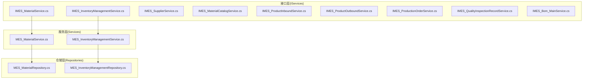
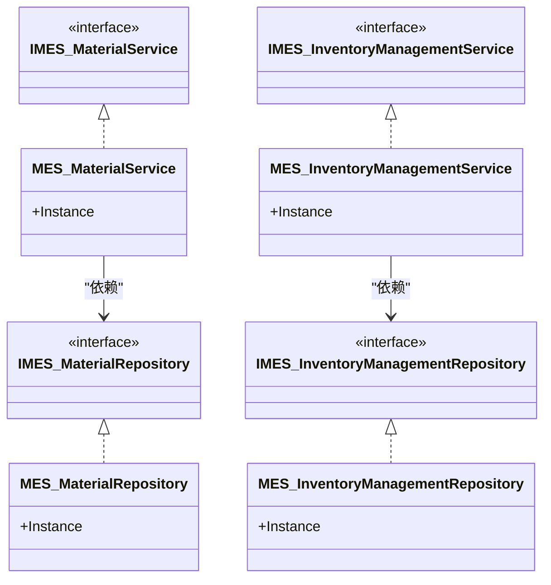
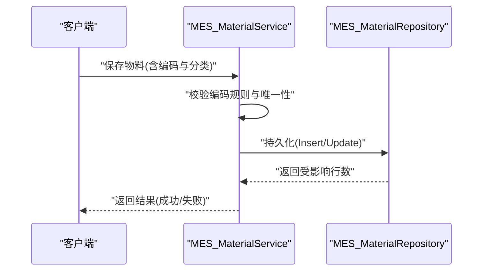
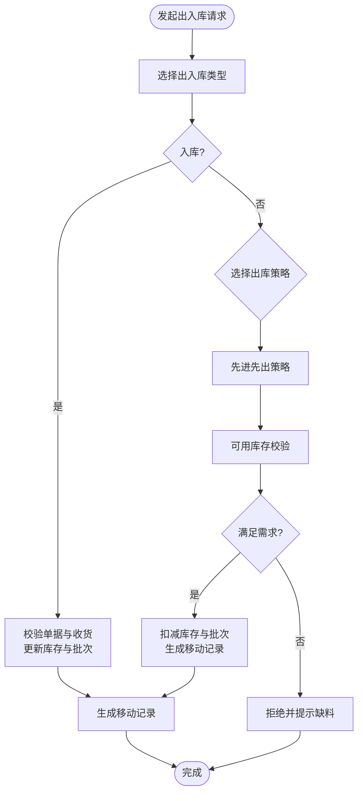
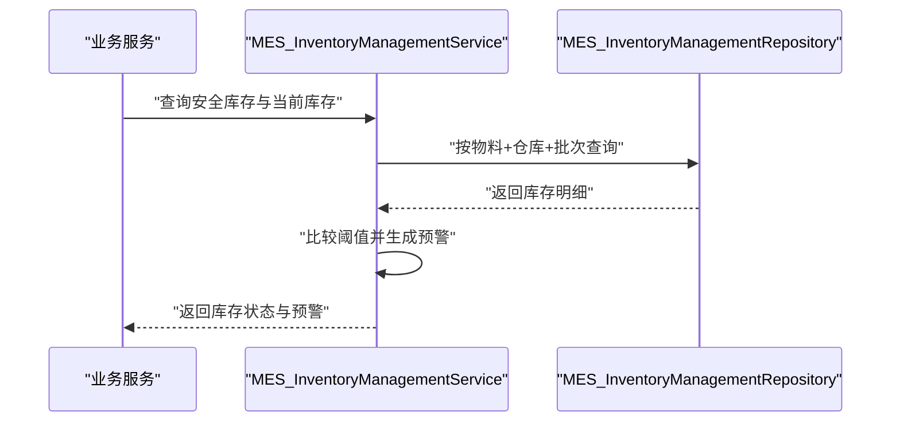
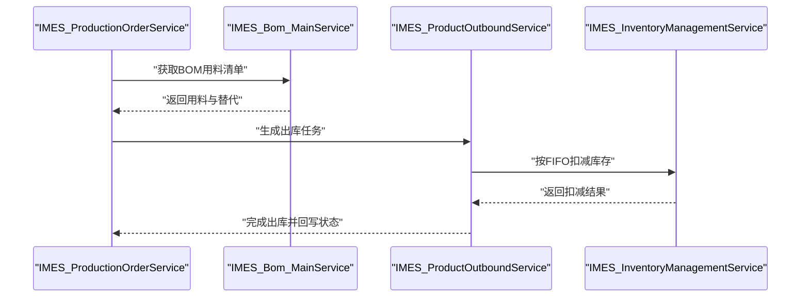
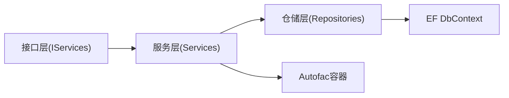

# 物料管理API

<cite>
**本文引用的文件**
- [IMES_MaterialService.cs](file://VolPro.Mes/IServices/mes/IMES_MaterialService.cs)
- [MES_MaterialService.cs](file://VolPro.Mes/Services/mes/MES_MaterialService.cs)
- [MES_MaterialRepository.cs](file://VolPro.Mes/Repositories/mes/MES_MaterialRepository.cs)
- [IMES_InventoryManagementService.cs](file://VolPro.Mes/IServices/mes/IMES_InventoryManagementService.cs)
- [MES_InventoryManagementService.cs](file://VolPro.Mes/Services/mes/MES_InventoryManagementService.cs)
- [MES_InventoryManagementRepository.cs](file://VolPro.Mes/Repositories/mes/MES_InventoryManagementRepository.cs)
- [IMES_SupplierService.cs](file://VolPro.Mes/IServices/mes/IMES_SupplierService.cs)
- [IMES_MaterialCatalogService.cs](file://VolPro.Mes/IServices/mes/IMES_MaterialCatalogService.cs)
- [IMES_ProductInboundService.cs](file://VolPro.Mes/IServices/mes/IMES_ProductInboundService.cs)
- [IMES_ProductOutboundService.cs](file://VolPro.Mes/IServices/mes/IMES_ProductOutboundService.cs)
- [IMES_ProductionOrderService.cs](file://VolPro.Mes/IServices/mes/IMES_ProductionOrderService.cs)
- [IMES_QualityInspectionRecordService.cs](file://VolPro.Mes/IServices/mes/IMES_QualityInspectionRecordService.cs)
- [IMES_Bom_MainService.cs](file://VolPro.Mes/IServices/mes/IMES_Bom_MainService.cs)
</cite>

## 目录
1. [简介](#简介)
2. [项目结构](#项目结构)
3. [核心组件](#核心组件)
4. [架构总览](#架构总览)
5. [详细组件分析](#详细组件分析)
6. [依赖关系分析](#依赖关系分析)
7. [性能考虑](#性能考虑)
8. [故障排查指南](#故障排查指南)
9. [结论](#结论)
10. [附录](#附录)

## 简介
本文件为“物料管理API”的综合技术文档，面向后端开发与系统集成人员，聚焦于物料全生命周期管理的API设计与实现要点，包括但不限于：
- 物料基础信息与分类管理
- 供应商管理
- 入库、出库与库存管理
- 采购订单与收货检验
- 库存盘点、移动记录与安全库存
- 与生产订单、BOM、质量检验等模块的数据集成

文档基于现有代码库中的MES模块接口与服务层进行梳理，并结合通用物料管理业务实践给出API设计建议与集成指引。

## 项目结构
MES模块采用分层架构（接口层、服务层、仓储层）组织物料相关能力，典型文件分布如下：
- 接口层：位于 IServices/mes 下，声明各领域服务契约（如 IMES_MaterialService、IMES_InventoryManagementService 等）
- 服务层：位于 Services/mes 下，提供具体业务逻辑封装与依赖注入入口
- 仓储层：位于 Repositories/mes 下，封装数据访问与查询能力

图表来源
- [IMES_MaterialService.cs:1-13](file://VolPro.Mes/IServices/mes/IMES_MaterialService.cs#L1-L13)
- [MES_MaterialService.cs:1-23](file://VolPro.Mes/Services/mes/MES_MaterialService.cs#L1-L23)
- [MES_MaterialRepository.cs:1-25](file://VolPro.Mes/Repositories/mes/MES_MaterialRepository.cs#L1-L25)
- [IMES_InventoryManagementService.cs:1-13](file://VolPro.Mes/IServices/mes/IMES_InventoryManagementService.cs#L1-L13)
- [MES_InventoryManagementService.cs:1-23](file://VolPro.Mes/Services/mes/MES_InventoryManagementService.cs#L1-L23)
- [MES_InventoryManagementRepository.cs:1-25](file://VolPro.Mes/Repositories/mes/MES_InventoryManagementRepository.cs#L1-L25)

章节来源
- [IMES_MaterialService.cs:1-13](file://VolPro.Mes/IServices/mes/IMES_MaterialService.cs#L1-L13)
- [MES_MaterialService.cs:1-23](file://VolPro.Mes/Services/mes/MES_MaterialService.cs#L1-L23)
- [MES_MaterialRepository.cs:1-25](file://VolPro.Mes/Repositories/mes/MES_MaterialRepository.cs#L1-L25)
- [IMES_InventoryManagementService.cs:1-13](file://VolPro.Mes/IServices/mes/IMES_InventoryManagementService.cs#L1-L13)
- [MES_InventoryManagementService.cs:1-23](file://VolPro.Mes/Services/mes/MES_InventoryManagementService.cs#L1-L23)
- [MES_InventoryManagementRepository.cs:1-25](file://VolPro.Mes/Repositories/mes/MES_InventoryManagementRepository.cs#L1-L25)

## 核心组件
- 物料主数据服务：负责物料基础信息的增删改查、分类关联、编码规则校验等
- 供应商服务：维护供应商档案、评估与结算相关数据
- 物料分类服务：支持多级分类、树形结构与检索
- 入库服务：支持采购入库、调拨入库、盘盈入库等场景
- 出库服务：支持生产领料、销售出库、调拨出库等场景
- 库存服务：实时库存计算、批次与有效期管理、先进先出策略
- 生产订单服务：承接BOM用料需求，驱动出库与库存扣减
- 质量检验服务：收货质检、不合格品处理与记录
- BOM主数据服务：物料替代、齐套性与用料清单管理

章节来源
- [IMES_MaterialService.cs:1-13](file://VolPro.Mes/IServices/mes/IMES_MaterialService.cs#L1-L13)
- [IMES_SupplierService.cs:1-13](file://VolPro.Mes/IServices/mes/IMES_SupplierService.cs#L1-L13)
- [IMES_MaterialCatalogService.cs:1-13](file://VolPro.Mes/IServices/mes/IMES_MaterialCatalogService.cs#L1-L13)
- [IMES_ProductInboundService.cs:1-13](file://VolPro.Mes/IServices/mes/IMES_ProductInboundService.cs#L1-L13)
- [IMES_ProductOutboundService.cs:1-13](file://VolPro.Mes/IServices/mes/IMES_ProductOutboundService.cs#L1-L13)
- [IMES_InventoryManagementService.cs:1-13](file://VolPro.Mes/IServices/mes/IMES_InventoryManagementService.cs#L1-L13)
- [IMES_ProductionOrderService.cs:1-13](file://VolPro.Mes/IServices/mes/IMES_ProductionOrderService.cs#L1-L13)
- [IMES_QualityInspectionRecordService.cs:1-13](file://VolPro.Mes/IServices/mes/IMES_QualityInspectionRecordService.cs#L1-L13)
- [IMES_Bom_MainService.cs:1-13](file://VolPro.Mes/IServices/mes/IMES_Bom_MainService.cs#L1-L13)

## 架构总览
MES模块遵循接口-服务-仓储三层分离，通过Autofac进行依赖注入，确保可测试性与可扩展性。接口层定义领域服务契约，服务层聚合业务逻辑并协调仓储，仓储层负责数据持久化。

图表来源
- [IMES_MaterialService.cs:1-13](file://VolPro.Mes/IServices/mes/IMES_MaterialService.cs#L1-L13)
- [MES_MaterialService.cs:1-23](file://VolPro.Mes/Services/mes/MES_MaterialService.cs#L1-L23)
- [MES_MaterialRepository.cs:1-25](file://VolPro.Mes/Repositories/mes/MES_MaterialRepository.cs#L1-L25)
- [IMES_InventoryManagementService.cs:1-13](file://VolPro.Mes/IServices/mes/IMES_InventoryManagementService.cs#L1-L13)
- [MES_InventoryManagementService.cs:1-23](file://VolPro.Mes/Services/mes/MES_InventoryManagementService.cs#L1-L23)
- [MES_InventoryManagementRepository.cs:1-25](file://VolPro.Mes/Repositories/mes/MES_InventoryManagementRepository.cs#L1-L25)

## 详细组件分析

### 物料主数据服务
- 职责：物料基础信息维护、与分类/供应商关联、编码规则校验、属性与规格管理
- 接口与实现：IMES_MaterialService 契约，MES_MaterialService 提供实例化入口，MES_MaterialRepository 承载数据访问
- 关键流程：新增/编辑时触发编码唯一性与规则校验；删除前检查是否存在未完结的出入库或订单

图表来源
- [MES_MaterialService.cs:1-23](file://VolPro.Mes/Services/mes/MES_MaterialService.cs#L1-L23)
- [MES_MaterialRepository.cs:1-25](file://VolPro.Mes/Repositories/mes/MES_MaterialRepository.cs#L1-L25)

章节来源
- [IMES_MaterialService.cs:1-13](file://VolPro.Mes/IServices/mes/IMES_MaterialService.cs#L1-L13)
- [MES_MaterialService.cs:1-23](file://VolPro.Mes/Services/mes/MES_MaterialService.cs#L1-L23)
- [MES_MaterialRepository.cs:1-25](file://VolPro.Mes/Repositories/mes/MES_MaterialRepository.cs#L1-L25)

### 供应商服务
- 职责：供应商档案、资质、价格与结算周期管理
- 集成点：采购订单下单时选择供应商，影响采购到货计划与应付账款

章节来源
- [IMES_SupplierService.cs:1-13](file://VolPro.Mes/IServices/mes/IMES_SupplierService.cs#L1-L13)

### 物料分类服务
- 职责：多级分类树、分类维度与检索过滤
- 集成点：物料新增时绑定分类，支持按分类统计与报表

章节来源
- [IMES_MaterialCatalogService.cs:1-13](file://VolPro.Mes/IServices/mes/IMES_MaterialCatalogService.cs#L1-L13)

### 入库与出库服务
- 入库服务：支持采购入库、调拨入库、盘盈入库等；记录批次、有效期、仓库货位
- 出库服务：支持生产领料、销售出库、调拨出库等；执行先进先出策略与齐套性检查
- 集成点：与库存服务协同，保证实时库存一致性与移动记录完整

图表来源
- [IMES_ProductInboundService.cs:1-13](file://VolPro.Mes/IServices/mes/IMES_ProductInboundService.cs#L1-L13)
- [IMES_ProductOutboundService.cs:1-13](file://VolPro.Mes/IServices/mes/IMES_ProductOutboundService.cs#L1-L13)
- [IMES_InventoryManagementService.cs:1-13](file://VolPro.Mes/IServices/mes/IMES_InventoryManagementService.cs#L1-L13)

章节来源
- [IMES_ProductInboundService.cs:1-13](file://VolPro.Mes/IServices/mes/IMES_ProductInboundService.cs#L1-L13)
- [IMES_ProductOutboundService.cs:1-13](file://VolPro.Mes/IServices/mes/IMES_ProductOutboundService.cs#L1-L13)
- [IMES_InventoryManagementService.cs:1-13](file://VolPro.Mes/IServices/mes/IMES_InventoryManagementService.cs#L1-L13)

### 库存管理服务
- 职责：实时库存计算、批次与有效期追踪、先进先出策略执行、安全库存与预警
- 关键字段：可用数量、锁定数量、批次号、生产日期、失效日期
- 预警机制：低于安全库存触发告警；临近有效期触发提醒

图表来源
- [MES_InventoryManagementService.cs:1-23](file://VolPro.Mes/Services/mes/MES_InventoryManagementService.cs#L1-L23)
- [MES_InventoryManagementRepository.cs:1-25](file://VolPro.Mes/Repositories/mes/MES_InventoryManagementRepository.cs#L1-L25)

章节来源
- [IMES_InventoryManagementService.cs:1-13](file://VolPro.Mes/IServices/mes/IMES_InventoryManagementService.cs#L1-L13)
- [MES_InventoryManagementService.cs:1-23](file://VolPro.Mes/Services/mes/MES_InventoryManagementService.cs#L1-L23)
- [MES_InventoryManagementRepository.cs:1-25](file://VolPro.Mes/Repositories/mes/MES_InventoryManagementRepository.cs#L1-L25)

### 生产订单与BOM集成
- 生产订单服务：接收生产计划，派生用料需求
- BOM主数据服务：提供替代物料与齐套性校验
- 集成点：出库环节根据BOM自动匹配替代与扣减

图表来源
- [IMES_ProductionOrderService.cs:1-13](file://VolPro.Mes/IServices/mes/IMES_ProductionOrderService.cs#L1-L13)
- [IMES_Bom_MainService.cs:1-13](file://VolPro.Mes/IServices/mes/IMES_Bom_MainService.cs#L1-L13)
- [IMES_ProductOutboundService.cs:1-13](file://VolPro.Mes/IServices/mes/IMES_ProductOutboundService.cs#L1-L13)
- [IMES_InventoryManagementService.cs:1-13](file://VolPro.Mes/IServices/mes/IMES_InventoryManagementService.cs#L1-L13)

章节来源
- [IMES_ProductionOrderService.cs:1-13](file://VolPro.Mes/IServices/mes/IMES_ProductionOrderService.cs#L1-L13)
- [IMES_Bom_MainService.cs:1-13](file://VolPro.Mes/IServices/mes/IMES_Bom_MainService.cs#L1-L13)
- [IMES_ProductOutboundService.cs:1-13](file://VolPro.Mes/IServices/mes/IMES_ProductOutboundService.cs#L1-L13)
- [IMES_InventoryManagementService.cs:1-13](file://VolPro.Mes/IServices/mes/IMES_InventoryManagementService.cs#L1-L13)

### 质量检验服务
- 职责：收货检验计划与记录、不合格品处理、质量追溯
- 集成点：入库前必须完成质检，合格方可入可用库存

章节来源
- [IMES_QualityInspectionRecordService.cs:1-13](file://VolPro.Mes/IServices/mes/IMES_QualityInspectionRecordService.cs#L1-L13)

## 依赖关系分析
- 组件耦合：服务层对仓储层存在直接依赖，接口层仅暴露契约，降低耦合度
- 依赖注入：通过 Autofac 容器统一解析服务实例，便于替换与测试
- 外部依赖：EF DbContext 提供数据库访问能力，仓储层基于此进行CRUD

图表来源
- [MES_MaterialService.cs:1-23](file://VolPro.Mes/Services/mes/MES_MaterialService.cs#L1-L23)
- [MES_MaterialRepository.cs:1-25](file://VolPro.Mes/Repositories/mes/MES_MaterialRepository.cs#L1-L25)

章节来源
- [MES_MaterialService.cs:1-23](file://VolPro.Mes/Services/mes/MES_MaterialService.cs#L1-L23)
- [MES_MaterialRepository.cs:1-25](file://VolPro.Mes/Repositories/mes/MES_MaterialRepository.cs#L1-L25)

## 性能考虑
- 查询优化：对常用查询建立索引（物料编码、分类、仓库货位、批次号），避免N+1查询
- 批处理：批量入库/出库时使用事务与批量写入，减少往返开销
- 缓存策略：对静态字典（分类、单位、供应商等级）启用缓存，降低重复查询
- 并发控制：库存扣减使用乐观锁或行级锁，避免超卖
- 日志与监控：对高频接口埋点，关注响应时间与错误率

## 故障排查指南
- 常见问题
  - 编码冲突：新增物料时报编码重复，需检查唯一性约束与规则
  - 库存不足：出库失败提示缺料，需核对可用库存与安全库存
  - 批次过期：临近有效期触发预警，需及时处理滞留库存
  - 质检未完成：入库前未质检导致阻塞，需完善流程控制
- 排查步骤
  - 检查服务日志与异常中间件输出
  - 核对仓储层SQL执行计划与索引使用情况
  - 对比业务单据状态流转，定位卡点环节
  - 回放关键接口请求参数，复现问题场景

## 结论
MES模块已具备物料主数据、供应商、分类、出入库、库存、生产订单、BOM与质量检验的核心服务能力。建议在此基础上补充HTTP控制器层以暴露REST API，并完善异常处理、鉴权与审计日志，形成闭环的物料管理API体系。

## 附录
- API设计建议（概念性，非代码映射）
  - 物料主数据：GET/POST/PUT/DELETE /api/materials
  - 供应商：GET/POST/PUT /api/suppliers
  - 物料分类：GET/POST/PUT /api/material/catalogs
  - 入库单：POST /api/inbound/create, GET /api/inbound/list
  - 出库单：POST /api/outbound/create, GET /api/outbound/list
  - 库存查询：GET /api/inventory/batch/{batchNo}, GET /api/inventory/warehouse/{locId}
  - 安全库存：GET /api/inventory/alerts
  - 生产用料：POST /api/production/order/{id}/allocate
  - 质检：POST /api/quality/inspect, GET /api/quality/history
  - 数据集成：与ERP/WMS/PLM通过消息队列或Webhook对接