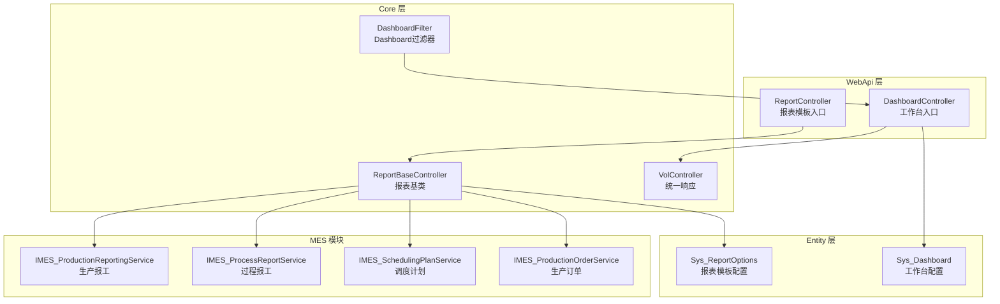
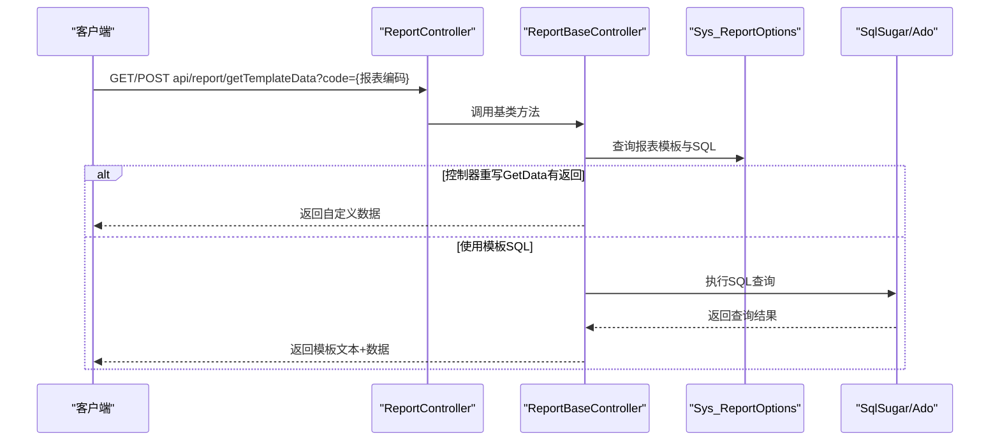
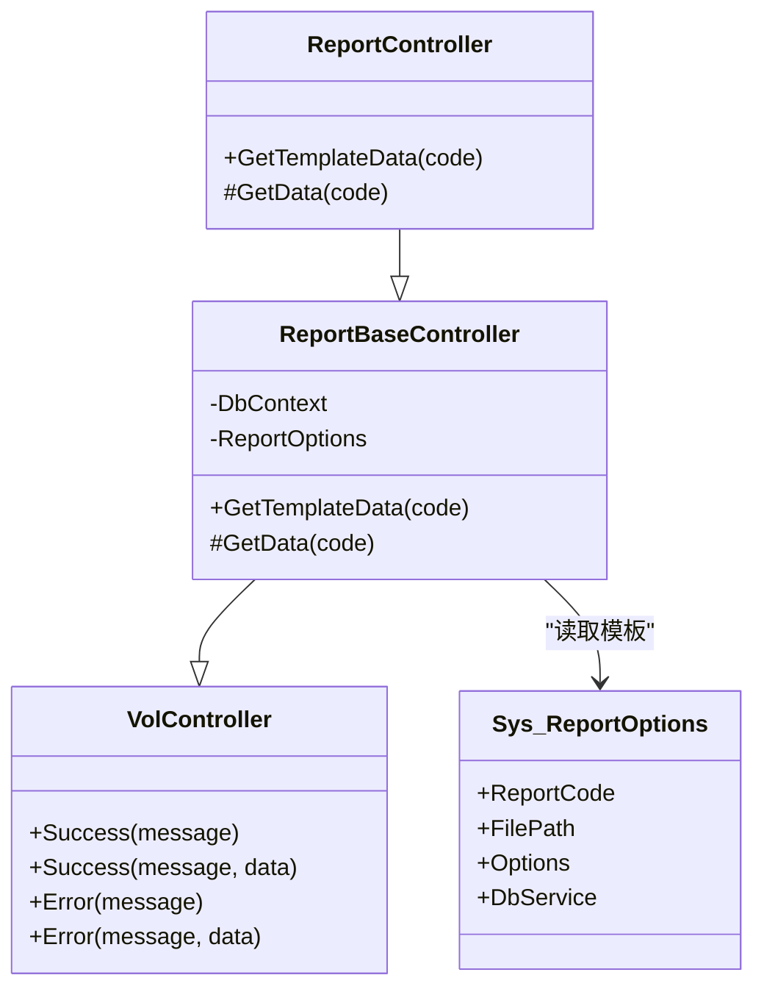
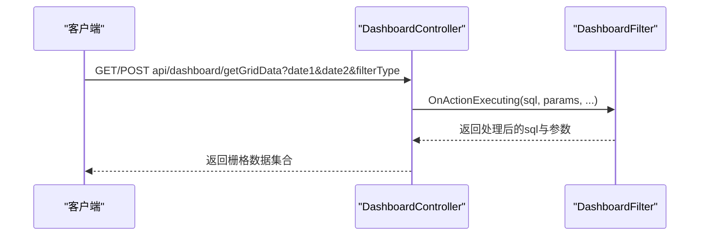
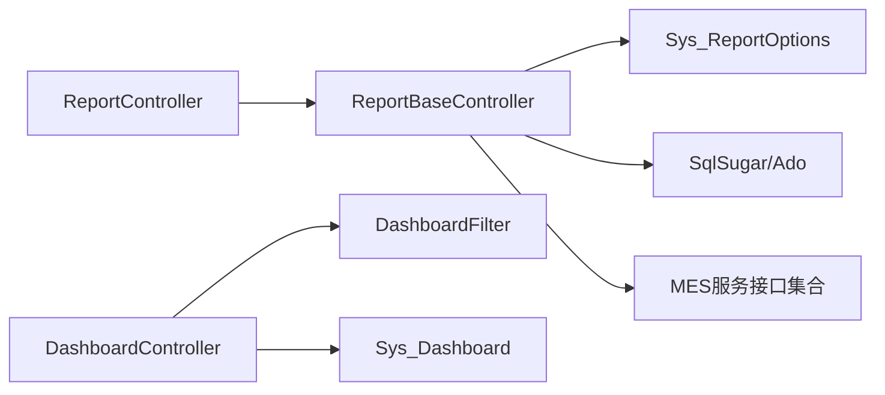

# 生产报表API

<cite>
**本文引用的文件**
- [ReportController.cs](file://VolPro.WebApi/Controllers/Report/ReportController.cs)
- [ReportBaseController.cs](file://VolPro.Core/Controllers/Basic/ReportBaseController.cs)
- [VolController.cs](file://VolPro.Core/Controllers/Basic/VolController.cs)
- [Sys_ReportOptions.cs](file://VolPro.Entity/DomainModels/System/Sys_ReportOptions.cs)
- [DashboardController.cs](file://VolPro.WebApi/Controllers/Dashboard/DashboardController.cs)
- [DashboardFilter.cs](file://VolPro.Core/Dashboard/DashboardFilter.cs)
- [Sys_Dashboard.cs](file://VolPro.Entity/DomainModels/Dashboard/Sys_Dashboard.cs)
- [IMES_ProductionReportingService.cs](file://VolPro.Mes/IServices/mes/IMES_ProductionReportingService.cs)
- [IMES_ProcessReportService.cs](file://VolPro.Mes/IServices/mes/IMES_ProcessReportService.cs)
- [IMES_SchedulingPlanService.cs](file://VolPro.Mes/IServices/mes/IMES_SchedulingPlanService.cs)
- [IMES_ProductionOrderService.cs](file://VolPro.Mes/IServices/mes/IMES_ProductionOrderService.cs)
</cite>

## 目录
1. [简介](#简介)
2. [项目结构](#项目结构)
3. [核心组件](#核心组件)
4. [架构总览](#架构总览)
5. [详细组件分析](#详细组件分析)
6. [依赖关系分析](#依赖关系分析)
7. [性能考量](#性能考量)
8. [故障排查指南](#故障排查指南)
9. [结论](#结论)
10. [附录](#附录)

## 简介
本文件面向生产报表API的综合文档，聚焦于生产统计报表、过程监控报表、调度计划报表等生产数据展示能力。内容涵盖：
- 关键指标查询接口：生产计划完成率、设备利用率、产品质量指标、物料消耗统计等
- 报表数据计算逻辑、时间维度选择、部门层级汇总、对比分析等
- 实时生产看板、历史趋势分析、异常预警通知等可视化能力
- 生产报表与生产执行（MES）、质量管理、成本控制等模块的数据关联
- 生产绩效评估与优化建议的数据支撑方案

## 项目结构
该系统采用分层+模块化架构：
- WebApi 层：对外暴露HTTP接口，负责路由与响应封装
- Core 层：通用基础控制器、数据库连接管理、Dashboard过滤器等
- Entity 层：领域模型，包括报表模板、工作台配置等
- MES 模块：生产执行相关服务接口（生产报工、过程报工、调度计划、生产订单等）
- 报表模板机制：通过Sys_ReportOptions配置模板、SQL与目标数据库，动态渲染

图表来源
- [ReportController.cs:12-299](file://VolPro.WebApi/Controllers/Report/ReportController.cs#L12-L299)
- [ReportBaseController.cs:17-89](file://VolPro.Core/Controllers/Basic/ReportBaseController.cs#L17-L89)
- [VolController.cs:8-49](file://VolPro.Core/Controllers/Basic/VolController.cs#L8-L49)
- [Sys_ReportOptions.cs:17-189](file://VolPro.Entity/DomainModels/System/Sys_ReportOptions.cs#L17-L189)
- [DashboardController.cs:11-37](file://VolPro.WebApi/Controllers/Dashboard/DashboardController.cs#L11-L37)
- [DashboardFilter.cs:15-45](file://VolPro.Core/Dashboard/DashboardFilter.cs#L15-L45)
- [Sys_Dashboard.cs:17-179](file://VolPro.Entity/DomainModels/Dashboard/Sys_Dashboard.cs#L17-L179)
- [IMES_ProductionReportingService.cs:9-11](file://VolPro.Mes/IServices/mes/IMES_ProductionReportingService.cs#L9-L11)
- [IMES_ProcessReportService.cs:9-11](file://VolPro.Mes/IServices/mes/IMES_ProcessReportService.cs#L9-L11)
- [IMES_SchedulingPlanService.cs:9-11](file://VolPro.Mes/IServices/mes/IMES_SchedulingPlanService.cs#L9-L11)
- [IMES_ProductionOrderService.cs:9-11](file://VolPro.Mes/IServices/mes/IMES_ProductionOrderService.cs#L9-L11)

章节来源
- [ReportController.cs:12-299](file://VolPro.WebApi/Controllers/Report/ReportController.cs#L12-L299)
- [ReportBaseController.cs:17-89](file://VolPro.Core/Controllers/Basic/ReportBaseController.cs#L17-L89)
- [VolController.cs:8-49](file://VolPro.Core/Controllers/Basic/VolController.cs#L8-L49)
- [Sys_ReportOptions.cs:17-189](file://VolPro.Entity/DomainModels/System/Sys_ReportOptions.cs#L17-L189)
- [DashboardController.cs:11-37](file://VolPro.WebApi/Controllers/Dashboard/DashboardController.cs#L11-L37)
- [DashboardFilter.cs:15-45](file://VolPro.Core/Dashboard/DashboardFilter.cs#L15-L45)
- [Sys_Dashboard.cs:17-179](file://VolPro.Entity/DomainModels/Dashboard/Sys_Dashboard.cs#L17-L179)
- [IMES_ProductionReportingService.cs:9-11](file://VolPro.Mes/IServices/mes/IMES_ProductionReportingService.cs#L9-L11)
- [IMES_ProcessReportService.cs:9-11](file://VolPro.Mes/IServices/mes/IMES_ProcessReportService.cs#L9-L11)
- [IMES_SchedulingPlanService.cs:9-11](file://VolPro.Mes/IServices/mes/IMES_SchedulingPlanService.cs#L9-L11)
- [IMES_ProductionOrderService.cs:9-11](file://VolPro.Mes/IServices/mes/IMES_ProductionOrderService.cs#L9-L11)

## 核心组件
- 报表模板与数据源
  - 报表模板通过Sys_ReportOptions配置，包含模板文件路径、数据源SQL、目标数据库标识等
  - ReportBaseController根据code加载模板与SQL，优先执行控制器重写的GetData，否则执行SQL查询
- 基础控制器
  - VolController提供统一的成功/失败响应封装
  - ReportBaseController负责模板解析、SQL执行与数据返回
- Dashboard工作台
  - DashboardController提供工作台栅格数据示例接口
  - DashboardFilter可对Dashboard SQL进行参数注入与过滤规则扩展

章节来源
- [Sys_ReportOptions.cs:17-189](file://VolPro.Entity/DomainModels/System/Sys_ReportOptions.cs#L17-L189)
- [ReportBaseController.cs:17-89](file://VolPro.Core/Controllers/Basic/ReportBaseController.cs#L17-L89)
- [VolController.cs:8-49](file://VolPro.Core/Controllers/Basic/VolController.cs#L8-L49)
- [DashboardController.cs:11-37](file://VolPro.WebApi/Controllers/Dashboard/DashboardController.cs#L11-L37)
- [DashboardFilter.cs:15-45](file://VolPro.Core/Dashboard/DashboardFilter.cs#L15-L45)

## 架构总览
生产报表API以“模板驱动 + 数据源解耦”为核心设计：
- 模板层：Sys_ReportOptions定义模板元信息与SQL
- 控制器层：ReportController按code分派具体报表数据；ReportBaseController统一加载模板与执行SQL
- 数据访问层：通过DBServerProvider选择目标数据库，SqlSugar执行查询
- 可视化层：DashboardController提供工作台数据；DashboardFilter支持参数化过滤

图表来源
- [ReportController.cs:21-78](file://VolPro.WebApi/Controllers/Report/ReportController.cs#L21-L78)
- [ReportBaseController.cs:58-78](file://VolPro.Core/Controllers/Basic/ReportBaseController.cs#L58-L78)
- [Sys_ReportOptions.cs:17-189](file://VolPro.Entity/DomainModels/System/Sys_ReportOptions.cs#L17-L189)

## 详细组件分析

### 报表模板与控制器
- ReportController
  - 提供模板数据入口：GetTemplateData(code)
  - 通过重写GetData(code)实现按模板编码返回自定义数据
  - 示例：针对特定code返回表格数据（用于演示）
- ReportBaseController
  - 解析模板：根据code从Sys_ReportOptions读取模板与SQL
  - 加载数据库上下文：依据DbService选择目标数据库
  - 统一返回：优先使用控制器提供的数据，否则执行SQL并包装为Table返回

图表来源
- [VolController.cs:8-49](file://VolPro.Core/Controllers/Basic/VolController.cs#L8-L49)
- [ReportBaseController.cs:17-89](file://VolPro.Core/Controllers/Basic/ReportBaseController.cs#L17-L89)
- [ReportController.cs:13-49](file://VolPro.WebApi/Controllers/Report/ReportController.cs#L13-L49)
- [Sys_ReportOptions.cs:17-189](file://VolPro.Entity/DomainModels/System/Sys_ReportOptions.cs#L17-L189)

章节来源
- [ReportController.cs:21-78](file://VolPro.WebApi/Controllers/Report/ReportController.cs#L21-L78)
- [ReportBaseController.cs:17-89](file://VolPro.Core/Controllers/Basic/ReportBaseController.cs#L17-L89)
- [Sys_ReportOptions.cs:17-189](file://VolPro.Entity/DomainModels/System/Sys_ReportOptions.cs#L17-L189)

### Dashboard工作台
- DashboardController
  - 提供栅格数据示例接口，返回各类业务指标聚合值
- DashboardFilter
  - 支持对Dashboard SQL进行参数化处理，便于按日期范围、用户等条件过滤

图表来源
- [DashboardController.cs:22-35](file://VolPro.WebApi/Controllers/Dashboard/DashboardController.cs#L22-L35)
- [DashboardFilter.cs:27-44](file://VolPro.Core/Dashboard/DashboardFilter.cs#L27-L44)

章节来源
- [DashboardController.cs:11-37](file://VolPro.WebApi/Controllers/Dashboard/DashboardController.cs#L11-L37)
- [DashboardFilter.cs:15-45](file://VolPro.Core/Dashboard/DashboardFilter.cs#L15-L45)
- [Sys_Dashboard.cs:17-179](file://VolPro.Entity/DomainModels/Dashboard/Sys_Dashboard.cs#L17-L179)

### 生产执行与质量相关服务接口
- 生产报工：IMES_ProductionReportingService
- 过程报工：IMES_ProcessReportService
- 调度计划：IMES_SchedulingPlanService
- 生产订单：IMES_ProductionOrderService

这些接口作为报表数据来源之一，可在模板SQL或控制器重写方法中进行组合查询，实现生产计划完成率、过程监控、质量检验等指标的统计。

章节来源
- [IMES_ProductionReportingService.cs:9-11](file://VolPro.Mes/IServices/mes/IMES_ProductionReportingService.cs#L9-L11)
- [IMES_ProcessReportService.cs:9-11](file://VolPro.Mes/IServices/mes/IMES_ProcessReportService.cs#L9-L11)
- [IMES_SchedulingPlanService.cs:9-11](file://VolPro.Mes/IServices/mes/IMES_SchedulingPlanService.cs#L9-L11)
- [IMES_ProductionOrderService.cs:9-11](file://VolPro.Mes/IServices/mes/IMES_ProductionOrderService.cs#L9-L11)

## 依赖关系分析
- 报表模板依赖Sys_ReportOptions，决定模板文件与SQL
- ReportBaseController依赖DBServerProvider选择数据库上下文
- ReportController继承ReportBaseController，扩展按code返回数据的能力
- DashboardController与DashboardFilter配合，实现工作台数据的参数化过滤
- MES服务接口为报表提供生产执行、过程监控、调度与订单等数据源

图表来源
- [ReportController.cs:13-49](file://VolPro.WebApi/Controllers/Report/ReportController.cs#L13-L49)
- [ReportBaseController.cs:17-89](file://VolPro.Core/Controllers/Basic/ReportBaseController.cs#L17-L89)
- [Sys_ReportOptions.cs:17-189](file://VolPro.Entity/DomainModels/System/Sys_ReportOptions.cs#L17-L189)
- [DashboardController.cs:11-37](file://VolPro.WebApi/Controllers/Dashboard/DashboardController.cs#L11-L37)
- [DashboardFilter.cs:15-45](file://VolPro.Core/Dashboard/DashboardFilter.cs#L15-L45)
- [Sys_Dashboard.cs:17-179](file://VolPro.Entity/DomainModels/Dashboard/Sys_Dashboard.cs#L17-L179)

章节来源
- [ReportController.cs:13-49](file://VolPro.WebApi/Controllers/Report/ReportController.cs#L13-L49)
- [ReportBaseController.cs:17-89](file://VolPro.Core/Controllers/Basic/ReportBaseController.cs#L17-L89)
- [Sys_ReportOptions.cs:17-189](file://VolPro.Entity/DomainModels/System/Sys_ReportOptions.cs#L17-L189)
- [DashboardController.cs:11-37](file://VolPro.WebApi/Controllers/Dashboard/DashboardController.cs#L11-L37)
- [DashboardFilter.cs:15-45](file://VolPro.Core/Dashboard/DashboardFilter.cs#L15-L45)
- [Sys_Dashboard.cs:17-179](file://VolPro.Entity/DomainModels/Dashboard/Sys_Dashboard.cs#L17-L179)

## 性能考量
- 模板SQL执行
  - 建议在Sys_ReportOptions中预置索引友好的SQL，并限制默认时间范围
  - 对大表查询使用分页或分段聚合，避免一次性返回海量数据
- 数据库选择
  - 通过DbService区分报表专用库或主业务库，避免报表查询影响主业务性能
- 缓存策略
  - 对静态或低频变更的报表数据，结合缓存中间件减少重复查询
- Dashboard过滤
  - 利用DashboardFilter集中处理日期范围、用户维度等参数，减少SQL拼接错误与重复计算

## 故障排查指南
- 模板不存在
  - 现象：返回“模板不存在”
  - 处理：确认ReportCode正确，Sys_ReportOptions中存在对应记录
- SQL执行失败
  - 现象：模板SQL报错或无数据
  - 处理：检查DbService指向的数据库连接、SQL语法与权限；必要时在ReportController重写GetData提供兜底数据
- 参数缺失
  - 现象：Dashboard接口返回空集或全量数据
  - 处理：确保date1/date2/filterType传入；在DashboardFilter中完善参数注入逻辑

章节来源
- [ReportBaseController.cs:41-44](file://VolPro.Core/Controllers/Basic/ReportBaseController.cs#L41-L44)
- [ReportBaseController.cs:73-77](file://VolPro.Core/Controllers/Basic/ReportBaseController.cs#L73-L77)
- [DashboardController.cs:22-35](file://VolPro.WebApi/Controllers/Dashboard/DashboardController.cs#L22-L35)
- [DashboardFilter.cs:27-44](file://VolPro.Core/Dashboard/DashboardFilter.cs#L27-L44)

## 结论
本生产报表API以模板驱动的方式实现了灵活的数据展示与扩展能力，结合MES模块的服务接口，能够支撑生产计划完成率、设备利用率、质量指标与物料消耗等关键指标的可视化呈现。通过Dashboard工作台与过滤器机制，进一步增强了实时看板、历史趋势与对比分析的可用性。建议后续在模板SQL优化、缓存策略与异常告警方面持续完善，以提升整体性能与稳定性。

## 附录

### 接口清单与说明
- 报表模板数据
  - 方法：GET/POST
  - 路径：api/report/getTemplateData
  - 参数：code（报表编码）
  - 行为：优先返回控制器重写的数据；否则执行模板SQL并返回模板文本与数据
- 工作台栅格数据
  - 方法：GET/POST
  - 路径：api/dashboard/getGridData
  - 参数：date1、date2、filterType
  - 行为：返回工作台指标集合（示例）

章节来源
- [ReportController.cs:21-78](file://VolPro.WebApi/Controllers/Report/ReportController.cs#L21-L78)
- [ReportBaseController.cs:58-78](file://VolPro.Core/Controllers/Basic/ReportBaseController.cs#L58-L78)
- [DashboardController.cs:22-35](file://VolPro.WebApi/Controllers/Dashboard/DashboardController.cs#L22-L35)