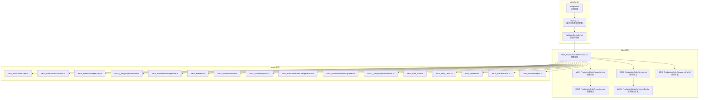
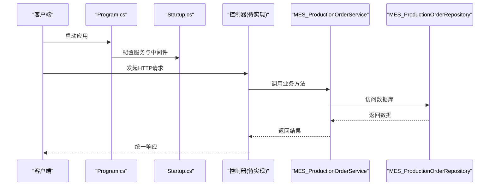
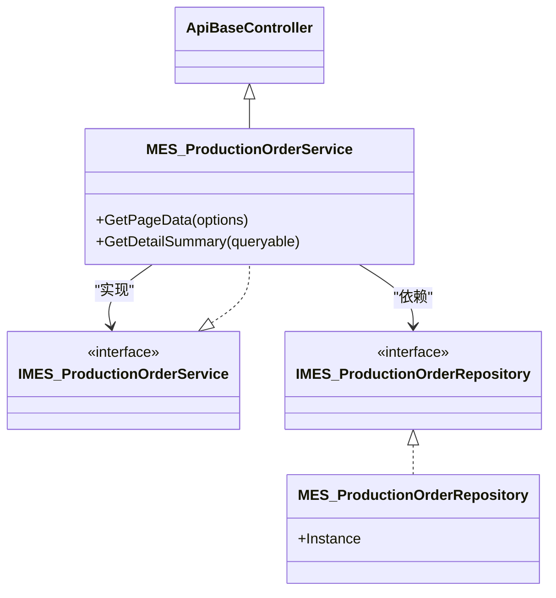
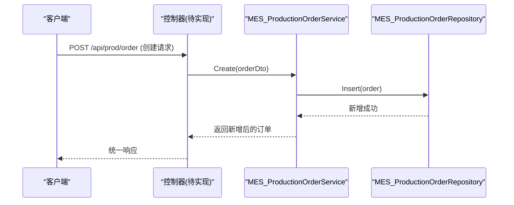
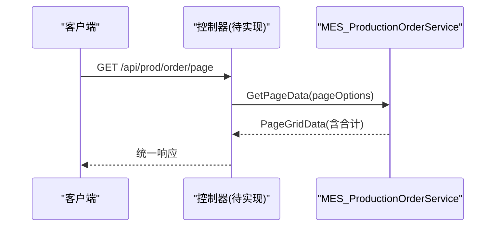
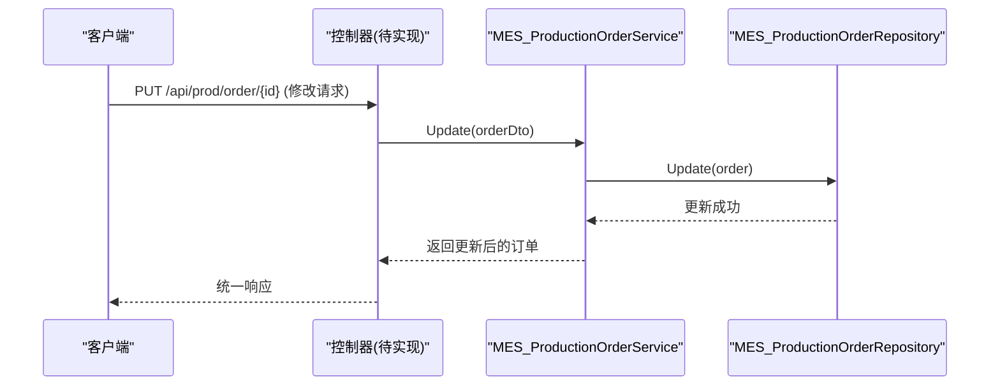
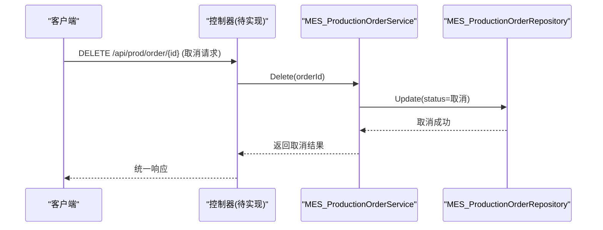
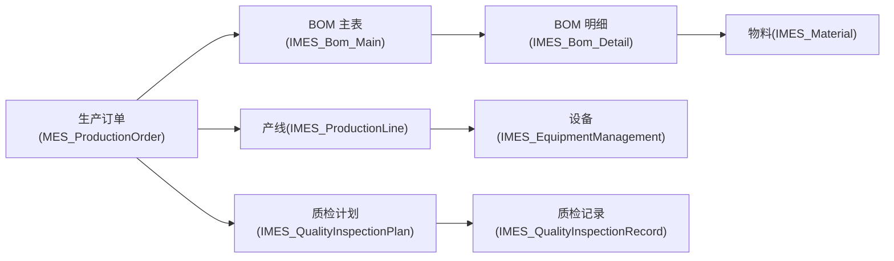
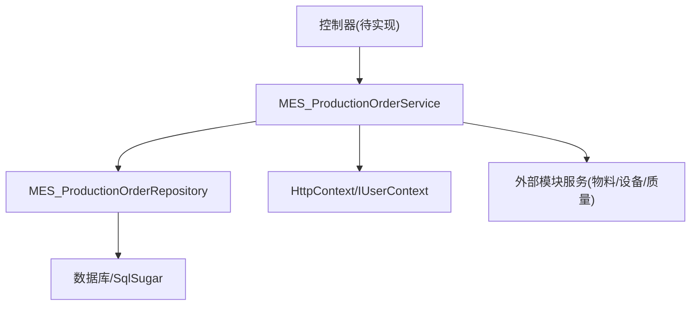

# 生产订单管理API

<cite>
**本文引用的文件**
- [Program.cs](file://VolPro.WebApi/Program.cs)
- [Startup.cs](file://VolPro.WebApi/Startup.cs)
- [ApiBaseController.cs](file://VolPro.Core/Controllers/Basic/ApiBaseController.cs)
- [IMES_ProductionOrderService.cs](file://VolPro.Mes/IServices/mes/IMES_ProductionOrderService.cs)
- [MES_ProductionOrderService.cs](file://VolPro.Mes/Services/mes/MES_ProductionOrderService.cs)
- [IMES_ProductionOrderRepository.cs](file://VolPro.Mes/IRepositories/mes/IMES_ProductionOrderRepository.cs)
- [MES_ProductionOrderRepository.cs](file://VolPro.Mes/Repositories/mes/MES_ProductionOrderRepository.cs)
- [IMES_ProductionOrderService.cs（Partial）](file://VolPro.Mes/IServices/mes/Partial/IMES_ProductionOrderService.cs)
- [MES_ProductionOrderService.cs（Partial）](file://VolPro.Mes/Services/mes/Partial/MES_ProductionOrderService.cs)
- [IMES_ProductionPlanDetailService.cs](file://VolPro.Mes/IServices/mes/IMES_ProductionPlanDetailService.cs)
- [IMES_ProductionReportingService.cs](file://VolPro.Mes/IServices/mes/IMES_ProductionReportingService.cs)
- [IMES_QualityInspectionPlanService.cs](file://VolPro.Mes/IServices/mes/IMES_QualityInspectionPlanService.cs)
- [IMES_EquipmentManagementService.cs](file://VolPro.Mes/IServices/mes/IMES_EquipmentManagementService.cs)
- [IMES_MaterialService.cs](file://VolPro.Mes/IServices/mes/IMES_MaterialService.cs)
- [IMES_ProductionLineService.cs](file://VolPro.Mes/IServices/mes/IMES_ProductionLineService.cs)
- [IMES_SchedulingPlanService.cs](file://VolPro.Mes/IServices/mes/IMES_SchedulingPlanService.cs)
- [IMES_ProductionPlanChangeRecordService.cs](file://VolPro.Mes/IServices/mes/IMES_ProductionPlanChangeRecordService.cs)
- [IMES_ProductionReportingDetailService.cs](file://VolPro.Mes/IServices/mes/IMES_ProductionReportingDetailService.cs)
- [IMES_QualityInspectionRecordService.cs](file://VolPro.Mes/IServices/mes/IMES_QualityInspectionRecordService.cs)
- [IMES_Bom_MainService.cs](file://VolPro.Mes/IServices/mes/IMES_Bom_MainService.cs)
- [IMES_Bom_DetailService.cs](file://VolPro.Mes/IServices/mes/IMES_Bom_DetailService.cs)
- [IMES_ProcessService.cs](file://VolPro.Mes/IServices/mes/IMES_ProcessService.cs)
- [IMES_ProcessRouteService.cs](file://VolPro.Mes/IServices/mes/IMES_ProcessRouteService.cs)
- [IMES_ProcessReportService.cs](file://VolPro.Mes/IServices/mes/IMES_ProcessReportService.cs)
- [IMES_ProductionOrderService.cs（对应实体）](file://VolPro.Entity/DomainModels/MES/MES_ProductionOrder.cs)
- [IMES_ProductionPlanDetail.cs](file://VolPro.Entity/DomainModels/MES/IMES_ProductionPlanDetail.cs)
- [IMES_ProductionReporting.cs](file://VolPro.Entity/DomainModels/MES/IMES_ProductionReporting.cs)
- [IMES_QualityInspectionPlan.cs](file://VolPro.Entity/DomainModels/MES/IMES_QualityInspectionPlan.cs)
- [IMES_EquipmentManagement.cs](file://VolPro.Entity/DomainModels/MES/IMES_EquipmentManagement.cs)
- [IMES_Material.cs](file://VolPro.Entity/DomainModels/MES/IMES_Material.cs)
- [IMES_ProductionLine.cs](file://VolPro.Entity/DomainModels/MES/IMES_ProductionLine.cs)
- [IMES_SchedulingPlan.cs](file://VolPro.Entity/DomainModels/MES/IMES_SchedulingPlan.cs)
- [IMES_ProductionPlanChangeRecord.cs](file://VolPro.Entity/DomainModels/MES/IMES_ProductionPlanChangeRecord.cs)
- [IMES_ProductionReportingDetail.cs](file://VolPro.Entity/DomainModels/MES/IMES_ProductionReportingDetail.cs)
- [IMES_QualityInspectionRecord.cs](file://VolPro.Entity/DomainModels/MES/IMES_QualityInspectionRecord.cs)
- [IMES_Bom_Main.cs](file://VolPro.Entity/DomainModels/MES/IMES_Bom_Main.cs)
- [IMES_Bom_Detail.cs](file://VolPro.Entity/DomainModels/MES/IMES_Bom_Detail.cs)
- [IMES_Process.cs](file://VolPro.Entity/DomainModels/MES/IMES_Process.cs)
- [IMES_ProcessRoute.cs](file://VolPro.Entity/DomainModels/MES/IMES_ProcessRoute.cs)
- [IMES_ProcessReport.cs](file://VolPro.Entity/DomainModels/MES/IMES_ProcessReport.cs)
</cite>

## 目录
1. [简介](#简介)
2. [项目结构](#项目结构)
3. [核心组件](#核心组件)
4. [架构总览](#架构总览)
5. [详细组件分析](#详细组件分析)
6. [依赖关系分析](#依赖关系分析)
7. [性能考量](#性能考量)
8. [故障排查指南](#故障排查指南)
9. [结论](#结论)
10. [附录](#附录)

## 简介
本文件面向“生产订单管理API”的设计与使用，聚焦于生产订单的创建、修改、查询、取消等核心操作，并扩展至生产计划制定、订单排程、生产进度跟踪、订单变更记录等关键流程。文档同时梳理生产订单与物料需求、设备资源、质量检验等模块的关联接口，给出生命周期管理、状态流转、批量操作与实时更新机制的说明，并提供典型业务场景的调用路径与错误处理策略。

## 项目结构
后端采用 ASP.NET Core + SqlSugar 架构，WebApi 层负责路由与中间件，Core 层提供基础能力（认证、过滤器、响应封装等），Mes 模块承载生产相关领域服务与仓储，Entity 定义实体模型。生产订单相关能力位于 Mes 模块的服务与仓储层，通过接口与部分类扩展实现业务逻辑。

**图表来源**
- [Program.cs:1-39](file://VolPro.WebApi/Program.cs#L1-L39)
- [Startup.cs:1-407](file://VolPro.WebApi/Startup.cs#L1-L407)
- [ApiBaseController.cs](file://VolPro.Core/Controllers/Basic/ApiBaseController.cs)
- [MES_ProductionOrderService.cs:1-23](file://VolPro.Mes/Services/mes/MES_ProductionOrderService.cs#L1-L23)
- [MES_ProductionOrderRepository.cs:1-25](file://VolPro.Mes/Repositories/mes/MES_ProductionOrderRepository.cs#L1-L25)
- [IMES_ProductionOrderService.cs:1-13](file://VolPro.Mes/IServices/mes/IMES_ProductionOrderService.cs#L1-L13)
- [IMES_ProductionOrderRepository.cs:1-19](file://VolPro.Mes/IRepositories/mes/IMES_ProductionOrderRepository.cs#L1-L19)
- [MES_ProductionOrderService.cs（Partial）:1-68](file://VolPro.Mes/Services/mes/Partial/MES_ProductionOrderService.cs#L1-L68)
- [IMES_ProductionOrderService.cs（Partial）:1-14](file://VolPro.Mes/IServices/mes/Partial/IMES_ProductionOrderService.cs#L1-L14)

**章节来源**
- [Program.cs:1-39](file://VolPro.WebApi/Program.cs#L1-L39)
- [Startup.cs:1-407](file://VolPro.WebApi/Startup.cs#L1-L407)

## 核心组件
- 基础控制器：提供统一的响应封装、分页查询、权限与过滤器支持，便于在各业务控制器中复用。
- 生产订单服务：继承通用服务基类，扩展分页汇总统计与明细汇总逻辑，便于在页面表格中展示合计。
- 生产订单仓储：基于通用仓储基类，提供数据库访问能力；通过依赖注入与工厂模式获取实例。
- 领域接口扩展：在 Partial 文件中扩展业务接口与服务实现，避免代码生成覆盖带来的风险。

上述组件共同构成生产订单管理API的业务内核，支撑后续的控制器与接口设计。

**章节来源**
- [ApiBaseController.cs](file://VolPro.Core/Controllers/Basic/ApiBaseController.cs)
- [MES_ProductionOrderService.cs:42-65](file://VolPro.Mes/Services/mes/MES_ProductionOrderService.cs#L42-L65)
- [MES_ProductionOrderRepository.cs:15-23](file://VolPro.Mes/Repositories/mes/MES_ProductionOrderRepository.cs#L15-L23)
- [IMES_ProductionOrderService.cs（Partial）:1-14](file://VolPro.Mes/IServices/mes/Partial/IMES_ProductionOrderService.cs#L1-L14)
- [MES_ProductionOrderService.cs（Partial）:1-68](file://VolPro.Mes/Services/mes/Partial/MES_ProductionOrderService.cs#L1-L68)

## 架构总览
系统通过 Startup 进行服务注册与中间件装配，包括认证、跨域、Swagger 文档、SignalR 等；Program 负责应用启动与 Kestrel 配置。生产订单相关服务通过 Autofac 注入容器，控制器继承基础控制器以获得统一的响应与过滤能力。

**图表来源**
- [Program.cs:17-36](file://VolPro.WebApi/Program.cs#L17-L36)
- [Startup.cs:60-213](file://VolPro.WebApi/Startup.cs#L60-L213)
- [MES_ProductionOrderService.cs:18-21](file://VolPro.Mes/Services/mes/MES_ProductionOrderService.cs#L18-L21)
- [MES_ProductionOrderRepository.cs:20-23](file://VolPro.Mes/Repositories/mes/MES_ProductionOrderRepository.cs#L20-L23)

## 详细组件分析

### 生产订单服务与仓储
- 服务层：继承通用服务基类，重写分页汇总与明细汇总逻辑，便于在前端表格中展示合计。
- 仓储层：提供静态实例获取方式，结合依赖注入与工厂模式，确保服务可测试与可替换。
- 接口扩展：在 Partial 中扩展业务接口与服务实现，避免被代码生成器覆盖。

**图表来源**
- [ApiBaseController.cs](file://VolPro.Core/Controllers/Basic/ApiBaseController.cs)
- [IMES_ProductionOrderService.cs:9-11](file://VolPro.Mes/IServices/mes/IMES_ProductionOrderService.cs#L9-L11)
- [MES_ProductionOrderService.cs:15-21](file://VolPro.Mes/Services/mes/MES_ProductionOrderService.cs#L15-L21)
- [IMES_ProductionOrderRepository.cs:15-17](file://VolPro.Mes/IRepositories/mes/IMES_ProductionOrderRepository.cs#L15-L17)
- [MES_ProductionOrderRepository.cs:20-23](file://VolPro.Mes/Repositories/mes/MES_ProductionOrderRepository.cs#L20-L23)

**章节来源**
- [MES_ProductionOrderService.cs:42-65](file://VolPro.Mes/Services/mes/MES_ProductionOrderService.cs#L42-L65)
- [MES_ProductionOrderRepository.cs:15-23](file://VolPro.Mes/Repositories/mes/MES_ProductionOrderRepository.cs#L15-L23)

### 生产订单生命周期与状态流转
- 生命周期阶段：创建、计划制定、排程下发、执行中、暂停/变更、完成/关闭、取消。
- 关键状态字段：建议在实体中定义状态枚举或状态机，支持状态校验与流转规则。
- 变更记录：通过“生产计划变更记录”模块追踪每次状态变更与原因。
- 批量操作：支持批量创建、批量取消、批量状态变更，需在控制器中实现并进行幂等与并发控制。

（本节为概念性说明，不直接分析具体文件）

### 典型业务流程时序

#### 创建生产订单

#### 查询生产订单列表与汇总

#### 修改生产订单

#### 取消生产订单

（以上时序图为概念性示意，用于说明调用链路与职责分工）

### 与物料需求、设备资源、质量检验的关联
- 物料需求：通过 BOM 主从表与库存管理联动，确保订单执行前的物料齐套。
- 设备资源：通过产线与设备管理模块进行可用性检查与排程绑定。
- 质量检验：通过质量检验计划与检验记录模块，实现过程与成品检验的闭环。

**图表来源**
- [IMES_Bom_MainService.cs](file://VolPro.Mes/IServices/mes/IMES_Bom_MainService.cs)
- [IMES_Bom_DetailService.cs](file://VolPro.Mes/IServices/mes/IMES_Bom_DetailService.cs)
- [IMES_MaterialService.cs](file://VolPro.Mes/IServices/mes/IMES_MaterialService.cs)
- [IMES_ProductionLineService.cs](file://VolPro.Mes/IServices/mes/IMES_ProductionLineService.cs)
- [IMES_EquipmentManagementService.cs](file://VolPro.Mes/IServices/mes/IMES_EquipmentManagementService.cs)
- [IMES_QualityInspectionPlanService.cs](file://VolPro.Mes/IServices/mes/IMES_QualityInspectionPlanService.cs)
- [IMES_QualityInspectionRecordService.cs](file://VolPro.Mes/IServices/mes/IMES_QualityInspectionRecordService.cs)

## 依赖关系分析
- 控制器依赖基础控制器与业务服务。
- 业务服务依赖仓储接口与上下文信息（如用户上下文、HttpContext）。
- 仓储通过数据库上下文访问实体模型。
- 外部模块（物料、设备、质量）通过各自服务接口与实体模型参与订单全生命周期。

**图表来源**
- [MES_ProductionOrderService.cs:27-41](file://VolPro.Mes/Services/mes/MES_ProductionOrderService.cs#L27-L41)
- [MES_ProductionOrderRepository.cs:15-23](file://VolPro.Mes/Repositories/mes/MES_ProductionOrderRepository.cs#L15-L23)

**章节来源**
- [MES_ProductionOrderService.cs:27-41](file://VolPro.Mes/Services/mes/MES_ProductionOrderService.cs#L27-L41)

## 性能考量
- 分页与汇总：服务层已内置分页与合计逻辑，建议在大数据量场景下合理设置分页大小与筛选条件。
- 数据库访问：仓储层基于 SqlSugar，建议在高频查询场景下建立必要索引与视图。
- 缓存策略：可结合内存缓存或 Redis 缓存热点数据（如状态字典、产线/设备可用性）。
- 并发控制：批量操作与状态变更需引入乐观锁或版本号控制，避免竞态条件。
- 日志与监控：统一响应与异常中间件有助于定位性能瓶颈与错误根因。

（本节为通用指导，不直接分析具体文件）

## 故障排查指南
- 认证失败：检查 JWT 配置与请求头中的 Authorization 字段格式。
- 跨域问题：确认 CORS 配置与前端地址白名单。
- 请求体过大：关注 Kestrel 与 IIS 的请求体大小限制。
- 异常处理：全局中间件统一捕获异常并返回标准响应格式。

**章节来源**
- [Startup.cs:84-114](file://VolPro.WebApi/Startup.cs#L84-L114)
- [Startup.cs:116-130](file://VolPro.WebApi/Startup.cs#L116-L130)
- [Program.cs:28-36](file://VolPro.WebApi/Program.cs#L28-L36)
- [Startup.cs:320-322](file://VolPro.WebApi/Startup.cs#L320-L322)

## 结论
本文梳理了生产订单管理API的架构与核心组件，明确了服务与仓储的职责边界，并给出了与物料、设备、质量模块的关联关系。通过分页汇总、状态流转与批量操作等机制，可满足生产订单的全生命周期管理需求。建议在控制器层按本文的调用链路与错误处理策略进行实现，确保接口稳定、可维护且具备良好的扩展性。

## 附录

### API 设计建议（概念性）
- 路径风格：RESTful 风格，资源名词复数形式。
- 方法映射：GET/POST/PUT/DELETE 对应查询/创建/更新/删除。
- 分页参数：page、pageSize、filters、orders。
- 统一响应：包含 code、status、message、data 等字段。
- 错误码规范：参考枚举与状态机，确保前后端一致。

（本节为通用设计建议，不直接分析具体文件）