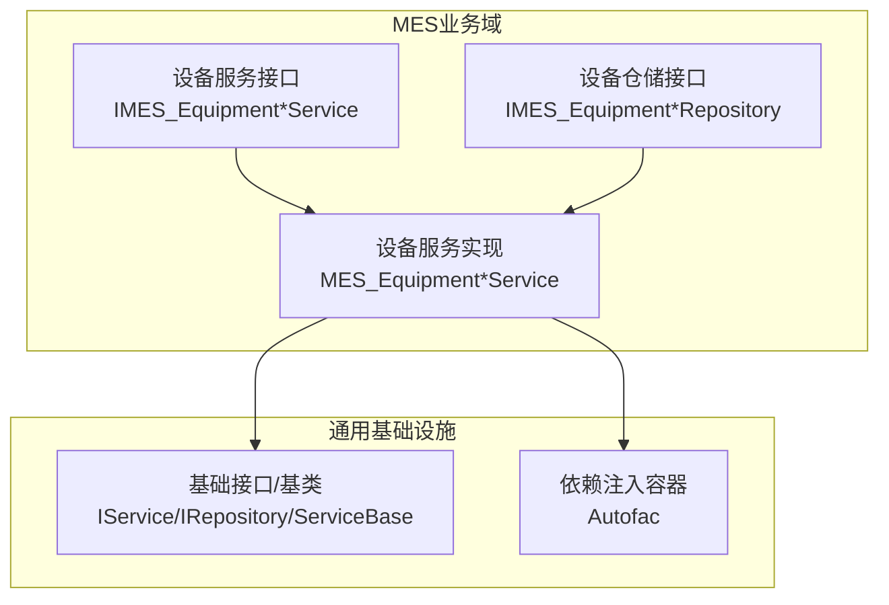
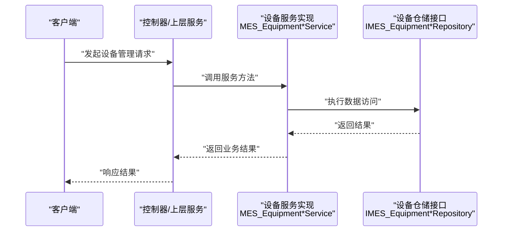
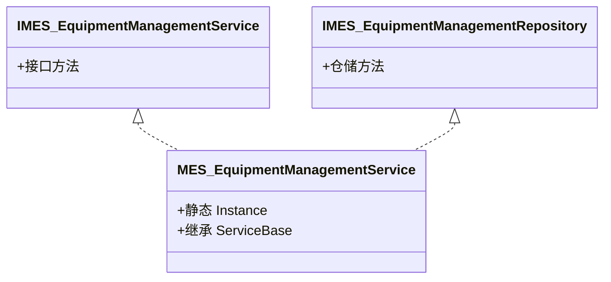
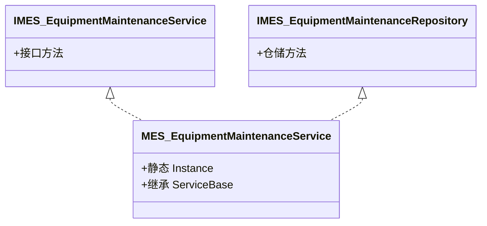
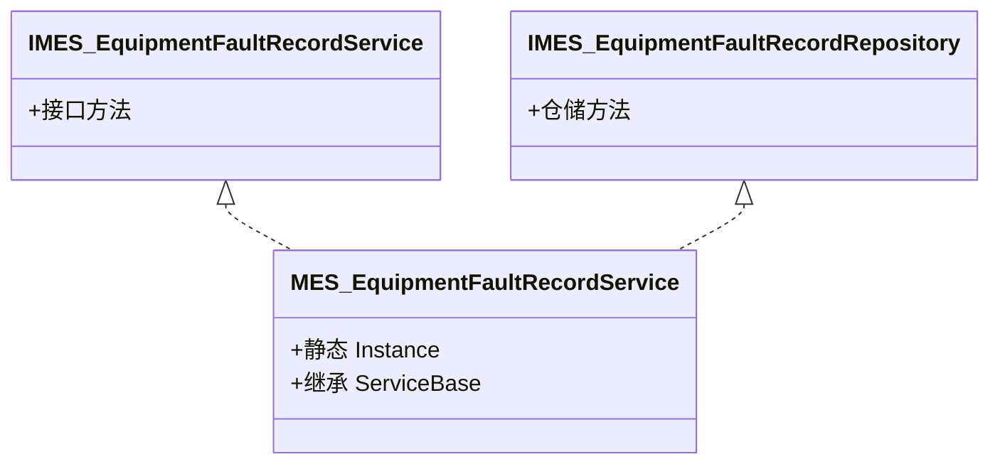
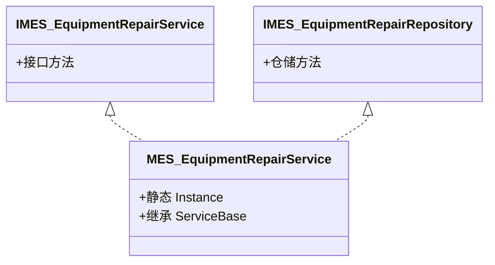
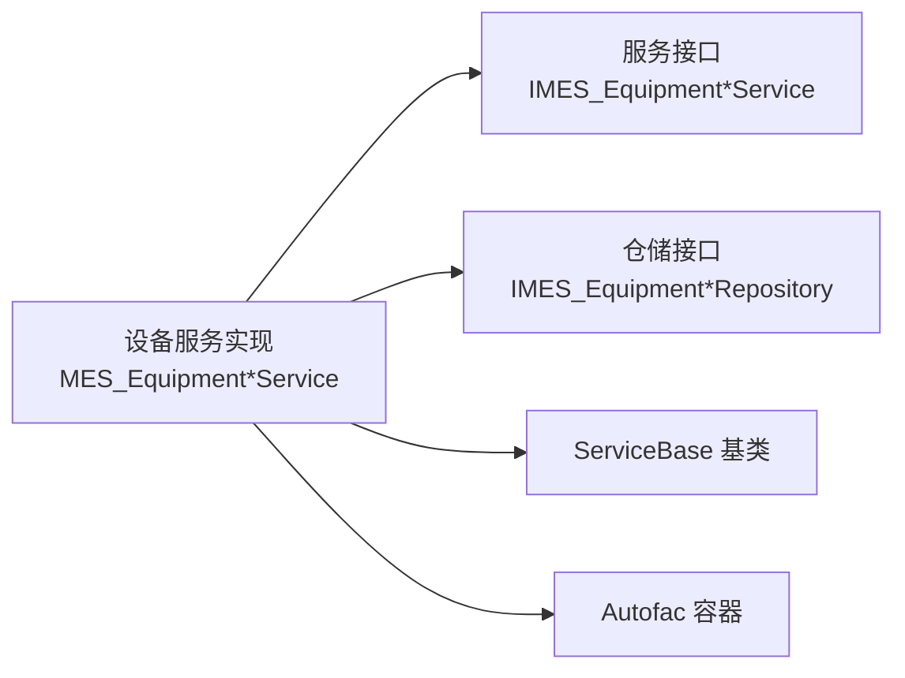

# 设备管理API

<cite>
**本文引用的文件**
- [IMES_EquipmentManagementService.cs](file://VolPro.Mes/IServices/mes/IMES_EquipmentManagementService.cs)
- [IMES_EquipmentMaintenanceService.cs](file://VolPro.Mes/IServices/mes/IMES_EquipmentMaintenanceService.cs)
- [IMES_EquipmentFaultRecordService.cs](file://VolPro.Mes/IServices/mes/IMES_EquipmentFaultRecordService.cs)
- [IMES_EquipmentRepairService.cs](file://VolPro.Mes/IServices/mes/IMES_EquipmentRepairService.cs)
- [IMES_EquipmentManagementRepository.cs](file://VolPro.Mes/IRepositories/mes/IMES_EquipmentManagementRepository.cs)
- [IMES_EquipmentMaintenanceRepository.cs](file://VolPro.Mes/IRepositories/mes/IMES_EquipmentMaintenanceRepository.cs)
- [IMES_EquipmentFaultRecordRepository.cs](file://VolPro.Mes/IRepositories/mes/IMES_EquipmentFaultRecordRepository.cs)
- [IMES_EquipmentRepairRepository.cs](file://VolPro.Mes/IRepositories/mes/IMES_EquipmentRepairRepository.cs)
- [MES_EquipmentManagementService.cs](file://VolPro.Mes/Services/mes/MES_EquipmentManagementService.cs)
- [MES_EquipmentMaintenanceService.cs](file://VolPro.Mes/Services/mes/MES_EquipmentMaintenanceService.cs)
- [MES_EquipmentFaultRecordService.cs](file://VolPro.Mes/Services/mes/MES_EquipmentFaultRecordService.cs)
- [MES_EquipmentRepairService.cs](file://VolPro.Mes/Services/mes/MES_EquipmentRepairService.cs)
</cite>

## 目录
1. [简介](#简介)
2. [项目结构](#项目结构)
3. [核心组件](#核心组件)
4. [架构总览](#架构总览)
5. [详细组件分析](#详细组件分析)
6. [依赖关系分析](#依赖关系分析)
7. [性能考虑](#性能考虑)
8. [故障排查指南](#故障排查指南)
9. [结论](#结论)
10. [附录](#附录)

## 简介
本文件面向设备全生命周期管理场景，聚焦于设备台账管理、设备维护保养、故障报修、维修工单等模块的API设计与实现要点。基于现有代码库，系统采用分层架构（接口层、服务层、仓储层）与依赖注入模式，围绕MES命名空间下的设备相关领域接口与服务类展开。文档将从系统架构、组件职责、数据流、处理逻辑、集成点、错误处理与性能特性等方面进行深入解析，并给出最佳实践与常见问题解决方案。

## 项目结构
- 项目采用多项目组合，核心能力集中在以下模块：
  - VolPro.Mes：MES业务域，包含设备管理、维护、故障、维修等服务与仓储接口。
  - VolPro.Core：通用基础设施，提供基础接口、扩展、中间件、缓存、日志、权限等能力。
  - VolPro.Entity：实体模型与系统表信息定义，承载业务数据结构。
  - VolPro.WebApi：Web应用入口，承载控制器与运行时配置。
- 设备管理相关的关键位置：
  - 接口层：VolPro.Mes/IServices/mes 下的设备相关接口（IMES_Equipment*Service）
  - 仓储层：VolPro.Mes/IRepositories/mes 下的设备相关仓储接口（IMES_Equipment*Repository）
  - 服务实现：VolPro.Mes/Services/mes 下的设备相关服务类（MES_Equipment*Service）

图表来源
- [IMES_EquipmentManagementService.cs:1-13](file://VolPro.Mes/IServices/mes/IMES_EquipmentManagementService.cs#L1-L13)
- [IMES_EquipmentMaintenanceService.cs:1-13](file://VolPro.Mes/IServices/mes/IMES_EquipmentMaintenanceService.cs#L1-L13)
- [IMES_EquipmentFaultRecordService.cs:1-13](file://VolPro.Mes/IServices/mes/IMES_EquipmentFaultRecordService.cs#L1-L13)
- [IMES_EquipmentRepairService.cs:1-13](file://VolPro.Mes/IServices/mes/IMES_EquipmentRepairService.cs#L1-L13)
- [IMES_EquipmentManagementRepository.cs:1-19](file://VolPro.Mes/IRepositories/mes/IMES_EquipmentManagementRepository.cs#L1-L19)
- [IMES_EquipmentMaintenanceRepository.cs:1-19](file://VolPro.Mes/IRepositories/mes/IMES_EquipmentMaintenanceRepository.cs#L1-L19)
- [IMES_EquipmentFaultRecordRepository.cs:1-19](file://VolPro.Mes/IRepositories/mes/IMES_EquipmentFaultRecordRepository.cs#L1-L19)
- [IMES_EquipmentRepairRepository.cs:1-19](file://VolPro.Mes/IRepositories/mes/IMES_EquipmentRepairRepository.cs#L1-L19)
- [MES_EquipmentManagementService.cs:1-23](file://VolPro.Mes/Services/mes/MES_EquipmentManagementService.cs#L1-L23)
- [MES_EquipmentMaintenanceService.cs:1-23](file://VolPro.Mes/Services/mes/MES_EquipmentMaintenanceService.cs#L1-L23)
- [MES_EquipmentFaultRecordService.cs:1-23](file://VolPro.Mes/Services/mes/MES_EquipmentFaultRecordService.cs#L1-L23)
- [MES_EquipmentRepairService.cs:1-23](file://VolPro.Mes/Services/mes/MES_EquipmentRepairService.cs#L1-L23)

章节来源
- [IMES_EquipmentManagementService.cs:1-13](file://VolPro.Mes/IServices/mes/IMES_EquipmentManagementService.cs#L1-L13)
- [IMES_EquipmentMaintenanceService.cs:1-13](file://VolPro.Mes/IServices/mes/IMES_EquipmentMaintenanceService.cs#L1-L13)
- [IMES_EquipmentFaultRecordService.cs:1-13](file://VolPro.Mes/IServices/mes/IMES_EquipmentFaultRecordService.cs#L1-L13)
- [IMES_EquipmentRepairService.cs:1-13](file://VolPro.Mes/IServices/mes/IMES_EquipmentRepairService.cs#L1-L13)
- [IMES_EquipmentManagementRepository.cs:1-19](file://VolPro.Mes/IRepositories/mes/IMES_EquipmentManagementRepository.cs#L1-L19)
- [IMES_EquipmentMaintenanceRepository.cs:1-19](file://VolPro.Mes/IRepositories/mes/IMES_EquipmentMaintenanceRepository.cs#L1-L19)
- [IMES_EquipmentFaultRecordRepository.cs:1-19](file://VolPro.Mes/IRepositories/mes/IMES_EquipmentFaultRecordRepository.cs#L1-L19)
- [IMES_EquipmentRepairRepository.cs:1-19](file://VolPro.Mes/IRepositories/mes/IMES_EquipmentRepairRepository.cs#L1-L19)
- [MES_EquipmentManagementService.cs:1-23](file://VolPro.Mes/Services/mes/MES_EquipmentManagementService.cs#L1-L23)
- [MES_EquipmentMaintenanceService.cs:1-23](file://VolPro.Mes/Services/mes/MES_EquipmentMaintenanceService.cs#L1-L23)
- [MES_EquipmentFaultRecordService.cs:1-23](file://VolPro.Mes/Services/mes/MES_EquipmentFaultRecordService.cs#L1-L23)
- [MES_EquipmentRepairService.cs:1-23](file://VolPro.Mes/Services/mes/MES_EquipmentRepairService.cs#L1-L23)

## 核心组件
- 设备管理服务接口与实现
  - 设备台账管理：IMES_EquipmentManagementService、IMES_EquipmentManagementRepository、MES_EquipmentManagementService
  - 预防性维护计划：IMES_EquipmentMaintenanceService、IMES_EquipmentMaintenanceRepository、MES_EquipmentMaintenanceService
  - 故障报修：IMES_EquipmentFaultRecordService、IMES_EquipmentFaultRecordRepository、MES_EquipmentFaultRecordService
  - 维修工单：IMES_EquipmentRepairService、IMES_EquipmentRepairRepository、MES_EquipmentRepairService
- 基础设施
  - 服务基类与接口：IService、IRepository、ServiceBase
  - 依赖注入：Autofac 容器模块，通过静态 Instance 获取服务实例
  - 通用扩展：AutofacManager、Extensions 等

章节来源
- [IMES_EquipmentManagementService.cs:9-11](file://VolPro.Mes/IServices/mes/IMES_EquipmentManagementService.cs#L9-L11)
- [IMES_EquipmentMaintenanceService.cs:9-11](file://VolPro.Mes/IServices/mes/IMES_EquipmentMaintenanceService.cs#L9-L11)
- [IMES_EquipmentFaultRecordService.cs:9-11](file://VolPro.Mes/IServices/mes/IMES_EquipmentFaultRecordService.cs#L9-L11)
- [IMES_EquipmentRepairService.cs:9-11](file://VolPro.Mes/IServices/mes/IMES_EquipmentRepairService.cs#L9-L11)
- [IMES_EquipmentManagementRepository.cs:15-17](file://VolPro.Mes/IRepositories/mes/IMES_EquipmentManagementRepository.cs#L15-L17)
- [IMES_EquipmentMaintenanceRepository.cs:15-17](file://VolPro.Mes/IRepositories/mes/IMES_EquipmentMaintenanceRepository.cs#L15-L17)
- [IMES_EquipmentFaultRecordRepository.cs:15-17](file://VolPro.Mes/IRepositories/mes/IMES_EquipmentFaultRecordRepository.cs#L15-L17)
- [IMES_EquipmentRepairRepository.cs:15-17](file://VolPro.Mes/IRepositories/mes/IMES_EquipmentRepairRepository.cs#L15-L17)
- [MES_EquipmentManagementService.cs:15-21](file://VolPro.Mes/Services/mes/MES_EquipmentManagementService.cs#L15-L21)
- [MES_EquipmentMaintenanceService.cs:15-21](file://VolPro.Mes/Services/mes/MES_EquipmentMaintenanceService.cs#L15-L21)
- [MES_EquipmentFaultRecordService.cs:15-21](file://VolPro.Mes/Services/mes/MES_EquipmentFaultRecordService.cs#L15-L21)
- [MES_EquipmentRepairService.cs:15-21](file://VolPro.Mes/Services/mes/MES_EquipmentRepairService.cs#L15-L21)

## 架构总览
- 分层架构
  - 接口层：定义设备相关服务与仓储契约，隔离业务与实现细节
  - 服务层：继承 ServiceBase，封装业务逻辑；通过 Autofac 提供静态 Instance 访问
  - 仓储层：定义数据访问契约，便于替换与测试
- 控制流
  - 外部调用通过控制器或上层服务进入具体设备服务实现
  - 服务实现通过仓储接口执行数据持久化与查询
  - 依赖注入负责服务实例化与生命周期管理

图表来源
- [MES_EquipmentManagementService.cs:18-21](file://VolPro.Mes/Services/mes/MES_EquipmentManagementService.cs#L18-L21)
- [MES_EquipmentMaintenanceService.cs:18-21](file://VolPro.Mes/Services/mes/MES_EquipmentMaintenanceService.cs#L18-L21)
- [MES_EquipmentFaultRecordService.cs:18-21](file://VolPro.Mes/Services/mes/MES_EquipmentFaultRecordService.cs#L18-L21)
- [MES_EquipmentRepairService.cs:18-21](file://VolPro.Mes/Services/mes/MES_EquipmentRepairService.cs#L18-L21)

## 详细组件分析

### 设备台账管理
- 职责
  - 设备档案建立与维护
  - 设备状态监控（如启用/停用/维修中等）
  - 设备分类与属性管理
- 关键接口与实现
  - 接口：IMES_EquipmentManagementService
  - 仓储：IMES_EquipmentManagementRepository
  - 实现：MES_EquipmentManagementService（继承 ServiceBase，提供静态 Instance）
- 典型流程
  - 新增/编辑设备档案
  - 查询设备列表与详情
  - 更新设备状态与分类

图表来源
- [IMES_EquipmentManagementService.cs:9-11](file://VolPro.Mes/IServices/mes/IMES_EquipmentManagementService.cs#L9-L11)
- [IMES_EquipmentManagementRepository.cs:15-17](file://VolPro.Mes/IRepositories/mes/IMES_EquipmentManagementRepository.cs#L15-L17)
- [MES_EquipmentManagementService.cs:15-21](file://VolPro.Mes/Services/mes/MES_EquipmentManagementService.cs#L15-L21)

章节来源
- [IMES_EquipmentManagementService.cs:9-11](file://VolPro.Mes/IServices/mes/IMES_EquipmentManagementService.cs#L9-L11)
- [IMES_EquipmentManagementRepository.cs:15-17](file://VolPro.Mes/IRepositories/mes/IMES_EquipmentManagementRepository.cs#L15-L17)
- [MES_EquipmentManagementService.cs:15-21](file://VolPro.Mes/Services/mes/MES_EquipmentManagementService.cs#L15-L21)

### 设备维护保养
- 职责
  - 预防性维护计划制定与执行
  - 维护周期设定与提醒
  - 维护记录归档
- 关键接口与实现
  - 接口：IMES_EquipmentMaintenanceService
  - 仓储：IMES_EquipmentMaintenanceRepository
  - 实现：MES_EquipmentMaintenanceService（继承 ServiceBase，提供静态 Instance）
- 典型流程
  - 创建维护计划（周期、责任人、内容）
  - 执行维护并记录完成情况
  - 维护到期提醒与自动派工

图表来源
- [IMES_EquipmentMaintenanceService.cs:9-11](file://VolPro.Mes/IServices/mes/IMES_EquipmentMaintenanceService.cs#L9-L11)
- [IMES_EquipmentMaintenanceRepository.cs:15-17](file://VolPro.Mes/IRepositories/mes/IMES_EquipmentMaintenanceRepository.cs#L15-L17)
- [MES_EquipmentMaintenanceService.cs:15-21](file://VolPro.Mes/Services/mes/MES_EquipmentMaintenanceService.cs#L15-L21)

章节来源
- [IMES_EquipmentMaintenanceService.cs:9-11](file://VolPro.Mes/IServices/mes/IMES_EquipmentMaintenanceService.cs#L9-L11)
- [IMES_EquipmentMaintenanceRepository.cs:15-17](file://VolPro.Mes/IRepositories/mes/IMES_EquipmentMaintenanceRepository.cs#L15-L17)
- [MES_EquipmentMaintenanceService.cs:15-21](file://VolPro.Mes/Services/mes/MES_EquipmentMaintenanceService.cs#L15-L21)

### 故障报修
- 职责
  - 设备故障上报与登记
  - 故障分类与影响评估
  - 故障诊断与初步处理建议
- 关键接口与实现
  - 接口：IMES_EquipmentFaultRecordService
  - 仓储：IMES_EquipmentFaultRecordRepository
  - 实现：MES_EquipmentFaultRecordService（继承 ServiceBase，提供静态 Instance）
- 典型流程
  - 提交故障信息（设备、现象、时间、等级）
  - 派发至维修工单流程
  - 故障统计与分析

图表来源
- [IMES_EquipmentFaultRecordService.cs:9-11](file://VolPro.Mes/IServices/mes/IMES_EquipmentFaultRecordService.cs#L9-L11)
- [IMES_EquipmentFaultRecordRepository.cs:15-17](file://VolPro.Mes/IRepositories/mes/IMES_EquipmentFaultRecordRepository.cs#L15-L17)
- [MES_EquipmentFaultRecordService.cs:15-21](file://VolPro.Mes/Services/mes/MES_EquipmentFaultRecordService.cs#L15-L21)

章节来源
- [IMES_EquipmentFaultRecordService.cs:9-11](file://VolPro.Mes/IServices/mes/IMES_EquipmentFaultRecordService.cs#L9-L11)
- [IMES_EquipmentFaultRecordRepository.cs:15-17](file://VolPro.Mes/IRepositories/mes/IMES_EquipmentFaultRecordRepository.cs#L15-L17)
- [MES_EquipmentFaultRecordService.cs:15-21](file://VolPro.Mes/Services/mes/MES_EquipmentFaultRecordService.cs#L15-L21)

### 维修工单
- 职责
  - 维修任务派发与跟踪
  - 维修流程审批（可选）
  - 维修记录归档与成本核算
- 关键接口与实现
  - 接口：IMES_EquipmentRepairService
  - 仓储：IMES_EquipmentRepairRepository
  - 实现：MES_EquipmentRepairService（继承 ServiceBase，提供静态 Instance）
- 典型流程
  - 接单/派单（责任人、时限）
  - 维修执行与过程记录
  - 结案与评价

图表来源
- [IMES_EquipmentRepairService.cs:9-11](file://VolPro.Mes/IServices/mes/IMES_EquipmentRepairService.cs#L9-L11)
- [IMES_EquipmentRepairRepository.cs:15-17](file://VolPro.Mes/IRepositories/mes/IMES_EquipmentRepairRepository.cs#L15-L17)
- [MES_EquipmentRepairService.cs:15-21](file://VolPro.Mes/Services/mes/MES_EquipmentRepairService.cs#L15-L21)

章节来源
- [IMES_EquipmentRepairService.cs:9-11](file://VolPro.Mes/IServices/mes/IMES_EquipmentRepairService.cs#L9-L11)
- [IMES_EquipmentRepairRepository.cs:15-17](file://VolPro.Mes/IRepositories/mes/IMES_EquipmentRepairRepository.cs#L15-L17)
- [MES_EquipmentRepairService.cs:15-21](file://VolPro.Mes/Services/mes/MES_EquipmentRepairService.cs#L15-L21)

### 数据模型与实体
- 当前仓库未直接提供设备相关实体类文件路径，但接口与服务已明确设备域的职责边界。实体模型通常位于 VolPro.Entity 的 DomainModels 中，建议结合接口契约与服务实现推导字段与关系。
- 建议在实体层补充以下关键字段（示例性描述，非代码引用）：
  - 设备台账：设备编号、名称、分类、规格型号、安装位置、启用日期、状态、责任人、所属产线等
  - 维护计划：设备ID、计划类型、周期单位与数值、上次维护时间、下次维护时间、负责人、备注等
  - 故障记录：设备ID、故障时间、故障描述、严重等级、是否停机、处理建议、诊断人、处理结果等
  - 维修工单：设备ID、工单号、派单时间、预计完成时间、维修人员、维修开始/结束时间、材料消耗、费用、评价等

章节来源
- [IMES_EquipmentManagementService.cs:9-11](file://VolPro.Mes/IServices/mes/IMES_EquipmentManagementService.cs#L9-L11)
- [IMES_EquipmentMaintenanceService.cs:9-11](file://VolPro.Mes/IServices/mes/IMES_EquipmentMaintenanceService.cs#L9-L11)
- [IMES_EquipmentFaultRecordService.cs:9-11](file://VolPro.Mes/IServices/mes/IMES_EquipmentFaultRecordService.cs#L9-L11)
- [IMES_EquipmentRepairService.cs:9-11](file://VolPro.Mes/IServices/mes/IMES_EquipmentRepairService.cs#L9-L11)

## 依赖关系分析
- 组件耦合与内聚
  - 服务类通过继承 ServiceBase 与实现 IService/IRepository 接口，保持高内聚低耦合
  - 通过 Autofac 容器提供静态 Instance，简化调用方依赖获取
- 直接与间接依赖
  - 服务实现依赖仓储接口，不直接依赖具体数据访问实现
  - 依赖注入模块负责服务注册与解析
- 外部依赖与集成点
  - 通用基础设施（日志、缓存、中间件、权限）为设备管理提供横切能力
  - 可与生产计划、质量控制、成本核算模块通过接口契约进行集成

图表来源
- [MES_EquipmentManagementService.cs:15-21](file://VolPro.Mes/Services/mes/MES_EquipmentManagementService.cs#L15-L21)
- [MES_EquipmentMaintenanceService.cs:15-21](file://VolPro.Mes/Services/mes/MES_EquipmentMaintenanceService.cs#L15-L21)
- [MES_EquipmentFaultRecordService.cs:15-21](file://VolPro.Mes/Services/mes/MES_EquipmentFaultRecordService.cs#L15-L21)
- [MES_EquipmentRepairService.cs:15-21](file://VolPro.Mes/Services/mes/MES_EquipmentRepairService.cs#L15-L21)

章节来源
- [MES_EquipmentManagementService.cs:15-21](file://VolPro.Mes/Services/mes/MES_EquipmentManagementService.cs#L15-L21)
- [MES_EquipmentMaintenanceService.cs:15-21](file://VolPro.Mes/Services/mes/MES_EquipmentMaintenanceService.cs#L15-L21)
- [MES_EquipmentFaultRecordService.cs:15-21](file://VolPro.Mes/Services/mes/MES_EquipmentFaultRecordService.cs#L15-L21)
- [MES_EquipmentRepairService.cs:15-21](file://VolPro.Mes/Services/mes/MES_EquipmentRepairService.cs#L15-L21)

## 性能考虑
- 服务实例化与生命周期
  - 使用静态 Instance 获取服务，减少重复解析开销
- 数据访问优化
  - 仓储接口应支持分页、过滤、排序与索引字段查询，避免全表扫描
- 缓存策略
  - 对高频读取的设备分类、状态字典等数据使用缓存
- 并发与事务
  - 维护计划与工单派发需注意并发冲突，必要时引入乐观锁或事务控制
- 日志与监控
  - 在关键节点记录耗时与异常，便于定位性能瓶颈

## 故障排查指南
- 常见问题
  - 服务无法解析：确认 Autofac 容器已正确注册设备服务
  - 数据访问失败：检查仓储接口实现与数据库连接配置
  - 权限不足：核对控制器与服务的权限注解与用户角色
- 排查步骤
  - 启用详细日志，定位异常堆栈
  - 使用单元测试或集成测试验证接口契约
  - 检查实体模型与数据库表结构一致性
- 错误处理
  - 服务层捕获异常并转换为统一响应格式
  - 对外暴露清晰的错误码与提示信息

## 结论
本代码库以接口驱动的方式构建了设备全生命周期管理的核心能力，涵盖台账、维护、故障、维修四大领域。通过分层架构与依赖注入，系统具备良好的可扩展性与可维护性。建议后续完善实体模型定义、补充控制器与API文档，并在生产环境落实缓存、日志与监控策略，以支撑更高并发与更复杂的业务场景。

## 附录
- 最佳实践
  - 以接口契约先行设计，确保服务与仓储解耦
  - 将业务规则收敛到服务层，避免在控制器中直接处理复杂逻辑
  - 对关键流程（维护计划、工单派发、故障升级）建立自动化与可视化监控
- 常见问题
  - 未找到实体类文件：实体模型可能位于其他项目或尚未生成，请确认工程引用与生成配置
  - 依赖注入异常：检查 Autofac 注册顺序与作用域配置
  - 性能瓶颈：优先优化热点查询与批量操作，引入缓存与异步处理