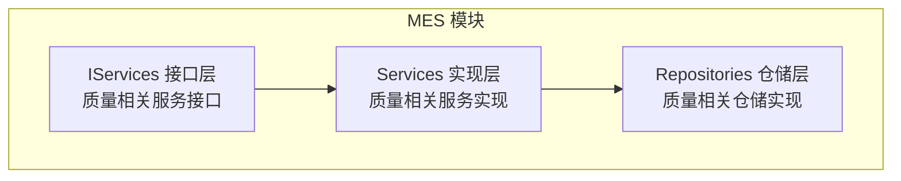
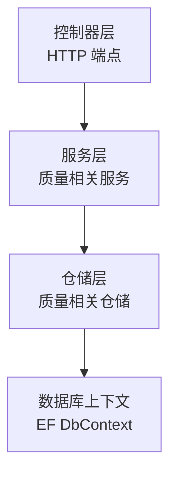
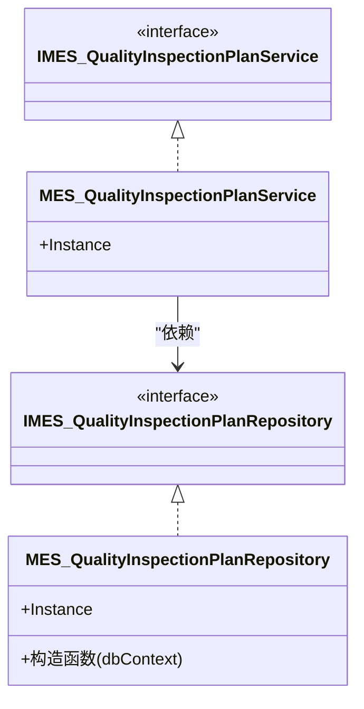
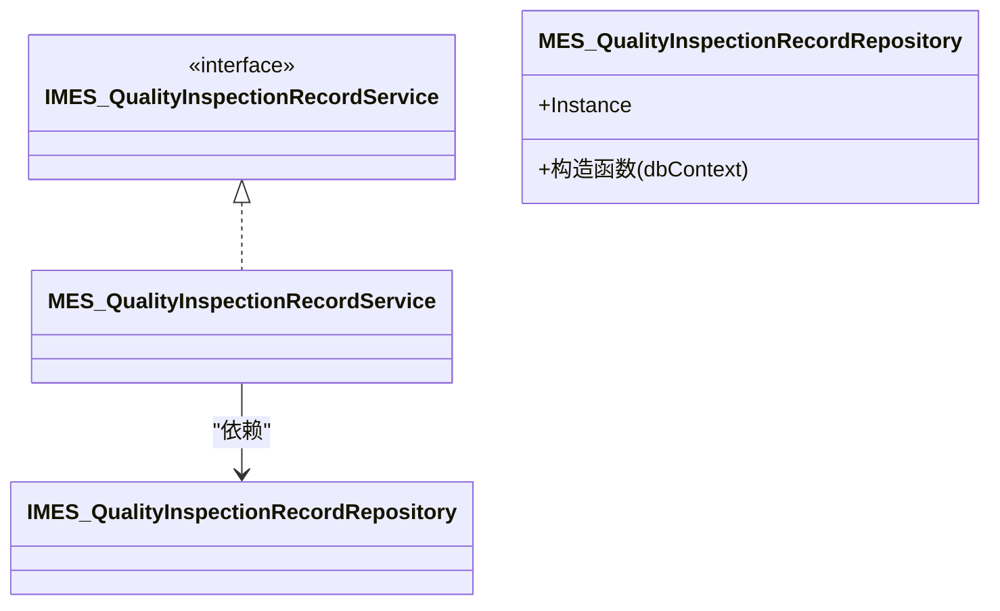
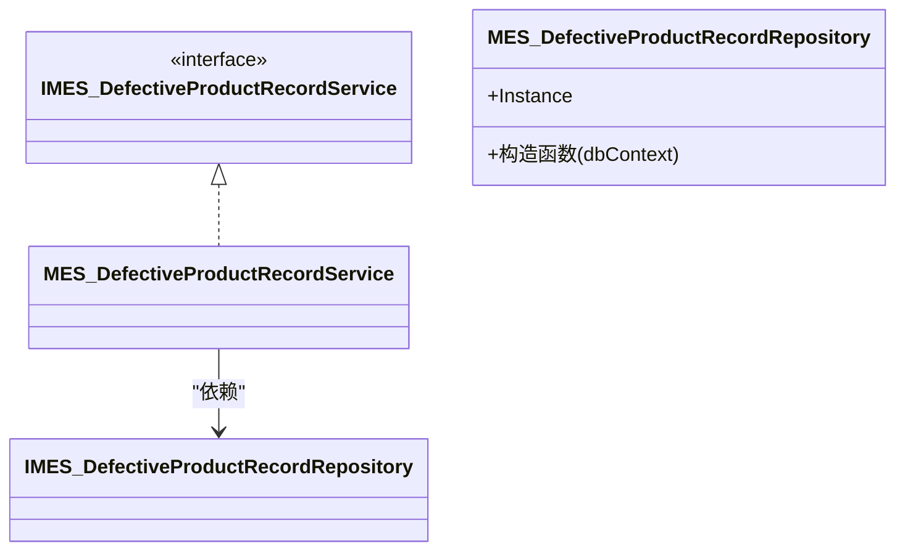
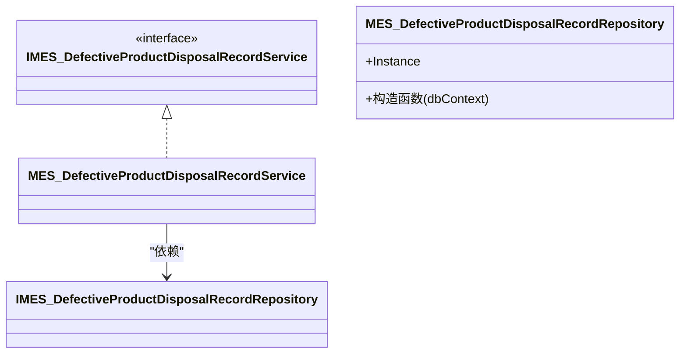
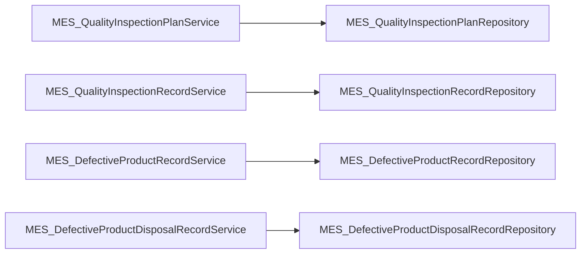

# 质量检验API

<cite>
**本文引用的文件**
- [IMES_QualityInspectionPlanService.cs](file://VolPro.Mes/IServices/mes/IMES_QualityInspectionPlanService.cs)
- [IMES_QualityInspectionRecordService.cs](file://VolPro.Mes/IServices/mes/IMES_QualityInspectionRecordService.cs)
- [IMES_DefectiveProductRecordService.cs](file://VolPro.Mes/IServices/mes/IMES_DefectiveProductRecordService.cs)
- [IMES_DefectiveProductDisposalRecordService.cs](file://VolPro.Mes/IServices/mes/IMES_DefectiveProductDisposalRecordService.cs)
- [MES_QualityInspectionPlanService.cs](file://VolPro.Mes/Services/mes/MES_QualityInspectionPlanService.cs)
- [MES_QualityInspectionPlanRepository.cs](file://VolPro.Mes/Repositories/mes/MES_QualityInspectionPlanRepository.cs)
- [MES_QualityInspectionRecordRepository.cs](file://VolPro.Mes/Repositories/mes/MES_QualityInspectionRecordRepository.cs)
- [MES_DefectiveProductRecordRepository.cs](file://VolPro.Mes/Repositories/mes/MES_DefectiveProductRecordRepository.cs)
</cite>

## 目录
1. [引言](#引言)
2. [项目结构](#项目结构)
3. [核心组件](#核心组件)
4. [架构总览](#架构总览)
5. [详细组件分析](#详细组件分析)
6. [依赖关系分析](#依赖关系分析)
7. [性能考虑](#性能考虑)
8. [故障排查指南](#故障排查指南)
9. [结论](#结论)
10. [附录](#附录)

## 引言
本文件面向质量管理体系中的“质量检验”业务域，系统梳理从“质量检验计划制定、检验执行、缺陷产品处理”的全流程API能力，并结合现有代码库中已实现的质量相关服务与仓储层，给出可落地的接口设计建议与扩展路径。同时，结合仓库中现有的实体与服务命名规范，明确质量检验计划、检验记录、缺陷产品记录及处置记录等关键领域对象的服务边界与调用方式。

## 项目结构
质量检验相关能力主要位于 MES 模块（VolPro.Mes），采用分层架构：
- 接口层（IServices）：定义业务契约，如质量检验计划、检验记录、缺陷产品记录、处置记录等服务接口。
- 实现层（Services）：基于仓储层提供具体业务逻辑，如质量检验计划服务。
- 仓储层（Repositories）：封装数据访问，提供数据库操作能力。
- 控制器层（Controllers）：对外暴露HTTP端点，接收请求并调用服务层完成业务处理（控制器文件位于 VolPro.WebApi 的 Controllers 下，本文聚焦于服务与仓储层的接口与实现）。

**图表来源**
- [IMES_QualityInspectionPlanService.cs:1-13](file://VolPro.Mes/IServices/mes/IMES_QualityInspectionPlanService.cs#L1-L13)
- [MES_QualityInspectionPlanService.cs:1-23](file://VolPro.Mes/Services/mes/MES_QualityInspectionPlanService.cs#L1-L23)
- [MES_QualityInspectionPlanRepository.cs:1-25](file://VolPro.Mes/Repositories/mes/MES_QualityInspectionPlanRepository.cs#L1-L25)

**章节来源**
- [IMES_QualityInspectionPlanService.cs:1-13](file://VolPro.Mes/IServices/mes/IMES_QualityInspectionPlanService.cs#L1-L13)
- [IMES_QualityInspectionRecordService.cs:1-13](file://VolPro.Mes/IServices/mes/IMES_QualityInspectionRecordService.cs#L1-L13)
- [IMES_DefectiveProductRecordService.cs:1-13](file://VolPro.Mes/IServices/mes/IMES_DefectiveProductRecordService.cs#L1-L13)
- [IMES_DefectiveProductDisposalRecordService.cs:1-13](file://VolPro.Mes/IServices/mes/IMES_DefectiveProductDisposalRecordService.cs#L1-L13)
- [MES_QualityInspectionPlanService.cs:1-23](file://VolPro.Mes/Services/mes/MES_QualityInspectionPlanService.cs#L1-L23)
- [MES_QualityInspectionPlanRepository.cs:1-25](file://VolPro.Mes/Repositories/mes/MES_QualityInspectionPlanRepository.cs#L1-L25)
- [MES_QualityInspectionRecordRepository.cs:1-25](file://VolPro.Mes/Repositories/mes/MES_QualityInspectionRecordRepository.cs#L1-L25)
- [MES_DefectiveProductRecordRepository.cs:1-25](file://VolPro.Mes/Repositories/mes/MES_DefectiveProductRecordRepository.cs#L1-L25)

## 核心组件
- 质量检验计划服务接口与实现
  - 接口：IMES_QualityInspectionPlanService
  - 实现：MES_QualityInspectionPlanService
  - 仓储：MES_QualityInspectionPlanRepository
- 质量检验记录服务接口与实现
  - 接口：IMES_QualityInspectionRecordService
  - 仓储：MES_QualityInspectionRecordRepository
- 缺陷产品记录服务接口与实现
  - 接口：IMES_DefectiveProductRecordService
  - 仓储：MES_DefectiveProductRecordRepository
- 不合格品处置记录服务接口与实现
  - 接口：IMES_DefectiveProductDisposalRecordService
  - 仓储：MES_DefectiveProductDisposalRecordRepository

上述组件遵循统一的分层与依赖注入模式，通过 Autofac 容器进行服务解析，确保松耦合与可测试性。

**章节来源**
- [IMES_QualityInspectionPlanService.cs:1-13](file://VolPro.Mes/IServices/mes/IMES_QualityInspectionPlanService.cs#L1-L13)
- [MES_QualityInspectionPlanService.cs:1-23](file://VolPro.Mes/Services/mes/MES_QualityInspectionPlanService.cs#L1-L23)
- [MES_QualityInspectionPlanRepository.cs:1-25](file://VolPro.Mes/Repositories/mes/MES_QualityInspectionPlanRepository.cs#L1-L25)
- [IMES_QualityInspectionRecordService.cs:1-13](file://VolPro.Mes/IServices/mes/IMES_QualityInspectionRecordService.cs#L1-L13)
- [MES_QualityInspectionRecordRepository.cs:1-25](file://VolPro.Mes/Repositories/mes/MES_QualityInspectionRecordRepository.cs#L1-L25)
- [IMES_DefectiveProductRecordService.cs:1-13](file://VolPro.Mes/IServices/mes/IMES_DefectiveProductRecordService.cs#L1-L13)
- [MES_DefectiveProductRecordRepository.cs:1-25](file://VolPro.Mes/Repositories/mes/MES_DefectiveProductRecordRepository.cs#L1-L25)
- [IMES_DefectiveProductDisposalRecordService.cs:1-13](file://VolPro.Mes/IServices/mes/IMES_DefectiveProductDisposalRecordService.cs#L1-L13)

## 架构总览
质量检验相关服务采用典型的分层架构：控制器接收请求，调用服务层；服务层组合仓储层完成持久化；仓储层通过数据库上下文与实体交互。Autofac 容器负责服务注册与解析，保证依赖注入的统一入口。

**图表来源**
- [MES_QualityInspectionPlanService.cs:15-21](file://VolPro.Mes/Services/mes/MES_QualityInspectionPlanService.cs#L15-L21)
- [MES_QualityInspectionPlanRepository.cs:15-22](file://VolPro.Mes/Repositories/mes/MES_QualityInspectionPlanRepository.cs#L15-L22)

## 详细组件分析

### 组件一：质量检验计划服务
- 角色定位
  - 作为质量检验计划的业务入口，负责计划的增删改查、状态流转与与其他模块（如生产计划、物料、设备）的协同。
- 关键职责
  - 计划制定：新增/编辑质量控制点、抽样方案、检验频次、判定规则等。
  - 计划执行：驱动检验任务下发与跟踪。
  - 数据统计：汇总检验结果，支持趋势分析与报表输出。
- 依赖关系
  - 依赖仓储层进行持久化。
  - 通过 Autofac 容器解析仓储实例，确保生命周期与作用域可控。

**图表来源**
- [IMES_QualityInspectionPlanService.cs:9-11](file://VolPro.Mes/IServices/mes/IMES_QualityInspectionPlanService.cs#L9-L11)
- [MES_QualityInspectionPlanService.cs:15-21](file://VolPro.Mes/Services/mes/MES_QualityInspectionPlanService.cs#L15-L21)
- [MES_QualityInspectionPlanRepository.cs:13-23](file://VolPro.Mes/Repositories/mes/MES_QualityInspectionPlanRepository.cs#L13-L23)

**章节来源**
- [IMES_QualityInspectionPlanService.cs:1-13](file://VolPro.Mes/IServices/mes/IMES_QualityInspectionPlanService.cs#L1-L13)
- [MES_QualityInspectionPlanService.cs:1-23](file://VolPro.Mes/Services/mes/MES_QualityInspectionPlanService.cs#L1-L23)
- [MES_QualityInspectionPlanRepository.cs:1-25](file://VolPro.Mes/Repositories/mes/MES_QualityInspectionPlanRepository.cs#L1-L25)

### 组件二：质量检验记录服务
- 角色定位
  - 记录每次检验的执行情况，包括检验项目、结果、判定、人员、时间等信息。
- 关键职责
  - 录入检验结果：支持批量导入与单条录入。
  - 判定与流转：根据判定规则自动或人工判定是否合格。
  - 统计分析：按时间段、批次、产品类型等维度统计合格率、缺陷分布等。
- 依赖关系
  - 通过仓储层读写检验记录数据。

**图表来源**
- [IMES_QualityInspectionRecordService.cs:9-11](file://VolPro.Mes/IServices/mes/IMES_QualityInspectionRecordService.cs#L9-L11)
- [MES_QualityInspectionRecordRepository.cs:13-23](file://VolPro.Mes/Repositories/mes/MES_QualityInspectionRecordRepository.cs#L13-L23)

**章节来源**
- [IMES_QualityInspectionRecordService.cs:1-13](file://VolPro.Mes/IServices/mes/IMES_QualityInspectionRecordService.cs#L1-L13)
- [MES_QualityInspectionRecordRepository.cs:1-25](file://VolPro.Mes/Repositories/mes/MES_QualityInspectionRecordRepository.cs#L1-L25)

### 组件三：缺陷产品记录服务
- 角色定位
  - 记录发现的缺陷产品信息，包括缺陷类型、数量、责任归属、原因分析等。
- 关键职责
  - 缺陷登记：支持扫码/条码识别、自动带出产品信息。
  - 分类统计：按缺陷类型、来源、责任部门等维度统计。
  - 质量追溯：与批次、工单、供应商等建立关联。
- 依赖关系
  - 通过仓储层持久化缺陷记录。

**图表来源**
- [IMES_DefectiveProductRecordService.cs:9-11](file://VolPro.Mes/IServices/mes/IMES_DefectiveProductRecordService.cs#L9-L11)
- [MES_DefectiveProductRecordRepository.cs:13-23](file://VolPro.Mes/Repositories/mes/MES_DefectiveProductRecordRepository.cs#L13-L23)

**章节来源**
- [IMES_DefectiveProductRecordService.cs:1-13](file://VolPro.Mes/IServices/mes/IMES_DefectiveProductRecordService.cs#L1-L13)
- [MES_DefectiveProductRecordRepository.cs:1-25](file://VolPro.Mes/Repositories/mes/MES_DefectiveProductRecordRepository.cs#L1-L25)

### 组件四：不合格品处置记录服务
- 角色定位
  - 记录对不合格品的处置过程，包括返工、报废、让步接收、降级使用等。
- 关键职责
  - 处置流程：支持审批流与状态变更。
  - 成本核算：统计处置成本与损失。
  - 防错措施：记录纠正与预防措施（CAPA）。
- 依赖关系
  - 通过仓储层维护处置记录。

**图表来源**
- [IMES_DefectiveProductDisposalRecordService.cs:9-11](file://VolPro.Mes/IServices/mes/IMES_DefectiveProductDisposalRecordService.cs#L9-L11)
- [MES_DefectiveProductDisposalRecordRepository.cs:13-23](file://VolPro.Mes/Repositories/mes/MES_DefectiveProductDisposalRecordRepository.cs#L13-L23)

**章节来源**
- [IMES_DefectiveProductDisposalRecordService.cs:1-13](file://VolPro.Mes/IServices/mes/IMES_DefectiveProductDisposalRecordService.cs#L1-L13)
- [MES_DefectiveProductDisposalRecordRepository.cs:1-25](file://VolPro.Mes/Repositories/mes/MES_DefectiveProductDisposalRecordRepository.cs#L1-L25)

## 依赖关系分析
- 服务到仓储的依赖
  - 各质量相关服务均通过接口依赖对应的仓储接口，实现解耦与可替换性。
- 容器解析
  - 服务与仓储均通过 Autofac 容器解析实例，确保统一的生命周期管理。
- 数据访问
  - 仓储通过 EF DbContext 进行数据库操作，遵循仓储模式的最佳实践。

**图表来源**
- [MES_QualityInspectionPlanService.cs:15-21](file://VolPro.Mes/Services/mes/MES_QualityInspectionPlanService.cs#L15-L21)
- [MES_QualityInspectionPlanRepository.cs:13-23](file://VolPro.Mes/Repositories/mes/MES_QualityInspectionPlanRepository.cs#L13-L23)
- [MES_QualityInspectionRecordRepository.cs:13-23](file://VolPro.Mes/Repositories/mes/MES_QualityInspectionRecordRepository.cs#L13-L23)
- [MES_DefectiveProductRecordRepository.cs:13-23](file://VolPro.Mes/Repositories/mes/MES_DefectiveProductRecordRepository.cs#L13-L23)

**章节来源**
- [MES_QualityInspectionPlanService.cs:1-23](file://VolPro.Mes/Services/mes/MES_QualityInspectionPlanService.cs#L1-L23)
- [MES_QualityInspectionPlanRepository.cs:1-25](file://VolPro.Mes/Repositories/mes/MES_QualityInspectionPlanRepository.cs#L1-L25)
- [MES_QualityInspectionRecordRepository.cs:1-25](file://VolPro.Mes/Repositories/mes/MES_QualityInspectionRecordRepository.cs#L1-L25)
- [MES_DefectiveProductRecordRepository.cs:1-25](file://VolPro.Mes/Repositories/mes/MES_DefectiveProductRecordRepository.cs#L1-L25)

## 性能考虑
- 仓储复用与连接池
  - 建议统一通过 Autofac 注册仓储实例，避免重复创建 DbContext，提升连接复用效率。
- 查询优化
  - 对高频查询（如按日期、批次、产品类型统计）建立合适索引，减少全表扫描。
- 批量操作
  - 导入检验结果与缺陷记录时，优先采用批量插入/更新，降低网络往返次数。
- 缓存策略
  - 对静态配置（如判定规则、缺陷类型字典）启用缓存，减少数据库访问压力。

## 故障排查指南
- 依赖注入异常
  - 现象：服务或仓储解析失败。
  - 排查：确认 Autofac 容器中对应接口与实现已正确注册；检查服务生命周期与作用域。
- 数据访问异常
  - 现象：仓储层抛出数据库异常。
  - 排查：检查 DbContext 初始化、连接字符串、事务边界与并发冲突。
- 业务逻辑异常
  - 现象：检验计划无法保存或检验记录无法判定。
  - 排查：核对输入参数、校验规则与业务约束；查看日志与审计信息。

## 结论
本文件基于现有代码库中的质量相关服务与仓储层，明确了质量检验计划、检验记录、缺陷产品记录与处置记录的接口与实现关系，并给出了分层架构下的依赖与扩展建议。后续可在控制器层补充HTTP端点，完善质量数据统计与趋势分析能力，并打通与生产、物料、客户投诉等模块的业务关联。

## 附录
- 术语说明
  - 质量检验计划：定义检验项目、频次、抽样方案与判定规则的计划文档。
  - 检验记录：单次检验的执行与结果记录。
  - 缺陷产品记录：发现的不合格品登记信息。
  - 处置记录：对不合格品采取的处置措施与流程记录。
- 扩展建议
  - 在控制器层新增对应端点，支持计划制定、执行、结果录入、统计分析与报表导出。
  - 引入工作流引擎支持处置审批与状态流转。
  - 增加Kafka/消息队列用于异步处理大批量导入与统计任务。
  - 与生产订单、BOM、设备维修、供应商管理等模块建立数据与流程联动。