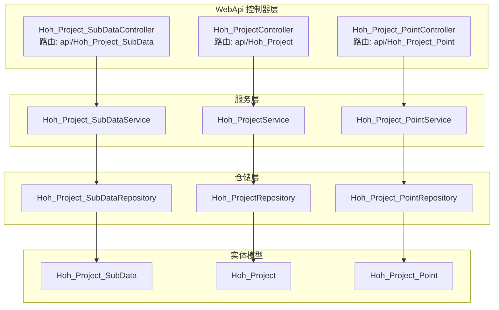
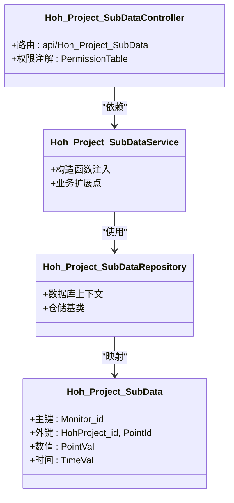
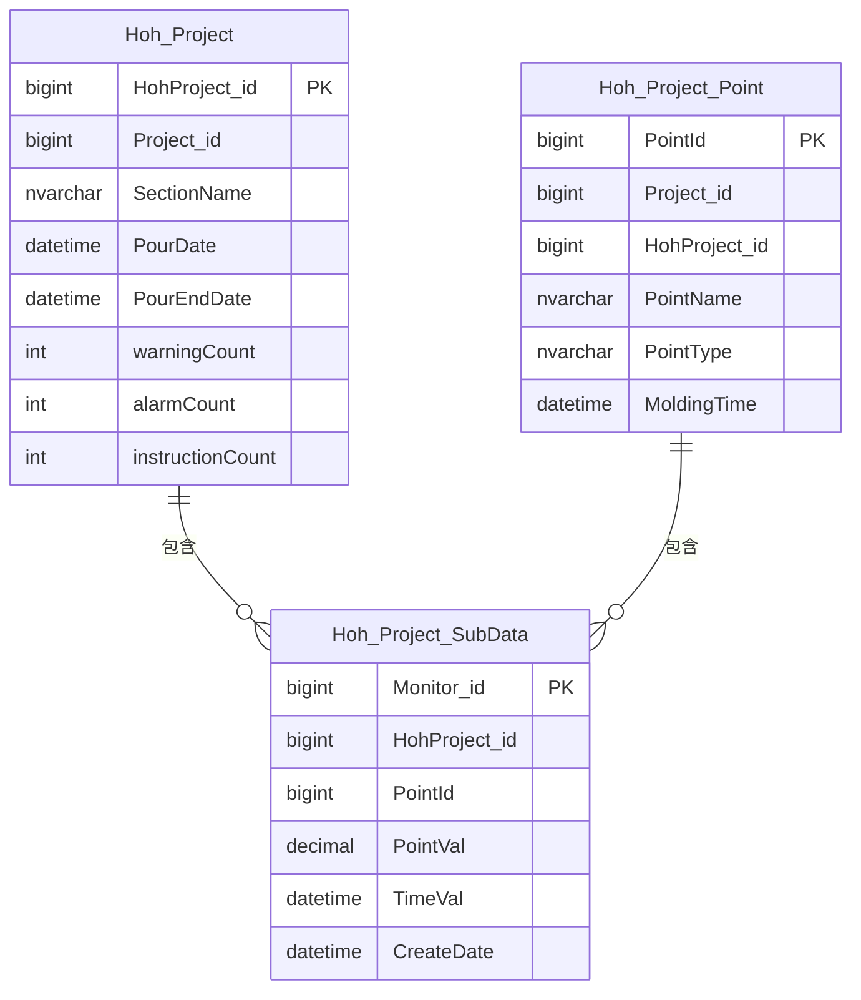
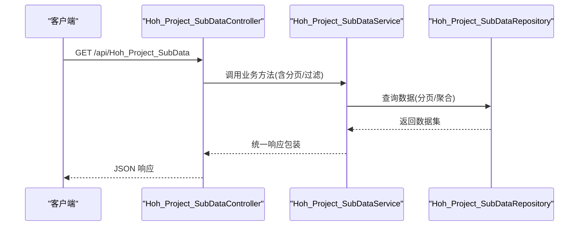
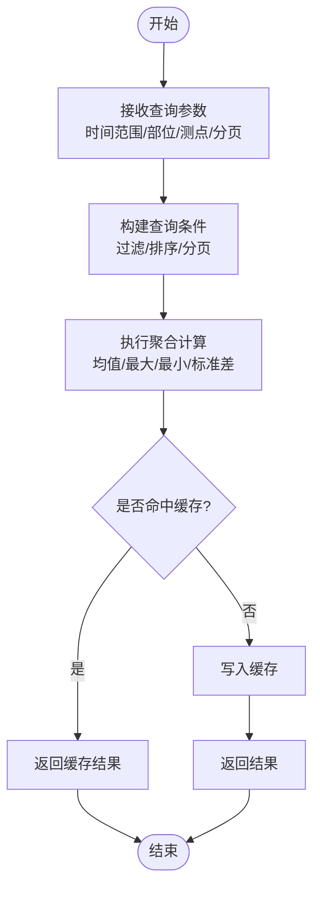
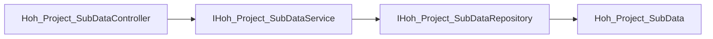

# 子数据管理API

<cite>
**本文引用的文件**
- [Hoh_Project_SubDataController.cs](file://VolPro.WebApi/Controllers/HeatOfHydration/Hoh_Project_SubDataController.cs)
- [IHoh_Project_SubDataService.cs](file://Hncdi.HeatOfHydration/IServices/Hoh/IHoh_Project_SubDataService.cs)
- [Hoh_Project_SubDataService.cs](file://Hncdi.HeatOfHydration/Services/Hoh/Hoh_Project_SubDataService.cs)
- [IHoh_Project_SubDataRepository.cs](file://Hncdi.HeatOfHydration/IRepositories/Hoh/IHoh_Project_SubDataRepository.cs)
- [Hoh_Project_SubDataRepository.cs](file://Hncdi.HeatOfHydration/Repositories/Hoh/Hoh_Project_SubDataRepository.cs)
- [Hoh_Project_SubDataService.cs（Partial）](file://Hncdi.HeatOfHydration/Services/Hoh/Partial/Hoh_Project_SubDataService.cs)
- [IHoh_Project_SubDataService.cs（Partial）](file://Hncdi.HeatOfHydration/IServices/Hoh/Partial/IHoh_Project_SubDataService.cs)
- [Hoh_Project_SubData.cs](file://VolPro.Entity/DomainModels/Hoh/Hoh_Project_SubData.cs)
- [Hoh_Project.cs](file://VolPro.Entity/DomainModels/Hoh/Hoh_Project.cs)
- [Hoh_Project_Point.cs](file://VolPro.Entity/DomainModels/Hoh/Hoh_Project_Point.cs)
- [Hoh_ProjectController.cs](file://VolPro.WebApi/Controllers/HeatOfHydration/Hoh_ProjectController.cs)
- [Hoh_Project_PointController.cs](file://VolPro.WebApi/Controllers/HeatOfHydration/Hoh_Project_PointController.cs)
</cite>

## 目录
1. [简介](#简介)
2. [项目结构](#项目结构)
3. [核心组件](#核心组件)
4. [架构总览](#架构总览)
5. [详细组件分析](#详细组件分析)
6. [依赖分析](#依赖分析)
7. [性能考虑](#性能考虑)
8. [故障排查指南](#故障排查指南)
9. [结论](#结论)
10. [附录](#附录)

## 简介
本文件面向“水化热子数据管理API”的设计与实现，聚焦于子数据分类、数据聚合与统计分析等核心能力。基于现有代码结构，系统采用分层架构：Web 控制器负责请求入口与权限控制；服务层封装业务逻辑；仓储层对接数据库；实体模型描述数据结构。重点围绕子数据表（Hoh_Project_SubData）及其关联的部位（Hoh_Project）、测点（Hoh_Project_Point）进行接口设计与数据关系映射，并给出大数据量下的分页查询与缓存策略建议。

## 项目结构
- 控制器层：位于 WebApi 层，负责路由与权限注解，继承通用基础控制器以复用通用增删改查能力。
- 服务层：位于 Hncdi.HeatOfHydration 项目，提供业务扩展与事务控制能力。
- 仓储层：位于 Hncdi.HeatOfHydration 项目，封装数据库访问。
- 实体层：位于 VolPro.Entity，定义数据库表结构与特性标注。

图表来源
- [Hoh_Project_SubDataController.cs:11-13](file://VolPro.WebApi/Controllers/HeatOfHydration/Hoh_Project_SubDataController.cs#L11-L13)
- [Hoh_ProjectController.cs:11-13](file://VolPro.WebApi/Controllers/HeatOfHydration/Hoh_ProjectController.cs#L11-L13)
- [Hoh_Project_PointController.cs:11-13](file://VolPro.WebApi/Controllers/HeatOfHydration/Hoh_Project_PointController.cs#L11-L13)
- [Hoh_Project_SubDataService.cs:15-16](file://Hncdi.HeatOfHydration/Services/Hoh/Hoh_Project_SubDataService.cs#L15-L16)
- [Hoh_Project_SubDataRepository.cs:13-13](file://Hncdi.HeatOfHydration/Repositories/Hoh/Hoh_Project_SubDataRepository.cs#L13-L13)
- [Hoh_Project_SubData.cs:17-18](file://VolPro.Entity/DomainModels/Hoh/Hoh_Project_SubData.cs#L17-L18)
- [Hoh_Project.cs:17-18](file://VolPro.Entity/DomainModels/Hoh/Hoh_Project.cs#L17-L18)
- [Hoh_Project_Point.cs:17-18](file://VolPro.Entity/DomainModels/Hoh/Hoh_Project_Point.cs#L17-L18)

章节来源
- [Hoh_Project_SubDataController.cs:11-13](file://VolPro.WebApi/Controllers/HeatOfHydration/Hoh_Project_SubDataController.cs#L11-L13)
- [Hoh_ProjectController.cs:11-13](file://VolPro.WebApi/Controllers/HeatOfHydration/Hoh_ProjectController.cs#L11-L13)
- [Hoh_Project_PointController.cs:11-13](file://VolPro.WebApi/Controllers/HeatOfHydration/Hoh_Project_PointController.cs#L11-L13)

## 核心组件
- 子数据实体模型：描述单次监测的测点、数值与时间等关键字段，具备主键标识与必填约束，便于后续聚合与统计。
- 部位实体模型：描述监控部位的基础信息与状态，用于按部位维度进行数据分组与统计。
- 测点实体模型：描述具体测点的属性与位置信息，用于定位子数据所属测点。
- 控制器：基于通用基础控制器，通过路由与权限注解暴露 REST 接口。
- 服务与仓储：提供业务扩展与数据库访问能力，支持事务与上下文注入。

章节来源
- [Hoh_Project_SubData.cs:17-76](file://VolPro.Entity/DomainModels/Hoh/Hoh_Project_SubData.cs#L17-L76)
- [Hoh_Project.cs:17-229](file://VolPro.Entity/DomainModels/Hoh/Hoh_Project.cs#L17-L229)
- [Hoh_Project_Point.cs:17-137](file://VolPro.Entity/DomainModels/Hoh/Hoh_Project_Point.cs#L17-L137)
- [Hoh_Project_SubDataController.cs:11-13](file://VolPro.WebApi/Controllers/HeatOfHydration/Hoh_Project_SubDataController.cs#L11-L13)
- [IHoh_Project_SubDataService.cs:9-11](file://Hncdi.HeatOfHydration/IServices/Hoh/IHoh_Project_SubDataService.cs#L9-L11)
- [IHoh_Project_SubDataRepository.cs:15-17](file://Hncdi.HeatOfHydration/IRepositories/Hoh/IHoh_Project_SubDataRepository.cs#L15-L17)

## 架构总览
系统遵循典型的分层架构，控制器负责请求接入与权限校验，服务层承载业务逻辑与事务控制，仓储层负责数据持久化，实体模型定义数据结构与元数据。控制器继承通用基础控制器，复用统一的响应格式与权限注解。

图表来源
- [Hoh_Project_SubDataController.cs:11-13](file://VolPro.WebApi/Controllers/HeatOfHydration/Hoh_Project_SubDataController.cs#L11-L13)
- [Hoh_Project_SubDataService.cs:15-16](file://Hncdi.HeatOfHydration/Services/Hoh/Hoh_Project_SubDataService.cs#L15-L16)
- [Hoh_Project_SubDataRepository.cs:13-13](file://Hncdi.HeatOfHydration/Repositories/Hoh/Hoh_Project_SubDataRepository.cs#L13-L13)
- [Hoh_Project_SubData.cs:17-76](file://VolPro.Entity/DomainModels/Hoh/Hoh_Project_SubData.cs#L17-L76)

## 详细组件分析

### 子数据实体与关系映射
- 主键与外键：子数据主键为 Monitor_id；与部位（HohProject_id）与测点（PointId）存在外键关系，确保数据归属清晰。
- 数值与时间：PointVal 表示测值，TimeVal 表示数据采集时间，二者构成聚合与趋势分析的基础。
- 关联模型：部位（Hoh_Project）与测点（Hoh_Project_Point）分别提供部位级别与点位级别的分组依据。

图表来源
- [Hoh_Project_SubData.cs:17-76](file://VolPro.Entity/DomainModels/Hoh/Hoh_Project_SubData.cs#L17-L76)
- [Hoh_Project.cs:17-229](file://VolPro.Entity/DomainModels/Hoh/Hoh_Project.cs#L17-L229)
- [Hoh_Project_Point.cs:17-137](file://VolPro.Entity/DomainModels/Hoh/Hoh_Project_Point.cs#L17-L137)

章节来源
- [Hoh_Project_SubData.cs:17-76](file://VolPro.Entity/DomainModels/Hoh/Hoh_Project_SubData.cs#L17-L76)
- [Hoh_Project.cs:17-229](file://VolPro.Entity/DomainModels/Hoh/Hoh_Project.cs#L17-L229)
- [Hoh_Project_Point.cs:17-137](file://VolPro.Entity/DomainModels/Hoh/Hoh_Project_Point.cs#L17-L137)

### 控制器与服务交互流程
- 控制器继承通用基础控制器，通过路由 api/Hoh_Project_SubData 暴露接口。
- 服务层提供业务扩展点，仓储层提供数据访问能力。
- 建议在服务层实现分页查询、聚合统计与缓存策略，控制器仅负责参数接收与返回结果。

图表来源
- [Hoh_Project_SubDataController.cs:11-13](file://VolPro.WebApi/Controllers/HeatOfHydration/Hoh_Project_SubDataController.cs#L11-L13)
- [Hoh_Project_SubDataService.cs:15-16](file://Hncdi.HeatOfHydration/Services/Hoh/Hoh_Project_SubDataService.cs#L15-L16)
- [Hoh_Project_SubDataRepository.cs:13-13](file://Hncdi.HeatOfHydration/Repositories/Hoh/Hoh_Project_SubDataRepository.cs#L13-L13)

章节来源
- [Hoh_Project_SubDataController.cs:11-13](file://VolPro.WebApi/Controllers/HeatOfHydration/Hoh_Project_SubDataController.cs#L11-L13)
- [Hoh_Project_SubDataService.cs:15-16](file://Hncdi.HeatOfHydration/Services/Hoh/Hoh_Project_SubDataService.cs#L15-L16)
- [Hoh_Project_SubDataRepository.cs:13-13](file://Hncdi.HeatOfHydration/Repositories/Hoh/Hoh_Project_SubDataRepository.cs#L13-L13)

### 数据聚合与统计分析流程
- 时间维度：按 TimeVal 进行分组或窗口聚合，支持日/周/月等粒度统计。
- 点位维度：按 PointId 或 PointType 进行分组，计算均值、最大值、最小值、标准差等指标。
- 部位维度：按 HohProject_id 进行分组，结合部位状态（如浇筑状态）进行条件统计。
- 聚合算法：建议采用滑动窗口、滚动聚合与预聚合策略，降低实时查询压力。

图表来源
- [Hoh_Project_SubData.cs:46-65](file://VolPro.Entity/DomainModels/Hoh/Hoh_Project_SubData.cs#L46-L65)
- [Hoh_Project_Point.cs:36-75](file://VolPro.Entity/DomainModels/Hoh/Hoh_Project_Point.cs#L36-L75)
- [Hoh_Project.cs:38-94](file://VolPro.Entity/DomainModels/Hoh/Hoh_Project.cs#L38-L94)

章节来源
- [Hoh_Project_SubData.cs:46-65](file://VolPro.Entity/DomainModels/Hoh/Hoh_Project_SubData.cs#L46-L65)
- [Hoh_Project_Point.cs:36-75](file://VolPro.Entity/DomainModels/Hoh/Hoh_Project_Point.cs#L36-L75)
- [Hoh_Project.cs:38-94](file://VolPro.Entity/DomainModels/Hoh/Hoh_Project.cs#L38-L94)

## 依赖分析
- 控制器依赖服务接口，服务实现依赖仓储接口，仓储实现依赖数据库上下文与实体模型。
- 服务层通过依赖注入获取仓储实例，支持事务与上下文访问。
- 实体模型通过特性标注指定表名与服务器连接，确保 ORM 映射正确。

图表来源
- [Hoh_Project_SubDataController.cs:11-13](file://VolPro.WebApi/Controllers/HeatOfHydration/Hoh_Project_SubDataController.cs#L11-L13)
- [IHoh_Project_SubDataService.cs:9-11](file://Hncdi.HeatOfHydration/IServices/Hoh/IHoh_Project_SubDataService.cs#L9-L11)
- [IHoh_Project_SubDataRepository.cs:15-17](file://Hncdi.HeatOfHydration/IRepositories/Hoh/IHoh_Project_SubDataRepository.cs#L15-L17)
- [Hoh_Project_SubData.cs:17-18](file://VolPro.Entity/DomainModels/Hoh/Hoh_Project_SubData.cs#L17-L18)

章节来源
- [IHoh_Project_SubDataService.cs:9-11](file://Hncdi.HeatOfHydration/IServices/Hoh/IHoh_Project_SubDataService.cs#L9-L11)
- [IHoh_Project_SubDataRepository.cs:15-17](file://Hncdi.HeatOfHydration/IRepositories/Hoh/IHoh_Project_SubDataRepository.cs#L15-L17)

## 性能考虑
- 分页查询：建议在服务层实现分页参数校验与索引优化，避免全表扫描。
- 聚合优化：针对高频统计场景，可采用预聚合表或物化视图，减少实时计算开销。
- 缓存策略：热点数据（如最近N小时的测点统计）可采用内存缓存或分布式缓存，设置合理过期时间与失效策略。
- 并发控制：在高并发写入场景下，建议使用批量插入与事务合并，降低锁竞争。
- 监控指标：建议埋点记录查询耗时、缓存命中率、数据库连接池使用率等指标，便于性能评估与优化。

## 故障排查指南
- 权限与路由：确认控制器路由与权限注解配置正确，避免无权限访问或路由冲突。
- 参数校验：检查分页参数、时间范围与过滤条件是否合法，防止异常查询导致性能问题。
- 缓存一致性：当数据更新后，及时清理或刷新相关缓存键，避免脏读。
- 事务回滚：对于批量写入或复杂事务，确保异常时能够回滚，保持数据一致性。

## 结论
本子数据管理API以清晰的分层架构为基础，围绕子数据、部位与测点三类实体构建了数据关系与查询路径。通过在服务层实现分页、聚合与缓存策略，可在保证功能完整性的同时提升性能与可维护性。建议后续补充具体的统计接口定义与缓存监控指标，以完善API能力矩阵。

## 附录
- 接口命名规范：建议统一使用 RESTful 风格，明确资源与动作，例如按部位/测点维度的 GET 查询与 POST 聚合统计。
- 错误码与响应格式：建议统一返回结构，包含状态码、消息与数据体，便于前端与监控系统消费。
- 文档与测试：建议配套接口文档与自动化测试，覆盖边界条件与性能场景。