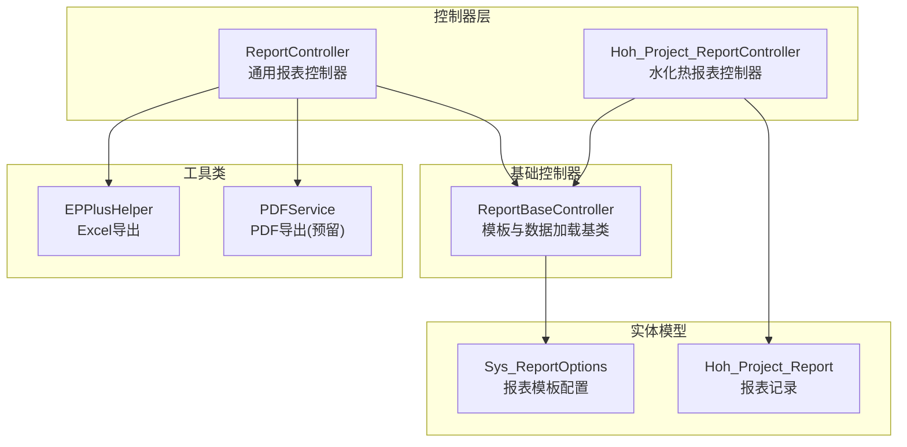
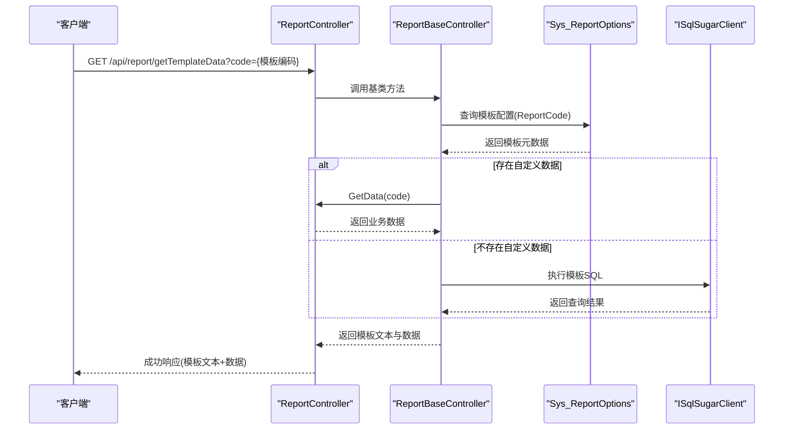
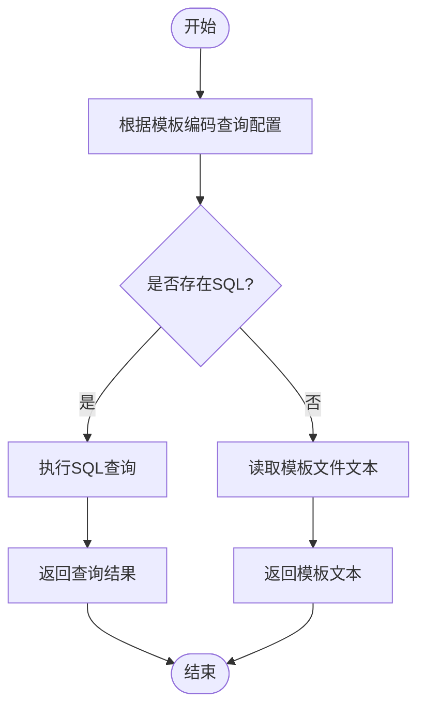
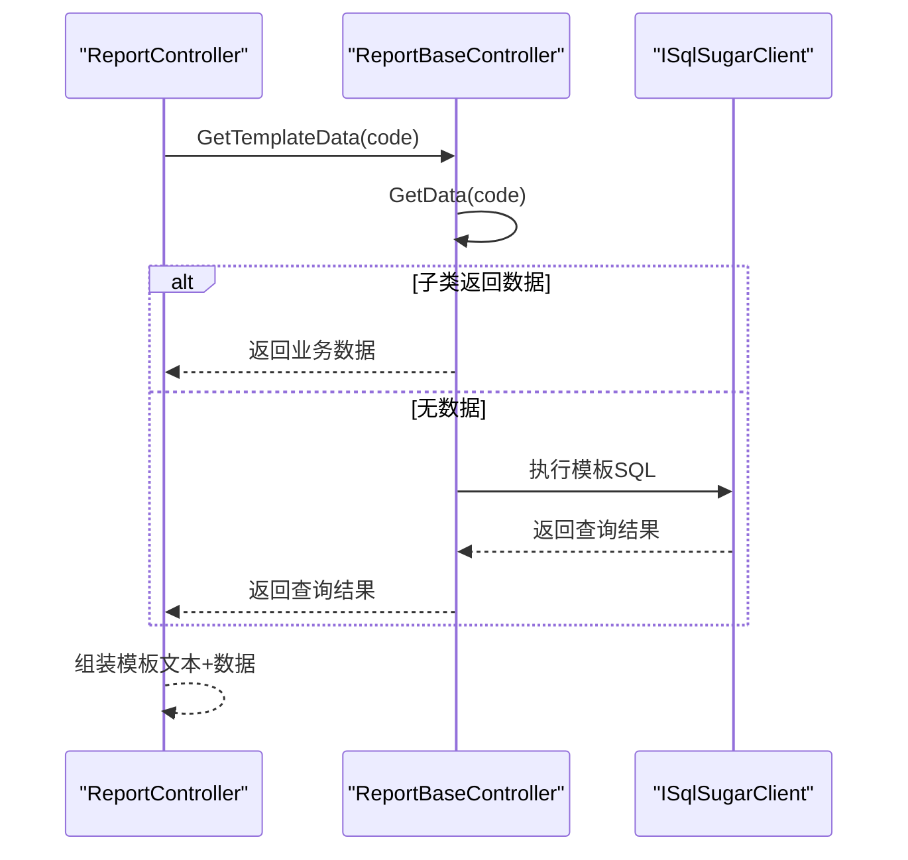
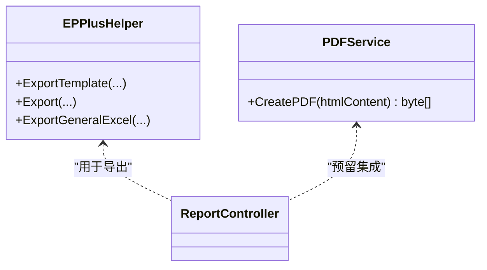
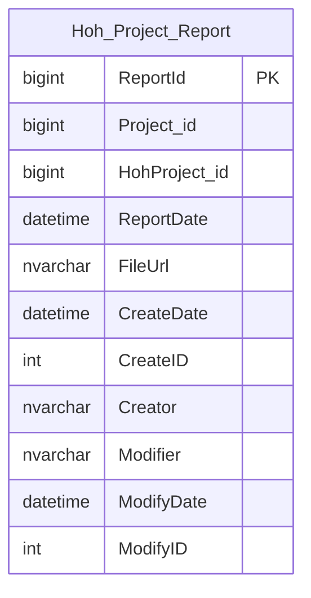
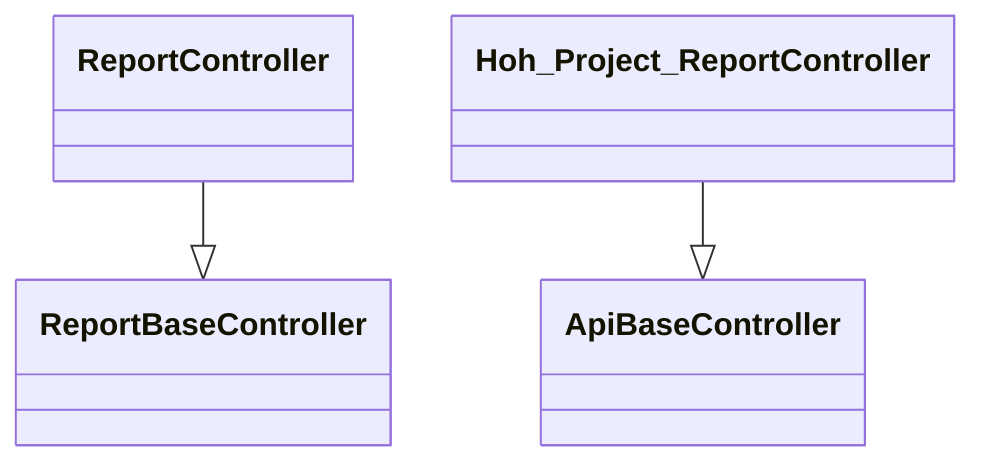
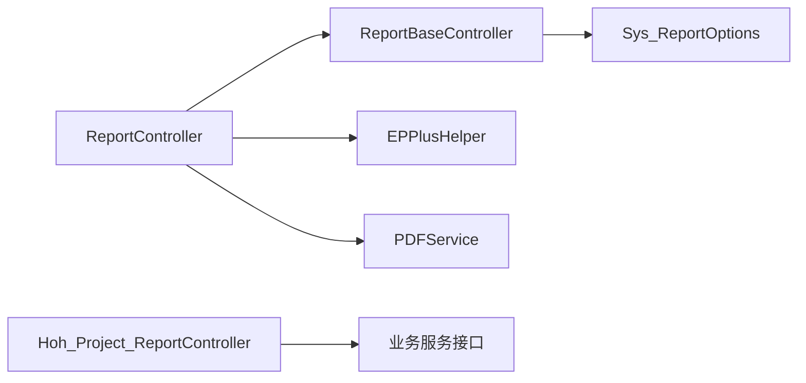

# 报表生成API

<cite>
**本文引用的文件**
- [Hoh_Project_ReportController.cs](file://VolPro.WebApi/Controllers/HeatOfHydration/Hoh_Project_ReportController.cs)
- [ReportBaseController.cs](file://VolPro.Core/Controllers/Basic/ReportBaseController.cs)
- [ReportController.cs](file://VolPro.WebApi/Controllers/Report/ReportController.cs)
- [Sys_ReportOptions.cs](file://VolPro.Entity/DomainModels/System/Sys_ReportOptions.cs)
- [Hoh_Project_Report.cs](file://VolPro.Entity/DomainModels/Hoh/Hoh_Project_Report.cs)
- [EPPlusHelper.cs](file://VolPro.Core/Utilities/EPPlusHelper.cs)
- [PDFService.cs](file://VolPro.Core/Utilities/PDFHelper/PDFService.cs)
</cite>

## 目录
1. [简介](#简介)
2. [项目结构](#项目结构)
3. [核心组件](#核心组件)
4. [架构总览](#架构总览)
5. [详细组件分析](#详细组件分析)
6. [依赖关系分析](#依赖关系分析)
7. [性能考虑](#性能考虑)
8. [故障排查指南](#故障排查指南)
9. [结论](#结论)
10. [附录](#附录)

## 简介
本文件面向“水化热报表生成API”的设计与使用，聚焦以下目标：
- 报表模板管理：模板元数据、模板文件路径与数据源SQL的配置。
- 报表数据生成：基于模板编码动态加载模板与数据（支持静态数据或SQL查询）。
- 报表导出：Excel导出能力与通用导出流程；PDF导出能力预留。
- 报表历史管理：基于实体模型的报表记录与文件存储。
- 权限控制与安全导出：控制器权限注解与模板数据访问控制。

该API采用分层架构，模板与数据分离，支持灵活扩展与多数据源。

## 项目结构
围绕报表生成的核心模块分布如下：
- 控制器层：报表通用控制器与业务控制器
- 基础控制器：模板解析、数据加载与通用导出入口
- 实体模型：报表模板与报表记录
- 工具类：Excel导出与PDF导出（部分功能已预留）

图表来源
- [ReportController.cs:12-300](file://VolPro.WebApi/Controllers/Report/ReportController.cs#L12-L300)
- [ReportBaseController.cs:17-169](file://VolPro.Core/Controllers/Basic/ReportBaseController.cs#L17-L169)
- [Sys_ReportOptions.cs:17-190](file://VolPro.Entity/DomainModels/System/Sys_ReportOptions.cs#L17-L190)
- [Hoh_Project_Report.cs:17-130](file://VolPro.Entity/DomainModels/Hoh/Hoh_Project_Report.cs#L17-L130)
- [EPPlusHelper.cs:19-738](file://VolPro.Core/Utilities/EPPlusHelper.cs#L19-L738)
- [PDFService.cs:10-63](file://VolPro.Core/Utilities/PDFHelper/PDFService.cs#L10-L63)

章节来源
- [ReportController.cs:12-300](file://VolPro.WebApi/Controllers/Report/ReportController.cs#L12-L300)
- [ReportBaseController.cs:17-169](file://VolPro.Core/Controllers/Basic/ReportBaseController.cs#L17-L169)
- [Sys_ReportOptions.cs:17-190](file://VolPro.Entity/DomainModels/System/Sys_ReportOptions.cs#L17-L190)
- [Hoh_Project_Report.cs:17-130](file://VolPro.Entity/DomainModels/Hoh/Hoh_Project_Report.cs#L17-L130)
- [EPPlusHelper.cs:19-738](file://VolPro.Core/Utilities/EPPlusHelper.cs#L19-L738)
- [PDFService.cs:10-63](file://VolPro.Core/Utilities/PDFHelper/PDFService.cs#L10-L63)

## 核心组件
- 报表通用控制器
  - 提供模板与数据加载入口，支持根据模板编码返回模板文本与数据。
  - 支持自定义数据源扩展点，便于业务报表按需返回数据。
- 模板配置模型
  - 定义模板元数据：名称、编码、数据库服务、类型、父级、模板文件路径、数据源SQL等。
- 报表记录模型
  - 记录报表生成结果：报表名称、报告日期、文件URL、创建者与时间等。
- Excel导出工具
  - 支持模板导出、数据导出、通用导出、字典映射、列宽与样式控制。
- PDF导出工具
  - 预留PDF导出实现，支持HTML转PDF。

章节来源
- [ReportController.cs:21-49](file://VolPro.WebApi/Controllers/Report/ReportController.cs#L21-L49)
- [ReportBaseController.cs:58-89](file://VolPro.Core/Controllers/Basic/ReportBaseController.cs#L58-L89)
- [Sys_ReportOptions.cs:17-190](file://VolPro.Entity/DomainModels/System/Sys_ReportOptions.cs#L17-L190)
- [Hoh_Project_Report.cs:17-130](file://VolPro.Entity/DomainModels/Hoh/Hoh_Project_Report.cs#L17-L130)
- [EPPlusHelper.cs:218-272](file://VolPro.Core/Utilities/EPPlusHelper.cs#L218-L272)
- [EPPlusHelper.cs:346-545](file://VolPro.Core/Utilities/EPPlusHelper.cs#L346-L545)
- [EPPlusHelper.cs:621-698](file://VolPro.Core/Utilities/EPPlusHelper.cs#L621-L698)
- [PDFService.cs:23-59](file://VolPro.Core/Utilities/PDFHelper/PDFService.cs#L23-L59)

## 架构总览
报表生成API遵循“模板+数据+导出”的三层架构：
- 模板层：Sys_ReportOptions提供模板元数据与SQL数据源。
- 数据层：ReportBaseController按模板编码加载模板文本与数据（优先业务自定义，其次SQL查询）。
- 导出层：ReportController结合EPPlusHelper进行Excel导出；PDF导出预留。

图表来源
- [ReportController.cs:21-49](file://VolPro.WebApi/Controllers/Report/ReportController.cs#L21-L49)
- [ReportBaseController.cs:27-77](file://VolPro.Core/Controllers/Basic/ReportBaseController.cs#L27-L77)
- [Sys_ReportOptions.cs:44-94](file://VolPro.Entity/DomainModels/System/Sys_ReportOptions.cs#L44-L94)

章节来源
- [ReportController.cs:21-49](file://VolPro.WebApi/Controllers/Report/ReportController.cs#L21-L49)
- [ReportBaseController.cs:27-77](file://VolPro.Core/Controllers/Basic/ReportBaseController.cs#L27-L77)
- [Sys_ReportOptions.cs:44-94](file://VolPro.Entity/DomainModels/System/Sys_ReportOptions.cs#L44-L94)

## 详细组件分析

### 报表模板管理
- 模板元数据
  - 字段包括：模板名称、模板编码、数据库服务、报表类型、父级ID、模板文件路径、数据源SQL、启用状态等。
  - 通过Sys_ReportOptions实体映射至Sys_ReportOptions表。
- 模板加载流程
  - 控制器根据模板编码查询模板配置，确定数据库连接与SQL。
  - 若模板配置未提供SQL，则从模板文件读取模板文本返回给前端。

图表来源
- [ReportBaseController.cs:27-77](file://VolPro.Core/Controllers/Basic/ReportBaseController.cs#L27-L77)
- [Sys_ReportOptions.cs:44-94](file://VolPro.Entity/DomainModels/System/Sys_ReportOptions.cs#L44-L94)

章节来源
- [Sys_ReportOptions.cs:17-190](file://VolPro.Entity/DomainModels/System/Sys_ReportOptions.cs#L17-L190)
- [ReportBaseController.cs:27-77](file://VolPro.Core/Controllers/Basic/ReportBaseController.cs#L27-L77)

### 报表数据生成
- 通用数据加载
  - ReportBaseController提供GetTemplateData接口，优先调用子类重写的GetData(code)，若为空则执行模板SQL。
- 业务定制数据
  - ReportController示例展示了根据模板编码返回固定数据结构的场景，便于快速演示与扩展。

图表来源
- [ReportController.cs:32-49](file://VolPro.WebApi/Controllers/Report/ReportController.cs#L32-L49)
- [ReportBaseController.cs:58-89](file://VolPro.Core/Controllers/Basic/ReportBaseController.cs#L58-L89)

章节来源
- [ReportController.cs:32-49](file://VolPro.WebApi/Controllers/Report/ReportController.cs#L32-L49)
- [ReportBaseController.cs:58-89](file://VolPro.Core/Controllers/Basic/ReportBaseController.cs#L58-L89)

### 报表导出
- Excel导出
  - 支持两种模式：模板导出与数据导出。
  - 模板导出：仅输出表头与必填标识，便于前端收集数据。
  - 数据导出：将对象列表按列配置导出，并进行字典映射与日期格式化。
  - 通用导出：通过键值字典集合导出，支持回调填充单元格与保存前处理。
- PDF导出
  - 预留实现，可通过HTML内容生成PDF字节流。

图表来源
- [EPPlusHelper.cs:284-315](file://VolPro.Core/Utilities/EPPlusHelper.cs#L284-L315)
- [EPPlusHelper.cs:346-545](file://VolPro.Core/Utilities/EPPlusHelper.cs#L346-L545)
- [EPPlusHelper.cs:621-698](file://VolPro.Core/Utilities/EPPlusHelper.cs#L621-L698)
- [PDFService.cs:23-59](file://VolPro.Core/Utilities/PDFHelper/PDFService.cs#L23-L59)

章节来源
- [EPPlusHelper.cs:284-315](file://VolPro.Core/Utilities/EPPlusHelper.cs#L284-L315)
- [EPPlusHelper.cs:346-545](file://VolPro.Core/Utilities/EPPlusHelper.cs#L346-L545)
- [EPPlusHelper.cs:621-698](file://VolPro.Core/Utilities/EPPlusHelper.cs#L621-L698)
- [PDFService.cs:23-59](file://VolPro.Core/Utilities/PDFHelper/PDFService.cs#L23-L59)

### 报表历史管理
- 报表记录模型
  - 包含报表ID、所属项目、部位、报告名称、报告日期、文件URL、创建者与时间等字段。
- 使用方式
  - 报表生成完成后，可在业务层将报表记录持久化至Hoh_Project_Report表，实现历史追溯与文件管理。

图表来源
- [Hoh_Project_Report.cs:23-126](file://VolPro.Entity/DomainModels/Hoh/Hoh_Project_Report.cs#L23-L126)

章节来源
- [Hoh_Project_Report.cs:17-130](file://VolPro.Entity/DomainModels/Hoh/Hoh_Project_Report.cs#L17-L130)

### 水化热报表控制器
- 控制器职责
  - 继承通用报表控制器，提供水化热领域报表的权限控制与业务扩展点。
- 权限控制
  - 通过控制器上的权限注解限定访问范围，确保报表接口的安全性。

图表来源
- [ReportBaseController.cs:17-169](file://VolPro.Core/Controllers/Basic/ReportBaseController.cs#L17-L169)
- [ReportController.cs:12-300](file://VolPro.WebApi/Controllers/Report/ReportController.cs#L12-L300)
- [Hoh_Project_ReportController.cs:11-20](file://VolPro.WebApi/Controllers/HeatOfHydration/Hoh_Project_ReportController.cs#L11-L20)

章节来源
- [ReportBaseController.cs:17-169](file://VolPro.Core/Controllers/Basic/ReportBaseController.cs#L17-L169)
- [ReportController.cs:12-300](file://VolPro.WebApi/Controllers/Report/ReportController.cs#L12-L300)
- [Hoh_Project_ReportController.cs:11-20](file://VolPro.WebApi/Controllers/HeatOfHydration/Hoh_Project_ReportController.cs#L11-L20)

## 依赖关系分析
- 控制器依赖
  - ReportController依赖ReportBaseController与Sys_ReportOptions仓储。
  - Hoh_Project_ReportController依赖通用ApiBaseController与业务服务接口。
- 数据访问
  - ReportBaseController通过数据库服务连接与SQL执行，支持模板SQL查询。
- 工具依赖
  - ReportController依赖EPPlusHelper进行Excel导出；PDF导出预留。

图表来源
- [ReportController.cs:15-19](file://VolPro.WebApi/Controllers/Report/ReportController.cs#L15-L19)
- [ReportBaseController.cs:20-48](file://VolPro.Core/Controllers/Basic/ReportBaseController.cs#L20-L48)
- [EPPlusHelper.cs:19-738](file://VolPro.Core/Utilities/EPPlusHelper.cs#L19-L738)
- [PDFService.cs:10-63](file://VolPro.Core/Utilities/PDFHelper/PDFService.cs#L10-L63)
- [Hoh_Project_ReportController.cs:13-17](file://VolPro.WebApi/Controllers/HeatOfHydration/Hoh_Project_ReportController.cs#L13-L17)

章节来源
- [ReportController.cs:15-19](file://VolPro.WebApi/Controllers/Report/ReportController.cs#L15-L19)
- [ReportBaseController.cs:20-48](file://VolPro.Core/Controllers/Basic/ReportBaseController.cs#L20-L48)
- [EPPlusHelper.cs:19-738](file://VolPro.Core/Utilities/EPPlusHelper.cs#L19-L738)
- [PDFService.cs:10-63](file://VolPro.Core/Utilities/PDFHelper/PDFService.cs#L10-L63)
- [Hoh_Project_ReportController.cs:13-17](file://VolPro.WebApi/Controllers/HeatOfHydration/Hoh_Project_ReportController.cs#L13-L17)

## 性能考虑
- 模板与数据分离
  - 将模板文件与数据源SQL解耦，避免重复解析模板，提升渲染效率。
- SQL查询优化
  - 在模板SQL中合理使用索引与分页，避免一次性返回大量数据。
- Excel导出优化
  - 使用批量写入与列宽预估，减少内存占用；必要时采用流式写入（参考EPPlusHelper通用导出接口）。
- 缓存策略
  - 对常用模板配置与字典数据进行缓存，降低数据库压力。
- 并发与超时
  - 对长时间运行的导出任务设置超时与进度反馈，避免阻塞请求线程。

## 故障排查指南
- 模板不存在
  - 现象：返回模板不存在错误。
  - 排查：确认模板编码正确且Sys_ReportOptions中存在对应记录。
- 数据为空
  - 现象：模板文本返回但数据为空。
  - 排查：检查GetData重写逻辑与模板SQL是否返回有效数据。
- Excel导出异常
  - 现象：导出失败或列宽异常。
  - 排查：核对列配置、字典映射与日期格式化设置；确认保存路径存在且可写。
- PDF导出未生效
  - 现象：PDF导出接口未返回内容。
  - 排查：确认PDFService实现已启用并正确注入。

章节来源
- [ReportBaseController.cs:41-44](file://VolPro.Core/Controllers/Basic/ReportBaseController.cs#L41-L44)
- [ReportController.cs:32-49](file://VolPro.WebApi/Controllers/Report/ReportController.cs#L32-L49)
- [EPPlusHelper.cs:218-272](file://VolPro.Core/Utilities/EPPlusHelper.cs#L218-L272)
- [PDFService.cs:23-59](file://VolPro.Core/Utilities/PDFHelper/PDFService.cs#L23-L59)

## 结论
本API通过“模板+数据+导出”三层架构，实现了水化热报表的灵活配置与高效生成。模板配置集中管理，数据加载可插拔扩展，导出能力完善且易于扩展。配合权限控制与历史记录模型，可满足生产环境下的报表需求。

## 附录

### 接口清单与规范
- 获取模板与数据
  - 方法：GET
  - 路径：/api/report/getTemplateData
  - 参数：code（模板编码）
  - 返回：模板文本与数据对象
- Excel导出
  - 方法：POST/GET（视具体实现）
  - 路径：/api/report/export/excel（示例）
  - 参数：模板编码、导出列、保存路径、文件名
  - 返回：导出文件路径或下载链接
- PDF导出
  - 方法：POST/GET（视具体实现）
  - 路径：/api/report/export/pdf（示例）
  - 参数：HTML内容或模板编码
  - 返回：PDF字节流或文件路径

章节来源
- [ReportController.cs:21-49](file://VolPro.WebApi/Controllers/Report/ReportController.cs#L21-L49)
- [EPPlusHelper.cs:284-315](file://VolPro.Core/Utilities/EPPlusHelper.cs#L284-L315)
- [EPPlusHelper.cs:346-545](file://VolPro.Core/Utilities/EPPlusHelper.cs#L346-L545)
- [EPPlusHelper.cs:621-698](file://VolPro.Core/Utilities/EPPlusHelper.cs#L621-L698)
- [PDFService.cs:23-59](file://VolPro.Core/Utilities/PDFHelper/PDFService.cs#L23-L59)

### 报表模板格式与数据填充规则
- 模板格式
  - 模板文件路径由Sys_ReportOptions.FilePath配置，模板文本通过文件读取返回。
- 数据填充
  - 优先使用子类重写的GetData返回业务数据；若为空则执行Sys_ReportOptions.Options中的SQL查询。
  - 返回数据结构包含模板文本与数据对象，其中数据对象通常包含Table数组。

章节来源
- [ReportBaseController.cs:65-77](file://VolPro.Core/Controllers/Basic/ReportBaseController.cs#L65-L77)
- [Sys_ReportOptions.cs:84-94](file://VolPro.Entity/DomainModels/System/Sys_ReportOptions.cs#L84-L94)
- [ReportController.cs:32-49](file://VolPro.WebApi/Controllers/Report/ReportController.cs#L32-L49)

### 导出格式选项与文件命名规范
- 导出格式
  - Excel：支持模板导出与数据导出；通用导出支持键值字典集合。
- 文件命名
  - 通用导出默认生成带GUID的文件名，便于唯一识别与清理。
- 保存路径
  - 默认保存至Download/ExcelExport/{yyyyMMdd}/，可按需调整。

章节来源
- [EPPlusHelper.cs:647-649](file://VolPro.Core/Utilities/EPPlusHelper.cs#L647-L649)
- [EPPlusHelper.cs:284-315](file://VolPro.Core/Utilities/EPPlusHelper.cs#L284-L315)
- [EPPlusHelper.cs:346-545](file://VolPro.Core/Utilities/EPPlusHelper.cs#L346-L545)

### 报表生成的性能优化建议与大文件处理策略
- 性能优化
  - 合理分页与索引：在模板SQL中限制返回量与排序字段建立索引。
  - 缓存热点模板与字典：减少数据库查询次数。
  - 流式导出：对大表格采用流式写入，避免一次性加载至内存。
- 大文件处理
  - 分片导出：将大表拆分为多个工作表或文件。
  - 异步任务：将耗时导出放入后台任务队列，返回任务ID供轮询。

章节来源
- [EPPlusHelper.cs:621-698](file://VolPro.Core/Utilities/EPPlusHelper.cs#L621-L698)

### 报表数据的权限控制与安全导出机制
- 权限控制
  - 控制器使用权限注解限定访问，确保报表接口仅对授权用户开放。
- 安全导出
  - 严格校验模板编码与数据源，避免SQL注入；导出文件路径与命名规范化，防止路径穿越。

章节来源
- [Hoh_Project_ReportController.cs:12-13](file://VolPro.WebApi/Controllers/HeatOfHydration/Hoh_Project_ReportController.cs#L12-L13)
- [ReportBaseController.cs:27-48](file://VolPro.Core/Controllers/Basic/ReportBaseController.cs#L27-L48)