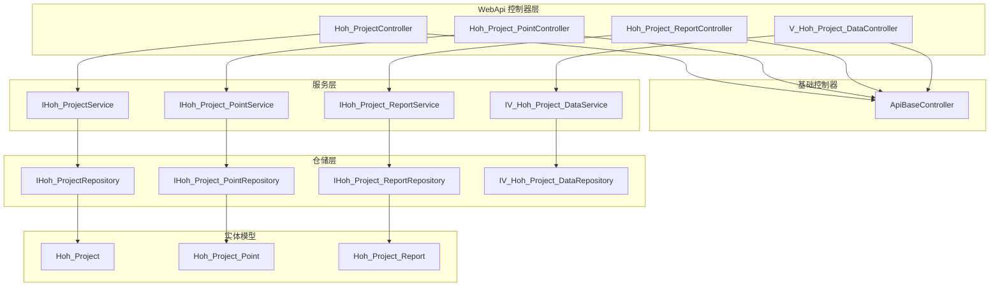
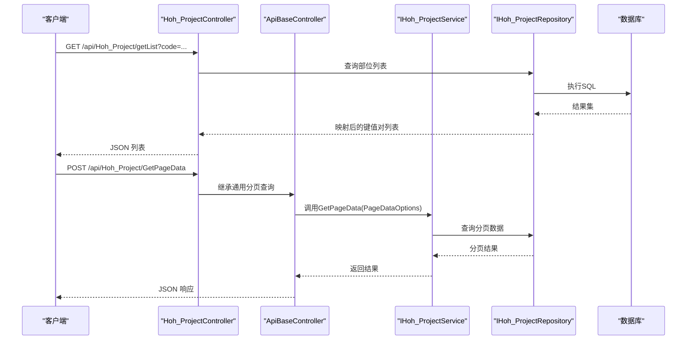
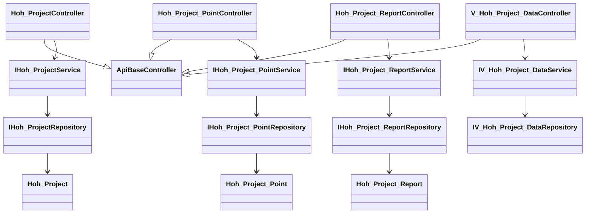

# 水化热监控API

<cite>
**本文引用的文件**
- [Hoh_Project.cs](file://VolPro.Entity/DomainModels/Hoh/Hoh_Project.cs)
- [Hoh_Project_Point.cs](file://VolPro.Entity/DomainModels/Hoh/Hoh_Project_Point.cs)
- [Hoh_Project_Report.cs](file://VolPro.Entity/DomainModels/Hoh/Hoh_Project_Report.cs)
- [Hoh_ProjectController.cs](file://VolPro.WebApi/Controllers/HeatOfHydration/Hoh_ProjectController.cs)
- [Hoh_Project_PointController.cs](file://VolPro.WebApi/Controllers/HeatOfHydration/Hoh_Project_PointController.cs)
- [Hoh_Project_ReportController.cs](file://VolPro.WebApi/Controllers/HeatOfHydration/Hoh_Project_ReportController.cs)
- [V_Hoh_Project_DataController.cs](file://VolPro.WebApi/Controllers/HeatOfHydration/V_Hoh_Project_DataController.cs)
- [ApiBaseController.cs](file://VolPro.Core/Controllers/Basic/ApiBaseController.cs)
- [Hoh_ProjectController.cs（扩展）](file://VolPro.WebApi/Controllers/HeatOfHydration/Partial/Hoh_ProjectController.cs)
- [Hoh_Project_PointController.cs（扩展）](file://VolPro.WebApi/Controllers/HeatOfHydration/Partial/Hoh_Project_PointController.cs)
- [Hoh_Project_ReportController.cs（扩展）](file://VolPro.WebApi/Controllers/HeatOfHydration/Partial/Hoh_Project_ReportController.cs)
- [V_Hoh_Project_DataController.cs（扩展）](file://VolPro.WebApi/Controllers/HeatOfHydration/Partial/V_Hoh_Project_DataController.cs)
</cite>

## 目录
1. [简介](#简介)
2. [项目结构](#项目结构)
3. [核心组件](#核心组件)
4. [架构总览](#架构总览)
5. [详细组件分析](#详细组件分析)
6. [依赖关系分析](#依赖关系分析)
7. [性能考虑](#性能考虑)
8. [故障排查指南](#故障排查指南)
9. [结论](#结论)
10. [附录](#附录)

## 简介
本文件为“水化热监控模块”的API接口文档，覆盖以下能力范围：
- 项目管理：水化热子项目（部位）的创建、更新、删除与查询
- 测点管理：监控测点的配置与数据采集相关接口
- 报表管理：监控报告的生成与导出接口
- 实时监控：基于视图的数据查询与大屏数据接口

文档为每个端点提供HTTP方法、URL路径、请求参数、响应格式与错误码说明，并给出请求/响应示例、数据校验规则与业务约束、最佳实践与常见问题解决方案。

## 项目结构
水化热监控API采用“控制器-服务-仓储-实体”分层设计，核心控制器位于WebApi层，基础控制器统一处理通用CRUD与导入导出等操作；实体模型位于Entity层，对应数据库表结构。

图表来源
- [Hoh_ProjectController.cs:11-19](file://VolPro.WebApi/Controllers/HeatOfHydration/Hoh_ProjectController.cs#L11-L19)
- [Hoh_Project_PointController.cs:11-19](file://VolPro.WebApi/Controllers/HeatOfHydration/Hoh_Project_PointController.cs#L11-L19)
- [Hoh_Project_ReportController.cs:11-19](file://VolPro.WebApi/Controllers/HeatOfHydration/Hoh_Project_ReportController.cs#L11-L19)
- [V_Hoh_Project_DataController.cs:11-19](file://VolPro.WebApi/Controllers/HeatOfHydration/V_Hoh_Project_DataController.cs#L11-L19)
- [ApiBaseController.cs:19-228](file://VolPro.Core/Controllers/Basic/ApiBaseController.cs#L19-L228)
- [Hoh_Project.cs:17-229](file://VolPro.Entity/DomainModels/Hoh/Hoh_Project.cs#L17-L229)
- [Hoh_Project_Point.cs:17-137](file://VolPro.Entity/DomainModels/Hoh/Hoh_Project_Point.cs#L17-L137)
- [Hoh_Project_Report.cs:17-129](file://VolPro.Entity/DomainModels/Hoh/Hoh_Project_Report.cs#L17-L129)

章节来源
- [Hoh_ProjectController.cs:11-19](file://VolPro.WebApi/Controllers/HeatOfHydration/Hoh_ProjectController.cs#L11-L19)
- [ApiBaseController.cs:19-228](file://VolPro.Core/Controllers/Basic/ApiBaseController.cs#L19-L228)

## 核心组件
- 基础控制器ApiBaseController：提供统一的分页查询、新增、编辑、删除、导入、导出、上传、审核/反审核等通用接口，路由后缀固定为“/GetPageData”、“/Add”、“/Update”、“/Del”、“/Import”、“/Export”、“/Upload”、“/Audit”、“/antiAudit”等。
- 部门控制器：各业务控制器继承基础控制器并按需扩展特定业务接口（如“/getList”、“/getProjectDataInfo”）。

章节来源
- [ApiBaseController.cs:35-227](file://VolPro.Core/Controllers/Basic/ApiBaseController.cs#L35-L227)
- [Hoh_ProjectController.cs（扩展）:45-66](file://VolPro.WebApi/Controllers/HeatOfHydration/Partial/Hoh_ProjectController.cs#L45-L66)

## 架构总览
水化热监控API遵循“控制器-服务-仓储-实体”分层，控制器负责路由与鉴权，服务层封装业务逻辑，仓储层负责数据访问，实体模型映射数据库表。

图表来源
- [Hoh_ProjectController.cs:11-19](file://VolPro.WebApi/Controllers/HeatOfHydration/Hoh_ProjectController.cs#L11-L19)
- [Hoh_ProjectController.cs（扩展）:45-66](file://VolPro.WebApi/Controllers/HeatOfHydration/Partial/Hoh_ProjectController.cs#L45-L66)
- [ApiBaseController.cs:35-41](file://VolPro.Core/Controllers/Basic/ApiBaseController.cs#L35-L41)

## 详细组件分析

### 项目管理接口（水化热子项目）
- 路由前缀：/api/Hoh_Project
- 权限表：Hoh_Project
- 基础能力：继承ApiBaseController，支持分页查询、新增、编辑、删除、导入、导出、上传、审核/反审核等。

1) 分页查询
- 方法：POST
- 路径：/api/Hoh_Project/GetPageData
- 请求体：PageDataOptions（分页与筛选条件）
- 响应：分页数据集合
- 错误码：参考通用响应

2) 新增
- 方法：POST
- 路径：/api/Hoh_Project/Add
- 请求体：SaveModel（含主表数据与子表数据）
- 响应：保存结果（含数据序列化）

3) 编辑
- 方法：POST
- 路径：/api/Hoh_Project/Update
- 请求体：SaveModel（含主表数据与子表数据）
- 响应：更新结果（含数据序列化）

4) 删除
- 方法：POST
- 路径：/api/Hoh_Project/Del
- 请求体：主键数组
- 响应：删除结果

5) 导入/导出/上传（通用）
- 方法：GET/POST
- 路径：/api/Hoh_Project/DownLoadTemplate、/api/Hoh_Project/Import、/api/Hoh_Project/Export、/api/Hoh_Project/Upload
- 响应：模板下载、导入结果、导出文件流、上传结果

6) 业务扩展接口
- 获取部位列表（用于级联选择）
  - 方法：GET
  - 路径：/api/Hoh_Project/getList?code=主项目ID
  - 参数：code（主项目ID）
  - 响应：[{key: 部位ID, value: 部位名称}]

- 获取大屏数据
  - 方法：GET
  - 路径：/api/Hoh_Project/getProjectDataInfo?code=部位ID
  - 参数：code（部位ID）
  - 响应：项目数据聚合信息（由服务实现返回）

请求/响应示例（示意）
- GET /api/Hoh_Project/getList?code=1001
  - 响应示例：[{"key":10001,"value":"承台A"},{"key":10002,"value":"承台B"}]
- GET /api/Hoh_Project/getProjectDataInfo?code=10001
  - 响应示例：{"status":true,"message":"","data":{"sectionName":"承台A","pourDate":"2025-04-01T08:00:00Z","pourEndDate":"2025-04-01T18:00:00Z","warningCount":0,"alarmCount":0,"instructionCount":0,"reportPeriods":1}}

数据验证与业务约束
- 必填字段：SectionName、HohStatus、PourDate、PourEndDate、ConcreteGrade、Creator、Modifier、CreateDate、ModifyDate、CreateID、ModifyID
- 数值精度：PourVolume保留两位小数
- 状态枚举：HohStatus建议使用“浇筑中/已完成/已暂停”等预定义值
- 时间范围：PourDate ≤ PourEndDate

最佳实践
- 使用分页查询时，合理设置排序与筛选条件，避免全表扫描
- 新增/编辑时，先校验必填字段与业务规则，再提交SaveModel
- 导出时注意文件大小限制与下载超时

章节来源
- [Hoh_ProjectController.cs:11-19](file://VolPro.WebApi/Controllers/HeatOfHydration/Hoh_ProjectController.cs#L11-L19)
- [Hoh_ProjectController.cs（扩展）:45-66](file://VolPro.WebApi/Controllers/HeatOfHydration/Partial/Hoh_ProjectController.cs#L45-L66)
- [ApiBaseController.cs:35-227](file://VolPro.Core/Controllers/Basic/ApiBaseController.cs#L35-L227)
- [Hoh_Project.cs:17-229](file://VolPro.Entity/DomainModels/Hoh/Hoh_Project.cs#L17-L229)

### 测点管理接口（监控测点）
- 路由前缀：/api/Hoh_Project_Point
- 权限表：Hoh_Project_Point
- 基础能力：继承ApiBaseController，支持分页查询、新增、编辑、删除、导入、导出、上传、审核/反审核等。

1) 分页查询
- 方法：POST
- 路径：/api/Hoh_Project_Point/GetPageData
- 请求体：PageDataOptions
- 响应：分页数据集合

2) 新增/编辑/删除/导入/导出/上传（同上）

3) 业务扩展接口
- 当前控制器未扩展特定业务接口，后续可按需添加测点配置、批量导入、测点状态变更等接口

请求/响应示例（示意）
- POST /api/Hoh_Project_Point/GetPageData
  - 请求体：PageDataOptions（筛选条件：Project_id、HohProject_id、PointName等）
  - 响应示例：分页列表，包含PointId、PointName、PointType、PointLocate、MoldingTime等

数据验证与业务约束
- 必填字段：Project_id、HohProject_id、PointName、PointType、Creator、Modifier、CreateDate、ModifyDate、CreateID、ModifyID
- 类型约束：PointType建议使用“核心/表面/预留”等预定义值
- 时间约束：MoldingTime为可选，若存在需早于或等于当前时间

最佳实践
- 测点命名应唯一且具备工程语义
- 批量导入时，建议先校验外键关系（Project_id、HohProject_id）有效性

章节来源
- [Hoh_Project_PointController.cs:11-19](file://VolPro.WebApi/Controllers/HeatOfHydration/Hoh_Project_PointController.cs#L11-L19)
- [Hoh_Project_PointController.cs（扩展）:22-33](file://VolPro.WebApi/Controllers/HeatOfHydration/Partial/Hoh_Project_PointController.cs#L22-L33)
- [ApiBaseController.cs:35-227](file://VolPro.Core/Controllers/Basic/ApiBaseController.cs#L35-L227)
- [Hoh_Project_Point.cs:17-137](file://VolPro.Entity/DomainModels/Hoh/Hoh_Project_Point.cs#L17-L137)

### 报表管理接口（监控报告）
- 路径前缀：/api/Hoh_Project_Report
- 权限表：Hoh_Project_Report
- 基础能力：继承ApiBaseController，支持分页查询、新增、编辑、删除、导入、导出、上传、审核/反审核等。

1) 分页查询
- 方法：POST
- 路径：/api/Hoh_Project_Report/GetPageData
- 请求体：PageDataOptions
- 响应：分页数据集合

2) 新增/编辑/删除/导入/导出/上传（同上）

3) 业务扩展接口
- 当前控制器未扩展特定业务接口，后续可按需添加报表生成、导出PDF/Excel等接口

请求/响应示例（示意）
- POST /api/Hoh_Project_Report/GetPageData
  - 请求体：PageDataOptions（筛选条件：Project_id、HohProject_id、ReportName、ReportDate等）
  - 响应示例：分页列表，包含ReportId、ReportName、ReportDate、FileUrl、Creator、CreateDate等

数据验证与业务约束
- 必填字段：Project_id、HohProject_id、ReportName、ReportDate、FileUrl、Creator、Modifier、CreateDate、ModifyDate、CreateID、ModifyID
- 文件路径：FileUrl为报告文件存储路径，需确保可访问性

最佳实践
- 报表生成后及时更新FileUrl与报告日期
- 导出报表时建议异步处理，避免阻塞接口

章节来源
- [Hoh_Project_ReportController.cs:11-19](file://VolPro.WebApi/Controllers/HeatOfHydration/Hoh_Project_ReportController.cs#L11-L19)
- [Hoh_Project_ReportController.cs（扩展）:22-33](file://VolPro.WebApi/Controllers/HeatOfHydration/Partial/Hoh_Project_ReportController.cs#L22-L33)
- [ApiBaseController.cs:35-227](file://VolPro.Core/Controllers/Basic/ApiBaseController.cs#L35-L227)
- [Hoh_Project_Report.cs:17-129](file://VolPro.Entity/DomainModels/Hoh/Hoh_Project_Report.cs#L17-L129)

### 实时数据监控接口（视图数据）
- 路径前缀：/api/V_Hoh_Project_Data
- 权限表：V_Hoh_Project_Data
- 基础能力：继承ApiBaseController，支持分页查询、新增、编辑、删除、导入、导出、上传、审核/反审核等。

1) 分页查询
- 方法：POST
- 路径：/api/V_Hoh_Project_Data/GetPageData
- 请求体：PageDataOptions
- 响应：分页数据集合（视图数据）

2) 新增/编辑/删除/导入/导出/上传（同上）

3) 业务扩展接口
- 当前控制器未扩展特定业务接口，后续可按需添加实时数据推送、历史曲线查询、阈值告警等接口

请求/响应示例（示意）
- POST /api/V_Hoh_Project_Data/GetPageData
  - 请求体：PageDataOptions（筛选条件：Project_id、HohProject_id、PointId、时间范围等）
  - 响应示例：分页列表，包含测点温度、时间戳、部位信息等

数据验证与业务约束
- 时间范围：建议按小时/天粒度查询，避免过大范围导致性能问题
- 粒度控制：单次查询条目数建议限制在合理范围内

最佳实践
- 实时监控建议结合前端轮询或WebSocket推送
- 对高频查询进行缓存与索引优化

章节来源
- [V_Hoh_Project_DataController.cs:11-19](file://VolPro.WebApi/Controllers/HeatOfHydration/V_Hoh_Project_DataController.cs#L11-L19)
- [V_Hoh_Project_DataController.cs（扩展）:22-33](file://VolPro.WebApi/Controllers/HeatOfHydration/Partial/V_Hoh_Project_DataController.cs#L22-L33)
- [ApiBaseController.cs:35-227](file://VolPro.Core/Controllers/Basic/ApiBaseController.cs#L35-L227)

## 依赖关系分析
- 控制器依赖服务接口（IHoh_ProjectService、IHoh_Project_PointService、IHoh_Project_ReportService、IV_Hoh_Project_DataService）
- 服务依赖仓储接口（IHoh_ProjectRepository、IHoh_Project_PointRepository、IHoh_Project_ReportRepository、IV_Hoh_Project_DataRepository）
- 仓储映射实体模型（Hoh_Project、Hoh_Project_Point、Hoh_Project_Report）
- 基础控制器统一处理鉴权、日志与通用操作

图表来源
- [Hoh_ProjectController.cs:11-19](file://VolPro.WebApi/Controllers/HeatOfHydration/Hoh_ProjectController.cs#L11-L19)
- [Hoh_Project_PointController.cs:11-19](file://VolPro.WebApi/Controllers/HeatOfHydration/Hoh_Project_PointController.cs#L11-L19)
- [Hoh_Project_ReportController.cs:11-19](file://VolPro.WebApi/Controllers/HeatOfHydration/Hoh_Project_ReportController.cs#L11-L19)
- [V_Hoh_Project_DataController.cs:11-19](file://VolPro.WebApi/Controllers/HeatOfHydration/V_Hoh_Project_DataController.cs#L11-L19)
- [ApiBaseController.cs:19-228](file://VolPro.Core/Controllers/Basic/ApiBaseController.cs#L19-L228)
- [Hoh_Project.cs:17-229](file://VolPro.Entity/DomainModels/Hoh/Hoh_Project.cs#L17-L229)
- [Hoh_Project_Point.cs:17-137](file://VolPro.Entity/DomainModels/Hoh/Hoh_Project_Point.cs#L17-L137)
- [Hoh_Project_Report.cs:17-129](file://VolPro.Entity/DomainModels/Hoh/Hoh_Project_Report.cs#L17-L129)

## 性能考虑
- 分页查询：建议为常用筛选字段建立索引，避免全表扫描
- 导出/导入：建议异步处理大批量任务，避免阻塞接口
- 实时监控：对高频查询进行缓存与限流，控制单次查询数据量
- 文件下载：导出文件采用流式输出，避免一次性加载到内存

## 故障排查指南
- 通用错误码
  - 400：请求参数缺失或格式不正确
  - 401：未授权或令牌无效
  - 403：无权限执行该操作
  - 404：资源不存在
  - 500：服务器内部错误
- 常见问题
  - 分页查询无结果：检查筛选条件是否过严或索引缺失
  - 导出失败：确认文件路径与权限、磁盘空间
  - 上传异常：检查文件大小限制与MIME类型
  - 新增/编辑失败：核对必填字段与业务规则
- 日志与审计
  - 基础控制器已集成操作日志与审计记录，便于定位问题

章节来源
- [ApiBaseController.cs:35-227](file://VolPro.Core/Controllers/Basic/ApiBaseController.cs#L35-L227)

## 结论
本文档梳理了水化热监控模块的API接口，明确了项目管理、测点管理、报表管理与实时数据监控的端点与规范。建议在生产环境中结合鉴权、限流、缓存与异步处理等手段提升稳定性与性能，并持续完善业务扩展接口以满足实际工程需求。

## 附录
- 数据模型字段说明（节选）
  - Hoh_Project：部位名称、浇筑状态、开始/结束时间、混凝土标号、测点数量、预警/报警/指令次数、报表期数、创建/修改信息等
  - Hoh_Project_Point：测点名称、类型、位置、入模时间、所属项目与部位、创建/修改信息等
  - Hoh_Project_Report：报告名称、报告日期、文件路径、创建/修改信息等

章节来源
- [Hoh_Project.cs:17-229](file://VolPro.Entity/DomainModels/Hoh/Hoh_Project.cs#L17-L229)
- [Hoh_Project_Point.cs:17-137](file://VolPro.Entity/DomainModels/Hoh/Hoh_Project_Point.cs#L17-L137)
- [Hoh_Project_Report.cs:17-129](file://VolPro.Entity/DomainModels/Hoh/Hoh_Project_Report.cs#L17-L129)