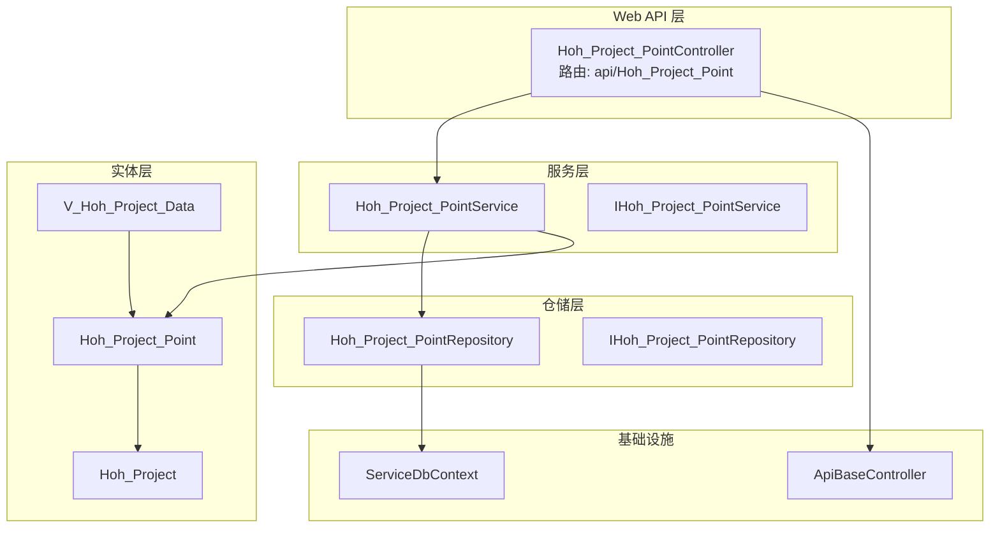
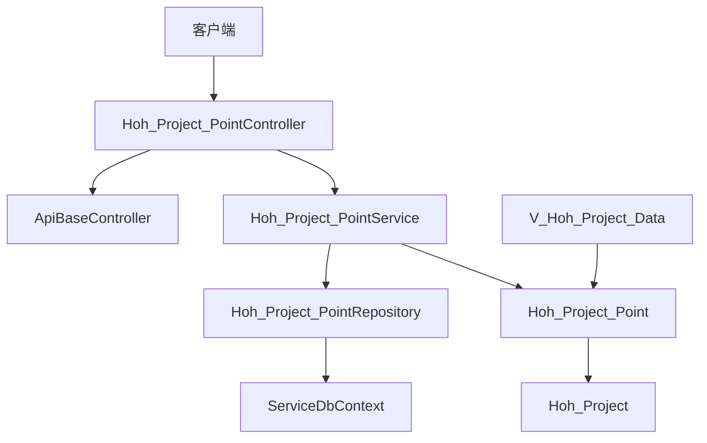
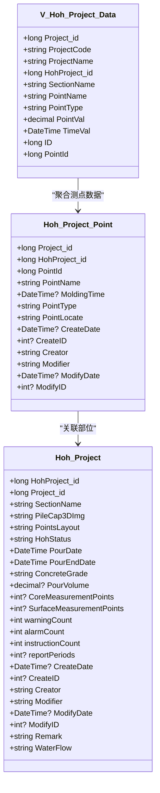
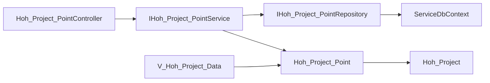

# 测点管理API

<cite>
**本文引用的文件**
- [Hoh_Project_PointController.cs](file://VolPro.WebApi/Controllers/HeatOfHydration/Hoh_Project_PointController.cs)
- [IHoh_Project_PointService.cs](file://Hncdi.HeatOfHydration/IServices/Hoh/IHoh_Project_PointService.cs)
- [Hoh_Project_PointService.cs](file://Hncdi.HeatOfHydration/Services/Hoh/Hoh_Project_PointService.cs)
- [IHoh_Project_PointRepository.cs](file://Hncdi.HeatOfHydration/IRepositories/Hoh/IHoh_Project_PointRepository.cs)
- [Hoh_Project_PointRepository.cs](file://Hncdi.HeatOfHydration/Repositories/Hoh/Hoh_Project_PointRepository.cs)
- [Hoh_Project_Point.cs](file://VolPro.Entity/DomainModels/Hoh/Hoh_Project_Point.cs)
- [Hoh_Project.cs](file://VolPro.Entity/DomainModels/Hoh/Hoh_Project.cs)
- [V_Hoh_Project_Data.cs](file://VolPro.Entity/DomainModels/Hoh/V_Hoh_Project_Data.cs)
- [ApiBaseController.cs](file://VolPro.Core/Controllers/Basic/ApiBaseController.cs)
- [ServiceDbContext.cs](file://VolPro.Core/EFDbContext/ServiceDbContext.cs)
</cite>

## 目录
1. [简介](#简介)
2. [项目结构](#项目结构)
3. [核心组件](#核心组件)
4. [架构总览](#架构总览)
5. [详细组件分析](#详细组件分析)
6. [依赖关系分析](#依赖关系分析)
7. [性能考虑](#性能考虑)
8. [故障排查指南](#故障排查指南)
9. [结论](#结论)
10. [附录](#附录)

## 简介
本文件面向“水化热测点管理API”的使用与维护，聚焦于测点配置、数据采集、状态监控等核心能力。基于现有代码结构，系统采用分层架构：Web API 控制器负责请求入口与权限控制；服务层封装业务逻辑；仓储层对接数据库；实体模型描述数据结构。测点管理围绕“测点表(Hoh_Project_Point)”、“部位表(Hoh_Project)”、“测点数据视图(V_Hoh_Project_Data)”展开，支持测点位置设置、参数配置、历史数据查询与状态更新等能力。

## 项目结构
- 控制器层：位于 WebApi 层，提供 HTTP 接口入口，继承基础控制器以统一响应与权限控制。
- 服务层：位于 Hncdi.HeatOfHydration 项目，封装业务逻辑并协调仓储。
- 仓储层：位于 Hncdi.HeatOfHydration 项目，负责数据库访问与持久化。
- 实体层：位于 VolPro.Entity，定义测点、部位、测点数据视图等模型。
- 基础设施：位于 VolPro.Core，提供控制器基类、EF上下文、中间件等通用能力。

图表来源
- [Hoh_Project_PointController.cs:11-19](file://VolPro.WebApi/Controllers/HeatOfHydration/Hoh_Project_PointController.cs#L11-L19)
- [IHoh_Project_PointService.cs:9-11](file://Hncdi.HeatOfHydration/IServices/Hoh/IHoh_Project_PointService.cs#L9-L11)
- [Hoh_Project_PointService.cs:15-21](file://Hncdi.HeatOfHydration/Services/Hoh/Hoh_Project_PointService.cs#L15-L21)
- [IHoh_Project_PointRepository.cs:15-17](file://Hncdi.HeatOfHydration/IRepositories/Hoh/IHoh_Project_PointRepository.cs#L15-L17)
- [Hoh_Project_PointRepository.cs:13-23](file://Hncdi.HeatOfHydration/Repositories/Hoh/Hoh_Project_PointRepository.cs#L13-L23)
- [Hoh_Project_Point.cs:17-18](file://VolPro.Entity/DomainModels/Hoh/Hoh_Project_Point.cs#L17-L18)
- [Hoh_Project.cs:17-18](file://VolPro.Entity/DomainModels/Hoh/Hoh_Project.cs#L17-L18)
- [V_Hoh_Project_Data.cs:17-18](file://VolPro.Entity/DomainModels/Hoh/V_Hoh_Project_Data.cs#L17-L18)
- [ApiBaseController.cs](file://VolPro.Core/Controllers/Basic/ApiBaseController.cs)

章节来源
- [Hoh_Project_PointController.cs:11-19](file://VolPro.WebApi/Controllers/HeatOfHydration/Hoh_Project_PointController.cs#L11-L19)
- [Hoh_Project_PointService.cs:15-21](file://Hncdi.HeatOfHydration/Services/Hoh/Hoh_Project_PointService.cs#L15-L21)
- [Hoh_Project_PointRepository.cs:13-23](file://Hncdi.HeatOfHydration/Repositories/Hoh/Hoh_Project_PointRepository.cs#L13-L23)
- [Hoh_Project_Point.cs:17-18](file://VolPro.Entity/DomainModels/Hoh/Hoh_Project_Point.cs#L17-L18)
- [Hoh_Project.cs:17-18](file://VolPro.Entity/DomainModels/Hoh/Hoh_Project.cs#L17-L18)
- [V_Hoh_Project_Data.cs:17-18](file://VolPro.Entity/DomainModels/Hoh/V_Hoh_Project_Data.cs#L17-L18)
- [ApiBaseController.cs](file://VolPro.Core/Controllers/Basic/ApiBaseController.cs)

## 核心组件
- 测点控制器：提供测点资源的HTTP接口，路由为 api/Hoh_Project_Point，并应用权限表注解进行权限控制。
- 测点服务：封装测点业务逻辑，依赖仓储实现数据访问。
- 测点仓储：基于 EF 上下文实现对测点表的增删改查。
- 测点实体：描述测点的字段，包括所属部位、点位名称、类型、入模时间、位置信息及审计字段。
- 部位实体：描述水化热部位信息，包含浇筑状态、时间范围、预警/报警/指令统计等。
- 数据视图实体：提供测点历史数据的聚合视图，包含项目/部位/测点名称、测值、时间等。

章节来源
- [Hoh_Project_PointController.cs:11-19](file://VolPro.WebApi/Controllers/HeatOfHydration/Hoh_Project_PointController.cs#L11-L19)
- [IHoh_Project_PointService.cs:9-11](file://Hncdi.HeatOfHydration/IServices/Hoh/IHoh_Project_PointService.cs#L9-L11)
- [Hoh_Project_PointService.cs:15-21](file://Hncdi.HeatOfHydration/Services/Hoh/Hoh_Project_PointService.cs#L15-L21)
- [IHoh_Project_PointRepository.cs:15-17](file://Hncdi.HeatOfHydration/IRepositories/Hoh/IHoh_Project_PointRepository.cs#L15-L17)
- [Hoh_Project_PointRepository.cs:13-23](file://Hncdi.HeatOfHydration/Repositories/Hoh/Hoh_Project_PointRepository.cs#L13-L23)
- [Hoh_Project_Point.cs:17-138](file://VolPro.Entity/DomainModels/Hoh/Hoh_Project_Point.cs#L17-L138)
- [Hoh_Project.cs:17-230](file://VolPro.Entity/DomainModels/Hoh/Hoh_Project.cs#L17-L230)
- [V_Hoh_Project_Data.cs:17-129](file://VolPro.Entity/DomainModels/Hoh/V_Hoh_Project_Data.cs#L17-L129)

## 架构总览
系统遵循经典的分层架构，控制器负责请求接入与权限校验，服务层编排业务流程，仓储层负责数据持久化，实体模型承载数据结构。EF 上下文作为数据访问基础设施，贯穿仓储与服务层。

图表来源
- [Hoh_Project_PointController.cs:11-19](file://VolPro.WebApi/Controllers/HeatOfHydration/Hoh_Project_PointController.cs#L11-L19)
- [ApiBaseController.cs](file://VolPro.Core/Controllers/Basic/ApiBaseController.cs)
- [Hoh_Project_PointService.cs:15-21](file://Hncdi.HeatOfHydration/Services/Hoh/Hoh_Project_PointService.cs#L15-L21)
- [Hoh_Project_PointRepository.cs:13-23](file://Hncdi.HeatOfHydration/Repositories/Hoh/Hoh_Project_PointRepository.cs#L13-L23)
- [ServiceDbContext.cs](file://VolPro.Core/EFDbContext/ServiceDbContext.cs)

## 详细组件分析

### 控制器层：测点接口
- 路由与权限：控制器通过路由 api/Hoh_Project_Point 暴露接口，并标注权限表，便于统一鉴权。
- 继承关系：继承基础控制器，复用统一响应与中间件能力。
- 扩展方式：如需新增接口，可在当前控制器的 Partial 文件夹中扩展。

章节来源
- [Hoh_Project_PointController.cs:11-19](file://VolPro.WebApi/Controllers/HeatOfHydration/Hoh_Project_PointController.cs#L11-L19)

### 服务层：测点业务
- 依赖注入：服务通过 Autofac 容器获取实例，确保单例与生命周期管理。
- 业务职责：封装测点的业务逻辑，协调仓储完成数据操作。
- 扩展方式：业务逻辑应写入 Partial 文件夹下的服务实现。

章节来源
- [Hoh_Project_PointService.cs:15-21](file://Hncdi.HeatOfHydration/Services/Hoh/Hoh_Project_PointService.cs#L15-L21)
- [IHoh_Project_PointService.cs:9-11](file://Hncdi.HeatOfHydration/IServices/Hoh/IHoh_Project_PointService.cs#L9-L11)

### 仓储层：测点数据访问
- EF 上下文：仓储构造函数注入 EF 上下文，用于数据库操作。
- 单例获取：通过 Autofac 获取仓储实例，保证线程安全与一致性。
- 扩展方式：如需自定义查询或批量操作，可在 Partial 文件夹中扩展。

章节来源
- [Hoh_Project_PointRepository.cs:13-23](file://Hncdi.HeatOfHydration/Repositories/Hoh/Hoh_Project_PointRepository.cs#L13-L23)
- [IHoh_Project_PointRepository.cs:15-17](file://Hncdi.HeatOfHydration/IRepositories/Hoh/IHoh_Project_PointRepository.cs#L15-L17)
- [ServiceDbContext.cs](file://VolPro.Core/EFDbContext/ServiceDbContext.cs)

### 实体模型：测点、部位与数据视图
- 测点实体：包含项目/部位关联、点位名称、类型、入模时间、位置信息与审计字段。
- 部位实体：包含部位名称、三维图/布置图、浇筑状态与时间范围、预警/报警/指令统计等。
- 数据视图：聚合测点历史数据，包含项目/部位/测点名称、测值、时间等字段。

章节来源
- [Hoh_Project_Point.cs:17-138](file://VolPro.Entity/DomainModels/Hoh/Hoh_Project_Point.cs#L17-L138)
- [Hoh_Project.cs:17-230](file://VolPro.Entity/DomainModels/Hoh/Hoh_Project.cs#L17-L230)
- [V_Hoh_Project_Data.cs:17-129](file://VolPro.Entity/DomainModels/Hoh/V_Hoh_Project_Data.cs#L17-L129)

### 类关系图

图表来源
- [Hoh_Project_Point.cs:17-138](file://VolPro.Entity/DomainModels/Hoh/Hoh_Project_Point.cs#L17-L138)
- [Hoh_Project.cs:17-230](file://VolPro.Entity/DomainModels/Hoh/Hoh_Project.cs#L17-L230)
- [V_Hoh_Project_Data.cs:17-129](file://VolPro.Entity/DomainModels/Hoh/V_Hoh_Project_Data.cs#L17-L129)

## 依赖关系分析
- 控制器依赖服务接口，服务依赖仓储接口，仓储依赖 EF 上下文。
- 实体模型之间存在关联关系：测点实体关联部位实体；数据视图聚合测点数据。
- 权限控制通过控制器上的权限表注解实现，基础控制器提供统一响应与中间件。

图表来源
- [Hoh_Project_PointController.cs:11-19](file://VolPro.WebApi/Controllers/HeatOfHydration/Hoh_Project_PointController.cs#L11-L19)
- [IHoh_Project_PointService.cs:9-11](file://Hncdi.HeatOfHydration/IServices/Hoh/IHoh_Project_PointService.cs#L9-L11)
- [IHoh_Project_PointRepository.cs:15-17](file://Hncdi.HeatOfHydration/IRepositories/Hoh/IHoh_Project_PointRepository.cs#L15-L17)
- [ServiceDbContext.cs](file://VolPro.Core/EFDbContext/ServiceDbContext.cs)
- [Hoh_Project_Point.cs:17-138](file://VolPro.Entity/DomainModels/Hoh/Hoh_Project_Point.cs#L17-L138)
- [Hoh_Project.cs:17-230](file://VolPro.Entity/DomainModels/Hoh/Hoh_Project.cs#L17-L230)
- [V_Hoh_Project_Data.cs:17-129](file://VolPro.Entity/DomainModels/Hoh/V_Hoh_Project_Data.cs#L17-L129)

章节来源
- [Hoh_Project_PointController.cs:11-19](file://VolPro.WebApi/Controllers/HeatOfHydration/Hoh_Project_PointController.cs#L11-L19)
- [IHoh_Project_PointService.cs:9-11](file://Hncdi.HeatOfHydration/IServices/Hoh/IHoh_Project_PointService.cs#L9-L11)
- [IHoh_Project_PointRepository.cs:15-17](file://Hncdi.HeatOfHydration/IRepositories/Hoh/IHoh_Project_PointRepository.cs#L15-L17)
- [ServiceDbContext.cs](file://VolPro.Core/EFDbContext/ServiceDbContext.cs)

## 性能考虑
- 查询优化：建议在测点与数据视图的关键字段上建立索引，减少大表扫描。
- 分页与筛选：对外暴露的查询接口应支持分页与多维过滤，避免一次性返回大量历史数据。
- 缓存策略：对热点部位与测点配置可引入缓存，降低数据库压力。
- 连接池：EF 上下文连接池配置需合理，避免连接泄漏与抖动。
- 异步操作：优先使用异步读写，提升并发吞吐。

## 故障排查指南
- 权限错误：确认控制器上的权限表注解是否正确配置，以及调用方是否具备相应权限。
- 数据不一致：检查 EF 上下文事务边界，确保批量写入时的原子性。
- 查询超时：对复杂视图查询进行 Explain 分析，必要时拆分查询或添加索引。
- 参数校验：前端传参需满足实体模型的必填与长度约束，后端统一通过基础控制器进行响应包装。

章节来源
- [Hoh_Project_PointController.cs:11-19](file://VolPro.WebApi/Controllers/HeatOfHydration/Hoh_Project_PointController.cs#L11-L19)
- [ApiBaseController.cs](file://VolPro.Core/Controllers/Basic/ApiBaseController.cs)

## 结论
测点管理API以清晰的分层架构实现了测点配置、数据查询与状态监控的基础能力。通过实体模型与数据视图的配合，能够支撑测点位置设置、参数配置、历史数据查询与状态更新等场景。后续可在查询性能、缓存策略与异常处理方面进一步优化，以满足高并发与大数据量的生产需求。

## 附录

### API 接口清单与说明
- 路由：api/Hoh_Project_Point
- 权限：通过控制器权限表注解控制
- 基础能力：基于控制器继承的基础控制器，统一响应与中间件
- 扩展建议：在控制器的 Partial 文件夹中扩展具体接口，保持与框架生成器的一致性

章节来源
- [Hoh_Project_PointController.cs:11-19](file://VolPro.WebApi/Controllers/HeatOfHydration/Hoh_Project_PointController.cs#L11-L19)
- [ApiBaseController.cs](file://VolPro.Core/Controllers/Basic/ApiBaseController.cs)

### 测点数据模型与字段说明
- 测点实体关键字段：项目/部位关联、点位名称、类型、入模时间、位置信息与审计字段
- 部位实体关键字段：部位名称、三维图/布置图、浇筑状态与时间范围、预警/报警/指令统计
- 数据视图关键字段：项目/部位/测点名称、测值、时间、主键ID

章节来源
- [Hoh_Project_Point.cs:17-138](file://VolPro.Entity/DomainModels/Hoh/Hoh_Project_Point.cs#L17-L138)
- [Hoh_Project.cs:17-230](file://VolPro.Entity/DomainModels/Hoh/Hoh_Project.cs#L17-L230)
- [V_Hoh_Project_Data.cs:17-129](file://VolPro.Entity/DomainModels/Hoh/V_Hoh_Project_Data.cs#L17-L129)

### 数据上传格式与存储结构
- 上传格式：建议采用 JSON 结构，包含测点基本信息与测值数组（时间戳与温度/应变等）
- 存储结构：测点数据通过视图聚合，便于按项目/部位/测点维度查询
- 时间序列格式：时间字段为日期时间类型，测值为高精度数值类型
- 精度要求：测值保留至指定小数位，确保展示与计算一致性
- 异常处理：统一通过基础控制器响应包装，异常信息标准化输出

章节来源
- [V_Hoh_Project_Data.cs:90-105](file://VolPro.Entity/DomainModels/Hoh/V_Hoh_Project_Data.cs#L90-L105)
- [ApiBaseController.cs](file://VolPro.Core/Controllers/Basic/ApiBaseController.cs)

### 查询条件与过滤规则
- 支持按项目/部位/测点名称过滤
- 支持按时间范围过滤（起止时间）
- 支持按测点类型过滤
- 支持分页查询与排序（默认按时间倒序）

章节来源
- [V_Hoh_Project_Data.cs:20-105](file://VolPro.Entity/DomainModels/Hoh/V_Hoh_Project_Data.cs#L20-L105)

### 最佳实践
- 测点配置：统一在测点实体中维护位置与类型信息，避免分散配置
- 数据采集：建议按固定周期上传，确保时间序列连续性
- 状态监控：结合部位实体的浇筑状态与统计字段，实现可视化监控
- 性能优化：对高频查询字段建立索引，合理使用分页与缓存

章节来源
- [Hoh_Project_Point.cs:17-138](file://VolPro.Entity/DomainModels/Hoh/Hoh_Project_Point.cs#L17-L138)
- [Hoh_Project.cs:17-230](file://VolPro.Entity/DomainModels/Hoh/Hoh_Project.cs#L17-L230)
- [V_Hoh_Project_Data.cs:17-129](file://VolPro.Entity/DomainModels/Hoh/V_Hoh_Project_Data.cs#L17-L129)