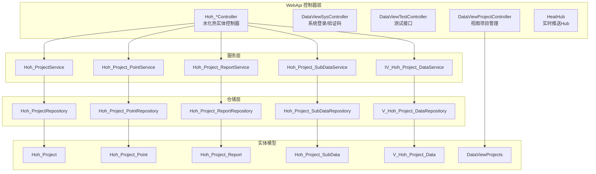
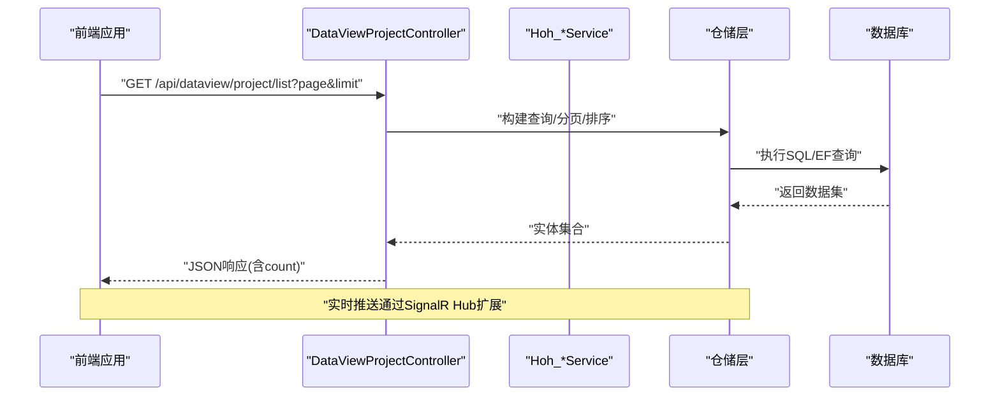
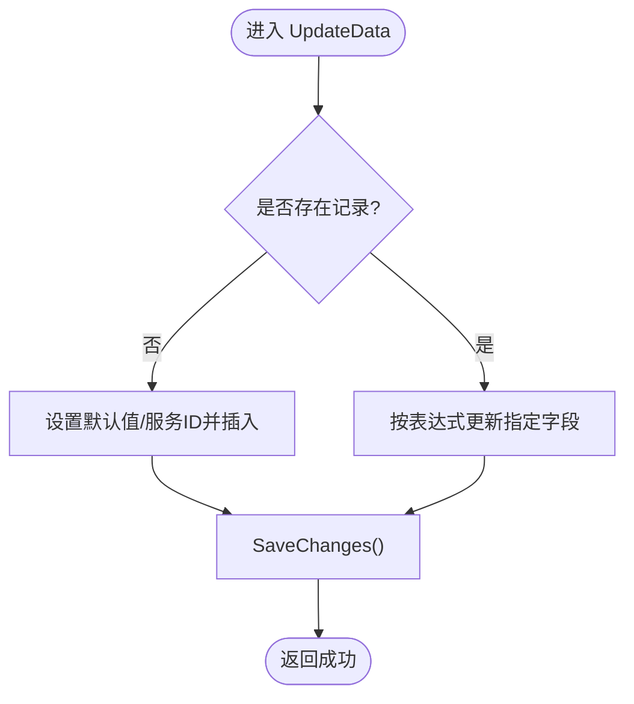
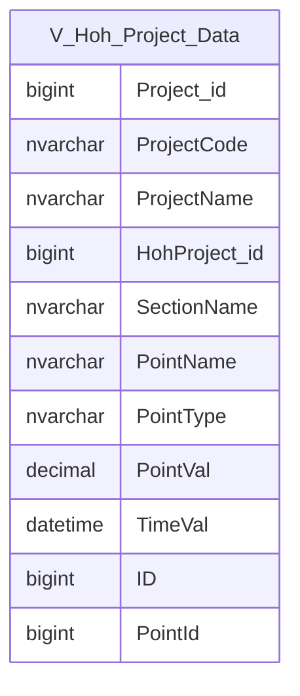
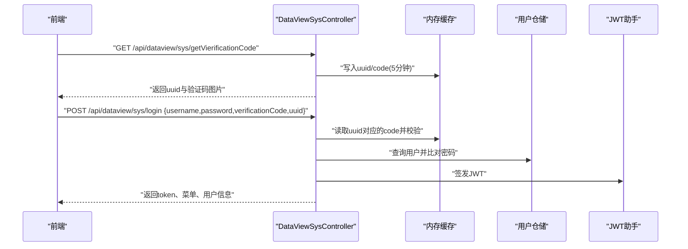
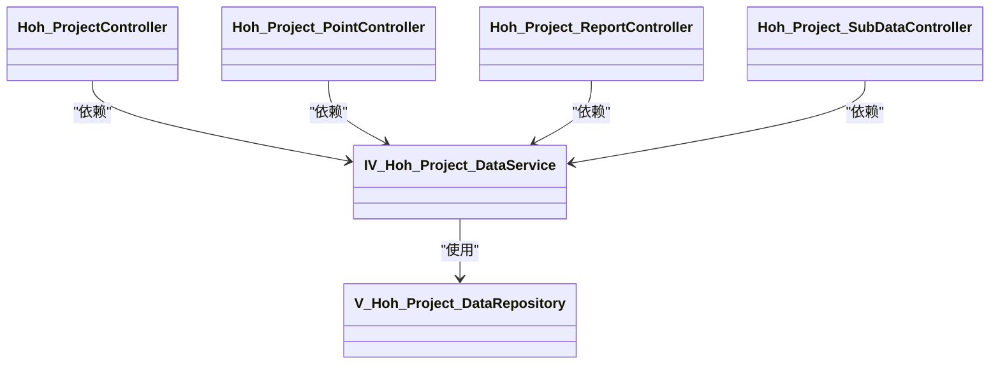

# 视图数据API

<cite>
**本文引用的文件**
- [DataViewProjectController.cs](file://VolPro.WebApi/Controllers/DataView/DataViewProjectController.cs)
- [DataViewSysController.cs](file://VolPro.WebApi/Controllers/DataView/DataViewSysController.cs)
- [DataViewTestController.cs](file://VolPro.WebApi/Controllers/DataView/DataViewTestController.cs)
- [V_Hoh_Project_Data.cs](file://VolPro.Entity/DomainModels/Hoh/V_Hoh_Project_Data.cs)
- [V_Hoh_Project_DataRepository.cs](file://Hncdi.HeatOfHydration/Repositories/Hoh/V_Hoh_Project_DataRepository.cs)
- [IV_Hoh_Project_DataService.cs](file://Hncdi.HeatOfHydration/IServices/Hoh/IV_Hoh_Project_DataService.cs)
- [Hoh_ProjectController.cs](file://VolPro.WebApi/Controllers/HeatOfHydration/Hoh_ProjectController.cs)
- [Hoh_Project_PointController.cs](file://VolPro.WebApi/Controllers/HeatOfHydration/Hoh_Project_PointController.cs)
- [Hoh_Project_ReportController.cs](file://VolPro.WebApi/Controllers/HeatOfHydration/Hoh_Project_ReportController.cs)
- [Hoh_Project_SubDataController.cs](file://VolPro.WebApi/Controllers/HeatOfHydration/Hoh_Project_SubDataController.cs)
- [Hoh_ProjectService.cs](file://Hncdi.HeatOfHydration/Services/Hoh/Hoh_ProjectService.cs)
- [Hoh_Project_PointService.cs](file://Hncdi.HeatOfHydration/Services/Hoh/Hoh_Project_PointService.cs)
- [Hoh_Project_ReportService.cs](file://Hncdi.HeatOfHydration/Services/Hoh/Hoh_Project_ReportService.cs)
- [Hoh_Project_SubDataService.cs](file://Hncdi.HeatOfHydration/Services/Hoh/Hoh_Project_SubDataService.cs)
- [Hoh_ProjectRepository.cs](file://Hncdi.HeatOfHydration/Repositories/Hoh/Hoh_ProjectRepository.cs)
- [Hoh_Project_PointRepository.cs](file://Hncdi.HeatOfHydration/Repositories/Hoh/Hoh_Project_PointRepository.cs)
- [Hoh_Project_ReportRepository.cs](file://Hncdi.HeatOfHydration/Repositories/Hoh/Hoh_Project_ReportRepository.cs)
- [Hoh_Project_SubDataRepository.cs](file://Hncdi.HeatOfHydration/Repositories/Hoh/Hoh_Project_SubDataRepository.cs)
- [DataViewProjects.cs](file://VolPro.Entity/DomainModels/System/DataViewProjects.cs)
- [HeatHub.cs](file://VolPro.WebApi/Controllers/Hubs/HeatHub.cs)
</cite>

## 目录
1. [简介](#简介)
2. [项目结构](#项目结构)
3. [核心组件](#核心组件)
4. [架构总览](#架构总览)
5. [详细组件分析](#详细组件分析)
6. [依赖关系分析](#依赖关系分析)
7. [性能考量](#性能考量)
8. [故障排查指南](#故障排查指南)
9. [结论](#结论)
10. [附录](#附录)

## 简介
本文件面向“水化热视图数据API”的使用与维护，聚焦以下能力：
- 数据展示与查询：支持分页、排序、条件筛选与结果集导出（如需）。
- 实时监控与历史回放：通过WebSocket实现数据推送与断线重连策略建议。
- 图表数据生成：按项目、部位、测点聚合生成折线、柱状等可视化所需序列。
- 权限与登录：基于JWT的认证流程与菜单权限控制。
- 前端集成：统一响应格式、鉴权头规范、错误码约定与最佳实践。

## 项目结构
围绕“视图数据API”，后端采用分层架构：
- 控制器层：负责HTTP路由、参数解析、鉴权与返回统一响应。
- 服务层：封装业务逻辑与数据访问边界。
- 数据仓储层：基于SqlSugar/EF进行数据库读写。
- 实体模型层：描述数据库表结构与映射关系。
- 前端静态资源：位于wwwroot/dataView等目录，用于页面与图表渲染。

**图表来源**
- [DataViewProjectController.cs:25-241](file://VolPro.WebApi/Controllers/DataView/DataViewProjectController.cs#L25-L241)
- [DataViewSysController.cs:26-179](file://VolPro.WebApi/Controllers/DataView/DataViewSysController.cs#L26-L179)
- [DataViewTestController.cs:14-45](file://VolPro.WebApi/Controllers/DataView/DataViewTestController.cs#L14-L45)
- [Hoh_ProjectController.cs:9-22](file://VolPro.WebApi/Controllers/HeatOfHydration/Hoh_ProjectController.cs#L9-L22)
- [Hoh_Project_PointController.cs:9-22](file://VolPro.WebApi/Controllers/HeatOfHydration/Hoh_Project_PointController.cs#L9-L22)
- [Hoh_Project_ReportController.cs:9-22](file://VolPro.WebApi/Controllers/HeatOfHydration/Hoh_Project_ReportController.cs#L9-L22)
- [Hoh_Project_SubDataController.cs:9-22](file://VolPro.WebApi/Controllers/HeatOfHydration/Hoh_Project_SubDataController.cs#L9-L22)
- [V_Hoh_Project_Data.cs:15-129](file://VolPro.Entity/DomainModels/Hoh/V_Hoh_Project_Data.cs#L15-L129)
- [V_Hoh_Project_DataRepository.cs:11-25](file://Hncdi.HeatOfHydration/Repositories/Hoh/V_Hoh_Project_DataRepository.cs#L11-L25)
- [IV_Hoh_Project_DataService.cs:7-13](file://Hncdi.HeatOfHydration/IServices/Hoh/IV_Hoh_Project_DataService.cs#L7-L13)

**章节来源**
- [DataViewProjectController.cs:25-241](file://VolPro.WebApi/Controllers/DataView/DataViewProjectController.cs#L25-L241)
- [DataViewSysController.cs:26-179](file://VolPro.WebApi/Controllers/DataView/DataViewSysController.cs#L26-L179)
- [DataViewTestController.cs:14-45](file://VolPro.WebApi/Controllers/DataView/DataViewTestController.cs#L14-L45)
- [V_Hoh_Project_Data.cs:15-129](file://VolPro.Entity/DomainModels/Hoh/V_Hoh_Project_Data.cs#L15-L129)

## 核心组件
- 视图项目管理API（DataViewProjectController）
  - 列表查询：支持分页与排序；返回总数、列表与状态码。
  - 新增/编辑/发布/删除/复制：基于权限注解与统一更新方法。
  - 内容保存与封面上传：支持富文本内容与图片上传。
- 水化热视图数据模型（V_Hoh_Project_Data）
  - 字段涵盖项目、部位、测点、测值与时间戳，适合作为图表序列的数据源。
- 水化热实体控制器（Hoh_*Controller）
  - 基于ApiBaseController派生，自动注入对应服务接口，提供标准CRUD路由。
- 系统登录与验证码（DataViewSysController）
  - 登录校验验证码、生成JWT令牌、返回菜单与用户信息。
- 测试接口（DataViewTestController）
  - 提供基础GET/POST示例，便于联调与压测。

**章节来源**
- [DataViewProjectController.cs:34-195](file://VolPro.WebApi/Controllers/DataView/DataViewProjectController.cs#L34-L195)
- [V_Hoh_Project_Data.cs:17-128](file://VolPro.Entity/DomainModels/Hoh/V_Hoh_Project_Data.cs#L17-L128)
- [Hoh_ProjectController.cs:11-19](file://VolPro.WebApi/Controllers/HeatOfHydration/Hoh_ProjectController.cs#L11-L19)
- [DataViewSysController.cs:44-118](file://VolPro.WebApi/Controllers/DataView/DataViewSysController.cs#L44-L118)
- [DataViewTestController.cs:31-42](file://VolPro.WebApi/Controllers/DataView/DataViewTestController.cs#L31-L42)

## 架构总览
下图展示了从客户端到数据库的典型调用链路，以及实时推送的扩展点。

**图表来源**
- [DataViewProjectController.cs:34-49](file://VolPro.WebApi/Controllers/DataView/DataViewProjectController.cs#L34-L49)
- [Hoh_ProjectController.cs:11-19](file://VolPro.WebApi/Controllers/HeatOfHydration/Hoh_ProjectController.cs#L11-L19)

## 详细组件分析

### 视图项目管理API（DataViewProjectController）
- 路由前缀：api/dataview/project
- 主要接口
  - GET /list：分页查询，排序规则为“OrderNo降序、CreateDate降序”。
  - GET /getData?projectId：按主键查询单条记录。
  - POST /save/data：保存内容（Content）。
  - POST /edit：编辑项目名称。
  - POST /publish：发布状态切换。
  - POST /upload：上传封面并更新路径。
  - DELETE /delete?ids：软删除（标记IsDel=1）。
  - POST /updateOrderNo：批量更新排序与名称。
  - POST /copy：复制项目并追加“副本”。

- 统一响应
  - 成功：code=200，msg为提示信息，部分接口携带data。
  - 失败：返回错误结构（由基类封装）。

- 并发与一致性
  - 使用锁对象保护关键更新流程，避免并发写入冲突。

**图表来源**
- [DataViewProjectController.cs:107-133](file://VolPro.WebApi/Controllers/DataView/DataViewProjectController.cs#L107-L133)

**章节来源**
- [DataViewProjectController.cs:34-195](file://VolPro.WebApi/Controllers/DataView/DataViewProjectController.cs#L34-L195)

### 水化热视图数据模型（V_Hoh_Project_Data）
- 表名与数据库别名：V_Hoh_Project_Data，绑定ServiceDbContext。
- 关键字段
  - 项目标识：Project_id、ProjectCode、ProjectName
  - 部位与测点：HohProject_id、SectionName、PointName、PointType、PointId
  - 测值与时间：PointVal、TimeVal
  - 主键：ID
- 适用场景
  - 折线图：X轴为TimeVal，Y轴为PointVal，按PointName/SectionName分组。
  - 柱状图：按PointName/SectionName统计最大/最小/平均值。
  - 实时推送：按最新TimeVal增量推送。

**图表来源**
- [V_Hoh_Project_Data.cs:17-128](file://VolPro.Entity/DomainModels/Hoh/V_Hoh_Project_Data.cs#L17-L128)

**章节来源**
- [V_Hoh_Project_Data.cs:17-128](file://VolPro.Entity/DomainModels/Hoh/V_Hoh_Project_Data.cs#L17-L128)

### 水化热实体控制器（Hoh_*Controller）
- 路由前缀：api/Hoh_Project、api/Hoh_Project_Point、api/Hoh_Project_Report、api/Hoh_Project_SubData
- 特性
  - 基于ApiBaseController，自动注入对应服务接口。
  - 支持权限表注解，结合菜单启用状态过滤。

**章节来源**
- [Hoh_ProjectController.cs:11-19](file://VolPro.WebApi/Controllers/HeatOfHydration/Hoh_ProjectController.cs#L11-L19)
- [Hoh_Project_PointController.cs:11-19](file://VolPro.WebApi/Controllers/HeatOfHydration/Hoh_Project_PointController.cs#L11-L19)
- [Hoh_Project_ReportController.cs:11-19](file://VolPro.WebApi/Controllers/HeatOfHydration/Hoh_Project_ReportController.cs#L11-L19)
- [Hoh_Project_SubDataController.cs:11-19](file://VolPro.WebApi/Controllers/HeatOfHydration/Hoh_Project_SubDataController.cs#L11-L19)

### 系统登录与验证码（DataViewSysController）
- 路由前缀：api/dataview/sys
- 接口
  - POST /login：校验验证码缓存、验证账号密码、签发JWT、返回菜单与用户信息。
  - GET /getVierificationCode：生成UUID与验证码图片，缓存5分钟。
  - GET /logout：登出。
  - GET /getOssInfo：返回OSS桶信息（占位）。
- 认证头
  - 返回的token以Authorization头携带，值形如Bearer xxx。

**图表来源**
- [DataViewSysController.cs:44-118](file://VolPro.WebApi/Controllers/DataView/DataViewSysController.cs#L44-L118)

**章节来源**
- [DataViewSysController.cs:44-118](file://VolPro.WebApi/Controllers/DataView/DataViewSysController.cs#L44-L118)

### 测试接口（DataViewTestController）
- 路由前缀：api/dataview/test
- 接口
  - GET/POST /Text1：返回当前时间。
  - GET /data1：空对象响应。
- 用途：快速验证网关、代理与鉴权配置。

**章节来源**
- [DataViewTestController.cs:31-42](file://VolPro.WebApi/Controllers/DataView/DataViewTestController.cs#L31-L42)

## 依赖关系分析
- 控制器到服务
  - Hoh_*Controller 依赖 IHoh_ProjectService/IHoh_Project_PointService/IHoh_Project_ReportService/IHoh_Project_SubDataService。
- 服务到仓储
  - 对应服务分别依赖 Hoh_ProjectRepository/Hoh_Project_PointRepository/Hoh_Project_ReportRepository/Hoh_Project_SubDataRepository。
- 视图数据服务
  - IV_Hoh_Project_DataService 与 V_Hoh_Project_DataRepository 为视图数据查询提供支撑。
- 实时推送
  - HeatHub（SignalR Hub）作为实时通道扩展点，与控制器/服务解耦。

**图表来源**
- [Hoh_ProjectController.cs:11-19](file://VolPro.WebApi/Controllers/HeatOfHydration/Hoh_ProjectController.cs#L11-L19)
- [Hoh_Project_PointController.cs:11-19](file://VolPro.WebApi/Controllers/HeatOfHydration/Hoh_Project_PointController.cs#L11-L19)
- [Hoh_Project_ReportController.cs:11-19](file://VolPro.WebApi/Controllers/HeatOfHydration/Hoh_Project_ReportController.cs#L11-L19)
- [Hoh_Project_SubDataController.cs:11-19](file://VolPro.WebApi/Controllers/HeatOfHydration/Hoh_Project_SubDataController.cs#L11-L19)
- [IV_Hoh_Project_DataService.cs:7-13](file://Hncdi.HeatOfHydration/IServices/Hoh/IV_Hoh_Project_DataService.cs#L7-L13)
- [V_Hoh_Project_DataRepository.cs:11-25](file://Hncdi.HeatOfHydration/Repositories/Hoh/V_Hoh_Project_DataRepository.cs#L11-L25)

**章节来源**
- [Hoh_ProjectController.cs:11-19](file://VolPro.WebApi/Controllers/HeatOfHydration/Hoh_ProjectController.cs#L11-L19)
- [Hoh_Project_PointController.cs:11-19](file://VolPro.WebApi/Controllers/HeatOfHydration/Hoh_Project_PointController.cs#L11-L19)
- [Hoh_Project_ReportController.cs:11-19](file://VolPro.WebApi/Controllers/HeatOfHydration/Hoh_Project_ReportController.cs#L11-L19)
- [Hoh_Project_SubDataController.cs:11-19](file://VolPro.WebApi/Controllers/HeatOfHydration/Hoh_Project_SubDataController.cs#L11-L19)
- [V_Hoh_Project_DataRepository.cs:11-25](file://Hncdi.HeatOfHydration/Repositories/Hoh/V_Hoh_Project_DataRepository.cs#L11-L25)

## 性能考量
- 查询优化
  - 列表接口已实现分页与多字段排序，建议在高频查询字段上建立索引（如TimeVal、PointName、SectionName）。
- 连接池与事务
  - 使用EF/SqlSugar时遵循连接复用原则，避免长事务与大结果集一次性加载。
- 缓存策略
  - 登录验证码使用内存缓存短期存储，可考虑Redis提升分布式场景可用性。
- 实时推送
  - SignalR连接池与消息队列（Kafka）配合，避免高并发下的阻塞与丢包。

[本节为通用指导，无需具体文件引用]

## 故障排查指南
- 登录失败
  - 检查验证码是否过期或不匹配；确认用户名/密码与加密规则一致。
- 上传失败
  - 确认目标目录存在且具备写权限；检查文件名格式与大小限制。
- 分页/排序异常
  - 确认请求参数page/limit有效；核对排序字段是否存在于实体映射。
- 实时推送无响应
  - 检查SignalR Hub是否启动；确认客户端连接状态与重连策略。

**章节来源**
- [DataViewSysController.cs:52-61](file://VolPro.WebApi/Controllers/DataView/DataViewSysController.cs#L52-L61)
- [DataViewProjectController.cs:138-170](file://VolPro.WebApi/Controllers/DataView/DataViewProjectController.cs#L138-L170)

## 结论
本API体系以“视图项目管理+水化热视图数据模型”为核心，辅以登录认证、权限控制与统一响应格式，满足数据展示、图表生成与实时推送的多场景需求。建议在生产环境完善索引、缓存与实时通道的监控与告警，并结合前端做好鉴权与错误处理。

[本节为总结性内容，无需具体文件引用]

## 附录

### API清单与规范
- 视图项目管理（api/dataview/project）
  - GET /list?page&limit：分页列表（排序：OrderNo降序、CreateDate降序）
  - GET /getData?projectId：按ID查询
  - POST /save/data：保存Content
  - POST /edit：编辑项目名称
  - POST /publish：发布状态切换
  - POST /upload：上传封面
  - DELETE /delete?ids：软删除
  - POST /updateOrderNo：批量更新排序与名称
  - POST /copy：复制项目
- 水化热实体（api/Hoh_Project*）
  - 通用CRUD路由，自动注入服务接口
- 系统登录（api/dataview/sys）
  - GET /getVierificationCode：获取验证码
  - POST /login：登录并返回token与菜单
  - GET /logout：登出
  - GET /getOssInfo：OSS信息（占位）

**章节来源**
- [DataViewProjectController.cs:34-195](file://VolPro.WebApi/Controllers/DataView/DataViewProjectController.cs#L34-L195)
- [Hoh_ProjectController.cs:11-19](file://VolPro.WebApi/Controllers/HeatOfHydration/Hoh_ProjectController.cs#L11-L19)
- [DataViewSysController.cs:44-118](file://VolPro.WebApi/Controllers/DataView/DataViewSysController.cs#L44-L118)

### 实时数据推送与断线重连（建议方案）
- 连接管理
  - 客户端初始化时携带Authorization头；服务端校验JWT并建立连接。
  - 服务端维护连接池与心跳检测，超时自动回收。
- 断线重连
  - 客户端监听连接断开事件，指数退避重连（1s、2s、4s…上限5次）。
  - 重连成功后请求历史增量（基于最后推送时间戳）。
- 数据推送
  - 服务端按项目/部位/测点维度订阅数据变更，推送至对应组。
  - 前端接收后合并图表序列，保持平滑滚动。

[本节为概念性建议，无需具体文件引用]