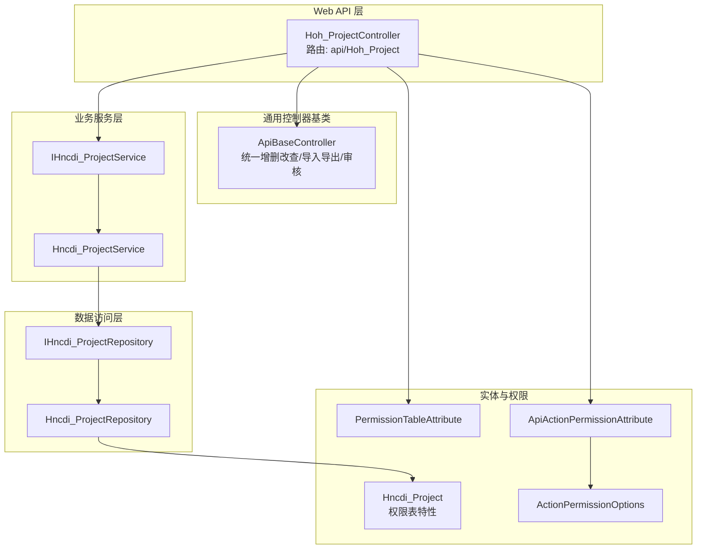
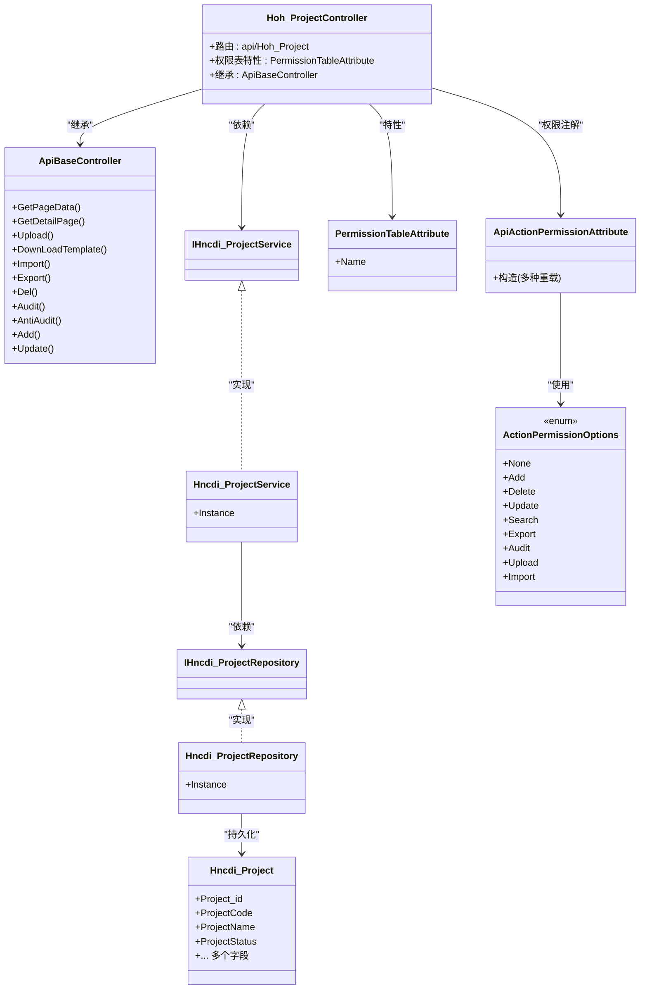
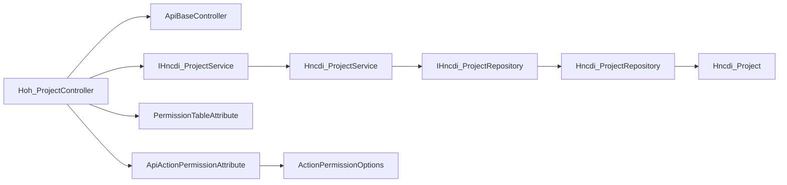

# 项目引用API

<cite>
**本文引用的文件**
- [Hoh_ProjectController.cs](file://VolPro.WebApi/Controllers/HeatOfHydration/Hoh_ProjectController.cs)
- [ApiBaseController.cs](file://VolPro.Core/Controllers/Basic/ApiBaseController.cs)
- [IHncdi_ProjectService.cs](file://Hncdi.HeatOfHydration/IServices/Project/IHncdi_ProjectService.cs)
- [Hncdi_ProjectService.cs](file://Hncdi.HeatOfHydration/Services/Project/Hncdi_ProjectService.cs)
- [IHncdi_ProjectRepository.cs](file://Hncdi.HeatOfHydration/IRepositories/Project/IHncdi_ProjectRepository.cs)
- [Hncdi_ProjectRepository.cs](file://Hncdi.HeatOfHydration/Repositories/Project/Hncdi_ProjectRepository.cs)
- [Hncdi_Project.cs](file://VolPro.Entity/DomainModels/Project/Hncdi_Project.cs)
- [ApiActionPermissionAttribute.cs](file://VolPro.Core/Filters/ApiActionPermissionAttribute.cs)
- [ActionPermissionOptions.cs](file://VolPro.Core/Enums/ActionPermissionOptions.cs)
- [PermissionTableAttribute.cs](file://VolPro.Entity/AttributeManager/PermissionTableAttribute.cs)
</cite>

## 目录
1. [简介](#简介)
2. [项目结构](#项目结构)
3. [核心组件](#核心组件)
4. [架构总览](#架构总览)
5. [详细组件分析](#详细组件分析)
6. [依赖分析](#依赖分析)
7. [性能考虑](#性能考虑)
8. [故障排查指南](#故障排查指南)
9. [结论](#结论)
10. [附录](#附录)

## 简介
本文件面向“项目引用API”的设计与使用，聚焦于项目关联、引用管理、跨项目数据共享等核心能力。基于现有代码库，项目引用API以通用的分层架构实现：Web API 控制器负责请求入口与权限校验，服务层封装业务逻辑，仓储层负责数据持久化。权限控制通过特性标注与过滤器实现，确保对不同操作（新增、删除、更新、查询、导入、导出、审核、上传）进行细粒度授权。同时，实体模型通过特性标注明确权限表名，便于统一权限治理。

## 项目结构
项目采用多层架构与模块化组织，围绕“水化热”业务域构建了独立的服务与仓储模块，并通过通用的控制器基类提供统一的API行为。核心路径如下：
- Web API 层：控制器位于 WebApi 工程，负责路由、权限注解与调用服务层。
- 业务服务层：位于 Hncdi.HeatOfHydration 服务模块，提供项目相关业务能力。
- 数据访问层：位于 Hncdi.HeatOfHydration 仓储模块，封装数据库操作。
- 实体模型层：位于 VolPro.Entity，定义项目实体及权限特性。
- 权限与过滤器：位于 VolPro.Core，提供权限枚举、特性与过滤器。

图表来源
- [Hoh_ProjectController.cs:11-19](file://VolPro.WebApi/Controllers/HeatOfHydration/Hoh_ProjectController.cs#L11-L19)
- [ApiBaseController.cs:37-205](file://VolPro.Core/Controllers/Basic/ApiBaseController.cs#L37-L205)
- [IHncdi_ProjectService.cs:9-11](file://Hncdi.HeatOfHydration/IServices/Project/IHncdi_ProjectService.cs#L9-L11)
- [Hncdi_ProjectService.cs:15-21](file://Hncdi.HeatOfHydration/Services/Project/Hncdi_ProjectService.cs#L15-L21)
- [IHncdi_ProjectRepository.cs:15-17](file://Hncdi.HeatOfHydration/IRepositories/Project/IHncdi_ProjectRepository.cs#L15-L17)
- [Hncdi_ProjectRepository.cs:13-23](file://Hncdi.HeatOfHydration/Repositories/Project/Hncdi_ProjectRepository.cs#L13-L23)
- [Hncdi_Project.cs:17-229](file://VolPro.Entity/DomainModels/Project/Hncdi_Project.cs#L17-L229)
- [PermissionTableAttribute.cs:5-12](file://VolPro.Entity/AttributeManager/PermissionTableAttribute.cs#L5-L12)
- [ApiActionPermissionAttribute.cs:6-45](file://VolPro.Core/Filters/ApiActionPermissionAttribute.cs#L6-L45)
- [ActionPermissionOptions.cs:7-22](file://VolPro.Core/Enums/ActionPermissionOptions.cs#L7-L22)

章节来源
- [Hoh_ProjectController.cs:11-19](file://VolPro.WebApi/Controllers/HeatOfHydration/Hoh_ProjectController.cs#L11-L19)
- [ApiBaseController.cs:37-205](file://VolPro.Core/Controllers/Basic/ApiBaseController.cs#L37-L205)

## 核心组件
- 项目控制器：继承通用控制器基类，声明路由与权限表特性，自动获得分页查询、明细查询、导入导出、审核反审核、新增编辑、删除等标准能力。
- 服务层：定义项目服务接口与实现，负责业务编排与调用仓储。
- 仓储层：定义项目仓储接口与实现，封装数据库上下文与具体查询/写入逻辑。
- 实体模型：项目实体包含主键、编号、名称、状态、单位、时间等字段，并标注权限表名以便统一权限治理。
- 权限控制：通过特性与枚举组合，对不同操作赋予权限位，结合过滤器实现访问控制。

章节来源
- [IHncdi_ProjectService.cs:9-11](file://Hncdi.HeatOfHydration/IServices/Project/IHncdi_ProjectService.cs#L9-L11)
- [Hncdi_ProjectService.cs:15-21](file://Hncdi.HeatOfHydration/Services/Project/Hncdi_ProjectService.cs#L15-L21)
- [IHncdi_ProjectRepository.cs:15-17](file://Hncdi.HeatOfHydration/IRepositories/Project/IHncdi_ProjectRepository.cs#L15-L17)
- [Hncdi_ProjectRepository.cs:13-23](file://Hncdi.HeatOfHydration/Repositories/Project/Hncdi_ProjectRepository.cs#L13-L23)
- [Hncdi_Project.cs:17-229](file://VolPro.Entity/DomainModels/Project/Hncdi_Project.cs#L17-L229)
- [PermissionTableAttribute.cs:5-12](file://VolPro.Entity/AttributeManager/PermissionTableAttribute.cs#L5-L12)
- [ApiActionPermissionAttribute.cs:6-45](file://VolPro.Core/Filters/ApiActionPermissionAttribute.cs#L6-L45)
- [ActionPermissionOptions.cs:7-22](file://VolPro.Core/Enums/ActionPermissionOptions.cs#L7-L22)

## 架构总览
项目引用API遵循“控制器-服务-仓储-实体”的分层架构，控制器通过基类统一暴露常用操作；服务层负责业务编排；仓储层负责数据持久化；权限通过特性与过滤器贯穿到控制器与操作层面。

图表来源
- [Hoh_ProjectController.cs:11-19](file://VolPro.WebApi/Controllers/HeatOfHydration/Hoh_ProjectController.cs#L11-L19)
- [ApiBaseController.cs:37-205](file://VolPro.Core/Controllers/Basic/ApiBaseController.cs#L37-L205)
- [IHncdi_ProjectService.cs:9-11](file://Hncdi.HeatOfHydration/IServices/Project/IHncdi_ProjectService.cs#L9-L11)
- [Hncdi_ProjectService.cs:15-21](file://Hncdi.HeatOfHydration/Services/Project/Hncdi_ProjectService.cs#L15-L21)
- [IHncdi_ProjectRepository.cs:15-17](file://Hncdi.HeatOfHydration/IRepositories/Project/IHncdi_ProjectRepository.cs#L15-L17)
- [Hncdi_ProjectRepository.cs:13-23](file://Hncdi.HeatOfHydration/Repositories/Project/Hncdi_ProjectRepository.cs#L13-L23)
- [Hncdi_Project.cs:17-229](file://VolPro.Entity/DomainModels/Project/Hncdi_Project.cs#L17-L229)
- [PermissionTableAttribute.cs:5-12](file://VolPro.Entity/AttributeManager/PermissionTableAttribute.cs#L5-L12)
- [ApiActionPermissionAttribute.cs:6-45](file://VolPro.Core/Filters/ApiActionPermissionAttribute.cs#L6-L45)
- [ActionPermissionOptions.cs:7-22](file://VolPro.Core/Enums/ActionPermissionOptions.cs#L7-L22)

## 详细组件分析

### 控制器层：Hoh_ProjectController
- 路由与权限：控制器通过路由前缀“api/Hoh_Project”对外提供接口；通过权限表特性标注“Hoh_Project”，用于统一权限治理。
- 继承关系：继承自通用控制器基类，自动具备分页查询、明细查询、导入导出、审核反审核、新增编辑、删除等标准能力。
- 扩展方式：根据框架约定，在控制器的局部类中扩展自定义方法，避免代码生成器覆盖。

章节来源
- [Hoh_ProjectController.cs:11-19](file://VolPro.WebApi/Controllers/HeatOfHydration/Hoh_ProjectController.cs#L11-L19)

### 通用控制器基类：ApiBaseController
- 统一入口：提供标准路由与方法名，如“GetPageData”、“Add”、“Update”、“Del”、“Export”、“Import”、“Audit”、“AntiAudit”等。
- 权限注解：每个方法均标注对应的操作权限枚举，结合过滤器实现访问控制。
- 动态调用：通过反射调用服务层同名方法，实现“控制器只负责路由与权限，业务逻辑在服务层”的职责分离。

章节来源
- [ApiBaseController.cs:37-205](file://VolPro.Core/Controllers/Basic/ApiBaseController.cs#L37-L205)

### 服务层：IHncdi_ProjectService 与 Hncdi_ProjectService
- 接口职责：定义项目相关业务契约，供控制器调用。
- 实现职责：提供静态实例获取方式，便于依赖注入与跨模块调用；实际业务逻辑在局部类中扩展。

章节来源
- [IHncdi_ProjectService.cs:9-11](file://Hncdi.HeatOfHydration/IServices/Project/IHncdi_ProjectService.cs#L9-L11)
- [Hncdi_ProjectService.cs:15-21](file://Hncdi.HeatOfHydration/Services/Project/Hncdi_ProjectService.cs#L15-L21)

### 仓储层：IHncdi_ProjectRepository 与 Hncdi_ProjectRepository
- 接口职责：定义项目数据访问契约，供服务层调用。
- 实现职责：基于通用仓储基类，注入数据库上下文，提供实例化访问；具体查询/写入逻辑在局部类中扩展。

章节来源
- [IHncdi_ProjectRepository.cs:15-17](file://Hncdi.HeatOfHydration/IRepositories/Project/IHncdi_ProjectRepository.cs#L15-L17)
- [Hncdi_ProjectRepository.cs:13-23](file://Hncdi.HeatOfHydration/Repositories/Project/Hncdi_ProjectRepository.cs#L13-L23)

### 实体模型：Hncdi_Project
- 表映射：实体标注表名为“Hncdi_Project”，数据库服务器上下文为“ServiceDbContext”，便于统一数据源管理。
- 字段覆盖：包含项目主键、编号、名称、状态、单位、时间等常用字段，满足项目引用与展示需求。
- 权限特性：通过权限表特性与控制器联动，实现统一权限治理。

章节来源
- [Hncdi_Project.cs:17-229](file://VolPro.Entity/DomainModels/Project/Hncdi_Project.cs#L17-L229)

### 权限控制：特性与枚举
- 权限表特性：用于标识需要权限控制的表名，需与系统菜单表的表名保持一致，便于统一授权。
- 操作权限枚举：定义新增、删除、更新、查询、导出、审核、上传、导入等操作的权限位，且各枚举值为前值的倍数，便于组合授权。
- 控制器权限注解：通过特性重载支持表名、角色ID、系统控制器等多维控制，结合过滤器实现访问校验。

章节来源
- [PermissionTableAttribute.cs:5-12](file://VolPro.Entity/AttributeManager/PermissionTableAttribute.cs#L5-L12)
- [ActionPermissionOptions.cs:7-22](file://VolPro.Core/Enums/ActionPermissionOptions.cs#L7-L22)
- [ApiActionPermissionAttribute.cs:6-45](file://VolPro.Core/Filters/ApiActionPermissionAttribute.cs#L6-L45)

## 依赖分析
- 控制器依赖服务接口，服务接口依赖仓储接口，仓储接口依赖实体模型，形成清晰的单向依赖链。
- 权限控制横切到控制器与操作方法，通过特性与过滤器实现，不破坏业务层职责。
- 通用控制器基类提供统一的API行为，降低重复代码，提升一致性。

图表来源
- [Hoh_ProjectController.cs:11-19](file://VolPro.WebApi/Controllers/HeatOfHydration/Hoh_ProjectController.cs#L11-L19)
- [ApiBaseController.cs:37-205](file://VolPro.Core/Controllers/Basic/ApiBaseController.cs#L37-L205)
- [IHncdi_ProjectService.cs:9-11](file://Hncdi.HeatOfHydration/IServices/Project/IHncdi_ProjectService.cs#L9-L11)
- [Hncdi_ProjectService.cs:15-21](file://Hncdi.HeatOfHydration/Services/Project/Hncdi_ProjectService.cs#L15-L21)
- [IHncdi_ProjectRepository.cs:15-17](file://Hncdi.HeatOfHydration/IRepositories/Project/IHncdi_ProjectRepository.cs#L15-L17)
- [Hncdi_ProjectRepository.cs:13-23](file://Hncdi.HeatOfHydration/Repositories/Project/Hncdi_ProjectRepository.cs#L13-L23)
- [Hncdi_Project.cs:17-229](file://VolPro.Entity/DomainModels/Project/Hncdi_Project.cs#L17-L229)
- [PermissionTableAttribute.cs:5-12](file://VolPro.Entity/AttributeManager/PermissionTableAttribute.cs#L5-L12)
- [ApiActionPermissionAttribute.cs:6-45](file://VolPro.Core/Filters/ApiActionPermissionAttribute.cs#L6-L45)
- [ActionPermissionOptions.cs:7-22](file://VolPro.Core/Enums/ActionPermissionOptions.cs#L7-L22)

## 性能考虑
- 统一分页查询：通过通用控制器提供的分页接口，结合服务层与仓储层的高效查询，减少一次性加载大量数据带来的内存压力。
- 反射调用开销：控制器通过反射调用服务层方法，建议在高频场景下评估反射成本，必要时引入接口缓存或直接依赖注入。
- 导入导出优化：批量导入导出建议分批处理，避免长时间占用线程；导出文件建议异步生成并提供下载链接。
- 权限过滤：权限检查应尽量前置，避免无权限请求进入复杂业务流程。

## 故障排查指南
- 权限不足：若出现403或提示无权限，请检查控制器上的权限表特性与操作权限枚举是否正确配置，确认用户角色与授权范围。
- 参数错误：若接口返回参数异常，请核对请求体字段与实体模型映射关系，确保字段长度、必填项与类型匹配。
- 数据库连接：若出现数据库访问失败，请检查实体模型中的数据库上下文配置与连接字符串。
- 日志定位：通用控制器已集成日志记录，可在相应操作后查看日志，定位问题发生点。

章节来源
- [ApiBaseController.cs:37-205](file://VolPro.Core/Controllers/Basic/ApiBaseController.cs#L37-L205)

## 结论
项目引用API以通用控制器基类为核心，结合服务层与仓储层实现清晰的职责分离；通过权限表特性与操作权限枚举，形成统一的权限治理体系。该架构既满足项目关联与引用管理的基本需求，又为跨项目数据共享与安全控制提供了可扩展的基础。建议在后续迭代中进一步完善权限矩阵、审计日志与异步处理能力，以提升系统的安全性与可维护性。

## 附录
- 最佳实践
  - 在控制器局部类中扩展自定义方法，避免代码生成器覆盖。
  - 使用权限枚举组合授权，遵循“最小权限原则”。
  - 对高频接口进行性能评估与优化，必要时引入缓存与异步处理。
  - 明确项目生命周期管理策略，包括创建、启用、停用、归档与清理流程。
- 数据一致性保证
  - 增删改查操作建议在事务中执行，确保跨表更新的一致性。
  - 导入导出流程应包含数据校验与回滚机制，防止脏数据进入生产环境。
- 安全控制机制
  - 严格区分不同角色的权限位，避免越权访问。
  - 对敏感字段进行脱敏处理，确保输出内容符合安全规范。
- 引用清理机制
  - 在项目停用或归档时，清理相关引用关系与临时数据，释放资源并保持数据整洁。