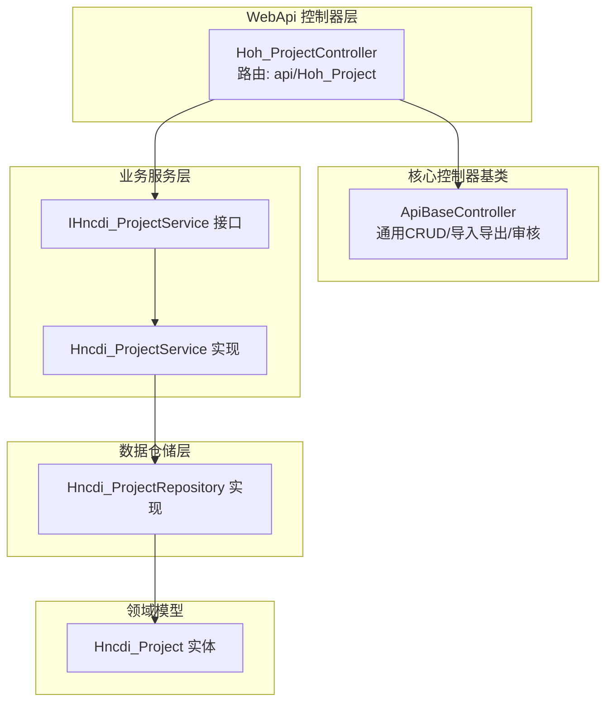
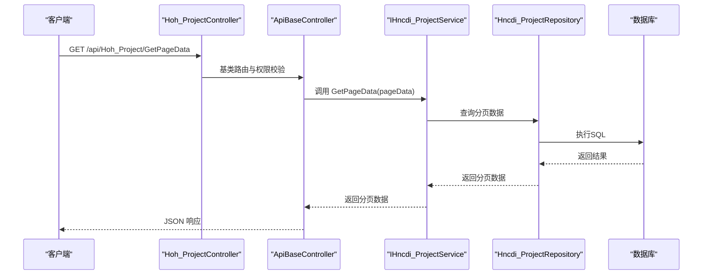
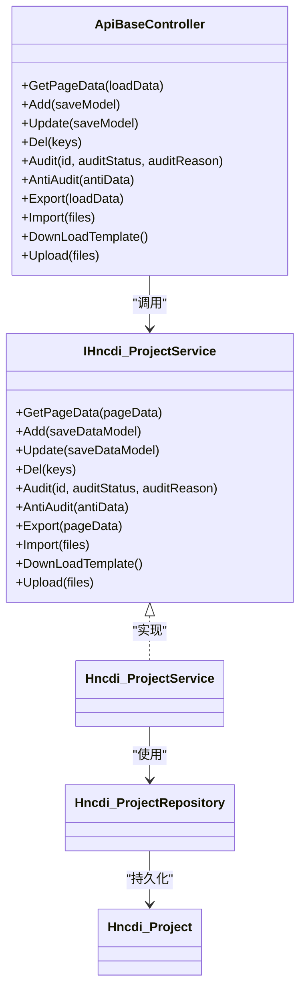

# 项目管理API

<cite>
**本文引用的文件**
- [Hoh_ProjectController.cs](file://VolPro.WebApi/Controllers/HeatOfHydration/Hoh_ProjectController.cs)
- [ApiBaseController.cs](file://VolPro.Core/Controllers/Basic/ApiBaseController.cs)
- [IHncdi_ProjectService.cs](file://Hncdi.HeatOfHydration/IServices/Project/IHncdi_ProjectService.cs)
- [Hncdi_ProjectService.cs](file://Hncdi.HeatOfHydration/Services/Project/Hncdi_ProjectService.cs)
- [Hncdi_ProjectRepository.cs](file://Hncdi.HeatOfHydration/Repositories/Project/Hncdi_ProjectRepository.cs)
- [Hncdi_Project.cs](file://VolPro.Entity/DomainModels/Project/Hncdi_Project.cs)
- [IService.cs](file://VolPro.Core/BaseProvider/IService.cs)
- [ApiActionPermissionAttribute.cs](file://VolPro.Core/Filters/ApiActionPermissionAttribute.cs)
- [WorkFlowManager.cs](file://VolPro.Core/WorkFlow/WorkFlowManager.cs)
- [BaseEntity.cs](file://VolPro.Entity/SystemModels/BaseEntity.cs)
</cite>

## 目录
1. [简介](#简介)
2. [项目结构](#项目结构)
3. [核心组件](#核心组件)
4. [架构总览](#架构总览)
5. [详细组件分析](#详细组件分析)
6. [依赖关系分析](#依赖关系分析)
7. [性能考量](#性能考量)
8. [故障排查指南](#故障排查指南)
9. [结论](#结论)
10. [附录](#附录)

## 简介
本文件面向“水化热项目管理API”，系统性梳理项目创建、查询、更新、删除等核心能力，覆盖项目基本信息管理、状态控制、成员管理（含工作流）等主题。文档基于现有控制器与服务层实现，结合通用基类控制器与权限过滤器，给出端点规范、请求/响应结构、权限与验证规则、错误处理机制以及典型使用场景。

## 项目结构
- 控制器位于 WebApi 层，采用统一的基类控制器以复用通用 CRUD 与工作流能力。
- 服务层与仓储层遵循分层职责，服务层继承通用服务基类，仓储层封装数据访问。
- 实体模型定义于 Entity 层，标注了数据库映射与必填字段等元数据。
- 权限控制通过特性过滤器实现，支持按表与操作类型进行授权。

图表来源
- [Hoh_ProjectController.cs:11-19](file://VolPro.WebApi/Controllers/HeatOfHydration/Hoh_ProjectController.cs#L11-L19)
- [ApiBaseController.cs:19-35](file://VolPro.Core/Controllers/Basic/ApiBaseController.cs#L19-L35)
- [IHncdi_ProjectService.cs:9-11](file://Hncdi.HeatOfHydration/IServices/Project/IHncdi_ProjectService.cs#L9-L11)
- [Hncdi_ProjectService.cs:15-21](file://Hncdi.HeatOfHydration/Services/Project/Hncdi_ProjectService.cs#L15-L21)
- [Hncdi_ProjectRepository.cs:13-23](file://Hncdi.HeatOfHydration/Repositories/Project/Hncdi_ProjectRepository.cs#L13-L23)
- [Hncdi_Project.cs:17-29](file://VolPro.Entity/DomainModels/Project/Hncdi_Project.cs#L17-L29)

章节来源
- [Hoh_ProjectController.cs:11-19](file://VolPro.WebApi/Controllers/HeatOfHydration/Hoh_ProjectController.cs#L11-L19)
- [ApiBaseController.cs:19-35](file://VolPro.Core/Controllers/Basic/ApiBaseController.cs#L19-L35)

## 核心组件
- 项目控制器：继承通用基类，提供项目数据的分页查询、新增、编辑、删除、导入导出、审核等通用能力。
- 项目服务：实现通用服务接口，提供分页查询、保存、删除、审核等方法。
- 项目仓储：封装数据访问，基于上下文执行数据库操作。
- 项目实体：定义项目字段、长度、必填、默认值等元数据，映射数据库表。

章节来源
- [IHncdi_ProjectService.cs:9-11](file://Hncdi.HeatOfHydration/IServices/Project/IHncdi_ProjectService.cs#L9-L11)
- [Hncdi_ProjectService.cs:15-21](file://Hncdi.HeatOfHydration/Services/Project/Hncdi_ProjectService.cs#L15-L21)
- [Hncdi_ProjectRepository.cs:13-23](file://Hncdi.HeatOfHydration/Repositories/Project/Hncdi_ProjectRepository.cs#L13-L23)
- [Hncdi_Project.cs:17-29](file://VolPro.Entity/DomainModels/Project/Hncdi_Project.cs#L17-L29)

## 架构总览
项目管理API采用“控制器-服务-仓储-实体”四层架构，控制器通过基类暴露通用端点；服务层负责业务编排与数据校验；仓储层负责持久化；实体层承载数据模型与元数据。

图表来源
- [Hoh_ProjectController.cs:11-19](file://VolPro.WebApi/Controllers/HeatOfHydration/Hoh_ProjectController.cs#L11-L19)
- [ApiBaseController.cs:37-41](file://VolPro.Core/Controllers/Basic/ApiBaseController.cs#L37-L41)
- [IHncdi_ProjectService.cs:9-11](file://Hncdi.HeatOfHydration/IServices/Project/IHncdi_ProjectService.cs#L9-L11)
- [Hncdi_ProjectRepository.cs:13-23](file://Hncdi.HeatOfHydration/Repositories/Project/Hncdi_ProjectRepository.cs#L13-L23)

## 详细组件分析

### 控制器：Hoh_ProjectController
- 路由：api/Hoh_Project
- 权限：基于特性标注的权限表名，用于统一鉴权与日志记录
- 继承：ApiBaseController，自动获得通用CRUD与工作流相关端点

章节来源
- [Hoh_ProjectController.cs:11-19](file://VolPro.WebApi/Controllers/HeatOfHydration/Hoh_ProjectController.cs#L11-L19)

### 基类控制器：ApiBaseController
- 通用端点
  - 分页查询：POST /api/Hoh_Project/GetPageData
  - 明细查询：POST /api/Hoh_Project/GetDetailPage（内部接口）
  - 上传：POST /api/Hoh_Project/Upload（内部接口）
  - 下载模板：GET /api/Hoh_Project/DownLoadTemplate（内部接口）
  - 导入：POST /api/Hoh_Project/Import（内部接口）
  - 导出：POST /api/Hoh_Project/Export（内部接口）
  - 删除：POST /api/Hoh_Project/Del（内部接口）
  - 审核：POST /api/Hoh_Project/Audit（内部接口）
  - 反审核：POST /api/Hoh_Project/antiAudit（内部接口）
  - 新增：POST /api/Hoh_Project/Add（内部接口）
  - 更新：POST /api/Hoh_Project/Update（内部接口）
- 权限控制：通过 ApiActionPermissionAttribute 指定操作类型，结合 JWT 授权
- 日志：ActionLog 特性记录操作行为

章节来源
- [ApiBaseController.cs:37-205](file://VolPro.Core/Controllers/Basic/ApiBaseController.cs#L37-L205)
- [ApiActionPermissionAttribute.cs:6-44](file://VolPro.Core/Filters/ApiActionPermissionAttribute.cs#L6-L44)

### 服务接口与实现：IHncdi_ProjectService / Hncdi_ProjectService
- 接口：继承通用 IService<T>，提供分页查询、保存、删除、审核等方法
- 实现：继承 ServiceBase，注入仓储，提供实例化入口

章节来源
- [IHncdi_ProjectService.cs:9-11](file://Hncdi.HeatOfHydration/IServices/Project/IHncdi_ProjectService.cs#L9-L11)
- [Hncdi_ProjectService.cs:15-21](file://Hncdi.HeatOfHydration/Services/Project/Hncdi_ProjectService.cs#L15-L21)
- [IService.cs:25-105](file://VolPro.Core/BaseProvider/IService.cs#L25-L105)

### 仓储实现：Hncdi_ProjectRepository
- 继承 RepositoryBase，注入上下文，提供静态实例化入口

章节来源
- [Hncdi_ProjectRepository.cs:13-23](file://Hncdi.HeatOfHydration/Repositories/Project/Hncdi_ProjectRepository.cs#L13-L23)

### 领域模型：Hncdi_Project
- 数据库映射：实体注解指定表名与服务器连接
- 主键与自增：Project_id
- 必填字段：ProjectCode、ProjectName、ProjectType、ProjectStatus、StartDate
- 关键字段含义
  - 项目编号、项目名称、工程类型、项目状态、工程地点、建设/监理/施工/设计/监控单位、开工/计划竣工日期、水化热大屏标题、备注、创建/修改人及时间、项目图片等
- 字段长度限制与类型：通过特性标注

章节来源
- [Hncdi_Project.cs:17-226](file://VolPro.Entity/DomainModels/Project/Hncdi_Project.cs#L17-L226)

### 工作流集成：工作流管理
- 支持新增/更新时写入流程、审核/反审核、重启流程等
- 通过 WorkFlowManager 的 AddProcese、Audit 等方法实现

章节来源
- [WorkFlowManager.cs:417-700](file://VolPro.Core/WorkFlow/WorkFlowManager.cs#L417-L700)

## 依赖关系分析

图表来源
- [ApiBaseController.cs:37-205](file://VolPro.Core/Controllers/Basic/ApiBaseController.cs#L37-L205)
- [IHncdi_ProjectService.cs:9-11](file://Hncdi.HeatOfHydration/IServices/Project/IHncdi_ProjectService.cs#L9-L11)
- [Hncdi_ProjectService.cs:15-21](file://Hncdi.HeatOfHydration/Services/Project/Hncdi_ProjectService.cs#L15-L21)
- [Hncdi_ProjectRepository.cs:13-23](file://Hncdi.HeatOfHydration/Repositories/Project/Hncdi_ProjectRepository.cs#L13-L23)
- [Hncdi_Project.cs:17-29](file://VolPro.Entity/DomainModels/Project/Hncdi_Project.cs#L17-L29)

## 性能考量
- 分页查询：建议合理设置分页大小与排序字段，避免全表扫描。
- 导入导出：批量操作建议异步化与分批处理，避免阻塞线程。
- 审核流程：流程节点较多时，注意数据库事务与锁竞争，必要时拆分步骤。
- 缓存策略：对频繁读取但不常变更的配置与字典数据可引入缓存。

## 故障排查指南
- 权限不足
  - 现象：返回未授权或无权限提示
  - 排查：确认 ApiActionPermissionAttribute 的操作类型与用户角色是否匹配
- 参数校验失败
  - 现象：新增/更新返回字段长度或必填校验失败
  - 排查：对照实体字段的长度与 Required 标注，确保请求体符合要求
- 审核异常
  - 现象：审核/反审核失败或流程缺失
  - 排查：确认工作流配置是否存在，数据是否已提交流程
- 文件导入/导出异常
  - 现象：模板下载失败或导入报错
  - 排查：确认模板文件存在与文件大小限制

章节来源
- [ApiActionPermissionAttribute.cs:6-44](file://VolPro.Core/Filters/ApiActionPermissionAttribute.cs#L6-L44)
- [Hncdi_Project.cs:35-48](file://VolPro.Entity/DomainModels/Project/Hncdi_Project.cs#L35-L48)
- [WorkFlowManager.cs:417-700](file://VolPro.Core/WorkFlow/WorkFlowManager.cs#L417-L700)

## 结论
本项目管理API通过统一的控制器基类与服务层抽象，提供了标准化的项目数据管理能力。结合权限过滤与工作流集成，能够支撑从创建、查询、更新到审核的完整生命周期管理。实际部署时需关注参数校验、权限配置与工作流状态一致性，确保系统稳定与合规。

## 附录

### API 端点清单与规范
- 分页查询
  - 方法：POST
  - 路径：/api/Hoh_Project/GetPageData
  - 请求体：分页与筛选参数
  - 响应：分页数据
- 新增
  - 方法：POST
  - 路径：/api/Hoh_Project/Add
  - 请求体：保存模型（主表+子表）
  - 响应：保存结果与数据
- 更新
  - 方法：POST
  - 路径：/api/Hoh_Project/Update
  - 请求体：保存模型（主表+子表）
  - 响应：更新结果与数据
- 删除
  - 方法：POST
  - 路径：/api/Hoh_Project/Del
  - 请求体：主键数组
  - 响应：删除结果
- 审核
  - 方法：POST
  - 路径：/api/Hoh_Project/Audit
  - 请求体：id 数组、审核状态、原因
  - 响应：审核结果
- 反审核
  - 方法：POST
  - 路径：/api/Hoh_Project/antiAudit
  - 请求体：反审核数据模型
  - 响应：反审核结果
- 导出
  - 方法：POST
  - 路径：/api/Hoh_Project/Export
  - 请求体：分页参数
  - 响应：文件流
- 导入
  - 方法：POST
  - 路径：/api/Hoh_Project/Import
  - 请求体：Excel 文件
  - 响应：导入结果
- 下载模板
  - 方法：GET
  - 路径：/api/Hoh_Project/DownLoadTemplate
  - 响应：模板文件
- 上传
  - 方法：POST
  - 路径：/api/Hoh_Project/Upload
  - 请求体：文件集合
  - 响应：上传结果

章节来源
- [ApiBaseController.cs:37-205](file://VolPro.Core/Controllers/Basic/ApiBaseController.cs#L37-L205)

### 请求/响应示例（路径指引）
- 分页查询请求体示例：[示例路径:38-40](file://VolPro.Core/Controllers/Basic/ApiBaseController.cs#L38-L40)
- 新增请求体示例：[示例路径:180-187](file://VolPro.Core/Controllers/Basic/ApiBaseController.cs#L180-L187)
- 更新请求体示例：[示例路径:199-204](file://VolPro.Core/Controllers/Basic/ApiBaseController.cs#L199-L204)
- 删除请求体示例：[示例路径:132-136](file://VolPro.Core/Controllers/Basic/ApiBaseController.cs#L132-L136)
- 审核请求体示例：[示例路径:147-152](file://VolPro.Core/Controllers/Basic/ApiBaseController.cs#L147-L152)
- 反审核请求体示例：[示例路径:164-169](file://VolPro.Core/Controllers/Basic/ApiBaseController.cs#L164-L169)
- 导出请求体示例：[示例路径:112-119](file://VolPro.Core/Controllers/Basic/ApiBaseController.cs#L112-L119)
- 导入请求体示例：[示例路径:98-100](file://VolPro.Core/Controllers/Basic/ApiBaseController.cs#L98-L100)
- 下载模板响应示例：[示例路径:75-88](file://VolPro.Core/Controllers/Basic/ApiBaseController.cs#L75-L88)
- 上传响应示例：[示例路径:66-68](file://VolPro.Core/Controllers/Basic/ApiBaseController.cs#L66-L68)

### 数据模型字段说明（节选）
- 项目主键ID：long，必填
- 项目编号：nvarchar(50)，必填
- 项目名称：nvarchar(50)，必填
- 工程类型：char(1)，必填
- 项目状态：char(1)，必填
- 开工日期：datetime，必填
- 计划竣工日期：datetime，可空
- 其他字段：见实体定义

章节来源
- [Hncdi_Project.cs:23-149](file://VolPro.Entity/DomainModels/Project/Hncdi_Project.cs#L23-L149)

### 权限控制与验证规则
- 权限控制：通过 ApiActionPermissionAttribute 指定操作类型与表名，结合 JWT 授权
- 验证规则：实体字段的 Required、MaxLength、类型与数据库列类型一致
- 工作流：新增/更新可触发流程写入，审核/反审核受流程状态影响

章节来源
- [ApiActionPermissionAttribute.cs:6-44](file://VolPro.Core/Filters/ApiActionPermissionAttribute.cs#L6-L44)
- [Hncdi_Project.cs:23-149](file://VolPro.Entity/DomainModels/Project/Hncdi_Project.cs#L23-L149)
- [WorkFlowManager.cs:417-700](file://VolPro.Core/WorkFlow/WorkFlowManager.cs#L417-L700)