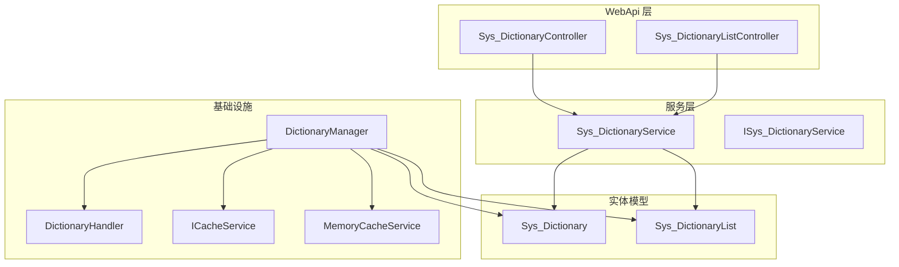
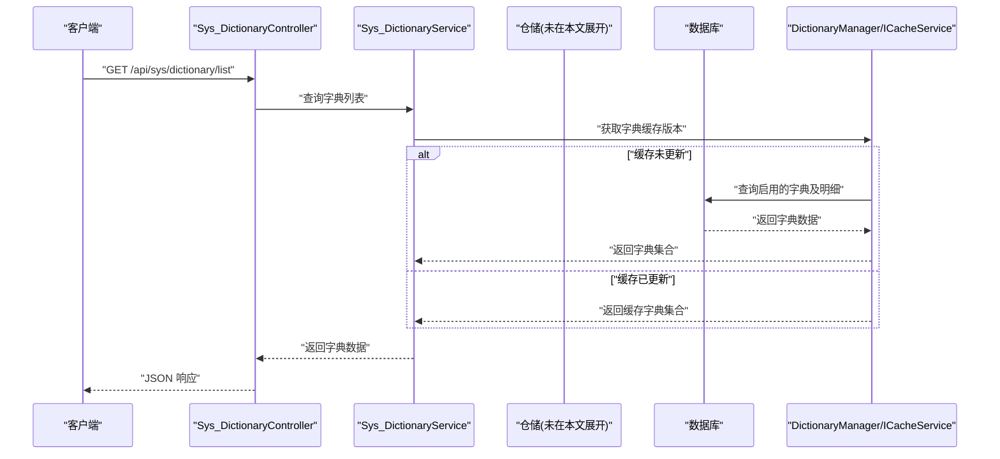
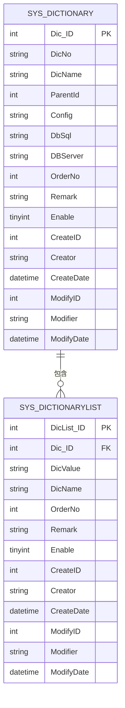
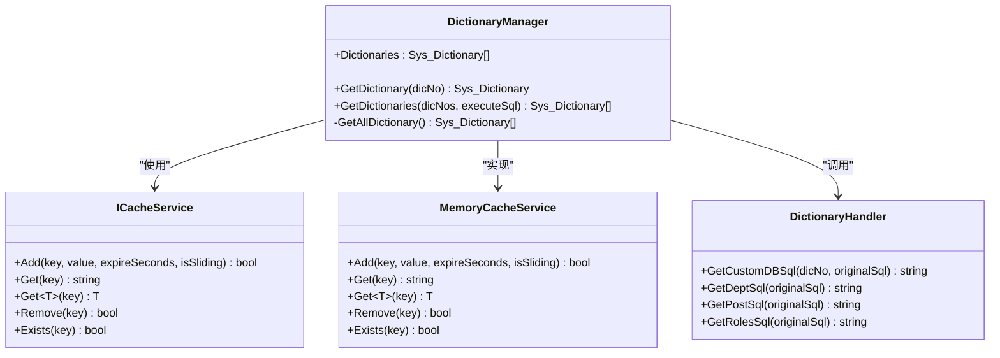
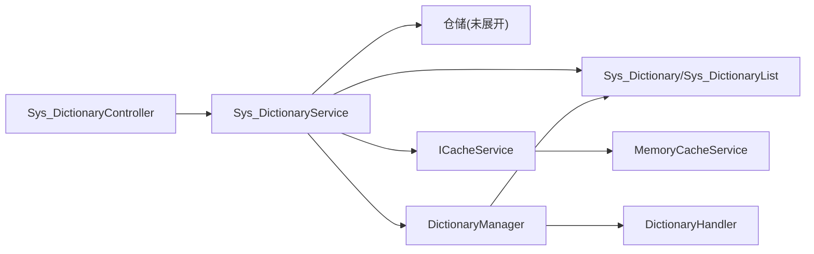

# 数据字典API

<cite>
**本文引用的文件**
- [DictionaryManager.cs](file://VolPro.Core/Infrastructure/DictionaryManager.cs)
- [DictionaryHandler.cs](file://VolPro.Core/Infrastructure/DictionaryHandler.cs)
- [Sys_Dictionary.cs](file://VolPro.Entity/DomainModels/System/Sys_Dictionary.cs)
- [Sys_DictionaryList.cs](file://VolPro.Entity/DomainModels/System/Sys_DictionaryList.cs)
- [ISys_DictionaryService.cs](file://VolPro.Sys/IServices/System/ISys_DictionaryService.cs)
- [Sys_DictionaryService.cs](file://VolPro.Sys/Services/System/Sys_DictionaryService.cs)
- [ICacheService.cs](file://VolPro.Core/CacheManager/IService/ICacheService.cs)
- [MemoryCacheService.cs](file://VolPro.Core/CacheManager/Service/MemoryCacheService.cs)
- [Sys_DictionaryController.cs](file://VolPro.WebApi/Controllers/Sys/Sys_DictionaryController.cs)
- [Sys_DictionaryListController.cs](file://VolPro.WebApi/Controllers/Sys/Sys_DictionaryListController.cs)
- [Sys_DictionaryController(Partial).cs](file://VolPro.WebApi/Controllers/Sys/Partial/Sys_DictionaryController.cs)
- [Sys_DictionaryListController(Partial).cs](file://VolPro.WebApi/Controllers/Sys/Partial/Sys_DictionaryListController.cs)
</cite>

## 目录
1. [简介](#简介)
2. [项目结构](#项目结构)
3. [核心组件](#核心组件)
4. [架构总览](#架构总览)
5. [详细组件分析](#详细组件分析)
6. [依赖关系分析](#依赖关系分析)
7. [性能考虑](#性能考虑)
8. [故障排查指南](#故障排查指南)
9. [结论](#结论)
10. [附录](#附录)

## 简介
本文件面向“数据字典管理模块”的API接口文档，聚焦以下能力：
- 字典项的增删改查与字典分类管理
- 字典值维护与排序控制
- 字典状态控制（启用/禁用）
- 多语言支持与字典缓存更新机制
- 字典层级验证规则与业务约束
- 缓存机制与性能优化策略
- 设计模式与维护最佳实践

该模块基于系统字典主表与字典明细表的分层设计，结合缓存版本控制与动态SQL注入，实现高性能、可扩展的字典服务。

## 项目结构
围绕数据字典的核心文件分布如下：
- 实体模型：Sys_Dictionary（字典主表）、Sys_DictionaryList（字典明细）
- 服务层：ISys_DictionaryService、Sys_DictionaryService
- 控制器：Sys_DictionaryController、Sys_DictionaryListController（含Partial扩展）
- 缓存与字典管理：ICacheService、MemoryCacheService、DictionaryManager、DictionaryHandler
- 多语言与视图组件：LanguageContainer、DictionaryViewComponent（预留）

图表来源
- [Sys_DictionaryController.cs](file://VolPro.WebApi/Controllers/Sys/Sys_DictionaryController.cs)
- [Sys_DictionaryListController.cs](file://VolPro.WebApi/Controllers/Sys/Sys_DictionaryListController.cs)
- [Sys_DictionaryService.cs](file://VolPro.Sys/Services/System/Sys_DictionaryService.cs)
- [ISys_DictionaryService.cs](file://VolPro.Sys/IServices/System/ISys_DictionaryService.cs)
- [Sys_Dictionary.cs](file://VolPro.Entity/DomainModels/System/Sys_Dictionary.cs)
- [Sys_DictionaryList.cs](file://VolPro.Entity/DomainModels/System/Sys_DictionaryList.cs)
- [DictionaryManager.cs](file://VolPro.Core/Infrastructure/DictionaryManager.cs)
- [DictionaryHandler.cs](file://VolPro.Core/Infrastructure/DictionaryHandler.cs)
- [ICacheService.cs](file://VolPro.Core/CacheManager/IService/ICacheService.cs)
- [MemoryCacheService.cs](file://VolPro.Core/CacheManager/Service/MemoryCacheService.cs)

章节来源
- [Sys_DictionaryController.cs](file://VolPro.WebApi/Controllers/Sys/Sys_DictionaryController.cs)
- [Sys_DictionaryListController.cs](file://VolPro.WebApi/Controllers/Sys/Sys_DictionaryListController.cs)
- [Sys_DictionaryService.cs](file://VolPro.Sys/Services/System/Sys_DictionaryService.cs)
- [ISys_DictionaryService.cs](file://VolPro.Sys/IServices/System/ISys_DictionaryService.cs)
- [Sys_Dictionary.cs](file://VolPro.Entity/DomainModels/System/Sys_Dictionary.cs)
- [Sys_DictionaryList.cs](file://VolPro.Entity/DomainModels/System/Sys_DictionaryList.cs)
- [DictionaryManager.cs](file://VolPro.Core/Infrastructure/DictionaryManager.cs)
- [DictionaryHandler.cs](file://VolPro.Core/Infrastructure/DictionaryHandler.cs)
- [ICacheService.cs](file://VolPro.Core/CacheManager/IService/ICacheService.cs)
- [MemoryCacheService.cs](file://VolPro.Core/CacheManager/Service/MemoryCacheService.cs)

## 核心组件
- 字典实体模型
  - Sys_Dictionary：字典主表，包含字典编号、名称、父级ID、配置、SQL、所在数据库、排序号、备注、启用状态等字段，并关联字典明细列表。
  - Sys_DictionaryList：字典明细表，包含明细ID、字典ID、值、文本、排序号、备注、启用状态等字段。
- 服务接口与实现
  - ISys_DictionaryService：继承通用服务接口，提供字典主表的CRUD能力。
  - Sys_DictionaryService：基于仓储的通用服务实现，通过Autofac容器解析依赖。
- 缓存与字典管理
  - ICacheService：统一缓存接口，支持键值存取、批量删除、滑动/绝对过期等。
  - MemoryCacheService：内存缓存实现，提供Add/Get/Remove等方法。
  - DictionaryManager：字典全局缓存与版本控制，按需从数据库加载并缓存；支持动态SQL注入与用户上下文过滤。
  - DictionaryHandler：根据字典编号与用户上下文动态替换SQL，支持多数据库方言（MySQL、MsSql、PgSql、Oracle）。

章节来源
- [Sys_Dictionary.cs](file://VolPro.Entity/DomainModels/System/Sys_Dictionary.cs)
- [Sys_DictionaryList.cs](file://VolPro.Entity/DomainModels/System/Sys_DictionaryList.cs)
- [ISys_DictionaryService.cs](file://VolPro.Sys/IServices/System/ISys_DictionaryService.cs)
- [Sys_DictionaryService.cs](file://VolPro.Sys/Services/System/Sys_DictionaryService.cs)
- [ICacheService.cs](file://VolPro.Core/CacheManager/IService/ICacheService.cs)
- [MemoryCacheService.cs](file://VolPro.Core/CacheManager/Service/MemoryCacheService.cs)
- [DictionaryManager.cs](file://VolPro.Core/Infrastructure/DictionaryManager.cs)
- [DictionaryHandler.cs](file://VolPro.Core/Infrastructure/DictionaryHandler.cs)

## 架构总览
数据字典API采用“控制器-服务-仓储-实体-缓存/字典处理器”的分层架构。控制器负责接收请求与返回响应，服务层封装业务逻辑，仓储访问数据库，实体模型映射表结构，缓存与字典处理器负责全局字典缓存与动态SQL注入。

图表来源
- [Sys_DictionaryController.cs](file://VolPro.WebApi/Controllers/Sys/Sys_DictionaryController.cs)
- [Sys_DictionaryService.cs](file://VolPro.Sys/Services/System/Sys_DictionaryService.cs)
- [DictionaryManager.cs](file://VolPro.Core/Infrastructure/DictionaryManager.cs)
- [ICacheService.cs](file://VolPro.Core/CacheManager/IService/ICacheService.cs)

## 详细组件分析

### 字典实体模型
- Sys_Dictionary
  - 关键字段：Dic_ID、DicNo、DicName、ParentId、Config、DbSql、DBServer、OrderNo、Remark、Enable、Creator/Modifier/CreateDate/ModifyDate 等。
  - 关系：一对多关联 Sys_DictionaryList。
- Sys_DictionaryList
  - 关键字段：DicList_ID、Dic_ID、DicValue、DicName、OrderNo、Remark、Enable、Creator/Modifier/CreateDate/ModifyDate 等。
  - 关系：外键指向 Sys_Dictionary。

图表来源
- [Sys_Dictionary.cs](file://VolPro.Entity/DomainModels/System/Sys_Dictionary.cs)
- [Sys_DictionaryList.cs](file://VolPro.Entity/DomainModels/System/Sys_DictionaryList.cs)

章节来源
- [Sys_Dictionary.cs](file://VolPro.Entity/DomainModels/System/Sys_Dictionary.cs)
- [Sys_DictionaryList.cs](file://VolPro.Entity/DomainModels/System/Sys_DictionaryList.cs)

### 字典管理与缓存
- DictionaryManager
  - 负责全局字典缓存与版本控制，使用缓存键存储版本号，若版本未变化则直接返回缓存。
  - 支持按字典编号集合筛选并可选择是否执行自定义SQL。
  - 通过DictionaryHandler对特定字典编号注入用户上下文相关的SQL（如部门、岗位、角色）。
- DictionaryHandler
  - 提供多种预置字典编号的SQL替换逻辑，支持多数据库方言。
  - 根据用户上下文（超级管理员、部门ID集合、角色ID集合）动态过滤数据源。
- 缓存接口与实现
  - ICacheService：统一缓存抽象，支持Add/Get/Remove/Exists等。
  - MemoryCacheService：基于内存缓存的具体实现，支持滑动过期与绝对过期。

图表来源
- [DictionaryManager.cs](file://VolPro.Core/Infrastructure/DictionaryManager.cs)
- [DictionaryHandler.cs](file://VolPro.Core/Infrastructure/DictionaryHandler.cs)
- [ICacheService.cs](file://VolPro.Core/CacheManager/IService/ICacheService.cs)
- [MemoryCacheService.cs](file://VolPro.Core/CacheManager/Service/MemoryCacheService.cs)

章节来源
- [DictionaryManager.cs](file://VolPro.Core/Infrastructure/DictionaryManager.cs)
- [DictionaryHandler.cs](file://VolPro.Core/Infrastructure/DictionaryHandler.cs)
- [ICacheService.cs](file://VolPro.Core/CacheManager/IService/ICacheService.cs)
- [MemoryCacheService.cs](file://VolPro.Core/CacheManager/Service/MemoryCacheService.cs)

### API 接口定义与行为规范
以下为数据字典管理模块的API端点清单与规范。为避免泄露具体代码，本节仅描述端点、请求/响应结构、参数与约束，不展示代码片段。

- 字典项管理
  - GET /api/sys/dictionary/list
    - 功能：获取启用的字典列表（带明细），支持按字典编号集合筛选。
    - 请求参数：dicNos（可选，逗号分隔字符串）
    - 响应：字典集合（包含明细列表）
    - 业务约束：
      - 仅返回Enable=1的字典
      - 若传入dicNos，仅返回对应编号的字典
      - 可选执行自定义SQL（由DictionaryHandler处理）
  - GET /api/sys/dictionary/{id}
    - 功能：按ID获取单个字典详情（含明细）
    - 响应：字典对象
  - POST /api/sys/dictionary
    - 功能：新增字典项
    - 请求体：字典主表字段（含DicNo、DicName、ParentId、Config、DbSql、DBServer、OrderNo、Enable等）
    - 响应：新增字典对象
    - 业务约束：
      - DicNo唯一性校验（建议在服务层或仓储层实现）
      - ParentId需指向存在的父级字典或为根节点
      - Enable默认启用
  - PUT /api/sys/dictionary
    - 功能：更新字典项
    - 请求体：同新增，按Dic_ID更新
    - 响应：更新后的字典对象
    - 业务约束：
      - 更新后触发缓存版本更新（见“缓存更新”）
  - DELETE /api/sys/dictionary/{id}
    - 功能：删除字典项（建议软删除或检查明细依赖）
    - 响应：删除结果
    - 业务约束：
      - 删除前需检查是否存在明细或子级字典
- 字典值管理
  - GET /api/sys/dictionary/list/{dicId}
    - 功能：获取指定字典的所有明细
    - 响应：明细列表（按OrderNo排序）
  - POST /api/sys/dictionary/list
    - 功能：新增字典明细
    - 请求体：明细字段（Dic_ID、DicValue、DicName、OrderNo、Enable等）
    - 响应：新增明细对象
  - PUT /api/sys/dictionary/list
    - 功能：更新字典明细
    - 请求体：明细字段（按DicList_ID更新）
    - 响应：更新后的明细对象
  - DELETE /api/sys/dictionary/list/{id}
    - 功能：删除字典明细
    - 响应：删除结果
- 字典状态控制
  - PUT /api/sys/dictionary/status
    - 功能：批量切换字典启用/禁用
    - 请求体：ids（字典ID数组）、enable（0/1）
    - 响应：更新结果
- 字典排序
  - PUT /api/sys/dictionary/order
    - 功能：调整字典或明细的排序号
    - 请求体：ids与对应OrderNo
    - 响应：更新结果

请求/响应示例（示意）
- 新增字典项
  - 请求：POST /api/sys/dictionary
  - 请求体：{ "DicNo": "dept_level", "DicName": "部门级别", "ParentId": 0, "Enable": 1, "OrderNo": 1 }
  - 响应：{ "Dic_ID": 101, "DicNo": "dept_level", "DicName": "部门级别", "ParentId": 0, "Enable": 1, "OrderNo": 1 }
- 获取字典列表
  - 请求：GET /api/sys/dictionary/list?dicNos=dept_level,post_type
  - 响应：[{ "Dic_ID": 101, "DicNo": "dept_level", "DicName": "部门级别", "Sys_DictionaryList": [...] }, ...]
- 更新字典状态
  - 请求：PUT /api/sys/dictionary/status
  - 请求体：{ "ids": [101, 102], "enable": 0 }
  - 响应：{ "success": true }

章节来源
- [Sys_DictionaryController.cs](file://VolPro.WebApi/Controllers/Sys/Sys_DictionaryController.cs)
- [Sys_DictionaryListController.cs](file://VolPro.WebApi/Controllers/Sys/Sys_DictionaryListController.cs)
- [Sys_DictionaryController(Partial).cs](file://VolPro.WebApi/Controllers/Sys/Partial/Sys_DictionaryController.cs)
- [Sys_DictionaryListController(Partial).cs](file://VolPro.WebApi/Controllers/Sys/Partial/Sys_DictionaryListController.cs)

### 字典层级验证规则与业务约束
- 字典编号唯一性：新增/更新时需保证DicNo唯一。
- 父子关系合法性：ParentId必须指向存在的字典或为根节点（ParentId=0）。
- 启用状态一致性：Enable=1表示启用，0表示禁用；禁用后不再参与查询。
- 明细完整性：明细需包含DicValue与DicName，且按OrderNo排序。
- 动态SQL注入：针对特定字典编号（如部门、岗位、角色），DictionaryHandler会注入用户上下文过滤条件，确保数据安全与权限隔离。

章节来源
- [Sys_Dictionary.cs](file://VolPro.Entity/DomainModels/System/Sys_Dictionary.cs)
- [Sys_DictionaryList.cs](file://VolPro.Entity/DomainModels/System/Sys_DictionaryList.cs)
- [DictionaryHandler.cs](file://VolPro.Core/Infrastructure/DictionaryHandler.cs)

### 多语言支持与字典缓存更新
- 多语言支持：通过语言中间件与语言容器实现，字典文本（DicName）可配合多语言资源使用。
- 缓存更新：当字典配置发生变更（新增/更新/删除），DictionaryManager会更新内部版本号并刷新缓存；后续请求将从数据库重新加载字典数据，确保一致性。

章节来源
- [DictionaryManager.cs](file://VolPro.Core/Infrastructure/DictionaryManager.cs)
- [ICacheService.cs](file://VolPro.Core/CacheManager/IService/ICacheService.cs)
- [MemoryCacheService.cs](file://VolPro.Core/CacheManager/Service/MemoryCacheService.cs)

### 设计模式与维护最佳实践
- 仓储与服务分离：服务层不直接操作数据库，通过仓储解耦。
- 缓存版本控制：使用版本号键避免缓存穿透与陈旧数据。
- 动态SQL注入：通过DictionaryHandler集中处理用户上下文与数据库方言差异。
- 最佳实践：
  - 新增字典时同步维护明细，确保DicValue/DicName完整。
  - 启用/禁用操作需谨慎，避免影响现有业务。
  - 定期清理无效字典与明细，保持数据整洁。
  - 对高频查询字典建立索引（如DicNo），提升查询效率。

## 依赖关系分析
- 控制器依赖服务接口，服务实现依赖仓储与通用基类。
- 服务层依赖实体模型与缓存接口。
- 字典管理器依赖缓存服务、字典处理器与数据库上下文。
- 字典处理器依赖用户上下文与数据库类型配置。

图表来源
- [Sys_DictionaryController.cs](file://VolPro.WebApi/Controllers/Sys/Sys_DictionaryController.cs)
- [Sys_DictionaryService.cs](file://VolPro.Sys/Services/System/Sys_DictionaryService.cs)
- [Sys_Dictionary.cs](file://VolPro.Entity/DomainModels/System/Sys_Dictionary.cs)
- [Sys_DictionaryList.cs](file://VolPro.Entity/DomainModels/System/Sys_DictionaryList.cs)
- [DictionaryManager.cs](file://VolPro.Core/Infrastructure/DictionaryManager.cs)
- [DictionaryHandler.cs](file://VolPro.Core/Infrastructure/DictionaryHandler.cs)
- [ICacheService.cs](file://VolPro.Core/CacheManager/IService/ICacheService.cs)
- [MemoryCacheService.cs](file://VolPro.Core/CacheManager/Service/MemoryCacheService.cs)

章节来源
- [Sys_DictionaryController.cs](file://VolPro.WebApi/Controllers/Sys/Sys_DictionaryController.cs)
- [Sys_DictionaryService.cs](file://VolPro.Sys/Services/System/Sys_DictionaryService.cs)
- [Sys_Dictionary.cs](file://VolPro.Entity/DomainModels/System/Sys_Dictionary.cs)
- [Sys_DictionaryList.cs](file://VolPro.Entity/DomainModels/System/Sys_DictionaryList.cs)
- [DictionaryManager.cs](file://VolPro.Core/Infrastructure/DictionaryManager.cs)
- [DictionaryHandler.cs](file://VolPro.Core/Infrastructure/DictionaryHandler.cs)
- [ICacheService.cs](file://VolPro.Core/CacheManager/IService/ICacheService.cs)
- [MemoryCacheService.cs](file://VolPro.Core/CacheManager/Service/MemoryCacheService.cs)

## 性能考虑
- 缓存策略
  - 使用DictionaryManager的版本号键控制缓存失效，避免全量刷新。
  - MemoryCacheService支持滑动过期与绝对过期，减少热点数据失效带来的抖动。
- 查询优化
  - 仅返回Enable=1的字典，缩小数据集。
  - 明细按OrderNo排序，避免前端二次排序。
- 动态SQL优化
  - DictionaryHandler针对特定字典编号注入用户上下文过滤，减少不必要的数据传输。
- 并发控制
  - DictionaryManager在加载缓存时使用锁，避免并发重复加载。

章节来源
- [DictionaryManager.cs](file://VolPro.Core/Infrastructure/DictionaryManager.cs)
- [MemoryCacheService.cs](file://VolPro.Core/CacheManager/Service/MemoryCacheService.cs)
- [DictionaryHandler.cs](file://VolPro.Core/Infrastructure/DictionaryHandler.cs)

## 故障排查指南
- 现象：字典数据未更新
  - 排查：确认缓存版本键是否更新；检查DictionaryManager的版本号逻辑。
  - 处理：触发缓存版本更新后重试。
- 现象：动态SQL返回空或权限不足
  - 排查：确认DictionaryHandler中对应字典编号的SQL替换逻辑；核对用户上下文（部门/角色）。
  - 处理：修正SQL模板或用户上下文配置。
- 现象：排序异常
  - 排查：确认明细表OrderNo是否正确设置；查询接口是否按OrderNo排序。
  - 处理：修复OrderNo并重新保存。
- 现象：启用状态无效
  - 排查：确认Enable字段值；查询接口是否仅返回Enable=1的字典。
  - 处理：更新Enable并刷新缓存。

章节来源
- [DictionaryManager.cs](file://VolPro.Core/Infrastructure/DictionaryManager.cs)
- [DictionaryHandler.cs](file://VolPro.Core/Infrastructure/DictionaryHandler.cs)
- [Sys_Dictionary.cs](file://VolPro.Entity/DomainModels/System/Sys_Dictionary.cs)
- [Sys_DictionaryList.cs](file://VolPro.Entity/DomainModels/System/Sys_DictionaryList.cs)

## 结论
数据字典管理模块通过清晰的分层设计、完善的缓存与动态SQL注入机制，实现了高效、安全、可扩展的字典服务能力。遵循本文档的API规范与最佳实践，可在保证数据一致性的前提下，显著提升系统性能与维护效率。

## 附录
- 视图组件（预留）：DictionaryViewComponent用于前端下拉组件渲染，支持根据字典编号动态生成选项数据源。
- 多语言：结合语言中间件与字典文本，实现国际化展示。

章节来源
- [DictionaryViewComponent.cs](file://VolPro.Core/BaseProvider/DictionaryComponent/DictionaryViewComponent.cs)