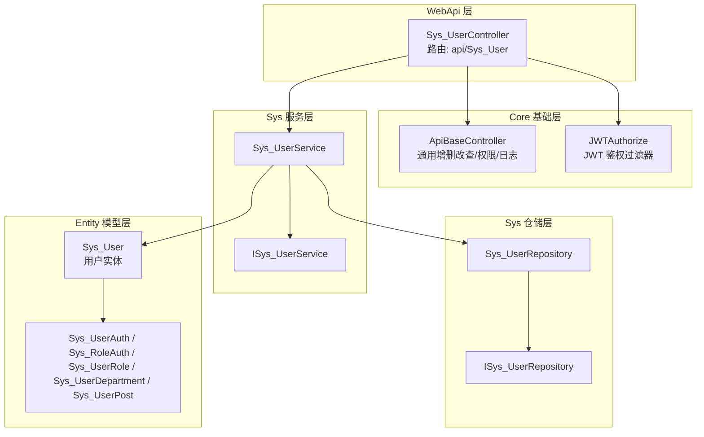
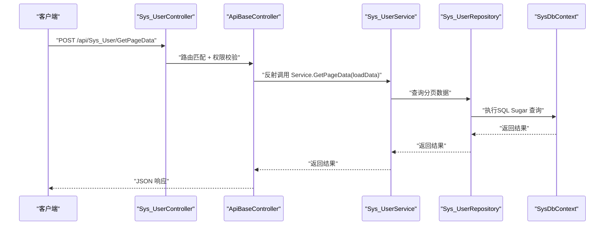
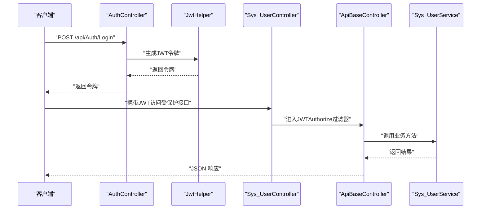
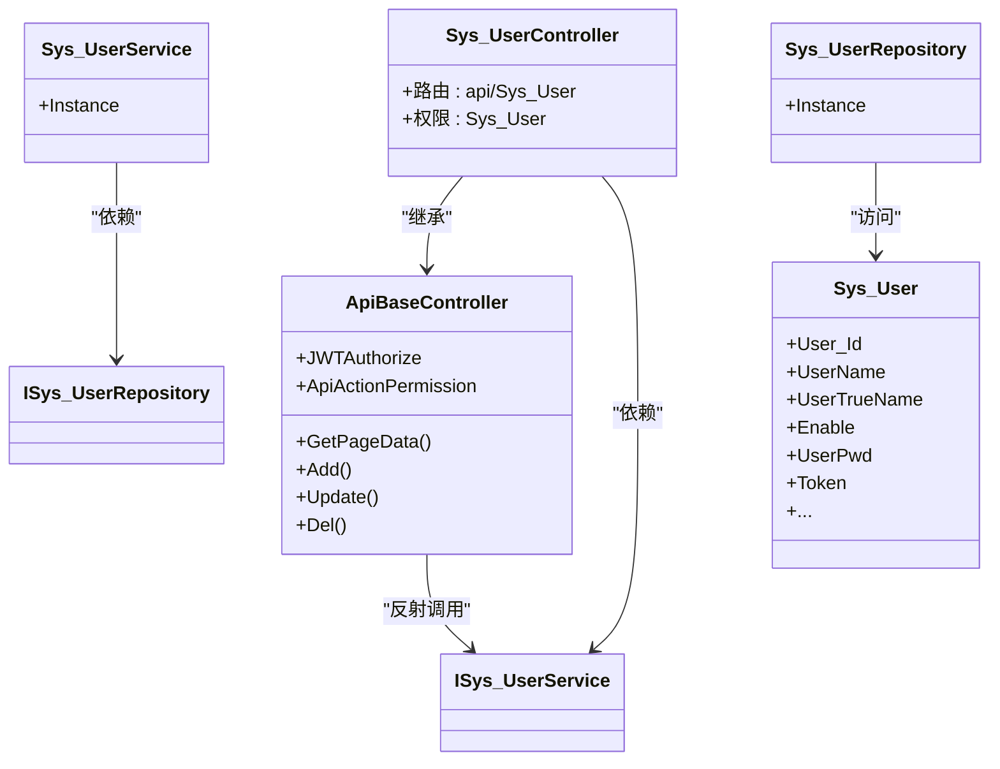

# 用户管理API

<cite>
**本文引用的文件**
- [Sys_UserController.cs](file://VolPro.WebApi/Controllers/Sys/Sys_UserController.cs)
- [ApiBaseController.cs](file://VolPro.Core/Controllers/Basic/ApiBaseController.cs)
- [Sys_User.cs](file://VolPro.Entity/DomainModels/System/Sys_User.cs)
- [ISys_UserService.cs](file://VolPro.Sys/IServices/System/ISys_UserService.cs)
- [Sys_UserService.cs](file://VolPro.Sys/Services/System/Sys_UserService.cs)
- [ISys_UserRepository.cs](file://VolPro.Sys/IRepositories/System/ISys_UserRepository.cs)
- [Sys_UserRepository.cs](file://VolPro.Sys/Repositories/System/Sys_UserRepository.cs)
- [AuthController.cs](file://VolPro.WebApi/Controllers/Auth/AuthController.cs)
- [LoginInfo.cs](file://VolPro.Entity/DomainModels/System/LoginInfo.cs)
- [JwtHelper.cs](file://VolPro.Core/Utilities/JwtHelper.cs)
- [JWTAuthorize.cs](file://VolPro.Core/Filters/JWTAuthorize.cs)
- [ApiAuthorizeFilter.cs](file://VolPro.Core/Filters/ApiAuthorizeFilter.cs)
- [Sys_UserAuth.cs](file://VolPro.Entity/DomainModels/System/Sys_UserAuth.cs)
- [Sys_RoleAuth.cs](file://VolPro.Entity/DomainModels/System/Sys_RoleAuth.cs)
- [Sys_UserRole.cs](file://VolPro.Entity/DomainModels/System/Sys_UserRole.cs)
- [Sys_UserDepartment.cs](file://VolPro.Entity/DomainModels/System/Sys_UserDepartment.cs)
- [Sys_UserPost.cs](file://VolPro.Entity/DomainModels/System/Sys_UserPost.cs)
- [Sys_Department.cs](file://VolPro.Entity/DomainModels/System/Sys_Department.cs)
- [Sys_Post.cs](file://VolPro.Entity/DomainModels/System/Sys_Post.cs)
- [Sys_Role.cs](file://VolPro.Entity/DomainModels/System/Sys_Role.cs)
- [Sys_Menu.cs](file://VolPro.Entity/DomainModels/System/Sys_Menu.cs)
- [Sys_MenuRole.cs](file://VolPro.Entity/DomainModels/System/Sys_MenuRole.cs)
- [Sys_UserAuth.cs（partial）](file://VolPro.Entity/DomainModels/System/partial/Sys_UserAuth.cs)
- [Sys_UserRole.cs（partial）](file://VolPro.Entity/DomainModels/System/partial/Sys_UserRole.cs)
- [Sys_UserDepartment.cs（partial）](file://VolPro.Entity/DomainModels/System/partial/Sys_UserDepartment.cs)
- [Sys_UserPost.cs（partial）](file://VolPro.Entity/DomainModels/System/partial/Sys_UserPost.cs)
</cite>

## 目录
1. [简介](#简介)
2. [项目结构](#项目结构)
3. [核心组件](#核心组件)
4. [架构总览](#架构总览)
5. [详细组件分析](#详细组件分析)
6. [依赖关系分析](#依赖关系分析)
7. [性能考虑](#性能考虑)
8. [故障排查指南](#故障排查指南)
9. [结论](#结论)
10. [附录](#附录)

## 简介
本文件面向“用户管理API”的使用与维护，聚焦于用户账户的增删改查、状态管理、密码相关流程以及用户详情查询等能力。基于现有代码库，系统采用分层架构：Web API 控制器负责路由与权限拦截，Service 层封装业务逻辑，Repository 层访问数据，Entity 层定义模型与元数据。同时，系统内置统一的鉴权中间件与权限过滤器，确保接口访问安全可控。

## 项目结构
用户管理API位于系统分层中的“WebApi -> Sys -> 用户”路径下，核心入口为控制器，继承自通用基础控制器，统一承载分页查询、新增、编辑、删除、导入导出等通用能力，并通过权限注解与JWT授权进行访问控制。

图表来源
- [Sys_UserController.cs:13-22](file://VolPro.WebApi/Controllers/Sys/Sys_UserController.cs#L13-L22)
- [ApiBaseController.cs:19-230](file://VolPro.Core/Controllers/Basic/ApiBaseController.cs#L19-L230)
- [JWTAuthorize.cs](file://VolPro.Core/Filters/JWTAuthorize.cs)
- [Sys_UserService.cs:15-29](file://VolPro.Sys/Services/System/Sys_UserService.cs#L15-L29)
- [Sys_UserRepository.cs:15-29](file://VolPro.Sys/Repositories/System/Sys_UserRepository.cs#L15-L29)
- [Sys_User.cs:18-230](file://VolPro.Entity/DomainModels/System/Sys_User.cs#L18-L230)

章节来源
- [Sys_UserController.cs:13-22](file://VolPro.WebApi/Controllers/Sys/Sys_UserController.cs#L13-L22)
- [ApiBaseController.cs:35-205](file://VolPro.Core/Controllers/Basic/ApiBaseController.cs#L35-L205)

## 核心组件
- 控制器层
  - Sys_UserController：继承 ApiBaseController，标注权限表名为 Sys_User，统一暴露分页查询、新增、编辑、删除等通用接口。
- 基础控制器
  - ApiBaseController：提供通用路由与权限注解，如“查询(GetPageData)”、“新增(Add)”、“编辑(Update)”、“删除(Del)”等；通过反射调用 Service 方法，实现统一的响应包装与日志记录。
- 服务层
  - ISys_UserService：用户服务接口，继承通用 IService。
  - Sys_UserService：具体实现，注入 ISys_UserRepository，提供实例化入口。
- 仓储层
  - ISys_UserRepository：用户仓储接口，继承通用 IRepository。
  - Sys_UserRepository：具体实现，注入 SysDbContext，提供实例化入口。
- 实体层
  - Sys_User：用户实体，包含用户标识、账号、姓名、性别、头像、角色/岗位/部门、邮箱、手机号、启用状态、创建/修改信息、Token、密码、登录时间、密码修改时间、备注、排序等字段；字段带有长度、必填、序列化控制等特性。

章节来源
- [Sys_UserController.cs:13-22](file://VolPro.WebApi/Controllers/Sys/Sys_UserController.cs#L13-L22)
- [ApiBaseController.cs:35-205](file://VolPro.Core/Controllers/Basic/ApiBaseController.cs#L35-L205)
- [ISys_UserService.cs:12-15](file://VolPro.Sys/IServices/System/ISys_UserService.cs#L12-L15)
- [Sys_UserService.cs:15-29](file://VolPro.Sys/Services/System/Sys_UserService.cs#L15-L29)
- [ISys_UserRepository.cs:17-19](file://VolPro.Sys/IRepositories/System/ISys_UserRepository.cs#L17-L19)
- [Sys_UserRepository.cs:15-29](file://VolPro.Sys/Repositories/System/Sys_UserRepository.cs#L15-L29)
- [Sys_User.cs:18-230](file://VolPro.Entity/DomainModels/System/Sys_User.cs#L18-L230)

## 架构总览
用户管理API遵循“控制器-服务-仓储-实体”的分层设计，配合统一的JWT鉴权与权限过滤器，形成从请求到持久化的完整链路。

图表来源
- [Sys_UserController.cs:13-22](file://VolPro.WebApi/Controllers/Sys/Sys_UserController.cs#L13-L22)
- [ApiBaseController.cs:35-41](file://VolPro.Core/Controllers/Basic/ApiBaseController.cs#L35-L41)
- [Sys_UserService.cs:15-29](file://VolPro.Sys/Services/System/Sys_UserService.cs#L15-L29)
- [Sys_UserRepository.cs:15-29](file://VolPro.Sys/Repositories/System/Sys_UserRepository.cs#L15-L29)

## 详细组件分析

### 控制器：Sys_UserController
- 路由与权限
  - 路由前缀：api/Sys_User
  - 权限表：Sys_User（用于菜单/按钮级权限控制）
- 继承关系
  - 继承 ApiBaseController，复用通用增删改查与权限注解
- 典型接口
  - GetPageData：分页查询
  - Add：新增（支持主子表）
  - Update：编辑（支持主子表）
  - Del：删除
- 扩展点
  - 可在控制器中添加自定义方法，利用基类的权限与日志能力

章节来源
- [Sys_UserController.cs:13-22](file://VolPro.WebApi/Controllers/Sys/Sys_UserController.cs#L13-L22)
- [ApiBaseController.cs:35-205](file://VolPro.Core/Controllers/Basic/ApiBaseController.cs#L35-L205)

### 基础控制器：ApiBaseController
- 统一行为
  - JWTAuthorize：全局JWT鉴权
  - ApiActionPermission：基于 ActionPermissionOptions 的权限控制
  - 日志记录：ActionLog 注解
- 通用接口
  - GetPageData：分页查询
  - GetDetailPage：明细查询（内部接口）
  - Upload/DownLoadTemplate/Import/Export：文件相关（内部接口）
  - Del：删除
  - Audit/AntiAudit：审核相关（内部接口）
  - Add/Update：新增与编辑（支持 SaveModel）
- 实现要点
  - 通过反射调用 Service 的同名方法，实现解耦与扩展

章节来源
- [ApiBaseController.cs:19-230](file://VolPro.Core/Controllers/Basic/ApiBaseController.cs#L19-L230)

### 服务层：Sys_UserService
- 角色定位
  - 实现 ISys_UserService 接口，继承 ServiceBase<Sys_User, ISys_UserRepository>
- 初始化
  - 提供静态 Instance，通过 Autofac 容器获取服务实例
- 业务职责
  - 封装用户相关业务逻辑，调用仓储完成数据访问

章节来源
- [ISys_UserService.cs:12-15](file://VolPro.Sys/IServices/System/ISys_UserService.cs#L12-L15)
- [Sys_UserService.cs:15-29](file://VolPro.Sys/Services/System/Sys_UserService.cs#L15-L29)

### 仓储层：Sys_UserRepository
- 角色定位
  - 实现 ISys_UserRepository 接口，继承 RepositoryBase<Sys_User>
- 数据上下文
  - 注入 SysDbContext
- 实例化
  - 提供静态 Instance，通过 Autofac 容器获取仓储实例

章节来源
- [ISys_UserRepository.cs:17-19](file://VolPro.Sys/IRepositories/System/ISys_UserRepository.cs#L17-L19)
- [Sys_UserRepository.cs:15-29](file://VolPro.Sys/Repositories/System/Sys_UserRepository.cs#L15-L29)

### 实体模型：Sys_User
- 关键字段与约束
  - User_Id：主键、自增
  - UserName：必填、最大长度100
  - UserTrueName：必填、最大长度200
  - Gender：可空
  - HeadImageUrl：最大长度200
  - RoleIds：最大长度2000
  - PostId：最大长度2000
  - Email：最大长度200
  - Token：最大长度500
  - UserPwd：最大长度200，不参与序列化
  - PhoneNo：最大长度11
  - Enable：tinyint 启用状态
  - CreateDate/ModifyDate/LastLoginDate/LastModifyPwdDate：时间字段
  - Remark：最大长度200
  - OrderNo：排序
  - DeptIds：最大长度2000
  - DefaultUrl：最大长度500
- 关联关系
  - 用户与角色、岗位、部门存在多对多关联（RoleIds/PostId/DeptIds），可通过 Sys_UserRole、Sys_UserPost、Sys_UserDepartment 进行扩展

章节来源
- [Sys_User.cs:18-230](file://VolPro.Entity/DomainModels/System/Sys_User.cs#L18-L230)

### 认证与授权
- 登录与令牌
  - AuthController：提供登录入口（令牌签发）
  - LoginInfo：登录信息载体
  - JwtHelper：JWT 工具（签发/解析）
  - JWTAuthorize：全局JWT授权过滤器
  - ApiAuthorizeFilter：API授权过滤器
- 权限控制
  - Sys_UserAuth / Sys_RoleAuth / Sys_UserRole / Sys_Menu / Sys_MenuRole：用户权限、角色权限、菜单权限等
- 流程示意

图表来源
- [AuthController.cs](file://VolPro.WebApi/Controllers/Auth/AuthController.cs)
- [LoginInfo.cs](file://VolPro.Entity/DomainModels/System/LoginInfo.cs)
- [JwtHelper.cs](file://VolPro.Core/Utilities/JwtHelper.cs)
- [JWTAuthorize.cs](file://VolPro.Core/Filters/JWTAuthorize.cs)
- [ApiAuthorizeFilter.cs](file://VolPro.Core/Filters/ApiAuthorizeFilter.cs)
- [Sys_UserController.cs:13-22](file://VolPro.WebApi/Controllers/Sys/Sys_UserController.cs#L13-L22)
- [ApiBaseController.cs:19-230](file://VolPro.Core/Controllers/Basic/ApiBaseController.cs#L19-L230)

## 依赖关系分析

图表来源
- [Sys_UserController.cs:13-22](file://VolPro.WebApi/Controllers/Sys/Sys_UserController.cs#L13-L22)
- [ApiBaseController.cs:35-205](file://VolPro.Core/Controllers/Basic/ApiBaseController.cs#L35-L205)
- [ISys_UserService.cs:12-15](file://VolPro.Sys/IServices/System/ISys_UserService.cs#L12-L15)
- [Sys_UserService.cs:15-29](file://VolPro.Sys/Services/System/Sys_UserService.cs#L15-L29)
- [ISys_UserRepository.cs:17-19](file://VolPro.Sys/IRepositories/System/ISys_UserRepository.cs#L17-L19)
- [Sys_UserRepository.cs:15-29](file://VolPro.Sys/Repositories/System/Sys_UserRepository.cs#L15-L29)
- [Sys_User.cs:18-230](file://VolPro.Entity/DomainModels/System/Sys_User.cs#L18-L230)

## 性能考虑
- 分页查询
  - 使用 ApiBaseController 的 GetPageData，结合数据库分页，避免一次性加载大量数据
- 缓存策略
  - 控制器构造函数预留缓存参数，可在具体实现中引入内存或Redis缓存以降低重复查询成本
- 序列化控制
  - Sys_User 中对敏感字段（如 UserPwd）设置不序列化，减少传输开销与泄露风险
- 批量操作
  - Del 接口支持传入多个主键数组，适合批量删除；建议在 Service 层进行批量事务封装与异常回滚
- 日志与审计
  - ApiBaseController 对关键操作进行日志记录，便于性能分析与问题追踪

[本节为通用建议，无需特定文件引用]

## 故障排查指南
- 无权限或未登录
  - 现象：返回未授权或权限不足
  - 排查：确认请求头携带有效JWT；检查 JWTAuthorize 与 ApiActionPermission 是否正确配置；核对用户权限表 Sys_UserAuth/Sys_RoleAuth
- 参数校验失败
  - 现象：字段超长、必填为空等
  - 排查：依据实体字段的长度与 Required 标记进行修正；必要时在控制器或模型绑定阶段增加验证
- 删除失败
  - 现象：Del 接口返回失败
  - 排查：确认传入的主键数组有效；检查是否存在外键约束或业务限制；查看日志记录
- 登录失败
  - 现象：AuthController 登录返回失败
  - 排查：核对用户名/密码；检查密码策略与加密方式；确认用户启用状态

章节来源
- [ApiBaseController.cs:19-230](file://VolPro.Core/Controllers/Basic/ApiBaseController.cs#L19-L230)
- [Sys_User.cs:18-230](file://VolPro.Entity/DomainModels/System/Sys_User.cs#L18-L230)
- [JWTAuthorize.cs](file://VolPro.Core/Filters/JWTAuthorize.cs)
- [ApiAuthorizeFilter.cs](file://VolPro.Core/Filters/ApiAuthorizeFilter.cs)

## 结论
用户管理API以分层架构与统一过滤器为基础，提供了标准化的增删改查与权限控制能力。通过 Sys_User 实体与关联模型，系统能够灵活支撑用户基本信息、角色/岗位/部门关系及权限体系。建议在实际部署中完善密码策略、引入缓存与批量事务处理，并持续优化日志与监控，以提升安全性与性能。

[本节为总结性内容，无需特定文件引用]

## 附录

### API 端点清单与说明
- GET/POST: /api/Sys_User/GetPageData
  - 功能：分页查询用户列表
  - 权限：Search
  - 请求体：分页参数对象
  - 返回：分页数据
- POST: /api/Sys_User/Add
  - 功能：新增用户（支持主子表）
  - 权限：Add
  - 请求体：SaveModel
  - 返回：保存结果
- POST: /api/Sys_User/Update
  - 功能：编辑用户（支持主子表）
  - 权限：Update
  - 请求体：SaveModel
  - 返回：更新结果
- POST: /api/Sys_User/Del
  - 功能：删除用户（支持批量）
  - 权限：Delete
  - 请求体：主键数组
  - 返回：删除结果

章节来源
- [ApiBaseController.cs:35-205](file://VolPro.Core/Controllers/Basic/ApiBaseController.cs#L35-L205)

### 数据模型与字段说明
- Sys_User 关键字段
  - User_Id：主键
  - UserName：账号（必填，最大100）
  - UserTrueName：姓名（必填，最大200）
  - Enable：启用状态（tinyint）
  - UserPwd：密码（最大200，不序列化）
  - Token：令牌（最大500）
  - RoleIds/PostId/DeptIds：角色/岗位/部门关联（最大2000）
  - Email/PhoneNo：邮箱/手机（最大200/11）
  - CreateDate/ModifyDate/LastLoginDate/LastModifyPwdDate：时间字段
  - Remark/OrderNo/DefaultUrl：备注/排序/默认页面

章节来源
- [Sys_User.cs:18-230](file://VolPro.Entity/DomainModels/System/Sys_User.cs#L18-L230)

### 权限与安全机制
- JWT 鉴权
  - 全局启用 JWTAuthorize，所有受保护接口需携带有效令牌
- 权限过滤
  - ApiActionPermission 与 ActionPermissionOptions 支持 Search/Add/Update/Delete/Import/Export/Audit 等操作级权限
- 登录与令牌
  - AuthController 提供登录接口；JwtHelper 负责令牌签发与解析；LoginInfo 作为登录载体

章节来源
- [JWTAuthorize.cs](file://VolPro.Core/Filters/JWTAuthorize.cs)
- [ApiAuthorizeFilter.cs](file://VolPro.Core/Filters/ApiAuthorizeFilter.cs)
- [AuthController.cs](file://VolPro.WebApi/Controllers/Auth/AuthController.cs)
- [JwtHelper.cs](file://VolPro.Core/Utilities/JwtHelper.cs)
- [LoginInfo.cs](file://VolPro.Entity/DomainModels/System/LoginInfo.cs)

### 最佳实践与性能优化建议
- 字段长度与必填约束
  - 严格遵循实体字段的长度与必填标记，避免数据库异常与无效请求
- 批量操作
  - 使用 Del 接口进行批量删除；在 Service 层实现批量事务与异常处理
- 缓存与热点数据
  - 在控制器或服务层引入缓存（内存/Redis），对常用查询结果进行缓存
- 日志与监控
  - 利用 ApiBaseController 的日志记录能力，结合统一异常中间件，完善可观测性

[本节为通用建议，无需特定文件引用]