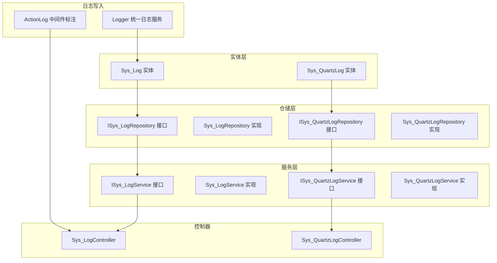
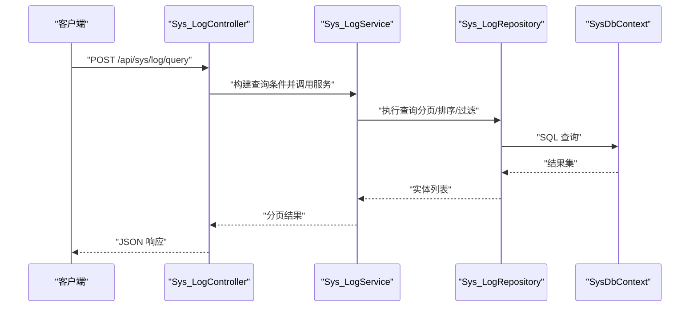
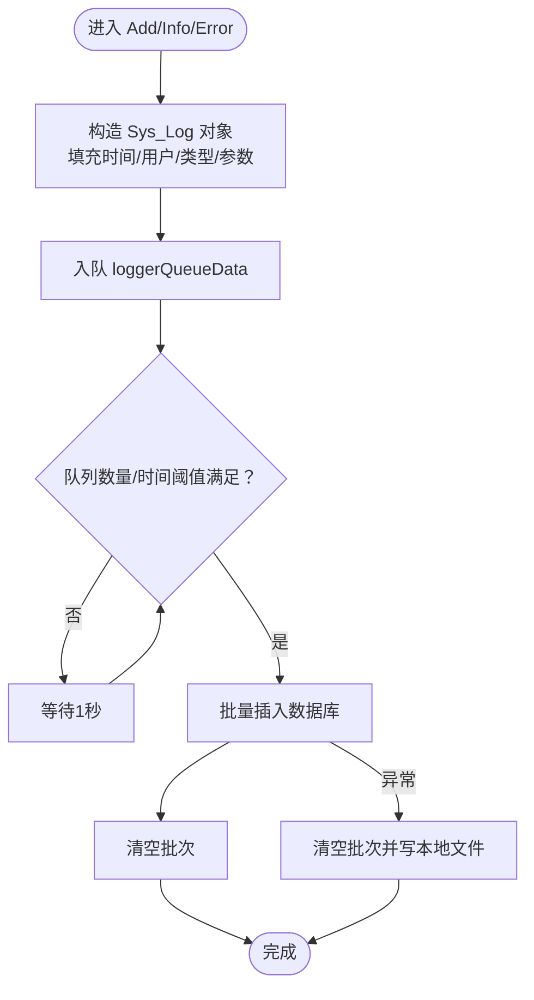
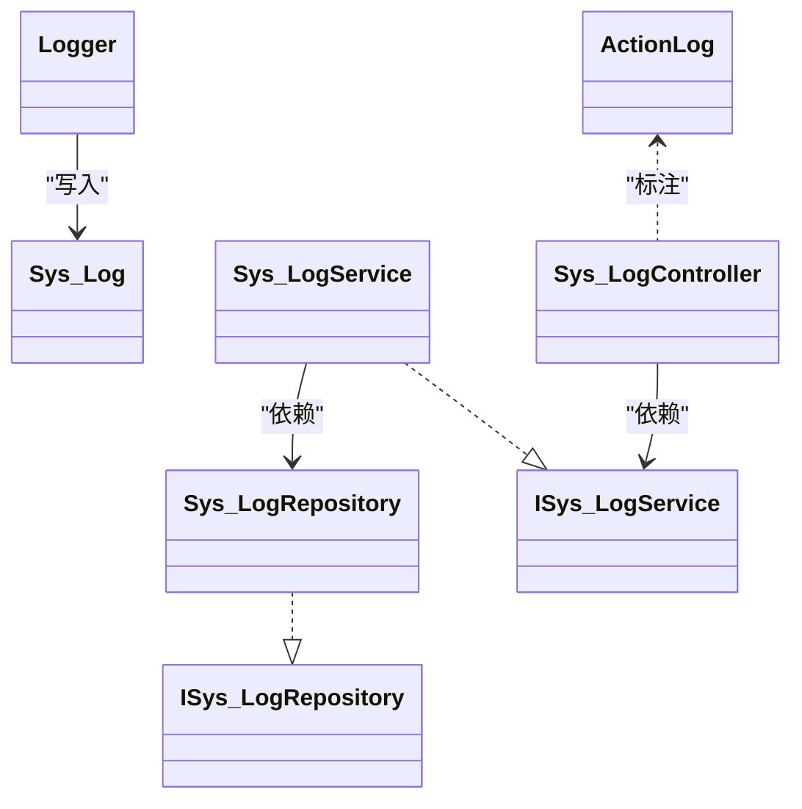

# 系统日志API

<cite>
**本文引用的文件**
- [Sys_Log.cs](file://VolPro.Entity/DomainModels/System/Sys_Log.cs)
- [ISys_LogRepository.cs](file://VolPro.Sys/IRepositories/System/ISys_LogRepository.cs)
- [Sys_LogRepository.cs](file://VolPro.Sys/Repositories/System/Sys_LogRepository.cs)
- [ISys_LogService.cs](file://VolPro.Sys/IServices/System/ISys_LogService.cs)
- [Sys_LogService.cs](file://VolPro.Sys/Services/System/Sys_LogService.cs)
- [Logger.cs](file://VolPro.Core/Services/Logger.cs)
- [ActionLog.cs](file://VolPro.Core/Middleware/ActionLog.cs)
- [Sys_LogController.cs](file://VolPro.WebApi/Controllers/Sys/Sys_LogController.cs)
- [Sys_QuartzLog.cs](file://VolPro.Entity/DomainModels/Quartz/Sys_QuartzLog.cs)
- [ISys_QuartzLogRepository.cs](file://VolPro.Sys/IRepositories/Quartz/ISys_QuartzLogRepository.cs)
- [Sys_QuartzLogRepository.cs](file://VolPro.Sys/Repositories/Quartz/Sys_QuartzLogRepository.cs)
- [ISys_QuartzLogService.cs](file://VolPro.Sys/IServices/Quartz/ISys_QuartzLogService.cs)
- [Sys_QuartzLogService.cs](file://VolPro.Sys/Services/Quartz/Sys_QuartzLogService.cs)
- [Sys_QuartzLogController.cs](file://VolPro.WebApi/Controllers/Sys/Sys_QuartzLogController.cs)
</cite>

## 目录
1. [简介](#简介)
2. [项目结构](#项目结构)
3. [核心组件](#核心组件)
4. [架构总览](#架构总览)
5. [详细组件分析](#详细组件分析)
6. [依赖关系分析](#依赖关系分析)
7. [性能与存储策略](#性能与存储策略)
8. [安全与合规](#安全与合规)
9. [故障排查指南](#故障排查指南)
10. [结论](#结论)

## 简介
本文件面向系统日志管理模块的API接口文档，涵盖系统日志查询、日志分类管理、日志清理与统计分析等能力，并补充日志检索、过滤、导出与归档等端点设计建议。文档基于现有代码库中的日志实体、仓储与服务层、以及统一日志写入机制进行梳理，同时提供可扩展的API设计思路与最佳实践。

## 项目结构
围绕系统日志功能的相关文件分布如下：
- 实体模型：系统日志实体与仓储/服务接口及实现
- 日志写入：统一日志服务与中间件标注
- 控制器：系统日志与定时任务日志的API入口（部分）

图表来源
- [Sys_Log.cs:17-140](file://VolPro.Entity/DomainModels/System/Sys_Log.cs#L17-L140)
- [Sys_QuartzLog.cs](file://VolPro.Entity/DomainModels/Quartz/Sys_QuartzLog.cs)
- [ISys_LogRepository.cs:11-13](file://VolPro.Sys/IRepositories/System/ISys_LogRepository.cs#L11-L13)
- [Sys_LogRepository.cs:9-20](file://VolPro.Sys/Repositories/System/Sys_LogRepository.cs#L9-L20)
- [ISys_LogService.cs:6-8](file://VolPro.Sys/IServices/System/ISys_LogService.cs#L6-L8)
- [Sys_LogService.cs:9-20](file://VolPro.Sys/Services/System/Sys_LogService.cs#L9-L20)
- [Logger.cs:27-307](file://VolPro.Core/Services/Logger.cs#L27-L307)
- [ActionLog.cs:9-31](file://VolPro.Core/Middleware/ActionLog.cs#L9-L31)
- [Sys_LogController.cs:14-16](file://VolPro.WebApi/Controllers/Sys/Sys_LogController.cs#L14-L16)
- [Sys_QuartzLogController.cs:12-14](file://VolPro.WebApi/Controllers/Sys/Sys_QuartzLogController.cs#L12-L14)

章节来源
- [Sys_Log.cs:17-140](file://VolPro.Entity/DomainModels/System/Sys_Log.cs#L17-L140)
- [Logger.cs:27-307](file://VolPro.Core/Services/Logger.cs#L27-L307)
- [Sys_LogRepository.cs:9-20](file://VolPro.Sys/Repositories/System/Sys_LogRepository.cs#L9-L20)
- [Sys_LogService.cs:9-20](file://VolPro.Sys/Services/System/Sys_LogService.cs#L9-L20)
- [Sys_QuartzLogRepository.cs](file://VolPro.Sys/Repositories/Quartz/Sys_QuartzLogRepository.cs)
- [Sys_QuartzLogService.cs](file://VolPro.Sys/Services/Quartz/Sys_QuartzLogService.cs)

## 核心组件
- 系统日志实体：Sys_Log，包含请求/响应参数、异常信息、用户与设备信息、时间戳、耗时等字段，用于承载通用系统日志。
- 定时任务日志实体：Sys_QuartzLog，用于承载调度任务执行日志。
- 仓储与服务：ISys_LogRepository/Repository、ISys_LogService/Service 提供基础CRUD与查询能力。
- 统一日志服务：Logger 提供异步队列写入、批量入库、错误回退与本地文件落盘等能力。
- 中间件标注：ActionLog 可对控制器或动作进行日志开关与类型标注，配合Logger使用。

章节来源
- [Sys_Log.cs:17-140](file://VolPro.Entity/DomainModels/System/Sys_Log.cs#L17-L140)
- [Sys_QuartzLog.cs](file://VolPro.Entity/DomainModels/Quartz/Sys_QuartzLog.cs)
- [ISys_LogRepository.cs:11-13](file://VolPro.Sys/IRepositories/System/ISys_LogRepository.cs#L11-L13)
- [Sys_LogRepository.cs:9-20](file://VolPro.Sys/Repositories/System/Sys_LogRepository.cs#L9-L20)
- [ISys_LogService.cs:6-8](file://VolPro.Sys/IServices/System/ISys_LogService.cs#L6-L8)
- [Sys_LogService.cs:9-20](file://VolPro.Sys/Services/System/Sys_LogService.cs#L9-L20)
- [Logger.cs:27-307](file://VolPro.Core/Services/Logger.cs#L27-L307)
- [ActionLog.cs:9-31](file://VolPro.Core/Middleware/ActionLog.cs#L9-L31)

## 架构总览
系统日志写入采用“异步队列+定时批量入库”的模式，避免高频写入阻塞主线程；查询侧通过仓储与服务层提供基础能力，控制器作为API入口进行参数解析与返回封装。

图表来源
- [Sys_LogController.cs:14-16](file://VolPro.WebApi/Controllers/Sys/Sys_LogController.cs#L14-L16)
- [Sys_LogService.cs:9-20](file://VolPro.Sys/Services/System/Sys_LogService.cs#L9-L20)
- [Sys_LogRepository.cs:9-20](file://VolPro.Sys/Repositories/System/Sys_LogRepository.cs#L9-L20)

## 详细组件分析

### 系统日志实体与字段说明
- 关键字段：标识、开始/结束时间、用户与角色、请求/响应参数、异常信息、耗时、URL、用户/服务端IP、浏览器类型等。
- 字段约束：如字符串长度限制、整型字段、日期时间等，确保入库一致性与查询效率。

章节来源
- [Sys_Log.cs:17-140](file://VolPro.Entity/DomainModels/System/Sys_Log.cs#L17-L140)

### 统一日志写入流程（Logger）
- 异步队列：Logger 使用并发队列收集日志条目，避免阻塞请求线程。
- 批量入库：每秒或达到阈值后批量写入数据库，支持多数据库类型优化。
- 错误处理：异常时清空批次并写入本地文件，保证不丢失。
- 请求上下文：自动填充URL、IP、UA、请求参数等信息。

图表来源
- [Logger.cs:92-170](file://VolPro.Core/Services/Logger.cs#L92-L170)
- [Logger.cs:172-207](file://VolPro.Core/Services/Logger.cs#L172-L207)
- [Logger.cs:209-219](file://VolPro.Core/Services/Logger.cs#L209-L219)

章节来源
- [Logger.cs:27-307](file://VolPro.Core/Services/Logger.cs#L27-L307)

### 日志控制器与API端点设计建议
- 当前已存在 Sys_LogController 作为API入口，结合仓储与服务层可实现以下端点：
  - GET /api/sys/log/page：分页查询（按时间、用户、类型、状态等过滤）
  - GET /api/sys/log/detail/{id}：按ID查看详情
  - GET /api/sys/log/export：导出日志（CSV/Excel）
  - POST /api/sys/log/cleanup：清理过期日志（按天/月/年策略）
  - GET /api/sys/log/stats：统计分析（按日/小时/类型/异常占比）
  - GET /api/sys/log/trace/{traceId}：异常追踪（基于异常信息/请求参数关键字）
  - GET /api/sys/log/categories：日志分类统计
  - POST /api/sys/log/archive：归档历史日志（移动至归档表/文件）
- 参数与分页逻辑：
  - 分页：page、pageSize、order、by
  - 过滤：beginDate、endDate、userName、url、logType、success、userIP
  - 导出：可附加筛选条件与时间范围
  - 清理/归档：可配置保留期限与目标存储位置
- 返回格式：遵循统一响应包装（如分页数据、统计聚合、导出链接等）

说明：以上为基于现有仓储/服务层能力的API设计建议，具体端点需在 Sys_LogController 中实现。

章节来源
- [Sys_LogController.cs:14-16](file://VolPro.WebApi/Controllers/Sys/Sys_LogController.cs#L14-L16)
- [ISys_LogRepository.cs:11-13](file://VolPro.Sys/IRepositories/System/ISys_LogRepository.cs#L11-L13)
- [ISys_LogService.cs:6-8](file://VolPro.Sys/IServices/System/ISys_LogService.cs#L6-L8)

### 定时任务日志（Sys_QuartzLog）
- 实体：Sys_QuartzLog，承载调度任务执行日志（如任务名、触发时间、执行时长、状态、异常等）。
- 控制器：Sys_QuartzLogController，提供查询、统计与导出等能力。
- 与系统日志的关系：二者可并行维护，便于区分业务日志与调度日志。

章节来源
- [Sys_QuartzLog.cs](file://VolPro.Entity/DomainModels/Quartz/Sys_QuartzLog.cs)
- [Sys_QuartzLogController.cs:12-14](file://VolPro.WebApi/Controllers/Sys/Sys_QuartzLogController.cs#L12-L14)

## 依赖关系分析
- 控制器依赖服务层，服务层依赖仓储层，仓储层依赖数据库上下文。
- Logger 作为独立组件，通过实体模型写入数据库，不直接依赖控制器。
- ActionLog 可标注是否写日志及日志类型，配合中间件或拦截器使用。

图表来源
- [Sys_Log.cs:17-140](file://VolPro.Entity/DomainModels/System/Sys_Log.cs#L17-L140)
- [ISys_LogRepository.cs:11-13](file://VolPro.Sys/IRepositories/System/ISys_LogRepository.cs#L11-L13)
- [Sys_LogRepository.cs:9-20](file://VolPro.Sys/Repositories/System/Sys_LogRepository.cs#L9-L20)
- [ISys_LogService.cs:6-8](file://VolPro.Sys/IServices/System/ISys_LogService.cs#L6-L8)
- [Sys_LogService.cs:9-20](file://VolPro.Sys/Services/System/Sys_LogService.cs#L9-L20)
- [Logger.cs:27-307](file://VolPro.Core/Services/Logger.cs#L27-L307)
- [ActionLog.cs:9-31](file://VolPro.Core/Middleware/ActionLog.cs#L9-L31)

章节来源
- [Sys_LogRepository.cs:9-20](file://VolPro.Sys/Repositories/System/Sys_LogRepository.cs#L9-L20)
- [Sys_LogService.cs:9-20](file://VolPro.Sys/Services/System/Sys_LogService.cs#L9-L20)
- [Logger.cs:27-307](file://VolPro.Core/Services/Logger.cs#L27-L307)

## 性能与存储策略
- 写入性能
  - 异步队列与批量入库：降低IO阻塞，提升吞吐。
  - 数据库优化：根据查询热点建立索引（如时间、用户、类型、状态），分表分库（按时间分区/分片）。
- 读取性能
  - 分页查询：默认按时间倒序，支持按类型/状态/用户过滤。
  - 缓存：对高频统计结果进行缓存（如近7日趋势）。
- 存储策略
  - 归档：定期将历史日志归档至冷存储或压缩文件。
  - 清理：按保留策略删除过期日志，释放空间。
  - 导出：支持离线导出，避免大查询影响在线性能。

## 安全与合规
- 访问控制
  - 仅授权用户可访问日志查询与导出接口，建议结合权限过滤与审计。
- 数据脱敏
  - 导出与展示前对敏感字段（如密码、令牌、个人隐私）进行脱敏处理。
- 合规要求
  - 日志保留期限与销毁流程需符合法规要求，提供合规审计日志。
  - 异常日志追踪需满足最小披露原则，避免泄露系统细节。

## 故障排查指南
- 日志写入失败
  - 检查数据库连接与权限，确认批量写入是否抛出异常。
  - 查看本地错误文件路径，定位具体异常堆栈。
- 查询性能差
  - 检查过滤条件是否命中索引，必要时调整索引或拆分查询。
  - 避免一次性导出超大数据集，建议分批或异步导出。
- 导出异常
  - 确认导出接口的筛选参数与分页参数正确，检查文件生成与下载路径。

章节来源
- [Logger.cs:209-219](file://VolPro.Core/Services/Logger.cs#L209-L219)
- [Logger.cs:172-207](file://VolPro.Core/Services/Logger.cs#L172-L207)

## 结论
系统日志管理模块以实体-仓储-服务-控制器分层清晰，结合统一日志写入组件实现了高吞吐、低延迟的日志采集能力。通过合理的API设计与性能优化策略，可满足日志查询、统计分析、导出与归档等需求，并兼顾安全与合规要求。后续可在 Sys_LogController 中完善上述端点，形成完整的日志管理API体系。