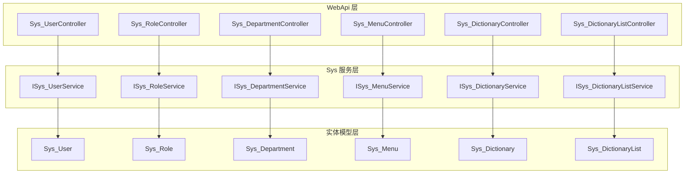
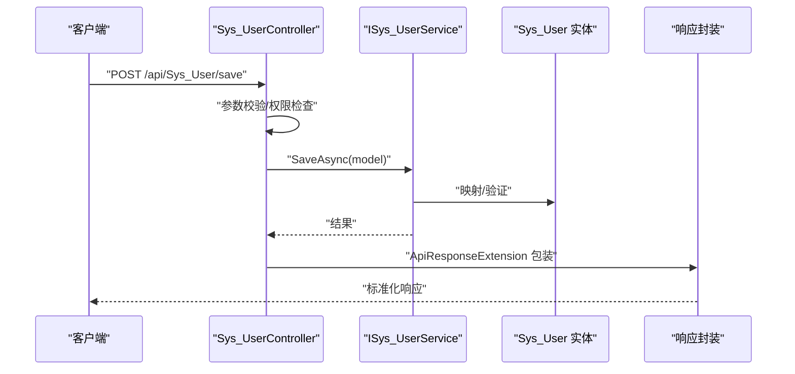
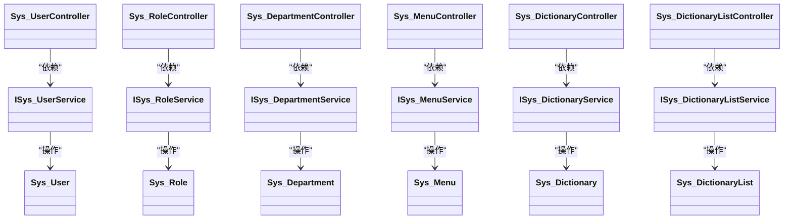

# 系统管理API

<cite>
**本文引用的文件**
- [Sys_UserController.cs](file://VolPro.WebApi/Controllers/Sys/Sys_UserController.cs)
- [Sys_RoleController.cs](file://VolPro.WebApi/Controllers/Sys/Sys_RoleController.cs)
- [Sys_DepartmentController.cs](file://VolPro.WebApi/Controllers/Sys/Sys_DepartmentController.cs)
- [Sys_MenuController.cs](file://VolPro.WebApi/Controllers/Sys/Sys_MenuController.cs)
- [Sys_DictionaryController.cs](file://VolPro.WebApi/Controllers/Sys/Sys_DictionaryController.cs)
- [Sys_DictionaryListController.cs](file://VolPro.WebApi/Controllers/Sys/Sys_DictionaryListController.cs)
- [ISys_UserService.cs](file://VolPro.Sys/IServices/System/ISys_UserService.cs)
- [ISys_RoleService.cs](file://VolPro.Sys/IServices/System/ISys_RoleService.cs)
- [ISys_DepartmentService.cs](file://VolPro.Sys/IServices/System/ISys_DepartmentService.cs)
- [ISys_MenuService.cs](file://VolPro.Sys/IServices/System/ISys_MenuService.cs)
- [ISys_DictionaryService.cs](file://VolPro.Sys/IServices/System/ISys_DictionaryService.cs)
- [ISys_DictionaryListService.cs](file://VolPro.Sys/IServices/System/ISys_DictionaryListService.cs)
- [Sys_User.cs](file://VolPro.Entity/DomainModels/System/Sys_User.cs)
- [Sys_Role.cs](file://VolPro.Entity/DomainModels/System/Sys_Role.cs)
- [Sys_Department.cs](file://VolPro.Entity/DomainModels/System/Sys_Department.cs)
- [Sys_Menu.cs](file://VolPro.Entity/DomainModels/System/Sys_Menu.cs)
- [Sys_Dictionary.cs](file://VolPro.Entity/DomainModels/System/Sys_Dictionary.cs)
- [Sys_DictionaryList.cs](file://VolPro.Entity/DomainModels/System/Sys_DictionaryList.cs)
- [ApiBaseController.cs](file://VolPro.Core/Controllers/Basic/ApiBaseController.cs)
- [JWTAuthorize.cs](file://VolPro.Core/Filters/JWTAuthorize.cs)
- [PermissionTableAttribute.cs](file://VolPro.Entity/AttributeManager/PermissionTableAttribute.cs)
- [ActionPermissionAttribute.cs](file://VolPro.Core/Filters/ActionPermissionAttribute.cs)
- [ActionPermissionFilter.cs](file://VolPro.Core/Filters/ActionPermissionFilter.cs)
- [ActionPermissionRequirement.cs](file://VolPro.Core/Filters/ActionPermissionRequirement.cs)
- [ApiAuthorizeFilter.cs](file://VolPro.Core/Filters/ApiAuthorizeFilter.cs)
- [ApiResponseExtension.cs](file://VolPro.Core/Extensions/Response/ApiResponseExtension.cs)
- [ResponseMsg.cs](file://VolPro.Core/Extensions/Response/ResponseMsg.cs)
- [ExceptionHandlerMiddleWare.cs](file://VolPro.Core/Middleware/ExceptionHandlerMiddleWare.cs)
- [HttpContextMiddleware.cs](file://VolPro.Core/Middleware/HttpContextMiddleware.cs)
</cite>

## 目录
1. [简介](#简介)
2. [项目结构](#项目结构)
3. [核心组件](#核心组件)
4. [架构总览](#架构总览)
5. [详细组件分析](#详细组件分析)
6. [依赖关系分析](#依赖关系分析)
7. [性能考虑](#性能考虑)
8. [故障排除指南](#故障排除指南)
9. [结论](#结论)

## 简介
本文件为系统管理模块的API接口文档，覆盖用户管理、角色权限、部门管理、菜单管理和数据字典等核心功能。文档基于实际代码结构与控制器实现，提供端点概览、参数说明、数据验证规则、业务约束、权限验证与错误处理流程，并给出调用序列图与类关系图，帮助开发者快速理解与正确使用API。

## 项目结构
系统管理API位于WebApi层的Sys命名空间下，采用分层架构：
- 控制器层：Sys_*Controller 负责HTTP请求入口与路由
- 服务接口层：ISys_*Service 定义业务契约
- 实体模型层：Sys_* 定义数据库表映射与字段约束
- 基础控制器：ApiBaseController 提供通用CRUD与响应封装
- 权限与过滤器：JWTAuthorize、ActionPermission* 等负责鉴权与授权

图表来源
- [Sys_UserController.cs:13-15](file://VolPro.WebApi/Controllers/Sys/Sys_UserController.cs#L13-L15)
- [Sys_RoleController.cs:14-16](file://VolPro.WebApi/Controllers/Sys/Sys_RoleController.cs#L14-L16)
- [Sys_DepartmentController.cs:11-13](file://VolPro.WebApi/Controllers/Sys/Sys_DepartmentController.cs#L11-L13)
- [Sys_MenuController.cs:11-13](file://VolPro.WebApi/Controllers/Sys/Sys_MenuController.cs#L11-L13)
- [Sys_DictionaryController.cs:10-12](file://VolPro.WebApi/Controllers/Sys/Sys_DictionaryController.cs#L10-L12)
- [Sys_DictionaryListController.cs:11-13](file://VolPro.WebApi/Controllers/Sys/Sys_DictionaryListController.cs#L11-L13)
- [ISys_UserService.cs:12-14](file://VolPro.Sys/IServices/System/ISys_UserService.cs#L12-L14)
- [ISys_RoleService.cs:12-14](file://VolPro.Sys/IServices/System/ISys_RoleService.cs#L12-L14)
- [ISys_DepartmentService.cs:9-11](file://VolPro.Sys/IServices/System/ISys_DepartmentService.cs#L9-L11)
- [ISys_MenuService.cs:6-8](file://VolPro.Sys/IServices/System/ISys_MenuService.cs#L6-L8)
- [ISys_DictionaryService.cs:12-14](file://VolPro.Sys/IServices/System/ISys_DictionaryService.cs#L12-L14)
- [ISys_DictionaryListService.cs:9-11](file://VolPro.Sys/IServices/System/ISys_DictionaryListService.cs#L9-L11)

章节来源
- [Sys_UserController.cs:1-24](file://VolPro.WebApi/Controllers/Sys/Sys_UserController.cs#L1-L24)
- [Sys_RoleController.cs:1-27](file://VolPro.WebApi/Controllers/Sys/Sys_RoleController.cs#L1-L27)
- [Sys_DepartmentController.cs:1-22](file://VolPro.WebApi/Controllers/Sys/Sys_DepartmentController.cs#L1-L22)
- [Sys_MenuController.cs:1-23](file://VolPro.WebApi/Controllers/Sys/Sys_MenuController.cs#L1-L23)
- [Sys_DictionaryController.cs:1-19](file://VolPro.WebApi/Controllers/Sys/Sys_DictionaryController.cs#L1-L19)
- [Sys_DictionaryListController.cs:1-22](file://VolPro.WebApi/Controllers/Sys/Sys_DictionaryListController.cs#L1-L22)

## 核心组件
- 基础控制器 ApiBaseController：提供统一的CRUD入口、分页查询、保存、删除等能力，并通过响应扩展进行标准化输出。
- 权限注解 PermissionTableAttribute：用于标记实体对应的权限表，配合ActionPermissionFilter实现细粒度权限控制。
- 鉴权过滤器 JWTAuthorize：基于JWT的全局或控制器级鉴权。
- 响应扩展 ApiResponseExtension/ResponseMsg：统一返回格式与消息封装。
- 异常中间件 ExceptionHandlerMiddleWare/HttpContextMiddleware：集中处理异常与上下文信息。

章节来源
- [ApiBaseController.cs](file://VolPro.Core/Controllers/Basic/ApiBaseController.cs)
- [PermissionTableAttribute.cs](file://VolPro.Entity/AttributeManager/PermissionTableAttribute.cs)
- [JWTAuthorize.cs](file://VolPro.Core/Filters/JWTAuthorize.cs)
- [ActionPermissionFilter.cs](file://VolPro.Core/Filters/ActionPermissionFilter.cs)
- [ApiResponseExtension.cs](file://VolPro.Core/Extensions/Response/ApiResponseExtension.cs)
- [ResponseMsg.cs](file://VolPro.Core/Extensions/Response/ResponseMsg.cs)
- [ExceptionHandlerMiddleWare.cs](file://VolPro.Core/Middleware/ExceptionHandlerMiddleWare.cs)
- [HttpContextMiddleware.cs](file://VolPro.Core/Middleware/HttpContextMiddleware.cs)

## 架构总览
系统管理API遵循“控制器-服务-仓储-实体”的分层设计，控制器仅负责路由与参数接收，业务逻辑委托给服务层，服务层再操作实体模型完成持久化。权限控制贯穿于控制器与服务之间，确保API访问安全可控。

图表来源
- [Sys_UserController.cs:13-15](file://VolPro.WebApi/Controllers/Sys/Sys_UserController.cs#L13-L15)
- [ISys_UserService.cs:12-14](file://VolPro.Sys/IServices/System/ISys_UserService.cs#L12-L14)
- [Sys_User.cs](file://VolPro.Entity/DomainModels/System/Sys_User.cs)
- [ApiResponseExtension.cs](file://VolPro.Core/Extensions/Response/ApiResponseExtension.cs)

## 详细组件分析

### 用户管理 API
- 路由与控制器
  - 路由前缀：/api/Sys_User
  - 控制器：Sys_UserController
  - 权限表：Sys_User（通过 PermissionTable 注解声明）
- 关键能力
  - 继承自 ApiBaseController，具备标准CRUD与分页查询能力
  - 服务接口：ISys_UserService
  - 实体模型：Sys_User
- 参数与约束
  - 新增/编辑：提交Sys_User模型，字段约束由实体属性与数据注解决定
  - 删除：按主键删除
  - 查询：支持分页与条件筛选（由基础控制器提供）
- 权限与安全
  - 通过 PermissionTable(Name="Sys_User") 与 ActionPermissionFilter 实现资源级权限控制
  - 建议结合 JWTAuthorize 对敏感操作进行身份认证
- 错误处理
  - 使用 ResponseMsg/ApiResponseExtension 统一包装错误与成功响应
  - 全局异常由 ExceptionHandlerMiddleWare 捕获并转换为标准格式

章节来源
- [Sys_UserController.cs:13-15](file://VolPro.WebApi/Controllers/Sys/Sys_UserController.cs#L13-L15)
- [ISys_UserService.cs:12-14](file://VolPro.Sys/IServices/System/ISys_UserService.cs#L12-L14)
- [Sys_User.cs](file://VolPro.Entity/DomainModels/System/Sys_User.cs)
- [PermissionTableAttribute.cs](file://VolPro.Entity/AttributeManager/PermissionTableAttribute.cs)
- [ActionPermissionFilter.cs](file://VolPro.Core/Filters/ActionPermissionFilter.cs)
- [JWTAuthorize.cs](file://VolPro.Core/Filters/JWTAuthorize.cs)
- [ResponseMsg.cs](file://VolPro.Core/Extensions/Response/ResponseMsg.cs)
- [ApiResponseExtension.cs](file://VolPro.Core/Extensions/Response/ApiResponseExtension.cs)
- [ExceptionHandlerMiddleWare.cs](file://VolPro.Core/Middleware/ExceptionHandlerMiddleWare.cs)

### 角色权限 API
- 路由与控制器
  - 路由前缀：/api/Sys_Role
  - 控制器：Sys_RoleController
  - 权限表：Sys_Role
- 关键能力
  - 继承 ApiBaseController，提供角色的增删改查与授权关联
  - 服务接口：ISys_RoleService
  - 实体模型：Sys_Role
- 参数与约束
  - 角色名称唯一性、状态枚举等字段约束由实体定义
  - 授权分配通常通过角色-资源授权表（如 Sys_RoleAuth）实现，具体逻辑由服务层处理
- 权限与安全
  - PermissionTable(Name="Sys_Role") + ActionPermissionFilter
  - 建议对角色授权变更操作启用更严格的审计与二次确认
- 错误处理
  - 统一响应与异常捕获同用户管理

章节来源
- [Sys_RoleController.cs:14-16](file://VolPro.WebApi/Controllers/Sys/Sys_RoleController.cs#L14-L16)
- [ISys_RoleService.cs:12-14](file://VolPro.Sys/IServices/System/ISys_RoleService.cs#L12-L14)
- [Sys_Role.cs](file://VolPro.Entity/DomainModels/System/Sys_Role.cs)
- [PermissionTableAttribute.cs](file://VolPro.Entity/AttributeManager/PermissionTableAttribute.cs)
- [ActionPermissionFilter.cs](file://VolPro.Core/Filters/ActionPermissionFilter.cs)
- [ResponseMsg.cs](file://VolPro.Core/Extensions/Response/ResponseMsg.cs)

### 部门管理 API
- 路由与控制器
  - 路由前缀：/api/Sys_Department
  - 控制器：Sys_DepartmentController
  - 权限表：Sys_Department
- 关键能力
  - 组织架构树形展示与层级管理
  - 服务接口：ISys_DepartmentService
  - 实体模型：Sys_Department
- 参数与约束
  - 上级部门、排序、是否启用等字段约束
  - 树形结构需避免循环引用（如父节点不能指向自身或子节点）
- 权限与安全
  - PermissionTable(Name="Sys_Department") + ActionPermissionFilter
- 错误处理
  - 统一响应与异常捕获

章节来源
- [Sys_DepartmentController.cs:11-13](file://VolPro.WebApi/Controllers/Sys/Sys_DepartmentController.cs#L11-L13)
- [ISys_DepartmentService.cs:9-11](file://VolPro.Sys/IServices/System/ISys_DepartmentService.cs#L9-L11)
- [Sys_Department.cs](file://VolPro.Entity/DomainModels/System/Sys_Department.cs)
- [PermissionTableAttribute.cs](file://VolPro.Entity/AttributeManager/PermissionTableAttribute.cs)
- [ActionPermissionFilter.cs](file://VolPro.Core/Filters/ActionPermissionFilter.cs)
- [ResponseMsg.cs](file://VolPro.Core/Extensions/Response/ResponseMsg.cs)

### 菜单管理 API
- 路由与控制器
  - 路由前缀：/api/menu
  - 控制器：Sys_MenuController
  - 鉴权：JWTAuthorize（控制器级）
- 关键能力
  - 菜单树形结构、按钮权限、路由配置等
  - 服务接口：ISys_MenuService
  - 实体模型：Sys_Menu
- 参数与约束
  - 菜单类型、路由路径、权限标识、层级关系等
  - 需保证父子菜单层级与权限标识唯一性
- 权限与安全
  - JWTAuthorize 全局鉴权；菜单权限与用户角色绑定（如 Sys_MenuRole）
- 错误处理
  - 统一响应与异常捕获

章节来源
- [Sys_MenuController.cs:11-13](file://VolPro.WebApi/Controllers/Sys/Sys_MenuController.cs#L11-L13)
- [ISys_MenuService.cs:6-8](file://VolPro.Sys/IServices/System/ISys_MenuService.cs#L6-L8)
- [Sys_Menu.cs](file://VolPro.Entity/DomainModels/System/Sys_Menu.cs)
- [JWTAuthorize.cs](file://VolPro.Core/Filters/JWTAuthorize.cs)
- [ResponseMsg.cs](file://VolPro.Core/Extensions/Response/ResponseMsg.cs)

### 数据字典 API
- 字典项 API
  - 路由前缀：/api/Sys_Dictionary
  - 控制器：Sys_DictionaryController
  - 权限表：Sys_Dictionary
  - 服务接口：ISys_DictionaryService
  - 实体模型：Sys_Dictionary
- 字典列表 API
  - 路由前缀：/api/Sys_DictionaryList
  - 控制器：Sys_DictionaryListController
  - 权限表：Sys_DictionaryList
  - 服务接口：ISys_DictionaryListService
  - 实体模型：Sys_DictionaryList
- 参数与约束
  - 字典分类、键值唯一性、排序、启用状态等
  - 列表项需与字典分类关联
- 权限与安全
  - PermissionTable(Name="Sys_Dictionary"/"Sys_DictionaryList")
- 错误处理
  - 统一响应与异常捕获

章节来源
- [Sys_DictionaryController.cs:10-12](file://VolPro.WebApi/Controllers/Sys/Sys_DictionaryController.cs#L10-L12)
- [Sys_DictionaryListController.cs:11-13](file://VolPro.WebApi/Controllers/Sys/Sys_DictionaryListController.cs#L11-L13)
- [ISys_DictionaryService.cs:12-14](file://VolPro.Sys/IServices/System/ISys_DictionaryService.cs#L12-L14)
- [ISys_DictionaryListService.cs:9-11](file://VolPro.Sys/IServices/System/ISys_DictionaryListService.cs#L9-L11)
- [Sys_Dictionary.cs](file://VolPro.Entity/DomainModels/System/Sys_Dictionary.cs)
- [Sys_DictionaryList.cs](file://VolPro.Entity/DomainModels/System/Sys_DictionaryList.cs)
- [PermissionTableAttribute.cs](file://VolPro.Entity/AttributeManager/PermissionTableAttribute.cs)
- [ResponseMsg.cs](file://VolPro.Core/Extensions/Response/ResponseMsg.cs)

## 依赖关系分析
- 控制器到服务：各 Sys_*Controller 依赖对应 ISys_*Service
- 服务到实体：ISys_*Service 处理 Sys_* 实体的持久化与业务逻辑
- 权限链路：PermissionTableAttribute + ActionPermissionFilter + ActionPermissionRequirement 实现资源级权限
- 鉴权链路：JWTAuthorize 在控制器上启用JWT认证
- 响应与异常：ApiResponseExtension/ResponseMsg 统一响应；ExceptionHandlerMiddleWare/HttpContextMiddleware 统一异常处理

图表来源
- [Sys_UserController.cs:13-15](file://VolPro.WebApi/Controllers/Sys/Sys_UserController.cs#L13-L15)
- [Sys_RoleController.cs:14-16](file://VolPro.WebApi/Controllers/Sys/Sys_RoleController.cs#L14-L16)
- [Sys_DepartmentController.cs:11-13](file://VolPro.WebApi/Controllers/Sys/Sys_DepartmentController.cs#L11-L13)
- [Sys_MenuController.cs:11-13](file://VolPro.WebApi/Controllers/Sys/Sys_MenuController.cs#L11-L13)
- [Sys_DictionaryController.cs:10-12](file://VolPro.WebApi/Controllers/Sys/Sys_DictionaryController.cs#L10-L12)
- [Sys_DictionaryListController.cs:11-13](file://VolPro.WebApi/Controllers/Sys/Sys_DictionaryListController.cs#L11-L13)
- [ISys_UserService.cs:12-14](file://VolPro.Sys/IServices/System/ISys_UserService.cs#L12-L14)
- [ISys_RoleService.cs:12-14](file://VolPro.Sys/IServices/System/ISys_RoleService.cs#L12-L14)
- [ISys_DepartmentService.cs:9-11](file://VolPro.Sys/IServices/System/ISys_DepartmentService.cs#L9-L11)
- [ISys_MenuService.cs:6-8](file://VolPro.Sys/IServices/System/ISys_MenuService.cs#L6-L8)
- [ISys_DictionaryService.cs:12-14](file://VolPro.Sys/IServices/System/ISys_DictionaryService.cs#L12-L14)
- [ISys_DictionaryListService.cs:9-11](file://VolPro.Sys/IServices/System/ISys_DictionaryListService.cs#L9-L11)

## 性能考虑
- 缓存策略：可利用内存缓存或Redis缓存热点数据（如菜单树、字典项），减少重复查询
- 分页查询：大数据量场景优先使用分页与索引优化
- 批量操作：批量新增/更新时注意事务与回滚成本
- 权限过滤：尽量在服务层进行权限过滤，避免跨层重复判断
- 日志与审计：对敏感操作开启审计日志，便于追踪与性能分析

## 故障排除指南
- 认证失败
  - 确认请求头携带有效的JWT令牌
  - 检查JWTAuthorize 是否正确应用到控制器或动作
- 权限不足
  - 检查 PermissionTable 与 ActionPermissionFilter 的资源标识是否匹配
  - 确认用户角色与资源授权关系（如 Sys_RoleAuth/Sys_MenuRole）
- 参数错误
  - 使用实体模型的字段约束与必填校验
  - 结合对象模型验证器进行入参校验
- 服务异常
  - 查看 ExceptionHandlerMiddleWare 的异常捕获与转换
  - 检查服务层异常是否被正确包装为标准响应

章节来源
- [JWTAuthorize.cs](file://VolPro.Core/Filters/JWTAuthorize.cs)
- [ActionPermissionFilter.cs](file://VolPro.Core/Filters/ActionPermissionFilter.cs)
- [ActionPermissionRequirement.cs](file://VolPro.Core/Filters/ActionPermissionRequirement.cs)
- [PermissionTableAttribute.cs](file://VolPro.Entity/AttributeManager/PermissionTableAttribute.cs)
- [ExceptionHandlerMiddleWare.cs](file://VolPro.Core/Middleware/ExceptionHandlerMiddleWare.cs)
- [HttpContextMiddleware.cs](file://VolPro.Core/Middleware/HttpContextMiddleware.cs)

## 结论
系统管理API以清晰的分层架构与完善的权限体系为基础，覆盖用户、角色、部门、菜单与字典等核心管理功能。通过统一的响应封装与异常处理，确保了接口的一致性与可靠性。建议在生产环境中结合缓存、分页与审计策略，进一步提升性能与安全性。