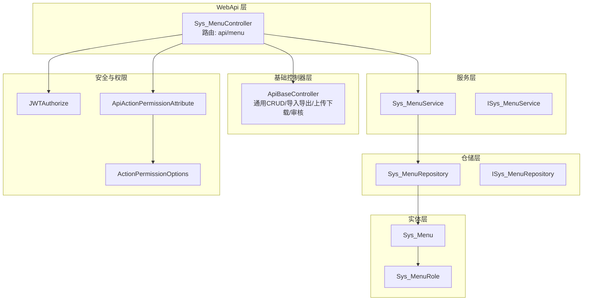
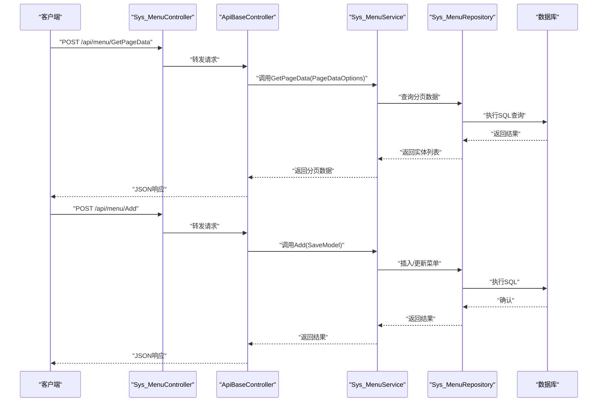
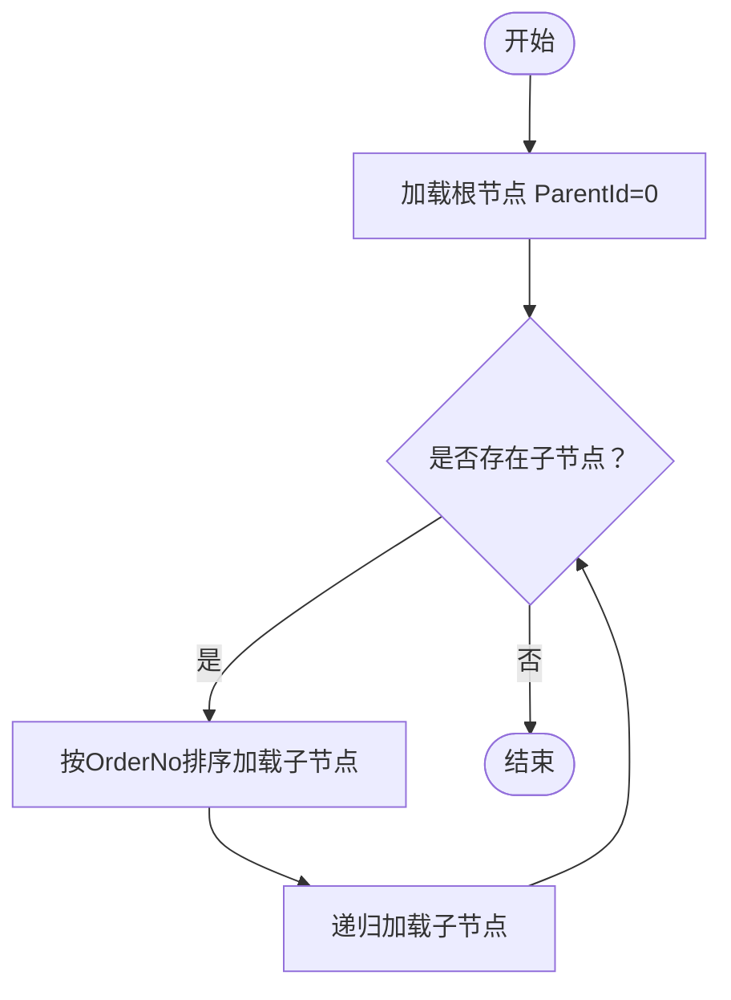
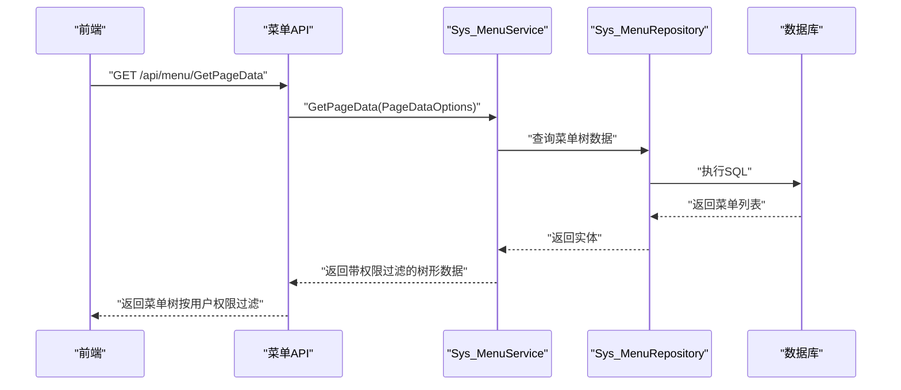
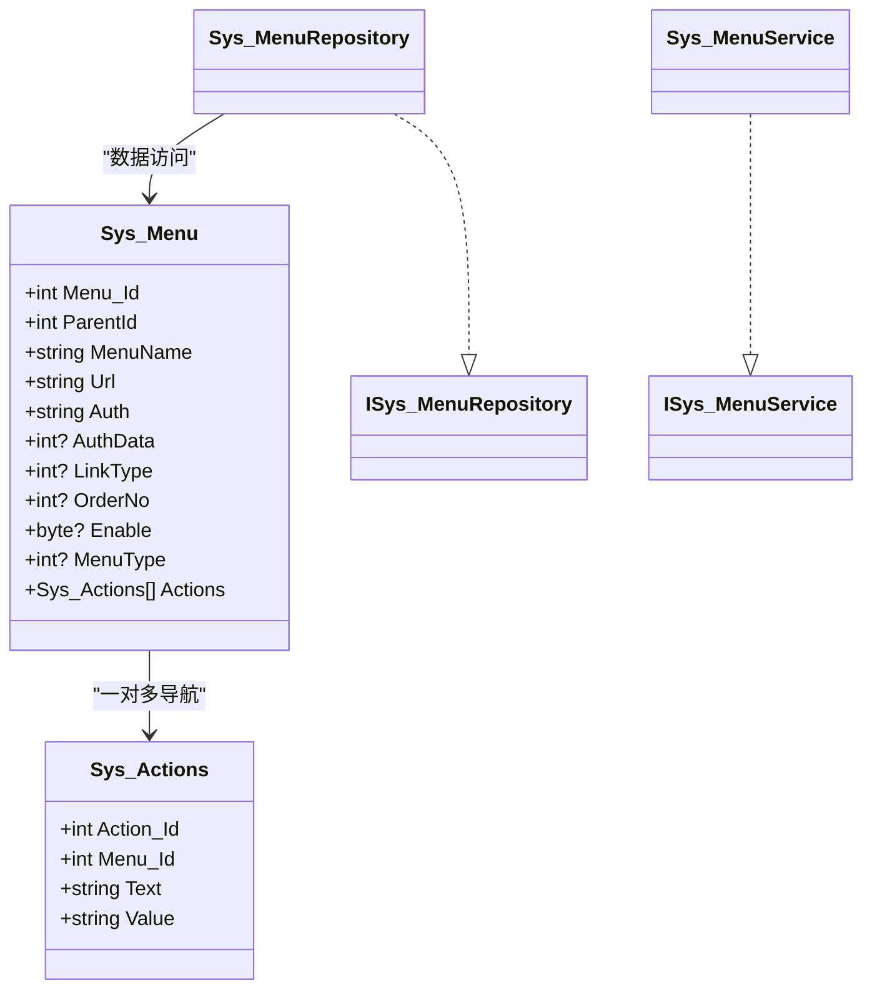

# 菜单系统API

<cite>
**本文引用的文件**
- [Sys_Menu.cs](file://VolPro.Entity/DomainModels/System/Sys_Menu.cs)
- [Sys_MenuRole.cs](file://VolPro.Entity/DomainModels/System/Sys_MenuRole.cs)
- [ISys_MenuRepository.cs](file://VolPro.Sys/IRepositories/System/ISys_MenuRepository.cs)
- [ISys_MenuService.cs](file://VolPro.Sys/IServices/System/ISys_MenuService.cs)
- [Sys_MenuRepository.cs](file://VolPro.Sys/Repositories/System/Sys_MenuRepository.cs)
- [Sys_MenuService.cs](file://VolPro.Sys/Services/System/Sys_MenuService.cs)
- [Sys_MenuController.cs](file://VolPro.WebApi/Controllers/Sys/Sys_MenuController.cs)
- [ApiBaseController.cs](file://VolPro.Core/Controllers/Basic/ApiBaseController.cs)
- [JWTAuthorize.cs](file://VolPro.Core/Filters/JWTAuthorize.cs)
- [ApiActionPermissionAttribute.cs](file://VolPro.Core/Filters/ApiActionPermissionAttribute.cs)
- [ActionPermissionOptions.cs](file://VolPro.Core/Enums/ActionPermissionOptions.cs)
</cite>

## 目录
1. [简介](#简介)
2. [项目结构](#项目结构)
3. [核心组件](#核心组件)
4. [架构总览](#架构总览)
5. [详细组件分析](#详细组件分析)
6. [依赖关系分析](#依赖关系分析)
7. [性能考虑](#性能考虑)
8. [故障排除指南](#故障排除指南)
9. [结论](#结论)

## 简介
本文件面向菜单系统管理模块的API接口文档，聚焦菜单创建、权限绑定、菜单排序与状态控制等能力，并覆盖菜单树形结构管理、菜单权限配置、显示控制与路由配置等端点。文档提供参数说明、层级验证规则、权限绑定逻辑、请求/响应示例（含动态加载与权限过滤场景）、安全机制与权限验证策略，以及设计模式与用户体验优化建议。该系统采用基于基础控制器的通用CRUD扩展，结合JWT鉴权与细粒度操作权限过滤，确保菜单数据的安全性与一致性。

## 项目结构
菜单系统位于以下层次中：
- 实体层：Sys_Menu（菜单配置）、Sys_MenuRole（菜单动作/权限项）
- 数据访问层：ISys_MenuRepository、Sys_MenuRepository
- 业务服务层：ISys_MenuService、Sys_MenuService
- 控制器层：Sys_MenuController（继承ApiBaseController，统一暴露GetPageData/Add/Update/Del等端点）
- 基础控制器：ApiBaseController（提供通用分页查询、导入导出、上传下载、审核/反审核等端点）
- 安全与权限：JWTAuthorize（JWT鉴权）、ApiActionPermissionAttribute（操作权限过滤）

图表来源
- [Sys_MenuController.cs:1-23](file://VolPro.WebApi/Controllers/Sys/Sys_MenuController.cs#L1-L23)
- [ApiBaseController.cs:1-230](file://VolPro.Core/Controllers/Basic/ApiBaseController.cs#L1-L230)
- [Sys_MenuService.cs:1-23](file://VolPro.Sys/Services/System/Sys_MenuService.cs#L1-L23)
- [Sys_MenuRepository.cs:1-23](file://VolPro.Sys/Repositories/System/Sys_MenuRepository.cs#L1-L23)
- [Sys_Menu.cs:1-185](file://VolPro.Entity/DomainModels/System/Sys_Menu.cs#L1-L185)
- [Sys_MenuRole.cs:1-17](file://VolPro.Entity/DomainModels/System/Sys_MenuRole.cs#L1-L17)
- [JWTAuthorize.cs](file://VolPro.Core/Filters/JWTAuthorize.cs)
- [ApiActionPermissionAttribute.cs](file://VolPro.Core/Filters/ApiActionPermissionAttribute.cs)
- [ActionPermissionOptions.cs](file://VolPro.Core/Enums/ActionPermissionOptions.cs)

章节来源
- [Sys_MenuController.cs:1-23](file://VolPro.WebApi/Controllers/Sys/Sys_MenuController.cs#L1-L23)
- [ApiBaseController.cs:1-230](file://VolPro.Core/Controllers/Basic/ApiBaseController.cs#L1-L230)

## 核心组件
- Sys_Menu（菜单实体）：包含菜单标识、父级ID、名称、路由URL、权限字符串、数据权限、跳转类型、图标、排序号、启用状态、菜单类型（PC/移动端）、创建信息、修改信息等字段；支持导航到菜单动作集合。
- Sys_MenuRole（菜单动作/权限项）：描述菜单下的具体操作项（如按钮级权限），包含动作标识、菜单标识、文本与值。
- ISys_MenuRepository/ Sys_MenuRepository：菜单数据访问接口与EF仓储实现。
- ISys_MenuService/ Sys_MenuService：菜单业务服务接口与服务实现，使用Autofac容器获取实例。
- Sys_MenuController：菜单API入口，继承ApiBaseController，统一暴露分页查询、新增、编辑、删除等端点。
- ApiBaseController：通用控制器基类，提供GetPageData、Add、Update、Del、Import、Export、Upload、DownLoadTemplate、Audit/AntiAudit等端点，配合ApiActionPermissionAttribute进行操作权限校验。

章节来源
- [Sys_Menu.cs:1-185](file://VolPro.Entity/DomainModels/System/Sys_Menu.cs#L1-L185)
- [Sys_MenuRole.cs:1-17](file://VolPro.Entity/DomainModels/System/Sys_MenuRole.cs#L1-L17)
- [ISys_MenuRepository.cs:1-16](file://VolPro.Sys/IRepositories/System/ISys_MenuRepository.cs#L1-L16)
- [Sys_MenuRepository.cs:1-23](file://VolPro.Sys/Repositories/System/Sys_MenuRepository.cs#L1-L23)
- [ISys_MenuService.cs:1-11](file://VolPro.Sys/IServices/System/ISys_MenuService.cs#L1-L11)
- [Sys_MenuService.cs:1-23](file://VolPro.Sys/Services/System/Sys_MenuService.cs#L1-L23)
- [Sys_MenuController.cs:1-23](file://VolPro.WebApi/Controllers/Sys/Sys_MenuController.cs#L1-L23)
- [ApiBaseController.cs:1-230](file://VolPro.Core/Controllers/Basic/ApiBaseController.cs#L1-L230)

## 架构总览
菜单系统遵循“控制器-基础控制器-服务-仓储-实体”的分层架构，控制器通过基础控制器统一暴露标准端点，服务层负责业务编排，仓储层负责数据持久化，实体模型承载菜单与动作的数据结构。安全方面通过JWTAuthorize进行身份认证，通过ApiActionPermissionAttribute对具体操作进行权限过滤。

图表来源
- [Sys_MenuController.cs:1-23](file://VolPro.WebApi/Controllers/Sys/Sys_MenuController.cs#L1-L23)
- [ApiBaseController.cs:35-205](file://VolPro.Core/Controllers/Basic/ApiBaseController.cs#L35-L205)
- [Sys_MenuService.cs:1-23](file://VolPro.Sys/Services/System/Sys_MenuService.cs#L1-L23)
- [Sys_MenuRepository.cs:1-23](file://VolPro.Sys/Repositories/System/Sys_MenuRepository.cs#L1-L23)

## 详细组件分析

### API端点与功能说明
- 路由前缀：/api/menu
- 鉴权：JWTAuthorize（需携带有效JWT令牌）
- 操作权限：ApiActionPermissionAttribute（按ActionPermissionOptions枚举进行校验）
- 统一响应：ApiBaseController提供标准JSON响应封装

端点概览（基于基础控制器通用端点）：
- GET/POST /api/menu/GetPageData：分页查询菜单数据
- POST /api/menu/Add：新增菜单（支持主子表）
- POST /api/menu/Update：编辑菜单（支持主子表）
- POST /api/menu/Del：删除菜单（接收主键数组）
- POST /api/menu/Import：导入Excel数据（用于批量导入）
- GET /api/menu/DownLoadTemplate：下载导入模板
- POST /api/menu/Export：导出Excel数据
- POST /api/menu/Upload：上传文件
- POST /api/menu/Audit：审核
- POST /api/menu/antiAudit：反审核

章节来源
- [Sys_MenuController.cs:1-23](file://VolPro.WebApi/Controllers/Sys/Sys_MenuController.cs#L1-L23)
- [ApiBaseController.cs:35-205](file://VolPro.Core/Controllers/Basic/ApiBaseController.cs#L35-L205)
- [JWTAuthorize.cs](file://VolPro.Core/Filters/JWTAuthorize.cs)
- [ApiActionPermissionAttribute.cs](file://VolPro.Core/Filters/ApiActionPermissionAttribute.cs)
- [ActionPermissionOptions.cs](file://VolPro.Core/Enums/ActionPermissionOptions.cs)

### 参数规范与数据模型

#### Sys_Menu 字段说明
- 菜单标识：Menu_Id（整型，主键）
- 父级标识：ParentId（整型，必填）
- 菜单名称：MenuName（字符串，最大长度50，必填）
- 表名：TableName（字符串，最大长度200）
- 路由地址：Url（字符串，最大长度10000）
- 权限字符串：Auth（字符串，最大长度10000）
- 数据权限：AuthData（整型）
- 跳转类型：LinkType（整型）
- 描述：Description（字符串，最大长度200）
- 图标：Icon（字符串，最大长度50）
- 排序号：OrderNo（整型）
- 创建人：Creator（字符串，最大长度50）
- 创建时间：CreateDate（日期时间）
- 修改人：Modifier（字符串，最大长度50）
- 修改时间：ModifyDate（日期时间）
- 启用状态：Enable（字节，0/1）
- 菜单类型：MenuType（整型，1移动端，0 PC端）
- 动作集合：Actions（导航属性，Sys_Actions列表）

章节来源
- [Sys_Menu.cs:1-185](file://VolPro.Entity/DomainModels/System/Sys_Menu.cs#L1-L185)

#### Sys_MenuRole（菜单动作/权限项）
- 动作标识：Action_Id（整型，主键）
- 菜单标识：Menu_Id（整型）
- 文本：Text（字符串）
- 值：Value（字符串）

章节来源
- [Sys_MenuRole.cs:1-17](file://VolPro.Entity/DomainModels/System/Sys_MenuRole.cs#L1-L17)

### 菜单树形结构管理
- 层级关系：通过ParentId建立父子关系，根节点ParentId通常为0或无父节点。
- 层级验证：新增/编辑时应校验ParentId存在性与循环引用（例如父节点不能指向自身或其子节点）。
- 排序控制：通过OrderNo字段维护同级菜单顺序；更新时可批量调整排序。
- 动态加载：前端根据当前用户权限过滤后，按ParentId递归加载子节点，构建树形结构。

（本图为概念流程图，不直接映射具体源码文件）

### 菜单权限绑定与过滤
- 权限字符串：Auth字段存储菜单级权限标识，用于前端/后端权限匹配。
- 角色-菜单关联：Sys_MenuRole（或类似中间表）将角色与菜单动作关联，实现按钮级权限控制。
- 权限过滤：动态加载菜单树时，后端根据当前用户的角色与权限集合过滤不可见菜单；前端仅渲染有权限的节点。
- 操作权限：ApiActionPermissionAttribute基于ActionPermissionOptions枚举校验具体操作（新增、编辑、删除、导入、导出等）。

图表来源
- [ApiBaseController.cs:35-41](file://VolPro.Core/Controllers/Basic/ApiBaseController.cs#L35-L41)
- [Sys_MenuService.cs:1-23](file://VolPro.Sys/Services/System/Sys_MenuService.cs#L1-L23)
- [Sys_MenuRepository.cs:1-23](file://VolPro.Sys/Repositories/System/Sys_MenuRepository.cs#L1-L23)

### 菜单排序与状态控制
- 排序控制：通过OrderNo字段维护顺序；支持拖拽排序或批量更新。
- 状态控制：Enable字段控制菜单启用/禁用；前端仅展示启用状态的菜单。
- 菜单类型：MenuType区分移动端与PC端，前端按类型筛选显示。

章节来源
- [Sys_Menu.cs:118-178](file://VolPro.Entity/DomainModels/System/Sys_Menu.cs#L118-L178)

### 路由配置与显示控制
- 路由地址：Url字段存储菜单对应的前端路由路径或外部链接。
- 跳转类型：LinkType控制打开方式（如内嵌、新窗口等）。
- 图标：Icon字段用于前端菜单图标展示。
- 显示控制：前端根据Enable与用户权限决定是否渲染菜单项。

章节来源
- [Sys_Menu.cs:68-98](file://VolPro.Entity/DomainModels/System/Sys_Menu.cs#L68-L98)

### 请求/响应示例（路径引用）
- 分页查询（GetPageData）
  - 请求：POST /api/menu/GetPageData
  - 示例路径：[ApiBaseController.cs:35-41](file://VolPro.Core/Controllers/Basic/ApiBaseController.cs#L35-L41)
- 新增菜单（Add）
  - 请求：POST /api/menu/Add
  - 示例路径：[ApiBaseController.cs:176-188](file://VolPro.Core/Controllers/Basic/ApiBaseController.cs#L176-L188)
- 编辑菜单（Update）
  - 请求：POST /api/menu/Update
  - 示例路径：[ApiBaseController.cs:195-205](file://VolPro.Core/Controllers/Basic/ApiBaseController.cs#L195-L205)
- 删除菜单（Del）
  - 请求：POST /api/menu/Del
  - 示例路径：[ApiBaseController.cs:128-137](file://VolPro.Core/Controllers/Basic/ApiBaseController.cs#L128-L137)
- 导入/导出/上传/下载模板
  - 示例路径：[ApiBaseController.cs:94-120](file://VolPro.Core/Controllers/Basic/ApiBaseController.cs#L94-L120), [ApiBaseController.cs:62-88](file://VolPro.Core/Controllers/Basic/ApiBaseController.cs#L62-L88)

## 依赖关系分析
- 控制器依赖基础控制器与服务接口，服务依赖仓储接口，仓储依赖EF上下文与实体。
- 安全依赖JWTAuthorize与ApiActionPermissionAttribute，权限枚举来自ActionPermissionOptions。
- 菜单实体与动作实体之间存在一对多导航关系，便于在菜单下管理动作/按钮级权限。

图表来源
- [Sys_Menu.cs:1-185](file://VolPro.Entity/DomainModels/System/Sys_Menu.cs#L1-L185)
- [Sys_MenuRole.cs:1-17](file://VolPro.Entity/DomainModels/System/Sys_MenuRole.cs#L1-L17)
- [ISys_MenuRepository.cs:1-16](file://VolPro.Sys/IRepositories/System/ISys_MenuRepository.cs#L1-L16)
- [Sys_MenuRepository.cs:1-23](file://VolPro.Sys/Repositories/System/Sys_MenuRepository.cs#L1-L23)
- [ISys_MenuService.cs:1-11](file://VolPro.Sys/IServices/System/ISys_MenuService.cs#L1-L11)
- [Sys_MenuService.cs:1-23](file://VolPro.Sys/Services/System/Sys_MenuService.cs#L1-L23)

## 性能考虑
- 分页查询：优先使用GetPageData进行分页，避免一次性加载大量菜单数据。
- 排序与索引：在ParentId、OrderNo、Enable等常用查询字段上建立索引，提升树形加载与过滤性能。
- 缓存策略：对静态菜单树与权限字典进行缓存，减少重复查询。
- 批量操作：导入/导出与批量删除建议使用异步处理与进度反馈。
- 前端优化：前端按需懒加载子节点，避免一次性渲染整个树。

（本节为通用性能建议，不直接分析具体源码文件）

## 故障排除指南
- 401/403未授权：检查JWT令牌有效性与过期时间；确认ApiActionPermissionAttribute是否正确配置操作权限。
- 400参数错误：检查请求体格式（如SaveModel/PageDataOptions）与必填字段（MenuName、ParentId等）。
- 500服务器错误：查看服务层异常日志，定位仓储层SQL执行问题或实体映射异常。
- 权限不足：确认用户角色与菜单权限字符串匹配情况，检查Sys_MenuRole关联关系。

章节来源
- [JWTAuthorize.cs](file://VolPro.Core/Filters/JWTAuthorize.cs)
- [ApiActionPermissionAttribute.cs](file://VolPro.Core/Filters/ApiActionPermissionAttribute.cs)
- [ActionPermissionOptions.cs](file://VolPro.Core/Enums/ActionPermissionOptions.cs)

## 结论
菜单系统通过统一的基础控制器端点与分层架构，实现了菜单的树形管理、权限绑定、排序与状态控制等功能。结合JWT鉴权与操作权限过滤，确保了系统的安全性与可控性。建议在实际应用中完善层级验证、权限过滤与前端懒加载策略，以获得更佳的用户体验与系统性能。