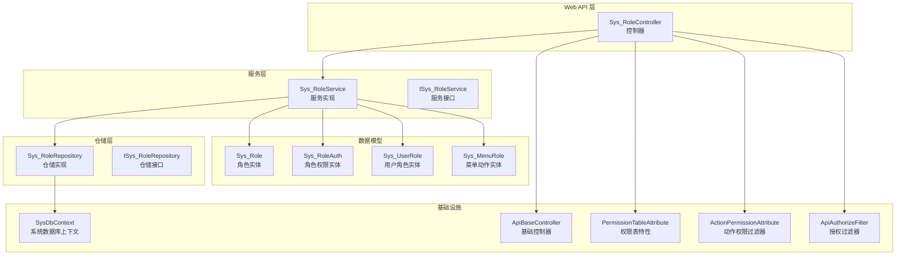
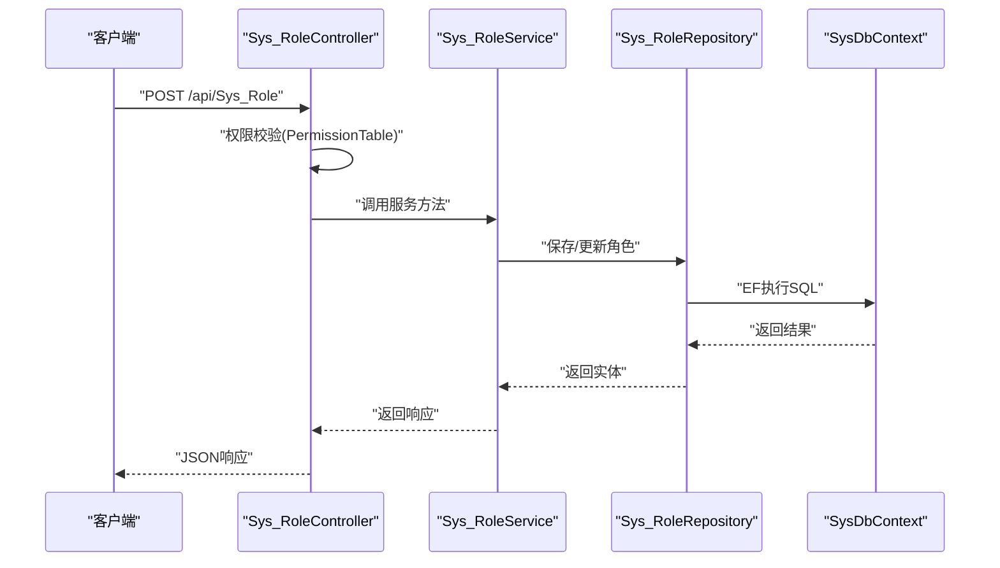
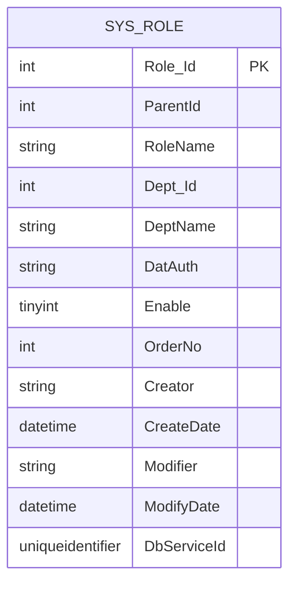
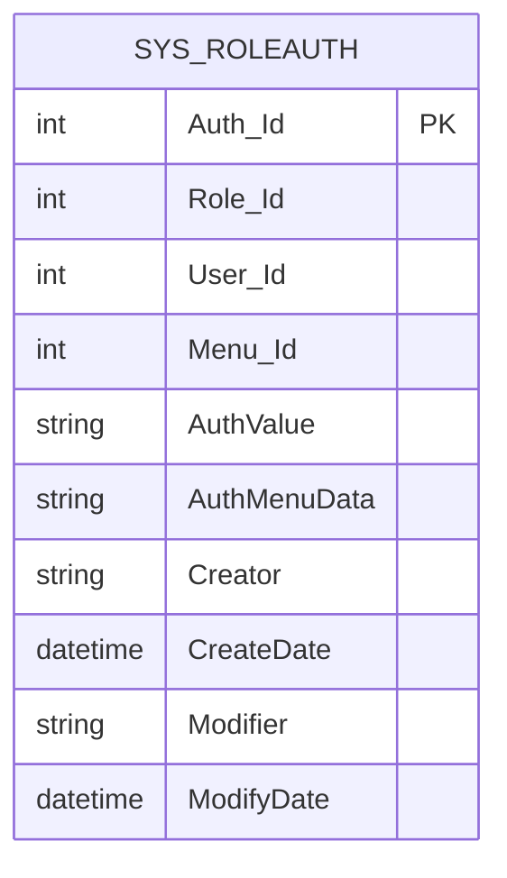
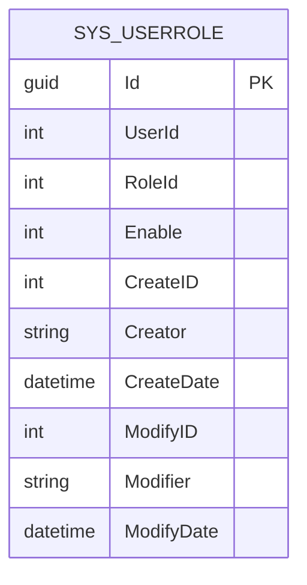
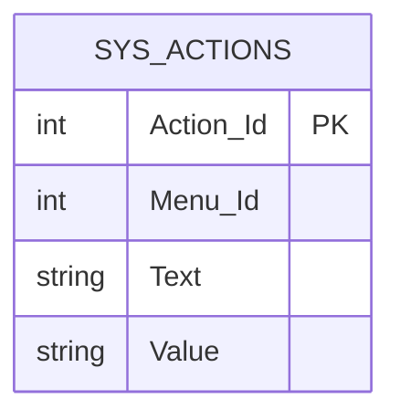
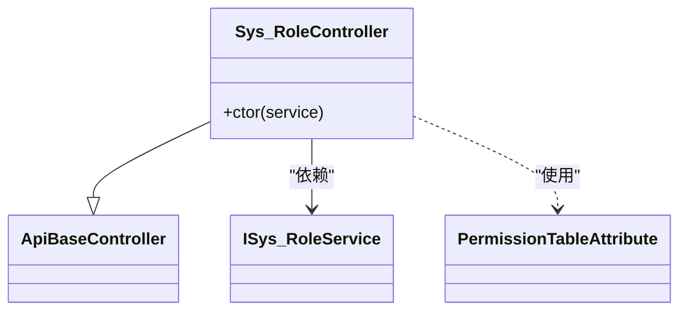
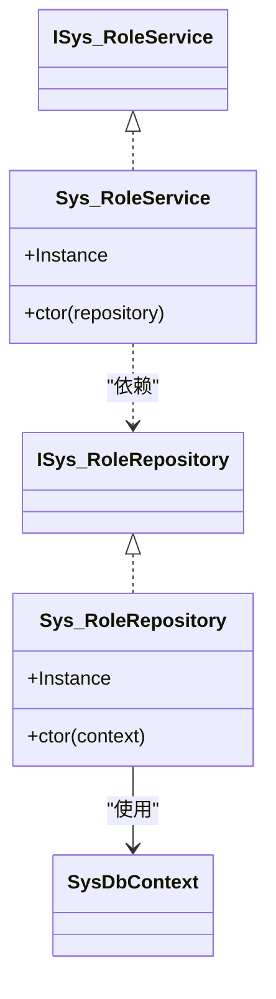
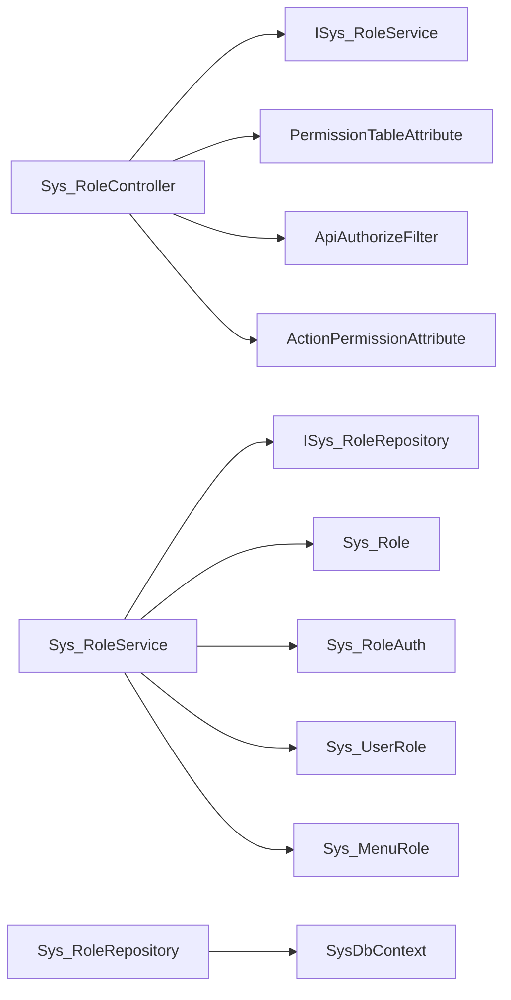

# 角色权限API

<cite>
**本文引用的文件**
- [Sys_RoleController.cs](file://VolPro.WebApi/Controllers/Sys/Sys_RoleController.cs)
- [Sys_Role.cs](file://VolPro.Entity/DomainModels/System/Sys_Role.cs)
- [Sys_RoleAuth.cs](file://VolPro.Entity/DomainModels/System/Sys_RoleAuth.cs)
- [Sys_UserRole.cs](file://VolPro.Entity/DomainModels/System/Sys_UserRole.cs)
- [Sys_MenuRole.cs](file://VolPro.Entity/DomainModels/System/Sys_MenuRole.cs)
- [ISys_RoleService.cs](file://VolPro.Sys/IServices/System/ISys_RoleService.cs)
- [Sys_RoleService.cs](file://VolPro.Sys/Services/System/Sys_RoleService.cs)
- [ISys_RoleRepository.cs](file://VolPro.Sys/IRepositories/System/ISys_RoleRepository.cs)
- [Sys_RoleRepository.cs](file://VolPro.Sys/Repositories/System/Sys_RoleRepository.cs)
- [ApiBaseController.cs](file://VolPro.Core/Controllers/Basic/ApiBaseController.cs)
- [PermissionTableAttribute.cs](file://VolPro.Entity/AttributeManager/PermissionTableAttribute.cs)
- [ActionPermissionAttribute.cs](file://VolPro.Core/Filters/ActionPermissionAttribute.cs)
- [ApiAuthorizeFilter.cs](file://VolPro.Core/Filters/ApiAuthorizeFilter.cs)
- [SysDbContext.cs](file://VolPro.Core/EFDbContext/SysDbContext.cs)
</cite>

## 目录
1. [简介](#简介)
2. [项目结构](#项目结构)
3. [核心组件](#核心组件)
4. [架构总览](#架构总览)
5. [详细组件分析](#详细组件分析)
6. [依赖关系分析](#依赖关系分析)
7. [性能考虑](#性能考虑)
8. [故障排除指南](#故障排除指南)
9. [结论](#结论)
10. [附录](#附录)

## 简介
本文件面向角色权限管理模块的API接口文档，聚焦于角色创建、权限分配、角色用户管理与角色状态控制等能力。基于现有代码库中的实体模型与控制器实现，梳理出角色基本信息管理（角色表）、角色权限配置（角色菜单权限与数据权限）、角色用户关联（用户-角色映射）以及角色层级管理（父子关系）等核心功能，并给出各API的参数说明、权限验证规则、业务约束与安全机制说明。同时提供请求/响应示例路径与最佳实践建议。

## 项目结构
角色权限模块采用分层架构组织，主要涉及Web API控制器、服务层、仓储层与领域模型四部分，配合权限过滤器与基础控制器完成统一的权限校验与CRUD操作。

**图表来源**
- [Sys_RoleController.cs:14-23](file://VolPro.WebApi/Controllers/Sys/Sys_RoleController.cs#L14-L23)
- [Sys_RoleService.cs:15-26](file://VolPro.Sys/Services/System/Sys_RoleService.cs#L15-L26)
- [Sys_RoleRepository.cs:15-26](file://VolPro.Sys/Repositories/System/Sys_RoleRepository.cs#L15-L26)
- [Sys_Role.cs:18-141](file://VolPro.Entity/DomainModels/System/Sys_Role.cs#L18-L141)
- [Sys_RoleAuth.cs:14-98](file://VolPro.Entity/DomainModels/System/Sys_RoleAuth.cs#L14-L98)
- [Sys_UserRole.cs:17-109](file://VolPro.Entity/DomainModels/System/Sys_UserRole.cs#L17-L109)
- [Sys_MenuRole.cs:6-16](file://VolPro.Entity/DomainModels/System/Sys_MenuRole.cs#L6-L16)
- [ApiBaseController.cs](file://VolPro.Core/Controllers/Basic/ApiBaseController.cs)
- [PermissionTableAttribute.cs](file://VolPro.Entity/AttributeManager/PermissionTableAttribute.cs)
- [ActionPermissionAttribute.cs](file://VolPro.Core/Filters/ActionPermissionAttribute.cs)
- [ApiAuthorizeFilter.cs](file://VolPro.Core/Filters/ApiAuthorizeFilter.cs)
- [SysDbContext.cs](file://VolPro.Core/EFDbContext/SysDbContext.cs)

**章节来源**
- [Sys_RoleController.cs:14-23](file://VolPro.WebApi/Controllers/Sys/Sys_RoleController.cs#L14-L23)
- [Sys_RoleService.cs:15-26](file://VolPro.Sys/Services/System/Sys_RoleService.cs#L15-L26)
- [Sys_RoleRepository.cs:15-26](file://VolPro.Sys/Repositories/System/Sys_RoleRepository.cs#L15-L26)
- [Sys_Role.cs:18-141](file://VolPro.Entity/DomainModels/System/Sys_Role.cs#L18-L141)

## 核心组件
- 角色实体：Sys_Role，承载角色基本信息（角色ID、父级ID、角色名称、部门信息、启用状态、排序、创建/修改信息等），支持角色层级管理与多租户标识。
- 角色权限实体：Sys_RoleAuth，承载角色对菜单的权限值与菜单数据权限字符串，支持细粒度权限控制。
- 用户角色实体：Sys_UserRole，承载用户与角色的关联关系及启用状态，用于角色用户管理。
- 菜单动作实体：Sys_MenuRole，承载菜单与动作的映射（动作枚举），用于权限动作维度控制。
- 控制器：Sys_RoleController，基于ApiBaseController，通过PermissionTable特性声明权限表，提供角色管理的REST接口入口。
- 服务层：ISys_RoleService/Sys_RoleService，封装角色业务逻辑，依赖仓储进行数据访问。
- 仓储层：ISys_RoleRepository/Sys_RoleRepository，基于EF DbContext进行Sys_Role相关数据操作。
- 权限过滤器：ActionPermissionAttribute、ApiAuthorizeFilter与PermissionTableAttribute，负责接口级权限校验与拦截。

**章节来源**
- [Sys_Role.cs:18-141](file://VolPro.Entity/DomainModels/System/Sys_Role.cs#L18-L141)
- [Sys_RoleAuth.cs:14-98](file://VolPro.Entity/DomainModels/System/Sys_RoleAuth.cs#L14-L98)
- [Sys_UserRole.cs:17-109](file://VolPro.Entity/DomainModels/System/Sys_UserRole.cs#L17-L109)
- [Sys_MenuRole.cs:6-16](file://VolPro.Entity/DomainModels/System/Sys_MenuRole.cs#L6-L16)
- [Sys_RoleController.cs:14-23](file://VolPro.WebApi/Controllers/Sys/Sys_RoleController.cs#L14-L23)
- [ISys_RoleService.cs:12-14](file://VolPro.Sys/IServices/System/ISys_RoleService.cs#L12-L14)
- [Sys_RoleService.cs:15-26](file://VolPro.Sys/Services/System/Sys_RoleService.cs#L15-L26)
- [ISys_RoleRepository.cs:15-17](file://VolPro.Sys/IRepositories/System/ISys_RoleRepository.cs#L15-L17)
- [Sys_RoleRepository.cs:15-26](file://VolPro.Sys/Repositories/System/Sys_RoleRepository.cs#L15-L26)
- [ActionPermissionAttribute.cs](file://VolPro.Core/Filters/ActionPermissionAttribute.cs)
- [ApiAuthorizeFilter.cs](file://VolPro.Core/Filters/ApiAuthorizeFilter.cs)
- [PermissionTableAttribute.cs](file://VolPro.Entity/AttributeManager/PermissionTableAttribute.cs)

## 架构总览
角色权限管理遵循“控制器-服务-仓储-实体”的分层设计，控制器通过基础控制器与权限特性完成统一入口与权限声明；服务层聚合业务规则；仓储层负责数据持久化；实体模型描述角色、权限与用户关联关系。

**图表来源**
- [Sys_RoleController.cs:14-23](file://VolPro.WebApi/Controllers/Sys/Sys_RoleController.cs#L14-L23)
- [Sys_RoleService.cs:15-26](file://VolPro.Sys/Services/System/Sys_RoleService.cs#L15-L26)
- [Sys_RoleRepository.cs:15-26](file://VolPro.Sys/Repositories/System/Sys_RoleRepository.cs#L15-L26)
- [SysDbContext.cs](file://VolPro.Core/EFDbContext/SysDbContext.cs)

## 详细组件分析

### 角色实体模型（Sys_Role）
- 关键字段
  - 角色ID：主键，整型
  - 父级ID：整型，用于角色层级
  - 角色名称：长度限制，字符串
  - 部门ID/名称：可空，整型与字符串
  - 数据库权限：字符串，长度限制
  - 启用状态：字节类型，0/1或空
  - 排序：整型
  - 创建/修改信息：字符串与日期时间
  - 所属数据库：GUID，支持多租户
- 复杂度与性能
  - 基于SqlSugar的实体映射，查询与更新按主键与条件组合进行，索引建议围绕ParentId、Dept_Id、Enable建立
- 业务约束
  - 角色名称唯一性需在服务层或数据库层面保证
  - 父级ID应指向有效角色，避免环形层级
  - Enable为0/1或空，表示禁用/启用/未设置

**图表来源**
- [Sys_Role.cs:18-141](file://VolPro.Entity/DomainModels/System/Sys_Role.cs#L18-L141)

**章节来源**
- [Sys_Role.cs:18-141](file://VolPro.Entity/DomainModels/System/Sys_Role.cs#L18-L141)

### 角色权限实体模型（Sys_RoleAuth）
- 关键字段
  - 权限ID：主键
  - 角色ID：可空
  - 用户ID：可空
  - 菜单ID：必填
  - 权限值：必填，字符串，长度限制
  - 菜单数据权限：可空，字符串，长度限制
  - 创建/修改信息：字符串与日期时间
- 业务逻辑
  - 支持角色级与用户级权限叠加，优先级由业务规则决定
  - 权限值与数据权限共同决定菜单项的可见性与可操作性

**图表来源**
- [Sys_RoleAuth.cs:14-98](file://VolPro.Entity/DomainModels/System/Sys_RoleAuth.cs#L14-L98)

**章节来源**
- [Sys_RoleAuth.cs:14-98](file://VolPro.Entity/DomainModels/System/Sys_RoleAuth.cs#L14-L98)

### 用户角色实体模型（Sys_UserRole）
- 关键字段
  - 主键：GUID
  - 用户ID：整型
  - 角色ID：整型
  - 启用状态：整型（0/1）
  - 创建/修改信息：整型与字符串、日期时间
- 业务逻辑
  - 一个用户可拥有多个角色，启用状态控制是否生效
  - 与Sys_RoleAuth配合实现角色权限继承与动态权限控制

**图表来源**
- [Sys_UserRole.cs:17-109](file://VolPro.Entity/DomainModels/System/Sys_UserRole.cs#L17-L109)

**章节来源**
- [Sys_UserRole.cs:17-109](file://VolPro.Entity/DomainModels/System/Sys_UserRole.cs#L17-L109)

### 菜单动作实体模型（Sys_MenuRole）
- 关键字段
  - 动作ID：主键
  - 菜单ID：整型
  - 文本/值：字符串
- 业务逻辑
  - 定义菜单可用的动作集合，配合权限值进行细粒度控制

**图表来源**
- [Sys_MenuRole.cs:8-16](file://VolPro.Entity/DomainModels/System/Sys_MenuRole.cs#L8-L16)

**章节来源**
- [Sys_MenuRole.cs:8-16](file://VolPro.Entity/DomainModels/System/Sys_MenuRole.cs#L8-L16)

### 控制器与权限特性（Sys_RoleController）
- 路由与权限声明
  - 路由：/api/Sys_Role
  - 权限表特性：PermissionTable(Name="Sys_Role")，用于接口级权限校验
- 继承与依赖
  - 继承ApiBaseController，复用统一的响应格式与日志
  - 依赖ISys_RoleService，通过构造注入提供业务能力

**图表来源**
- [Sys_RoleController.cs:14-23](file://VolPro.WebApi/Controllers/Sys/Sys_RoleController.cs#L14-L23)
- [ApiBaseController.cs](file://VolPro.Core/Controllers/Basic/ApiBaseController.cs)
- [PermissionTableAttribute.cs](file://VolPro.Entity/AttributeManager/PermissionTableAttribute.cs)

**章节来源**
- [Sys_RoleController.cs:14-23](file://VolPro.WebApi/Controllers/Sys/Sys_RoleController.cs#L14-L23)

### 服务与仓储（ISys_RoleService/Sys_RoleService）
- 服务职责
  - 封装角色管理业务逻辑，协调仓储与实体
  - 提供实例化入口，便于依赖注入
- 仓储职责
  - 基于EF DbContext进行Sys_Role的增删改查
  - 通过SysDbContext访问系统数据库

**图表来源**
- [ISys_RoleService.cs:12-14](file://VolPro.Sys/IServices/System/ISys_RoleService.cs#L12-L14)
- [Sys_RoleService.cs:15-26](file://VolPro.Sys/Services/System/Sys_RoleService.cs#L15-L26)
- [ISys_RoleRepository.cs:15-17](file://VolPro.Sys/IRepositories/System/ISys_RoleRepository.cs#L15-L17)
- [Sys_RoleRepository.cs:15-26](file://VolPro.Sys/Repositories/System/Sys_RoleRepository.cs#L15-L26)
- [SysDbContext.cs](file://VolPro.Core/EFDbContext/SysDbContext.cs)

**章节来源**
- [ISys_RoleService.cs:12-14](file://VolPro.Sys/IServices/System/ISys_RoleService.cs#L12-L14)
- [Sys_RoleService.cs:15-26](file://VolPro.Sys/Services/System/Sys_RoleService.cs#L15-L26)
- [ISys_RoleRepository.cs:15-17](file://VolPro.Sys/IRepositories/System/ISys_RoleRepository.cs#L15-L17)
- [Sys_RoleRepository.cs:15-26](file://VolPro.Sys/Repositories/System/Sys_RoleRepository.cs#L15-L26)

## 依赖关系分析
- 控制器依赖服务接口，服务依赖仓储接口，仓储依赖EF DbContext，形成清晰的依赖方向
- 权限过滤器贯穿控制器层，确保所有接口均受权限校验保护
- 实体模型作为数据契约，被服务与仓储共同使用

**图表来源**
- [Sys_RoleController.cs:14-23](file://VolPro.WebApi/Controllers/Sys/Sys_RoleController.cs#L14-L23)
- [Sys_RoleService.cs:15-26](file://VolPro.Sys/Services/System/Sys_RoleService.cs#L15-L26)
- [Sys_RoleRepository.cs:15-26](file://VolPro.Sys/Repositories/System/Sys_RoleRepository.cs#L15-L26)
- [Sys_Role.cs:18-141](file://VolPro.Entity/DomainModels/System/Sys_Role.cs#L18-L141)
- [Sys_RoleAuth.cs:14-98](file://VolPro.Entity/DomainModels/System/Sys_RoleAuth.cs#L14-L98)
- [Sys_UserRole.cs:17-109](file://VolPro.Entity/DomainModels/System/Sys_UserRole.cs#L17-L109)
- [Sys_MenuRole.cs:6-16](file://VolPro.Entity/DomainModels/System/Sys_MenuRole.cs#L6-L16)
- [PermissionTableAttribute.cs](file://VolPro.Entity/AttributeManager/PermissionTableAttribute.cs)
- [ApiAuthorizeFilter.cs](file://VolPro.Core/Filters/ApiAuthorizeFilter.cs)
- [ActionPermissionAttribute.cs](file://VolPro.Core/Filters/ActionPermissionAttribute.cs)

**章节来源**
- [Sys_RoleController.cs:14-23](file://VolPro.WebApi/Controllers/Sys/Sys_RoleController.cs#L14-L23)
- [Sys_RoleService.cs:15-26](file://VolPro.Sys/Services/System/Sys_RoleService.cs#L15-L26)
- [Sys_RoleRepository.cs:15-26](file://VolPro.Sys/Repositories/System/Sys_RoleRepository.cs#L15-L26)

## 性能考虑
- 索引优化：建议在Sys_Role的ParentId、Dept_Id、Enable上建立索引以提升层级查询与筛选性能
- 查询优化：服务层尽量使用投影查询，避免一次性加载大字段（如DatAuth）
- 缓存策略：角色与权限配置可引入缓存，结合变更事件失效，降低数据库压力
- 批量操作：批量分配角色或权限时，采用事务与批量插入/更新，减少往返次数

## 故障排除指南
- 权限不足
  - 现象：接口返回未授权或被拒绝
  - 排查：确认PermissionTable特性与ActionPermissionAttribute是否正确配置，检查ApiAuthorizeFilter链路
- 数据异常
  - 现象：角色层级循环、重复角色名、无效父级ID
  - 排查：在服务层增加校验逻辑，确保ParentId有效且不形成环
- 数据一致性
  - 现象：用户角色与权限不一致
  - 排查：检查Sys_UserRole与Sys_RoleAuth的关联与启用状态，确保权限计算顺序明确

**章节来源**
- [ActionPermissionAttribute.cs](file://VolPro.Core/Filters/ActionPermissionAttribute.cs)
- [ApiAuthorizeFilter.cs](file://VolPro.Core/Filters/ApiAuthorizeFilter.cs)
- [Sys_Role.cs:18-141](file://VolPro.Entity/DomainModels/System/Sys_Role.cs#L18-L141)
- [Sys_UserRole.cs:17-109](file://VolPro.Entity/DomainModels/System/Sys_UserRole.cs#L17-L109)
- [Sys_RoleAuth.cs:14-98](file://VolPro.Entity/DomainModels/System/Sys_RoleAuth.cs#L14-L98)

## 结论
本角色权限模块通过清晰的分层架构与实体模型，提供了角色基本信息管理、角色权限配置、角色用户关联与角色层级管理的基础能力。结合权限过滤器与基础控制器，实现了统一的权限校验与响应格式。建议在生产环境中进一步完善索引、缓存与批量操作策略，并在服务层加强输入校验与业务规则约束，以保障系统的稳定性与安全性。

## 附录

### API端点与规范

- 基础路由
  - 前缀：/api/Sys_Role
  - 控制器：Sys_RoleController
  - 权限表：Sys_Role

- 角色基本信息管理
  - 描述：提供角色的创建、更新、删除、查询与分页列表
  - 参数：角色实体字段（角色ID、父级ID、角色名称、部门信息、启用状态、排序、创建/修改信息等）
  - 权限验证：基于PermissionTable特性与ApiAuthorizeFilter
  - 业务约束：角色名称唯一；父级ID必须有效；Enable为0/1或空
  - 请求/响应示例路径：
    - [请求示例:14-23](file://VolPro.WebApi/Controllers/Sys/Sys_RoleController.cs#L14-L23)
    - [响应示例](file://VolPro.Core/Controllers/Basic/ApiBaseController.cs)

- 角色权限配置
  - 描述：为角色配置菜单权限与菜单数据权限
  - 参数：角色ID、菜单ID、权限值、菜单数据权限
  - 权限验证：同上
  - 业务约束：权限值与数据权限共同决定菜单项的可见性与可操作性
  - 请求/响应示例路径：
    - [请求示例:14-98](file://VolPro.Entity/DomainModels/System/Sys_RoleAuth.cs#L14-L98)
    - [响应示例](file://VolPro.Core/Controllers/Basic/ApiBaseController.cs)

- 角色用户管理
  - 描述：为用户分配角色或取消角色，控制启用状态
  - 参数：用户ID、角色ID、启用状态
  - 权限验证：同上
  - 业务约束：用户可拥有多个角色，启用状态控制生效
  - 请求/响应示例路径：
    - [请求示例:17-109](file://VolPro.Entity/DomainModels/System/Sys_UserRole.cs#L17-L109)
    - [响应示例](file://VolPro.Core/Controllers/Basic/ApiBaseController.cs)

- 角色状态控制
  - 描述：启用/禁用角色，影响权限生效范围
  - 参数：角色ID、启用状态
  - 权限验证：同上
  - 业务约束：Enable为0/1或空，0表示禁用，1表示启用
  - 请求/响应示例路径：
    - [请求示例:74-80](file://VolPro.Entity/DomainModels/System/Sys_Role.cs#L74-L80)
    - [响应示例](file://VolPro.Core/Controllers/Basic/ApiBaseController.cs)

- 角色层级管理
  - 描述：通过父级ID构建角色层级，支持权限继承
  - 参数：角色ID、父级ID
  - 权限验证：同上
  - 业务约束：父级ID必须指向有效角色，避免环形层级
  - 请求/响应示例路径：
    - [请求示例:31-38](file://VolPro.Entity/DomainModels/System/Sys_Role.cs#L31-L38)
    - [响应示例](file://VolPro.Core/Controllers/Basic/ApiBaseController.cs)

- 权限验证策略与安全机制
  - 权限表特性：PermissionTable用于声明接口权限表
  - 授权过滤器：ApiAuthorizeFilter统一处理JWT与权限校验
  - 动作权限：ActionPermissionAttribute细化到具体动作
  - 安全建议：敏感字段（如删除标记）避免序列化输出；对输入参数进行严格校验与白名单控制

**章节来源**
- [Sys_RoleController.cs:14-23](file://VolPro.WebApi/Controllers/Sys/Sys_RoleController.cs#L14-L23)
- [Sys_Role.cs:18-141](file://VolPro.Entity/DomainModels/System/Sys_Role.cs#L18-L141)
- [Sys_RoleAuth.cs:14-98](file://VolPro.Entity/DomainModels/System/Sys_RoleAuth.cs#L14-L98)
- [Sys_UserRole.cs:17-109](file://VolPro.Entity/DomainModels/System/Sys_UserRole.cs#L17-L109)
- [PermissionTableAttribute.cs](file://VolPro.Entity/AttributeManager/PermissionTableAttribute.cs)
- [ApiAuthorizeFilter.cs](file://VolPro.Core/Filters/ApiAuthorizeFilter.cs)
- [ActionPermissionAttribute.cs](file://VolPro.Core/Filters/ActionPermissionAttribute.cs)
- [ApiBaseController.cs](file://VolPro.Core/Controllers/Basic/ApiBaseController.cs)