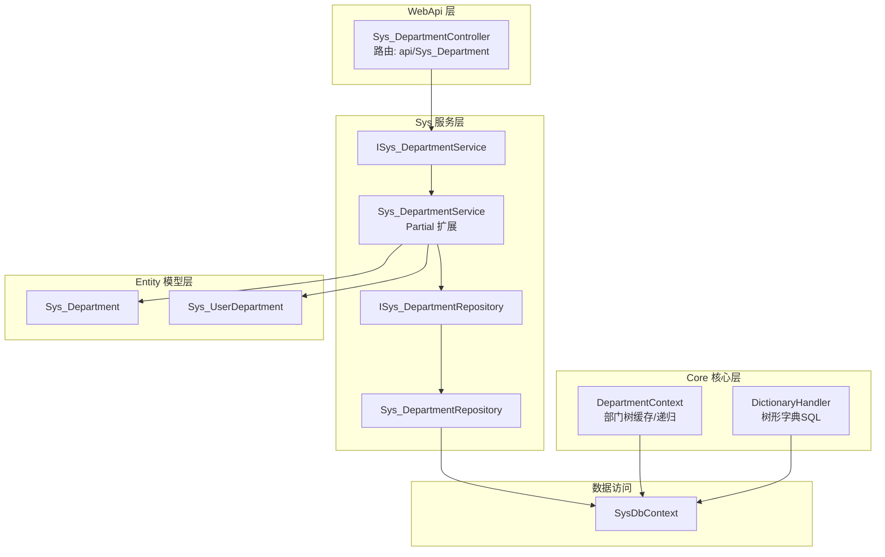
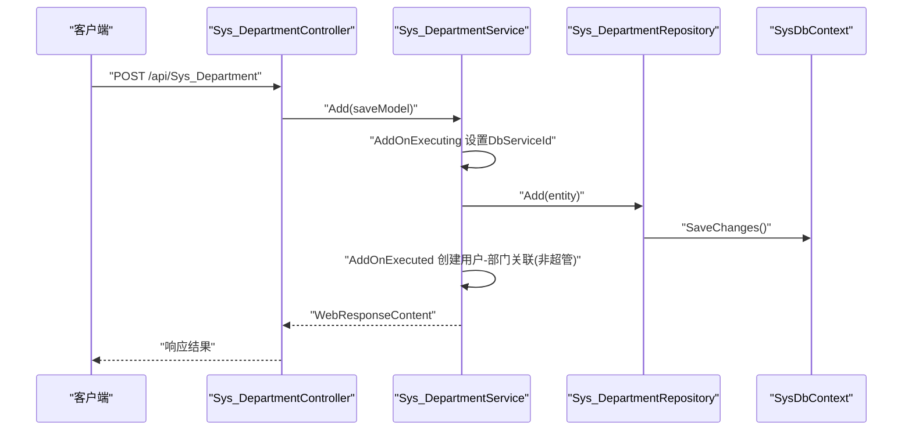
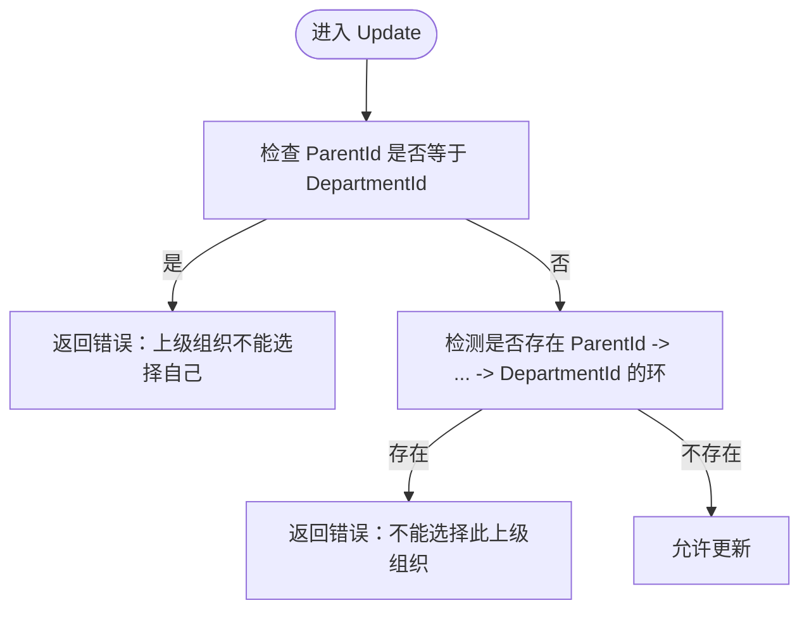
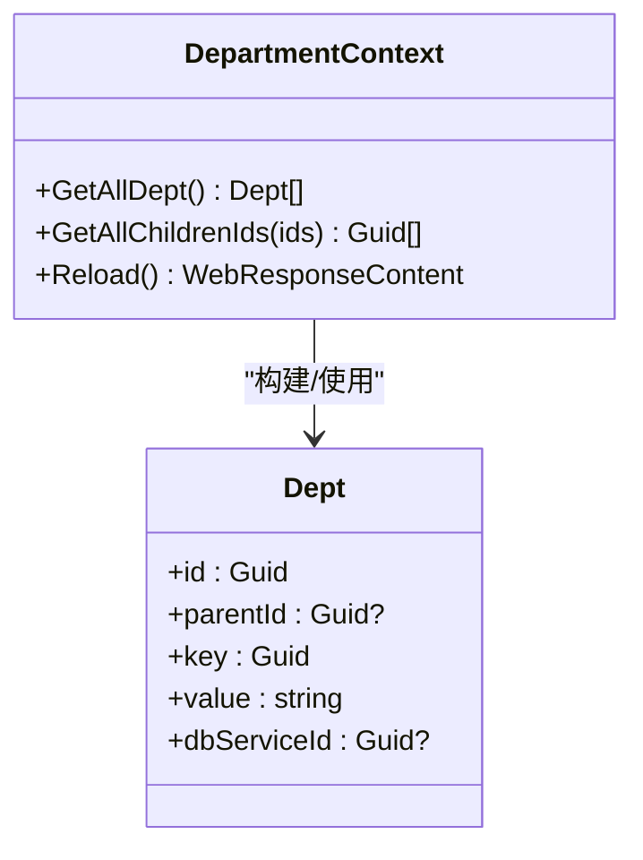
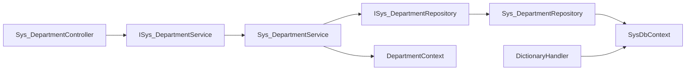

# 部门组织API

<cite>
**本文引用的文件**
- [Sys_DepartmentController.cs](file://VolPro.WebApi/Controllers/Sys/Sys_DepartmentController.cs)
- [Sys_Department.cs](file://VolPro.Entity/DomainModels/System/Sys_Department.cs)
- [ISys_DepartmentService.cs](file://VolPro.Sys/IServices/System/ISys_DepartmentService.cs)
- [Sys_DepartmentService.cs](file://VolPro.Sys/Services/System/Sys_DepartmentService.cs)
- [Partial.Sys_DepartmentService.cs](file://VolPro.Sys/Services/System/Partial/Sys_DepartmentService.cs)
- [ISys_DepartmentRepository.cs](file://VolPro.Sys/IRepositories/System/ISys_DepartmentRepository.cs)
- [Sys_DepartmentRepository.cs](file://VolPro.Sys/Repositories/System/Sys_DepartmentRepository.cs)
- [DepartmentContext.cs](file://VolPro.Core/UserManager/DepartmentContext.cs)
- [DictionaryHandler.cs](file://VolPro.Core/Infrastructure/DictionaryHandler.cs)
- [Sys_UserDepartment.cs](file://VolPro.Entity/DomainModels/System/Sys_UserDepartment.cs)
- [Sys_UserRepository.cs](file://VolPro.Sys/Repositories/System/Sys_UserRepository.cs)
</cite>

## 目录
1. [简介](#简介)
2. [项目结构](#项目结构)
3. [核心组件](#核心组件)
4. [架构总览](#架构总览)
5. [详细组件分析](#详细组件分析)
6. [依赖分析](#依赖分析)
7. [性能考虑](#性能考虑)
8. [故障排查指南](#故障排查指南)
9. [结论](#结论)
10. [附录](#附录)

## 简介
本文件面向“部门组织管理”模块的API接口文档，聚焦以下能力：
- 部门创建与删除
- 组织架构树形管理（父子层级、树查询）
- 部门基本信息维护（名称、编号、类型、启用状态、备注等）
- 部门负责人与人员配置（通过用户-部门关联模型实现）
- 部门层级关系校验与安全控制（基于用户上下文与缓存的部门树）

该模块采用分层架构：控制器负责HTTP入口与权限标注；服务层封装业务逻辑与数据过滤；仓储层负责数据持久化；实体模型承载表结构与元数据。

## 项目结构
围绕部门组织的核心文件分布如下：
- 控制器：Sys_DepartmentController
- 服务接口与实现：ISys_DepartmentService、Sys_DepartmentService（含Partial扩展）
- 仓储接口与实现：ISys_DepartmentRepository、Sys_DepartmentRepository
- 实体模型：Sys_Department、Sys_UserDepartment
- 用户上下文与部门树：DepartmentContext
- 字典/树形数据源：DictionaryHandler
- 用户仓储：Sys_UserRepository

图表来源
- [Sys_DepartmentController.cs:11-13](file://VolPro.WebApi/Controllers/Sys/Sys_DepartmentController.cs#L11-L13)
- [ISys_DepartmentService.cs:9-9](file://VolPro.Sys/IServices/System/ISys_DepartmentService.cs#L9-L9)
- [Sys_DepartmentService.cs:15-26](file://VolPro.Sys/Services/System/Sys_DepartmentService.cs#L15-L26)
- [ISys_DepartmentRepository.cs:15-15](file://VolPro.Sys/IRepositories/System/ISys_DepartmentRepository.cs#L15-L15)
- [Sys_DepartmentRepository.cs:13-22](file://VolPro.Sys/Repositories/System/Sys_DepartmentRepository.cs#L13-L22)
- [Sys_Department.cs:17-18](file://VolPro.Entity/DomainModels/System/Sys_Department.cs#L17-L18)
- [DepartmentContext.cs:41-78](file://VolPro.Core/UserManager/DepartmentContext.cs#L41-L78)
- [DictionaryHandler.cs:121-129](file://VolPro.Core/Infrastructure/DictionaryHandler.cs#L121-L129)

章节来源
- [Sys_DepartmentController.cs:11-13](file://VolPro.WebApi/Controllers/Sys/Sys_DepartmentController.cs#L11-L13)
- [Sys_Department.cs:17-18](file://VolPro.Entity/DomainModels/System/Sys_Department.cs#L17-L18)

## 核心组件
- 控制器：Sys_DepartmentController
  - 路由：api/Sys_Department
  - 权限标注：PermissionTable(Name = "Sys_Department")
  - 基于ApiBaseController<ISys_DepartmentService>，继承通用CRUD能力
- 服务层：
  - ISys_DepartmentService：服务接口
  - Sys_DepartmentService：基础服务实现，Partial中扩展业务逻辑（如数据过滤、新增后处理、更新校验、删除处理）
- 仓储层：
  - ISys_DepartmentRepository：仓储接口
  - Sys_DepartmentRepository：EF仓储实现
- 实体模型：
  - Sys_Department：部门实体（主键DepartmentId、名称、父节点ParentId、编号、类型、启用、备注、创建/修改信息、DbServiceId等）
  - Sys_UserDepartment：用户-部门关联实体（用于部门负责人与人员配置）
- 用户上下文与部门树：
  - DepartmentContext：加载部门树、递归获取子部门ID、缓存失效与重载

章节来源
- [Sys_DepartmentController.cs:11-13](file://VolPro.WebApi/Controllers/Sys/Sys_DepartmentController.cs#L11-L13)
- [ISys_DepartmentService.cs:9-9](file://VolPro.Sys/IServices/System/ISys_DepartmentService.cs#L9-L9)
- [Sys_DepartmentService.cs:15-26](file://VolPro.Sys/Services/System/Sys_DepartmentService.cs#L15-L26)
- [Sys_Department.cs:17-143](file://VolPro.Entity/DomainModels/System/Sys_Department.cs#L17-L143)
- [Sys_UserDepartment.cs](file://VolPro.Entity/DomainModels/System/Sys_UserDepartment.cs)
- [DepartmentContext.cs:41-115](file://VolPro.Core/UserManager/DepartmentContext.cs#L41-L115)

## 架构总览
部门组织API遵循典型的分层架构，控制器负责HTTP协议与权限控制，服务层封装业务规则与数据过滤，仓储层抽象数据访问，实体模型映射数据库表。

图表来源
- [Sys_DepartmentController.cs:11-13](file://VolPro.WebApi/Controllers/Sys/Sys_DepartmentController.cs#L11-L13)
- [Partial.Sys_DepartmentService.cs:75-116](file://VolPro.Sys/Services/System/Partial/Sys_DepartmentService.cs#L75-L116)
- [Sys_DepartmentRepository.cs:13-22](file://VolPro.Sys/Repositories/System/Sys_DepartmentRepository.cs#L13-L22)

## 详细组件分析

### 控制器：Sys_DepartmentController
- 路由：api/Sys_Department
- 权限注解：PermissionTable(Name = "Sys_Department")，用于权限拦截与菜单绑定
- 继承ApiBaseController<ISys_DepartmentService>，天然具备增删改查、分页、导入导出等通用能力

章节来源
- [Sys_DepartmentController.cs:11-13](file://VolPro.WebApi/Controllers/Sys/Sys_DepartmentController.cs#L11-L13)

### 服务层：Sys_DepartmentService（业务逻辑与安全）
- 数据过滤（分页/导出）：通过QueryRelativeExpression限制仅可见“本人部门及其下级”
- 新增（Add）：
  - AddOnExecuting：设置DbServiceId（服务实例ID），确保多租户隔离
  - AddOnExecuted：非超级管理员创建根部门时，自动建立“用户-部门”关联，并刷新用户上下文
- 更新（Update）：
  - 校验：禁止父节点为自身；禁止形成循环父子关系（检测ParentId链路）
- 删除（Del）：透传基类能力，返回Reload以清除部门树缓存

图表来源
- [Partial.Sys_DepartmentService.cs:117-136](file://VolPro.Sys/Services/System/Partial/Sys_DepartmentService.cs#L117-L136)

章节来源
- [Partial.Sys_DepartmentService.cs:49-72](file://VolPro.Sys/Services/System/Partial/Sys_DepartmentService.cs#L49-L72)
- [Partial.Sys_DepartmentService.cs:75-116](file://VolPro.Sys/Services/System/Partial/Sys_DepartmentService.cs#L75-L116)
- [Partial.Sys_DepartmentService.cs:117-136](file://VolPro.Sys/Services/System/Partial/Sys_DepartmentService.cs#L117-L136)

### 仓储层：Sys_DepartmentRepository
- 基于EF DbContext的仓储实现，提供标准CRUD与查询能力
- 通过Autofac容器注入，支持服务层调用

章节来源
- [Sys_DepartmentRepository.cs:13-22](file://VolPro.Sys/Repositories/System/Sys_DepartmentRepository.cs#L13-L22)

### 实体模型：Sys_Department
- 主键：DepartmentId（唯一标识）
- 名称：DepartmentName（必填，最大长度200）
- 上级组织：ParentId（可空，指向父部门）
- 编号：DepartmentCode（最大长度50）
- 类型：DepartmentType（最大长度50）
- 启用：Enable（整数，0/1或空）
- 备注：Remark（最大长度500）
- 创建信息：CreateID、Creator、CreateDate
- 修改信息：ModifyID、Modifier、ModifyDate
- 多租户：DbServiceId（所属服务实例）

章节来源
- [Sys_Department.cs:17-143](file://VolPro.Entity/DomainModels/System/Sys_Department.cs#L17-L143)

### 用户-部门关联：Sys_UserDepartment
- 用途：记录用户与部门的关联关系，支撑部门负责人与人员配置
- 关键字段：Id、UserId、DepartmentId、Enable、Creator、CreateDate等

章节来源
- [Sys_UserDepartment.cs](file://VolPro.Entity/DomainModels/System/Sys_UserDepartment.cs)

### 部门树与缓存：DepartmentContext
- 加载全量部门树：Dept(id/key/value/parentId/dbServiceId)
- 递归获取子部门ID：GetAllChildrenIds(ids)
- 缓存版本：通过内部版本号与缓存键联动，变更后自动失效并重建
- 重载：WebResponseContent.Reload触发缓存清理与重建

图表来源
- [DepartmentContext.cs:41-115](file://VolPro.Core/UserManager/DepartmentContext.cs#L41-L115)

章节来源
- [DepartmentContext.cs:41-115](file://VolPro.Core/UserManager/DepartmentContext.cs#L41-L115)

### 树形字典数据源：DictionaryHandler
- 提供部门树形字典SQL（不同数据库方言），用于前端树控件渲染
- 字段映射：id、key、parentId、value

章节来源
- [DictionaryHandler.cs:121-129](file://VolPro.Core/Infrastructure/DictionaryHandler.cs#L121-L129)

## 依赖分析
- 控制器依赖服务接口
- 服务实现依赖仓储接口与EF DbContext
- 服务层依赖用户上下文（UserContext）进行权限与数据范围控制
- 服务层依赖DepartmentContext进行部门树缓存与递归计算
- 字典/树形数据源依赖DictionaryHandler与DepartmentContext

图表来源
- [Sys_DepartmentController.cs:11-13](file://VolPro.WebApi/Controllers/Sys/Sys_DepartmentController.cs#L11-L13)
- [ISys_DepartmentService.cs:9-9](file://VolPro.Sys/IServices/System/ISys_DepartmentService.cs#L9-L9)
- [Sys_DepartmentService.cs:15-26](file://VolPro.Sys/Services/System/Sys_DepartmentService.cs#L15-L26)
- [ISys_DepartmentRepository.cs:15-15](file://VolPro.Sys/IRepositories/System/ISys_DepartmentRepository.cs#L15-L15)
- [Sys_DepartmentRepository.cs:13-22](file://VolPro.Sys/Repositories/System/Sys_DepartmentRepository.cs#L13-L22)
- [DictionaryHandler.cs:121-129](file://VolPro.Core/Infrastructure/DictionaryHandler.cs#L121-L129)

章节来源
- [Sys_DepartmentController.cs:11-13](file://VolPro.WebApi/Controllers/Sys/Sys_DepartmentController.cs#L11-L13)
- [Sys_DepartmentService.cs:15-26](file://VolPro.Sys/Services/System/Sys_DepartmentService.cs#L15-L26)
- [Sys_DepartmentRepository.cs:13-22](file://VolPro.Sys/Repositories/System/Sys_DepartmentRepository.cs#L13-L22)

## 性能考虑
- 部门树缓存：DepartmentContext使用缓存键与版本号，避免频繁查询数据库；写操作后通过Reload主动失效并重建
- 递归计算：GetAllChildrenIds采用迭代方式收集子节点，避免深度递归导致栈溢出
- 数据过滤：服务层在分页/导出前应用QueryRelativeExpression，减少无效数据传输
- 多租户隔离：新增时统一写入DbServiceId，避免跨服务数据泄露

[本节为通用指导，不涉及具体文件分析]

## 故障排查指南
- 新增失败：检查DbServiceId是否正确写入；确认非超管创建根部门时是否成功建立用户-部门关联
- 更新失败：若提示“上级组织不能选择自己”或“不能选择此上级组织”，需检查ParentId与现有层级关系
- 数据不可见：确认当前用户是否具备“本人部门及其下级”的数据范围；必要时刷新缓存
- 部门树异常：调用Reload后重试；检查缓存键与版本号一致性

章节来源
- [Partial.Sys_DepartmentService.cs:75-116](file://VolPro.Sys/Services/System/Partial/Sys_DepartmentService.cs#L75-L116)
- [Partial.Sys_DepartmentService.cs:117-136](file://VolPro.Sys/Services/System/Partial/Sys_DepartmentService.cs#L117-L136)
- [DepartmentContext.cs:107-115](file://VolPro.Core/UserManager/DepartmentContext.cs#L107-L115)

## 结论
本模块通过清晰的分层设计与完善的业务规则，实现了部门组织的创建、维护、树形管理与安全控制。服务层在新增后自动建立用户-部门关联，更新时严格校验层级关系，结合用户上下文与缓存机制，保障了数据范围与性能。建议在生产环境中配合权限系统与审计日志，进一步完善合规性与可追溯性。

[本节为总结性内容，不涉及具体文件分析]

## 附录

### API 端点与行为规范

- 路由前缀
  - /api/Sys_Department

- 权限注解
  - PermissionTable(Name = "Sys_Department")

- 通用行为
  - 新增：自动写入DbServiceId；非超管创建根部门时，自动建立用户-部门关联并刷新用户上下文
  - 更新：禁止自指与环形父子关系
  - 删除：透传删除，返回Reload以清理部门树缓存

- 参数与字段说明（来自实体模型）
  - DepartmentId：主键（Guid）
  - DepartmentName：名称（必填，最大200字符）
  - ParentId：上级组织（可空，指向父部门）
  - DepartmentCode：编号（最大50字符）
  - DepartmentType：类型（最大50字符）
  - Enable：启用状态（整数）
  - Remark：备注（最大500字符）
  - Creator/Modifier/CreateDate/ModifyDate：创建/修改信息
  - DbServiceId：所属服务实例（多租户隔离）

- 请求/响应示例（路径引用）
  - 新增请求示例：[新增流程片段:75-116](file://VolPro.Sys/Services/System/Partial/Sys_DepartmentService.cs#L75-L116)
  - 更新请求示例：[更新校验片段:117-136](file://VolPro.Sys/Services/System/Partial/Sys_DepartmentService.cs#L117-L136)
  - 删除请求示例：[删除流程片段:138-141](file://VolPro.Sys/Services/System/Partial/Sys_DepartmentService.cs#L138-L141)

- 组织架构验证规则与业务约束
  - 禁止自指：ParentId 不能等于 DepartmentId
  - 禁止环形父子：不能选择其后代作为上级
  - 数据范围：非超管仅可见“本人部门及其下级”
  - 多租户：新增默认写入当前服务实例ID

- 安全机制与层级权限控制
  - 用户上下文：UserContext.Current.IsSuperAdmin、GetAllChildrenDeptIds
  - 数据过滤：QueryRelativeExpression
  - 缓存失效：WebResponseContent.Reload 触发 DepartmentContext 清理与重建

- 最佳实践与管理建议
  - 部门树缓存：变更后务必调用Reload，确保前端树一致
  - 多租户：确保DbServiceId正确传递，避免跨租户数据访问
  - 权限最小化：非超管仅能维护自身与下级部门
  - 日志与审计：建议补充操作日志与变更审计

章节来源
- [Sys_DepartmentController.cs:11-13](file://VolPro.WebApi/Controllers/Sys/Sys_DepartmentController.cs#L11-L13)
- [Sys_Department.cs:17-143](file://VolPro.Entity/DomainModels/System/Sys_Department.cs#L17-L143)
- [Partial.Sys_DepartmentService.cs:49-72](file://VolPro.Sys/Services/System/Partial/Sys_DepartmentService.cs#L49-L72)
- [Partial.Sys_DepartmentService.cs:75-116](file://VolPro.Sys/Services/System/Partial/Sys_DepartmentService.cs#L75-L116)
- [Partial.Sys_DepartmentService.cs:117-136](file://VolPro.Sys/Services/System/Partial/Sys_DepartmentService.cs#L117-L136)
- [DepartmentContext.cs:41-115](file://VolPro.Core/UserManager/DepartmentContext.cs#L41-L115)