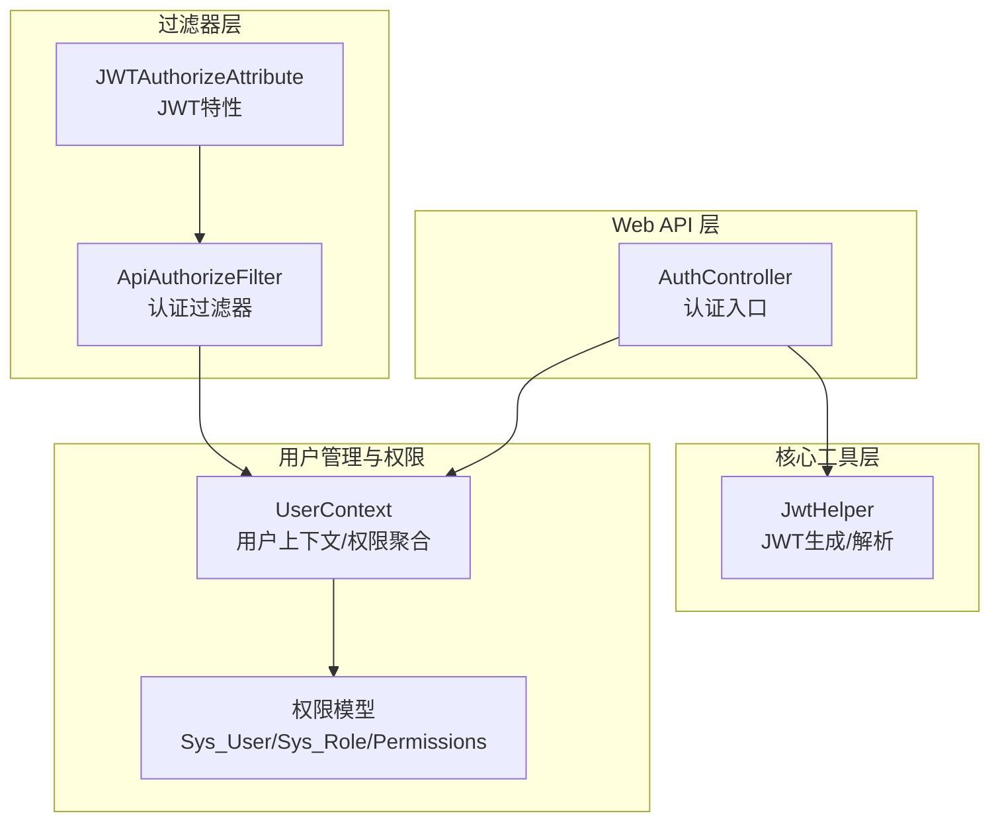
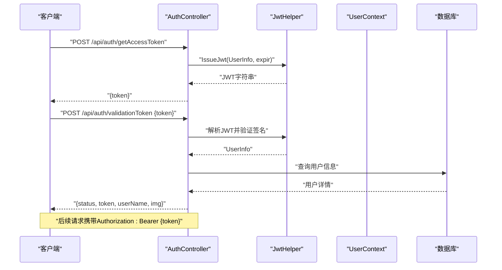
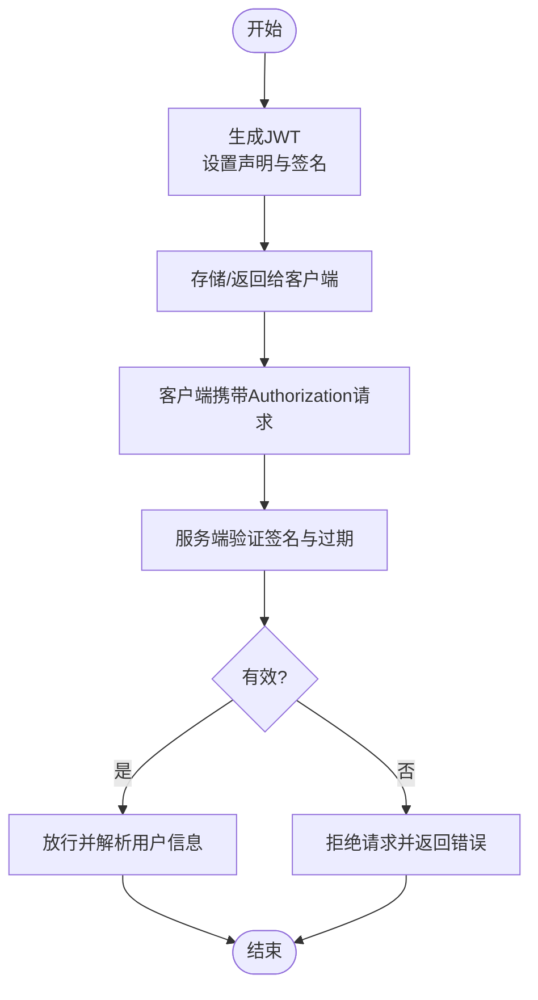
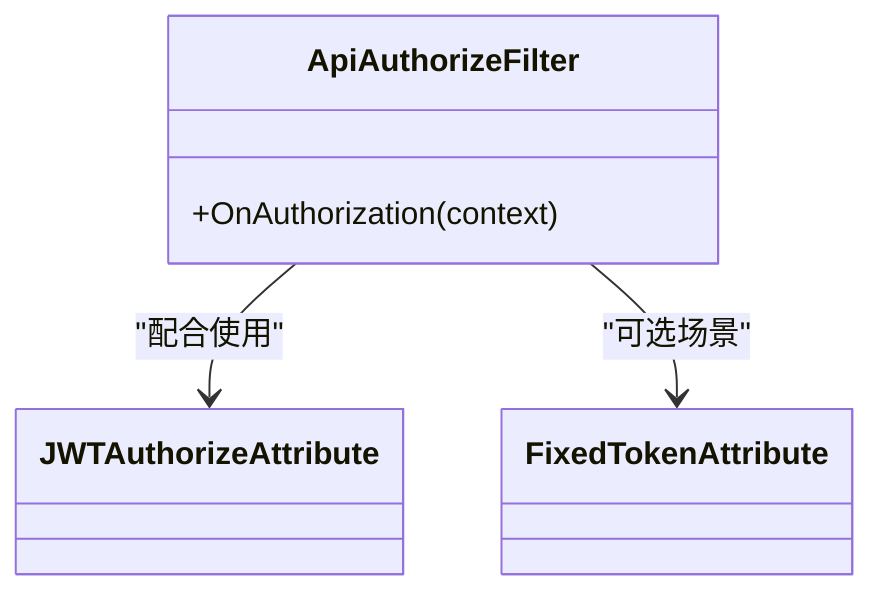
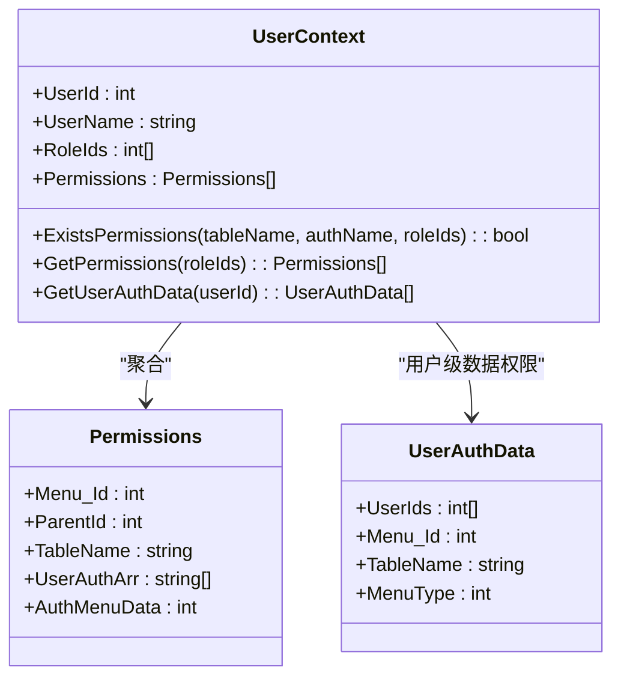
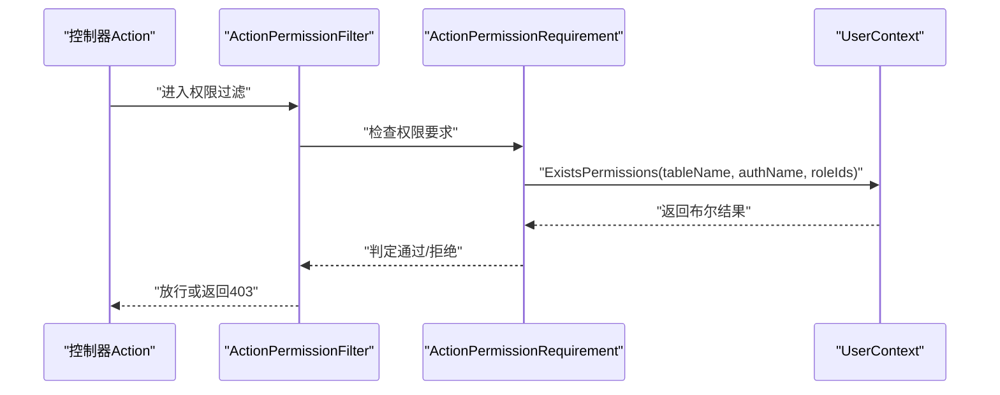
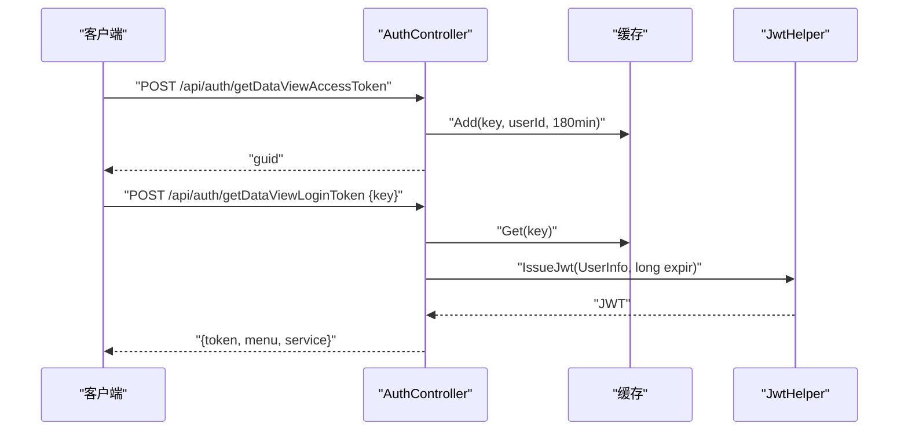
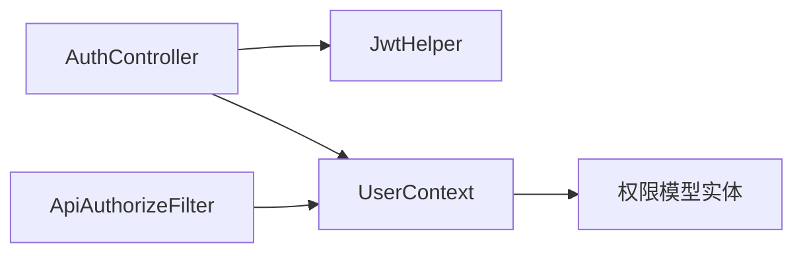

# 认证授权机制

<cite>
**本文引用的文件**
- [AuthController.cs](file://VolPro.WebApi/Controllers/Auth/AuthController.cs)
- [JwtHelper.cs](file://VolPro.Core/Utilities/JwtHelper.cs)
- [ApiAuthorizeFilter.cs](file://VolPro.Core/Filters/ApiAuthorizeFilter.cs)
- [JWTAuthorize.cs](file://VolPro.Core/Filters/JWTAuthorize.cs)
- [UserContext.cs](file://VolPro.Core/UserManager/UserContext.cs)
- [Sys_User.cs](file://VolPro.Entity/System/Sys_User.cs)
- [Sys_Role.cs](file://VolPro.Entity/System/Sys_Role.cs)
- [AuthData.cs](file://VolPro.Core/Enums/AuthData.cs)
- [ActionPermissionAttribute.cs](file://VolPro.Core/Filters/ActionPermissionAttribute.cs)
- [ActionPermissionFilter.cs](file://VolPro.Core/Filters/ActionPermissionFilter.cs)
- [ActionPermissionRequirement.cs](file://VolPro.Core/Filters/ActionPermissionRequirement.cs)
- [ApiActionPermissionAttribute.cs](file://VolPro.Core/Filters/ApiActionPermissionAttribute.cs)
- [Sys_UserAuth.cs](file://VolPro.Entity/System/Sys_UserAuth.cs)
- [Sys_RoleAuth.cs](file://VolPro.Entity/System/Sys_RoleAuth.cs)
- [Sys_Menu.cs](file://VolPro.Entity/System/Sys_Menu.cs)
- [Sys_MenuRole.cs](file://VolPro.Entity/System/Sys_MenuRole.cs)
- [Permissions.cs](file://VolPro.Entity/System/Permissions.cs)
- [Sys_UserRole.cs](file://VolPro.Entity/System/Sys_UserRole.cs)
- [Sys_RoleFields.cs](file://VolPro.Entity/System/Sys_RoleFields.cs)
- [ApiAuthorizeRequire.cs](file://VolPro.Core/Utilities/ApiAuthorizeRequire.cs)
- [AuthorizationResponse.cs](file://VolPro.Core/Extensions/AuthorizationResponse.cs)
- [FixedTokenAttribute.cs](file://VolPro.Core/Filters/FixedTokenAttribute.cs)
- [appsettings.json](file://VolPro.WebApi/appsettings.json)
</cite>

## 目录
1. [简介](#简介)
2. [项目结构](#项目结构)
3. [核心组件](#核心组件)
4. [架构总览](#架构总览)
5. [详细组件分析](#详细组件分析)
6. [依赖关系分析](#依赖关系分析)
7. [性能考虑](#性能考虑)
8. [故障排除指南](#故障排除指南)
9. [结论](#结论)
10. [附录](#附录)

## 简介
本文件系统性阐述该API项目的认证授权机制，涵盖JWT令牌的生成、验证与刷新策略，基于角色与数据维度的权限控制，认证中间件工作原理与配置项，以及完整的认证流程示例。同时总结安全最佳实践与常见问题的防护措施，并说明API密钥与访问控制策略。

## 项目结构
围绕认证授权的关键模块分布于以下命名空间与目录：
- Web API层：控制器负责登录、令牌发放与校验、数据视图令牌等入口
- 核心工具层：JWT帮助类负责令牌签发与解析
- 过滤器层：认证过滤器与权限过滤器负责拦截与权限判定
- 用户管理与权限模型：用户上下文聚合用户信息、角色、权限与数据范围
- 实体模型：系统用户、角色、菜单、权限映射等

图表来源
- [AuthController.cs:1-218](file://VolPro.WebApi/Controllers/Auth/AuthController.cs#L1-L218)
- [JwtHelper.cs:1-99](file://VolPro.Core/Utilities/JwtHelper.cs#L1-L99)
- [ApiAuthorizeFilter.cs:1-86](file://VolPro.Core/Filters/ApiAuthorizeFilter.cs#L1-L86)
- [JWTAuthorize.cs:1-16](file://VolPro.Core/Filters/JWTAuthorize.cs#L1-L16)
- [UserContext.cs:1-704](file://VolPro.Core/UserManager/UserContext.cs#L1-L704)

章节来源
- [AuthController.cs:1-218](file://VolPro.WebApi/Controllers/Auth/AuthController.cs#L1-L218)
- [JwtHelper.cs:1-99](file://VolPro.Core/Utilities/JwtHelper.cs#L1-L99)
- [ApiAuthorizeFilter.cs:1-86](file://VolPro.Core/Filters/ApiAuthorizeFilter.cs#L1-L86)
- [JWTAuthorize.cs:1-16](file://VolPro.Core/Filters/JWTAuthorize.cs#L1-L16)
- [UserContext.cs:1-704](file://VolPro.Core/UserManager/UserContext.cs#L1-L704)

## 核心组件
- JWT令牌生成与解析
  - 生成：根据用户信息与过期时间生成签名令牌
  - 解析：提取声明并转换为用户信息对象
- 认证过滤器
  - 统一校验令牌有效性；支持匿名访问、固定令牌等场景
  - 动态触发刷新提示（过期前窗口）
- 用户上下文
  - 聚合用户基本信息、角色、部门、岗位、权限与数据范围
  - 提供权限查询、数据权限、租户选择等能力
- 权限模型
  - 基于角色的菜单权限与操作权限
  - 数据权限枚举与用户/角色权限映射

章节来源
- [JwtHelper.cs:1-99](file://VolPro.Core/Utilities/JwtHelper.cs#L1-L99)
- [ApiAuthorizeFilter.cs:1-86](file://VolPro.Core/Filters/ApiAuthorizeFilter.cs#L1-L86)
- [UserContext.cs:1-704](file://VolPro.Core/UserManager/UserContext.cs#L1-L704)
- [AuthData.cs:1-20](file://VolPro.Core/Enums/AuthData.cs#L1-L20)

## 架构总览
整体认证授权流程如下：
- 登录与令牌发放：客户端提交凭证后，服务端签发JWT
- 请求拦截：过滤器校验令牌有效性与过期策略
- 权限判定：结合角色与操作权限进行细粒度控制
- 数据范围：按数据权限枚举限制可见数据
- 刷新策略：在过期前窗口提示前端刷新令牌

图表来源
- [AuthController.cs:45-133](file://VolPro.WebApi/Controllers/Auth/AuthController.cs#L45-L133)
- [JwtHelper.cs:21-47](file://VolPro.Core/Utilities/JwtHelper.cs#L21-L47)

## 详细组件分析

### JWT令牌生成与验证
- 令牌结构
  - 包含签发时间、生效时间、过期时间、签发者、受众等标准声明
  - 使用对称密钥进行HS256签名
- 有效期管理
  - 默认过期时间来自配置；移动端菜单类型采用更长有效期
  - 过期前窗口触发刷新提示
- 安全策略
  - 对称密钥存储于配置中，避免硬编码
  - 验证时严格校验签名与过期时间

图表来源
- [JwtHelper.cs:21-47](file://VolPro.Core/Utilities/JwtHelper.cs#L21-L47)
- [ApiAuthorizeFilter.cs:75-81](file://VolPro.Core/Filters/ApiAuthorizeFilter.cs#L75-L81)

章节来源
- [JwtHelper.cs:1-99](file://VolPro.Core/Utilities/JwtHelper.cs#L1-L99)
- [ApiAuthorizeFilter.cs:1-86](file://VolPro.Core/Filters/ApiAuthorizeFilter.cs#L1-L86)

### 认证中间件与过滤器
- ApiAuthorizeFilter
  - 支持匿名访问、固定令牌场景
  - 在过期前窗口设置响应头以提示刷新
- JWTAuthorizeAttribute
  - 作为特性标记需要JWT认证的资源
- FixedTokenAttribute
  - 支持固定令牌不过期场景（用于特定接口）

图表来源
- [ApiAuthorizeFilter.cs:16-86](file://VolPro.Core/Filters/ApiAuthorizeFilter.cs#L16-L86)
- [JWTAuthorize.cs:8-14](file://VolPro.Core/Filters/JWTAuthorize.cs#L8-L14)
- [FixedTokenAttribute.cs](file://VolPro.Core/Filters/FixedTokenAttribute.cs)

章节来源
- [ApiAuthorizeFilter.cs:1-86](file://VolPro.Core/Filters/ApiAuthorizeFilter.cs#L1-L86)
- [JWTAuthorize.cs:1-16](file://VolPro.Core/Filters/JWTAuthorize.cs#L1-L16)
- [FixedTokenAttribute.cs](file://VolPro.Core/Filters/FixedTokenAttribute.cs)

### 用户上下文与权限聚合
- 用户上下文
  - 提供用户基本信息、角色ID数组、部门ID集合、岗位ID集合
  - 缓存用户信息，减少数据库访问
- 权限聚合
  - 超级管理员拥有全部菜单权限
  - 普通用户按角色合并权限，去重并按菜单分组
  - 支持移动端菜单类型区分
- 数据权限
  - 通过枚举定义数据可见范围（如本组织、本角色、仅自己等）
  - 支持用户级授权（可查看某些用户的特定数据）

图表来源
- [UserContext.cs:505-532](file://VolPro.Core/UserManager/UserContext.cs#L505-L532)
- [UserContext.cs:263-389](file://VolPro.Core/UserManager/UserContext.cs#L263-L389)
- [AuthData.cs:9-18](file://VolPro.Core/Enums/AuthData.cs#L9-L18)

章节来源
- [UserContext.cs:1-704](file://VolPro.Core/UserManager/UserContext.cs#L1-L704)
- [AuthData.cs:1-20](file://VolPro.Core/Enums/AuthData.cs#L1-L20)

### 基于角色与操作的权限控制
- 角色权限
  - 通过角色与菜单权限映射表获取用户权限
  - 超级管理员例外，拥有全部菜单权限
- 操作权限
  - 在Action上使用特性标注权限类别，过滤器进行判定
  - 支持方法级权限注解与统一权限要求

图表来源
- [ActionPermissionFilter.cs](file://VolPro.Core/Filters/ActionPermissionFilter.cs)
- [ActionPermissionRequirement.cs](file://VolPro.Core/Filters/ActionPermissionRequirement.cs)
- [UserContext.cs:484-504](file://VolPro.Core/UserManager/UserContext.cs#L484-L504)

章节来源
- [ActionPermissionAttribute.cs](file://VolPro.Core/Filters/ActionPermissionAttribute.cs)
- [ApiActionPermissionAttribute.cs](file://VolPro.Core/Filters/ApiActionPermissionAttribute.cs)
- [UserContext.cs:484-504](file://VolPro.Core/UserManager/UserContext.cs#L484-L504)

### 数据视图与API密钥访问控制
- 数据视图令牌
  - 通过一次性key换取长期JWT，用于数据可视化场景
  - 使用缓存短期存储key与用户ID映射
- API密钥策略
  - 通过配置项与中间件实现API密钥校验与访问控制
  - 结合菜单类型与权限模型进行细粒度控制

图表来源
- [AuthController.cs:135-211](file://VolPro.WebApi/Controllers/Auth/AuthController.cs#L135-L211)

章节来源
- [AuthController.cs:1-218](file://VolPro.WebApi/Controllers/Auth/AuthController.cs#L1-L218)

## 依赖关系分析
- 控制器依赖JWT帮助类与用户上下文
- 过滤器依赖配置与用户上下文进行令牌与权限校验
- 权限模型依赖数据库实体进行角色、菜单、用户与权限映射

图表来源
- [AuthController.cs:27-37](file://VolPro.WebApi/Controllers/Auth/AuthController.cs#L27-L37)
- [ApiAuthorizeFilter.cs:16-29](file://VolPro.Core/Filters/ApiAuthorizeFilter.cs#L16-L29)
- [UserContext.cs:87-130](file://VolPro.Core/UserManager/UserContext.cs#L87-L130)

章节来源
- [AuthController.cs:1-218](file://VolPro.WebApi/Controllers/Auth/AuthController.cs#L1-L218)
- [ApiAuthorizeFilter.cs:1-86](file://VolPro.Core/Filters/ApiAuthorizeFilter.cs#L1-L86)
- [UserContext.cs:1-704](file://VolPro.Core/UserManager/UserContext.cs#L1-L704)

## 性能考虑
- 缓存策略
  - 用户信息与权限在内存/Redis中缓存，降低数据库压力
  - 角色权限版本号机制确保权限变更时及时刷新
- 并发控制
  - 使用并发字典与锁粒度控制，避免高并发下重复加载
- 查询优化
  - 权限聚合时按角色分组并去重，减少重复计算

章节来源
- [UserContext.cs:135-153](file://VolPro.Core/UserManager/UserContext.cs#L135-L153)
- [UserContext.cs:283-389](file://VolPro.Core/UserManager/UserContext.cs#L283-L389)

## 故障排除指南
- 常见错误与处理
  - JWT签名无效：检查密钥一致性与传输加密
  - JWT已过期：在过期前窗口触发刷新逻辑
  - 用户信息无效：确认用户存在且令牌中用户ID有效
- 异常捕获
  - 过滤器中对匿名、固定令牌场景分别处理
  - 对解析异常进行分类反馈

章节来源
- [AuthController.cs:114-131](file://VolPro.WebApi/Controllers/Auth/AuthController.cs#L114-L131)
- [ApiAuthorizeFilter.cs:31-57](file://VolPro.Core/Filters/ApiAuthorizeFilter.cs#L31-L57)

## 结论
该认证授权体系以JWT为核心，结合角色与操作权限、数据权限模型，形成从令牌签发、验证到权限判定的完整闭环。通过缓存与并发控制提升性能，通过配置与中间件实现灵活的安全策略。建议在生产环境中强化密钥管理、传输加密与审计日志，持续完善权限模型与数据隔离策略。

## 附录

### 认证流程示例（登录、令牌获取与权限验证）
- 登录
  - 客户端调用令牌发放接口，服务端签发JWT并返回
- 令牌获取
  - 客户端在后续请求头携带Authorization: Bearer {token}
- 权限验证
  - 过滤器校验令牌有效性；方法级权限通过特性标注与过滤器判定

章节来源
- [AuthController.cs:45-133](file://VolPro.WebApi/Controllers/Auth/AuthController.cs#L45-L133)
- [ApiAuthorizeFilter.cs:29-82](file://VolPro.Core/Filters/ApiAuthorizeFilter.cs#L29-L82)

### 安全最佳实践
- 密钥管理
  - 使用强对称密钥，定期轮换；避免硬编码，通过配置中心管理
- 传输安全
  - 强制HTTPS，防止令牌在传输中被截获
- 令牌策略
  - 合理设置过期时间；在过期前窗口自动刷新
  - 对敏感接口启用固定令牌或额外校验
- 权限最小化
  - 采用基于角色与数据权限的最小授权原则
  - 定期审计权限分配与数据访问日志

### API密钥与访问控制策略
- API密钥校验
  - 通过中间件与配置项实现API密钥校验
- 访问控制
  - 结合菜单类型、角色与操作权限进行统一控制
  - 数据视图场景使用一次性key换取长期令牌，配合缓存与超时控制

章节来源
- [ApiAuthorizeRequire.cs](file://VolPro.Core/Utilities/ApiAuthorizeRequire.cs)
- [AuthorizationResponse.cs](file://VolPro.Core/Extensions/AuthorizationResponse.cs)
- [AuthController.cs:135-211](file://VolPro.WebApi/Controllers/Auth/AuthController.cs#L135-L211)