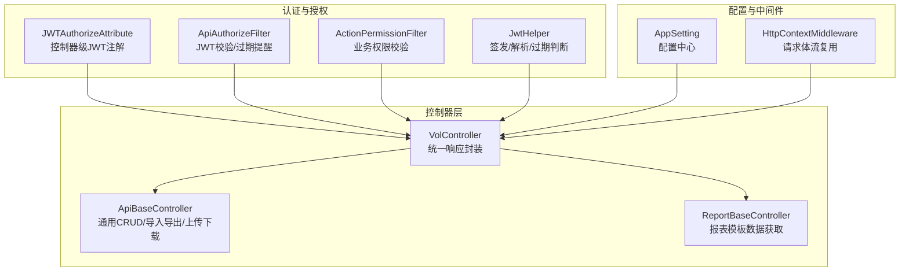
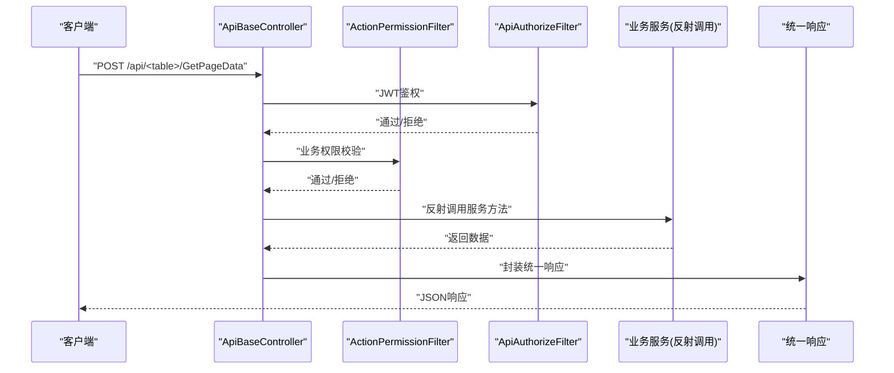
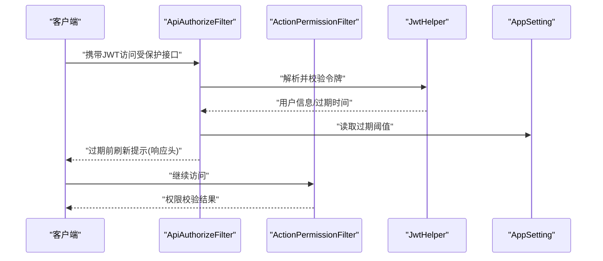
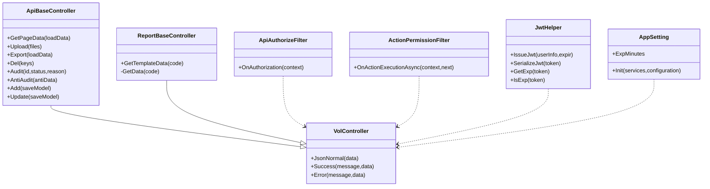

# 通用API接口

<cite>
**本文引用的文件**
- [ApiBaseController.cs](file://VolPro.Core/Controllers/Basic/ApiBaseController.cs)
- [ReportBaseController.cs](file://VolPro.Core/Controllers/Basic/ReportBaseController.cs)
- [VolController.cs](file://VolPro.Core/Controllers/Basic/VolController.cs)
- [JWTAuthorize.cs](file://VolPro.Core/Filters/JWTAuthorize.cs)
- [ApiAuthorizeFilter.cs](file://VolPro.Core/Filters/ApiAuthorizeFilter.cs)
- [ActionPermissionFilter.cs](file://VolPro.Core/Filters/ActionPermissionFilter.cs)
- [JwtHelper.cs](file://VolPro.Core/Utilities/JwtHelper.cs)
- [AppSetting.cs](file://VolPro.Core/Configuration/AppSetting.cs)
- [AppController.cs](file://VolPro.WebApi/Controllers/AppController.cs)
- [HttpContextMiddleware.cs](file://VolPro.Core/Extensions/Middleware/HttpContextMiddleware.cs)
</cite>

## 目录
1. [简介](#简介)
2. [项目结构](#项目结构)
3. [核心组件](#核心组件)
4. [架构总览](#架构总览)
5. [详细组件分析](#详细组件分析)
6. [依赖关系分析](#依赖关系分析)
7. [性能考量](#性能考量)
8. [故障排查指南](#故障排查指南)
9. [结论](#结论)
10. [附录](#附录)

## 简介
本文件面向系统通用API接口，覆盖认证授权、应用配置、报表生成与基础控制器等通用能力，提供统一的API规范说明、参数与响应格式、中间件与过滤器使用方式、安全与性能建议，以及集成示例与最佳实践。

## 项目结构
通用API能力主要由以下层次构成：
- 基础控制器层：提供统一的CRUD、导入导出、上传下载、审核/反审核等通用接口。
- 报表控制器层：基于配置的报表模板与数据源SQL，提供模板数据获取能力。
- 认证与授权层：基于JWT的鉴权与权限过滤，支持动态刷新提示。
- 应用配置层：集中配置项（如JWT过期、静态路径、全局过滤等）。
- 中间件与扩展：HTTP上下文流处理、响应封装等。

图表来源
- [VolController.cs:1-77](file://VolPro.Core/Controllers/Basic/VolController.cs#L1-L77)
- [ApiBaseController.cs:1-230](file://VolPro.Core/Controllers/Basic/ApiBaseController.cs#L1-L230)
- [ReportBaseController.cs:1-169](file://VolPro.Core/Controllers/Basic/ReportBaseController.cs#L1-L169)
- [JWTAuthorize.cs:1-16](file://VolPro.Core/Filters/JWTAuthorize.cs#L1-L16)
- [ApiAuthorizeFilter.cs:1-86](file://VolPro.Core/Filters/ApiAuthorizeFilter.cs#L1-L86)
- [ActionPermissionFilter.cs:1-123](file://VolPro.Core/Filters/ActionPermissionFilter.cs#L1-L123)
- [JwtHelper.cs:1-99](file://VolPro.Core/Utilities/JwtHelper.cs#L1-L99)
- [AppSetting.cs:1-237](file://VolPro.Core/Configuration/AppSetting.cs#L1-L237)
- [HttpContextMiddleware.cs:1-59](file://VolPro.Core/Extensions/Middleware/HttpContextMiddleware.cs#L1-L59)

章节来源
- [VolController.cs:1-77](file://VolPro.Core/Controllers/Basic/VolController.cs#L1-L77)
- [ApiBaseController.cs:1-230](file://VolPro.Core/Controllers/Basic/ApiBaseController.cs#L1-L230)
- [ReportBaseController.cs:1-169](file://VolPro.Core/Controllers/Basic/ReportBaseController.cs#L1-L169)
- [AppSetting.cs:1-237](file://VolPro.Core/Configuration/AppSetting.cs#L1-L237)

## 核心组件
- 统一响应封装与控制器基类
  - 提供统一的成功/失败响应、JSON序列化策略（驼峰/日期格式/长整型字符串）、便捷方法。
  - 作为所有控制器的基类，确保一致的返回格式与日志输出。
- 通用业务控制器
  - 提供分页查询、明细查询、上传、下载模板、导入、导出、删除、审核/反审核、新增/编辑等通用接口。
  - 通过反射调用服务层方法，实现“控制器即网关”的轻量设计。
- 报表控制器
  - 依据报表编码加载模板与SQL，按需执行SQL并返回模板文本与数据。
- 认证与授权
  - 控制器级JWT注解；鉴权过滤器负责令牌有效性与过期提醒；权限过滤器负责业务权限校验。
- 配置中心
  - 集中管理数据库连接、Redis、JWT密钥、过期时间、静态路径、全局过滤、Kafka等配置。
- 中间件
  - 请求体流复用中间件，解决多次读取请求体的问题。

章节来源
- [VolController.cs:1-77](file://VolPro.Core/Controllers/Basic/VolController.cs#L1-L77)
- [ApiBaseController.cs:1-230](file://VolPro.Core/Controllers/Basic/ApiBaseController.cs#L1-L230)
- [ReportBaseController.cs:1-169](file://VolPro.Core/Controllers/Basic/ReportBaseController.cs#L1-L169)
- [JWTAuthorize.cs:1-16](file://VolPro.Core/Filters/JWTAuthorize.cs#L1-L16)
- [ApiAuthorizeFilter.cs:1-86](file://VolPro.Core/Filters/ApiAuthorizeFilter.cs#L1-L86)
- [ActionPermissionFilter.cs:1-123](file://VolPro.Core/Filters/ActionPermissionFilter.cs#L1-L123)
- [JwtHelper.cs:1-99](file://VolPro.Core/Utilities/JwtHelper.cs#L1-L99)
- [AppSetting.cs:1-237](file://VolPro.Core/Configuration/AppSetting.cs#L1-L237)
- [HttpContextMiddleware.cs:1-59](file://VolPro.Core/Extensions/Middleware/HttpContextMiddleware.cs#L1-L59)

## 架构总览
通用API的调用链路如下：

图表来源
- [ApiBaseController.cs:37-41](file://VolPro.Core/Controllers/Basic/ApiBaseController.cs#L37-L41)
- [ApiAuthorizeFilter.cs:29-82](file://VolPro.Core/Filters/ApiAuthorizeFilter.cs#L29-L82)
- [ActionPermissionFilter.cs:34-42](file://VolPro.Core/Filters/ActionPermissionFilter.cs#L34-L42)
- [VolController.cs:21-48](file://VolPro.Core/Controllers/Basic/VolController.cs#L21-L48)

## 详细组件分析

### 通用业务API（ApiBaseController）
- 接口概览
  - GET/POST /api/<table>/GetPageData：分页查询
  - POST /api/<table>/GetDetailPage：明细grid分页（内部接口）
  - POST /api/<table>/Upload：文件上传（内部接口）
  - GET /api/<table>/DownLoadTemplate：下载导入模板（内部接口）
  - POST /api/<table>/Import：导入Excel（内部接口）
  - POST /api/<table>/Export：导出Excel（内部接口）
  - POST /api/<table>/Del：删除（内部接口）
  - POST /api/<table>/Audit：审核（内部接口）
  - POST /api/<table>/antiAudit：反审核（内部接口）
  - POST /api/<table>/Add：新增（支持主子表）（内部接口）
  - POST /api/<table>/Update：编辑（支持主子表）（内部接口）

- 参数与响应
  - 分页查询：请求体为分页参数对象；响应为统一结构（状态、消息、数据）。
  - 上传/导入：请求体为文件集合；响应为统一结构。
  - 导出：请求体为分页参数对象；响应为文件流（Octet）。
  - 删除/审核/反审核/新增/编辑：请求体为键值数组或保存模型；响应为统一结构。
  - 明细查询：返回明细JSON字符串。

- 权限控制
  - 控制器级JWT注解；各动作标注具体权限类型（查询、上传、导入、导出、删除、审核、新增、编辑）。

- 安全与性能
  - 统一响应与序列化策略，避免前端解析差异。
  - 导出/下载采用文件流直返，减少内存占用。
  - 上传/导入为内部接口，便于统一校验与审计。

章节来源
- [ApiBaseController.cs:37-120](file://VolPro.Core/Controllers/Basic/ApiBaseController.cs#L37-L120)
- [ApiBaseController.cs:122-205](file://VolPro.Core/Controllers/Basic/ApiBaseController.cs#L122-L205)
- [ApiBaseController.cs:213-227](file://VolPro.Core/Controllers/Basic/ApiBaseController.cs#L213-L227)
- [VolController.cs:21-48](file://VolPro.Core/Controllers/Basic/VolController.cs#L21-L48)

### 报表模板API（ReportBaseController）
- 接口概览
  - GET/POST /api/<report>/getTemplateData：根据报表编码加载模板与数据，返回模板文本与数据对象。

- 参数与响应
  - 查询参数：code（报表编码）
  - 响应：统一结构，data包含模板文本与数据（表格数据或自定义对象）

- 数据来源
  - 优先从控制器重写的GetData获取数据；否则执行Sys_ReportOptions中的SQL查询。
  - SQL在指定数据库服务实例上执行，确保跨库报表能力。

- 安全与性能
  - 模板文件路径映射到物理路径，注意目录遍历风险。
  - SQL执行需谨慎，避免复杂查询导致阻塞。

章节来源
- [ReportBaseController.cs:58-78](file://VolPro.Core/Controllers/Basic/ReportBaseController.cs#L58-L78)
- [ReportBaseController.cs:80-83](file://VolPro.Core/Controllers/Basic/ReportBaseController.cs#L80-L83)
- [ReportBaseController.cs:91-167](file://VolPro.Core/Controllers/Basic/ReportBaseController.cs#L91-L167)

### 应用配置API（AppController）
- 接口概览
  - GET /api/app/checkLogin：检查登录状态（返回1/0）
  - GET /api/app/getAndroidVersion：获取安卓版本信息
  - GET /api/app/getIOSVersion：获取iOS版本信息

- 参数与响应
  - checkLogin：无参数，返回字符串“1”或“0”
  - 版本接口：home布尔参数，返回包含版本号、下载地址与描述的对象

- 配置来源
  - 从配置节“android”、“ios”读取版本信息

章节来源
- [AppController.cs:18-71](file://VolPro.WebApi/Controllers/AppController.cs#L18-L71)
- [AppSetting.cs:165-173](file://VolPro.Core/Configuration/AppSetting.cs#L165-L173)

### 认证与授权流程
- JWT签发与解析
  - 使用对称密钥签发JWT，包含用户标识、签发/生效/过期时间、受众等声明。
  - 支持解析JWT获取用户信息与过期时间，判断是否过期。

- 鉴权与权限
  - 控制器级JWTAuthorizeAttribute启用JWT鉴权。
  - ApiAuthorizeFilter负责令牌有效性校验与过期前刷新提示（通过响应头标记）。
  - ActionPermissionFilter根据表名与操作类型进行业务权限校验，支持角色限制与全局过滤。

- 安全建议
  - 前端在接近过期时主动触发刷新接口，避免频繁过期导致体验问题。
  - 严格控制敏感接口的匿名访问，仅在必要场景使用AllowAnonymous。

图表来源
- [ApiAuthorizeFilter.cs:29-82](file://VolPro.Core/Filters/ApiAuthorizeFilter.cs#L29-L82)
- [JwtHelper.cs:21-47](file://VolPro.Core/Utilities/JwtHelper.cs#L21-L47)
- [JwtHelper.cs:54-82](file://VolPro.Core/Utilities/JwtHelper.cs#L54-L82)
- [AppSetting.cs:64](file://VolPro.Core/Configuration/AppSetting.cs#L64)

章节来源
- [JWTAuthorize.cs:8-14](file://VolPro.Core/Filters/JWTAuthorize.cs#L8-L14)
- [ApiAuthorizeFilter.cs:29-82](file://VolPro.Core/Filters/ApiAuthorizeFilter.cs#L29-L82)
- [ActionPermissionFilter.cs:43-120](file://VolPro.Core/Filters/ActionPermissionFilter.cs#L43-L120)
- [JwtHelper.cs:21-82](file://VolPro.Core/Utilities/JwtHelper.cs#L21-L82)
- [AppSetting.cs:64](file://VolPro.Core/Configuration/AppSetting.cs#L64)

## 依赖关系分析
- 控制器依赖
  - ApiBaseController与ReportBaseController均继承自VolController，共享统一响应与序列化策略。
  - ApiBaseController通过反射调用服务层方法，降低耦合度。
- 过滤器依赖
  - ApiAuthorizeFilter与ActionPermissionFilter共同完成“令牌校验+业务权限”双层防护。
- 配置与工具
  - AppSetting集中管理配置；JwtHelper提供JWT生命周期管理。

图表来源
- [VolController.cs:1-77](file://VolPro.Core/Controllers/Basic/VolController.cs#L1-L77)
- [ApiBaseController.cs:19-30](file://VolPro.Core/Controllers/Basic/ApiBaseController.cs#L19-L30)
- [ReportBaseController.cs:17-22](file://VolPro.Core/Controllers/Basic/ReportBaseController.cs#L17-L22)
- [ApiAuthorizeFilter.cs:16-29](file://VolPro.Core/Filters/ApiAuthorizeFilter.cs#L16-L29)
- [ActionPermissionFilter.cs:22-34](file://VolPro.Core/Filters/ActionPermissionFilter.cs#L22-L34)
- [JwtHelper.cs:13-47](file://VolPro.Core/Utilities/JwtHelper.cs#L13-L47)
- [AppSetting.cs:85-163](file://VolPro.Core/Configuration/AppSetting.cs#L85-L163)

章节来源
- [VolController.cs:1-77](file://VolPro.Core/Controllers/Basic/VolController.cs#L1-L77)
- [ApiBaseController.cs:19-30](file://VolPro.Core/Controllers/Basic/ApiBaseController.cs#L19-L30)
- [ReportBaseController.cs:17-22](file://VolPro.Core/Controllers/Basic/ReportBaseController.cs#L17-L22)
- [ApiAuthorizeFilter.cs:16-29](file://VolPro.Core/Filters/ApiAuthorizeFilter.cs#L16-L29)
- [ActionPermissionFilter.cs:22-34](file://VolPro.Core/Filters/ActionPermissionFilter.cs#L22-L34)
- [JwtHelper.cs:13-47](file://VolPro.Core/Utilities/JwtHelper.cs#L13-L47)
- [AppSetting.cs:85-163](file://VolPro.Core/Configuration/AppSetting.cs#L85-L163)

## 性能考量
- 导出与下载
  - 采用文件流直返，避免将大文件加载至内存；建议结合分页与增量导出策略。
- 上传与导入
  - 上传/导入为内部接口，建议在服务层做并发与大小限制；对模板校验与数据清洗前置。
- 权限与日志
  - 权限过滤与审计日志会带来额外开销，建议在高频接口中减少不必要的日志写入。
- JWT过期
  - 在鉴权过滤器中提前提示刷新，避免频繁过期导致重试风暴。

[本节为通用指导，无需列出章节来源]

## 故障排查指南
- 401/403
  - 检查请求头是否携带有效JWT；确认令牌未过期；核对控制器是否标注JWTAuthorize。
- 权限不足
  - 确认用户角色与表级权限配置；检查ActionPermissionFilter的表名与操作类型匹配情况。
- 导出/下载异常
  - 检查文件路径映射与物理路径存在性；确认导出服务返回的文件路径有效。
- 上传/导入失败
  - 检查文件大小与类型限制；确认服务层导入逻辑与模板字段映射正确。
- 配置错误
  - 检查AppSetting中数据库连接、Redis、JWT密钥等配置是否正确且已解密。

章节来源
- [ApiAuthorizeFilter.cs:29-82](file://VolPro.Core/Filters/ApiAuthorizeFilter.cs#L29-L82)
- [ActionPermissionFilter.cs:43-120](file://VolPro.Core/Filters/ActionPermissionFilter.cs#L43-L120)
- [AppSetting.cs:148-163](file://VolPro.Core/Configuration/AppSetting.cs#L148-L163)

## 结论
该通用API体系以控制器基类与过滤器为核心，实现了统一的认证授权、权限控制、响应封装与报表模板能力。通过配置中心集中管理关键参数，结合中间件与工具类，既保证了易用性，也兼顾了安全性与可维护性。建议在生产环境中配合严格的权限设计、日志审计与性能监控，持续优化高频接口的吞吐与延迟。

[本节为总结性内容，无需列出章节来源]

## 附录

### 通用API清单与规范
- 通用业务接口（ApiBaseController）
  - GET/POST /api/<table>/GetPageData
    - 请求体：分页参数对象
    - 响应：统一结构（状态、消息、数据）
  - POST /api/<table>/Upload
    - 请求体：文件集合
    - 响应：统一结构
  - GET /api/<table>/DownLoadTemplate
    - 响应：文件流（Octet）
  - POST /api/<table>/Import
    - 请求体：文件集合
    - 响应：统一结构
  - POST /api/<table>/Export
    - 请求体：分页参数对象
    - 响应：文件流（Octet）
  - POST /api/<table>/Del
    - 请求体：键值数组
    - 响应：统一结构
  - POST /api/<table>/Audit
    - 请求体：id数组、审核状态、原因
    - 响应：统一结构
  - POST /api/<table>/antiAudit
    - 请求体：反审核数据对象
    - 响应：统一结构
  - POST /api/<table>/Add
    - 请求体：保存模型（支持主子表）
    - 响应：统一结构
  - POST /api/<table>/Update
    - 请求体：保存模型（支持主子表）
    - 响应：统一结构

- 报表接口（ReportBaseController）
  - GET/POST /api/<report>/getTemplateData
    - 查询参数：code
    - 响应：统一结构，data包含模板文本与数据

- 应用配置接口（AppController）
  - GET /api/app/checkLogin
    - 响应：字符串“1”或“0”
  - GET /api/app/getAndroidVersion
    - 查询参数：home
    - 响应：版本信息对象
  - GET /api/app/getIOSVersion
    - 查询参数：home
    - 响应：版本信息对象

- 认证与授权
  - 控制器级注解：JWTAuthorizeAttribute
  - 鉴权过滤：ApiAuthorizeFilter（令牌校验、过期提醒）
  - 权限过滤：ActionPermissionFilter（表级权限、角色限制、全局过滤）
  - 工具：JwtHelper（签发/解析/过期判断）

- 配置中心（AppSetting）
  - 关键项：JWT过期时间、静态路径、全局过滤、数据库/Redis/Kafka配置等

章节来源
- [ApiBaseController.cs:37-120](file://VolPro.Core/Controllers/Basic/ApiBaseController.cs#L37-L120)
- [ApiBaseController.cs:122-205](file://VolPro.Core/Controllers/Basic/ApiBaseController.cs#L122-L205)
- [ReportBaseController.cs:58-78](file://VolPro.Core/Controllers/Basic/ReportBaseController.cs#L58-L78)
- [AppController.cs:18-71](file://VolPro.WebApi/Controllers/AppController.cs#L18-L71)
- [JWTAuthorize.cs:8-14](file://VolPro.Core/Filters/JWTAuthorize.cs#L8-L14)
- [ApiAuthorizeFilter.cs:29-82](file://VolPro.Core/Filters/ApiAuthorizeFilter.cs#L29-L82)
- [ActionPermissionFilter.cs:43-120](file://VolPro.Core/Filters/ActionPermissionFilter.cs#L43-L120)
- [JwtHelper.cs:21-82](file://VolPro.Core/Utilities/JwtHelper.cs#L21-L82)
- [AppSetting.cs:64](file://VolPro.Core/Configuration/AppSetting.cs#L64)

### 通用中间件与过滤器使用方式
- JWTAuthorizeAttribute
  - 作用于控制器，启用JWT鉴权。
- ApiAuthorizeFilter
  - 自动拦截请求，校验令牌有效性；在快过期时通过响应头提示刷新。
- ActionPermissionFilter
  - 异步拦截请求，校验业务权限；支持角色限制与全局过滤。
- HttpContextMiddleware
  - 在管道中复用请求体流，避免多次读取失败。

章节来源
- [JWTAuthorize.cs:8-14](file://VolPro.Core/Filters/JWTAuthorize.cs#L8-L14)
- [ApiAuthorizeFilter.cs:29-82](file://VolPro.Core/Filters/ApiAuthorizeFilter.cs#L29-L82)
- [ActionPermissionFilter.cs:34-42](file://VolPro.Core/Filters/ActionPermissionFilter.cs#L34-L42)
- [HttpContextMiddleware.cs:14-56](file://VolPro.Core/Extensions/Middleware/HttpContextMiddleware.cs#L14-L56)

### 安全考虑与最佳实践
- 安全
  - 仅在必要场景使用AllowAnonymous；敏感接口必须JWTAuthorize。
  - 严格控制权限范围，避免超级管理员滥用；利用角色限制与表级权限。
  - 对外暴露的模板与报表接口需防止SQL注入与路径穿越。
- 性能
  - 导出/下载采用流式传输；上传/导入前置校验与限速。
  - 高频接口减少日志写入；合理设置JWT过期时间与刷新策略。
- 集成
  - 前端在收到过期提示后主动刷新令牌；统一处理统一响应结构。
  - 报表接口按code加载模板与数据，确保模板与SQL可维护。

章节来源
- [ApiAuthorizeFilter.cs:78-81](file://VolPro.Core/Filters/ApiAuthorizeFilter.cs#L78-L81)
- [ActionPermissionFilter.cs:55-59](file://VolPro.Core/Filters/ActionPermissionFilter.cs#L55-L59)
- [ReportBaseController.cs:65-77](file://VolPro.Core/Controllers/Basic/ReportBaseController.cs#L65-L77)
- [AppSetting.cs:142](file://VolPro.Core/Configuration/AppSetting.cs#L142)