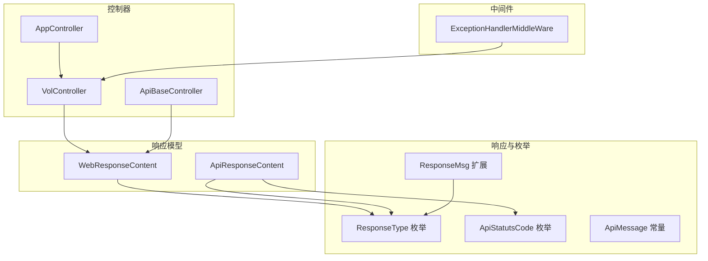
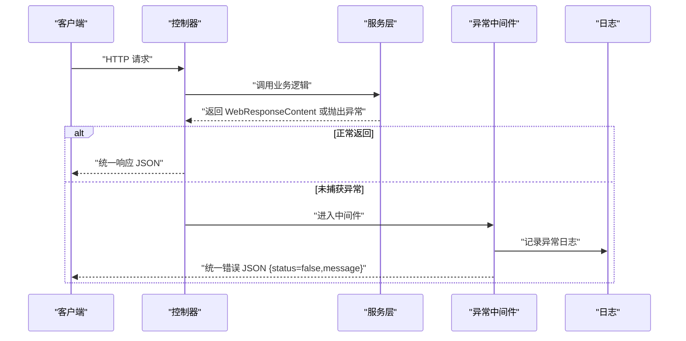
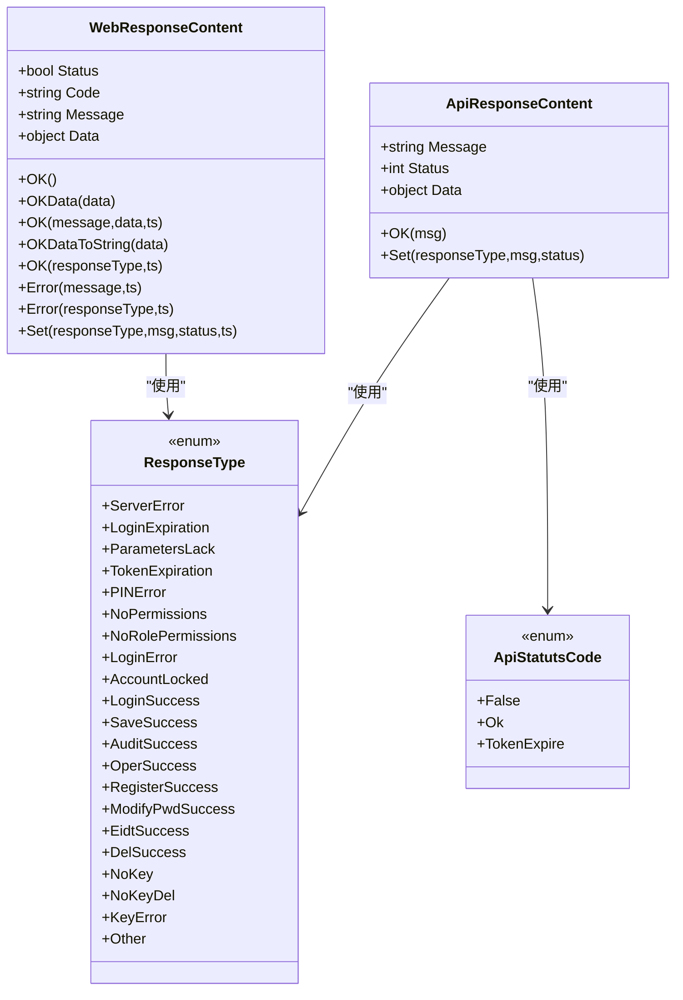
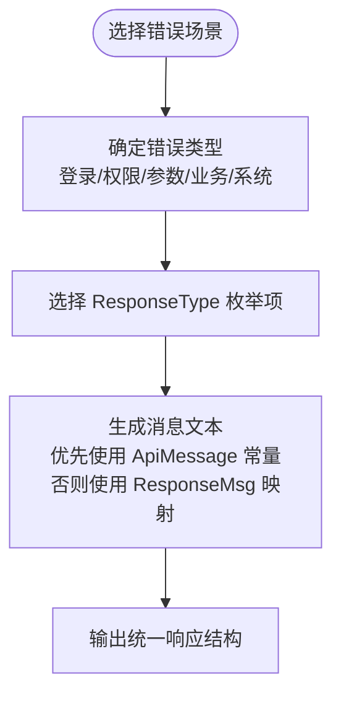
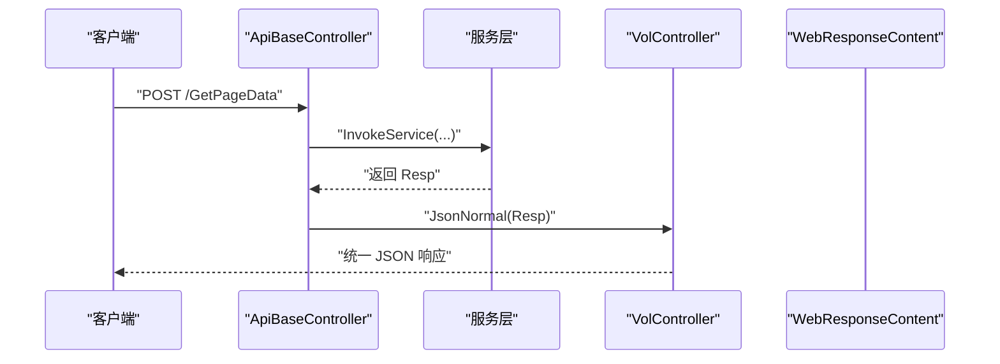
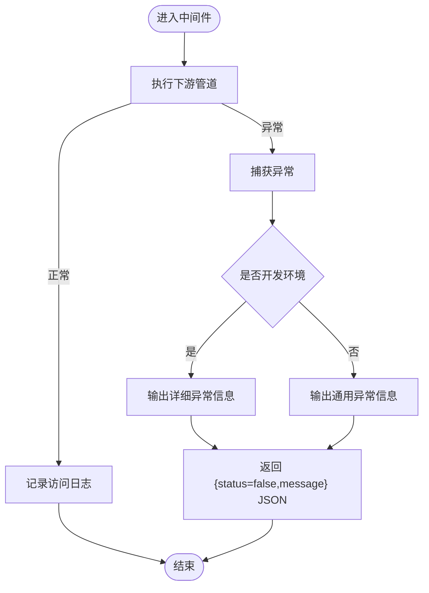
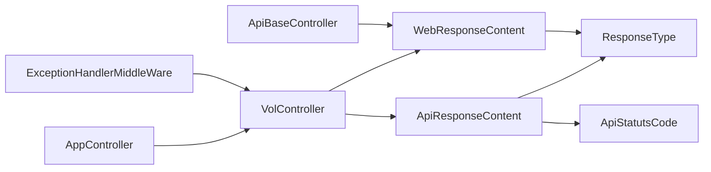

# 错误处理与响应格式

<cite>
**本文引用的文件**
- [VolPro.Core\Extensions\Response\ResponseMsg.cs](file://VolPro.Core/Extensions/Response/ResponseMsg.cs)
- [VolPro.Core\Enums\ResponseType.cs](file://VolPro.Core/Enums/ResponseType.cs)
- [VolPro.Core\Enums\ApiMessage.cs](file://VolPro.Core/Enums/ApiMessage.cs)
- [VolPro.Core\Enums\ApiStatutsCode.cs](file://VolPro.Core/Enums/ApiStatutsCode.cs)
- [VolPro.Core\Utilities\Response\WebResponseContent.cs](file://VolPro.Core/Utilities/Response/WebResponseContent.cs)
- [VolPro.Core\Utilities\Response\ApiResponseContent.cs](file://VolPro.Core/Utilities/Response/ApiResponseContent.cs)
- [VolPro.Core\Controllers\Basic\VolController.cs](file://VolPro.Core/Controllers/Basic/VolController.cs)
- [VolPro.Core\Controllers\Basic\ApiBaseController.cs](file://VolPro.Core/Controllers/Basic/ApiBaseController.cs)
- [VolPro.Core\Middleware\ExceptionHandlerMiddleWare.cs](file://VolPro.Core/Middleware/ExceptionHandlerMiddleWare.cs)
- [VolPro.Core\Extensions\Middleware\ExceptionHandlerMiddleWare.cs](file://VolPro.Core/Extensions/Middleware/ExceptionHandlerMiddleWare.cs)
- [VolPro.WebApi\Controllers\AppController.cs](file://VolPro.WebApi/Controllers/AppController.cs)
</cite>

## 目录
1. [简介](#简介)
2. [项目结构](#项目结构)
3. [核心组件](#核心组件)
4. [架构总览](#架构总览)
5. [详细组件分析](#详细组件分析)
6. [依赖关系分析](#依赖关系分析)
7. [性能考量](#性能考量)
8. [故障排查指南](#故障排查指南)
9. [结论](#结论)
10. [附录](#附录)

## 简介
本文件旨在建立统一的API错误处理与响应格式标准，覆盖以下要点：
- 统一的成功与错误响应结构
- 错误码定义与分类（业务错误、参数校验错误、系统错误）
- 异常处理机制与日志记录策略
- 响应示例与最佳实践
- 客户端错误处理与调试建议
- API版本兼容性与向后兼容策略

## 项目结构
围绕响应与错误处理的关键目录与文件如下：
- 枚举与常量：用于统一错误码与消息常量
- 响应模型：封装统一的响应结构
- 控制器基类：提供通用的成功/错误返回与序列化设置
- 中间件：全局异常捕获与标准化输出
- 示例控制器：展示不同场景的响应风格

图表来源
- [VolPro.Core\Enums\ResponseType.cs:1-32](file://VolPro.Core/Enums/ResponseType.cs#L1-L32)
- [VolPro.Core\Enums\ApiStatutsCode.cs:1-15](file://VolPro.Core/Enums/ApiStatutsCode.cs#L1-L15)
- [VolPro.Core\Enums\ApiMessage.cs:1-60](file://VolPro.Core/Enums/ApiMessage.cs#L1-L60)
- [VolPro.Core\Extensions\Response\ResponseMsg.cs:1-60](file://VolPro.Core/Extensions/Response/ResponseMsg.cs#L1-L60)
- [VolPro.Core\Utilities\Response\WebResponseContent.cs:1-108](file://VolPro.Core/Utilities/Response/WebResponseContent.cs#L1-L108)
- [VolPro.Core\Utilities\Response\ApiResponseContent.cs:1-64](file://VolPro.Core/Utilities/Response/ApiResponseContent.cs#L1-L64)
- [VolPro.Core\Controllers\Basic\VolController.cs:1-77](file://VolPro.Core/Controllers/Basic/VolController.cs#L1-L77)
- [VolPro.Core\Controllers\Basic\ApiBaseController.cs:1-230](file://VolPro.Core/Controllers/Basic/ApiBaseController.cs#L1-L230)
- [VolPro.Core\Middleware\ExceptionHandlerMiddleWare.cs:1-110](file://VolPro.Core/Middleware/ExceptionHandlerMiddleWare.cs#L1-L110)
- [VolPro.WebApi\Controllers\AppController.cs:1-74](file://VolPro.WebApi/Controllers/AppController.cs#L1-L74)

章节来源
- [VolPro.Core\Enums\ResponseType.cs:1-32](file://VolPro.Core/Enums/ResponseType.cs#L1-L32)
- [VolPro.Core\Enums\ApiStatutsCode.cs:1-15](file://VolPro.Core/Enums/ApiStatutsCode.cs#L1-L15)
- [VolPro.Core\Enums\ApiMessage.cs:1-60](file://VolPro.Core/Enums/ApiMessage.cs#L1-L60)
- [VolPro.Core\Extensions\Response\ResponseMsg.cs:1-60](file://VolPro.Core/Extensions/Response/ResponseMsg.cs#L1-L60)
- [VolPro.Core\Utilities\Response\WebResponseContent.cs:1-108](file://VolPro.Core/Utilities/Response/WebResponseContent.cs#L1-L108)
- [VolPro.Core\Utilities\Response\ApiResponseContent.cs:1-64](file://VolPro.Core/Utilities/Response/ApiResponseContent.cs#L1-L64)
- [VolPro.Core\Controllers\Basic\VolController.cs:1-77](file://VolPro.Core/Controllers/Basic/VolController.cs#L1-L77)
- [VolPro.Core\Controllers\Basic\ApiBaseController.cs:1-230](file://VolPro.Core/Controllers/Basic/ApiBaseController.cs#L1-L230)
- [VolPro.Core\Middleware\ExceptionHandlerMiddleWare.cs:1-110](file://VolPro.Core/Middleware/ExceptionHandlerMiddleWare.cs#L1-L110)
- [VolPro.WebApi\Controllers\AppController.cs:1-74](file://VolPro.WebApi/Controllers/AppController.cs#L1-L74)

## 核心组件
- 统一响应模型
  - WebResponseContent：面向业务的统一响应载体，包含状态、编码、消息与数据字段，并提供OK/Error/Set等便捷方法。
  - ApiResponseContent：面向API层的统一响应载体，包含message、status、data字段，便于序列化输出。
- 错误码与消息
  - ResponseType：定义各类业务与系统错误码枚举。
  - ApiStatutsCode：定义状态码枚举（False=0、Ok=1、TokenExpire=2）。
  - ApiMessage：集中存放常用错误消息常量。
  - ResponseMsg：根据ResponseType生成本地化消息文本。
- 控制器基类
  - VolController：提供统一的成功/错误JSON返回与日期格式化、长整型序列化转换。
  - ApiBaseController：通用CRUD接口控制器，内部统一调用服务并返回WebResponseContent。
- 全局异常中间件
  - ExceptionHandlerMiddleWare：捕获未处理异常，记录日志，返回统一JSON错误响应。

章节来源
- [VolPro.Core\Utilities\Response\WebResponseContent.cs:1-108](file://VolPro.Core/Utilities/Response/WebResponseContent.cs#L1-L108)
- [VolPro.Core\Utilities\Response\ApiResponseContent.cs:1-64](file://VolPro.Core/Utilities/Response/ApiResponseContent.cs#L1-L64)
- [VolPro.Core\Enums\ResponseType.cs:1-32](file://VolPro.Core/Enums/ResponseType.cs#L1-L32)
- [VolPro.Core\Enums\ApiStatutsCode.cs:1-15](file://VolPro.Core/Enums/ApiStatutsCode.cs#L1-L15)
- [VolPro.Core\Enums\ApiMessage.cs:1-60](file://VolPro.Core/Enums/ApiMessage.cs#L1-L60)
- [VolPro.Core\Extensions\Response\ResponseMsg.cs:1-60](file://VolPro.Core/Extensions/Response/ResponseMsg.cs#L1-L60)
- [VolPro.Core\Controllers\Basic\VolController.cs:1-77](file://VolPro.Core/Controllers/Basic/VolController.cs#L1-L77)
- [VolPro.Core\Controllers\Basic\ApiBaseController.cs:1-230](file://VolPro.Core/Controllers/Basic/ApiBaseController.cs#L1-L230)
- [VolPro.Core\Middleware\ExceptionHandlerMiddleWare.cs:1-110](file://VolPro.Core/Middleware/ExceptionHandlerMiddleWare.cs#L1-L110)

## 架构总览
下图展示了API请求在发生异常时的统一处理流程，以及控制器如何返回统一响应结构。

图表来源
- [VolPro.Core\Controllers\Basic\ApiBaseController.cs:1-230](file://VolPro.Core/Controllers/Basic/ApiBaseController.cs#L1-L230)
- [VolPro.Core\Middleware\ExceptionHandlerMiddleWare.cs:1-110](file://VolPro.Core/Middleware/ExceptionHandlerMiddleWare.cs#L1-L110)
- [VolPro.Core\Utilities\Response\WebResponseContent.cs:1-108](file://VolPro.Core/Utilities/Response/WebResponseContent.cs#L1-L108)

## 详细组件分析

### 统一响应模型与序列化
- WebResponseContent
  - 字段：Status（布尔）、Code（字符串）、Message（字符串）、Data（对象）
  - 方法：OK/OKData/OKDataToString/Error/Set等，支持本地化翻译与序列化
- ApiResponseContent
  - 字段：message（字符串）、status（整数）、data（对象）
  - 与ApiStatutsCode配合，用于明确成功/失败/Token过期等状态

图表来源
- [VolPro.Core\Utilities\Response\WebResponseContent.cs:1-108](file://VolPro.Core/Utilities/Response/WebResponseContent.cs#L1-L108)
- [VolPro.Core\Utilities\Response\ApiResponseContent.cs:1-64](file://VolPro.Core/Utilities/Response/ApiResponseContent.cs#L1-L64)
- [VolPro.Core\Enums\ResponseType.cs:1-32](file://VolPro.Core/Enums/ResponseType.cs#L1-L32)
- [VolPro.Core\Enums\ApiStatutsCode.cs:1-15](file://VolPro.Core/Enums/ApiStatutsCode.cs#L1-L15)

章节来源
- [VolPro.Core\Utilities\Response\WebResponseContent.cs:1-108](file://VolPro.Core/Utilities/Response/WebResponseContent.cs#L1-L108)
- [VolPro.Core\Utilities\Response\ApiResponseContent.cs:1-64](file://VolPro.Core/Utilities/Response/ApiResponseContent.cs#L1-L64)
- [VolPro.Core\Enums\ResponseType.cs:1-32](file://VolPro.Core/Enums/ResponseType.cs#L1-L32)
- [VolPro.Core\Enums\ApiStatutsCode.cs:1-15](file://VolPro.Core/Enums/ApiStatutsCode.cs#L1-L15)

### 错误码与消息常量
- ResponseType：涵盖登录、权限、参数、业务操作、系统错误等枚举值
- ApiMessage：集中存放常见错误提示语（如参数不正确、token缺失、版本号为空、验证码相关等）
- ResponseMsg：根据ResponseType映射到具体消息文本（支持本地化）

图表来源
- [VolPro.Core\Enums\ResponseType.cs:1-32](file://VolPro.Core/Enums/ResponseType.cs#L1-L32)
- [VolPro.Core\Enums\ApiMessage.cs:1-60](file://VolPro.Core/Enums/ApiMessage.cs#L1-L60)
- [VolPro.Core\Extensions\Response\ResponseMsg.cs:1-60](file://VolPro.Core/Extensions/Response/ResponseMsg.cs#L1-L60)

章节来源
- [VolPro.Core\Enums\ResponseType.cs:1-32](file://VolPro.Core/Enums/ResponseType.cs#L1-L32)
- [VolPro.Core\Enums\ApiMessage.cs:1-60](file://VolPro.Core/Enums/ApiMessage.cs#L1-L60)
- [VolPro.Core\Extensions\Response\ResponseMsg.cs:1-60](file://VolPro.Core/Extensions/Response/ResponseMsg.cs#L1-L60)

### 控制器与响应返回
- VolController：提供Success/Error方法与JsonNormal序列化设置（驼峰关闭、日期格式、长整型字符串化）
- ApiBaseController：通用CRUD接口，内部统一调用服务并返回WebResponseContent，最终由框架序列化为统一JSON

图表来源
- [VolPro.Core\Controllers\Basic\ApiBaseController.cs:1-230](file://VolPro.Core/Controllers/Basic/ApiBaseController.cs#L1-L230)
- [VolPro.Core\Controllers\Basic\VolController.cs:1-77](file://VolPro.Core/Controllers/Basic/VolController.cs#L1-L77)
- [VolPro.Core\Utilities\Response\WebResponseContent.cs:1-108](file://VolPro.Core/Utilities/Response/WebResponseContent.cs#L1-L108)

章节来源
- [VolPro.Core\Controllers\Basic\ApiBaseController.cs:1-230](file://VolPro.Core/Controllers/Basic/ApiBaseController.cs#L1-L230)
- [VolPro.Core\Controllers\Basic\VolController.cs:1-77](file://VolPro.Core/Controllers/Basic/VolController.cs#L1-L77)

### 全局异常处理与日志
- ExceptionHandlerMiddleWare：捕获未处理异常，记录日志；生产环境统一返回“服务器处理异常”消息，开发环境输出详细异常信息；始终返回JSON格式的统一错误结构

图表来源
- [VolPro.Core\Middleware\ExceptionHandlerMiddleWare.cs:1-110](file://VolPro.Core/Middleware/ExceptionHandlerMiddleWare.cs#L1-L110)

章节来源
- [VolPro.Core\Middleware\ExceptionHandlerMiddleWare.cs:1-110](file://VolPro.Core/Middleware/ExceptionHandlerMiddleWare.cs#L1-L110)

## 依赖关系分析
- 控制器依赖响应模型与序列化设置
- 响应模型依赖错误码与消息映射
- 中间件独立于业务逻辑，仅负责异常捕获与统一输出
- 示例控制器展示不同场景的响应风格（版本检查）

图表来源
- [VolPro.Core\Controllers\Basic\ApiBaseController.cs:1-230](file://VolPro.Core/Controllers/Basic/ApiBaseController.cs#L1-L230)
- [VolPro.Core\Controllers\Basic\VolController.cs:1-77](file://VolPro.Core/Controllers/Basic/VolController.cs#L1-L77)
- [VolPro.Core\Utilities\Response\WebResponseContent.cs:1-108](file://VolPro.Core/Utilities/Response/WebResponseContent.cs#L1-L108)
- [VolPro.Core\Utilities\Response\ApiResponseContent.cs:1-64](file://VolPro.Core/Utilities/Response/ApiResponseContent.cs#L1-L64)
- [VolPro.Core\Enums\ResponseType.cs:1-32](file://VolPro.Core/Enums/ResponseType.cs#L1-L32)
- [VolPro.Core\Enums\ApiStatutsCode.cs:1-15](file://VolPro.Core/Enums/ApiStatutsCode.cs#L1-L15)
- [VolPro.Core\Middleware\ExceptionHandlerMiddleWare.cs:1-110](file://VolPro.Core/Middleware/ExceptionHandlerMiddleWare.cs#L1-L110)
- [VolPro.WebApi\Controllers\AppController.cs:1-74](file://VolPro.WebApi/Controllers/AppController.cs#L1-L74)

章节来源
- [VolPro.Core\Controllers\Basic\ApiBaseController.cs:1-230](file://VolPro.Core/Controllers/Basic/ApiBaseController.cs#L1-L230)
- [VolPro.Core\Controllers\Basic\VolController.cs:1-77](file://VolPro.Core/Controllers/Basic/VolController.cs#L1-L77)
- [VolPro.Core\Utilities\Response\WebResponseContent.cs:1-108](file://VolPro.Core/Utilities/Response/WebResponseContent.cs#L1-L108)
- [VolPro.Core\Utilities\Response\ApiResponseContent.cs:1-64](file://VolPro.Core/Utilities/Response/ApiResponseContent.cs#L1-L64)
- [VolPro.Core\Enums\ResponseType.cs:1-32](file://VolPro.Core/Enums/ResponseType.cs#L1-L32)
- [VolPro.Core\Enums\ApiStatutsCode.cs:1-15](file://VolPro.Core/Enums/ApiStatutsCode.cs#L1-L15)
- [VolPro.Core\Middleware\ExceptionHandlerMiddleWare.cs:1-110](file://VolPro.Core/Middleware/ExceptionHandlerMiddleWare.cs#L1-L110)
- [VolPro.WebApi\Controllers\AppController.cs:1-74](file://VolPro.WebApi/Controllers/AppController.cs#L1-L74)

## 性能考量
- 序列化设置：统一使用JsonNormal，关闭驼峰命名、固定日期格式、长整型字符串化，减少前端解析成本
- 日志记录：异常中间件仅在开发环境输出详细异常，生产环境统一提示，避免敏感信息泄露
- 响应模型：统一字段与结构，便于缓存与代理层处理

## 故障排查指南
- 常见错误场景与定位
  - 参数错误：检查ApiMessage中的参数相关常量，确认客户端传参是否符合要求
  - 权限不足：检查ResponseType中NoPermissions/NoRolePermissions，确认用户角色与权限配置
  - 登录/Token失效：检查ResponseType中LoginExpiration/TokenExpiration，确认鉴权流程
  - 业务操作失败：查看服务层返回的WebResponseContent.Status与Message，结合日志定位
- 日志与异常
  - 生产环境异常统一返回status=false与通用message；开发环境会输出详细异常信息
  - 异常中间件记录异常日志，便于后续追踪
- 客户端处理建议
  - 成功响应：status=true时读取data字段
  - 失败响应：status=false时读取message字段，必要时显示给用户
  - Token过期：根据ApiStatutsCode.TokenExpire进行统一跳转至登录页
  - 长整型字段：前端按字符串处理，避免精度丢失

章节来源
- [VolPro.Core\Enums\ApiMessage.cs:1-60](file://VolPro.Core/Enums/ApiMessage.cs#L1-L60)
- [VolPro.Core\Enums\ResponseType.cs:1-32](file://VolPro.Core/Enums/ResponseType.cs#L1-L32)
- [VolPro.Core\Enums\ApiStatutsCode.cs:1-15](file://VolPro.Core/Enums/ApiStatutsCode.cs#L1-L15)
- [VolPro.Core\Middleware\ExceptionHandlerMiddleWare.cs:1-110](file://VolPro.Core/Middleware/ExceptionHandlerMiddleWare.cs#L1-L110)

## 结论
通过统一的响应模型、错误码与异常处理机制，本项目实现了清晰、一致且可维护的API错误处理与响应格式。建议在后续迭代中：
- 将响应模型与异常中间件作为所有API的强制规范
- 在文档中补充各ResponseType对应的典型触发场景与修复建议
- 对外发布API时，严格遵循向后兼容策略，避免破坏性变更

## 附录

### 统一响应结构定义
- 成功响应
  - 字段：status（布尔，true）、message（字符串，可选）、data（对象，可选）
  - 示例路径：[VolPro.Core\Controllers\Basic\VolController.cs:32-48](file://VolPro.Core/Controllers/Basic/VolController.cs#L32-L48)
- 错误响应
  - 字段：status（布尔，false）、message（字符串，错误描述）
  - 示例路径：[VolPro.Core\Middleware\ExceptionHandlerMiddleWare.cs:95-105](file://VolPro.Core/Middleware/ExceptionHandlerMiddleWare.cs#L95-L105)

章节来源
- [VolPro.Core\Controllers\Basic\VolController.cs:1-77](file://VolPro.Core/Controllers/Basic/VolController.cs#L1-L77)
- [VolPro.Core\Middleware\ExceptionHandlerMiddleWare.cs:1-110](file://VolPro.Core/Middleware/ExceptionHandlerMiddleWare.cs#L1-L110)

### 错误码与含义对照（节选）
- 登录相关：LoginExpiration、TokenExpiration、LoginError、AccountLocked
- 权限相关：NoPermissions、NoRolePermissions
- 参数相关：ParametersLack、ApiMessage.ParameterError、ApiMessage.ParameterEmpty
- 业务操作：SaveSuccess、AuditSuccess、OperSuccess、EidtSuccess、DelSuccess、NoKey、NoKeyDel、KeyError
- 系统错误：ServerError

章节来源
- [VolPro.Core\Enums\ResponseType.cs:1-32](file://VolPro.Core/Enums/ResponseType.cs#L1-L32)
- [VolPro.Core\Enums\ApiMessage.cs:1-60](file://VolPro.Core/Enums/ApiMessage.cs#L1-L60)
- [VolPro.Core\Extensions\Response\ResponseMsg.cs:1-60](file://VolPro.Core/Extensions/Response/ResponseMsg.cs#L1-L60)

### API版本兼容性与向后兼容策略
- 向后兼容原则
  - 不破坏现有字段与语义；新增字段以可选方式提供
  - 错误码与消息保持稳定，避免客户端硬编码
- 版本管理建议
  - 采用URL路径或请求头携带版本号，逐步引导客户端升级
  - 对重大变更提供迁移指引与过渡期

[本节为通用指导，无需特定文件引用]