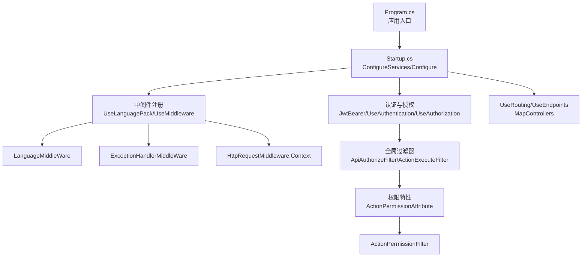
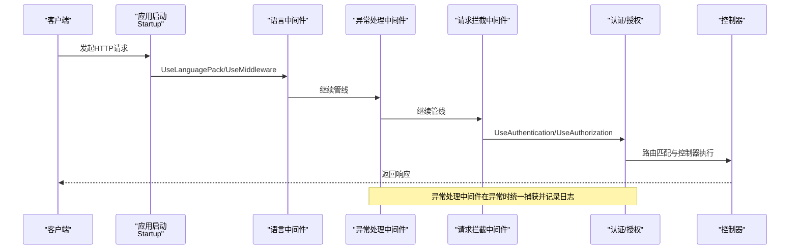
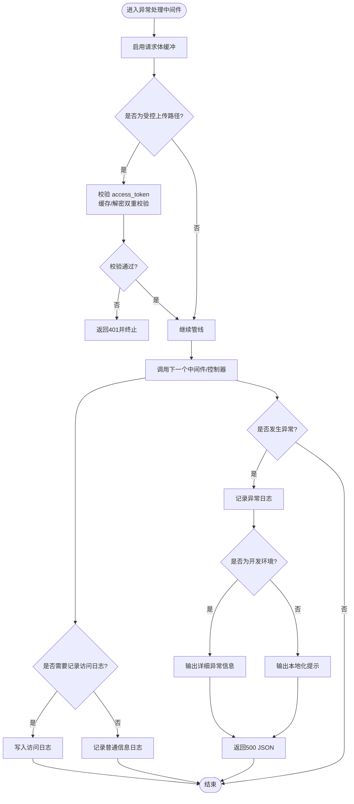
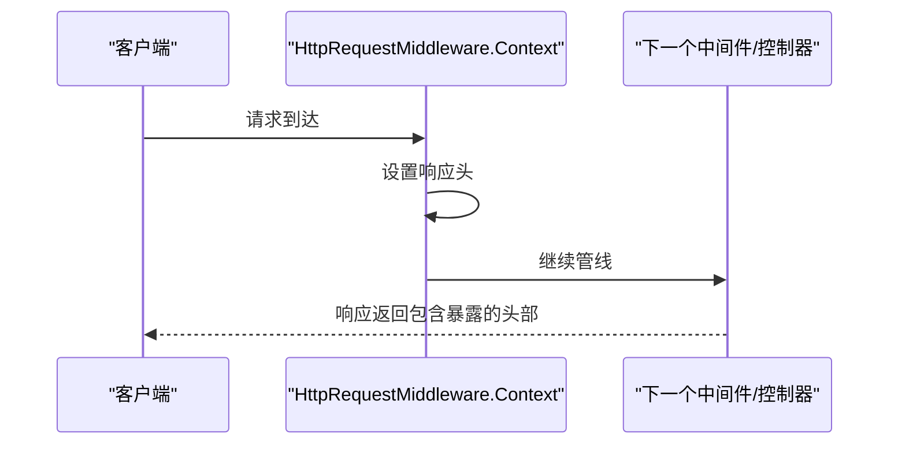
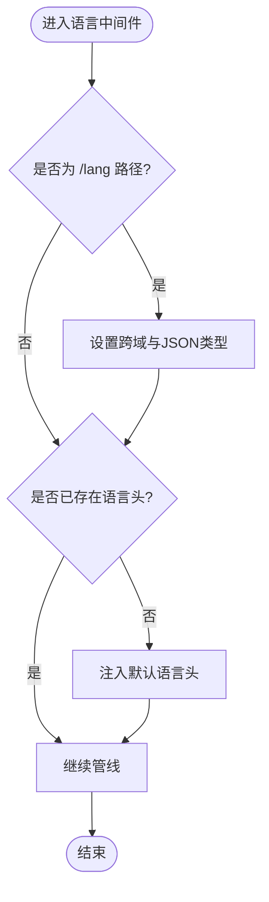
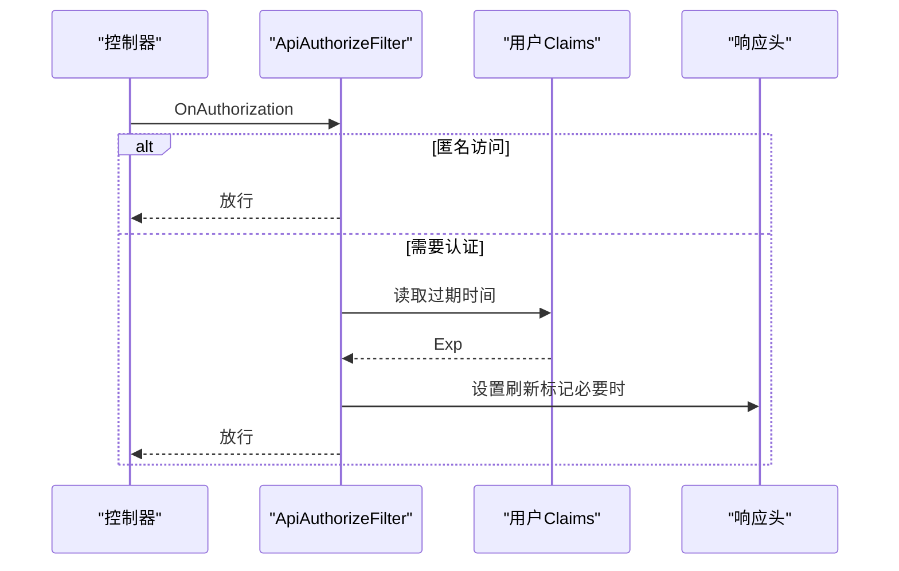
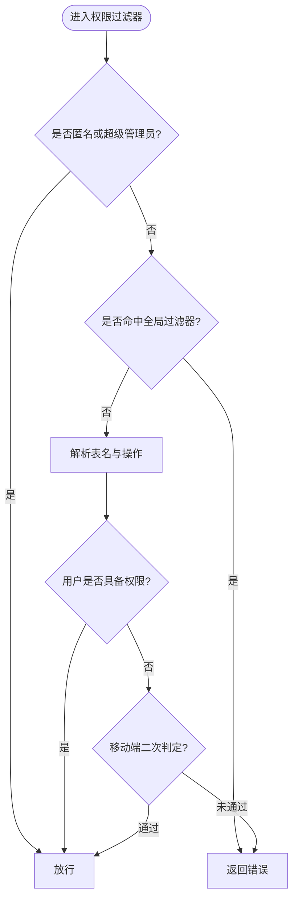
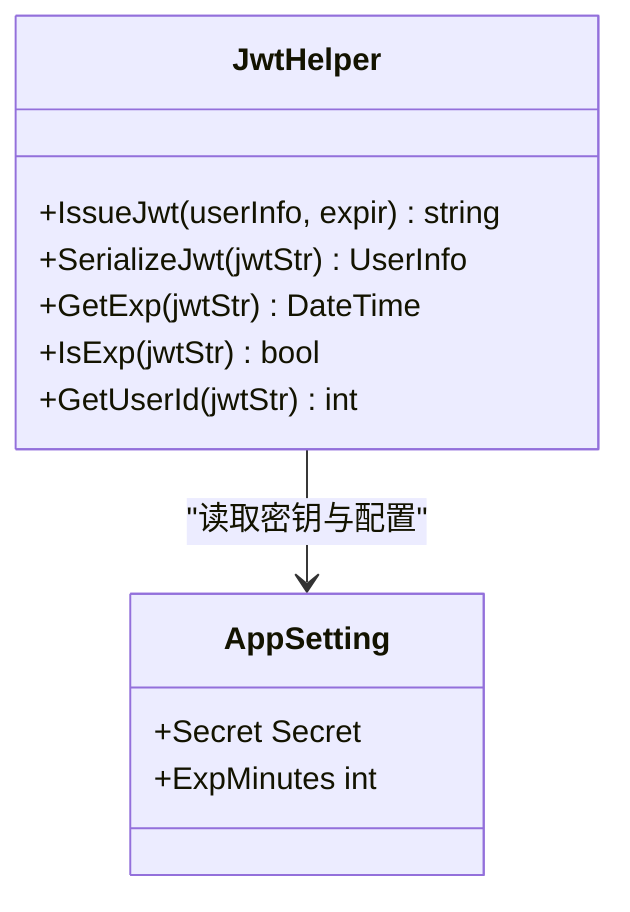
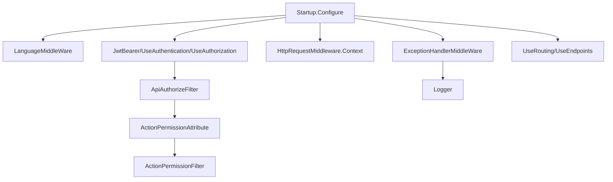

# 中间件与过滤器

<cite>
**本文引用的文件**
- [VolPro.WebApi/Startup.cs](file://VolPro.WebApi/Startup.cs)
- [VolPro.WebApi/Program.cs](file://VolPro.WebApi/Program.cs)
- [VolPro.Core/Middleware/ExceptionHandlerMiddleWare.cs](file://VolPro.Core/Middleware/ExceptionHandlerMiddleWare.cs)
- [VolPro.Core/Middleware/HttpRequestMiddleware.cs](file://VolPro.Core/Middleware/HttpRequestMiddleware.cs)
- [VolPro.Core/Middleware/LanguageMiddleWare.cs](file://VolPro.Core/Middleware/LanguageMiddleWare.cs)
- [VolPro.Core/Filters/ApiAuthorizeFilter.cs](file://VolPro.Core/Filters/ApiAuthorizeFilter.cs)
- [VolPro.Core/Filters/JWTAuthorize.cs](file://VolPro.Core/Filters/JWTAuthorize.cs)
- [VolPro.Core/Filters/ActionPermissionFilter.cs](file://VolPro.Core/Filters/ActionPermissionFilter.cs)
- [VolPro.Core/Filters/ActionPermissionAttribute.cs](file://VolPro.Core/Filters/ActionPermissionAttribute.cs)
- [VolPro.Core/Utilities/JwtHelper.cs](file://VolPro.Core/Utilities/JwtHelper.cs)
- [VolPro.Core/Configuration/AppSetting.cs](file://VolPro.Core/Configuration/AppSetting.cs)
- [VolPro.Core/Enums/ActionPermissionOptions.cs](file://VolPro.Core/Enums/ActionPermissionOptions.cs)
- [VolPro.Core/Services/Logger.cs](file://VolPro.Core/Services/Logger.cs)
</cite>

## 目录
1. [引言](#引言)
2. [项目结构](#项目结构)
3. [核心组件](#核心组件)
4. [架构总览](#架构总览)
5. [详细组件分析](#详细组件分析)
6. [依赖关系分析](#依赖关系分析)
7. [性能考量](#性能考量)
8. [故障排查指南](#故障排查指南)
9. [结论](#结论)

## 引言
本文件面向水化热平台的中间件与过滤器体系，系统性阐述 ASP.NET Core 中间件管道的工作原理与实现模式，重点覆盖以下主题：
- 自定义中间件的开发与注册机制（含执行顺序与异常处理策略）
- 异常处理中间件的实现要点（错误捕获、日志记录、响应格式化）
- 权限控制过滤器的设计（JWT 令牌验证、角色权限检查、操作权限管理）
- 请求拦截中间件的功能（请求预处理、响应后处理、性能监控）
- 中间件链配置最佳实践（顺序、异常处理策略、性能优化）

## 项目结构
围绕中间件与过滤器的关键位置如下：
- Web 应用入口与管线配置：VolPro.WebApi/Startup.cs、VolPro.WebApi/Program.cs
- 核心中间件：VolPro.Core/Middleware/*.cs
- 过滤器与权限模型：VolPro.Core/Filters/*.cs
- 工具与配置：VolPro.Core/Utilities/JwtHelper.cs、VolPro.Core/Configuration/AppSetting.cs
- 日志服务：VolPro.Core/Services/Logger.cs
- 权限枚举：VolPro.Core/Enums/ActionPermissionOptions.cs

图示来源
- [VolPro.WebApi/Program.cs:24-36](file://VolPro.WebApi/Program.cs#L24-L36)
- [VolPro.WebApi/Startup.cs:309-382](file://VolPro.WebApi/Startup.cs#L309-L382)
- [VolPro.WebApi/Startup.cs:60-75](file://VolPro.WebApi/Startup.cs#L60-L75)

章节来源
- [VolPro.WebApi/Program.cs:17-36](file://VolPro.WebApi/Program.cs#L17-L36)
- [VolPro.WebApi/Startup.cs:60-75](file://VolPro.WebApi/Startup.cs#L60-L75)
- [VolPro.WebApi/Startup.cs:309-382](file://VolPro.WebApi/Startup.cs#L309-L382)

## 核心组件
- 异常处理中间件：负责统一捕获异常、记录日志、输出标准化错误响应；并对特定路由（如上传）进行文件访问授权校验。
- 请求拦截中间件：用于在请求链路中注入通用响应头（如 Access-Control-Expose-Headers），便于前端刷新令牌等场景。
- 语言中间件：确保静态资源访问与语言头一致性。
- 认证过滤器：基于 JWT 的授权校验，支持动态刷新标记与固定 Token 场景。
- 权限过滤器与特性：结合用户上下文与权限配置，实现基于表与操作的细粒度权限控制。

章节来源
- [VolPro.Core/Middleware/ExceptionHandlerMiddleWare.cs:20-108](file://VolPro.Core/Middleware/ExceptionHandlerMiddleWare.cs#L20-L108)
- [VolPro.Core/Middleware/HttpRequestMiddleware.cs:10-25](file://VolPro.Core/Middleware/HttpRequestMiddleware.cs#L10-L25)
- [VolPro.Core/Middleware/LanguageMiddleWare.cs:10-31](file://VolPro.Core/Middleware/LanguageMiddleWare.cs#L10-L31)
- [VolPro.Core/Filters/ApiAuthorizeFilter.cs:16-84](file://VolPro.Core/Filters/ApiAuthorizeFilter.cs#L16-L84)
- [VolPro.Core/Filters/ActionPermissionFilter.cs:22-121](file://VolPro.Core/Filters/ActionPermissionFilter.cs#L22-L121)
- [VolPro.Core/Filters/ActionPermissionAttribute.cs:10-94](file://VolPro.Core/Filters/ActionPermissionAttribute.cs#L10-L94)

## 架构总览
下图展示请求在中间件与过滤器中的流转路径与职责分工：

图示来源
- [VolPro.WebApi/Startup.cs:321-365](file://VolPro.WebApi/Startup.cs#L321-L365)
- [VolPro.Core/Middleware/ExceptionHandlerMiddleWare.cs:28-107](file://VolPro.Core/Middleware/ExceptionHandlerMiddleWare.cs#L28-L107)

## 详细组件分析

### 异常处理中间件（ExceptionHandlerMiddleWare）
- 功能要点
  - 在进入下一个中间件之前启用请求体缓冲，以便后续读取请求参数与日志记录。
  - 对特定上传路径进行文件访问授权校验（基于查询参数 access_token 与缓存/解密校验）。
  - 在请求完成后根据端点元数据决定是否记录访问日志。
  - 捕获未处理异常，按环境输出标准化错误响应（JSON），并记录异常日志。
- 关键行为
  - 文件授权：针对 /upload（除特定子路径）进行访问令牌校验，失败返回 401。
  - 日志记录：通过端点元数据 ActionLog 控制是否写入日志；否则统一记录普通信息日志。
  - 错误响应：统一 JSON 结构，开发环境输出完整异常信息，生产环境输出本地化提示。
- 性能与安全
  - 启用请求体缓冲以支持多次读取，需关注内存占用与请求体大小限制。
  - 对敏感路径进行访问控制，避免未授权下载。

图示来源
- [VolPro.Core/Middleware/ExceptionHandlerMiddleWare.cs:28-107](file://VolPro.Core/Middleware/ExceptionHandlerMiddleWare.cs#L28-L107)
- [VolPro.Core/Services/Logger.cs:121-169](file://VolPro.Core/Services/Logger.cs#L121-L169)

章节来源
- [VolPro.Core/Middleware/ExceptionHandlerMiddleWare.cs:20-108](file://VolPro.Core/Middleware/ExceptionHandlerMiddleWare.cs#L20-L108)
- [VolPro.Core/Services/Logger.cs:27-308](file://VolPro.Core/Services/Logger.cs#L27-L308)

### 请求拦截中间件（HttpRequestMiddleware.Context）
- 功能要点
  - 在响应阶段注入 Access-Control-Expose-Headers，便于前端识别刷新令牌信号。
  - 保持对后续中间件/控制器的透明传递。
- 使用方式
  - 通过静态属性 Context 返回一个委托工厂，配合 app.Use(...) 注册。

图示来源
- [VolPro.Core/Middleware/HttpRequestMiddleware.cs:12-24](file://VolPro.Core/Middleware/HttpRequestMiddleware.cs#L12-L24)

章节来源
- [VolPro.Core/Middleware/HttpRequestMiddleware.cs:10-25](file://VolPro.Core/Middleware/HttpRequestMiddleware.cs#L10-L25)

### 语言中间件（LanguageMiddleWare）
- 功能要点
  - 对 /lang 路径设置允许跨域与 JSON 内容类型。
  - 若请求未携带语言头，则注入默认语言。
- 适用场景
  - 静态资源访问的语言一致性保障，避免因缺少语言头导致的默认语言问题。

图示来源
- [VolPro.Core/Middleware/LanguageMiddleWare.cs:17-30](file://VolPro.Core/Middleware/LanguageMiddleWare.cs#L17-L30)

章节来源
- [VolPro.Core/Middleware/LanguageMiddleWare.cs:10-31](file://VolPro.Core/Middleware/LanguageMiddleWare.cs#L10-L31)

### 认证过滤器（ApiAuthorizeFilter）
- 功能要点
  - 支持匿名访问（AllowAnonymous）直接放行。
  - 支持固定 Token 场景与任务型过滤器的组合。
  - 读取用户 Claims 中的过期时间，当剩余有效期小于阈值时，在响应头中设置刷新标记，便于前端触发刷新。
- 与认证中间件协作
  - 与 AddJwtBearer 的 TokenValidationParameters 协同工作，未通过认证时返回 401 JSON。

图示来源
- [VolPro.Core/Filters/ApiAuthorizeFilter.cs:29-82](file://VolPro.Core/Filters/ApiAuthorizeFilter.cs#L29-L82)

章节来源
- [VolPro.Core/Filters/ApiAuthorizeFilter.cs:16-84](file://VolPro.Core/Filters/ApiAuthorizeFilter.cs#L16-L84)

### 权限过滤器与特性（ActionPermissionFilter / ActionPermissionAttribute）
- 设计思路
  - 支持控制器级与 Action 级权限控制，可指定表名、操作类型、角色 ID。
  - 支持系统控制器自动解析表名与操作，或通过特性显式声明。
  - 支持全局过滤器对特定 Action 的限制（演示环境等）。
- 核心流程
  - 若标注 AllowAnonymous 或超级管理员，直接放行。
  - 若命中全局过滤器限制，返回错误。
  - 解析表名与操作，结合用户上下文权限判断。
  - 支持移动端权限二次判定。
  - 最终根据结果写入响应或继续执行。

图示来源
- [VolPro.Core/Filters/ActionPermissionFilter.cs:34-120](file://VolPro.Core/Filters/ActionPermissionFilter.cs#L34-L120)
- [VolPro.Core/Filters/ActionPermissionAttribute.cs:50-87](file://VolPro.Core/Filters/ActionPermissionAttribute.cs#L50-L87)
- [VolPro.Core/Enums/ActionPermissionOptions.cs:7-22](file://VolPro.Core/Enums/ActionPermissionOptions.cs#L7-L22)

章节来源
- [VolPro.Core/Filters/ActionPermissionFilter.cs:22-121](file://VolPro.Core/Filters/ActionPermissionFilter.cs#L22-L121)
- [VolPro.Core/Filters/ActionPermissionAttribute.cs:10-94](file://VolPro.Core/Filters/ActionPermissionAttribute.cs#L10-L94)
- [VolPro.Core/Enums/ActionPermissionOptions.cs:7-22](file://VolPro.Core/Enums/ActionPermissionOptions.cs#L7-L22)

### JWT 工具（JwtHelper）
- 功能要点
  - 生成 JWT（含 Jti、Iat、Nbf、Exp、Iss、Aud 等声明）。
  - 解析 JWT 并提取用户信息与过期时间。
  - 判断 JWT 是否过期。
  - 提供获取用户 ID 的便捷方法。
- 与配置联动
  - 使用 AppSetting.Secret 中的 Issuer、Audience、JWT 密钥等进行签发与验证。

图示来源
- [VolPro.Core/Utilities/JwtHelper.cs:21-94](file://VolPro.Core/Utilities/JwtHelper.cs#L21-L94)
- [VolPro.Core/Configuration/AppSetting.cs:40-64](file://VolPro.Core/Configuration/AppSetting.cs#L40-L64)

章节来源
- [VolPro.Core/Utilities/JwtHelper.cs:13-99](file://VolPro.Core/Utilities/JwtHelper.cs#L13-L99)
- [VolPro.Core/Configuration/AppSetting.cs:13-163](file://VolPro.Core/Configuration/AppSetting.cs#L13-L163)

## 依赖关系分析
- 中间件注册顺序
  - 语言中间件 → 异常处理中间件 → 请求拦截中间件 → 认证/授权 → 路由与端点映射。
- 过滤器与中间件的协作
  - 认证过滤器在授权阶段生效，异常处理中间件在异常时统一兜底。
  - 权限过滤器在 Action 执行前进行权限判定，与控制器特性配合实现细粒度控制。
- 配置与外部依赖
  - JWT 验证依赖 TokenValidationParameters，异常响应依赖 AppSetting 与 Logger。

图示来源
- [VolPro.WebApi/Startup.cs:321-365](file://VolPro.WebApi/Startup.cs#L321-L365)
- [VolPro.Core/Filters/ApiAuthorizeFilter.cs:29-82](file://VolPro.Core/Filters/ApiAuthorizeFilter.cs#L29-L82)
- [VolPro.Core/Filters/ActionPermissionFilter.cs:34-120](file://VolPro.Core/Filters/ActionPermissionFilter.cs#L34-L120)
- [VolPro.Core/Services/Logger.cs:121-169](file://VolPro.Core/Services/Logger.cs#L121-L169)

章节来源
- [VolPro.WebApi/Startup.cs:309-382](file://VolPro.WebApi/Startup.cs#L309-L382)

## 性能考量
- 请求体缓冲
  - 异常处理中间件启用缓冲以支持多次读取，建议结合请求体大小限制与流式处理策略，避免高并发下的内存压力。
- 日志异步化
  - Logger 使用队列与后台线程批量写入，降低对请求路径的影响；建议监控队列长度与写入延迟。
- 中间件顺序
  - 将轻量中间件（如语言、请求拦截）置于异常处理之前，减少异常路径的开销。
- 认证与权限
  - JWT 验证与权限查询应尽量缓存关键数据，避免重复计算；对热点接口可考虑短时缓存用户权限集合。

## 故障排查指南
- 401 未授权
  - 检查请求头 Authorization 是否正确携带 Bearer Token；确认 JwtBearer 的 TokenValidationParameters 配置与密钥一致。
  - 对于上传文件访问，确认 access_token 查询参数与缓存/解密逻辑。
- 500 服务器异常
  - 查看异常日志输出与 Logger 队列写入情况；定位具体 Action 与异常堆栈。
- 权限不足
  - 确认 ActionPermissionAttribute 的表名、操作类型与角色 ID 配置是否正确；检查用户上下文权限集合。
- 刷新令牌未触发
  - 检查 ApiAuthorizeFilter 是否在响应头中设置了刷新标记；确认前端是否监听该标记并发起刷新流程。

章节来源
- [VolPro.Core/Middleware/ExceptionHandlerMiddleWare.cs:90-106](file://VolPro.Core/Middleware/ExceptionHandlerMiddleWare.cs#L90-L106)
- [VolPro.Core/Filters/ApiAuthorizeFilter.cs:75-81](file://VolPro.Core/Filters/ApiAuthorizeFilter.cs#L75-L81)
- [VolPro.Core/Services/Logger.cs:172-206](file://VolPro.Core/Services/Logger.cs#L172-L206)

## 结论
本中间件与过滤器体系通过明确的职责划分与可配置的执行顺序，实现了从语言与静态资源处理、异常统一兜底、JWT 授权校验到细粒度权限控制的全链路安全与可观测性。建议在生产环境中结合缓存、限流与日志策略，持续优化中间件链路的性能与稳定性。