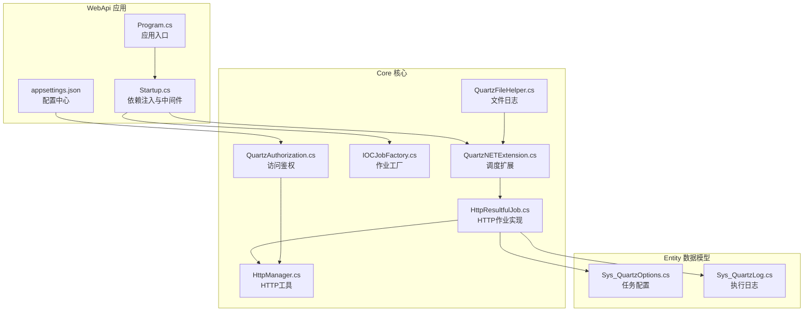
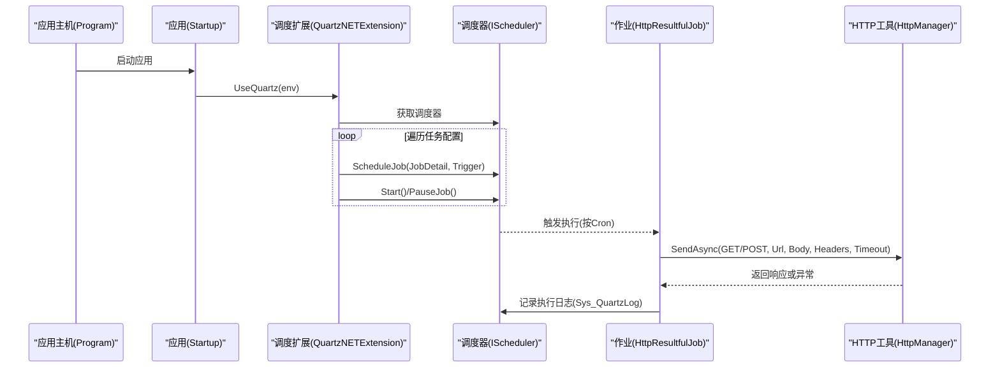
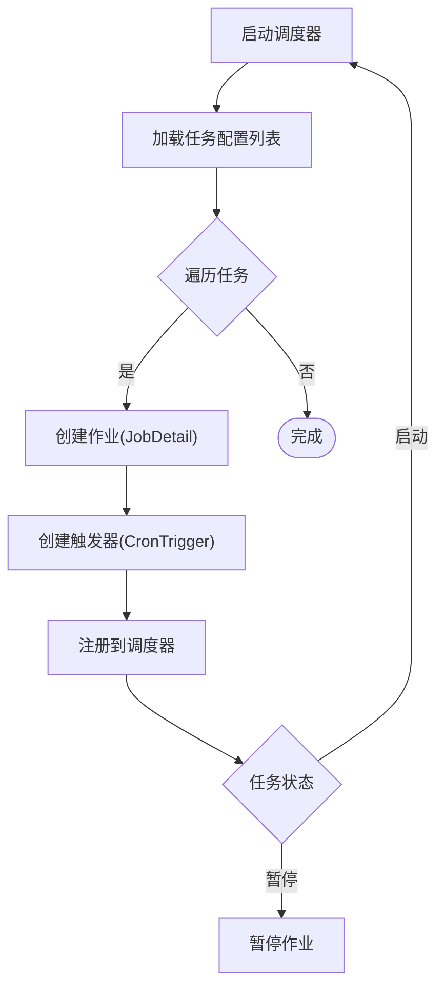
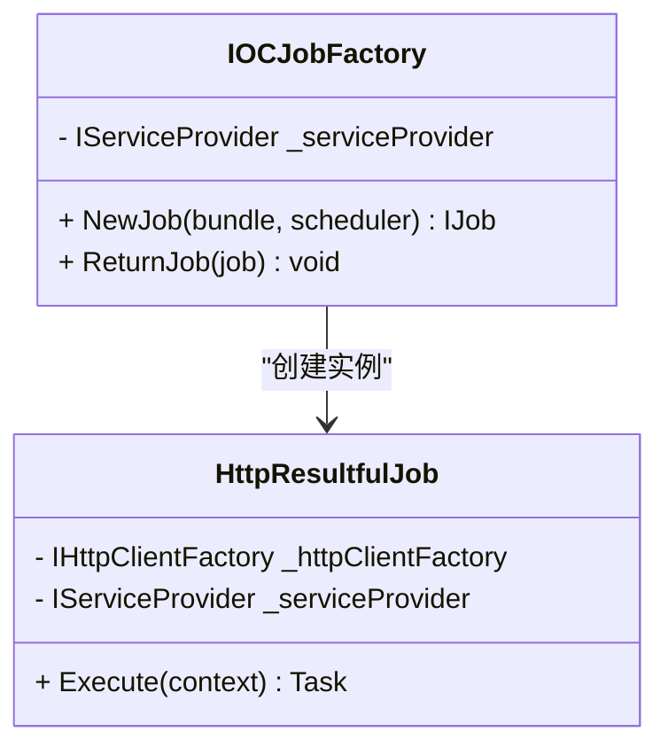
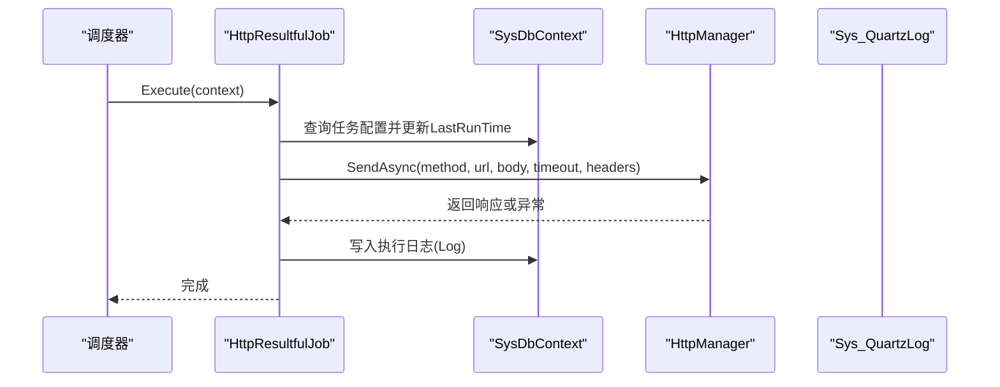
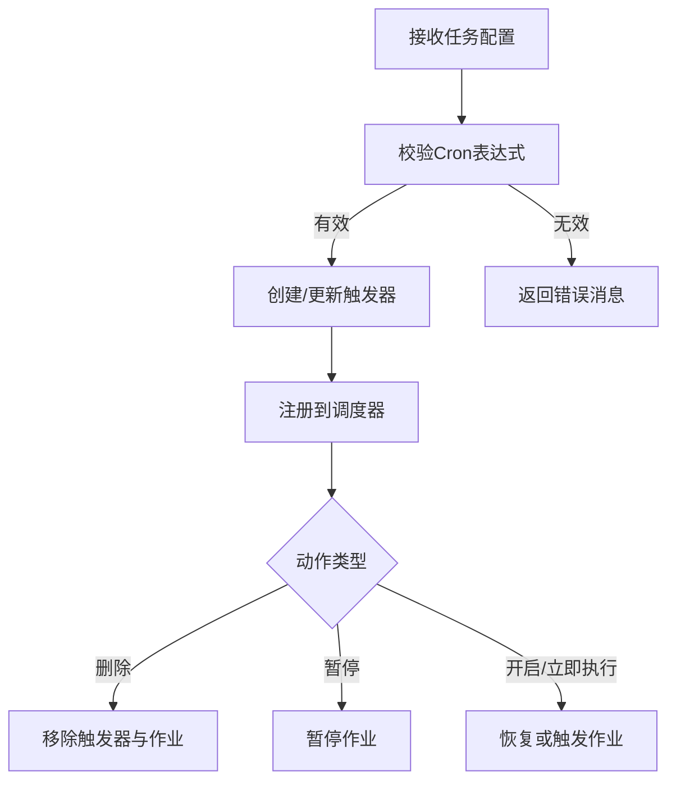
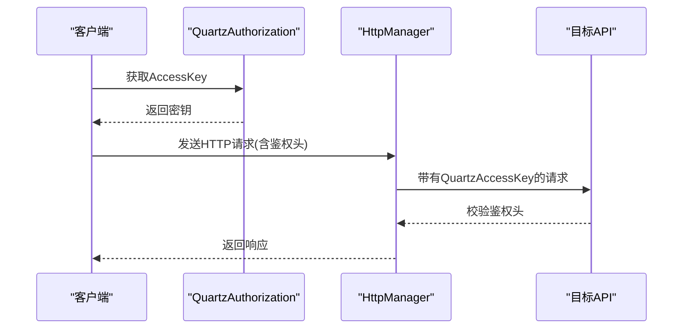
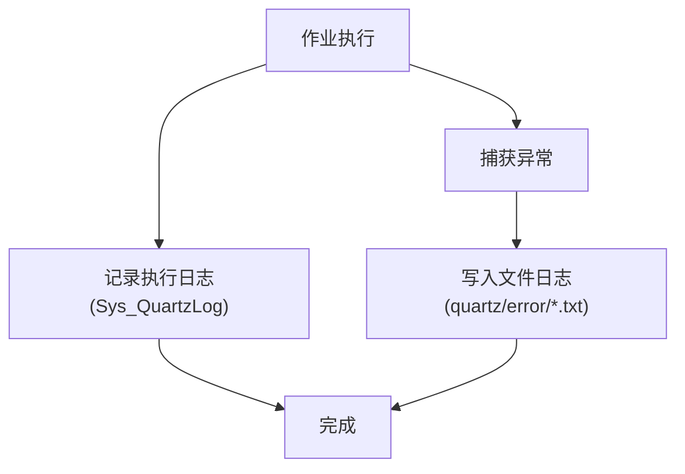
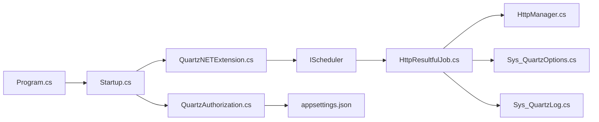

# 任务调度

<cite>
**本文引用的文件**
- [Program.cs](file://VolPro.WebApi/Program.cs)
- [Startup.cs](file://VolPro.WebApi/Startup.cs)
- [appsettings.json](file://VolPro.WebApi/appsettings.json)
- [QuartzNETExtension.cs](file://VolPro.Core/Quartz/QuartzNETExtension.cs)
- [HttpResultfulJob.cs](file://VolPro.Core/Quartz/HttpResultfulJob.cs)
- [HttpManager.cs](file://VolPro.Core/Quartz/HttpManager.cs)
- [IOCJobFactory.cs](file://VolPro.Core/Quartz/IOCJobFactory.cs)
- [QuartzAuthorization.cs](file://VolPro.Core/Quartz/QuartzAuthorization.cs)
- [QuartzFileHelper.cs](file://VolPro.Core/Quartz/QuartzFileHelper.cs)
- [Sys_QuartzOptions.cs](file://VolPro.Entity/DomainModels/Quartz/Sys_QuartzOptions.cs)
- [Sys_QuartzLog.cs](file://VolPro.Entity/DomainModels/Quartz/Sys_QuartzLog.cs)
- [JobAction.cs](file://VolPro.Core/Quartz/JobAction.cs)
</cite>

## 目录
1. [简介](#简介)
2. [项目结构](#项目结构)
3. [核心组件](#核心组件)
4. [架构总览](#架构总览)
5. [详细组件分析](#详细组件分析)
6. [依赖关系分析](#依赖关系分析)
7. [性能考量](#性能考量)
8. [故障排查指南](#故障排查指南)
9. [结论](#结论)
10. [附录](#附录)

## 简介
本文件面向“水化热平台”的任务调度系统，围绕 Quartz.NET 的集成与配置展开，重点涵盖：
- 调度器初始化、作业工厂与触发器管理
- 定时任务的 Cron 表达式配置、执行策略与并发控制
- HTTP 作业的远程 API 调用、结果处理与错误重试
- 任务监控与管理：作业状态跟踪、执行历史记录与性能指标
- 配置管理：调度参数、执行环境与资源限制
- 故障恢复：作业重试、死信队列与异常处理

## 项目结构
任务调度相关代码主要分布在以下模块：
- WebApi 层：应用启动、依赖注入、中间件与 Quartz 初始化入口
- Core 层：Quartz 扩展、作业实现、HTTP 工具、作业工厂、鉴权与日志辅助
- Entity 层：定时任务与执行日志的数据模型

图表来源
- [Program.cs:17-38](file://VolPro.WebApi/Program.cs#L17-L38)
- [Startup.cs:60-213](file://VolPro.WebApi/Startup.cs#L60-L213)
- [QuartzNETExtension.cs:32-50](file://VolPro.Core/Quartz/QuartzNETExtension.cs#L32-L50)
- [HttpResultfulJob.cs:29-120](file://VolPro.Core/Quartz/HttpResultfulJob.cs#L29-L120)
- [HttpManager.cs:17-75](file://VolPro.Core/Quartz/HttpManager.cs#L17-L75)
- [IOCJobFactory.cs:10-28](file://VolPro.Core/Quartz/IOCJobFactory.cs#L10-L28)
- [QuartzAuthorization.cs:13-69](file://VolPro.Core/Quartz/QuartzAuthorization.cs#L13-L69)
- [QuartzFileHelper.cs:10-37](file://VolPro.Core/Quartz/QuartzFileHelper.cs#L10-L37)
- [Sys_QuartzOptions.cs:17-185](file://VolPro.Entity/DomainModels/Quartz/Sys_QuartzOptions.cs#L17-L185)
- [Sys_QuartzLog.cs:17-147](file://VolPro.Entity/DomainModels/Quartz/Sys_QuartzLog.cs#L17-L147)

章节来源
- [Program.cs:17-38](file://VolPro.WebApi/Program.cs#L17-L38)
- [Startup.cs:60-213](file://VolPro.WebApi/Startup.cs#L60-L213)

## 核心组件
- 调度扩展与初始化：负责加载任务配置、构建作业与触发器、注册作业工厂、启动调度器
- HTTP 作业：封装远程 API 调用、参数传递、鉴权头、超时控制与执行日志
- HTTP 工具：统一的异步 HTTP 发送封装，支持 GET/POST、JSON 内容类型与自定义头
- 作业工厂：基于 ASP.NET Core 依赖注入容器创建作业实例
- 访问鉴权：基于配置的密钥校验，防止非法调用
- 文件日志：将异常与关键信息落盘，便于问题定位
- 数据模型：Sys_QuartzOptions（任务配置）、Sys_QuartzLog（执行日志）

章节来源
- [QuartzNETExtension.cs:22-50](file://VolPro.Core/Quartz/QuartzNETExtension.cs#L22-L50)
- [HttpResultfulJob.cs:19-120](file://VolPro.Core/Quartz/HttpResultfulJob.cs#L19-L120)
- [HttpManager.cs:14-75](file://VolPro.Core/Quartz/HttpManager.cs#L14-L75)
- [IOCJobFactory.cs:10-28](file://VolPro.Core/Quartz/IOCJobFactory.cs#L10-L28)
- [QuartzAuthorization.cs:13-69](file://VolPro.Core/Quartz/QuartzAuthorization.cs#L13-L69)
- [QuartzFileHelper.cs:10-37](file://VolPro.Core/Quartz/QuartzFileHelper.cs#L10-L37)
- [Sys_QuartzOptions.cs:17-185](file://VolPro.Entity/DomainModels/Quartz/Sys_QuartzOptions.cs#L17-L185)
- [Sys_QuartzLog.cs:17-147](file://VolPro.Entity/DomainModels/Quartz/Sys_QuartzLog.cs#L17-L147)

## 架构总览
系统通过 Startup 注册 Quartz 依赖，使用 StdSchedulerFactory 创建调度器，通过 IOCJobFactory 将作业交由 DI 容器管理；调度扩展负责将数据库中的任务配置转换为 Quartz 的 JobDetail 与 CronTrigger，并根据任务状态决定启动或暂停。

图表来源
- [Program.cs:17-38](file://VolPro.WebApi/Program.cs#L17-L38)
- [Startup.cs:309-383](file://VolPro.WebApi/Startup.cs#L309-L383)
- [QuartzNETExtension.cs:32-50](file://VolPro.Core/Quartz/QuartzNETExtension.cs#L32-L50)
- [QuartzNETExtension.cs:87-160](file://VolPro.Core/Quartz/QuartzNETExtension.cs#L87-L160)
- [HttpResultfulJob.cs:34-120](file://VolPro.Core/Quartz/HttpResultfulJob.cs#L34-L120)
- [HttpManager.cs:17-75](file://VolPro.Core/Quartz/HttpManager.cs#L17-L75)

## 详细组件分析

### Quartz 调度扩展与初始化
- 初始化入口：在 Configure 中调用 UseQuartz，从数据库加载 Sys_QuartzOptions 列表并逐个注册到调度器
- 作业与触发器：使用 JobBuilder 与 TriggerBuilder 创建 JobDetail 与 CronTrigger，分组固定为 group
- 作业工厂：若提供 IJobFactory，则设置到调度器，确保作业由 DI 容器创建
- 状态控制：根据任务 Status 决定是否立即启动或暂停作业
- 表达式校验：提供 IsValidExpression 辅助方法，确保 Cron 表达式有效

图表来源
- [QuartzNETExtension.cs:32-50](file://VolPro.Core/Quartz/QuartzNETExtension.cs#L32-L50)
- [QuartzNETExtension.cs:87-160](file://VolPro.Core/Quartz/QuartzNETExtension.cs#L87-L160)
- [QuartzNETExtension.cs:360-373](file://VolPro.Core/Quartz/QuartzNETExtension.cs#L360-L373)

章节来源
- [QuartzNETExtension.cs:22-50](file://VolPro.Core/Quartz/QuartzNETExtension.cs#L22-L50)
- [QuartzNETExtension.cs:87-160](file://VolPro.Core/Quartz/QuartzNETExtension.cs#L87-L160)
- [QuartzNETExtension.cs:360-373](file://VolPro.Core/Quartz/QuartzNETExtension.cs#L360-L373)

### 作业工厂与依赖注入
- 作用：让 Quartz 使用 ASP.NET Core 的 IServiceProvider 创建作业实例，从而注入 IHttpClientFactory、IServiceProvider 等
- 生命周期：ReturnJob 在作业释放时调用 IDisposable.Dispose

图表来源
- [IOCJobFactory.cs:10-28](file://VolPro.Core/Quartz/IOCJobFactory.cs#L10-L28)
- [HttpResultfulJob.cs:19-34](file://VolPro.Core/Quartz/HttpResultfulJob.cs#L19-L34)

章节来源
- [IOCJobFactory.cs:10-28](file://VolPro.Core/Quartz/IOCJobFactory.cs#L10-L28)
- [Startup.cs:184-186](file://VolPro.WebApi/Startup.cs#L184-L186)

### HTTP 作业执行流程
- 参数解析：从 JobExecutionContext 获取 Sys_QuartzOptions，包含 API 地址、方法、超时、鉴权头、POST 数据等
- 最终一致性更新：先更新 LastRunTime，再发起 HTTP 请求
- 结果记录：无论成功与否均写入 Sys_QuartzLog，包含耗时、开始/结束时间、结果标志与异常信息
- 鉴权头：自动附加 QuartzAuthorization.Key 对应的 AccessKey

图表来源
- [HttpResultfulJob.cs:34-120](file://VolPro.Core/Quartz/HttpResultfulJob.cs#L34-L120)
- [HttpManager.cs:17-75](file://VolPro.Core/Quartz/HttpManager.cs#L17-L75)
- [Sys_QuartzLog.cs:18-147](file://VolPro.Entity/DomainModels/Quartz/Sys_QuartzLog.cs#L18-L147)

章节来源
- [HttpResultfulJob.cs:34-120](file://VolPro.Core/Quartz/HttpResultfulJob.cs#L34-L120)
- [Sys_QuartzOptions.cs:17-185](file://VolPro.Entity/DomainModels/Quartz/Sys_QuartzOptions.cs#L17-L185)

### Cron 表达式与触发器管理
- 表达式校验：IsValidExpression 通过 CronTriggerImpl 计算首次触发时间，判断表达式有效性
- 触发器更新：Update 动作会重建 CronTrigger 并 Reschedule
- 状态切换：支持删除、暂停、开启、立即执行等动作，内部通过 TriggerAction 统一处理

图表来源
- [QuartzNETExtension.cs:107-123](file://VolPro.Core/Quartz/QuartzNETExtension.cs#L107-L123)
- [QuartzNETExtension.cs:229-326](file://VolPro.Core/Quartz/QuartzNETExtension.cs#L229-L326)
- [QuartzNETExtension.cs:360-373](file://VolPro.Core/Quartz/QuartzNETExtension.cs#L360-L373)

章节来源
- [QuartzNETExtension.cs:107-123](file://VolPro.Core/Quartz/QuartzNETExtension.cs#L107-L123)
- [QuartzNETExtension.cs:229-326](file://VolPro.Core/Quartz/QuartzNETExtension.cs#L229-L326)
- [QuartzNETExtension.cs:360-373](file://VolPro.Core/Quartz/QuartzNETExtension.cs#L360-L373)

### 访问鉴权与安全
- 密钥来源：优先从配置读取 QuartzAccessKey，否则生成随机值并结合用户密钥计算 MD5
- 校验逻辑：请求头需携带 QuartzAccessKey，值需与服务端计算一致，否则返回 401
- 默认头：HttpManager 在发送请求时自动附加该鉴权头

图表来源
- [QuartzAuthorization.cs:13-69](file://VolPro.Core/Quartz/QuartzAuthorization.cs#L13-L69)
- [HttpManager.cs:34-42](file://VolPro.Core/Quartz/HttpManager.cs#L34-L42)
- [appsettings.json:130](file://VolPro.WebApi/appsettings.json#L130)

章节来源
- [QuartzAuthorization.cs:13-69](file://VolPro.Core/Quartz/QuartzAuthorization.cs#L13-L69)
- [HttpManager.cs:34-42](file://VolPro.Core/Quartz/HttpManager.cs#L34-L42)
- [appsettings.json:130](file://VolPro.WebApi/appsettings.json#L130)

### 日志与文件输出
- 执行日志：HttpResultfulJob 在 finally 中写入 Sys_QuartzLog，包含任务标识、耗时、开始/结束时间、结果与异常
- 文件日志：QuartzFileHelper 提供 OK/Error 方法，将异常信息写入 quartz/error 或 quartz/log 文件

图表来源
- [HttpResultfulJob.cs:95-119](file://VolPro.Core/Quartz/HttpResultfulJob.cs#L95-L119)
- [QuartzFileHelper.cs:17-37](file://VolPro.Core/Quartz/QuartzFileHelper.cs#L17-L37)

章节来源
- [HttpResultfulJob.cs:95-119](file://VolPro.Core/Quartz/HttpResultfulJob.cs#L95-L119)
- [QuartzFileHelper.cs:17-37](file://VolPro.Core/Quartz/QuartzFileHelper.cs#L17-L37)

### 数据模型与字段说明
- Sys_QuartzOptions：任务配置，包含任务名、分组、请求方式、超时、Cron 表达式、API 地址、鉴权头、描述、最后执行时间、状态等
- Sys_QuartzLog：执行日志，包含任务标识、任务名、耗时、开始/结束时间、结果、响应内容、异常信息等

章节来源
- [Sys_QuartzOptions.cs:17-185](file://VolPro.Entity/DomainModels/Quartz/Sys_QuartzOptions.cs#L17-L185)
- [Sys_QuartzLog.cs:17-147](file://VolPro.Entity/DomainModels/Quartz/Sys_QuartzLog.cs#L17-L147)

## 依赖关系分析
- 启动阶段：Program -> Startup -> UseQuartz -> QuartzNETExtension
- 运行阶段：QuartzNETExtension -> SchedulerFactory -> Scheduler -> JobDetail/Trigger -> HttpResultfulJob -> HttpManager
- 配置与安全：Startup 注入 QuartzAuthorization 与配置，HttpManager 自动附加鉴权头

图表来源
- [Program.cs:17-38](file://VolPro.WebApi/Program.cs#L17-L38)
- [Startup.cs:60-213](file://VolPro.WebApi/Startup.cs#L60-L213)
- [QuartzNETExtension.cs:32-50](file://VolPro.Core/Quartz/QuartzNETExtension.cs#L32-L50)
- [HttpResultfulJob.cs:19-120](file://VolPro.Core/Quartz/HttpResultfulJob.cs#L19-L120)
- [HttpManager.cs:17-75](file://VolPro.Core/Quartz/HttpManager.cs#L17-L75)
- [Sys_QuartzOptions.cs:17-185](file://VolPro.Entity/DomainModels/Quartz/Sys_QuartzOptions.cs#L17-L185)
- [Sys_QuartzLog.cs:17-147](file://VolPro.Entity/DomainModels/Quartz/Sys_QuartzLog.cs#L17-L147)
- [QuartzAuthorization.cs:13-69](file://VolPro.Core/Quartz/QuartzAuthorization.cs#L13-L69)
- [appsettings.json:130](file://VolPro.WebApi/appsettings.json#L130)

章节来源
- [Startup.cs:60-213](file://VolPro.WebApi/Startup.cs#L60-L213)
- [QuartzNETExtension.cs:32-50](file://VolPro.Core/Quartz/QuartzNETExtension.cs#L32-L50)

## 性能考量
- 并发控制：默认 Quartz 作业无内置并发限制，可通过作业实现内部互斥或外部锁避免重复执行
- 超时控制：HttpManager 支持设置超时时间，建议根据 API 实际耗时合理配置
- 资源限制：Kestrel 在 Program 中设置了请求体大小限制，避免过大请求导致内存压力
- 日志落盘：文件日志仅在异常时写入，日常高频执行建议关注磁盘 IO

章节来源
- [HttpManager.cs:21-46](file://VolPro.Core/Quartz/HttpManager.cs#L21-L46)
- [Program.cs:28-34](file://VolPro.WebApi/Program.cs#L28-L34)

## 故障排查指南
- 表达式无效：检查 Cron 表达式是否符合 Quartz 规范，使用 IsValidExpression 辅助校验
- 无法启动：确认任务 Status 与调度器状态，必要时调用 Start 或 Pause
- 鉴权失败：核对请求头 QuartzAccessKey 与服务端配置一致
- 日志定位：查看 quartz/error/*.txt 与 Sys_QuartzLog 表记录，定位异常与耗时
- HTTP 异常：检查目标 API 可达性、超时设置与网络状况

章节来源
- [QuartzNETExtension.cs:107-123](file://VolPro.Core/Quartz/QuartzNETExtension.cs#L107-L123)
- [QuartzNETExtension.cs:360-373](file://VolPro.Core/Quartz/QuartzNETExtension.cs#L360-L373)
- [QuartzAuthorization.cs:53-67](file://VolPro.Core/Quartz/QuartzAuthorization.cs#L53-L67)
- [QuartzFileHelper.cs:17-37](file://VolPro.Core/Quartz/QuartzFileHelper.cs#L17-L37)
- [Sys_QuartzLog.cs:18-147](file://VolPro.Entity/DomainModels/Quartz/Sys_QuartzLog.cs#L18-L147)

## 结论
该任务调度系统以 Quartz.NET 为核心，结合 ASP.NET Core 的依赖注入与配置体系，实现了对 HTTP 作业的统一调度与管理。通过 Sys_QuartzOptions 与 Sys_QuartzLog 的数据模型，系统具备完善的任务配置、执行监控与日志记录能力。建议在生产环境中进一步增强并发控制、重试与死信队列机制，以提升稳定性与可观测性。

## 附录
- 配置项参考
  - QuartzAccessKey：定时任务访问密钥
  - CorsUrls：允许跨域的前端地址列表
  - Connection.*：数据库连接与缓存配置
- 常用操作
  - 新增/修改/删除/暂停/启动/立即执行：通过 TriggerAction 统一处理
  - Cron 表达式校验：使用 IsValidExpression

章节来源
- [appsettings.json:130](file://VolPro.WebApi/appsettings.json#L130)
- [QuartzNETExtension.cs:229-326](file://VolPro.Core/Quartz/QuartzNETExtension.cs#L229-L326)
- [QuartzNETExtension.cs:360-373](file://VolPro.Core/Quartz/QuartzNETExtension.cs#L360-L373)
- [JobAction.cs:7-16](file://VolPro.Core/Quartz/JobAction.cs#L7-L16)