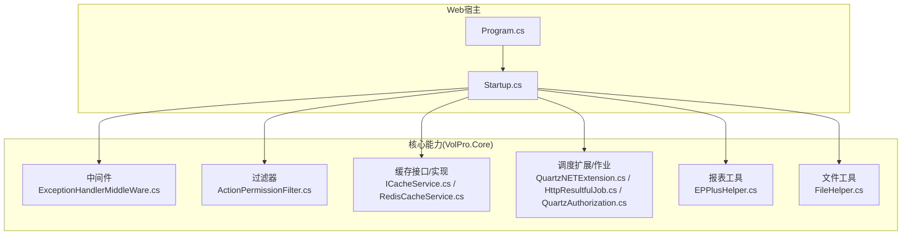
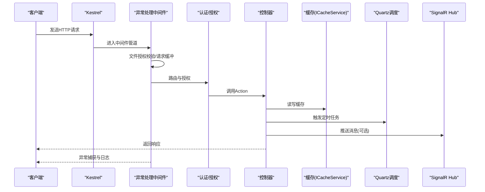
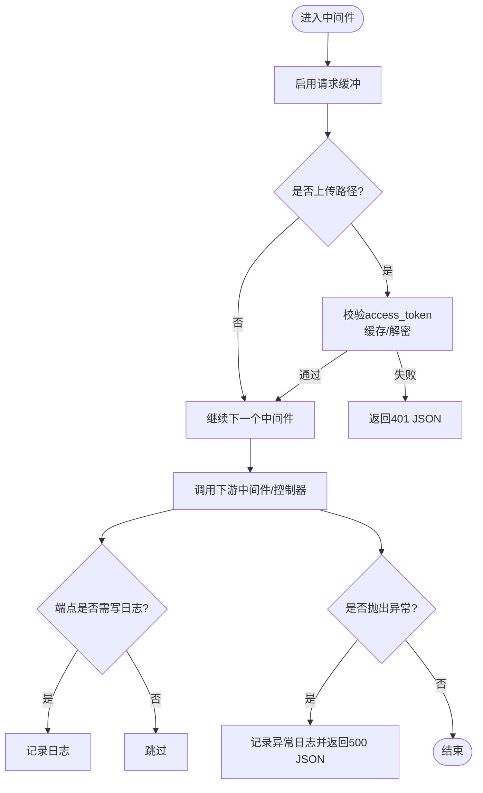
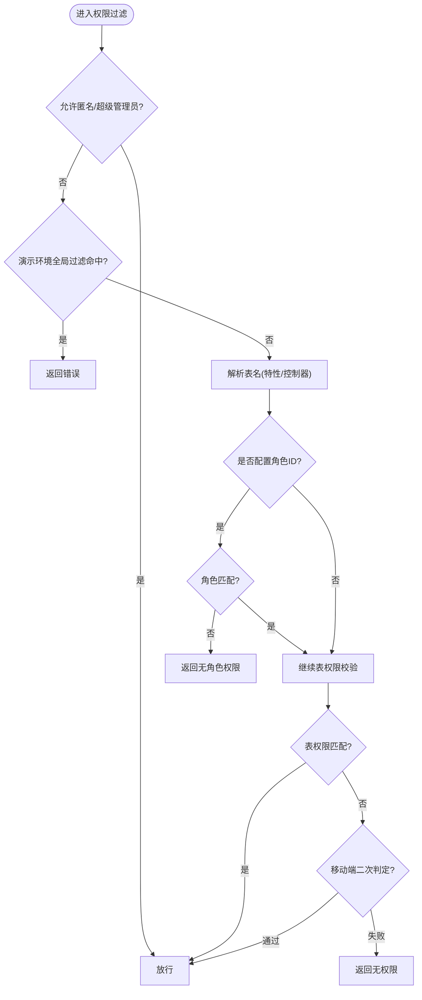
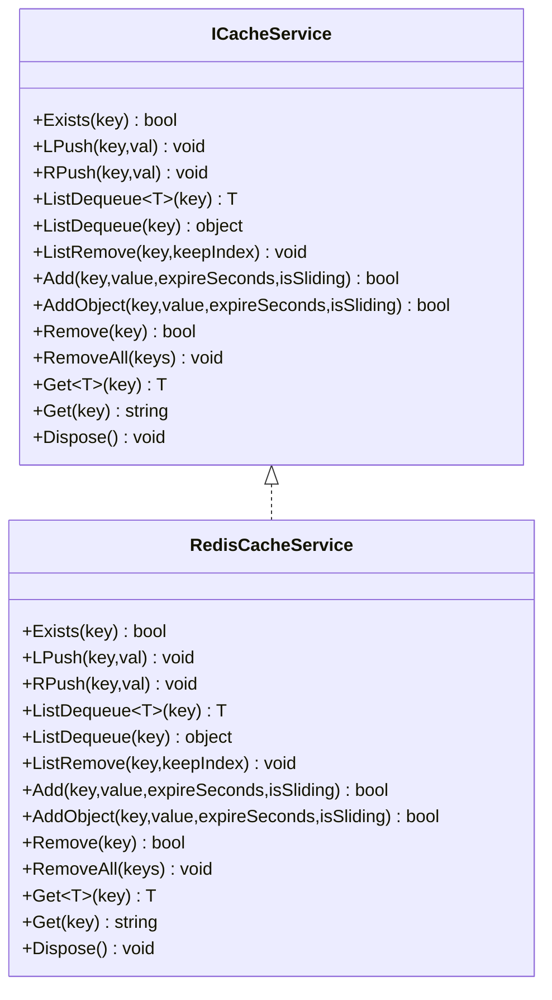
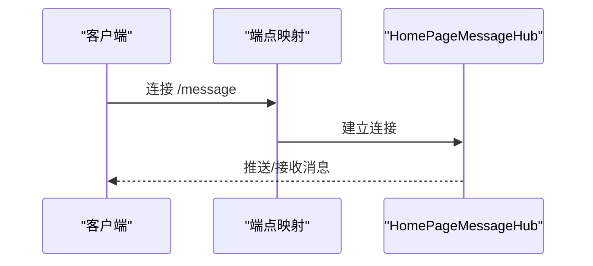
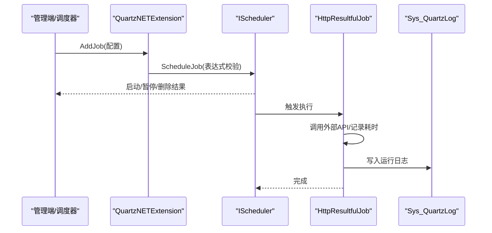
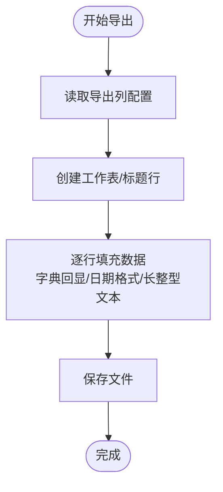
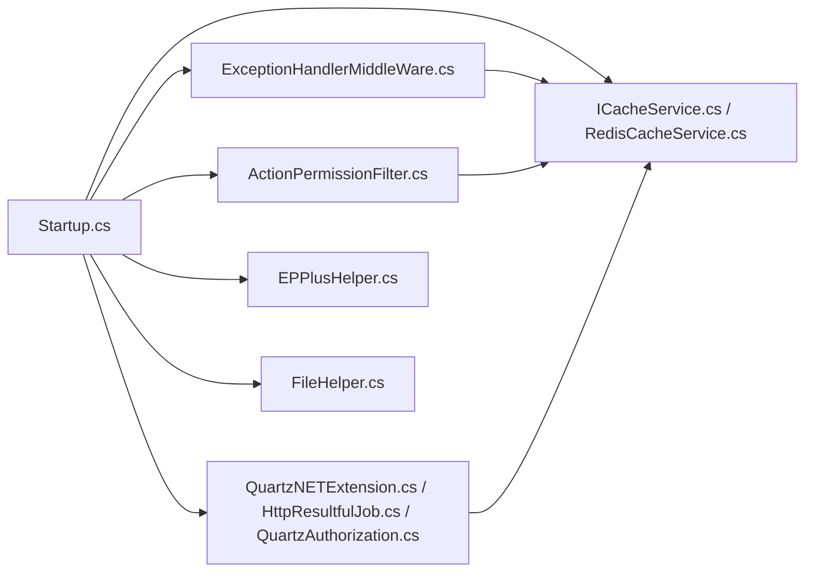

# 基础设施组件

<cite>
**本文引用的文件**
- [Program.cs](file://VolPro.WebApi/Program.cs)
- [Startup.cs](file://VolPro.WebApi/Startup.cs)
- [ExceptionHandlerMiddleWare.cs](file://VolPro.Core/Middleware/ExceptionHandlerMiddleWare.cs)
- [ActionPermissionFilter.cs](file://VolPro.Core/Filters/ActionPermissionFilter.cs)
- [ICacheService.cs](file://VolPro.Core/CacheManager/IService/ICacheService.cs)
- [RedisCacheService.cs](file://VolPro.Core/CacheManager/Service/RedisCacheService.cs)
- [QuartzNETExtension.cs](file://VolPro.Core/Quartz/QuartzNETExtension.cs)
- [HttpResultfulJob.cs](file://VolPro.Core/Quartz/HttpResultfulJob.cs)
- [QuartzAuthorization.cs](file://VolPro.Core/Quartz/QuartzAuthorization.cs)
- [EPPlusHelper.cs](file://VolPro.Core/Utilities/EPPlusHelper.cs)
- [FileHelper.cs](file://VolPro.Core/Utilities/FileHelper.cs)
</cite>

## 目录
1. [简介](#简介)
2. [项目结构](#项目结构)
3. [核心组件](#核心组件)
4. [架构总览](#架构总览)
5. [详细组件分析](#详细组件分析)
6. [依赖关系分析](#依赖关系分析)
7. [性能考量](#性能考量)
8. [故障排查指南](#故障排查指南)
9. [结论](#结论)
10. [附录](#附录)

## 简介
本文件面向“水化热平台”的基础设施组件，系统性梳理中间件与过滤器、缓存系统、实时通信、任务调度、文件与报表处理、以及性能监控与日志记录的实现与配置要点。文档以代码为依据，结合流程图与序列图，帮助开发者快速理解并高效运维。

## 项目结构
- Web宿主入口位于 VolPro.WebApi，包含 Program 与 Startup，负责 Kestrel、Autofac 容器、认证鉴权、CORS、Swagger、SignalR、Quartz 调度、静态文件与中间件管线装配。
- 核心能力集中在 VolPro.Core，涵盖中间件、过滤器、缓存、Quartz 调度、报表工具与文件工具等。

图表来源
- [Program.cs:1-39](file://VolPro.WebApi/Program.cs#L1-L39)
- [Startup.cs:1-407](file://VolPro.WebApi/Startup.cs#L1-L407)
- [ExceptionHandlerMiddleWare.cs:1-110](file://VolPro.Core/Middleware/ExceptionHandlerMiddleWare.cs#L1-L110)
- [ActionPermissionFilter.cs:1-123](file://VolPro.Core/Filters/ActionPermissionFilter.cs#L1-L123)
- [ICacheService.cs:1-96](file://VolPro.Core/CacheManager/IService/ICacheService.cs#L1-L96)
- [RedisCacheService.cs:1-120](file://VolPro.Core/CacheManager/Service/RedisCacheService.cs#L1-L120)
- [QuartzNETExtension.cs:1-377](file://VolPro.Core/Quartz/QuartzNETExtension.cs#L1-L377)
- [HttpResultfulJob.cs:1-135](file://VolPro.Core/Quartz/HttpResultfulJob.cs#L1-L135)
- [QuartzAuthorization.cs:1-70](file://VolPro.Core/Quartz/QuartzAuthorization.cs#L1-L70)
- [EPPlusHelper.cs:1-738](file://VolPro.Core/Utilities/EPPlusHelper.cs#L1-L738)
- [FileHelper.cs:1-340](file://VolPro.Core/Utilities/FileHelper.cs#L1-L340)

章节来源
- [Program.cs:1-39](file://VolPro.WebApi/Program.cs#L1-L39)
- [Startup.cs:1-407](file://VolPro.WebApi/Startup.cs#L1-L407)

## 核心组件
- 中间件与过滤器：统一异常处理、文件授权校验、权限拦截与日志记录。
- 缓存系统：抽象接口与 Redis 实现，支持键值缓存与列表操作。
- 任务调度：基于 Quartz.NET 的 HTTP 结果型作业，支持表达式校验、启停与日志记录。
- 报表与文件：EPPlus 导出/导入、通用模板导出、文件读写与目录管理。
- 实时通信：SignalR Hub 配置与跨域策略。

章节来源
- [ExceptionHandlerMiddleWare.cs:1-110](file://VolPro.Core/Middleware/ExceptionHandlerMiddleWare.cs#L1-L110)
- [ActionPermissionFilter.cs:1-123](file://VolPro.Core/Filters/ActionPermissionFilter.cs#L1-L123)
- [ICacheService.cs:1-96](file://VolPro.Core/CacheManager/IService/ICacheService.cs#L1-L96)
- [RedisCacheService.cs:1-120](file://VolPro.Core/CacheManager/Service/RedisCacheService.cs#L1-L120)
- [QuartzNETExtension.cs:1-377](file://VolPro.Core/Quartz/QuartzNETExtension.cs#L1-L377)
- [HttpResultfulJob.cs:1-135](file://VolPro.Core/Quartz/HttpResultfulJob.cs#L1-L135)
- [EPPlusHelper.cs:1-738](file://VolPro.Core/Utilities/EPPlusHelper.cs#L1-L738)
- [FileHelper.cs:1-340](file://VolPro.Core/Utilities/FileHelper.cs#L1-L340)
- [Startup.cs:180-382](file://VolPro.WebApi/Startup.cs#L180-L382)

## 架构总览
Web 请求在 Startup 中按顺序进入中间件管道：语言包中间件、异常处理中间件、静态文件、HTTP 上下文、认证授权、路由与端点映射；控制器执行期间受 Action 权限过滤器保护；异常由中间件捕获并记录；缓存通过 ICacheService 统一注入；报表与文件工具贯穿于控制器服务层；Quartz 调度在非开发环境自动加载；SignalR 在启用时开放消息 Hub。

图表来源
- [Startup.cs:309-382](file://VolPro.WebApi/Startup.cs#L309-L382)
- [ExceptionHandlerMiddleWare.cs:28-107](file://VolPro.Core/Middleware/ExceptionHandlerMiddleWare.cs#L28-L107)
- [ActionPermissionFilter.cs:34-42](file://VolPro.Core/Filters/ActionPermissionFilter.cs#L34-L42)
- [ICacheService.cs:8-94](file://VolPro.Core/CacheManager/IService/ICacheService.cs#L8-L94)
- [QuartzNETExtension.cs:32-49](file://VolPro.Core/Quartz/QuartzNETExtension.cs#L32-L49)
- [HttpResultfulJob.cs:34-119](file://VolPro.Core/Quartz/HttpResultfulJob.cs#L34-L119)

## 详细组件分析

### 中间件与过滤器

#### 异常处理中间件
- 功能要点
  - 请求缓冲启用，便于后续日志与审计。
  - 文件授权：对 /upload 路径下的资源访问进行 access_token 校验，支持缓存与解密双重校验，超时则拒绝。
  - 成功路径：若端点标注 ActionLog 且允许写入，则记录日志。
  - 异常路径：捕获异常并按环境输出友好信息，记录异常日志，返回 JSON 错误响应。
- 关键路径
  - 文件授权与缓存读取：[ExceptionHandlerMiddleWare.cs:35-70](file://VolPro.Core/Middleware/ExceptionHandlerMiddleWare.cs#L35-L70)
  - 日志记录与异常捕获：[ExceptionHandlerMiddleWare.cs:76-107](file://VolPro.Core/Middleware/ExceptionHandlerMiddleWare.cs#L76-L107)

图表来源
- [ExceptionHandlerMiddleWare.cs:28-107](file://VolPro.Core/Middleware/ExceptionHandlerMiddleWare.cs#L28-L107)

章节来源
- [ExceptionHandlerMiddleWare.cs:1-110](file://VolPro.Core/Middleware/ExceptionHandlerMiddleWare.cs#L1-L110)

#### 权限控制过滤器
- 功能要点
  - 放行规则：标注 AllowAnonymous 或超级管理员直接放行。
  - 全局过滤：演示环境对特定 Action 进行限制。
  - 表权限：优先从 PermissionTableAttribute 获取表名，否则使用控制器名；按 Action 数组与用户权限比对。
  - 角色限制：若配置 RoleIds，则仅允许指定角色访问。
  - 移动端二次判定：移动端菜单类型下进行二次权限校验。
  - 记录无权限日志。
- 关键路径
  - 允许条件与全局过滤：[ActionPermissionFilter.cs:46-59](file://VolPro.Core/Filters/ActionPermissionFilter.cs#L46-L59)
  - 表权限解析与角色校验：[ActionPermissionFilter.cs:62-118](file://VolPro.Core/Filters/ActionPermissionFilter.cs#L62-L118)

图表来源
- [ActionPermissionFilter.cs:34-120](file://VolPro.Core/Filters/ActionPermissionFilter.cs#L34-L120)

章节来源
- [ActionPermissionFilter.cs:1-123](file://VolPro.Core/Filters/ActionPermissionFilter.cs#L1-L123)

### 缓存系统设计

#### 接口与实现
- 接口 ICacheService 提供统一缓存能力：存在性检查、列表操作（LPush/RPush/LPop）、增删改查、批量删除。
- Redis 实现 RedisCacheService 使用 CSRedis/StackExchange.Redis，封装常用操作并支持对象序列化存储。
- 关键路径
  - 接口定义：[ICacheService.cs:8-94](file://VolPro.Core/CacheManager/IService/ICacheService.cs#L8-L94)
  - Redis 实现与初始化：[RedisCacheService.cs:14-17](file://VolPro.Core/CacheManager/Service/RedisCacheService.cs#L14-L17)
  - 常用操作示例：[RedisCacheService.cs:25-114](file://VolPro.Core/CacheManager/Service/RedisCacheService.cs#L25-L114)

图表来源
- [ICacheService.cs:8-94](file://VolPro.Core/CacheManager/IService/ICacheService.cs#L8-L94)
- [RedisCacheService.cs:12-118](file://VolPro.Core/CacheManager/Service/RedisCacheService.cs#L12-L118)

章节来源
- [ICacheService.cs:1-96](file://VolPro.Core/CacheManager/IService/ICacheService.cs#L1-L96)
- [RedisCacheService.cs:1-120](file://VolPro.Core/CacheManager/Service/RedisCacheService.cs#L1-L120)

### 实时通信系统（SignalR）

- 配置要点
  - 在 Startup 中注册 SignalR，并在启用开关下映射 HomePageMessageHub。
  - 通过 CORS 配置允许前端跨域访问 /message 路由。
- 关键路径
  - 注册与工厂：[Startup.cs:180-186](file://VolPro.WebApi/Startup.cs#L180-L186)
  - 映射 Hub 与跨域：[Startup.cs:370-380](file://VolPro.WebApi/Startup.cs#L370-L380)

图表来源
- [Startup.cs:366-382](file://VolPro.WebApi/Startup.cs#L366-L382)

章节来源
- [Startup.cs:180-382](file://VolPro.WebApi/Startup.cs#L180-L382)

### 任务调度系统（Quartz.NET）

- 设计概览
  - QuartzNETExtension 提供调度器工厂、作业生命周期管理、表达式校验、启停与立即执行。
  - HttpResultfulJob 为结果型作业，通过 HttpClient 调用外部 API，记录运行日志与耗时。
  - QuartzAuthorization 提供访问密钥生成与校验，保护调度相关接口。
- 关键路径
  - 初始化与加载：[QuartzNETExtension.cs:32-49](file://VolPro.Core/Quartz/QuartzNETExtension.cs#L32-L49)
  - 作业添加与启停：[QuartzNETExtension.cs:87-160](file://VolPro.Core/Quartz/QuartzNETExtension.cs#L87-L160)
  - 触发器动作与状态切换：[QuartzNETExtension.cs:229-326](file://VolPro.Core/Quartz/QuartzNETExtension.cs#L229-L326)
  - 作业执行与日志落库：[HttpResultfulJob.cs:34-119](file://VolPro.Core/Quartz/HttpResultfulJob.cs#L34-L119)
  - 访问密钥校验：[QuartzAuthorization.cs:53-67](file://VolPro.Core/Quartz/QuartzAuthorization.cs#L53-L67)

图表来源
- [QuartzNETExtension.cs:87-160](file://VolPro.Core/Quartz/QuartzNETExtension.cs#L87-L160)
- [HttpResultfulJob.cs:34-119](file://VolPro.Core/Quartz/HttpResultfulJob.cs#L34-L119)

章节来源
- [QuartzNETExtension.cs:1-377](file://VolPro.Core/Quartz/QuartzNETExtension.cs#L1-L377)
- [HttpResultfulJob.cs:1-135](file://VolPro.Core/Quartz/HttpResultfulJob.cs#L1-L135)
- [QuartzAuthorization.cs:1-70](file://VolPro.Core/Quartz/QuartzAuthorization.cs#L1-L70)

### 文件处理与报表生成

#### Excel 处理（EPPlus）
- 导入
  - 读取 Excel 模板，解析列映射与必填校验，支持字典值映射、日期格式转换、必填与类型校验。
  - 关键路径：[EPPlusHelper.cs:30-209](file://VolPro.Core/Utilities/EPPlusHelper.cs#L30-L209)
- 导出
  - 支持模板导出、通用导出、按列/忽略列导出、字典值回显、日期视图类型处理、长整型文本格式。
  - 关键路径：[EPPlusHelper.cs:346-544](file://VolPro.Core/Utilities/EPPlusHelper.cs#L346-L544)
- 通用导出
  - 通过行集合导出，支持单元格填充回调与保存前回调。
  - 关键路径：[EPPlusHelper.cs:640-698](file://VolPro.Core/Utilities/EPPlusHelper.cs#L640-L698)

图表来源
- [EPPlusHelper.cs:416-544](file://VolPro.Core/Utilities/EPPlusHelper.cs#L416-L544)

章节来源
- [EPPlusHelper.cs:1-738](file://VolPro.Core/Utilities/EPPlusHelper.cs#L1-L738)

#### 文件工具（FileHelper）
- 能力范围
  - 分页读取大文件行、文件/目录存在性、读写文件、追加、拷贝、移动、删除、复制目录、统计目录大小、获取文件属性。
  - 关键路径：[FileHelper.cs:22-336](file://VolPro.Core/Utilities/FileHelper.cs#L22-L336)

章节来源
- [FileHelper.cs:1-340](file://VolPro.Core/Utilities/FileHelper.cs#L1-L340)

### 性能监控、日志记录与错误追踪

- 日志记录
  - 异常处理中间件在捕获异常时记录异常日志，并按环境输出不同信息。
  - Quartz 作业执行完成后写入运行日志（含耗时、响应内容、错误信息）。
  - 关键路径：
    - 异常日志：[ExceptionHandlerMiddleWare.cs:94-98](file://VolPro.Core/Middleware/ExceptionHandlerMiddleWare.cs#L94-L98)
    - Quartz 日志：[HttpResultfulJob.cs:95-115](file://VolPro.Core/Quartz/HttpResultfulJob.cs#L95-L115)
- 错误追踪
  - 中间件统一返回 JSON 错误响应，便于前端统一处理。
  - Quartz 将异常信息写入日志文件与数据库，便于定位问题。
- 性能建议
  - 缓存热点数据，减少数据库压力；合理设置过期时间与滑动过期。
  - 导入/导出时避免一次性加载大量数据，采用分页或流式处理。
  - Quartz 作业尽量短小，避免阻塞调度线程。

章节来源
- [ExceptionHandlerMiddleWare.cs:90-106](file://VolPro.Core/Middleware/ExceptionHandlerMiddleWare.cs#L90-L106)
- [HttpResultfulJob.cs:87-115](file://VolPro.Core/Quartz/HttpResultfulJob.cs#L87-L115)

## 依赖关系分析

图表来源
- [Startup.cs:309-382](file://VolPro.WebApi/Startup.cs#L309-L382)
- [ExceptionHandlerMiddleWare.cs:1-110](file://VolPro.Core/Middleware/ExceptionHandlerMiddleWare.cs#L1-L110)
- [ActionPermissionFilter.cs:1-123](file://VolPro.Core/Filters/ActionPermissionFilter.cs#L1-L123)
- [ICacheService.cs:1-96](file://VolPro.Core/CacheManager/IService/ICacheService.cs#L1-L96)
- [RedisCacheService.cs:1-120](file://VolPro.Core/CacheManager/Service/RedisCacheService.cs#L1-L120)
- [QuartzNETExtension.cs:1-377](file://VolPro.Core/Quartz/QuartzNETExtension.cs#L1-L377)
- [HttpResultfulJob.cs:1-135](file://VolPro.Core/Quartz/HttpResultfulJob.cs#L1-L135)
- [QuartzAuthorization.cs:1-70](file://VolPro.Core/Quartz/QuartzAuthorization.cs#L1-L70)
- [EPPlusHelper.cs:1-738](file://VolPro.Core/Utilities/EPPlusHelper.cs#L1-L738)
- [FileHelper.cs:1-340](file://VolPro.Core/Utilities/FileHelper.cs#L1-L340)

章节来源
- [Startup.cs:1-407](file://VolPro.WebApi/Startup.cs#L1-L407)

## 性能考量
- 中间件与过滤器
  - 异常处理中间件启用请求缓冲，有利于日志审计，但需关注内存占用；建议在高并发场景下评估缓冲区大小。
  - 权限过滤器在控制器执行前进行权限判定，建议缓存用户权限集合，避免重复查询。
- 缓存
  - Redis 实现具备高性能与丰富的数据结构操作；建议对热点数据设置合理过期策略，避免内存膨胀。
- 报表与文件
  - EPPlus 导出/导入涉及大量内存与磁盘 IO，建议分批处理与异步执行；模板导出时避免不必要的字典回显。
  - FileHelper 的分页读取适合大文件场景，但需注意编码与换行符一致性。
- 调度
  - Quartz 作业应保持轻量，避免长时间阻塞；表达式校验与日志记录有助于定位性能瓶颈。

## 故障排查指南
- 上传文件 401
  - 检查 access_token 参数与缓存有效期；若缓存丢失，确认解密逻辑是否可用。
  - 参考：[ExceptionHandlerMiddleWare.cs:35-70](file://VolPro.Core/Middleware/ExceptionHandlerMiddleWare.cs#L35-L70)
- 权限不足
  - 确认控制器/Action 的权限配置、角色限制与移动端二次判定逻辑。
  - 参考：[ActionPermissionFilter.cs:46-118](file://VolPro.Core/Filters/ActionPermissionFilter.cs#L46-L118)
- Quartz 作业异常
  - 查看作业日志表与文件，确认 API 地址、认证头、超时设置与表达式有效性。
  - 参考：[HttpResultfulJob.cs:50-115](file://VolPro.Core/Quartz/HttpResultfulJob.cs#L50-L115)，[QuartzNETExtension.cs:107-114](file://VolPro.Core/Quartz/QuartzNETExtension.cs#L107-L114)
- Excel 导入失败
  - 核对模板列映射、必填字段、字典值与日期格式；检查读取回调与忽略验证字段。
  - 参考：[EPPlusHelper.cs:66-209](file://VolPro.Core/Utilities/EPPlusHelper.cs#L66-L209)
- 文件读写异常
  - 检查路径映射、目录权限与文件存在性；必要时使用分页读取或流式处理。
  - 参考：[FileHelper.cs:72-111](file://VolPro.Core/Utilities/FileHelper.cs#L72-L111)

章节来源
- [ExceptionHandlerMiddleWare.cs:35-70](file://VolPro.Core/Middleware/ExceptionHandlerMiddleWare.cs#L35-L70)
- [ActionPermissionFilter.cs:46-118](file://VolPro.Core/Filters/ActionPermissionFilter.cs#L46-L118)
- [HttpResultfulJob.cs:50-115](file://VolPro.Core/Quartz/HttpResultfulJob.cs#L50-L115)
- [QuartzNETExtension.cs:107-114](file://VolPro.Core/Quartz/QuartzNETExtension.cs#L107-L114)
- [EPPlusHelper.cs:66-209](file://VolPro.Core/Utilities/EPPlusHelper.cs#L66-L209)
- [FileHelper.cs:72-111](file://VolPro.Core/Utilities/FileHelper.cs#L72-L111)

## 结论
本基础设施组件围绕“中间件与过滤器、缓存、实时通信、任务调度、报表与文件处理”构建，形成统一的请求处理、权限控制、数据缓存、定时任务与报表输出能力。通过接口抽象与模块化设计，既保证了可扩展性，也为性能优化与故障排查提供了清晰的切入点。建议在生产环境中结合业务特点进一步细化缓存策略、作业粒度与日志分级。

## 附录
- 配置要点
  - CORS：前端跨域地址需在配置中明确。
  - SignalR：启用开关与跨域策略需一致。
  - Quartz：访问密钥与作业表达式需严格校验。
  - 缓存：Redis 连接串与过期策略需按业务调整。
- 开发与部署
  - Kestrel 监听端口与请求体大小限制可在 Program/Startup 中配置。
  - Swagger 文档与端点映射便于联调与测试。

章节来源
- [Program.cs:24-36](file://VolPro.WebApi/Program.cs#L24-L36)
- [Startup.cs:116-130](file://VolPro.WebApi/Startup.cs#L116-L130)
- [Startup.cs:370-380](file://VolPro.WebApi/Startup.cs#L370-L380)
- [QuartzAuthorization.cs:30-51](file://VolPro.Core/Quartz/QuartzAuthorization.cs#L30-L51)
- [RedisCacheService.cs:16-17](file://VolPro.Core/CacheManager/Service/RedisCacheService.cs#L16-L17)