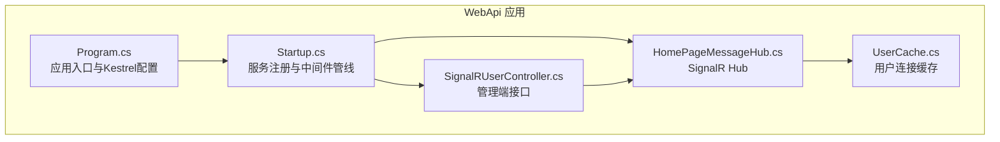
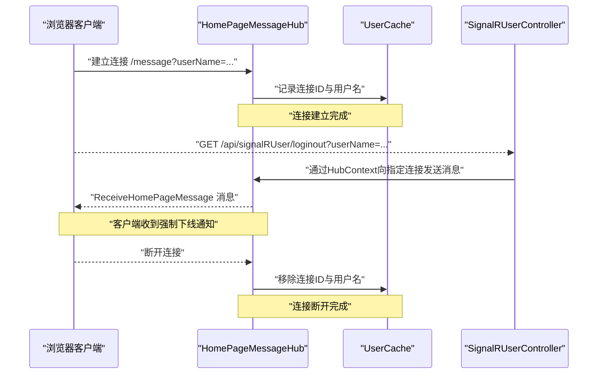
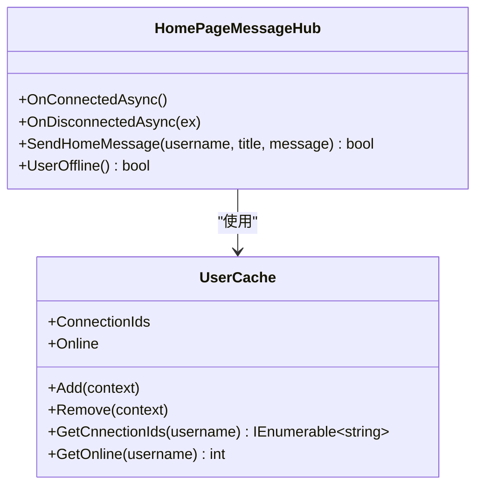
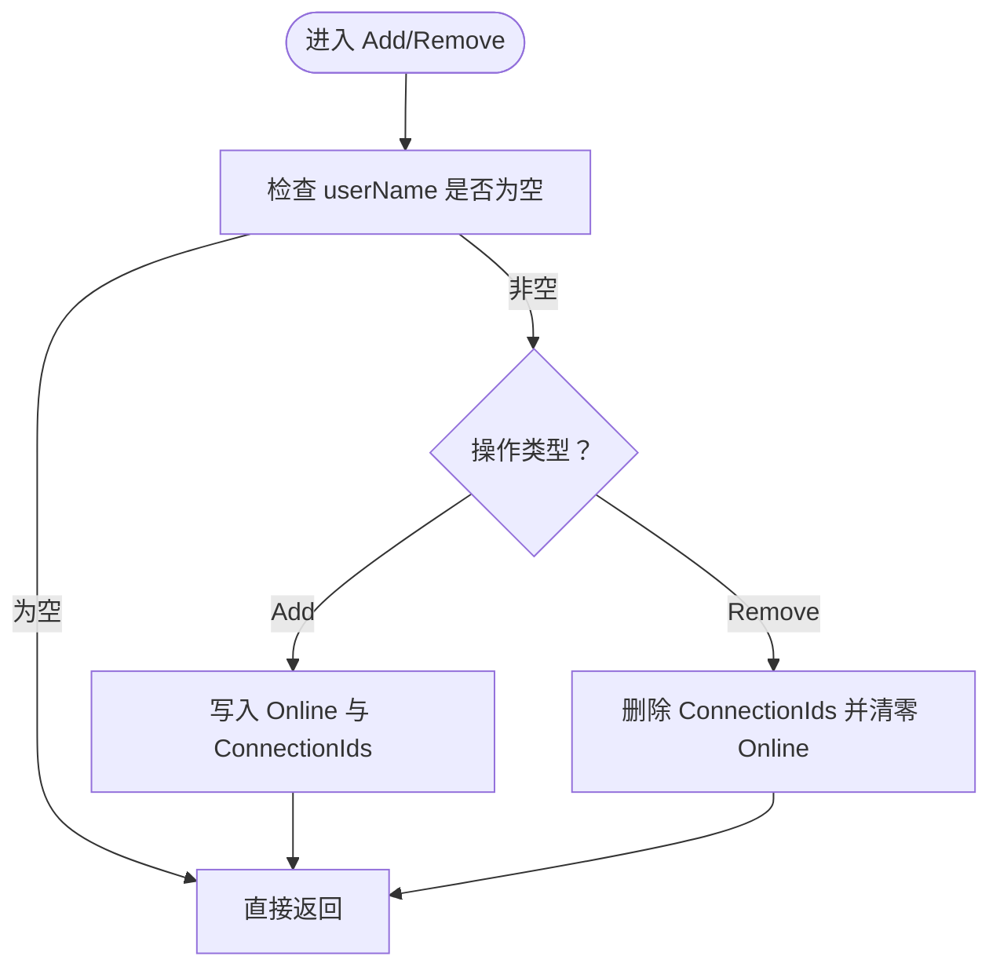
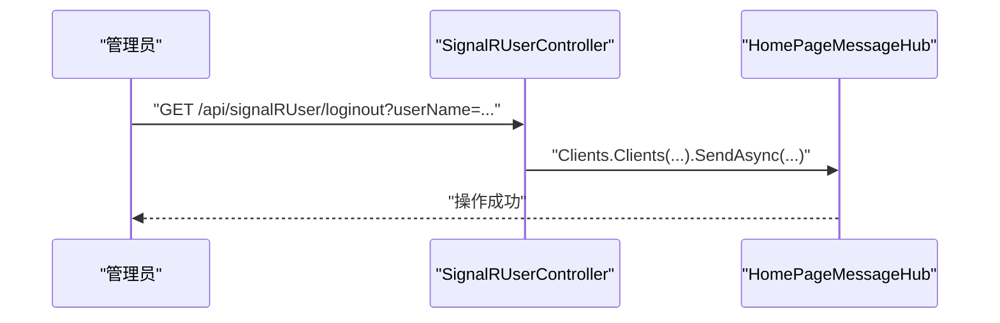
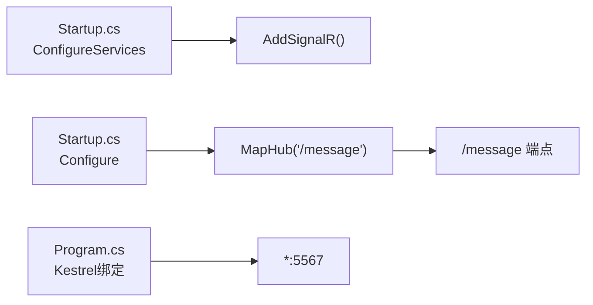

# 实时通信

<cite>
**本文引用的文件**
- [Program.cs](file://VolPro.WebApi/Program.cs)
- [Startup.cs](file://VolPro.WebApi/Startup.cs)
- [HomePageMessageHub.cs](file://VolPro.WebApi/Controllers/Hubs/HomePageMessageHub.cs)
- [SignalRUserController.cs](file://VolPro.WebApi/Controllers/Hubs/SignalRUserController.cs)
- [UserCache.cs](file://VolPro.WebApi/Controllers/Hubs/UserCache.cs)
</cite>

## 目录
1. [引言](#引言)
2. [项目结构](#项目结构)
3. [核心组件](#核心组件)
4. [架构总览](#架构总览)
5. [详细组件分析](#详细组件分析)
6. [依赖关系分析](#依赖关系分析)
7. [性能考虑](#性能考虑)
8. [故障排查指南](#故障排查指南)
9. [结论](#结论)
10. [附录](#附录)

## 引言
本文件面向“水化热平台”的实时通信系统，聚焦于SignalR框架的集成与配置、Hub的创建与连接管理、消息路由、WebSocket通信实现（连接建立、消息推送、断线重连）、实时数据推送（温度数据更新、报警通知、状态同步）、用户连接管理（用户标识、房间管理、权限控制）、性能优化策略（连接池管理、消息批处理、带宽控制）以及监控与调试方法（连接状态监控、消息追踪）。文档基于仓库中的实际代码进行分析，并提供可视化图示以帮助理解。

## 项目结构
实时通信相关的核心代码集中在WebApi工程的启动与Hub层：
- 启动配置：Program.cs负责主机与Kestrel绑定；Startup.cs负责SignalR注册、CORS与端点映射。
- Hub与用户缓存：HomePageMessageHub作为SignalR Hub，SignalRUserController提供强制下线等管理接口；UserCache维护在线用户与连接ID映射。

图表来源
- [Program.cs:1-39](file://VolPro.WebApi/Program.cs#L1-L39)
- [Startup.cs:60-213](file://VolPro.WebApi/Startup.cs#L60-L213)
- [Startup.cs:309-382](file://VolPro.WebApi/Startup.cs#L309-L382)
- [HomePageMessageHub.cs:1-99](file://VolPro.WebApi/Controllers/Hubs/HomePageMessageHub.cs#L1-L99)
- [SignalRUserController.cs:1-42](file://VolPro.WebApi/Controllers/Hubs/SignalRUserController.cs#L1-L42)
- [UserCache.cs:1-64](file://VolPro.WebApi/Controllers/Hubs/UserCache.cs#L1-L64)

章节来源
- [Program.cs:1-39](file://VolPro.WebApi/Program.cs#L1-L39)
- [Startup.cs:60-213](file://VolPro.WebApi/Startup.cs#L60-L213)
- [Startup.cs:309-382](file://VolPro.WebApi/Startup.cs#L309-L382)

## 核心组件
- SignalR Hub（HomePageMessageHub）
  - 负责连接生命周期事件（连接/断开）、消息发送（按用户名定向）、用户离线清理。
- 用户连接缓存（UserCache）
  - 维护连接ID到用户名的映射，支持查询某用户的全部连接ID、统计在线人数、增删连接。
- 管理控制器（SignalRUserController）
  - 提供强制下线接口，向指定用户推送“强制下线”消息。
- 启动配置（Program/Startup）
  - 注册SignalR服务、配置CORS、映射Hub端点“/message”。

章节来源
- [HomePageMessageHub.cs:16-99](file://VolPro.WebApi/Controllers/Hubs/HomePageMessageHub.cs#L16-L99)
- [UserCache.cs:7-64](file://VolPro.WebApi/Controllers/Hubs/UserCache.cs#L7-L64)
- [SignalRUserController.cs:14-42](file://VolPro.WebApi/Controllers/Hubs/SignalRUserController.cs#L14-L42)
- [Startup.cs:180](file://VolPro.WebApi/Startup.cs#L180)
- [Startup.cs:374-380](file://VolPro.WebApi/Startup.cs#L374-L380)

## 架构总览
SignalR在本项目中采用“服务端Hub + 客户端JavaScript客户端”的典型模式。服务端通过Startup.cs注册SignalR并映射Hub端点；客户端通过JavaScript连接到“/message”，并在连接时携带用户名参数以便服务端识别与路由。

图表来源
- [Startup.cs:374-380](file://VolPro.WebApi/Startup.cs#L374-L380)
- [HomePageMessageHub.cs:39-66](file://VolPro.WebApi/Controllers/Hubs/HomePageMessageHub.cs#L39-L66)
- [UserCache.cs:41-61](file://VolPro.WebApi/Controllers/Hubs/UserCache.cs#L41-L61)
- [SignalRUserController.cs:27-39](file://VolPro.WebApi/Controllers/Hubs/SignalRUserController.cs#L27-L39)

## 详细组件分析

### SignalR Hub：HomePageMessageHub
- 连接生命周期
  - OnConnectedAsync：在连接建立时将当前连接加入UserCache。
  - OnDisconnectedAsync：在断开连接时执行UserOffline清理缓存。
- 消息路由
  - SendHomeMessage：根据用户名获取其所有连接ID，向这些连接推送消息。
  - UserOffline：移除缓存中的连接与用户映射。
- 设计要点
  - 使用并发字典保证线程安全。
  - 通过上下文参数userName实现用户级路由。

图表来源
- [HomePageMessageHub.cs:20-99](file://VolPro.WebApi/Controllers/Hubs/HomePageMessageHub.cs#L20-L99)
- [UserCache.cs:7-64](file://VolPro.WebApi/Controllers/Hubs/UserCache.cs#L7-L64)

章节来源
- [HomePageMessageHub.cs:39-96](file://VolPro.WebApi/Controllers/Hubs/HomePageMessageHub.cs#L39-L96)

### 用户连接缓存：UserCache
- 数据结构
  - ConnectionIds：连接ID -> 用户名 映射。
  - Online：用户名 -> 在线标记 映射。
- 关键方法
  - Add：从上下文提取userName，写入在线与连接映射。
  - Remove：移除连接ID并清零在线标记。
  - GetCnnectionIds：按用户名筛选所有连接ID。
  - GetOnline：查询用户在线状态。

图表来源
- [UserCache.cs:41-61](file://VolPro.WebApi/Controllers/Hubs/UserCache.cs#L41-L61)

章节来源
- [UserCache.cs:18-61](file://VolPro.WebApi/Controllers/Hubs/UserCache.cs#L18-L61)

### 管理控制器：SignalRUserController
- 功能
  - 提供强制下线接口，向指定用户名的所有连接推送“强制下线”消息。
- 权限
  - 使用ApiActionPermission特性标注所需权限。

图表来源
- [SignalRUserController.cs:27-39](file://VolPro.WebApi/Controllers/Hubs/SignalRUserController.cs#L27-L39)

章节来源
- [SignalRUserController.cs:14-42](file://VolPro.WebApi/Controllers/Hubs/SignalRUserController.cs#L14-L42)

### WebSocket通信实现与连接管理
- 连接建立
  - 客户端通过JavaScript连接到“/message”，并携带查询参数userName用于用户识别。
  - 服务端在OnConnectedAsync中将连接加入UserCache。
- 消息推送
  - 服务端通过UserCache获取目标用户的所有连接ID，向这些连接推送消息。
  - 管理端可通过SignalRUserController向指定用户推送强制下线消息。
- 断线重连机制
  - 服务端在OnDisconnectedAsync中清理缓存，避免脏数据。
  - 客户端应实现自动重连逻辑（建议在前端实现，例如指数退避重连策略）。

章节来源
- [HomePageMessageHub.cs:39-66](file://VolPro.WebApi/Controllers/Hubs/HomePageMessageHub.cs#L39-L66)
- [UserCache.cs:41-61](file://VolPro.WebApi/Controllers/Hubs/UserCache.cs#L41-L61)
- [SignalRUserController.cs:27-39](file://VolPro.WebApi/Controllers/Hubs/SignalRUserController.cs#L27-L39)

### 实时数据推送：温度数据更新、报警通知与状态同步
- 温度数据更新
  - 可在业务服务中定期或事件驱动地调用HubContext，向订阅用户推送最新温度数据。
- 报警通知
  - 当检测到阈值越界或异常状态时，通过SendHomeMessage或类似方法向相关用户推送报警消息。
- 状态同步
  - 将项目/设备状态变化广播给在线用户，保持前端界面与后端状态一致。

说明：上述为通用实现建议，具体调用点需结合业务服务与HubContext注入使用。

### 用户连接管理：用户标识、房间管理与权限控制
- 用户标识
  - 通过userName查询参数在连接建立时写入UserCache，后续按用户名路由消息。
- 房间管理
  - 当前实现未见房间分组逻辑，可在OnConnectedAsync中按需加入组，并在消息发送时使用Groups API。
- 权限控制
  - 强制下线接口使用ApiActionPermission进行权限校验，确保仅具备相应权限的管理员可操作。

章节来源
- [HomePageMessageHub.cs:42](file://VolPro.WebApi/Controllers/Hubs/HomePageMessageHub.cs#L42)
- [SignalRUserController.cs:28](file://VolPro.WebApi/Controllers/Hubs/SignalRUserController.cs#L28)

## 依赖关系分析
- 服务注册
  - Startup.cs在ConfigureServices中注册SignalR服务。
- 端点映射
  - Startup.cs在Configure中映射Hub端点“/message”，并配置CORS允许跨域。
- 运行时绑定
  - Program.cs使用Kestrel监听5567端口，便于前端访问。

图表来源
- [Startup.cs:180](file://VolPro.WebApi/Startup.cs#L180)
- [Startup.cs:374-380](file://VolPro.WebApi/Startup.cs#L374-L380)
- [Program.cs:33](file://VolPro.WebApi/Program.cs#L33)

章节来源
- [Startup.cs:60-213](file://VolPro.WebApi/Startup.cs#L60-L213)
- [Startup.cs:309-382](file://VolPro.WebApi/Startup.cs#L309-L382)
- [Program.cs:24-36](file://VolPro.WebApi/Program.cs#L24-L36)

## 性能考虑
- 连接池管理
  - 使用并发字典存储连接映射，避免锁竞争；合理设置最大连接数与超时时间。
- 消息批处理
  - 对高频更新（如温度数据）采用合并策略，减少消息数量与带宽占用。
- 带宽控制
  - 控制消息体大小，避免传输冗余字段；必要时启用压缩。
- 断线重连
  - 前端实现指数退避重连，降低瞬时重连风暴。
- 资源释放
  - 在OnDisconnectedAsync中及时清理缓存，防止内存泄漏。

## 故障排查指南
- 连接无法建立
  - 检查CORS配置与端点映射；确认前端连接URL与userName参数正确。
- 消息未送达
  - 确认UserCache中存在该用户名的连接ID；检查SendHomeMessage调用链路。
- 强制下线无效
  - 确认SignalRUserController的权限配置与调用路径；检查HubContext是否正确注入。
- 连接状态监控
  - 可在OnConnectedAsync/OnDisconnectedAsync中记录日志或指标，辅助定位问题。

章节来源
- [Startup.cs:374-380](file://VolPro.WebApi/Startup.cs#L374-L380)
- [HomePageMessageHub.cs:39-66](file://VolPro.WebApi/Controllers/Hubs/HomePageMessageHub.cs#L39-L66)
- [SignalRUserController.cs:27-39](file://VolPro.WebApi/Controllers/Hubs/SignalRUserController.cs#L27-L39)

## 结论
本项目已完整集成SignalR，实现了基于用户名的连接管理与消息路由，并提供了强制下线等管理能力。建议后续扩展房间分组、消息批处理与带宽控制策略，并完善前端断线重连与监控告警机制，以进一步提升实时通信的稳定性与性能。

## 附录
- 配置要点
  - SignalR服务注册：在Startup.cs中调用AddSignalR。
  - 端点映射：在Startup.cs中映射Hub端点“/message”，并配置CORS。
  - Kestrel绑定：在Program.cs中设置监听端口。
- 推荐实践
  - 在业务服务中注入IHubContext<HomePageMessageHub>，按需推送实时数据。
  - 对高频消息进行聚合与去抖，降低网络压力。
  - 前端实现健壮的重连与退避策略，提升用户体验。