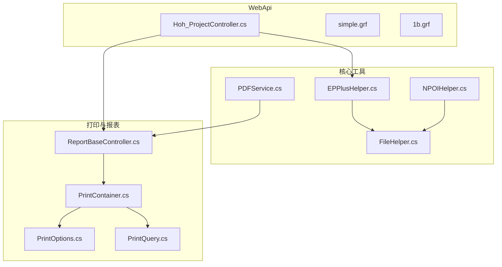
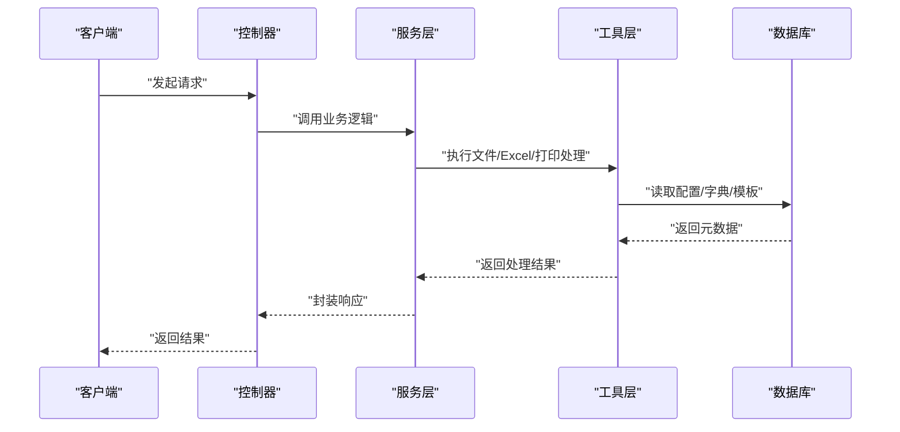
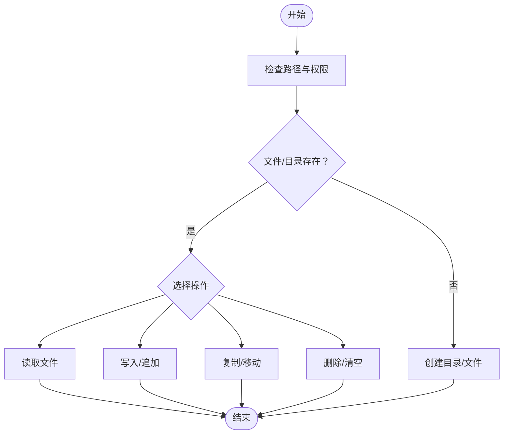
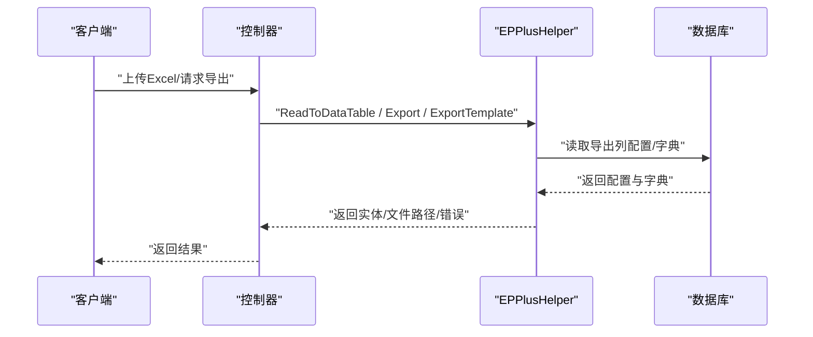
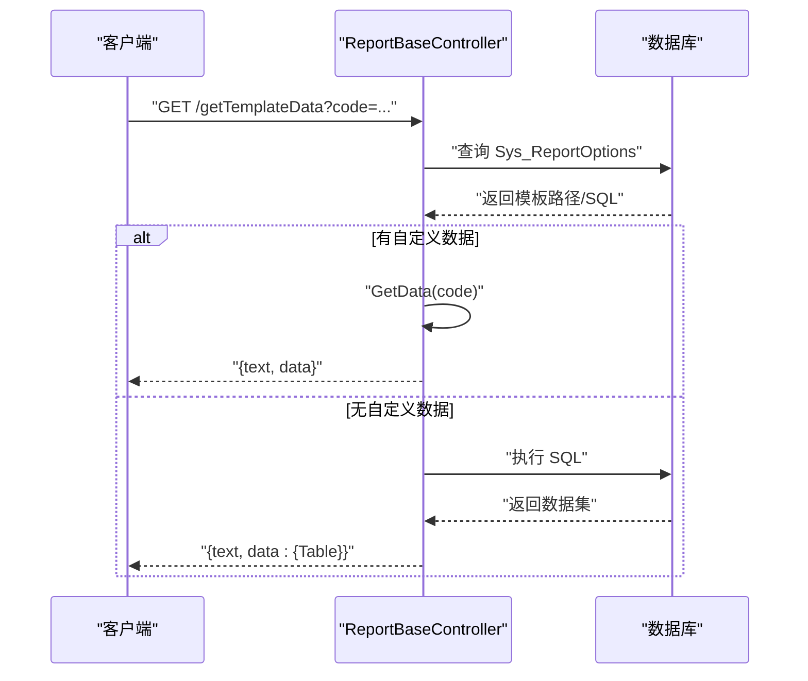
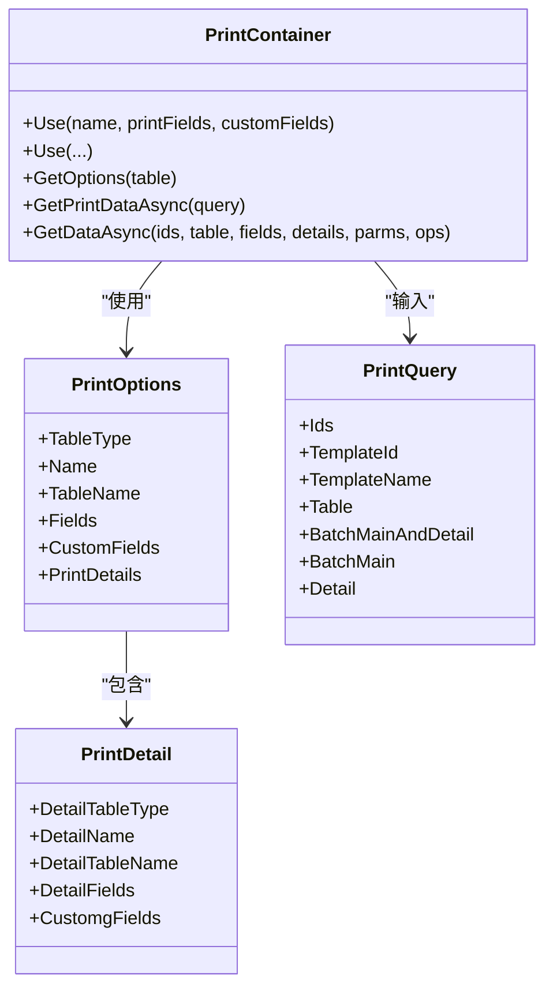
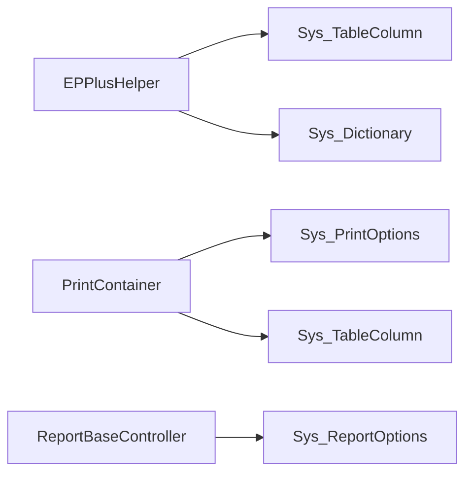

# 文件处理与报表

<cite>
**本文引用的文件**
- [FileHelper.cs](file://VolPro.Core/Utilities/FileHelper.cs)
- [EPPlusHelper.cs](file://VolPro.Core/Utilities/EPPlusHelper.cs)
- [PDFService.cs](file://VolPro.Core/Utilities/PDFHelper/PDFService.cs)
- [PrintContainer.cs](file://VolPro.Core/Print/PrintContainer.cs)
- [PrintOptions.cs](file://VolPro.Core/Print/PrintOptions.cs)
- [PrintQuery.cs](file://VolPro.Core/Print/PrintQuery.cs)
- [ReportBaseController.cs](file://VolPro.Core/Controllers/Basic/ReportBaseController.cs)
- [NPOIHelper.cs](file://VolPro.Core/Utilities/NPOIHelper.cs)
- [Hoh_ProjectController.cs](file://VolPro.WebApi/Controllers/HeatOfHydration/Hoh_ProjectController.cs)
- [simple.grf](file://VolPro.WebApi/ReportTemplate/simple.grf)
- [1b.grf](file://VolPro.WebApi/ReportTemplate/1b.grf)
</cite>

## 目录
1. [简介](#简介)
2. [项目结构](#项目结构)
3. [核心组件](#核心组件)
4. [架构总览](#架构总览)
5. [详细组件分析](#详细组件分析)
6. [依赖分析](#依赖分析)
7. [性能考虑](#性能考虑)
8. [故障排查指南](#故障排查指南)
9. [结论](#结论)
10. [附录](#附录)

## 简介
本文件处理与报表系统围绕“水化热平台”构建，涵盖文件上传下载、Excel 导入导出（EPPlus）、PDF 报表生成（预留）、打印配置与数据准备（PrintContainer）以及报表模板（Grid++Report）。本文从架构、组件、流程、依赖与性能等维度进行系统化梳理，帮助开发者快速理解与扩展。

## 项目结构
- 核心工具与服务位于 VolPro.Core：
  - 文件工具：FileHelper
  - Excel 工具：EPPlusHelper
  - PDF 服务：PDFService（预留）
  - 打印容器：PrintContainer、PrintOptions、PrintQuery
  - 报表基类：ReportBaseController
  - NPOI 工具：NPOIHelper（预留）
- WebApi 层提供控制器入口与报表模板资源：
  - 控制器示例：Hoh_ProjectController
  - 报表模板：simple.grf、1b.grf 等

图表来源
- [FileHelper.cs:1-340](file://VolPro.Core/Utilities/FileHelper.cs#L1-L340)
- [EPPlusHelper.cs:1-738](file://VolPro.Core/Utilities/EPPlusHelper.cs#L1-L738)
- [PDFService.cs:1-63](file://VolPro.Core/Utilities/PDFHelper/PDFService.cs#L1-L63)
- [PrintContainer.cs:1-426](file://VolPro.Core/Print/PrintContainer.cs#L1-L426)
- [PrintOptions.cs:1-62](file://VolPro.Core/Print/PrintOptions.cs#L1-L62)
- [PrintQuery.cs:1-35](file://VolPro.Core/Print/PrintQuery.cs#L1-L35)
- [ReportBaseController.cs:1-169](file://VolPro.Core/Controllers/Basic/ReportBaseController.cs#L1-L169)
- [NPOIHelper.cs:1-551](file://VolPro.Core/Utilities/NPOIHelper.cs#L1-L551)
- [Hoh_ProjectController.cs:1-22](file://VolPro.WebApi/Controllers/HeatOfHydration/Hoh_ProjectController.cs#L1-L22)
- [simple.grf:1-200](file://VolPro.WebApi/ReportTemplate/simple.grf#L1-L200)
- [1b.grf:1-410](file://VolPro.WebApi/ReportTemplate/1b.grf#L1-L410)

章节来源
- [FileHelper.cs:1-340](file://VolPro.Core/Utilities/FileHelper.cs#L1-L340)
- [EPPlusHelper.cs:1-738](file://VolPro.Core/Utilities/EPPlusHelper.cs#L1-L738)
- [PDFService.cs:1-63](file://VolPro.Core/Utilities/PDFHelper/PDFService.cs#L1-L63)
- [PrintContainer.cs:1-426](file://VolPro.Core/Print/PrintContainer.cs#L1-L426)
- [PrintOptions.cs:1-62](file://VolPro.Core/Print/PrintOptions.cs#L1-L62)
- [PrintQuery.cs:1-35](file://VolPro.Core/Print/PrintQuery.cs#L1-L35)
- [ReportBaseController.cs:1-169](file://VolPro.Core/Controllers/Basic/ReportBaseController.cs#L1-L169)
- [NPOIHelper.cs:1-551](file://VolPro.Core/Utilities/NPOIHelper.cs#L1-L551)
- [Hoh_ProjectController.cs:1-22](file://VolPro.WebApi/Controllers/HeatOfHydration/Hoh_ProjectController.cs#L1-L22)
- [simple.grf:1-200](file://VolPro.WebApi/ReportTemplate/simple.grf#L1-L200)
- [1b.grf:1-410](file://VolPro.WebApi/ReportTemplate/1b.grf#L1-L410)

## 核心组件
- 文件处理工具（FileHelper）
  - 支持文件读取、写入、追加、拷贝、移动、删除、目录操作、大小统计、属性查询等。
  - 提供分页读取大文件行的能力，适合百万行以上的大文件场景。
- Excel 处理（EPPlusHelper）
  - 导入：支持模板列映射、必填校验、字典值映射、日期格式处理、多选值拆分与映射。
  - 导出：支持按 Sys_TableColumn 配置导出列、列宽、标题翻译、字典值反显、日期格式化、通用导出回调。
  - 模板导出：根据实体或列集合生成可下载的 Excel 模板。
- 打印容器（PrintContainer）
  - 定义打印配置（主表/明细表字段、自定义字段），按用户权限筛选可打印表，动态组装打印数据。
  - 支持批量打印、明细联动、字典与日期格式转换。
- 报表基类（ReportBaseController）
  - 通过 ReportCode 加载模板与 SQL，统一提供模板与数据接口，便于前端渲染。
- PDF 服务（PDFService）
  - 预留基于 WkHtmlToPdfDotNet 的 PDF 生成能力，便于后续接入 HTML 转 PDF。
- NPOI 工具（NPOIHelper）
  - 预留基于 NPOI 的 Excel 导入导出实现，当前为注释状态，可按需启用。

章节来源
- [FileHelper.cs:1-340](file://VolPro.Core/Utilities/FileHelper.cs#L1-L340)
- [EPPlusHelper.cs:1-738](file://VolPro.Core/Utilities/EPPlusHelper.cs#L1-L738)
- [PrintContainer.cs:1-426](file://VolPro.Core/Print/PrintContainer.cs#L1-L426)
- [ReportBaseController.cs:1-169](file://VolPro.Core/Controllers/Basic/ReportBaseController.cs#L1-L169)
- [PDFService.cs:1-63](file://VolPro.Core/Utilities/PDFHelper/PDFService.cs#L1-L63)
- [NPOIHelper.cs:1-551](file://VolPro.Core/Utilities/NPOIHelper.cs#L1-L551)

## 架构总览
系统采用“控制器-服务-工具”的分层架构：
- 控制器层负责请求路由与参数解析（如 Hoh_ProjectController、ReportBaseController）。
- 服务层调用工具完成文件与报表处理（EPPlus、FileHelper、PrintContainer）。
- 数据层通过 Sys_* 配置表驱动导出列、字典、打印模板等元数据。

图表来源
- [Hoh_ProjectController.cs:1-22](file://VolPro.WebApi/Controllers/HeatOfHydration/Hoh_ProjectController.cs#L1-L22)
- [ReportBaseController.cs:1-169](file://VolPro.Core/Controllers/Basic/ReportBaseController.cs#L1-L169)
- [EPPlusHelper.cs:1-738](file://VolPro.Core/Utilities/EPPlusHelper.cs#L1-L738)
- [PrintContainer.cs:1-426](file://VolPro.Core/Print/PrintContainer.cs#L1-L426)

## 详细组件分析

### 文件上传下载与存储策略
- 存储路径
  - 下载目录：Download 目录，提供 GetCurrentDownLoadPath 统一获取。
  - Excel 导出默认保存至 Download/ExcelExport/yyyyMMdd 子目录。
- 类型验证与安全检查
  - 读取文件前进行路径替换与存在性检查；写入/追加时确保目录存在。
  - 建议在控制器层增加文件类型白名单与大小限制，避免非法扩展名与超大文件。
- 大文件处理
  - ReadPageLine 使用迭代器逐页读取，适合百万行以上文件；注意 UTF-8 编码与换行符要求。
- 目录管理
  - 支持复制、移动、删除、递归删除、统计大小等操作，便于批量清理与迁移。

图表来源
- [FileHelper.cs:72-340](file://VolPro.Core/Utilities/FileHelper.cs#L72-L340)

章节来源
- [FileHelper.cs:72-340](file://VolPro.Core/Utilities/FileHelper.cs#L72-L340)

### Excel 导入导出（EPPlus）
- 导入流程
  - 读取模板列映射（Sys_TableColumn），支持 headerMap 映射与列索引定位。
  - 校验必填、字典值（含多选拆分）、日期格式（含 Excel 序列日），并进行类型转换。
  - 返回 WebResponseContent，包含错误信息与实体集合。
- 导出流程
  - 读取 Sys_TableColumn 配置，确定导出列、列宽、标题翻译、字典映射。
  - 支持模板导出（仅标题）、对象列表导出、通用导出回调 onFillCell/saveBefore。
  - 对日期、长整型等特殊类型进行格式化处理。
- 性能建议
  - 大量数据导出时优先使用 DataTable 或通用导出，减少反射开销。
  - 合理设置列宽与冻结首行，提升渲染性能。

图表来源
- [EPPlusHelper.cs:30-209](file://VolPro.Core/Utilities/EPPlusHelper.cs#L30-L209)
- [EPPlusHelper.cs:346-545](file://VolPro.Core/Utilities/EPPlusHelper.cs#L346-L545)
- [EPPlusHelper.cs:621-698](file://VolPro.Core/Utilities/EPPlusHelper.cs#L621-L698)

章节来源
- [EPPlusHelper.cs:30-209](file://VolPro.Core/Utilities/EPPlusHelper.cs#L30-L209)
- [EPPlusHelper.cs:346-545](file://VolPro.Core/Utilities/EPPlusHelper.cs#L346-L545)
- [EPPlusHelper.cs:621-698](file://VolPro.Core/Utilities/EPPlusHelper.cs#L621-L698)

### 报表模板与数据准备（ReportBaseController）
- 模板加载
  - 通过 ReportCode 查询 Sys_ReportOptions，获取模板文件路径与 SQL。
  - 模板文件读取为文本，结合后端数据统一返回给前端渲染。
- 数据获取
  - 优先调用子类重写的 GetData(code)，若为空则执行 SQL 查询。
  - 返回结构包含 text（模板）与 data（数据）。

图表来源
- [ReportBaseController.cs:58-88](file://VolPro.Core/Controllers/Basic/ReportBaseController.cs#L58-L88)

章节来源
- [ReportBaseController.cs:58-88](file://VolPro.Core/Controllers/Basic/ReportBaseController.cs#L58-L88)

### 打印功能（PrintContainer）
- 配置与注册
  - Use 方法注册主表与明细表打印字段、自定义字段，支持多明细表组合。
  - 通过权限过滤可打印表，保证数据安全。
- 数据获取
  - GetPrintDataAsync 动态构造查询，按主键 In 条件获取主表与明细表数据。
  - ConvertListAsync 将实体转换为字典，处理字典值、日期格式与列配置。
- 输出
  - 支持批量打印、明细联动、自定义字段扩展，最终输出可用于前端打印或导出。

图表来源
- [PrintContainer.cs:47-158](file://VolPro.Core/Print/PrintContainer.cs#L47-L158)
- [PrintOptions.cs:11-61](file://VolPro.Core/Print/PrintOptions.cs#L11-L61)
- [PrintQuery.cs:9-35](file://VolPro.Core/Print/PrintQuery.cs#L9-L35)

章节来源
- [PrintContainer.cs:47-158](file://VolPro.Core/Print/PrintContainer.cs#L47-L158)
- [PrintOptions.cs:11-61](file://VolPro.Core/Print/PrintOptions.cs#L11-L61)
- [PrintQuery.cs:9-35](file://VolPro.Core/Print/PrintQuery.cs#L9-L35)

### PDF 报表生成（预留）
- 当前为注释状态，预留基于 WkHtmlToPdfDotNet 的 PDFService 实现。
- 建议在控制器中接收 HTML 内容，调用 CreatePDF 生成字节数组并返回下载。

章节来源
- [PDFService.cs:1-63](file://VolPro.Core/Utilities/PDFHelper/PDFService.cs#L1-L63)

### NPOI 工具（预留）
- 当前为注释状态，预留基于 NPOI 的 Excel 导入导出实现。
- 可按需启用，与 EPPlus 形成备选方案。

章节来源
- [NPOIHelper.cs:1-551](file://VolPro.Core/Utilities/NPOIHelper.cs#L1-L551)

### 报表模板（Grid++Report）
- simple.grf 与 1b.grf 为 JSON 格式的模板描述，包含字体、边距、列宽、标题、数据集连接串与 SQL 等。
- 可用于 Grid++Report 渲染，支持双层表头、分组统计等复杂布局。

章节来源
- [simple.grf:1-200](file://VolPro.WebApi/ReportTemplate/simple.grf#L1-L200)
- [1b.grf:1-410](file://VolPro.WebApi/ReportTemplate/1b.grf#L1-L410)

## 依赖分析
- 组件耦合
  - EPPlusHelper 依赖数据库 Sys_TableColumn/Sys_Dictionary 等配置表，实现“配置驱动”的导出。
  - PrintContainer 依赖 DBServerProvider 与 DictionaryManager，实现权限过滤与字典映射。
  - ReportBaseController 依赖 Sys_ReportOptions，实现模板与 SQL 的解耦。
- 外部依赖
  - EPPlus：Excel 读写。
  - WkHtmlToPdfDotNet（预留）：HTML 转 PDF。
  - NPOI（预留）：Excel 读写备选。

图表来源
- [EPPlusHelper.cs:555-619](file://VolPro.Core/Utilities/EPPlusHelper.cs#L555-L619)
- [PrintContainer.cs:253-256](file://VolPro.Core/Print/PrintContainer.cs#L253-L256)
- [ReportBaseController.cs:27-51](file://VolPro.Core/Controllers/Basic/ReportBaseController.cs#L27-L51)

章节来源
- [EPPlusHelper.cs:555-619](file://VolPro.Core/Utilities/EPPlusHelper.cs#L555-L619)
- [PrintContainer.cs:253-256](file://VolPro.Core/Print/PrintContainer.cs#L253-L256)
- [ReportBaseController.cs:27-51](file://VolPro.Core/Controllers/Basic/ReportBaseController.cs#L27-L51)

## 性能考虑
- 大文件处理
  - 使用 FileHelper.ReadPageLine 进行分页读取，避免一次性加载导致内存峰值过高。
- Excel 导出
  - 优先使用 DataTable 或通用导出，减少反射与装箱。
  - 合理设置列宽，避免 AutoFitColumns 高频调用。
- 打印数据
  - 使用 In 条件批量查询，减少多次往返。
  - ConvertListAsync 中按需加载字典，避免重复查询。
- 并发控制
  - 导出/打印任务建议异步执行并限制并发度，防止数据库与磁盘 IO 抖动。

## 故障排查指南
- Excel 导入失败
  - 检查模板列映射与必填项；确认字典值是否存在于 Sys_DictionaryList。
  - 注意日期格式与多选值拆分规则。
- 导出列为空
  - 确认 Sys_TableColumn 中 IsDisplay=1 且列名大小写一致。
- 打印数据缺失
  - 检查用户权限与 PrintContainer 的权限过滤逻辑。
  - 确认主键字段存在于明细表，否则抛出异常。
- 报表模板加载失败
  - 检查 ReportCode 是否正确，FilePath 是否存在且可访问。

章节来源
- [EPPlusHelper.cs:86-101](file://VolPro.Core/Utilities/EPPlusHelper.cs#L86-L101)
- [EPPlusHelper.cs:592-619](file://VolPro.Core/Utilities/EPPlusHelper.cs#L592-L619)
- [PrintContainer.cs:318-321](file://VolPro.Core/Print/PrintContainer.cs#L318-L321)
- [ReportBaseController.cs:41-48](file://VolPro.Core/Controllers/Basic/ReportBaseController.cs#L41-L48)

## 结论
本系统通过“配置驱动”的方式实现了灵活的文件处理、Excel 导入导出与打印数据准备，并以 ReportBaseController 统一了报表模板与数据接口。EPPlus 与 PrintContainer 构成了高效稳定的报表处理基石；PDF 与 NPOI 作为可插拔扩展，满足多样化需求。建议在生产环境中强化文件类型与大小校验、优化大文件与大数据导出性能，并完善并发与缓存策略。

## 附录
- 控制器入口示例：Hoh_ProjectController 作为业务控制器继承 ApiBaseController，便于复用文件与报表能力。
- 模板示例：simple.grf 与 1b.grf 展示了基础与双层表头的报表布局，可作为后续模板开发参考。

章节来源
- [Hoh_ProjectController.cs:1-22](file://VolPro.WebApi/Controllers/HeatOfHydration/Hoh_ProjectController.cs#L1-L22)
- [simple.grf:1-200](file://VolPro.WebApi/ReportTemplate/simple.grf#L1-L200)
- [1b.grf:1-410](file://VolPro.WebApi/ReportTemplate/1b.grf#L1-L410)