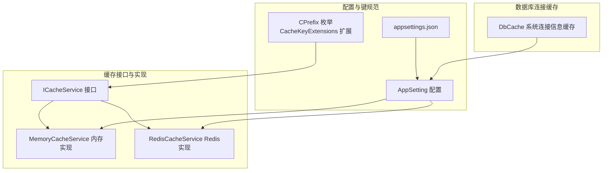
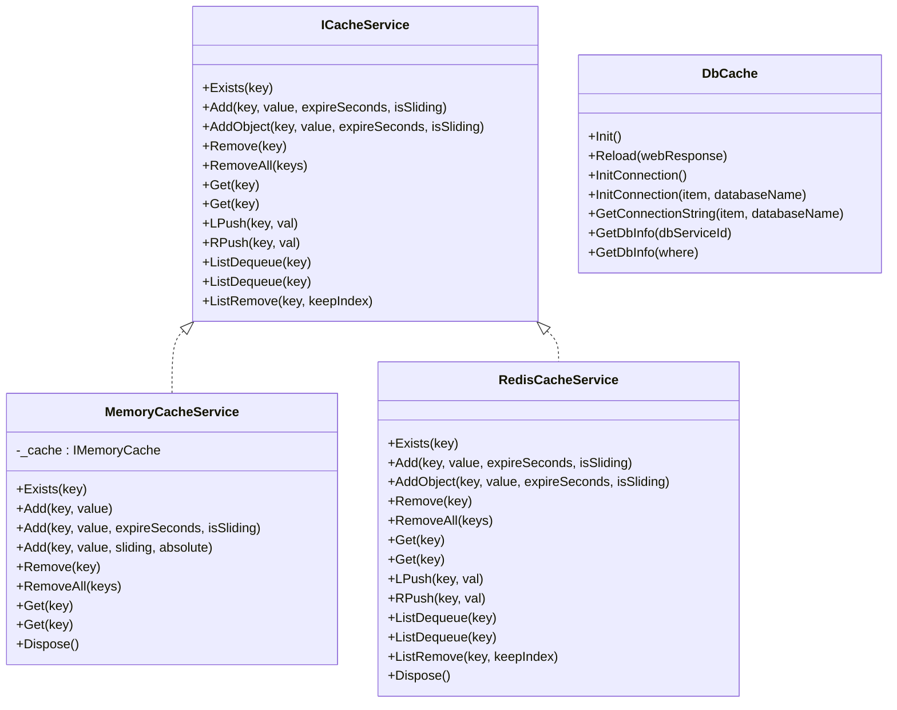
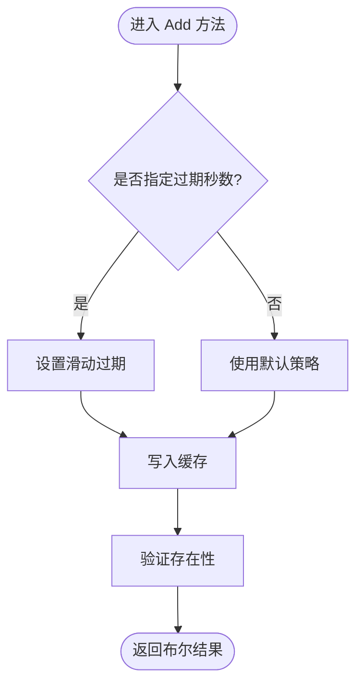
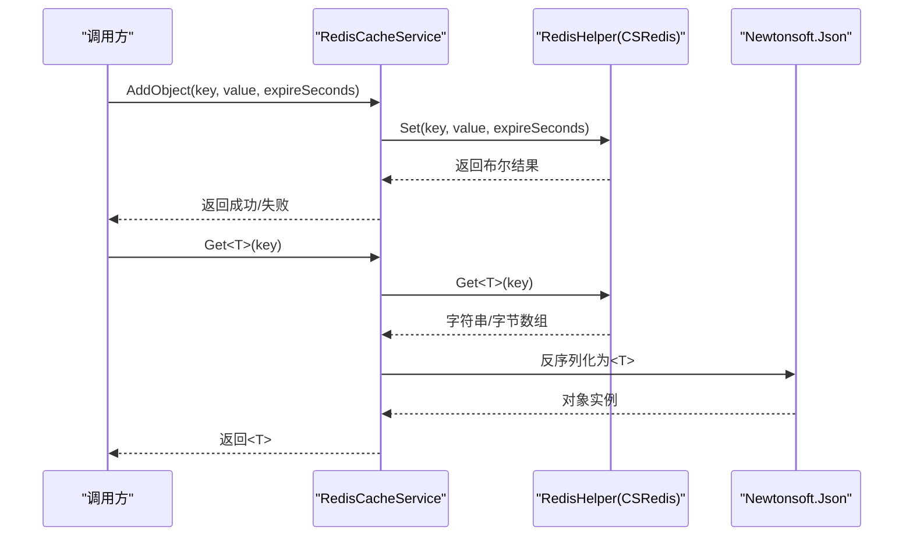
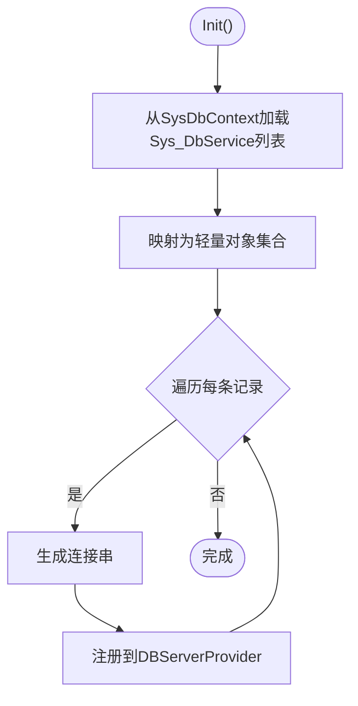
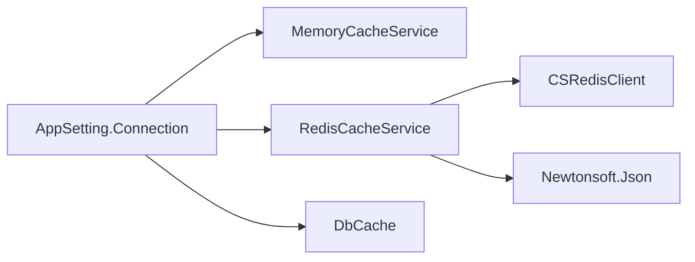

# 缓存管理

<cite>
**本文引用的文件**
- [ICacheService.cs](file://VolPro.Core/CacheManager/IService/ICacheService.cs)
- [MemoryCacheService.cs](file://VolPro.Core/CacheManager/Service/MemoryCacheService .cs)
- [RedisCacheService.cs](file://VolPro.Core/CacheManager/Service/RedisCacheService.cs)
- [DbCache.cs](file://VolPro.Core/CacheManager/DbCache.cs)
- [AppSetting.cs](file://VolPro.Core/Configuration/AppSetting.cs)
- [CacheKeyExtensions.cs](file://VolPro.Core/Extensions/CacheKeyExtensions.cs)
- [CPrefix.cs](file://VolPro.Core/Enums/CPrefix.cs)
- [appsettings.json](file://VolPro.WebApi/appsettings.json)
- [appsettings.Development.json](file://VolPro.WebApi/appsettings.Development.json)
</cite>

## 目录
1. [引言](#引言)
2. [项目结构](#项目结构)
3. [核心组件](#核心组件)
4. [架构总览](#架构总览)
5. [详细组件分析](#详细组件分析)
6. [依赖关系分析](#依赖关系分析)
7. [性能考虑](#性能考虑)
8. [故障排查指南](#故障排查指南)
9. [结论](#结论)
10. [附录](#附录)

## 引言
本文件面向“水化热平台”的缓存管理子系统，系统性梳理缓存服务接口设计、内存缓存与Redis缓存实现、数据库连接信息缓存、缓存键规范、以及性能优化与运维监控建议。文档以代码为依据，结合架构图与流程图，帮助开发者快速理解与扩展缓存能力。

## 项目结构
缓存相关代码主要分布在以下模块：
- 接口层：统一缓存服务接口，定义通用的增删改查与列表操作
- 实现层：内存缓存与Redis缓存两种实现，满足本地开发与分布式部署需求
- 数据库缓存：系统数据库连接信息的集中缓存与初始化
- 配置层：应用配置与连接串解析，决定是否启用Redis与具体连接参数
- 键规范：枚举与扩展方法，统一缓存键前缀与命名规则

**图表来源**
- [ICacheService.cs:1-96](file://VolPro.Core/CacheManager/IService/ICacheService.cs#L1-L96)
- [MemoryCacheService.cs:1-190](file://VolPro.Core/CacheManager/Service/MemoryCacheService .cs#L1-L190)
- [RedisCacheService.cs:1-120](file://VolPro.Core/CacheManager/Service/RedisCacheService.cs#L1-L120)
- [AppSetting.cs:1-237](file://VolPro.Core/Configuration/AppSetting.cs#L1-L237)
- [CacheKeyExtensions.cs:1-24](file://VolPro.Core/Extensions/CacheKeyExtensions.cs#L1-L24)
- [CPrefix.cs:1-23](file://VolPro.Core/Enums/CPrefix.cs#L1-L23)
- [appsettings.json:1-140](file://VolPro.WebApi/appsettings.json#L1-L140)
- [DbCache.cs:1-133](file://VolPro.Core/CacheManager/DbCache.cs#L1-L133)

**章节来源**
- [ICacheService.cs:1-96](file://VolPro.Core/CacheManager/IService/ICacheService.cs#L1-L96)
- [MemoryCacheService.cs:1-190](file://VolPro.Core/CacheManager/Service/MemoryCacheService .cs#L1-L190)
- [RedisCacheService.cs:1-120](file://VolPro.Core/CacheManager/Service/RedisCacheService.cs#L1-L120)
- [DbCache.cs:1-133](file://VolPro.Core/CacheManager/DbCache.cs#L1-L133)
- [AppSetting.cs:1-237](file://VolPro.Core/Configuration/AppSetting.cs#L1-L237)
- [CacheKeyExtensions.cs:1-24](file://VolPro.Core/Extensions/CacheKeyExtensions.cs#L1-L24)
- [CPrefix.cs:1-23](file://VolPro.Core/Enums/CPrefix.cs#L1-L23)
- [appsettings.json:1-140](file://VolPro.WebApi/appsettings.json#L1-L140)
- [appsettings.Development.json:1-10](file://VolPro.WebApi/appsettings.Development.json#L1-L10)

## 核心组件
- 统一缓存接口 ICacheService：提供存在性检查、添加/删除/批量删除、获取、以及列表操作（LPush/RPush/LPop/RPop/LTrim）等能力，支持字符串与对象两类存储，支持滑动过期与绝对过期控制。
- 内存缓存 MemoryCacheService：基于.NET内存缓存实现，支持滑动过期与绝对过期，提供强健的异常处理与资源释放。
- Redis缓存 RedisCacheService：基于CSRedis封装，负责连接初始化、键存在性检查、字符串/对象存取、列表操作与批量删除；序列化采用Newtonsoft.Json。
- 数据库连接缓存 DbCache：加载系统数据库服务配置，生成连接串并注册到DBServerProvider，支持按服务ID与数据库名初始化连接。
- 配置与键规范：AppSetting集中读取配置，包含数据库与Redis连接串、开关标志等；CPrefix与CacheKeyExtensions提供统一的键前缀与组合方式。

**章节来源**
- [ICacheService.cs:1-96](file://VolPro.Core/CacheManager/IService/ICacheService.cs#L1-L96)
- [MemoryCacheService.cs:1-190](file://VolPro.Core/CacheManager/Service/MemoryCacheService .cs#L1-L190)
- [RedisCacheService.cs:1-120](file://VolPro.Core/CacheManager/Service/RedisCacheService.cs#L1-L120)
- [DbCache.cs:1-133](file://VolPro.Core/CacheManager/DbCache.cs#L1-L133)
- [AppSetting.cs:1-237](file://VolPro.Core/Configuration/AppSetting.cs#L1-L237)
- [CacheKeyExtensions.cs:1-24](file://VolPro.Core/Extensions/CacheKeyExtensions.cs#L1-L24)
- [CPrefix.cs:1-23](file://VolPro.Core/Enums/CPrefix.cs#L1-L23)

## 架构总览
缓存层通过统一接口抽象，运行时根据配置选择内存或Redis实现；数据库连接信息通过DbCache集中管理，供业务层按需使用。

**图表来源**
- [ICacheService.cs:1-96](file://VolPro.Core/CacheManager/IService/ICacheService.cs#L1-L96)
- [MemoryCacheService.cs:1-190](file://VolPro.Core/CacheManager/Service/MemoryCacheService .cs#L1-L190)
- [RedisCacheService.cs:1-120](file://VolPro.Core/CacheManager/Service/RedisCacheService.cs#L1-L120)
- [DbCache.cs:1-133](file://VolPro.Core/CacheManager/DbCache.cs#L1-L133)

## 详细组件分析

### 统一缓存接口 ICacheService
- 设计要点
  - 统一的键存在性检查、增删改查与列表操作，覆盖常用场景
  - 支持字符串与对象两类存储，便于灵活使用
  - 滑动过期与绝对过期参数，满足不同业务时效需求
- 生命周期
  - 实现类均实现IDisposable，便于资源释放
- 使用建议
  - 在业务层通过依赖注入获取ICacheService实例，避免直接绑定具体实现
  - 对于列表操作，注意线程安全与并发消费模式

**章节来源**
- [ICacheService.cs:1-96](file://VolPro.Core/CacheManager/IService/ICacheService.cs#L1-L96)

### 内存缓存 MemoryCacheService
- 过期机制
  - 支持滑动过期与绝对过期两种策略，可通过重载方法选择
  - 默认无过期时，遵循IMemoryCache默认行为
- 内存优化
  - 提供强健的空值检查与异常抛出，避免无效缓存占用
  - 批量删除通过遍历执行，适合小规模键集合
- 并发与线程安全
  - 基于IMemoryCache，内部已处理并发读写
- 适用场景
  - 单机开发与测试环境
  - 小规模短期缓存需求

**图表来源**
- [MemoryCacheService.cs:51-71](file://VolPro.Core/CacheManager/Service/MemoryCacheService .cs#L51-L71)

**章节来源**
- [MemoryCacheService.cs:1-190](file://VolPro.Core/CacheManager/Service/MemoryCacheService .cs#L1-L190)

### Redis缓存 RedisCacheService
- 连接与初始化
  - 启动时读取配置中的Redis连接串，初始化CSRedis客户端并设置RedisHelper
- 序列化策略
  - 对象存取使用Newtonsoft.Json进行序列化/反序列化
- 列表操作
  - 提供LPush/RPush与RPop（右侧出队），支持泛型与非泛型返回
  - LTrim实现“保留从某位置到末尾”的列表裁剪
- 批量删除
  - 将IEnumerable<string>转换为数组后调用Del批量删除
- 注意事项
  - 存取时若过期秒数为-1，表示不过期
  - 键为空时抛出ArgumentNullException

**图表来源**
- [RedisCacheService.cs:14-18](file://VolPro.Core/CacheManager/Service/RedisCacheService.cs#L14-L18)
- [RedisCacheService.cs:73-76](file://VolPro.Core/CacheManager/Service/RedisCacheService.cs#L73-L76)
- [RedisCacheService.cs:102-104](file://VolPro.Core/CacheManager/Service/RedisCacheService.cs#L102-L104)

**章节来源**
- [RedisCacheService.cs:1-120](file://VolPro.Core/CacheManager/Service/RedisCacheService.cs#L1-L120)

### 数据库连接缓存 DbCache
- 初始化流程
  - 从SysDbContext加载Sys_DbService列表，映射为轻量对象集合
  - 针对每条记录生成连接串并注册到DBServerProvider
- 连接串生成
  - 根据DBType（MySql/PgSql/MsSql/DM/Oracle）拼接不同参数
  - MsSql示例包含连接超时、最大池大小等参数
- 动态选择数据库
  - 支持按databaseName参数覆盖默认库名
- 一致性保障
  - 通过锁与列表复制，确保初始化过程中的线程安全
  - 提供Reload包装，便于在配置变更后触发重新初始化

**图表来源**
- [DbCache.cs:25-56](file://VolPro.Core/CacheManager/DbCache.cs#L25-L56)
- [DbCache.cs:71-88](file://VolPro.Core/CacheManager/DbCache.cs#L71-L88)
- [DbCache.cs:90-117](file://VolPro.Core/CacheManager/DbCache.cs#L90-L117)

**章节来源**
- [DbCache.cs:1-133](file://VolPro.Core/CacheManager/DbCache.cs#L1-L133)

### 配置与键规范
- 配置来源
  - appsettings.json集中配置数据库类型、连接串、Redis开关与连接串
  - AppSetting在启动时读取配置并解密敏感字段
- 键规范
  - CPrefix枚举定义常用键前缀（角色、用户ID、头像、Token、城市列表）
  - CacheKeyExtensions提供便捷方法将前缀与业务值组合成完整键

**章节来源**
- [appsettings.json:1-140](file://VolPro.WebApi/appsettings.json#L1-L140)
- [AppSetting.cs:1-237](file://VolPro.Core/Configuration/AppSetting.cs#L1-L237)
- [CPrefix.cs:1-23](file://VolPro.Core/Enums/CPrefix.cs#L1-L23)
- [CacheKeyExtensions.cs:1-24](file://VolPro.Core/Extensions/CacheKeyExtensions.cs#L1-L24)

## 依赖关系分析
- 运行时选择
  - 当UseRedis为true时，优先使用RedisCacheService；否则使用MemoryCacheService
- 外部依赖
  - Redis实现依赖CSRedis与StackExchange.Redis（类型导入但未在RedisCacheService中直接使用）
  - JSON序列化依赖Newtonsoft.Json
- 配置耦合
  - Redis连接串与开关由AppSetting统一提供
  - 数据库连接串与类型由AppSetting与DbCache共同决定

**图表来源**
- [AppSetting.cs:176-184](file://VolPro.Core/Configuration/AppSetting.cs#L176-L184)
- [RedisCacheService.cs:1-120](file://VolPro.Core/CacheManager/Service/RedisCacheService.cs#L1-L120)
- [DbCache.cs:1-133](file://VolPro.Core/CacheManager/DbCache.cs#L1-L133)

**章节来源**
- [AppSetting.cs:1-237](file://VolPro.Core/Configuration/AppSetting.cs#L1-L237)
- [RedisCacheService.cs:1-120](file://VolPro.Core/CacheManager/Service/RedisCacheService.cs#L1-L120)
- [DbCache.cs:1-133](file://VolPro.Core/CacheManager/DbCache.cs#L1-L133)

## 性能考虑
- 缓存预热
  - 对高频查询结果在系统启动或低峰时段批量写入缓存，减少首次请求延迟
- 热点数据处理
  - 识别热点键，适当缩短过期时间或增加副本（Redis集群/哨兵）
  - 对大对象采用压缩或二进制序列化策略（需评估CPU与内存权衡）
- 缓存穿透防护
  - 对不存在的键设置短寿命缓存条目，避免重复打穿DB
  - 使用布隆过滤器（建议引入第三方库）在写入前校验键存在性
- 内存优化
  - 内存缓存避免无限增长，合理设置容量限制与淘汰策略
  - 定期清理过期键，避免碎片化
- Redis优化
  - 连接池参数（如最大连接数、超时时间）应在Redis服务器端与客户端同时调优
  - 使用Pipeline批量执行命令，降低RTT
- 查询结果缓存与一致性
  - 对读多写少的报表类数据启用缓存，写操作时主动失效相关键
  - 对强一致要求的数据，采用“先更新DB再删除缓存”策略，避免脏读

[本节为通用性能建议，不直接分析具体文件，故无章节来源]

## 故障排查指南
- Redis不可用
  - 检查appsettings.json中UseRedis与RedisConnectionString配置
  - 确认Redis服务可达与认证信息正确
  - 观察RedisCacheService初始化日志与异常栈
- 缓存键冲突
  - 使用CPrefix与CacheKeyExtensions统一生成键，避免硬编码
  - 对用户相关键，使用GetUserIdKey/GetRoleIdKey等扩展方法
- 序列化异常
  - 确保对象可被Newtonsoft.Json序列化/反序列化
  - 对复杂类型，提供无参构造函数与公共属性
- 内存泄漏
  - 确保实现类Dispose被调用（容器生命周期管理）
  - 避免持有大对象引用导致内存占用过高
- 数据库连接问题
  - 检查DbCache.Init()是否成功加载Sys_DbService列表
  - 核对DBType与连接串参数，特别是MsSql的池化参数

**章节来源**
- [RedisCacheService.cs:14-18](file://VolPro.Core/CacheManager/Service/RedisCacheService.cs#L14-L18)
- [CacheKeyExtensions.cs:1-24](file://VolPro.Core/Extensions/CacheKeyExtensions.cs#L1-L24)
- [CPrefix.cs:1-23](file://VolPro.Core/Enums/CPrefix.cs#L1-L23)
- [DbCache.cs:25-56](file://VolPro.Core/CacheManager/DbCache.cs#L25-L56)
- [appsettings.json:54-56](file://VolPro.WebApi/appsettings.json#L54-L56)

## 结论
该缓存体系通过统一接口抽象，实现了内存与Redis双栈支持，并提供了数据库连接信息的集中缓存。配合键规范与配置中心，能够满足从单机开发到分布式部署的多种场景。建议在生产环境中结合Redis集群与监控告警，完善缓存预热、热点治理与一致性策略，持续优化性能与稳定性。

[本节为总结性内容，不直接分析具体文件，故无章节来源]

## 附录
- 关键配置项
  - Connection.DBType：数据库类型
  - Connection.DbConnectionString：默认数据库连接串
  - Connection.RedisConnectionString：Redis连接串
  - Connection.UseRedis：是否启用Redis
- 开发与测试
  - appsettings.Development.json用于本地开发日志级别等基础配置

**章节来源**
- [appsettings.json:1-140](file://VolPro.WebApi/appsettings.json#L1-L140)
- [appsettings.Development.json:1-10](file://VolPro.WebApi/appsettings.Development.json#L1-L10)