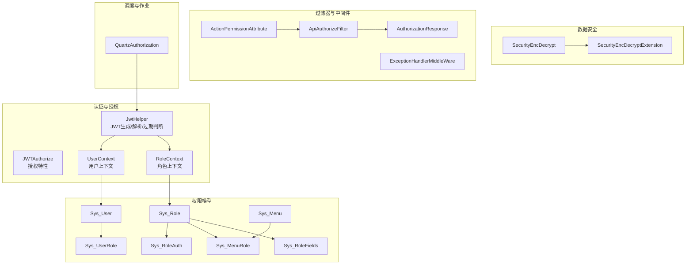
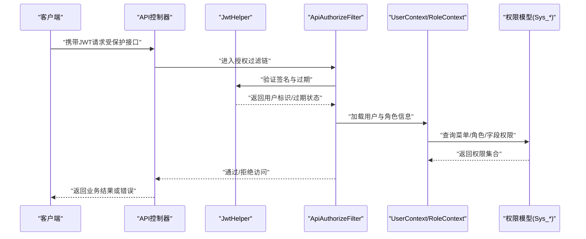
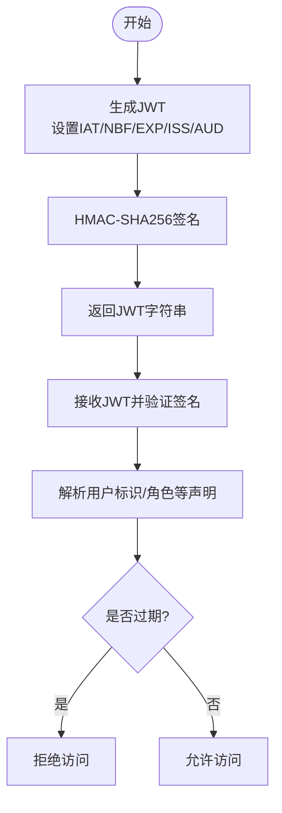
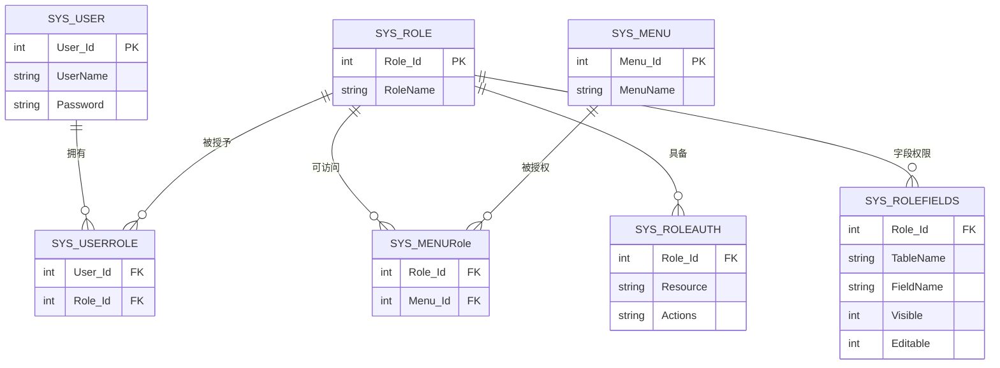
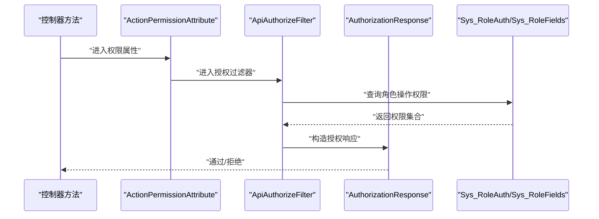
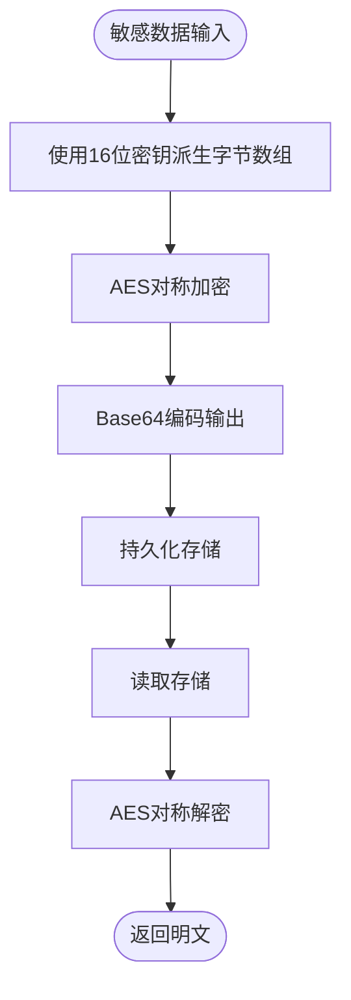
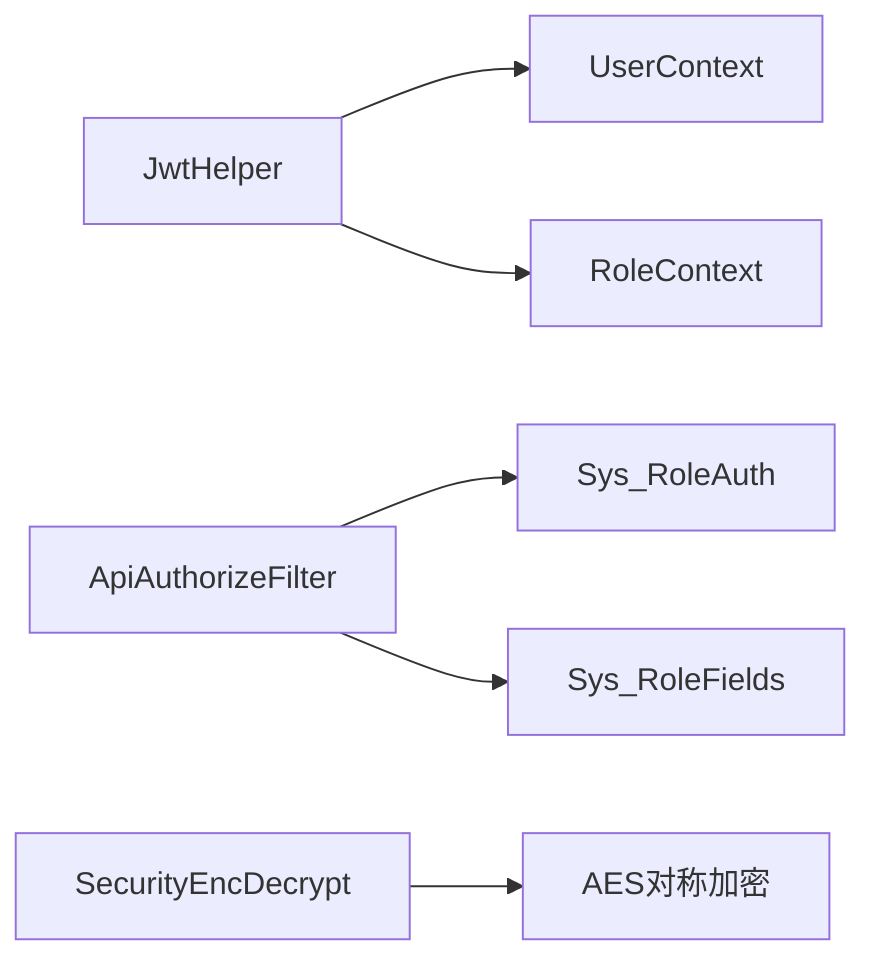

# 安全与权限

<cite>
**本文引用的文件**   
- [JwtHelper.cs](file://VolPro.Core/Utilities/JwtHelper.cs)
- [JWTAuthorize.cs](file://VolPro.Core/Filters/JWTAuthorize.cs)
- [SecurityEncDecrypt.cs](file://VolPro.Core/Utilities/SecurityEncDecrypt.cs)
- [SecurityEncDecryptExtension.cs](file://VolPro.Core/Extensions/SecurityEncDecryptExtension.cs)
- [UserContext.cs](file://VolPro.Core/UserManager/UserContext.cs)
- [RoleContext.cs](file://VolPro.Core/UserManager/RoleContext.cs)
- [Sys_Role.cs](file://VolPro.Entity/DomainModels/System/Sys_Role.cs)
- [Sys_User.cs](file://VolPro.Entity/DomainModels/System/Sys_User.cs)
- [Sys_Menu.cs](file://VolPro.Entity/DomainModels/System/Sys_Menu.cs)
- [Sys_RoleAuth.cs](file://VolPro.Entity/DomainModels/System/Sys_RoleAuth.cs)
- [Sys_UserRole.cs](file://VolPro.Entity/DomainModels/System/Sys_UserRole.cs)
- [Sys_MenuRole.cs](file://VolPro.Entity/DomainModels/System/Sys_MenuRole.cs)
- [Sys_RoleFields.cs](file://VolPro.Entity/DomainModels/System/Sys_RoleFields.cs)
- [ActionPermissionAttribute.cs](file://VolPro.Core/Filters/ActionPermissionAttribute.cs)
- [ApiAuthorizeFilter.cs](file://VolPro.Core/Filters/ApiAuthorizeFilter.cs)
- [AuthorizationResponse.cs](file://VolPro.Core/Extensions/AuthorizationResponse.cs)
- [ExceptionHandlerMiddleWare.cs](file://VolPro.Core/Middleware/ExceptionHandlerMiddleWare.cs)
- [QuartzAuthorization.cs](file://VolPro.Core/Quartz/QuartzAuthorization.cs)
- [appsettings.json](file://VolPro.WebApi/appsettings.json)
</cite>

## 目录
1. [引言](#引言)
2. [项目结构](#项目结构)
3. [核心组件](#核心组件)
4. [架构总览](#架构总览)
5. [详细组件分析](#详细组件分析)
6. [依赖关系分析](#依赖关系分析)
7. [性能考虑](#性能考虑)
8. [故障排查指南](#故障排查指南)
9. [结论](#结论)
10. [附录](#附录)

## 引言
本文件面向水化热平台的安全与权限系统，聚焦于身份认证（JWT）、权限控制（RBAC、操作权限与字段级权限）、数据安全（敏感数据加密、传输安全、会话管理）以及安全配置与应急响应。文档以代码库实际实现为依据，提供可操作的最佳实践与测试建议。

## 项目结构
围绕安全与权限的关键模块分布如下：
- 认证与授权：JwtHelper、JWTAuthorize、UserContext、RoleContext
- 权限模型：Sys_Role、Sys_User、Sys_Menu、Sys_RoleAuth、Sys_UserRole、Sys_MenuRole、Sys_RoleFields
- 数据安全：SecurityEncDecrypt、SecurityEncDecryptExtension
- 过滤器与中间件：ActionPermissionAttribute、ApiAuthorizeFilter、AuthorizationResponse、ExceptionHandlerMiddleWare
- 调度与作业：QuartzAuthorization
- 配置：appsettings.json

**图表来源**
- [JwtHelper.cs:13-95](file://VolPro.Core/Utilities/JwtHelper.cs#L13-L95)
- [JWTAuthorize.cs:8-14](file://VolPro.Core/Filters/JWTAuthorize.cs#L8-L14)
- [UserContext.cs](file://VolPro.Core/UserManager/UserContext.cs)
- [RoleContext.cs](file://VolPro.Core/UserManager/RoleContext.cs)
- [Sys_Role.cs](file://VolPro.Entity/DomainModels/System/Sys_Role.cs)
- [Sys_User.cs](file://VolPro.Entity/DomainModels/System/Sys_User.cs)
- [Sys_Menu.cs](file://VolPro.Entity/DomainModels/System/Sys_Menu.cs)
- [Sys_RoleAuth.cs](file://VolPro.Entity/DomainModels/System/Sys_RoleAuth.cs)
- [Sys_UserRole.cs](file://VolPro.Entity/DomainModels/System/Sys_UserRole.cs)
- [Sys_MenuRole.cs](file://VolPro.Entity/DomainModels/System/Sys_MenuRole.cs)
- [Sys_RoleFields.cs](file://VolPro.Entity/DomainModels/System/Sys_RoleFields.cs)
- [ActionPermissionAttribute.cs](file://VolPro.Core/Filters/ActionPermissionAttribute.cs)
- [ApiAuthorizeFilter.cs](file://VolPro.Core/Filters/ApiAuthorizeFilter.cs)
- [AuthorizationResponse.cs](file://VolPro.Core/Extensions/AuthorizationResponse.cs)
- [ExceptionHandlerMiddleWare.cs](file://VolPro.Core/Middleware/ExceptionHandlerMiddleWare.cs)
- [QuartzAuthorization.cs](file://VolPro.Core/Quartz/QuartzAuthorization.cs)
- [SecurityEncDecrypt.cs:10-72](file://VolPro.Core/Utilities/SecurityEncDecrypt.cs#L10-L72)
- [SecurityEncDecryptExtension.cs:8-87](file://VolPro.Core/Extensions/SecurityEncDecryptExtension.cs#L8-L87)

**章节来源**
- [JwtHelper.cs:13-95](file://VolPro.Core/Utilities/JwtHelper.cs#L13-L95)
- [JWTAuthorize.cs:8-14](file://VolPro.Core/Filters/JWTAuthorize.cs#L8-L14)
- [SecurityEncDecrypt.cs:10-72](file://VolPro.Core/Utilities/SecurityEncDecrypt.cs#L10-L72)
- [SecurityEncDecryptExtension.cs:8-87](file://VolPro.Core/Extensions/SecurityEncDecryptExtension.cs#L8-L87)
- [UserContext.cs](file://VolPro.Core/UserManager/UserContext.cs)
- [RoleContext.cs](file://VolPro.Core/UserManager/RoleContext.cs)
- [Sys_Role.cs](file://VolPro.Entity/DomainModels/System/Sys_Role.cs)
- [Sys_User.cs](file://VolPro.Entity/DomainModels/System/Sys_User.cs)
- [Sys_Menu.cs](file://VolPro.Entity/DomainModels/System/Sys_Menu.cs)
- [Sys_RoleAuth.cs](file://VolPro.Entity/DomainModels/System/Sys_RoleAuth.cs)
- [Sys_UserRole.cs](file://VolPro.Entity/DomainModels/System/Sys_UserRole.cs)
- [Sys_MenuRole.cs](file://VolPro.Entity/DomainModels/System/Sys_MenuRole.cs)
- [Sys_RoleFields.cs](file://VolPro.Entity/DomainModels/System/Sys_RoleFields.cs)
- [ActionPermissionAttribute.cs](file://VolPro.Core/Filters/ActionPermissionAttribute.cs)
- [ApiAuthorizeFilter.cs](file://VolPro.Core/Filters/ApiAuthorizeFilter.cs)
- [AuthorizationResponse.cs](file://VolPro.Core/Extensions/AuthorizationResponse.cs)
- [ExceptionHandlerMiddleWare.cs](file://VolPro.Core/Middleware/ExceptionHandlerMiddleWare.cs)
- [QuartzAuthorization.cs](file://VolPro.Core/Quartz/QuartzAuthorization.cs)
- [appsettings.json](file://VolPro.WebApi/appsettings.json)

## 核心组件
- JWT工具：负责令牌签发、解析、过期判断与用户标识提取，支持基于租户类型动态过期时间。
- 授权特性：JWTAuthorize用于标记受保护资源。
- 用户与角色上下文：UserContext/RoleContext提供运行时用户信息与角色信息的访问入口。
- 权限模型实体：Sys_Role、Sys_User、Sys_Menu、Sys_RoleAuth、Sys_UserRole、Sys_MenuRole、Sys_RoleFields构成RBAC与字段级权限的基础。
- 加密扩展：SecurityEncDecrypt与SecurityEncDecryptExtension提供对称加密/解密能力，用于敏感数据存储与传输场景。
- 权限过滤器：ActionPermissionAttribute与ApiAuthorizeFilter结合AuthorizationResponse进行操作权限校验。
- 中间件：ExceptionHandlerMiddleWare统一处理异常，保障安全事件不泄露内部细节。
- 调度授权：QuartzAuthorization确保后台任务执行时的权限一致性。
- 配置：appsettings.json集中管理JWT密钥、颁发者、受众及过期时间等安全参数。

**章节来源**
- [JwtHelper.cs:21-47](file://VolPro.Core/Utilities/JwtHelper.cs#L21-L47)
- [JWTAuthorize.cs:8-14](file://VolPro.Core/Filters/JWTAuthorize.cs#L8-L14)
- [UserContext.cs](file://VolPro.Core/UserManager/UserContext.cs)
- [RoleContext.cs](file://VolPro.Core/UserManager/RoleContext.cs)
- [Sys_Role.cs](file://VolPro.Entity/DomainModels/System/Sys_Role.cs)
- [Sys_User.cs](file://VolPro.Entity/DomainModels/System/Sys_User.cs)
- [Sys_Menu.cs](file://VolPro.Entity/DomainModels/System/Sys_Menu.cs)
- [Sys_RoleAuth.cs](file://VolPro.Entity/DomainModels/System/Sys_RoleAuth.cs)
- [Sys_UserRole.cs](file://VolPro.Entity/DomainModels/System/Sys_UserRole.cs)
- [Sys_MenuRole.cs](file://VolPro.Entity/DomainModels/System/Sys_MenuRole.cs)
- [Sys_RoleFields.cs](file://VolPro.Entity/DomainModels/System/Sys_RoleFields.cs)
- [ActionPermissionAttribute.cs](file://VolPro.Core/Filters/ActionPermissionAttribute.cs)
- [ApiAuthorizeFilter.cs](file://VolPro.Core/Filters/ApiAuthorizeFilter.cs)
- [AuthorizationResponse.cs](file://VolPro.Core/Extensions/AuthorizationResponse.cs)
- [ExceptionHandlerMiddleWare.cs](file://VolPro.Core/Middleware/ExceptionHandlerMiddleWare.cs)
- [QuartzAuthorization.cs](file://VolPro.Core/Quartz/QuartzAuthorization.cs)
- [SecurityEncDecrypt.cs:21-70](file://VolPro.Core/Utilities/SecurityEncDecrypt.cs#L21-L70)
- [SecurityEncDecryptExtension.cs:19-86](file://VolPro.Core/Extensions/SecurityEncDecryptExtension.cs#L19-L86)
- [appsettings.json](file://VolPro.WebApi/appsettings.json)

## 架构总览
下图展示从客户端到服务端的典型认证与授权流程，以及权限过滤与异常处理的协作关系。

**图表来源**
- [JwtHelper.cs:54-82](file://VolPro.Core/Utilities/JwtHelper.cs#L54-L82)
- [ApiAuthorizeFilter.cs](file://VolPro.Core/Filters/ApiAuthorizeFilter.cs)
- [UserContext.cs](file://VolPro.Core/UserManager/UserContext.cs)
- [RoleContext.cs](file://VolPro.Core/UserManager/RoleContext.cs)
- [Sys_Menu.cs](file://VolPro.Entity/DomainModels/System/Sys_Menu.cs)
- [Sys_RoleAuth.cs](file://VolPro.Entity/DomainModels/System/Sys_RoleAuth.cs)
- [Sys_RoleFields.cs](file://VolPro.Entity/DomainModels/System/Sys_RoleFields.cs)

## 详细组件分析

### JWT身份认证机制
- 令牌生成：使用对称密钥（HMAC SHA256）签发，包含签发时间、生效时间、过期时间、颁发者与受众等声明；过期时间根据租户类型动态调整。
- 令牌解析：从JWT中提取用户标识与角色等信息，用于后续授权决策。
- 过期判断：提供独立的过期时间解析与判断逻辑，便于前端在接近过期时触发刷新。
- 刷新策略：当前实现未直接暴露刷新接口，但可通过前端检测过期并重新登录换取新令牌的方式实现“刷新”语义。

**图表来源**
- [JwtHelper.cs:21-47](file://VolPro.Core/Utilities/JwtHelper.cs#L21-L47)
- [JwtHelper.cs:54-82](file://VolPro.Core/Utilities/JwtHelper.cs#L54-L82)

**章节来源**
- [JwtHelper.cs:21-95](file://VolPro.Core/Utilities/JwtHelper.cs#L21-L95)
- [JWTAuthorize.cs:8-14](file://VolPro.Core/Filters/JWTAuthorize.cs#L8-L14)

### 基于角色的访问控制（RBAC）
- 角色与用户：Sys_Role、Sys_User、Sys_UserRole建立角色-用户映射。
- 菜单与权限：Sys_Menu定义菜单项，Sys_MenuRole将菜单与角色关联，Sys_RoleAuth定义角色的操作权限集。
- 字段级权限：Sys_RoleFields定义角色对特定表字段的可见性/编辑性控制。
- 运行时上下文：UserContext/RoleContext在请求生命周期内加载当前用户的角色与权限集合，供过滤器与业务层使用。

**图表来源**
- [Sys_User.cs](file://VolPro.Entity/DomainModels/System/Sys_User.cs)
- [Sys_Role.cs](file://VolPro.Entity/DomainModels/System/Sys_Role.cs)
- [Sys_Menu.cs](file://VolPro.Entity/DomainModels/System/Sys_Menu.cs)
- [Sys_UserRole.cs](file://VolPro.Entity/DomainModels/System/Sys_UserRole.cs)
- [Sys_MenuRole.cs](file://VolPro.Entity/DomainModels/System/Sys_MenuRole.cs)
- [Sys_RoleAuth.cs](file://VolPro.Entity/DomainModels/System/Sys_RoleAuth.cs)
- [Sys_RoleFields.cs](file://VolPro.Entity/DomainModels/System/Sys_RoleFields.cs)
- [UserContext.cs](file://VolPro.Core/UserManager/UserContext.cs)
- [RoleContext.cs](file://VolPro.Core/UserManager/RoleContext.cs)

**章节来源**
- [Sys_User.cs](file://VolPro.Entity/DomainModels/System/Sys_User.cs)
- [Sys_Role.cs](file://VolPro.Entity/DomainModels/System/Sys_Role.cs)
- [Sys_Menu.cs](file://VolPro.Entity/DomainModels/System/Sys_Menu.cs)
- [Sys_UserRole.cs](file://VolPro.Entity/DomainModels/System/Sys_UserRole.cs)
- [Sys_MenuRole.cs](file://VolPro.Entity/DomainModels/System/Sys_MenuRole.cs)
- [Sys_RoleAuth.cs](file://VolPro.Entity/DomainModels/System/Sys_RoleAuth.cs)
- [Sys_RoleFields.cs](file://VolPro.Entity/DomainModels/System/Sys_RoleFields.cs)
- [UserContext.cs](file://VolPro.Core/UserManager/UserContext.cs)
- [RoleContext.cs](file://VolPro.Core/UserManager/RoleContext.cs)

### 操作权限与字段级权限控制
- 操作权限：ApiAuthorizeFilter结合AuthorizationResponse与Sys_RoleAuth，对请求资源与动作进行校验。
- 字段级权限：Sys_RoleFields定义表字段的可见/编辑权限，配合工作流与数据视图过滤器实现细粒度控制。
- 过滤器链：ActionPermissionAttribute作为入口，串联ApiAuthorizeFilter完成鉴权与授权。

**图表来源**
- [ActionPermissionAttribute.cs](file://VolPro.Core/Filters/ActionPermissionAttribute.cs)
- [ApiAuthorizeFilter.cs](file://VolPro.Core/Filters/ApiAuthorizeFilter.cs)
- [AuthorizationResponse.cs](file://VolPro.Core/Extensions/AuthorizationResponse.cs)
- [Sys_RoleAuth.cs](file://VolPro.Entity/DomainModels/System/Sys_RoleAuth.cs)
- [Sys_RoleFields.cs](file://VolPro.Entity/DomainModels/System/Sys_RoleFields.cs)

**章节来源**
- [ActionPermissionAttribute.cs](file://VolPro.Core/Filters/ActionPermissionAttribute.cs)
- [ApiAuthorizeFilter.cs](file://VolPro.Core/Filters/ApiAuthorizeFilter.cs)
- [AuthorizationResponse.cs](file://VolPro.Core/Extensions/AuthorizationResponse.cs)
- [Sys_RoleAuth.cs](file://VolPro.Entity/DomainModels/System/Sys_RoleAuth.cs)
- [Sys_RoleFields.cs](file://VolPro.Entity/DomainModels/System/Sys_RoleFields.cs)

### 数据安全措施
- 敏感数据加密：SecurityEncDecrypt与SecurityEncDecryptExtension提供对称加解密能力，适用于数据库连接密码等敏感信息的存储与传输。
- 传输安全：JWT采用HMAC签名，结合HTTPS部署可进一步强化传输链路安全。
- 会话安全管理：通过JWT过期时间与刷新策略控制会话有效期，避免长期有效令牌带来的风险。

**图表来源**
- [SecurityEncDecrypt.cs:21-70](file://VolPro.Core/Utilities/SecurityEncDecrypt.cs#L21-L70)
- [SecurityEncDecryptExtension.cs:19-86](file://VolPro.Core/Extensions/SecurityEncDecryptExtension.cs#L19-L86)

**章节来源**
- [SecurityEncDecrypt.cs:10-72](file://VolPro.Core/Utilities/SecurityEncDecrypt.cs#L10-L72)
- [SecurityEncDecryptExtension.cs:8-87](file://VolPro.Core/Extensions/SecurityEncDecryptExtension.cs#L8-L87)

### 安全配置最佳实践
- 密钥与参数：在appsettings.json中集中配置JWT密钥、颁发者、受众与过期时间，确保不同环境隔离与轮换策略。
- 过期管理：根据业务风险动态调整过期时间，并在前端实现过期预警与自动刷新。
- 审计与日志：ExceptionHandlerMiddleWare统一捕获异常，避免敏感信息泄露；建议结合Sys_Log记录关键安全事件。

**章节来源**
- [appsettings.json](file://VolPro.WebApi/appsettings.json)
- [ExceptionHandlerMiddleWare.cs](file://VolPro.Core/Middleware/ExceptionHandlerMiddleWare.cs)

### 应急响应机制
- 异常拦截：ExceptionHandlerMiddleWare对未处理异常进行统一处理，防止堆栈信息泄露。
- 权限回退：当权限模型异常或缺失时，应默认拒绝访问并记录审计日志。
- 令牌吊销：建议引入黑名单机制或短期令牌+刷新令牌组合，缩短攻击窗口。

**章节来源**
- [ExceptionHandlerMiddleWare.cs](file://VolPro.Core/Middleware/ExceptionHandlerMiddleWare.cs)

## 依赖关系分析
- 组件耦合：JwtHelper与UserContext/RoleContext存在运行时依赖；权限过滤器依赖权限模型实体与上下文。
- 外部依赖：Microsoft.IdentityModel.Tokens用于JWT签名验证；AES用于敏感数据加密。
- 循环依赖：当前结构未发现循环依赖，职责边界清晰。

**图表来源**
- [JwtHelper.cs:13-95](file://VolPro.Core/Utilities/JwtHelper.cs#L13-L95)
- [UserContext.cs](file://VolPro.Core/UserManager/UserContext.cs)
- [RoleContext.cs](file://VolPro.Core/UserManager/RoleContext.cs)
- [ApiAuthorizeFilter.cs](file://VolPro.Core/Filters/ApiAuthorizeFilter.cs)
- [Sys_RoleAuth.cs](file://VolPro.Entity/DomainModels/System/Sys_RoleAuth.cs)
- [Sys_RoleFields.cs](file://VolPro.Entity/DomainModels/System/Sys_RoleFields.cs)
- [SecurityEncDecrypt.cs:10-72](file://VolPro.Core/Utilities/SecurityEncDecrypt.cs#L10-L72)

**章节来源**
- [JwtHelper.cs:13-95](file://VolPro.Core/Utilities/JwtHelper.cs#L13-L95)
- [ApiAuthorizeFilter.cs](file://VolPro.Core/Filters/ApiAuthorizeFilter.cs)
- [Sys_RoleAuth.cs](file://VolPro.Entity/DomainModels/System/Sys_RoleAuth.cs)
- [Sys_RoleFields.cs](file://VolPro.Entity/DomainModels/System/Sys_RoleFields.cs)
- [SecurityEncDecrypt.cs:10-72](file://VolPro.Core/Utilities/SecurityEncDecrypt.cs#L10-L72)

## 性能考虑
- JWT验证：HMAC验证开销极低，适合高并发场景；建议缓存常用权限集合以减少数据库查询。
- 加密成本：AES加解密在高频场景下可能成为瓶颈，建议批量处理与连接池优化。
- 过期检查：在网关层或中间件层进行快速过期判断，避免进入业务逻辑。

## 故障排查指南
- 令牌无效：检查JWT签名算法、密钥一致性与颁发者/受众匹配。
- 权限拒绝：核对Sys_UserRole、Sys_MenuRole、Sys_RoleAuth配置是否正确。
- 字段级权限异常：确认Sys_RoleFields中的表名与字段名是否与实体一致。
- 加密异常：检查密钥长度与字符集，确保前后端一致。

**章节来源**
- [JwtHelper.cs:54-95](file://VolPro.Core/Utilities/JwtHelper.cs#L54-L95)
- [Sys_UserRole.cs](file://VolPro.Entity/DomainModels/System/Sys_UserRole.cs)
- [Sys_MenuRole.cs](file://VolPro.Entity/DomainModels/System/Sys_MenuRole.cs)
- [Sys_RoleAuth.cs](file://VolPro.Entity/DomainModels/System/Sys_RoleAuth.cs)
- [Sys_RoleFields.cs](file://VolPro.Entity/DomainModels/System/Sys_RoleFields.cs)
- [SecurityEncDecrypt.cs:21-70](file://VolPro.Core/Utilities/SecurityEncDecrypt.cs#L21-L70)

## 结论
该安全与权限体系以JWT为核心，结合RBAC与字段级权限模型，辅以对称加密与统一异常处理，形成完整的认证授权闭环。建议在生产环境中完善令牌刷新、吊销与审计机制，并持续进行安全测试与渗透评估。

## 附录
- 渗透测试建议：模拟越权访问、暴力破解、JWT重放与篡改、敏感字段绕过等场景。
- 安全测试方法：单元测试覆盖权限判定分支，集成测试验证过滤器链与异常处理，压力测试评估加密与鉴权性能。