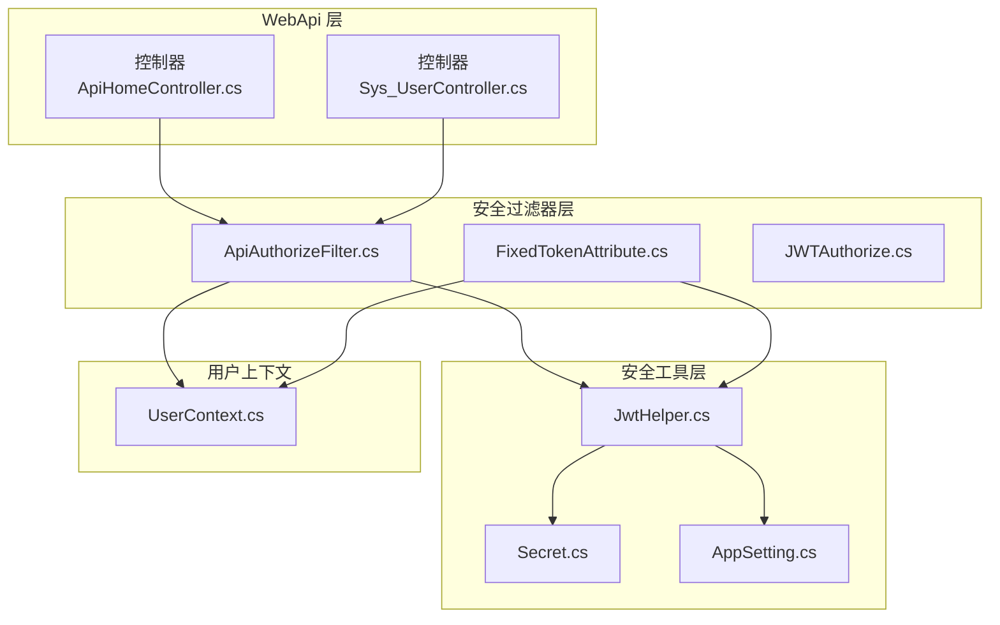
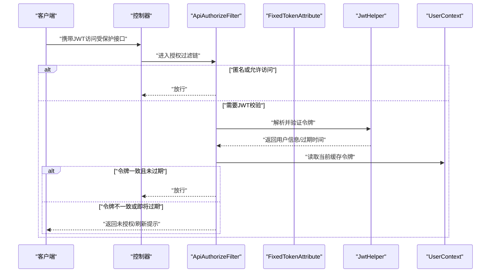
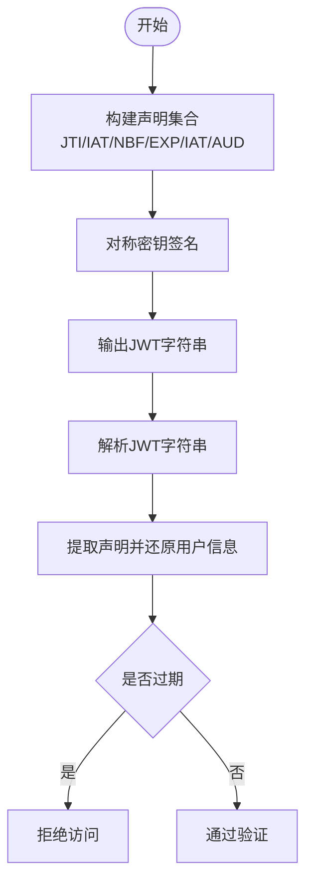
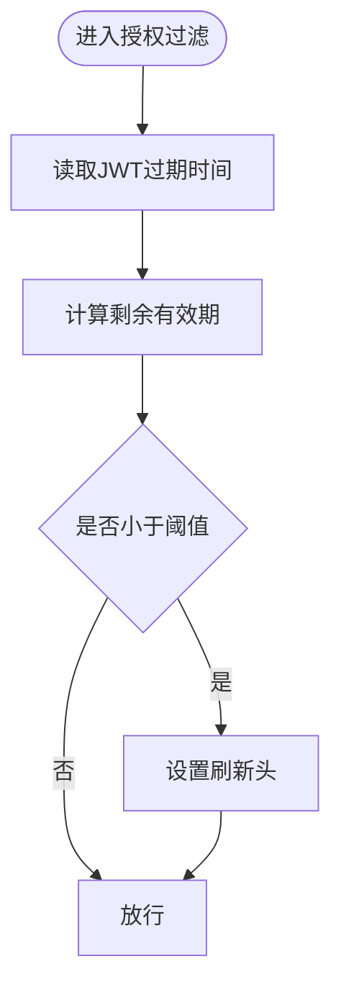
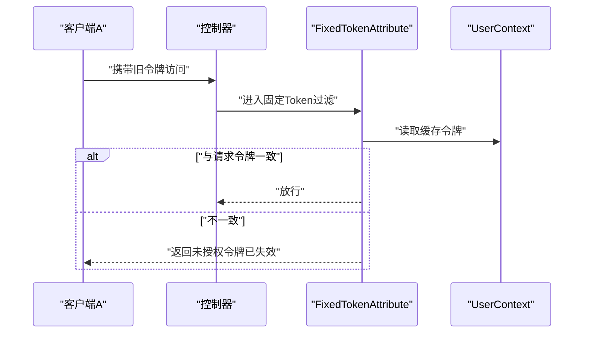
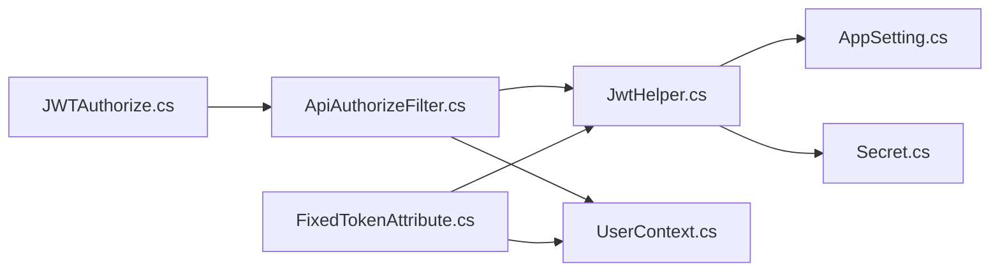

# 会话安全管理

<cite>
**本文引用的文件**
- [JwtHelper.cs](file://VolPro.Core/Utilities/JwtHelper.cs)
- [JWTAuthorize.cs](file://VolPro.Core/Filters/JWTAuthorize.cs)
- [FixedTokenAttribute.cs](file://VolPro.Core/Filters/FixedTokenAttribute.cs)
- [ApiAuthorizeFilter.cs](file://VolPro.Core/Filters/ApiAuthorizeFilter.cs)
- [Secret.cs](file://VolPro.Core/Const/Secret.cs)
- [UserContext.cs](file://VolPro.Core/UserManager/UserContext.cs)
- [AppSetting.cs](file://VolPro.Core/Configuration/AppSetting.cs)
- [ApiHomeController.cs](file://VolPro.WebApi/Controllers/ApiHomeController.cs)
- [Sys_UserController.cs](file://VolPro.Sys/Controllers/Sys_UserController.cs)
</cite>

## 目录
1. [引言](#引言)
2. [项目结构](#项目结构)
3. [核心组件](#核心组件)
4. [架构总览](#架构总览)
5. [详细组件分析](#详细组件分析)
6. [依赖关系分析](#依赖关系分析)
7. [性能考量](#性能考量)
8. [故障排查指南](#故障排查指南)
9. [结论](#结论)
10. [附录](#附录)

## 引言
本文件聚焦于系统中的会话安全管理，围绕JWT令牌的生成、验证与刷新机制展开，结合现有代码实现，梳理会话超时策略（空闲超时、绝对超时）、并发会话控制（单账号多设备登录限制与强制下线）、会话劫持防护（令牌绑定、IP与User-Agent校验思路）以及会话状态管理、令牌撤销与安全注销的实现方案，并给出配置最佳实践与常见问题解决方案。

## 项目结构
会话安全相关能力主要分布在以下模块：
- 安全工具层：JWT生成与解析、密钥与配置常量
- 过滤器层：全局授权过滤与固定Token过滤
- 用户上下文：当前用户与令牌缓存
- 控制器层：登录、刷新、注销等接口入口

**图表来源**
- [ApiHomeController.cs](file://VolPro.WebApi/Controllers/ApiHomeController.cs)
- [Sys_UserController.cs](file://VolPro.Sys/Controllers/Sys_UserController.cs)
- [ApiAuthorizeFilter.cs](file://VolPro.Core/Filters/ApiAuthorizeFilter.cs)
- [FixedTokenAttribute.cs](file://VolPro.Core/Filters/FixedTokenAttribute.cs)
- [JWTAuthorize.cs](file://VolPro.Core/Filters/JWTAuthorize.cs)
- [JwtHelper.cs](file://VolPro.Core/Utilities/JwtHelper.cs)
- [Secret.cs](file://VolPro.Core/Const/Secret.cs)
- [AppSetting.cs](file://VolPro.Core/Configuration/AppSetting.cs)
- [UserContext.cs](file://VolPro.Core/UserManager/UserContext.cs)

**章节来源**
- [JwtHelper.cs](file://VolPro.Core/Utilities/JwtHelper.cs)
- [ApiAuthorizeFilter.cs](file://VolPro.Core/Filters/ApiAuthorizeFilter.cs)
- [FixedTokenAttribute.cs](file://VolPro.Core/Filters/FixedTokenAttribute.cs)
- [JWTAuthorize.cs](file://VolPro.Core/Filters/JWTAuthorize.cs)
- [Secret.cs](file://VolPro.Core/Const/Secret.cs)
- [AppSetting.cs](file://VolPro.Core/Configuration/AppSetting.cs)
- [UserContext.cs](file://VolPro.Core/UserManager/UserContext.cs)

## 核心组件
- JWT助手：负责令牌签发、解析、过期时间获取与有效性判断
- 授权过滤器：统一拦截请求，校验令牌有效性与刷新提示
- 固定Token过滤器：支持“固定Token不过期”场景，校验缓存中令牌一致性
- 用户上下文：维护当前用户信息与令牌缓存，用于并发控制与强制下线
- 配置与密钥：提供JWT密钥、发行者、受众、过期时间等配置项

**章节来源**
- [JwtHelper.cs](file://VolPro.Core/Utilities/JwtHelper.cs)
- [ApiAuthorizeFilter.cs](file://VolPro.Core/Filters/ApiAuthorizeFilter.cs)
- [FixedTokenAttribute.cs](file://VolPro.Core/Filters/FixedTokenAttribute.cs)
- [UserContext.cs](file://VolPro.Core/UserManager/UserContext.cs)
- [Secret.cs](file://VolPro.Core/Const/Secret.cs)
- [AppSetting.cs](file://VolPro.Core/Configuration/AppSetting.cs)

## 架构总览
整体流程：客户端发起受保护请求 → 全局授权过滤器校验 → JWT助手解析与验证 → 用户上下文比对 → 返回响应或触发刷新/下线逻辑。

**图表来源**
- [ApiAuthorizeFilter.cs](file://VolPro.Core/Filters/ApiAuthorizeFilter.cs)
- [FixedTokenAttribute.cs](file://VolPro.Core/Filters/FixedTokenAttribute.cs)
- [JwtHelper.cs](file://VolPro.Core/Utilities/JwtHelper.cs)
- [UserContext.cs](file://VolPro.Core/UserManager/UserContext.cs)

## 详细组件分析

### JWT令牌生成与验证
- 令牌签发：根据用户信息与配置生成JWT，包含签发时间、生效时间、过期时间、发行者与受众等声明；使用对称密钥进行签名。
- 令牌解析：从JWT字符串中提取声明，还原用户信息；提供过期时间与有效性判断方法。
- 令牌结构要点：使用标准注册声明（如JTI、IAT、NBF、EXP），便于跨语言与跨平台互操作。

**图表来源**
- [JwtHelper.cs](file://VolPro.Core/Utilities/JwtHelper.cs)
- [Secret.cs](file://VolPro.Core/Const/Secret.cs)
- [AppSetting.cs](file://VolPro.Core/Configuration/AppSetting.cs)

**章节来源**
- [JwtHelper.cs](file://VolPro.Core/Utilities/JwtHelper.cs)
- [Secret.cs](file://VolPro.Core/Const/Secret.cs)
- [AppSetting.cs](file://VolPro.Core/Configuration/AppSetting.cs)

### 会话超时策略
- 绝对超时：基于JWT的EXP声明计算绝对过期时间，超过即视为无效。
- 空闲超时：当前实现通过“即将过期刷新提示”机制实现，当剩余有效期小于阈值时，向客户端发送刷新信号，由前端决定是否主动刷新。
- 动态调整：刷新阈值与过期时间来源于配置，支持按租户类型差异化配置。

**图表来源**
- [ApiAuthorizeFilter.cs](file://VolPro.Core/Filters/ApiAuthorizeFilter.cs)
- [JwtHelper.cs](file://VolPro.Core/Utilities/JwtHelper.cs)
- [AppSetting.cs](file://VolPro.Core/Configuration/AppSetting.cs)

**章节来源**
- [ApiAuthorizeFilter.cs](file://VolPro.Core/Filters/ApiAuthorizeFilter.cs)
- [JwtHelper.cs](file://VolPro.Core/Utilities/JwtHelper.cs)
- [AppSetting.cs](file://VolPro.Core/Configuration/AppSetting.cs)

### 并发会话控制（单账号多设备登录限制与强制下线）
- 当前实现：在固定Token过滤器中，比较请求中的令牌与用户上下文中缓存的令牌，若不一致则判定为“令牌已失效”，返回未授权。
- 强制下线：可通过更新用户上下文中的缓存令牌来实现，使旧令牌立即失效。
- 建议增强：引入令牌黑名单/撤销列表，记录被强制下线的令牌指纹，统一在授权阶段进行快速校验。

**图表来源**
- [FixedTokenAttribute.cs](file://VolPro.Core/Filters/FixedTokenAttribute.cs)
- [UserContext.cs](file://VolPro.Core/UserManager/UserContext.cs)

**章节来源**
- [FixedTokenAttribute.cs](file://VolPro.Core/Filters/FixedTokenAttribute.cs)
- [UserContext.cs](file://VolPro.Core/UserManager/UserContext.cs)

### 会话劫持防护（令牌绑定、IP验证、User-Agent检查）
- 令牌绑定：当前实现通过“固定Token不过期”与缓存令牌一致性校验，实现基本的令牌绑定效果。
- IP与User-Agent：当前未在授权过滤中直接校验IP或User-Agent，建议在授权过滤器中扩展，将请求的IP与UA写入声明并在签发时绑定，或在服务端侧维护绑定映射表以进行交叉验证。
- 建议：在签发时加入绑定字段，在解析后进行匹配校验；同时可引入滑动窗口统计与风险评分机制。

**章节来源**
- [FixedTokenAttribute.cs](file://VolPro.Core/Filters/FixedTokenAttribute.cs)
- [ApiAuthorizeFilter.cs](file://VolPro.Core/Filters/ApiAuthorizeFilter.cs)

### 会话状态管理、令牌撤销与安全注销
- 会话状态：用户上下文缓存当前令牌，作为并发控制与强制下线的基础。
- 令牌撤销：建议引入Redis等外部存储维护撤销列表，签发时记录撤销原因与时间，授权时快速匹配。
- 安全注销：提供“登出”接口，清除用户上下文缓存令牌与撤销列表，前端删除本地存储的JWT。

**章节来源**
- [UserContext.cs](file://VolPro.Core/UserManager/UserContext.cs)
- [ApiHomeController.cs](file://VolPro.WebApi/Controllers/ApiHomeController.cs)

### 刷新机制
- 刷新触发：当剩余有效期低于阈值时，授权过滤器设置刷新头，前端据此发起刷新请求。
- 刷新接口：建议提供独立的刷新接口，接收旧令牌并签发新令牌，同时将旧令牌加入撤销列表。

**章节来源**
- [ApiAuthorizeFilter.cs](file://VolPro.Core/Filters/ApiAuthorizeFilter.cs)

## 依赖关系分析
- JwtHelper依赖配置与密钥常量，用于签发与解析JWT。
- 授权过滤器依赖JwtHelper与用户上下文，完成令牌校验与并发控制。
- 固定Token过滤器在匿名或特定场景下绕过严格校验，但同样依赖用户上下文进行令牌一致性检查。
- 控制器层通过全局过滤器链实现统一安全控制。

**图表来源**
- [JwtHelper.cs](file://VolPro.Core/Utilities/JwtHelper.cs)
- [ApiAuthorizeFilter.cs](file://VolPro.Core/Filters/ApiAuthorizeFilter.cs)
- [FixedTokenAttribute.cs](file://VolPro.Core/Filters/FixedTokenAttribute.cs)
- [JWTAuthorize.cs](file://VolPro.Core/Filters/JWTAuthorize.cs)
- [Secret.cs](file://VolPro.Core/Const/Secret.cs)
- [AppSetting.cs](file://VolPro.Core/Configuration/AppSetting.cs)
- [UserContext.cs](file://VolPro.Core/UserManager/UserContext.cs)

**章节来源**
- [JwtHelper.cs](file://VolPro.Core/Utilities/JwtHelper.cs)
- [ApiAuthorizeFilter.cs](file://VolPro.Core/Filters/ApiAuthorizeFilter.cs)
- [FixedTokenAttribute.cs](file://VolPro.Core/Filters/FixedTokenAttribute.cs)
- [JWTAuthorize.cs](file://VolPro.Core/Filters/JWTAuthorize.cs)
- [Secret.cs](file://VolPro.Core/Const/Secret.cs)
- [AppSetting.cs](file://VolPro.Core/Configuration/AppSetting.cs)
- [UserContext.cs](file://VolPro.Core/UserManager/UserContext.cs)

## 性能考量
- JWT解析与签名：建议使用对称密钥以降低开销；避免在高频路径中重复解析。
- 缓存与撤销：并发控制与强制下线依赖用户上下文缓存，建议采用高性能缓存（如内存/Redis）并设置合理TTL。
- 刷新频率：动态刷新阈值应平衡用户体验与服务器压力，避免频繁刷新导致抖动。

## 故障排查指南
- 令牌无效：检查JWT是否过期、签名密钥是否正确、发行者与受众是否匹配。
- 并发冲突：确认固定Token过滤器是否正确执行，用户上下文缓存令牌是否被意外覆盖。
- 刷新不生效：检查授权过滤器是否设置了刷新头，前端是否正确处理刷新逻辑。
- 登出无效：确认登出接口是否清理了用户上下文缓存与撤销列表。

**章节来源**
- [JwtHelper.cs](file://VolPro.Core/Utilities/JwtHelper.cs)
- [ApiAuthorizeFilter.cs](file://VolPro.Core/Filters/ApiAuthorizeFilter.cs)
- [FixedTokenAttribute.cs](file://VolPro.Core/Filters/FixedTokenAttribute.cs)
- [UserContext.cs](file://VolPro.Core/UserManager/UserContext.cs)

## 结论
该代码库提供了JWT会话安全的核心骨架：令牌签发与解析、基础的并发控制与刷新提示。建议在此基础上进一步完善令牌撤销、IP与UA绑定、统一的登出与强制下线流程，以形成闭环的会话安全体系。

## 附录

### 会话安全配置最佳实践
- 密钥管理：使用强随机密钥，定期轮换；生产环境密钥存储于安全位置。
- 过期策略：区分不同租户类型的过期时间；设置合理的刷新阈值。
- 并发控制：启用固定Token一致性校验；必要时引入撤销列表。
- 风险防护：增加IP与UA绑定校验；对异常登录行为进行风控标记。

### 常见问题与解决方案
- 问题：多设备同时在线导致频繁掉线
  - 方案：启用固定Token不过期模式或优化并发控制策略
- 问题：刷新风暴
  - 方案：增大刷新阈值或引入指数退避策略
- 问题：登出后仍可访问
  - 方案：完善登出流程，清理缓存与撤销列表