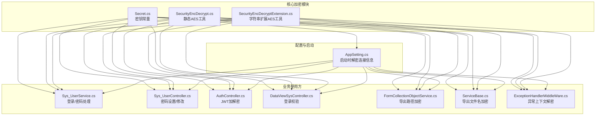
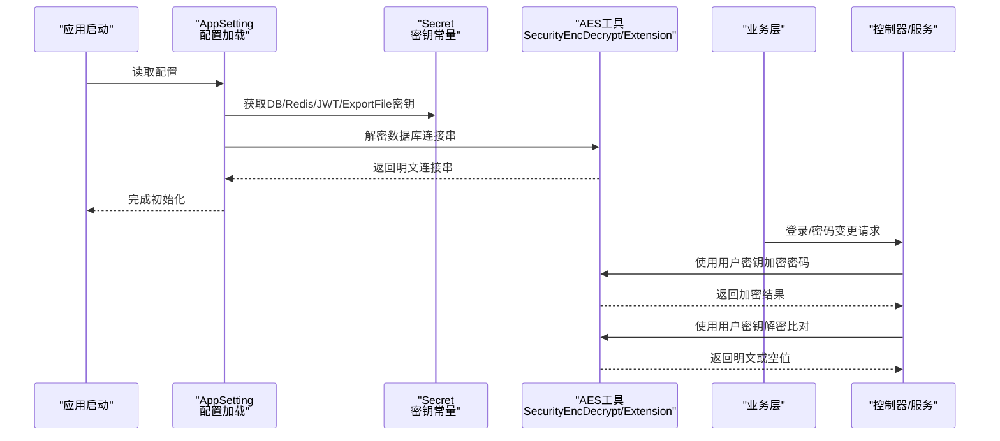
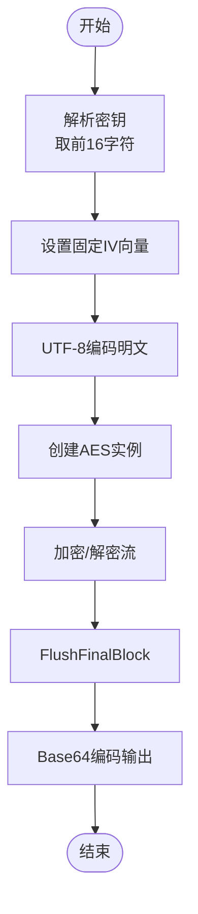
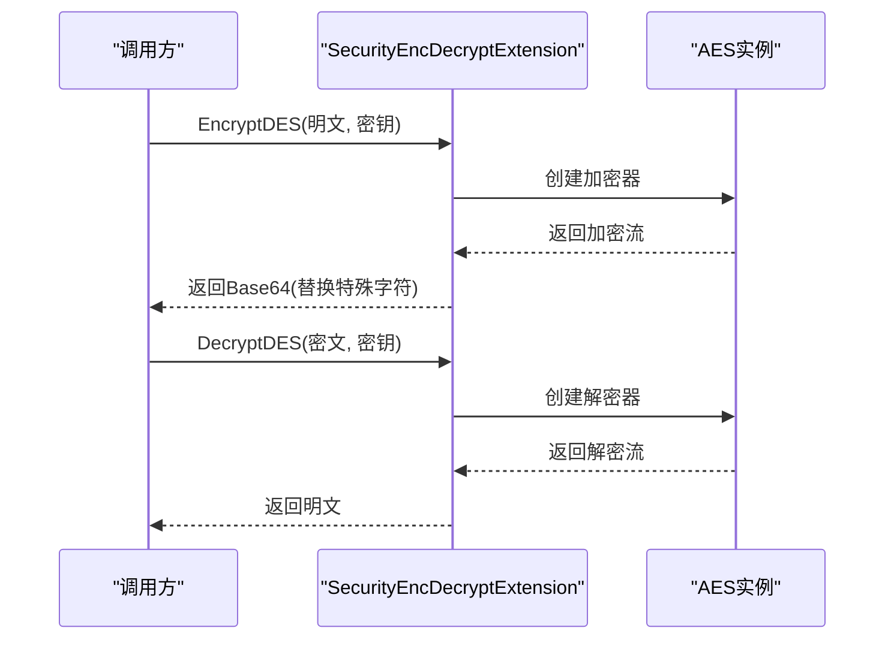
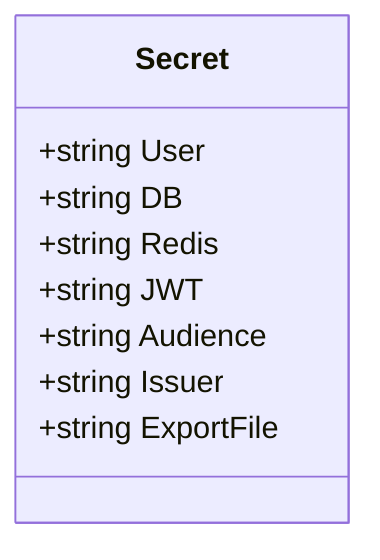
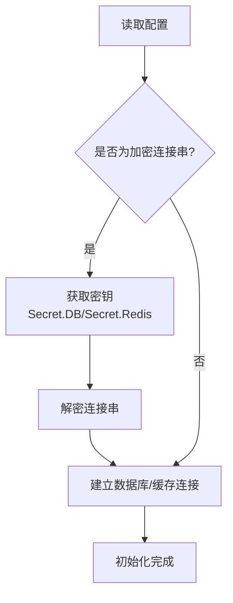
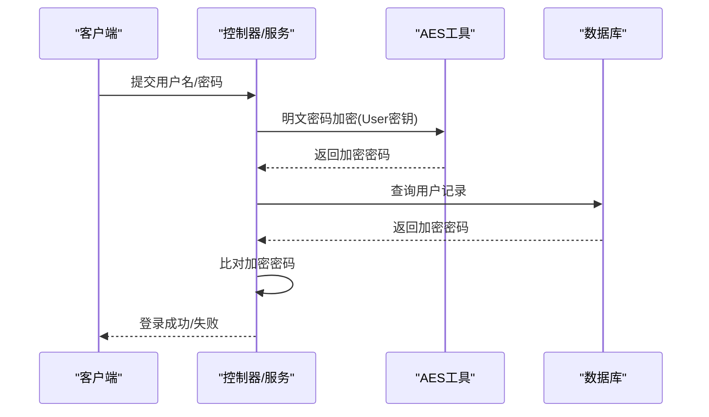
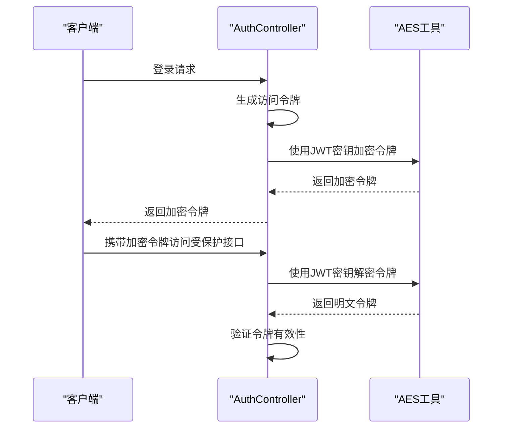
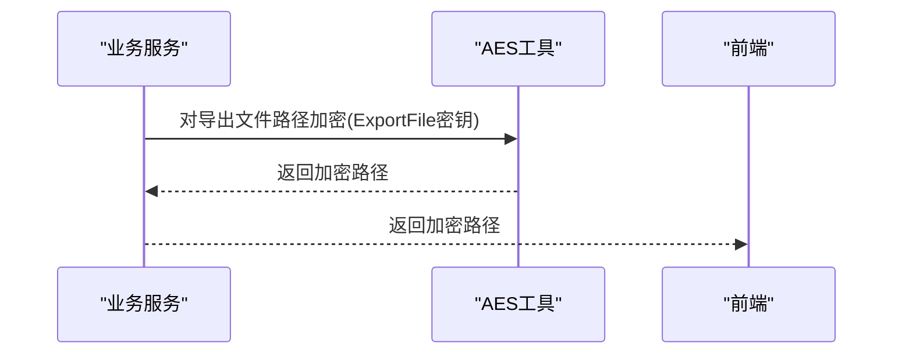
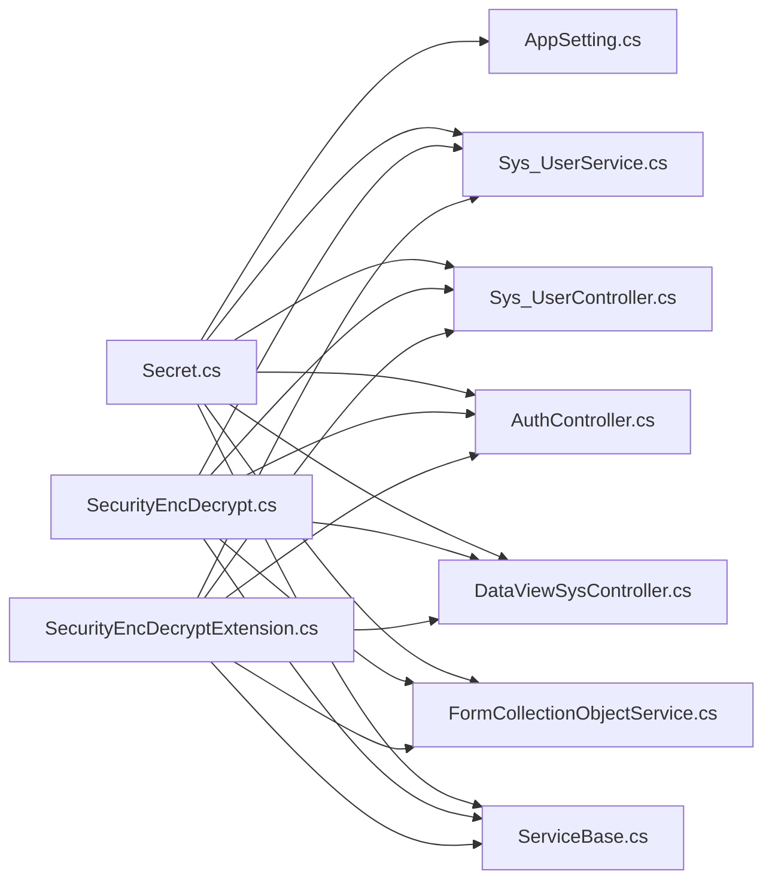

# 加密存储机制

<cite>
**本文引用的文件**
- [SecurityEncDecrypt.cs](file://VolPro.Core/Utilities/SecurityEncDecrypt.cs)
- [SecurityEncDecryptExtension.cs](file://VolPro.Core/Extensions/SecurityEncDecryptExtension.cs)
- [Secret.cs](file://VolPro.Core/Const/Secret.cs)
- [AppSetting.cs](file://VolPro.Core/Configuration/AppSetting.cs)
- [Sys_UserService.cs](file://VolPro.Sys/Services/System/Partial/Sys_UserService.cs)
- [Sys_UserController.cs](file://VolPro.WebApi/Controllers/Sys/Partial/Sys_UserController.cs)
- [AuthController.cs](file://VolPro.WebApi/Controllers/Auth/AuthController.cs)
- [DataViewSysController.cs](file://VolPro.WebApi/Controllers/DataView/DataViewSysController.cs)
- [FormCollectionObjectService.cs](file://VolPro.Sys/Services/form/Partial/FormCollectionObjectService.cs)
- [ServiceBase.cs](file://VolPro.Core/BaseProvider/ServiceBase.cs)
- [ExceptionHandlerMiddleWare.cs](file://VolPro.Core/Middleware/ExceptionHandlerMiddleWare.cs)
</cite>

## 目录
1. [简介](#简介)
2. [项目结构](#项目结构)
3. [核心组件](#核心组件)
4. [架构总览](#架构总览)
5. [详细组件分析](#详细组件分析)
6. [依赖关系分析](#依赖关系分析)
7. [性能考虑](#性能考虑)
8. [故障排查指南](#故障排查指南)
9. [结论](#结论)
10. [附录](#附录)

## 简介
本文件系统性阐述项目中采用的对称加密存储机制，重点围绕AES对称加密算法在以下方面的实现与应用：
- 密钥生成与管理策略（固定常量密钥与密钥长度约束）
- 加密与解密流程（静态类与扩展方法两种形态）
- 敏感数据的存储保护方案（用户密码、数据库连接信息、导出文件路径等）
- 加密扩展方法的使用方式（EncryptDES/DecryptDES/TryDecryptDES）
- 密钥轮换与安全管理最佳实践（密钥长度、IV向量、加密强度配置）
- 常见加密错误的定位与解决思路

## 项目结构
围绕加密功能的关键文件分布如下：
- 工具类：对称加密工具（AES），提供静态方法进行加密/解密
- 扩展类：字符串扩展方法，提供链式调用风格的加密/解密与容错解密
- 配置常量：集中存放各类加密用途的密钥（用户、数据库、Redis、JWT、导出文件）
- 应用配置：在启动时从加密存储中解密数据库与缓存连接信息
- 业务服务：在登录校验、密码更新、导出文件路径等场景使用加密/解密

**图表来源**
- [SecurityEncDecrypt.cs:10-73](file://VolPro.Core/Utilities/SecurityEncDecrypt.cs#L10-L73)
- [SecurityEncDecryptExtension.cs:8-88](file://VolPro.Core/Extensions/SecurityEncDecryptExtension.cs#L8-L88)
- [Secret.cs:6-35](file://VolPro.Core/Const/Secret.cs#L6-L35)
- [AppSetting.cs:140-170](file://VolPro.Core/Configuration/AppSetting.cs#L140-L170)
- [Sys_UserService.cs:60-85](file://VolPro.Sys/Services/System/Partial/Sys_UserService.cs#L60-L85)
- [Sys_UserController.cs:110-180](file://VolPro.WebApi/Controllers/Sys/Partial/Sys_UserController.cs#L110-L180)
- [AuthController.cs:45-75](file://VolPro.WebApi/Controllers/Auth/AuthController.cs#L45-L75)
- [DataViewSysController.cs:60-70](file://VolPro.WebApi/Controllers/DataView/DataViewSysController.cs#L60-L70)
- [FormCollectionObjectService.cs:80-90](file://VolPro.Sys/Services/form/Partial/FormCollectionObjectService.cs#L80-L90)
- [ServiceBase.cs:640-650](file://VolPro.Core/BaseProvider/ServiceBase.cs#L640-L650)
- [ExceptionHandlerMiddleWare.cs:45-60](file://VolPro.Core/Middleware/ExceptionHandlerMiddleWare.cs#L45-L60)

**章节来源**
- [SecurityEncDecrypt.cs:10-73](file://VolPro.Core/Utilities/SecurityEncDecrypt.cs#L10-L73)
- [SecurityEncDecryptExtension.cs:8-88](file://VolPro.Core/Extensions/SecurityEncDecryptExtension.cs#L8-L88)
- [Secret.cs:6-35](file://VolPro.Core/Const/Secret.cs#L6-L35)

## 核心组件
- AES静态工具类：提供基于AES的加密/解密静态方法，内部使用固定IV向量与UTF-8编码，密钥取自传入密钥的前16字符。
- 字符串扩展工具类：提供扩展方法EncryptDES/DecryptDES/TryDecryptDES，支持Base64输出字符集替换以适配URL安全传输，并提供容错解密。
- 密钥常量类：集中定义用户密码、数据库、Redis、JWT、导出文件等用途的密钥，便于统一管理和替换。

**章节来源**
- [SecurityEncDecrypt.cs:20-70](file://VolPro.Core/Utilities/SecurityEncDecrypt.cs#L20-L70)
- [SecurityEncDecryptExtension.cs:19-86](file://VolPro.Core/Extensions/SecurityEncDecryptExtension.cs#L19-L86)
- [Secret.cs:8-35](file://VolPro.Core/Const/Secret.cs#L8-L35)

## 架构总览
下图展示了从应用启动到业务层使用加密的完整流程，涵盖密钥加载、连接信息解密、用户认证与密码处理、JWT加解密以及导出路径加密等环节。

**图表来源**
- [AppSetting.cs:140-170](file://VolPro.Core/Configuration/AppSetting.cs#L140-L170)
- [Secret.cs:8-35](file://VolPro.Core/Const/Secret.cs#L8-L35)
- [SecurityEncDecrypt.cs:20-70](file://VolPro.Core/Utilities/SecurityEncDecrypt.cs#L20-L70)
- [SecurityEncDecryptExtension.cs:19-86](file://VolPro.Core/Extensions/SecurityEncDecryptExtension.cs#L19-L86)

## 详细组件分析

### AES静态工具类（SecurityEncDecrypt）
- 功能要点
  - 加密：接收明文字符串与密钥，截取密钥前16字符作为AES密钥，使用固定IV向量，返回Base64编码字符串。
  - 解密：接收Base64编码的密文，使用相同密钥与IV向量解码，返回UTF-8明文；异常时记录日志并返回空值。
  - 异常处理：加密异常抛出明确异常信息；解密异常记录日志并返回空值，便于上层判断。
- 复杂度与性能
  - 时间复杂度：O(n)，n为输入字节长度；内存开销主要来自流式加密/解密过程。
  - 性能建议：在高频调用场景可考虑复用AES实例与缓冲区，减少GC压力。
- 安全性注意
  - 固定IV向量存在重放风险，不建议用于高安全性场景；项目中已通过密钥长度与固定IV平衡易用性与安全性。

**图表来源**
- [SecurityEncDecrypt.cs:20-70](file://VolPro.Core/Utilities/SecurityEncDecrypt.cs#L20-L70)

**章节来源**
- [SecurityEncDecrypt.cs:20-70](file://VolPro.Core/Utilities/SecurityEncDecrypt.cs#L20-L70)

### 字符串扩展工具类（SecurityEncDecryptExtension）
- 功能要点
  - EncryptDES/DecryptDES：扩展方法形式的AES加解密，支持URL安全字符替换（+→_，/→~）。
  - TryDecryptDES：容错解密，捕获异常并返回布尔结果，便于健壮性处理。
- 使用场景
  - 在控制器与服务中以链式调用方式直接对字符串进行加解密，提升代码可读性与一致性。
- 性能与安全
  - 与静态工具类一致，采用固定IV向量；扩展方法在资源释放上使用using语句确保及时释放。

**图表来源**
- [SecurityEncDecryptExtension.cs:19-86](file://VolPro.Core/Extensions/SecurityEncDecryptExtension.cs#L19-L86)

**章节来源**
- [SecurityEncDecryptExtension.cs:19-86](file://VolPro.Core/Extensions/SecurityEncDecryptExtension.cs#L19-L86)

### 密钥常量类（Secret）
- 功能要点
  - 统一管理用户密码、数据库、Redis、JWT、导出文件等用途的密钥。
  - 导出文件密钥提供默认值，便于快速部署与演示。
- 管理建议
  - 生产环境应从安全渠道注入密钥，避免硬编码；支持密钥轮换与多版本并行验证。

**图表来源**
- [Secret.cs:6-35](file://VolPro.Core/Const/Secret.cs#L6-L35)

**章节来源**
- [Secret.cs:6-35](file://VolPro.Core/Const/Secret.cs#L6-L35)

### 应用配置（AppSetting）中的解密流程
- 启动阶段
  - 从配置中读取加密的数据库连接串与Redis连接串。
  - 使用对应密钥（Secret.DB/Secret.Redis）进行解密，得到明文后建立连接。
- 关键点
  - 解密失败会导致应用无法启动，需检查密钥是否正确、密文格式是否被篡改。

**图表来源**
- [AppSetting.cs:140-170](file://VolPro.Core/Configuration/AppSetting.cs#L140-L170)

**章节来源**
- [AppSetting.cs:140-170](file://VolPro.Core/Configuration/AppSetting.cs#L140-L170)

### 业务使用场景

#### 用户密码加密与校验
- 登录校验：将用户输入的明文密码按用户密钥加密后与数据库中存储的密文进行比对。
- 密码更新：旧密码与新密码均使用用户密钥加密后写入数据库。
- 访问令牌：生成的访问令牌使用JWT密钥加密，便于后续解密与验证。

**图表来源**
- [Sys_UserService.cs:60-85](file://VolPro.Sys/Services/System/Partial/Sys_UserService.cs#L60-L85)
- [Sys_UserService.cs:130-145](file://VolPro.Sys/Services/System/Partial/Sys_UserService.cs#L130-L145)
- [Sys_UserController.cs:110-180](file://VolPro.WebApi/Controllers/Sys/Partial/Sys_UserController.cs#L110-L180)
- [DataViewSysController.cs:60-70](file://VolPro.WebApi/Controllers/DataView/DataViewSysController.cs#L60-L70)

**章节来源**
- [Sys_UserService.cs:60-85](file://VolPro.Sys/Services/System/Partial/Sys_UserService.cs#L60-L85)
- [Sys_UserService.cs:130-145](file://VolPro.Sys/Services/System/Partial/Sys_UserService.cs#L130-L145)
- [Sys_UserController.cs:110-180](file://VolPro.WebApi/Controllers/Sys/Partial/Sys_UserController.cs#L110-L180)
- [DataViewSysController.cs:60-70](file://VolPro.WebApi/Controllers/DataView/DataViewSysController.cs#L60-L70)

#### JWT令牌加解密
- 生成：将访问令牌使用JWT密钥加密后返回给客户端。
- 验证：从请求中取出令牌并使用相同密钥解密，提取用户标识与过期时间等信息。

**图表来源**
- [AuthController.cs:45-75](file://VolPro.WebApi/Controllers/Auth/AuthController.cs#L45-L75)

**章节来源**
- [AuthController.cs:45-75](file://VolPro.WebApi/Controllers/Auth/AuthController.cs#L45-L75)

#### 导出文件路径加密
- 导出文件名或路径在返回前端前使用导出文件密钥进行加密，防止泄露真实存储位置。
- 服务基类与表单服务中均有相应调用示例。

**图表来源**
- [ServiceBase.cs:640-650](file://VolPro.Core/BaseProvider/ServiceBase.cs#L640-L650)
- [FormCollectionObjectService.cs:80-90](file://VolPro.Sys/Services/form/Partial/FormCollectionObjectService.cs#L80-L90)

**章节来源**
- [ServiceBase.cs:640-650](file://VolPro.Core/BaseProvider/ServiceBase.cs#L640-L650)
- [FormCollectionObjectService.cs:80-90](file://VolPro.Sys/Services/form/Partial/FormCollectionObjectService.cs#L80-L90)

## 依赖关系分析
- 组件耦合
  - AES工具类与扩展类被广泛使用于业务层（用户服务、控制器、中间件等），形成跨模块依赖。
  - 配置层依赖密钥常量，密钥常量为全局配置提供密钥来源。
- 可能的循环依赖
  - 当前结构清晰，无明显循环依赖迹象；若未来引入更多横切关注点，需避免在AES工具中引入配置层逻辑。
- 外部依赖
  - 使用System.Security.Cryptography命名空间提供的AES实现；日志记录依赖Logger（在解密异常时使用）。

**图表来源**
- [Secret.cs:6-35](file://VolPro.Core/Const/Secret.cs#L6-L35)
- [AppSetting.cs:140-170](file://VolPro.Core/Configuration/AppSetting.cs#L140-L170)
- [SecurityEncDecrypt.cs:20-70](file://VolPro.Core/Utilities/SecurityEncDecrypt.cs#L20-L70)
- [SecurityEncDecryptExtension.cs:19-86](file://VolPro.Core/Extensions/SecurityEncDecryptExtension.cs#L19-L86)
- [Sys_UserService.cs:60-85](file://VolPro.Sys/Services/System/Partial/Sys_UserService.cs#L60-L85)
- [Sys_UserController.cs:110-180](file://VolPro.WebApi/Controllers/Sys/Partial/Sys_UserController.cs#L110-L180)
- [AuthController.cs:45-75](file://VolPro.WebApi/Controllers/Auth/AuthController.cs#L45-L75)
- [DataViewSysController.cs:60-70](file://VolPro.WebApi/Controllers/DataView/DataViewSysController.cs#L60-L70)
- [FormCollectionObjectService.cs:80-90](file://VolPro.Sys/Services/form/Partial/FormCollectionObjectService.cs#L80-L90)
- [ServiceBase.cs:640-650](file://VolPro.Core/BaseProvider/ServiceBase.cs#L640-L650)

**章节来源**
- [Secret.cs:6-35](file://VolPro.Core/Const/Secret.cs#L6-L35)
- [AppSetting.cs:140-170](file://VolPro.Core/Configuration/AppSetting.cs#L140-L170)
- [SecurityEncDecrypt.cs:20-70](file://VolPro.Core/Utilities/SecurityEncDecrypt.cs#L20-L70)
- [SecurityEncDecryptExtension.cs:19-86](file://VolPro.Core/Extensions/SecurityEncDecryptExtension.cs#L19-L86)

## 性能考虑
- 流式处理：加密/解密使用MemoryStream与CryptoStream进行流式处理，适合中短文本；长文本建议分块处理以降低峰值内存占用。
- 资源释放：扩展方法使用using语句确保AES实例与流及时释放，避免资源泄漏。
- 缓存与复用：在高并发场景可考虑复用AES实例与缓冲区，减少对象分配与GC压力。
- 字符替换：扩展方法对Base64输出进行字符替换以适配URL，避免额外字符串转换成本。

## 故障排查指南
- 解密失败返回空值
  - 现象：TryDecryptDES返回false或DecryptDES返回null。
  - 排查：确认密钥是否正确、密文是否被篡改、字符替换是否还原（扩展方法会将“_”与“~”还原为“+”与“/”）。
- 加密异常
  - 现象：EncryptDES抛出异常。
  - 排查：检查密钥长度是否满足要求（取前16字符）、输入字符串编码是否正确、异常堆栈信息。
- 启动阶段连接失败
  - 现象：应用启动时数据库或Redis连接失败。
  - 排查：确认Secret.DB/Secret.Redis密钥是否正确，连接串是否为有效密文；查看解密日志定位问题。
- 中间件异常上下文
  - 现象：异常处理中需要对上下文信息进行解密。
  - 排查：确认密钥与密文格式，确保异常日志中包含可追溯信息。

**章节来源**
- [SecurityEncDecrypt.cs:35-68](file://VolPro.Core/Utilities/SecurityEncDecrypt.cs#L35-L68)
- [SecurityEncDecryptExtension.cs:39-86](file://VolPro.Core/Extensions/SecurityEncDecryptExtension.cs#L39-L86)
- [AppSetting.cs:140-170](file://VolPro.Core/Configuration/AppSetting.cs#L140-L170)
- [ExceptionHandlerMiddleWare.cs:45-60](file://VolPro.Core/Middleware/ExceptionHandlerMiddleWare.cs#L45-L60)

## 结论
项目采用AES对称加密在多个关键场景中实现了敏感数据的保护，包括用户密码、数据库连接信息、Redis连接信息、JWT令牌以及导出文件路径。通过静态工具类与扩展方法的结合，既保证了易用性，又提供了统一的密钥管理入口。建议在生产环境中进一步完善密钥轮换机制、引入随机IV向量与更严格的密钥注入策略，以提升整体安全性与可维护性。

## 附录

### 密钥管理与轮换最佳实践
- 密钥长度与格式
  - 密钥取前16字符，确保长度为16字节；建议使用强随机源生成并安全存储。
- IV向量使用
  - 当前实现使用固定IV向量，不建议用于高安全性场景；如需增强安全性，应采用随机IV并与密文一起存储。
- 加密强度配置
  - 使用AES标准参数；在高安全需求场景可考虑升级至更高强度的密钥长度（如256位）与更强的哈希算法。
- 密钥轮换
  - 新旧密钥并行验证：在密钥切换期间允许新旧密钥同时解密，逐步迁移存量数据。
  - 渐进式迁移：对新增数据使用新密钥，对历史数据在读取时自动迁移至新密钥。
- 安全存储
  - 密钥应从安全配置中心或硬件安全模块（HSM）注入，避免硬编码与明文存储。

### 常见错误与解决方案
- 密钥长度不足
  - 现象：加密/解密异常。
  - 解决：确保传入密钥至少16字符，系统会自动截取前16字符。
- 密文格式错误
  - 现象：解密返回空值或抛出异常。
  - 解决：确认密文为Base64编码，扩展方法会进行字符替换；必要时先还原字符再解密。
- 启动失败
  - 现象：应用无法启动。
  - 解决：检查Secret.DB/Secret.Redis密钥与连接串是否匹配，查看解密日志定位问题。