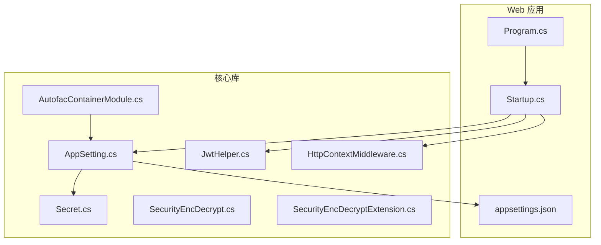
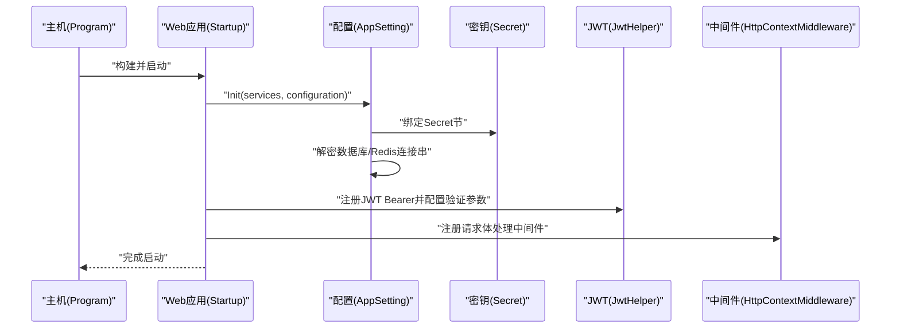
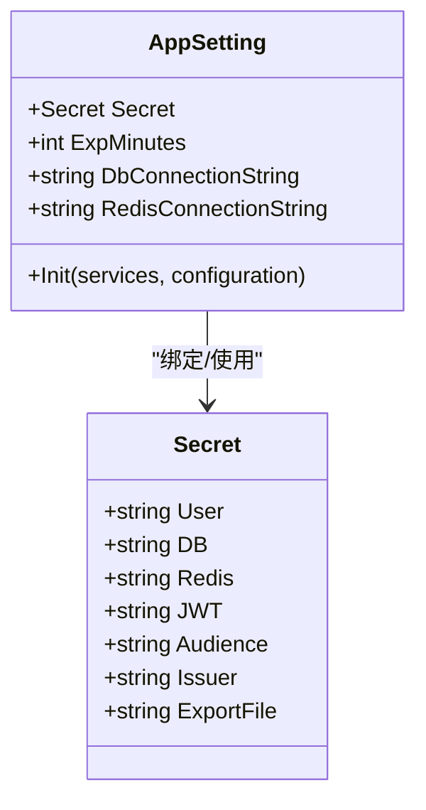
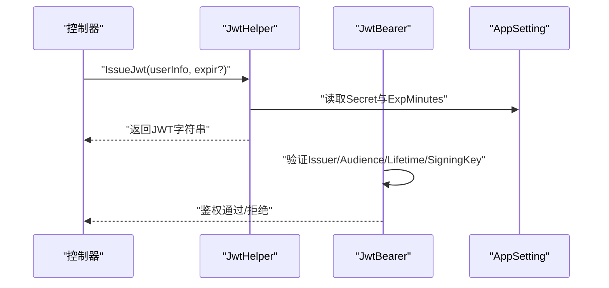
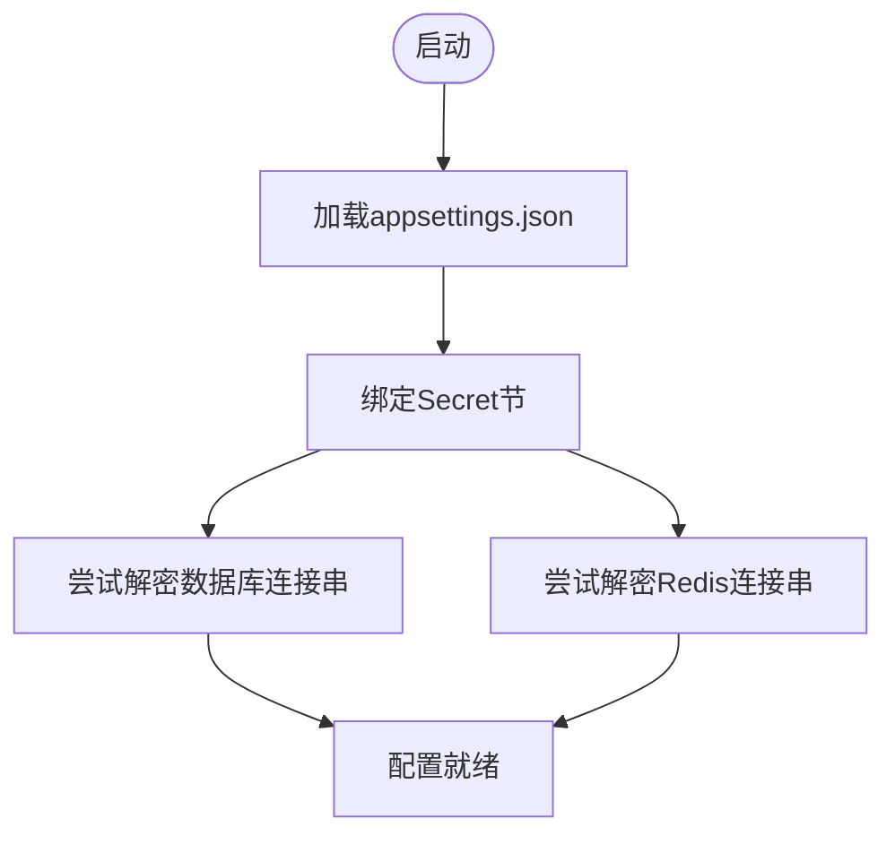
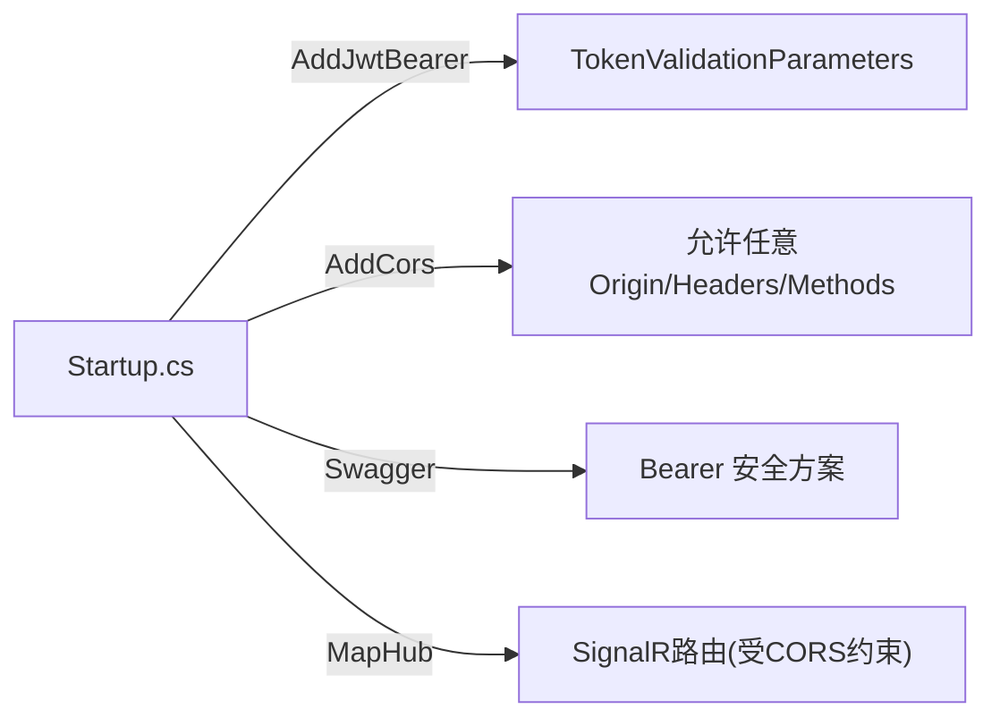
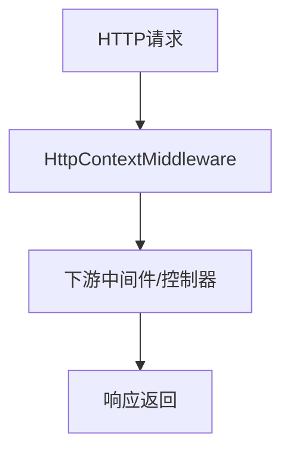
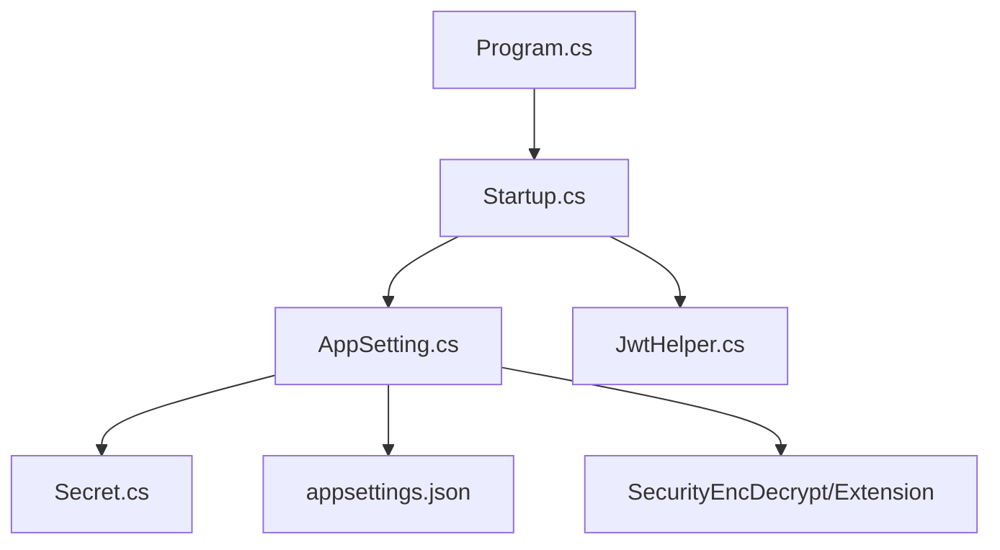

# 安全配置管理

<cite>
**本文引用的文件**
- [Secret.cs](file://VolPro.Core/Const/Secret.cs)
- [SecurityEncDecrypt.cs](file://VolPro.Core/Utilities/SecurityEncDecrypt.cs)
- [SecurityEncDecryptExtension.cs](file://VolPro.Core/Extensions/SecurityEncDecryptExtension.cs)
- [JwtHelper.cs](file://VolPro.Core/Utilities/JwtHelper.cs)
- [AppSetting.cs](file://VolPro.Core/Configuration/AppSetting.cs)
- [appsettings.json](file://VolPro.WebApi/appsettings.json)
- [Startup.cs](file://VolPro.WebApi/Startup.cs)
- [Program.cs](file://VolPro.WebApi/Program.cs)
- [HttpContextMiddleware.cs](file://VolPro.Core/Extensions/Middleware/HttpContextMiddleware.cs)
- [AutofacContainerModule.cs](file://VolPro.Core/Extensions/AutofacManager/AutofacContainerModule.cs)
</cite>

## 目录
1. [简介](#简介)
2. [项目结构](#项目结构)
3. [核心组件](#核心组件)
4. [架构总览](#架构总览)
5. [详细组件分析](#详细组件分析)
6. [依赖关系分析](#依赖关系分析)
7. [性能考虑](#性能考虑)
8. [故障排查指南](#故障排查指南)
9. [结论](#结论)
10. [附录](#附录)

## 简介
本文件面向“安全配置管理”的综合技术文档，围绕以下目标展开：
- 密码策略配置：密码复杂度要求、过期时间设置、历史密码限制
- 密钥轮换机制：密钥生成、分发、更新与销毁的完整流程
- 安全参数调优：会话超时、重试次数、并发限制、安全头设置
- 配置文件安全管理：敏感信息加密存储、配置文件权限控制、环境变量使用
- 安全基线检查清单与合规性要求
- 安全配置的自动化部署与监控方案

本项目采用基于 JSON 的配置中心（appsettings.json）与运行时解密机制，结合 JWT 认证、CORS、Kestrel 限制等手段实现安全配置落地。

## 项目结构
本项目采用多项目分层组织，与安全相关的关键位置如下：
- 配置与常量：VolPro.Core/Configuration、VolPro.Core/Const
- 安全工具：VolPro.Core/Utilities、VolPro.Core/Extensions
- Web 启动与中间件：VolPro.WebApi/Startup.cs、Program.cs
- 中间件扩展：VolPro.Core/Extensions/Middleware

**图表来源**
- [Program.cs:24-36](file://VolPro.WebApi/Program.cs#L24-L36)
- [Startup.cs:60-213](file://VolPro.WebApi/Startup.cs#L60-L213)
- [AppSetting.cs:85-163](file://VolPro.Core/Configuration/AppSetting.cs#L85-L163)
- [Secret.cs:6-35](file://VolPro.Core/Const/Secret.cs#L6-L35)
- [JwtHelper.cs:21-47](file://VolPro.Core/Utilities/JwtHelper.cs#L21-L47)
- [SecurityEncDecrypt.cs:21-70](file://VolPro.Core/Utilities/SecurityEncDecrypt.cs#L21-L70)
- [SecurityEncDecryptExtension.cs:19-87](file://VolPro.Core/Extensions/SecurityEncDecryptExtension.cs#L19-L87)
- [HttpContextMiddleware.cs:14-56](file://VolPro.Core/Extensions/Middleware/HttpContextMiddleware.cs#L14-L56)
- [AutofacContainerModule.cs:9-12](file://VolPro.Core/Extensions/AutofacManager/AutofacContainerModule.cs#L9-L12)

**章节来源**
- [Program.cs:17-36](file://VolPro.WebApi/Program.cs#L17-L36)
- [Startup.cs:60-213](file://VolPro.WebApi/Startup.cs#L60-L213)
- [AppSetting.cs:85-163](file://VolPro.Core/Configuration/AppSetting.cs#L85-L163)

## 核心组件
- 密钥与安全常量：集中于 Secret 类，包含用户密码、数据库、Redis、JWT、导出文件等密钥键位。
- 运行时配置加载：AppSetting 负责从 appsettings.json 绑定配置、初始化 Secret、解密数据库与 Redis 连接串。
- JWT 签发与校验：JwtHelper 提供签发、解析、过期判断；Startup.cs 注册 JWT Bearer 并配置令牌验证参数。
- 加密工具：SecurityEncDecrypt 与 SecurityEncDecryptExtension 提供对称加密/解密能力，用于敏感配置的存储与运行时解密。
- 中间件与启动：Startup.cs 配置 CORS、认证、授权、Swagger、SignalR；Program.cs 设置 Kestrel 请求体大小限制与监听地址。

**章节来源**
- [Secret.cs:6-35](file://VolPro.Core/Const/Secret.cs#L6-L35)
- [AppSetting.cs:85-163](file://VolPro.Core/Configuration/AppSetting.cs#L85-L163)
- [JwtHelper.cs:21-47](file://VolPro.Core/Utilities/JwtHelper.cs#L21-L47)
- [Startup.cs:84-114](file://VolPro.WebApi/Startup.cs#L84-L114)
- [SecurityEncDecrypt.cs:21-70](file://VolPro.Core/Utilities/SecurityEncDecrypt.cs#L21-L70)
- [SecurityEncDecryptExtension.cs:19-87](file://VolPro.Core/Extensions/SecurityEncDecryptExtension.cs#L19-L87)
- [Program.cs:28-33](file://VolPro.WebApi/Program.cs#L28-L33)

## 架构总览
下图展示安全配置在启动阶段的装配与运行时交互：

**图表来源**
- [Program.cs:24-36](file://VolPro.WebApi/Program.cs#L24-L36)
- [Startup.cs:84-114](file://VolPro.WebApi/Startup.cs#L84-L114)
- [AppSetting.cs:85-163](file://VolPro.Core/Configuration/AppSetting.cs#L85-L163)
- [JwtHelper.cs:21-47](file://VolPro.Core/Utilities/JwtHelper.cs#L21-L47)
- [HttpContextMiddleware.cs:14-56](file://VolPro.Core/Extensions/Middleware/HttpContextMiddleware.cs#L14-L56)

## 详细组件分析

### 密钥与配置管理
- Secret 类集中定义各类密钥键位，便于统一管理与替换。
- AppSetting.Init 在启动时从配置绑定 Secret，并尝试对数据库与 Redis 连接串进行解密，确保明文不落盘。
- appsettings.json 中的 Secret 节提供 JWT、Audience、Issuer、User、DB、Redis 等密钥值，ExpMinutes 控制 JWT 有效期。

**图表来源**
- [Secret.cs:6-35](file://VolPro.Core/Const/Secret.cs#L6-L35)
- [AppSetting.cs:85-163](file://VolPro.Core/Configuration/AppSetting.cs#L85-L163)

**章节来源**
- [Secret.cs:6-35](file://VolPro.Core/Const/Secret.cs#L6-L35)
- [AppSetting.cs:85-163](file://VolPro.Core/Configuration/AppSetting.cs#L85-L163)
- [appsettings.json:58-68](file://VolPro.WebApi/appsettings.json#L58-L68)

### JWT 策略与过期时间
- JwtHelper.IssueJwt 基于 AppSetting.Secret.JWT 与 Issuer/Audience 签发 JWT，默认 ExpMinutes 来自配置，支持按用户类型差异化过期时间。
- Startup.cs 注册 JwtBearer，启用 Issuer、Audience、签名密钥、失效时间等验证，未通过挑战时返回 401。
- JwtHelper 提供解析、过期判断与用户标识提取。

**图表来源**
- [JwtHelper.cs:21-47](file://VolPro.Core/Utilities/JwtHelper.cs#L21-L47)
- [Startup.cs:84-114](file://VolPro.WebApi/Startup.cs#L84-L114)
- [AppSetting.cs:63-64](file://VolPro.Core/Configuration/AppSetting.cs#L63-L64)

**章节来源**
- [JwtHelper.cs:21-47](file://VolPro.Core/Utilities/JwtHelper.cs#L21-L47)
- [Startup.cs:84-114](file://VolPro.WebApi/Startup.cs#L84-L114)
- [appsettings.json:68](file://VolPro.WebApi/appsettings.json#L68)

### 加密与解密流程
- SecurityEncDecrypt 与 SecurityEncDecryptExtension 提供对称加解密扩展方法，用于敏感配置的存储与运行时解密。
- AppSetting.Init 在加载配置后尝试对数据库与 Redis 连接串进行解密，避免明文存储。

**图表来源**
- [AppSetting.cs:148-161](file://VolPro.Core/Configuration/AppSetting.cs#L148-L161)
- [SecurityEncDecrypt.cs:21-70](file://VolPro.Core/Utilities/SecurityEncDecrypt.cs#L21-L70)
- [SecurityEncDecryptExtension.cs:19-87](file://VolPro.Core/Extensions/SecurityEncDecryptExtension.cs#L19-L87)

**章节来源**
- [AppSetting.cs:148-161](file://VolPro.Core/Configuration/AppSetting.cs#L148-L161)
- [SecurityEncDecrypt.cs:21-70](file://VolPro.Core/Utilities/SecurityEncDecrypt.cs#L21-L70)
- [SecurityEncDecryptExtension.cs:19-87](file://VolPro.Core/Extensions/SecurityEncDecryptExtension.cs#L19-L87)

### CORS、认证与授权
- Startup.cs 注册 JwtBearer 并配置验证参数，启用跨域策略（允许任意 Origin/Header/Method），并为 SignalR 指定允许的前端地址集合。
- Swagger 文档中声明 Bearer 安全方案，要求在 Header 中携带 Authorization: Bearer <token>。

**图表来源**
- [Startup.cs:84-130](file://VolPro.WebApi/Startup.cs#L84-L130)
- [Startup.cs:133-169](file://VolPro.WebApi/Startup.cs#L133-L169)
- [Startup.cs:366-380](file://VolPro.WebApi/Startup.cs#L366-L380)

**章节来源**
- [Startup.cs:84-130](file://VolPro.WebApi/Startup.cs#L84-L130)
- [Startup.cs:133-169](file://VolPro.WebApi/Startup.cs#L133-L169)
- [Startup.cs:366-380](file://VolPro.WebApi/Startup.cs#L366-L380)

### 中间件与请求体处理
- HttpContextMiddleware 提供请求体流的复制与回放，确保后续中间件/控制器能正确读取请求体。
- Program.cs 设置 Kestrel 最大请求体大小，防止过大请求导致内存压力。

**图表来源**
- [HttpContextMiddleware.cs:14-56](file://VolPro.Core/Extensions/Middleware/HttpContextMiddleware.cs#L14-L56)
- [Program.cs:28-33](file://VolPro.WebApi/Program.cs#L28-L33)

**章节来源**
- [HttpContextMiddleware.cs:14-56](file://VolPro.Core/Extensions/Middleware/HttpContextMiddleware.cs#L14-L56)
- [Program.cs:28-33](file://VolPro.WebApi/Program.cs#L28-L33)

## 依赖关系分析
- 启动阶段依赖链：Program → Startup → AppSetting → Secret → 配置文件
- 认证链路：Startup → JwtHelper → AppSetting.Secret
- 解密链路：AppSetting.Init → SecurityEncDecrypt/Extension → Secret.DB/Redis

**图表来源**
- [Program.cs:24-36](file://VolPro.WebApi/Program.cs#L24-L36)
- [Startup.cs:60-213](file://VolPro.WebApi/Startup.cs#L60-L213)
- [AppSetting.cs:85-163](file://VolPro.Core/Configuration/AppSetting.cs#L85-L163)
- [Secret.cs:6-35](file://VolPro.Core/Const/Secret.cs#L6-L35)
- [JwtHelper.cs:21-47](file://VolPro.Core/Utilities/JwtHelper.cs#L21-L47)
- [SecurityEncDecrypt.cs:21-70](file://VolPro.Core/Utilities/SecurityEncDecrypt.cs#L21-L70)
- [SecurityEncDecryptExtension.cs:19-87](file://VolPro.Core/Extensions/SecurityEncDecryptExtension.cs#L19-L87)

**章节来源**
- [Program.cs:24-36](file://VolPro.WebApi/Program.cs#L24-L36)
- [Startup.cs:60-213](file://VolPro.WebApi/Startup.cs#L60-L213)
- [AppSetting.cs:85-163](file://VolPro.Core/Configuration/AppSetting.cs#L85-L163)

## 性能考虑
- JWT 过期时间：ExpMinutes 默认 120 分钟，可通过配置调整；建议根据业务风险与用户体验平衡设置。
- 请求体大小限制：Kestrel 最大请求体大小已设置，避免异常增大导致内存占用过高。
- 缓存与会话：项目启用了内存缓存与 Session，需关注缓存命中率与内存占用。
- 认证开销：JWT 验证包含签名校验与过期时间校验，建议在网关或前置代理层做限流与缓存。

[本节为通用指导，无需特定文件来源]

## 故障排查指南
- JWT 401 未通过
  - 检查 Issuer/Audience 与签名密钥是否与签发一致
  - 确认请求头 Authorization: Bearer <token> 正确传递
  - 核对 ExpMinutes 与系统时间一致性
- 数据库/Redis 连接失败
  - 检查 Secret.DB/Secret.Redis 是否正确，以及运行时解密是否成功
  - 确认 appsettings.json 中连接串格式与目标服务一致
- CORS 报错
  - 确认 CorsUrls 已配置且包含前端访问地址
  - 检查预检请求与实际请求的 Origin/Headers/Method
- 请求体为空或过大
  - 检查 Kestrel 请求体大小限制
  - 确认前端上传文件大小与 Content-Type 正确

**章节来源**
- [Startup.cs:84-114](file://VolPro.WebApi/Startup.cs#L84-L114)
- [AppSetting.cs:148-161](file://VolPro.Core/Configuration/AppSetting.cs#L148-L161)
- [Program.cs:28-33](file://VolPro.WebApi/Program.cs#L28-L33)

## 结论
本项目通过集中式密钥管理、运行时解密、JWT 认证与严格验证、CORS 与 Kestrel 限制等手段，构建了较为完整的安全配置体系。建议在生产环境中进一步完善密钥轮换、审计日志、最小权限与合规检查，以满足更高安全等级的要求。

[本节为总结性内容，无需特定文件来源]

## 附录

### 安全配置管理清单
- 密钥管理
  - 使用 Secret 类集中管理密钥键位
  - 所有密钥在 appsettings.json 中以密文形式存储，运行时解密
  - 定期轮换密钥并更新配置
- 密码策略
  - 建议在用户密码层面引入复杂度规则（长度、字符集、历史限制）
  - 当前项目未见显式密码复杂度实现，建议在用户服务中补充
- JWT 策略
  - 已实现签发、验证、过期判断
  - 建议增加刷新令牌、黑名单与短时效访问令牌
- 连接串安全
  - 数据库与 Redis 连接串运行时解密
  - 建议使用专用密钥管理服务（如 Azure Key Vault、AWS Secrets Manager）
- CORS 与安全头
  - 已启用 CORS 允许任意 Origin/Header/Method
  - 建议在生产环境限定具体 Origin，并增加安全头（如 HSTS、X-Frame-Options、X-Content-Type-Options）
- 并发与限流
  - 建议在网关层或应用层增加速率限制与熔断保护
- 配置文件与环境变量
  - 建议将敏感配置迁移到环境变量或密钥管理服务
  - 本地开发使用 appsettings.json，生产使用环境变量覆盖

### 自动化部署与监控方案
- 部署
  - 使用 CI/CD 流水线注入环境变量与密钥
  - Docker 镜像中避免硬编码密钥，通过挂载或环境变量注入
- 监控
  - 记录认证失败、JWT 过期、CORS 异常、请求体过大等事件
  - 集成 APM/日志平台，设置告警阈值
- 合规
  - 定期审计密钥轮换、访问日志与配置变更
  - 符合数据最小化与加密存储要求

[本节为通用指导，无需特定文件来源]