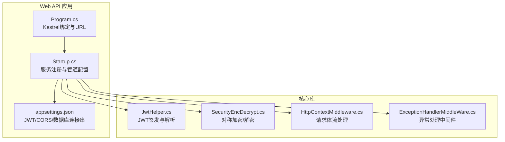
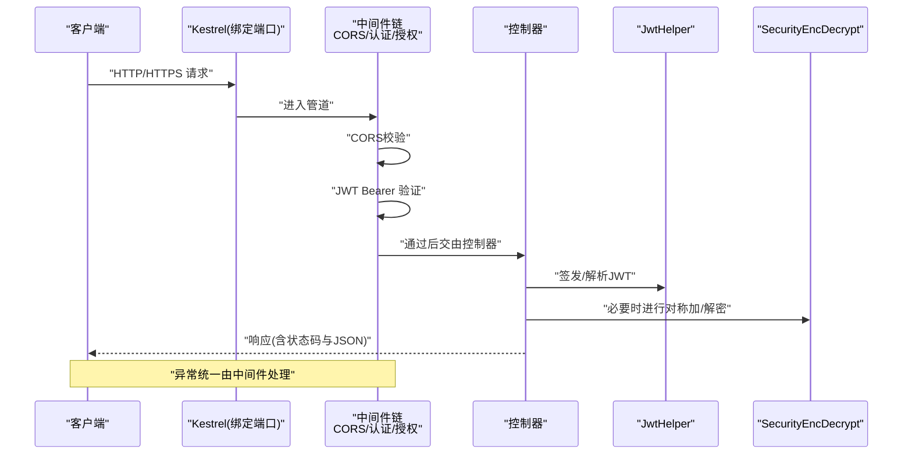
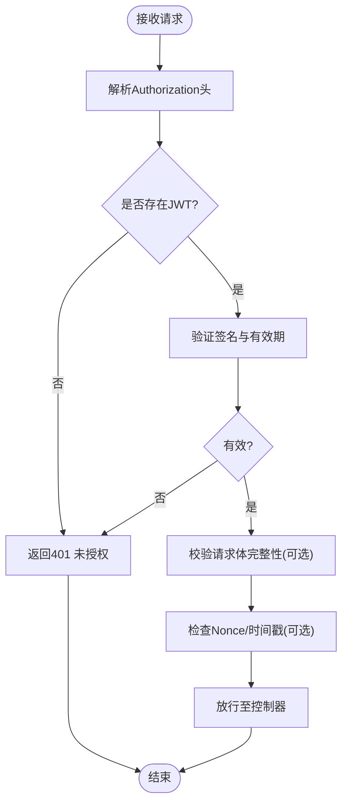
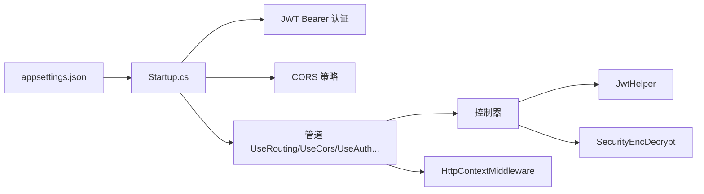

# 数据传输安全

<cite>
**本文引用的文件**
- [appsettings.json](file://VolPro.WebApi/appsettings.json)
- [appsettings.Development.json](file://VolPro.WebApi/appsettings.Development.json)
- [Program.cs](file://VolPro.WebApi/Program.cs)
- [Startup.cs](file://VolPro.WebApi/Startup.cs)
- [JwtHelper.cs](file://VolPro.Core/Utilities/JwtHelper.cs)
- [SecurityEncDecrypt.cs](file://VolPro.Core/Utilities/SecurityEncDecrypt.cs)
- [HttpContextMiddleware.cs](file://VolPro.Core/Extensions/Middleware/HttpContextMiddleware.cs)
- [ExceptionHandlerMiddleWare.cs](file://VolPro.Core/Extensions/Middleware/ExceptionHandlerMiddleWare.cs)
</cite>

## 目录
1. [引言](#引言)
2. [项目结构](#项目结构)
3. [核心组件](#核心组件)
4. [架构总览](#架构总览)
5. [详细组件分析](#详细组件分析)
6. [依赖关系分析](#依赖关系分析)
7. [性能考虑](#性能考虑)
8. [故障排查指南](#故障排查指南)
9. [结论](#结论)
10. [附录](#附录)

## 引言
本文件聚焦于该C#项目的“数据传输安全”，围绕HTTPS与TLS证书、中间人攻击防护、API传输安全（请求签名、防重放、完整性校验）、网络安全配置（防火墙、端口与隔离）以及传输加密的性能优化与漏洞防护展开。通过对配置文件、启动与中间件、认证与加密工具等关键代码的分析，给出可落地的安全实践建议与风险控制要点。

## 项目结构
本项目采用ASP.NET Core多项目结构，Web API入口位于VolPro.WebApi，核心安全能力由VolPro.Core提供，包括认证、中间件、工具类等。与传输安全直接相关的配置主要集中在：
- 启动与绑定：Program.cs中的Kestrel绑定与URL
- 安全配置：appsettings.json中的JWT、CORS、数据库连接串等
- 认证与授权：Startup.cs中的JWT认证、授权与Swagger安全定义
- 中间件链路：Startup.cs中的UseRouting/UseAuthentication/UseAuthorization/UseEndpoints等
- 加密与上下文：SecurityEncDecrypt.cs与HttpContextMiddleware.cs

图表来源
- [Program.cs:24-36](file://VolPro.WebApi/Program.cs#L24-L36)
- [Startup.cs:60-213](file://VolPro.WebApi/Startup.cs#L60-L213)
- [appsettings.json:58-68](file://VolPro.WebApi/appsettings.json#L58-L68)
- [JwtHelper.cs:21-47](file://VolPro.Core/Utilities/JwtHelper.cs#L21-L47)
- [SecurityEncDecrypt.cs:21-70](file://VolPro.Core/Utilities/SecurityEncDecrypt.cs#L21-L70)
- [HttpContextMiddleware.cs:14-56](file://VolPro.Core/Extensions/Middleware/HttpContextMiddleware.cs#L14-L56)

章节来源
- [Program.cs:17-36](file://VolPro.WebApi/Program.cs#L17-L36)
- [Startup.cs:309-382](file://VolPro.WebApi/Startup.cs#L309-L382)
- [appsettings.json:14-68](file://VolPro.WebApi/appsettings.json#L14-L68)

## 核心组件
- HTTPS与Kestrel绑定：Program.cs显式绑定HTTP端口，但未见HTTPS证书配置；需结合反向代理或IIS进行TLS终止。
- JWT认证：Startup.cs配置JWT Bearer认证，JwtHelper负责签发与解析；appsettings.json提供密钥与有效期。
- CORS与跨域：Startup.cs允许任意来源与方法，需结合前端域名白名单与凭证策略。
- 请求体处理：HttpContextMiddleware确保可重复读取请求体，便于签名/校验。
- 异常处理：ExceptionHandlerMiddleWare预留异常处理扩展点。
- 传输加密：SecurityEncDecrypt提供对称加解密工具，适用于静态数据保护，非传输层TLS。

章节来源
- [Program.cs:28-33](file://VolPro.WebApi/Program.cs#L28-L33)
- [Startup.cs:84-114](file://VolPro.WebApi/Startup.cs#L84-L114)
- [JwtHelper.cs:21-47](file://VolPro.Core/Utilities/JwtHelper.cs#L21-L47)
- [appsettings.json:58-68](file://VolPro.WebApi/appsettings.json#L58-L68)
- [HttpContextMiddleware.cs:14-56](file://VolPro.Core/Extensions/Middleware/HttpContextMiddleware.cs#L14-L56)
- [ExceptionHandlerMiddleWare.cs:14-90](file://VolPro.Core/Extensions/Middleware/ExceptionHandlerMiddleWare.cs#L14-L90)
- [SecurityEncDecrypt.cs:21-70](file://VolPro.Core/Utilities/SecurityEncDecrypt.cs#L21-L70)

## 架构总览
下图展示从客户端到API的典型请求路径，以及与传输安全相关的关键环节：CORS、JWT认证、请求体处理与异常处理。

图表来源
- [Startup.cs:362-382](file://VolPro.WebApi/Startup.cs#L362-L382)
- [Startup.cs:84-114](file://VolPro.WebApi/Startup.cs#L84-L114)
- [JwtHelper.cs:21-47](file://VolPro.Core/Utilities/JwtHelper.cs#L21-L47)
- [SecurityEncDecrypt.cs:21-70](file://VolPro.Core/Utilities/SecurityEncDecrypt.cs#L21-L70)
- [HttpContextMiddleware.cs:14-56](file://VolPro.Core/Extensions/Middleware/HttpContextMiddleware.cs#L14-L56)

## 详细组件分析

### HTTPS与TLS证书管理
- 当前配置现状
  - Kestrel绑定HTTP端口，未见HTTPS绑定与证书配置。
  - 数据库连接串中出现“Encrypt=True;TrustServerCertificate=True”，表明数据库侧启用了加密但信任服务器证书（存在中间人风险）。
- 建议与最佳实践
  - 在生产环境通过反向代理（如Nginx/IIS）终止TLS，或在Kestrel中配置HTTPS与证书路径。
  - 证书申请与部署：优先使用受信CA签发的证书；在IIS中导入PFX并绑定站点；或在容器/云环境中使用托管证书。
  - 自动续期：结合ACME客户端（如Certbot）或云厂商证书管理服务实现自动化续期。
  - 服务器证书验证：禁用“TrustServerCertificate”，强制证书链验证与主机名匹配。
- 影响范围
  - 若仅使用HTTP，敏感数据（JWT、登录凭据、业务数据）将暴露在明文传输中，易被窃听与篡改。

章节来源
- [Program.cs:28-33](file://VolPro.WebApi/Program.cs#L28-L33)
- [appsettings.json:19-25](file://VolPro.WebApi/appsettings.json#L19-L25)

### 中间人攻击防护
- 证书验证与主机名验证
  - 禁止使用“TrustServerCertificate=True”；确保证书链完整、根可信、主机名匹配。
  - 在客户端与数据库驱动层启用严格证书验证。
- 证书固定（Pinning）
  - 在客户端实现证书指纹固定，避免受控CA或中间证书变更导致的风险。
  - 对关键API接口可考虑公钥固定（HPKP替代方案：现代浏览器已弃用，建议以证书/主机名验证为主）。
- 运行时检查
  - 在启动阶段校验证书有效性与到期时间；对异常连接进行阻断与日志记录。

章节来源
- [appsettings.json:19-25](file://VolPro.WebApi/appsettings.json#L19-L25)

### API接口传输安全
- 请求签名与完整性校验
  - 基于JWT的签名验证：JwtHelper使用对称密钥签发与验证，建议使用强随机密钥并定期轮换。
  - 请求体完整性：结合请求头（如Content-MD5/SHA-256）与时间戳Nonce实现签名，服务端复核签名与时间窗口。
- 防重放攻击
  - 使用一次性Nonce与滑动时间窗；服务端缓存已使用Nonce并设置过期时间。
- 数据完整性与机密性
  - 传输层：强制HTTPS/TLS；应用层：对敏感字段（如密码、令牌）进行加密存储与最小化暴露。
- 认证与授权
  - Startup.cs配置JWT Bearer认证，要求Authorization头携带Bearer token；Swagger中定义了安全方案。

图表来源
- [Startup.cs:84-114](file://VolPro.WebApi/Startup.cs#L84-L114)
- [JwtHelper.cs:21-47](file://VolPro.Core/Utilities/JwtHelper.cs#L21-L47)

章节来源
- [Startup.cs:84-114](file://VolPro.WebApi/Startup.cs#L84-L114)
- [JwtHelper.cs:21-47](file://VolPro.Core/Utilities/JwtHelper.cs#L21-L47)

### 网络安全配置指南
- 防火墙与端口管理
  - 仅开放必需端口（如HTTP 80/HTTPS 443与内部管理端口），关闭不必要的入站端口。
  - 对外暴露API仅限HTTPS端口，内部数据库端口仅限内网访问。
- 网络隔离策略
  - 将Web API置于DMZ区，数据库置于内网隔离区；通过跳板机与VPN访问管理端口。
  - 使用子网划分与ACL限制跨网段通信。
- CORS与凭证
  - Startup.cs当前允许任意来源与方法，建议改为精确白名单（前端域名），并按需开启AllowCredentials。
  - 配置预检缓存时间，减少OPTIONS请求开销。

章节来源
- [Startup.cs:116-130](file://VolPro.WebApi/Startup.cs#L116-L130)
- [Startup.cs:372-380](file://VolPro.WebApi/Startup.cs#L372-L380)
- [appsettings.json:67](file://VolPro.WebApi/appsettings.json#L67)

### 传输加密与性能优化
- TLS性能优化
  - 启用TLS会话复用与ALPN；合理设置证书链长度；使用硬件加速（如Intel AES-NI）提升对称加密性能。
  - 在反向代理层做TLS终止，释放应用服务器负载。
- 应用层加密
  - SecurityEncDecrypt提供对称加解密，适合静态数据保护；对高频请求场景建议减少不必要的加解密操作。
- 请求体处理
  - HttpContextMiddleware确保请求体可重复读取，便于签名与校验，但会带来内存占用；需配合合理的请求体大小限制与超时设置。

章节来源
- [HttpContextMiddleware.cs:14-56](file://VolPro.Core/Extensions/Middleware/HttpContextMiddleware.cs#L14-L56)
- [SecurityEncDecrypt.cs:21-70](file://VolPro.Core/Utilities/SecurityEncDecrypt.cs#L21-L70)
- [Program.cs:30](file://VolPro.WebApi/Program.cs#L30)

## 依赖关系分析
- 认证链路
  - Startup.cs注册JWT Bearer认证，JwtHelper负责签发与解析；控制器在授权后执行业务逻辑。
- 中间件链路
  - Startup.cs中UseRouting/UseCors/UseAuthentication/UseAuthorization/UseEndpoints构成标准管道；HttpContextMiddleware在路由之前处理请求体。
- 配置依赖
  - appsettings.json提供JWT密钥、Audience、Issuer、CORS白名单与数据库连接串；程序启动时加载。

图表来源
- [Startup.cs:60-213](file://VolPro.WebApi/Startup.cs#L60-L213)
- [appsettings.json:58-68](file://VolPro.WebApi/appsettings.json#L58-L68)
- [JwtHelper.cs:21-47](file://VolPro.Core/Utilities/JwtHelper.cs#L21-L47)
- [SecurityEncDecrypt.cs:21-70](file://VolPro.Core/Utilities/SecurityEncDecrypt.cs#L21-L70)
- [HttpContextMiddleware.cs:14-56](file://VolPro.Core/Extensions/Middleware/HttpContextMiddleware.cs#L14-L56)

章节来源
- [Startup.cs:60-213](file://VolPro.WebApi/Startup.cs#L60-L213)
- [appsettings.json:58-68](file://VolPro.WebApi/appsettings.json#L58-L68)

## 性能考虑
- 传输层
  - 在反向代理层启用TLS会话复用与压缩；合理配置证书链与协议版本（禁用弱加密套件）。
- 应用层
  - 减少不必要的对称加解密；对高频接口采用缓存与限流；优化数据库连接池与查询。
- 中间件
  - 控制CORS预检频率；避免在中间件中进行昂贵的IO操作；及时释放内存与流资源。

## 故障排查指南
- 401未授权
  - 检查Authorization头格式与Bearer token有效性；确认JWT Issuer/Audience与密钥一致。
- CORS失败
  - 确认前端域名已在CorsUrls中配置；若启用凭证，需指定具体来源而非通配符。
- 请求体为空或过大
  - 检查HttpContextMiddleware是否正确恢复请求体；调整Kestrel与IIS的请求体大小限制。
- 数据库连接异常
  - 关闭“TrustServerCertificate=True”，确保证书链与主机名验证通过；检查网络连通性与端口策略。

章节来源
- [Startup.cs:102-114](file://VolPro.WebApi/Startup.cs#L102-L114)
- [Startup.cs:116-130](file://VolPro.WebApi/Startup.cs#L116-L130)
- [HttpContextMiddleware.cs:14-56](file://VolPro.Core/Extensions/Middleware/HttpContextMiddleware.cs#L14-L56)
- [appsettings.json:19-25](file://VolPro.WebApi/appsettings.json#L19-L25)

## 结论
当前项目在传输安全方面存在关键短板：未启用HTTPS/TLS终止、数据库侧信任服务器证书、CORS策略过于宽松。建议立即在反向代理或IIS中部署受信证书并强制HTTPS；完善JWT密钥管理与轮换；收紧CORS与凭证策略；实施证书验证与主机名验证；在客户端引入证书固定与请求签名/防重放机制。通过上述措施，可显著提升数据传输与API访问的整体安全性。

## 附录
- 开发环境配置
  - appsettings.Development.json提供开发日志级别，可用于定位传输与认证问题。
- 常用检查清单
  - HTTPS/TLS：证书链、主机名匹配、协议与套件、会话复用
  - JWT：密钥强度、轮换策略、有效期、签名校验
  - CORS：白名单、凭证、预检缓存
  - 数据库：禁用信任证书、启用加密、网络隔离
  - 中间件：请求体可重复读取、异常统一处理、超时与大小限制

章节来源
- [appsettings.Development.json:1-10](file://VolPro.WebApi/appsettings.Development.json#L1-L10)