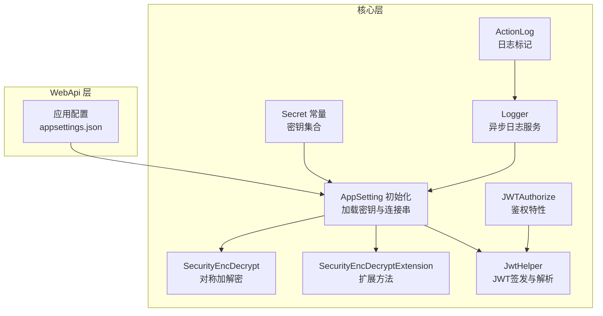
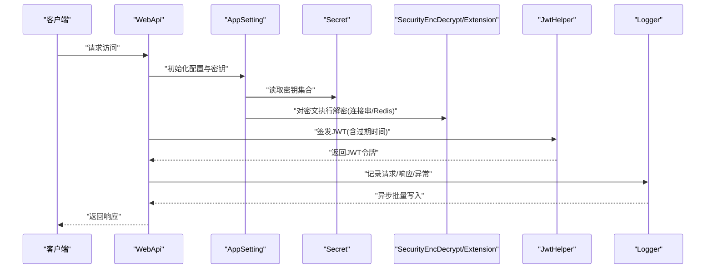
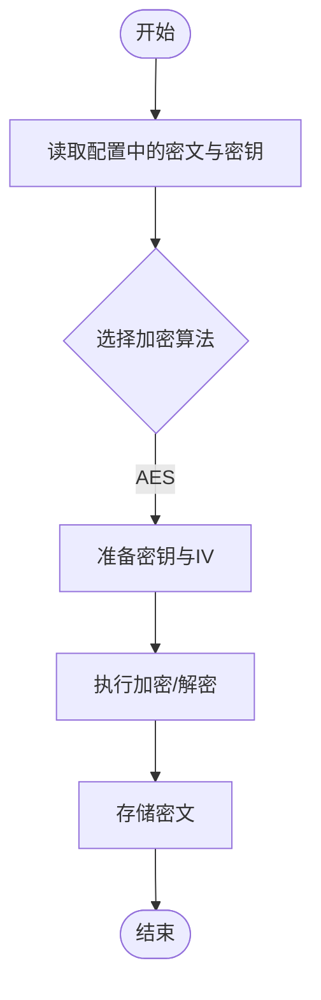
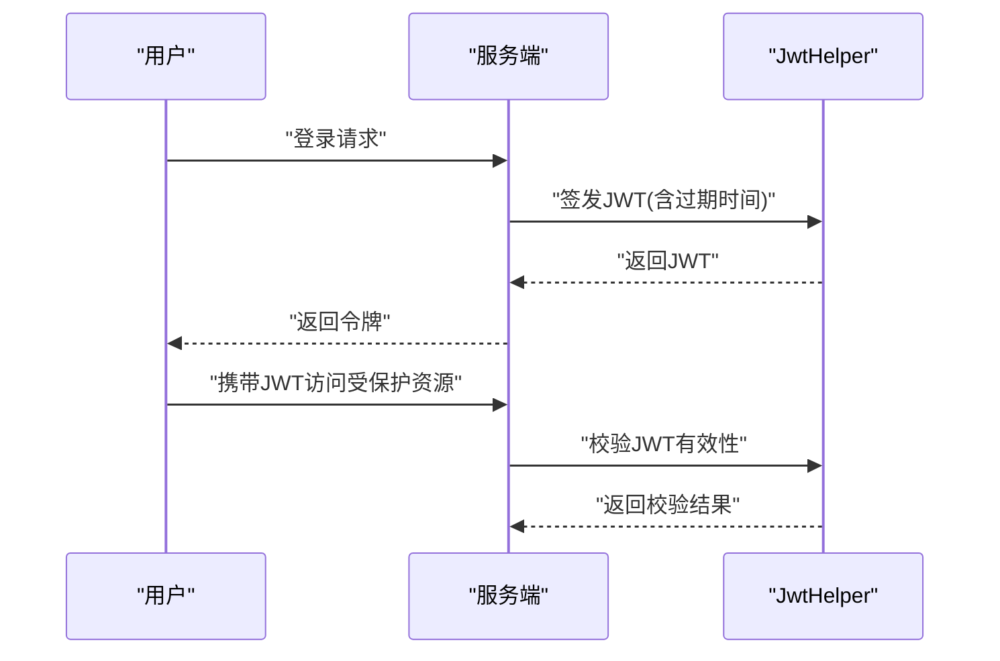
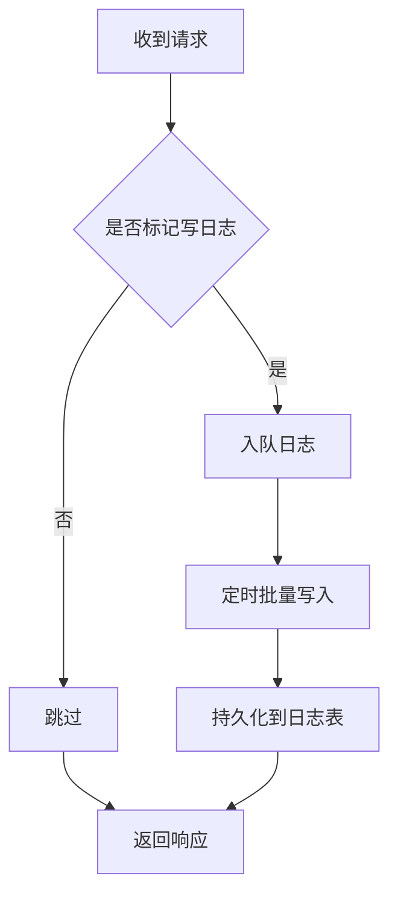
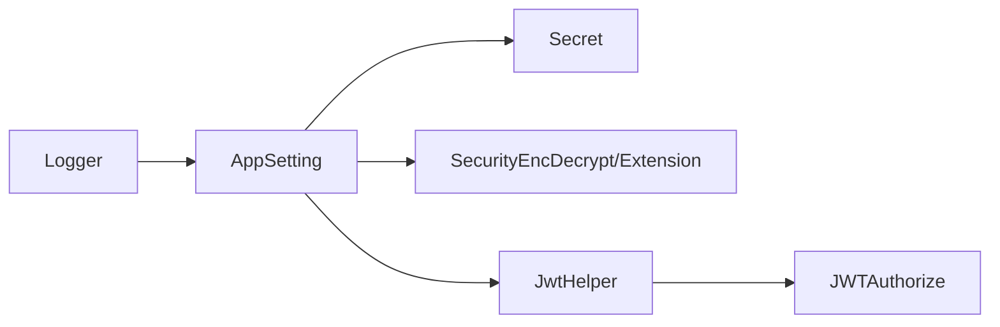

# 数据安全

<cite>
**本文引用的文件**
- [SecurityEncDecrypt.cs](file://VolPro.Core/Utilities/SecurityEncDecrypt.cs)
- [SecurityEncDecryptExtension.cs](file://VolPro.Core/Extensions/SecurityEncDecryptExtension.cs)
- [JwtHelper.cs](file://VolPro.Core/Utilities/JwtHelper.cs)
- [JWTAuthorize.cs](file://VolPro.Core/Filters/JWTAuthorize.cs)
- [ActionLog.cs](file://VolPro.Core/Middleware/ActionLog.cs)
- [Logger.cs](file://VolPro.Core/Services/Logger.cs)
- [Secret.cs](file://VolPro.Core/Const/Secret.cs)
- [AppSetting.cs](file://VolPro.Core/Configuration/AppSetting.cs)
- [appsettings.json](file://VolPro.WebApi/appsettings.json)
- [appsettings.Development.json](file://VolPro.WebApi/appsettings.Development.json)
</cite>

## 目录
1. [引言](#引言)
2. [项目结构](#项目结构)
3. [核心组件](#核心组件)
4. [架构总览](#架构总览)
5. [详细组件分析](#详细组件分析)
6. [依赖关系分析](#依赖关系分析)
7. [性能考虑](#性能考虑)
8. [故障排查指南](#故障排查指南)
9. [结论](#结论)
10. [附录](#附录)

## 引言
本技术文档聚焦于该C#项目的“数据安全保护系统”，围绕以下目标展开：
- 敏感数据的加密存储机制：对称加密与非对称加密的应用场景与实现要点
- 数据传输安全：HTTPS配置、证书管理与中间人攻击防护
- 会话安全管理：会话超时、并发会话控制与会话劫持防护
- 数据访问审计：操作日志记录与异常访问检测
- 安全配置指南：密码策略、密钥轮换与安全参数调优
- 数据泄露防护与应急响应流程

文档以代码为依据，结合架构图与流程图，帮助开发者与运维人员快速理解与落地安全实践。

## 项目结构
该项目采用多层架构，安全相关能力主要分布在以下模块：
- 配置与常量：密钥与全局安全参数
- 工具与扩展：对称加密工具与JWT工具
- 中间件与过滤器：日志标记与鉴权入口
- 日志服务：统一异步日志写入与审计
- 应用配置：运行时密文解密与安全参数加载

图表来源
- [appsettings.json:1-140](file://VolPro.WebApi/appsettings.json#L1-L140)
- [AppSetting.cs:1-237](file://VolPro.Core/Configuration/AppSetting.cs#L1-L237)
- [Secret.cs:1-37](file://VolPro.Core/Const/Secret.cs#L1-L37)
- [SecurityEncDecrypt.cs:1-74](file://VolPro.Core/Utilities/SecurityEncDecrypt.cs#L1-L74)
- [SecurityEncDecryptExtension.cs:1-89](file://VolPro.Core/Extensions/SecurityEncDecryptExtension.cs#L1-L89)
- [JwtHelper.cs:1-99](file://VolPro.Core/Utilities/JwtHelper.cs#L1-L99)
- [JWTAuthorize.cs:1-16](file://VolPro.Core/Filters/JWTAuthorize.cs#L1-L16)
- [ActionLog.cs:1-32](file://VolPro.Core/Middleware/ActionLog.cs#L1-L32)
- [Logger.cs:1-308](file://VolPro.Core/Services/Logger.cs#L1-L308)

章节来源
- [appsettings.json:1-140](file://VolPro.WebApi/appsettings.json#L1-L140)
- [AppSetting.cs:1-237](file://VolPro.Core/Configuration/AppSetting.cs#L1-L237)

## 核心组件
- 对称加密工具
  - 提供基于AES的对称加解密扩展方法，支持Base64编码输出与容错解码字符替换
  - 适用于数据库连接串、Redis连接串等敏感配置项的本地存储与运行时解密
- JWT工具
  - 基于HS256签发与解析，支持自定义过期时间、签发者与受众
  - 提供用户标识提取、过期判断等辅助方法
- 日志与审计
  - 统一日志服务采用异步队列批量写入，记录请求/响应参数、异常、用户信息、IP、URL等
  - 支持通过特性标记决定是否写入日志
- 配置与密钥
  - 运行时从配置文件加载密钥与连接串，自动对密文执行解密
  - 全局安全参数（如JWT过期时间）集中管理

章节来源
- [SecurityEncDecrypt.cs:1-74](file://VolPro.Core/Utilities/SecurityEncDecrypt.cs#L1-L74)
- [SecurityEncDecryptExtension.cs:1-89](file://VolPro.Core/Extensions/SecurityEncDecryptExtension.cs#L1-L89)
- [JwtHelper.cs:1-99](file://VolPro.Core/Utilities/JwtHelper.cs#L1-L99)
- [ActionLog.cs:1-32](file://VolPro.Core/Middleware/ActionLog.cs#L1-L32)
- [Logger.cs:1-308](file://VolPro.Core/Services/Logger.cs#L1-L308)
- [Secret.cs:1-37](file://VolPro.Core/Const/Secret.cs#L1-L37)
- [AppSetting.cs:1-237](file://VolPro.Core/Configuration/AppSetting.cs#L1-L237)

## 架构总览
下图展示“数据安全保护系统”的关键交互：配置加载、密文解密、JWT签发与解析、日志采集与落库。

图表来源
- [AppSetting.cs:85-163](file://VolPro.Core/Configuration/AppSetting.cs#L85-L163)
- [Secret.cs:1-37](file://VolPro.Core/Const/Secret.cs#L1-L37)
- [SecurityEncDecrypt.cs:21-70](file://VolPro.Core/Utilities/SecurityEncDecrypt.cs#L21-L70)
- [SecurityEncDecryptExtension.cs:19-87](file://VolPro.Core/Extensions/SecurityEncDecryptExtension.cs#L19-L87)
- [JwtHelper.cs:21-47](file://VolPro.Core/Utilities/JwtHelper.cs#L21-L47)
- [Logger.cs:97-170](file://VolPro.Core/Services/Logger.cs#L97-L170)

## 详细组件分析

### 对称加密与密钥管理
- 加密算法与模式
  - 使用AES对称加密，密钥长度满足16字节要求；固定初始化向量（IV）简化实现但降低安全性
  - 扩展方法对Base64输出进行字符替换，便于URL/HTTP传输
- 应用场景
  - 数据库连接串与Redis连接串的本地存储与运行时解密
  - 用户密码加密（扩展方法）
- 安全建议
  - 固定IV存在重放风险，建议改为随机IV并随密文一同存储
  - 密钥长度与熵值需符合企业安全基线；避免硬编码密钥
  - 建议引入密钥管理系统（KMS）与定期轮换策略

图表来源
- [SecurityEncDecrypt.cs:21-70](file://VolPro.Core/Utilities/SecurityEncDecrypt.cs#L21-L70)
- [SecurityEncDecryptExtension.cs:19-87](file://VolPro.Core/Extensions/SecurityEncDecryptExtension.cs#L19-L87)
- [AppSetting.cs:148-162](file://VolPro.Core/Configuration/AppSetting.cs#L148-L162)

章节来源
- [SecurityEncDecrypt.cs:1-74](file://VolPro.Core/Utilities/SecurityEncDecrypt.cs#L1-L74)
- [SecurityEncDecryptExtension.cs:1-89](file://VolPro.Core/Extensions/SecurityEncDecryptExtension.cs#L1-L89)
- [AppSetting.cs:148-162](file://VolPro.Core/Configuration/AppSetting.cs#L148-L162)

### 会话与令牌管理（JWT）
- 签发与解析
  - HS256签名算法，签发者与受众可配置，支持自定义过期时间
  - 提供过期判断与用户标识提取
- 会话超时
  - 通过配置项控制默认JWT有效期（分钟），支持按用户类型差异化过期
- 并发会话控制与会话劫持防护
  - 当前实现未见服务端并发会话上限与令牌撤销机制
  - 建议引入“令牌指纹”（设备/浏览器指纹）、黑名单/撤销列表、滑动过期与强制刷新策略

图表来源
- [JwtHelper.cs:21-47](file://VolPro.Core/Utilities/JwtHelper.cs#L21-L47)
- [JwtHelper.cs:54-94](file://VolPro.Core/Utilities/JwtHelper.cs#L54-L94)
- [AppSetting.cs:63-64](file://VolPro.Core/Configuration/AppSetting.cs#L63-L64)

章节来源
- [JwtHelper.cs:1-99](file://VolPro.Core/Utilities/JwtHelper.cs#L1-L99)
- [JWTAuthorize.cs:1-16](file://VolPro.Core/Filters/JWTAuthorize.cs#L1-L16)
- [AppSetting.cs:63-64](file://VolPro.Core/Configuration/AppSetting.cs#L63-L64)

### 数据传输安全与中间人攻击防护
- HTTPS与证书
  - 生产环境应启用HTTPS，确保传输层加密
  - 服务器证书应来自可信CA，禁用自签名或不信任证书
- TLS版本与套件
  - 禁用过时协议（TLS 1.0/1.1），仅允许TLS 1.2及以上
  - 采用现代密码套件，禁用弱加密与已弃用套件
- 中间人攻击防护
  - 启用证书固定（Pinning）与证书透明度（CT）
  - 严格校验证书链与主机名匹配

说明：本仓库未发现显式的HTTPS/TLS配置代码片段，建议在部署层（如反向代理/负载均衡器）与应用层（ASP.NET Core HTTPS重定向与HSTS）共同落实。

### 数据访问审计与异常检测
- 日志记录
  - 统一异步队列写入，批量提交至数据库，记录请求参数、响应参数、异常、用户信息、IP、URL、耗时等
  - 可通过特性标记决定是否写入日志
- 异常访问检测
  - 建议结合日志内容与阈值规则（如失败次数、异常类型分布）建立告警
  - 对高风险操作（如权限变更、敏感数据导出）增加强制审计

图表来源
- [ActionLog.cs:9-31](file://VolPro.Core/Middleware/ActionLog.cs#L9-L31)
- [Logger.cs:97-170](file://VolPro.Core/Services/Logger.cs#L97-L170)
- [Logger.cs:172-207](file://VolPro.Core/Services/Logger.cs#L172-L207)

章节来源
- [ActionLog.cs:1-32](file://VolPro.Core/Middleware/ActionLog.cs#L1-L32)
- [Logger.cs:1-308](file://VolPro.Core/Services/Logger.cs#L1-L308)

### 安全配置指南
- 密钥策略
  - 修改默认密钥（JWT、DB、Redis、User），确保唯一性与强熵
  - 密钥存储与分发遵循最小权限原则，避免明文存储
- 密钥轮换
  - 新旧密钥并行过渡，逐步迁移密文；完成后回收旧密钥
- 安全参数调优
  - JWT过期时间按业务场景调整；启用滑动过期与强制刷新
  - 限制日志敏感字段输出，必要时脱敏
- 部署加固
  - 启用HTTPS、HSTS、安全响应头
  - 限制跨域来源，启用CORS白名单

章节来源
- [appsettings.json:58-65](file://VolPro.WebApi/appsettings.json#L58-L65)
- [AppSetting.cs:85-108](file://VolPro.Core/Configuration/AppSetting.cs#L85-L108)
- [Secret.cs:1-37](file://VolPro.Core/Const/Secret.cs#L1-L37)

### 数据泄露防护与应急响应
- 泄露防护
  - 对敏感字段（如密码、连接串）仅在内存中短暂持有，及时清理
  - 日志脱敏与最小化采集，避免记录完整敏感数据
- 应急响应
  - 发现异常立即冻结受影响账户，撤销相关令牌
  - 检查日志与审计记录，定位事件范围与影响面
  - 升级密钥、回滚可疑变更、修复漏洞并发布补丁

## 依赖关系分析
- 组件耦合
  - AppSetting依赖Secret与配置文件，负责密文解密与全局参数注入
  - 加密工具被AppSetting与业务层间接使用
  - JWT工具被鉴权特性与控制器使用
  - 日志服务贯穿各层，形成横切关注点
- 外部依赖
  - 配置系统（appsettings.json）
  - 安全框架（JWT、对称加密）
  - 数据库（日志表）

图表来源
- [AppSetting.cs:85-163](file://VolPro.Core/Configuration/AppSetting.cs#L85-L163)
- [JwtHelper.cs:21-47](file://VolPro.Core/Utilities/JwtHelper.cs#L21-L47)
- [JWTAuthorize.cs:1-16](file://VolPro.Core/Filters/JWTAuthorize.cs#L1-L16)
- [Logger.cs:97-170](file://VolPro.Core/Services/Logger.cs#L97-L170)

章节来源
- [AppSetting.cs:1-237](file://VolPro.Core/Configuration/AppSetting.cs#L1-L237)
- [JwtHelper.cs:1-99](file://VolPro.Core/Utilities/JwtHelper.cs#L1-L99)
- [Logger.cs:1-308](file://VolPro.Core/Services/Logger.cs#L1-L308)

## 性能考虑
- 日志异步批量写入
  - 通过队列与定时批量提交降低IO压力，适合高并发场景
- 加密性能
  - AES为轻量算法，建议在CPU密集型场景评估硬件加速
- JWT解析
  - 建议缓存公钥（如适用），减少重复计算

## 故障排查指南
- 密文解密失败
  - 检查密钥是否正确、密文格式是否被篡改
  - 查看日志异常信息与解密方法抛出的异常
- JWT无效或过期
  - 校验签发者/受众配置、密钥一致性与过期时间
  - 检查客户端是否正确携带令牌
- 日志未写入
  - 确认日志队列是否堆积、批量写入是否异常
  - 检查日志表结构与数据库连通性

章节来源
- [SecurityEncDecrypt.cs:35-38](file://VolPro.Core/Utilities/SecurityEncDecrypt.cs#L35-L38)
- [Logger.cs:200-206](file://VolPro.Core/Services/Logger.cs#L200-L206)
- [JwtHelper.cs:79-82](file://VolPro.Core/Utilities/JwtHelper.cs#L79-L82)

## 结论
该系统在“数据安全保护系统”方面具备基础能力：对称加密用于密文存储与运行时解密、JWT用于会话令牌管理、统一日志服务支撑审计。为进一步提升安全性，建议：
- 引入非对称加密与KMS，改进密钥管理与轮换
- 强化传输层安全（HTTPS/TLS）与中间人攻击防护
- 实施并发会话控制、令牌撤销与会话劫持防护
- 完善异常访问检测与应急响应流程

## 附录
- 关键配置项参考
  - 密钥集合：JWT、DB、Redis、User
  - JWT有效期：ExpMinutes
  - CORS来源：CorsUrls
  - 连接串：DbConnectionString、RedisConnectionString

章节来源
- [appsettings.json:58-65](file://VolPro.WebApi/appsettings.json#L58-L65)
- [appsettings.json:68](file://VolPro.WebApi/appsettings.json#L68)
- [appsettings.json:67](file://VolPro.WebApi/appsettings.json#L67)
- [appsettings.json:16-57](file://VolPro.WebApi/appsettings.json#L16-L57)