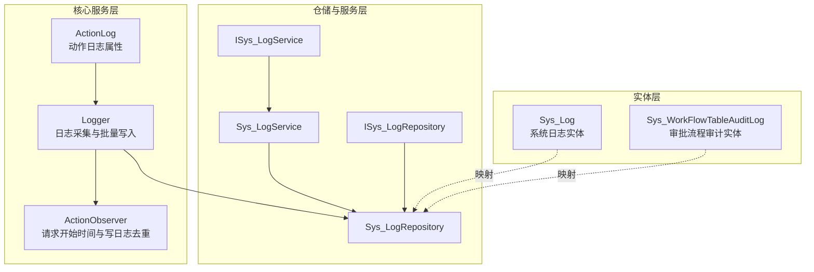
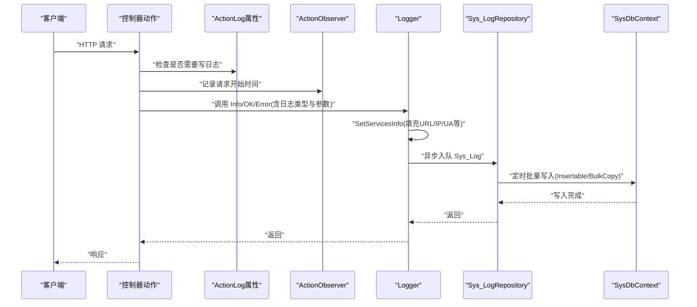
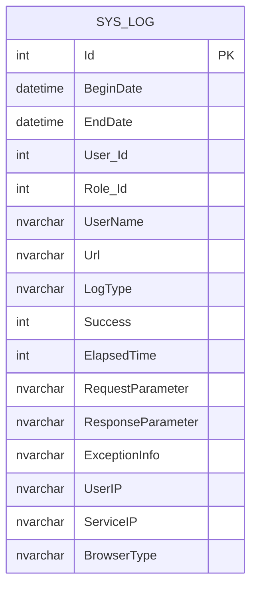
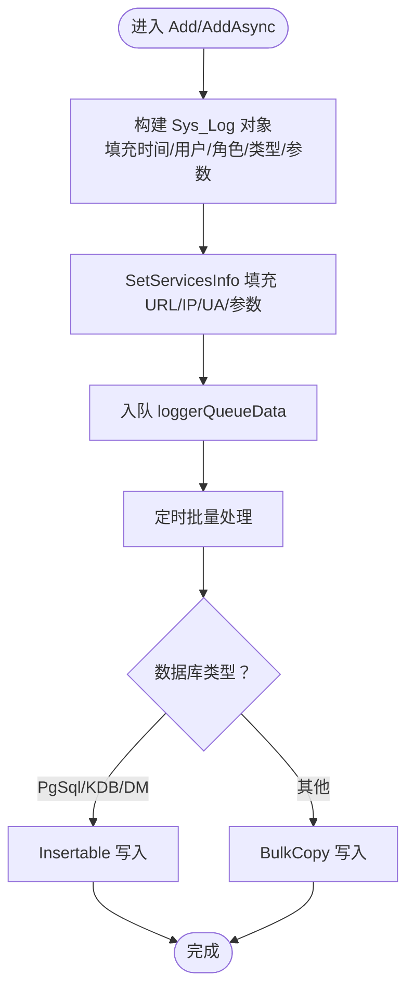
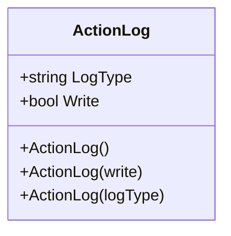
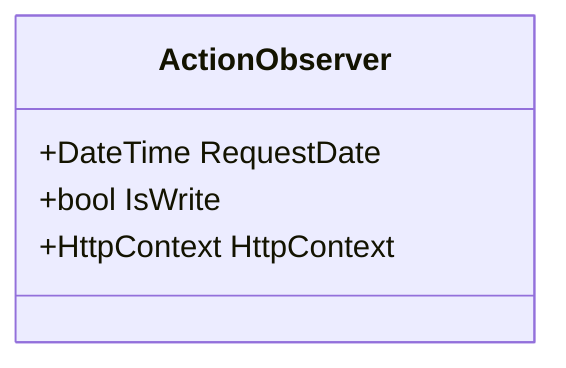
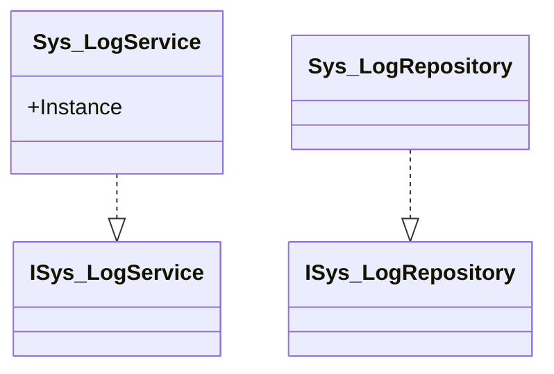
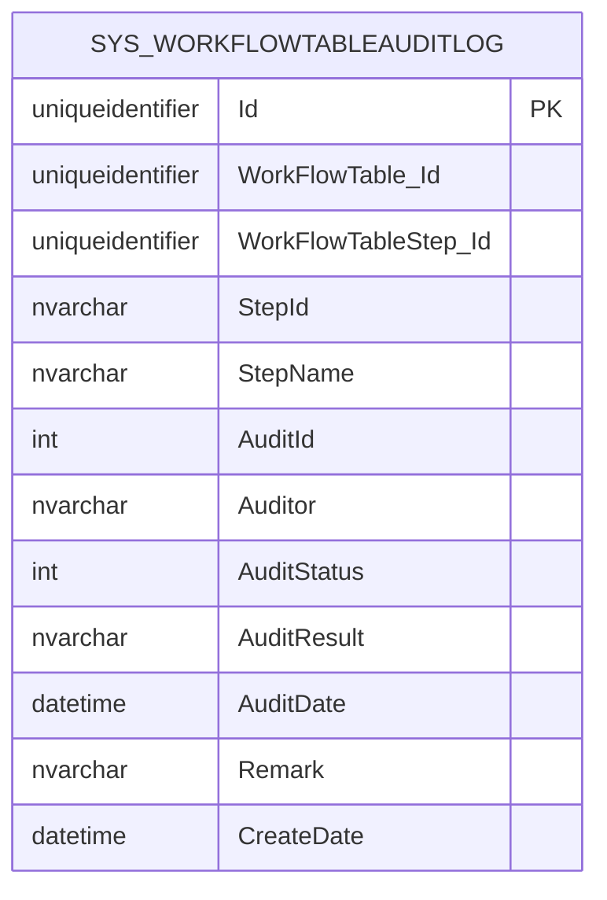
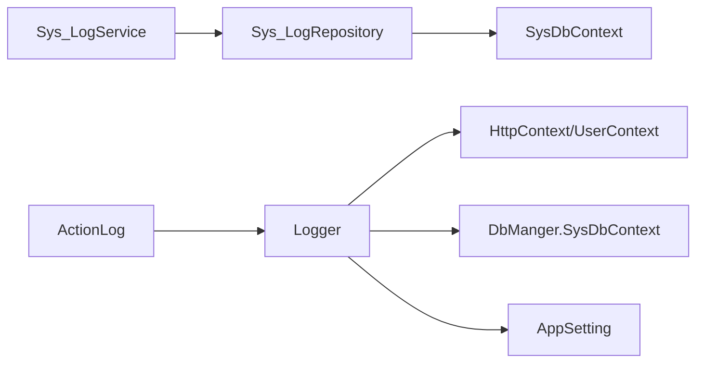

# 访问审计机制

<cite>
**本文引用的文件**
- [Sys_Log.cs](file://VolPro.Entity/DomainModels/System/Sys_Log.cs)
- [ISys_LogService.cs](file://VolPro.Sys/IServices/System/ISys_LogService.cs)
- [Sys_LogService.cs](file://VolPro.Sys/Services/System/Sys_LogService.cs)
- [ISys_LogRepository.cs](file://VolPro.Sys/IRepositories/System/ISys_LogRepository.cs)
- [Sys_LogRepository.cs](file://VolPro.Sys/Repositories/System/Sys_LogRepository.cs)
- [Logger.cs](file://VolPro.Core/Services/Logger.cs)
- [ActionLog.cs](file://VolPro.Core/Middleware/ActionLog.cs)
- [ActionExecutingLogger.cs](file://VolPro.Core/Services/ActionExecutingLogger.cs)
- [Sys_WorkFlowTableAuditLog.cs](file://VolPro.Entity/DomainModels/flow/Sys_WorkFlowTableAuditLog.cs)
</cite>

## 目录
1. [简介](#简介)
2. [项目结构](#项目结构)
3. [核心组件](#核心组件)
4. [架构总览](#架构总览)
5. [详细组件分析](#详细组件分析)
6. [依赖关系分析](#依赖关系分析)
7. [性能考量](#性能考量)
8. [故障排查指南](#故障排查指南)
9. [结论](#结论)
10. [附录](#附录)

## 简介
本文件围绕访问审计机制展开，系统性阐述操作日志记录体系的设计与实现，涵盖日志类型分类、日志格式标准化与日志级别管理；异常访问检测（可疑行为识别、访问频率监控、异常登录检测）的思路与落地路径；审计数据存储策略（日志表设计、索引优化、归档管理）；审计报告生成与分析（访问统计、趋势分析、合规报告）；以及日志安全保护措施（防篡改与防删除）。同时提供审计配置与性能优化的实用指南。

## 项目结构
本项目的审计能力主要分布在以下层次：
- 实体层：Sys_Log 日志实体定义，Sys_WorkFlowTableAuditLog 审批流程审计实体
- 仓储与服务层：ISys_LogRepository/ISys_LogService 及其实现类，负责日志的持久化与查询
- 核心服务层：Logger 提供统一的日志采集、异步批量写入与上下文信息填充
- 中间件与标记：ActionLog 属性用于标注控制器动作是否需要写日志及日志类型
- 执行观察：ActionObserver 记录请求开始时间与去重写日志

**图表来源**
- [Sys_Log.cs:17-140](file://VolPro.Entity/DomainModels/System/Sys_Log.cs#L17-L140)
- [Sys_LogService.cs:9-20](file://VolPro.Sys/Services/System/Sys_LogService.cs#L9-L20)
- [Sys_LogRepository.cs:9-19](file://VolPro.Sys/Repositories/System/Sys_LogRepository.cs#L9-L19)
- [Logger.cs:27-308](file://VolPro.Core/Services/Logger.cs#L27-L308)
- [ActionLog.cs:9-30](file://VolPro.Core/Middleware/ActionLog.cs#L9-L30)
- [ActionExecutingLogger.cs:8-27](file://VolPro.Core/Services/ActionExecutingLogger.cs#L8-L27)

**章节来源**
- [Sys_Log.cs:17-140](file://VolPro.Entity/DomainModels/System/Sys_Log.cs#L17-L140)
- [Sys_LogService.cs:9-20](file://VolPro.Sys/Services/System/Sys_LogService.cs#L9-L20)
- [Sys_LogRepository.cs:9-19](file://VolPro.Sys/Repositories/System/Sys_LogRepository.cs#L9-L19)
- [Logger.cs:27-308](file://VolPro.Core/Services/Logger.cs#L27-L308)
- [ActionLog.cs:9-30](file://VolPro.Core/Middleware/ActionLog.cs#L9-L30)
- [ActionExecutingLogger.cs:8-27](file://VolPro.Core/Services/ActionExecutingLogger.cs#L8-L27)

## 核心组件
- Sys_Log 实体：定义了完整的审计字段集，包括请求/响应参数、异常信息、用户与角色标识、IP、浏览器类型、开始/结束时间、耗时等，支撑全面的审计分析与合规追溯。
- Logger 服务：提供统一的 Info/OK/Error 接口，内部维护并发队列，定时批量写入数据库，支持异步写入与文本落盘兜底。
- ActionLog 属性：用于标注控制器动作是否写日志及日志类型，便于精细化控制审计范围。
- ActionObserver：记录请求开始时间与写日志去重标志，避免重复写日志。
- Sys_LogService/Sys_LogRepository：基于仓储与服务模式，封装日志的增删改查与统计分析接口。

**章节来源**
- [Sys_Log.cs:17-140](file://VolPro.Entity/DomainModels/System/Sys_Log.cs#L17-L140)
- [Logger.cs:27-308](file://VolPro.Core/Services/Logger.cs#L27-L308)
- [ActionLog.cs:9-30](file://VolPro.Core/Middleware/ActionLog.cs#L9-L30)
- [ActionExecutingLogger.cs:8-27](file://VolPro.Core/Services/ActionExecutingLogger.cs#L8-L27)
- [ISys_LogService.cs:6-8](file://VolPro.Sys/IServices/System/ISys_LogService.cs#L6-L8)
- [Sys_LogService.cs:9-20](file://VolPro.Sys/Services/System/Sys_LogService.cs#L9-L20)
- [ISys_LogRepository.cs:11-13](file://VolPro.Sys/IRepositories/System/ISys_LogRepository.cs#L11-L13)
- [Sys_LogRepository.cs:9-19](file://VolPro.Sys/Repositories/System/Sys_LogRepository.cs#L9-L19)

## 架构总览
下图展示了从请求进入应用到日志入库的关键路径，包括上下文信息填充、日志类型与级别、批量写入与异常兜底。

**图表来源**
- [Logger.cs:92-170](file://VolPro.Core/Services/Logger.cs#L92-L170)
- [Logger.cs:172-207](file://VolPro.Core/Services/Logger.cs#L172-L207)
- [Logger.cs:268-298](file://VolPro.Core/Services/Logger.cs#L268-L298)
- [Sys_LogRepository.cs:9-19](file://VolPro.Sys/Repositories/System/Sys_LogRepository.cs#L9-L19)

**章节来源**
- [Logger.cs:92-170](file://VolPro.Core/Services/Logger.cs#L92-L170)
- [Logger.cs:172-207](file://VolPro.Core/Services/Logger.cs#L172-L207)
- [Logger.cs:268-298](file://VolPro.Core/Services/Logger.cs#L268-L298)
- [Sys_LogRepository.cs:9-19](file://VolPro.Sys/Repositories/System/Sys_LogRepository.cs#L9-L19)

## 详细组件分析

### 日志实体与表设计（Sys_Log）
- 字段覆盖：请求/响应参数、异常信息、用户与角色标识、IP、浏览器类型、开始/结束时间、耗时、URL 等，满足多维度审计需求。
- 主键与自增：Id 为主键且自增，便于顺序检索与分页。
- 时间与耗时：BeginDate/EndDate 支持计算耗时；Elapsed-Time 可按需派生。
- 用户与角色：User_Id/Role_Id 支持权限与行为关联分析。
- 兼容性：针对不同数据库类型采用不同的批量插入策略，确保高吞吐写入。

**图表来源**
- [Sys_Log.cs:17-140](file://VolPro.Entity/DomainModels/System/Sys_Log.cs#L17-L140)

**章节来源**
- [Sys_Log.cs:17-140](file://VolPro.Entity/DomainModels/System/Sys_Log.cs#L17-L140)

### 日志采集与批量写入（Logger）
- 异步队列：使用并发队列收集日志，避免阻塞请求线程。
- 批量写入：每秒聚合一定数量后批量写入，减少 IO 次数；对 PostgreSQL/KDB/DM 使用 Insertable，其他数据库使用 BulkCopy。
- 上下文填充：自动填充 URL、用户 IP、服务端 IP、浏览器类型、请求参数等。
- 级别与类型：通过 Info/OK/Error 与 LoggerType 组合表达日志级别与类型。
- 兜底机制：异常时写入本地文本文件，保障日志不丢失。

**图表来源**
- [Logger.cs:92-170](file://VolPro.Core/Services/Logger.cs#L92-L170)
- [Logger.cs:172-207](file://VolPro.Core/Services/Logger.cs#L172-L207)
- [Logger.cs:268-298](file://VolPro.Core/Services/Logger.cs#L268-L298)

**章节来源**
- [Logger.cs:27-308](file://VolPro.Core/Services/Logger.cs#L27-L308)

### 动作级审计标记（ActionLog）
- 作用：在控制器动作上标注是否需要写日志及日志类型，便于按业务模块精细控制审计范围。
- 默认行为：默认开启写日志，可显式关闭或指定类型。

**图表来源**
- [ActionLog.cs:9-30](file://VolPro.Core/Middleware/ActionLog.cs#L9-L30)

**章节来源**
- [ActionLog.cs:9-30](file://VolPro.Core/Middleware/ActionLog.cs#L9-L30)

### 请求观察与去重（ActionObserver）
- 记录请求开始时间，用于计算耗时。
- 标记是否已写日志，防止手动与系统自动重复写日志。

**图表来源**
- [ActionExecutingLogger.cs:8-27](file://VolPro.Core/Services/ActionExecutingLogger.cs#L8-L27)

**章节来源**
- [ActionExecutingLogger.cs:8-27](file://VolPro.Core/Services/ActionExecutingLogger.cs#L8-L27)

### 仓储与服务（ISys_LogRepository/ISys_LogService）
- 服务层：Sys_LogService 基于仓储进行日志的增删改查与统计分析。
- 仓储层：Sys_LogRepository 基于 SysDbContext 进行数据持久化。

**图表来源**
- [ISys_LogService.cs:6-8](file://VolPro.Sys/IServices/System/ISys_LogService.cs#L6-L8)
- [Sys_LogService.cs:9-20](file://VolPro.Sys/Services/System/Sys_LogService.cs#L9-L20)
- [ISys_LogRepository.cs:11-13](file://VolPro.Sys/IRepositories/System/ISys_LogRepository.cs#L11-L13)
- [Sys_LogRepository.cs:9-19](file://VolPro.Sys/Repositories/System/Sys_LogRepository.cs#L9-L19)

**章节来源**
- [ISys_LogService.cs:6-8](file://VolPro.Sys/IServices/System/ISys_LogService.cs#L6-L8)
- [Sys_LogService.cs:9-20](file://VolPro.Sys/Services/System/Sys_LogService.cs#L9-L20)
- [ISys_LogRepository.cs:11-13](file://VolPro.Sys/IRepositories/System/ISys_LogRepository.cs#L11-L13)
- [Sys_LogRepository.cs:9-19](file://VolPro.Sys/Repositories/System/Sys_LogRepository.cs#L9-L19)

### 审批流程审计（Sys_WorkFlowTableAuditLog）
- 用于记录工作流审批过程中的节点、审核人、审核状态、结果与时间等，支撑流程合规审计。

**图表来源**
- [Sys_WorkFlowTableAuditLog.cs:17-125](file://VolPro.Entity/DomainModels/flow/Sys_WorkFlowTableAuditLog.cs#L17-L125)

**章节来源**
- [Sys_WorkFlowTableAuditLog.cs:17-125](file://VolPro.Entity/DomainModels/flow/Sys_WorkFlowTableAuditLog.cs#L17-L125)

## 依赖关系分析
- Logger 依赖 HttpContext、UserContext、DbManger.SysDbContext、AppSetting 等，形成跨模块协作。
- Sys_LogService/Sys_LogRepository 依赖 Autofac 容器注入，遵循依赖倒置原则。
- ActionLog 作为标记，配合中间件或过滤器在控制器层生效。

**图表来源**
- [Logger.cs:131-154](file://VolPro.Core/Services/Logger.cs#L131-L154)
- [Sys_LogService.cs:9-19](file://VolPro.Sys/Services/System/Sys_LogService.cs#L9-L19)
- [Sys_LogRepository.cs:9-19](file://VolPro.Sys/Repositories/System/Sys_LogRepository.cs#L9-L19)
- [ActionLog.cs:9-30](file://VolPro.Core/Middleware/ActionLog.cs#L9-L30)

**章节来源**
- [Logger.cs:131-154](file://VolPro.Core/Services/Logger.cs#L131-L154)
- [Sys_LogService.cs:9-19](file://VolPro.Sys/Services/System/Sys_LogService.cs#L9-L19)
- [Sys_LogRepository.cs:9-19](file://VolPro.Sys/Repositories/System/Sys_LogRepository.cs#L9-L19)
- [ActionLog.cs:9-30](file://VolPro.Core/Middleware/ActionLog.cs#L9-L30)

## 性能考量
- 异步与批量：通过并发队列与定时批量写入降低 IO 压力，建议根据数据库性能调整批量大小与写入间隔。
- 数据库适配：针对不同数据库选择最优批量插入方式，避免不必要的转换开销。
- 参数截断：浏览器类型长度限制与请求参数读取失败的异常兜底，减少异常对主流程影响。
- 索引与分区：建议在 BeginDate、User_Id、LogType、Url 等常用查询字段建立索引；对历史数据进行分区或归档以提升查询性能。

[本节为通用性能建议，无需特定文件引用]

## 故障排查指南
- 日志未入库：检查 Logger 的批量写入循环是否运行、数据库连接与权限、异常兜底文本文件是否生成。
- 参数缺失：确认 HttpContext 是否可用、请求参数读取是否抛出异常、浏览器类型是否被截断。
- 重复写日志：检查 ActionObserver.IsWrite 标志位，确保手动与系统自动写日志不冲突。
- 审计报表异常：核对 Sys_Log 字段映射与查询条件，确保 BeginDate/EndDate/Success 等字段正确参与统计。

**章节来源**
- [Logger.cs:131-170](file://VolPro.Core/Services/Logger.cs#L131-L170)
- [Logger.cs:200-207](file://VolPro.Core/Services/Logger.cs#L200-L207)
- [Logger.cs:209-219](file://VolPro.Core/Services/Logger.cs#L209-L219)
- [ActionExecutingLogger.cs:8-27](file://VolPro.Core/Services/ActionExecutingLogger.cs#L8-L27)

## 结论
该审计机制通过 Sys_Log 实体与 Logger 服务实现了统一、异步、可扩展的日志采集与存储；结合 ActionLog 与 ActionObserver 提供了细粒度的动作级审计控制；Sys_LogService/Sys_LogRepository 则保证了审计数据的持久化与查询能力。配合 Sys_WorkFlowTableAuditLog，可覆盖业务流程的完整审计链路。建议在生产环境中完善索引与归档策略，并持续优化批量写入参数与异常兜底方案。

[本节为总结性内容，无需特定文件引用]

## 附录

### 日志类型与级别管理
- 类型：通过 ActionLog.LogType 与 Logger.Add/Info/OK/Error 的组合表达，支持按业务模块区分日志类型。
- 级别：通过 LoggerStatus（Success/Error/Info）表达日志级别，便于统计与告警。

**章节来源**
- [ActionLog.cs:9-30](file://VolPro.Core/Middleware/ActionLog.cs#L9-L30)
- [Logger.cs:52-88](file://VolPro.Core/Services/Logger.cs#L52-L88)
- [Logger.cs:301-306](file://VolPro.Core/Services/Logger.cs#L301-L306)

### 异常访问检测与频率监控（实现建议）
- 可在 Logger 写入前增加前置校验：如同一用户/IP 在短时间内的请求次数阈值、异常状态码占比、敏感接口高频访问等。
- 建议引入独立的“异常访问检测服务”，基于内存缓存统计访问频次与异常模式，触发告警或临时封禁。

[本小节为概念性建议，无需特定文件引用]

### 审计报告与分析（实现建议）
- 访问统计：按日/周/月统计成功/失败率、平均耗时、Top 路径、Top 用户等。
- 趋势分析：基于 BeginDate 与 Success/LogType 进行时间序列分析。
- 合规报告：导出 Sys_Log 与审批流程审计数据，满足合规要求。

[本小节为概念性建议，无需特定文件引用]

### 日志安全保护（实现建议）
- 防篡改：对 Sys_Log 表启用只读或审计日志备份，关键字段采用不可逆哈希或数字签名。
- 防删除：设置数据库级约束与触发器，禁止直接删除；保留归档副本与审计轨迹。
- 存储加密：对敏感字段（如请求/响应参数）在入库前进行脱敏或加密存储。

[本小节为概念性建议，无需特定文件引用]