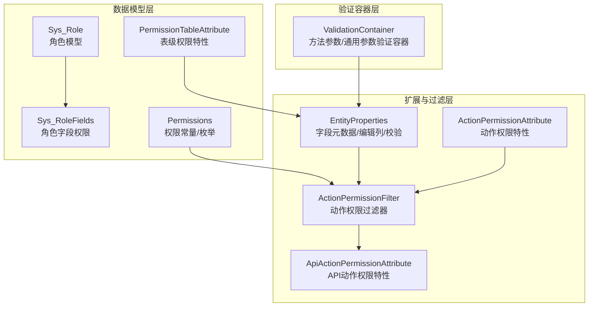
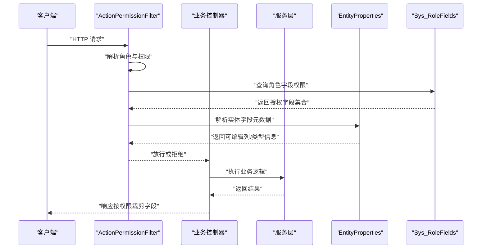
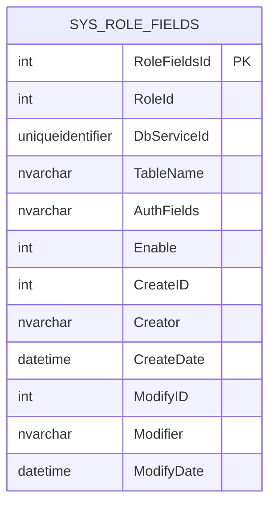
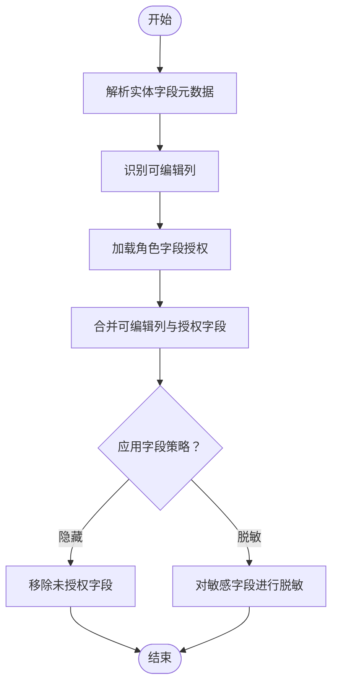
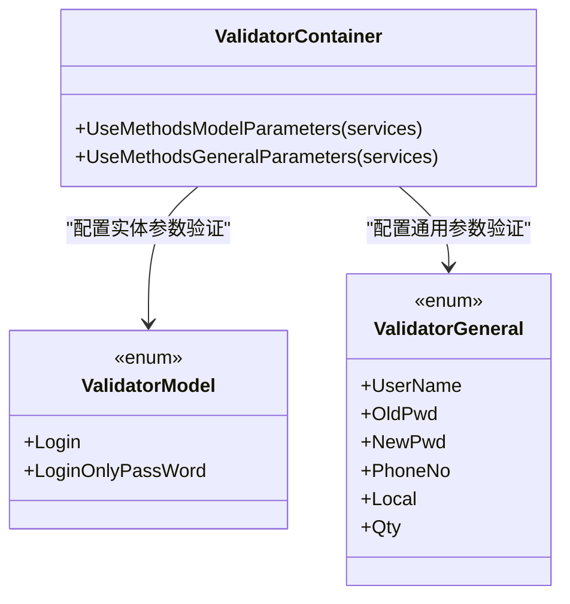
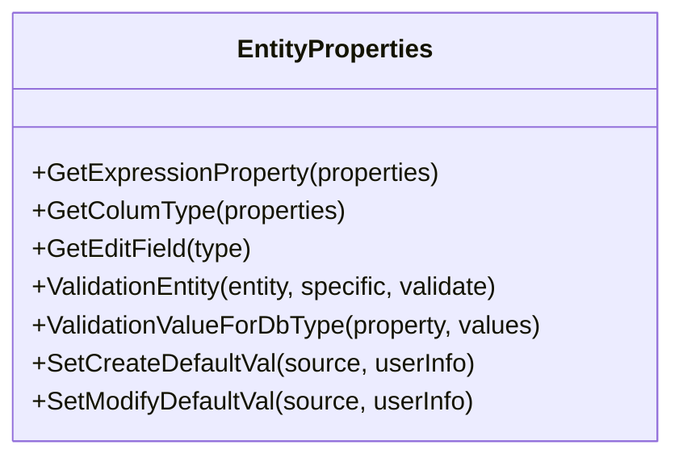
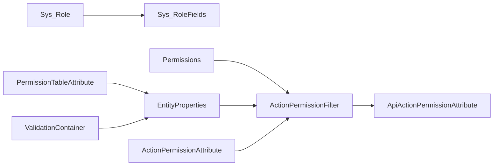

# 字段级权限控制

<cite>
**本文引用的文件**
- [Sys_RoleFields.cs](file://VolPro.Entity/DomainModels/System/Sys_RoleFields.cs)
- [Sys_RoleFields.cs（partial）](file://VolPro.Entity/DomainModels/System/partial/Sys_RoleFields.cs)
- [ValidationContainer.cs](file://VolPro.Core/ObjectActionValidator/ValidationContainer.cs)
- [EntityProperties.cs](file://VolPro.Core/Extensions/EntityProperties.cs)
- [Sys_Role.cs](file://VolPro.Entity/DomainModels/System/Sys_Role.cs)
- [ActionPermissionFilter.cs](file://VolPro.Core/Filters/ActionPermissionFilter.cs)
- [ActionPermissionAttribute.cs](file://VolPro.Core/Filters/ActionPermissionAttribute.cs)
- [ApiActionPermissionAttribute.cs](file://VolPro.Core/Filters/ApiActionPermissionAttribute.cs)
- [Permissions.cs](file://VolPro.Entity/DomainModels/System/Permissions.cs)
- [PermissionTableAttribute.cs](file://VolPro.Entity/AttributeManager/PermissionTableAttribute.cs)
</cite>

## 目录
1. [引言](#引言)
2. [项目结构](#项目结构)
3. [核心组件](#核心组件)
4. [架构总览](#架构总览)
5. [详细组件分析](#详细组件分析)
6. [依赖关系分析](#依赖关系分析)
7. [性能考量](#性能考量)
8. [故障排查指南](#故障排查指南)
9. [结论](#结论)
10. [附录](#附录)

## 引言
本文件系统性梳理字段级权限控制体系，围绕以下目标展开：
- Sys_RoleFields 实体设计与存储机制：角色字段权限的定义、持久化与查询。
- 字段权限验证实现原理：基于实体属性与特性驱动的动态验证、类型校验与长度约束。
- ValidationContainer 权限验证容器：方法级参数验证与通用参数校验的容器化配置。
- EntityProperties 字段属性处理：反射获取字段元数据、编辑列识别与权限映射基础能力。
- 实际应用场景：数据脱敏、字段隐藏、条件访问控制。
- 最佳实践与安全注意事项：配置规范、缓存策略与风险规避。

## 项目结构
字段级权限控制涉及三层：
- 数据模型层：Sys_RoleFields 等系统模型，承载角色字段权限的持久化。
- 扩展与过滤层：EntityProperties 提供字段元数据与校验能力；ActionPermissionFilter/Attribute 提供方法级访问控制。
- 验证容器层：ValidationContainer 提供方法参数与通用参数的统一验证入口。

图表来源
- [Sys_RoleFields.cs:17-126](file://VolPro.Entity/DomainModels/System/Sys_RoleFields.cs#L17-L126)
- [Sys_Role.cs:18-143](file://VolPro.Entity/DomainModels/System/Sys_Role.cs#L18-L143)
- [EntityProperties.cs:25-1483](file://VolPro.Core/Extensions/EntityProperties.cs#L25-L1483)
- [ActionPermissionFilter.cs](file://VolPro.Core/Filters/ActionPermissionFilter.cs)
- [ActionPermissionAttribute.cs](file://VolPro.Core/Filters/ActionPermissionAttribute.cs)
- [ApiActionPermissionAttribute.cs](file://VolPro.Core/Filters/ApiActionPermissionAttribute.cs)
- [Permissions.cs](file://VolPro.Entity/DomainModels/System/Permissions.cs)
- [PermissionTableAttribute.cs](file://VolPro.Entity/AttributeManager/PermissionTableAttribute.cs)
- [ValidationContainer.cs:16-97](file://VolPro.Core/ObjectActionValidator/ValidationContainer.cs#L16-L97)

章节来源
- [Sys_RoleFields.cs:17-126](file://VolPro.Entity/DomainModels/System/Sys_RoleFields.cs#L17-L126)
- [Sys_Role.cs:18-143](file://VolPro.Entity/DomainModels/System/Sys_Role.cs#L18-L143)
- [EntityProperties.cs:25-1483](file://VolPro.Core/Extensions/EntityProperties.cs#L25-L1483)
- [ActionPermissionFilter.cs](file://VolPro.Core/Filters/ActionPermissionFilter.cs)
- [ActionPermissionAttribute.cs](file://VolPro.Core/Filters/ActionPermissionAttribute.cs)
- [ApiActionPermissionAttribute.cs](file://VolPro.Core/Filters/ApiActionPermissionAttribute.cs)
- [Permissions.cs](file://VolPro.Entity/DomainModels/System/Permissions.cs)
- [PermissionTableAttribute.cs](file://VolPro.Entity/AttributeManager/PermissionTableAttribute.cs)
- [ValidationContainer.cs:16-97](file://VolPro.Core/ObjectActionValidator/ValidationContainer.cs#L16-L97)

## 核心组件
- Sys_RoleFields：角色字段权限的核心数据模型，记录角色对特定表的字段授权集合，支持按表名与字段列表进行授权控制。
- EntityProperties：提供字段元数据解析、编辑列识别、类型与长度校验等能力，为字段级权限提供基础支撑。
- ValidationContainer：方法参数与通用参数的验证容器，支持按表达式选择字段、按枚举配置通用参数校验规则。
- ActionPermissionFilter/Attribute：方法级访问控制，结合角色与权限常量实现动作级权限拦截。
- Permissions/PermissionTableAttribute：权限常量与表级权限特性，辅助识别可编辑列与权限映射。

章节来源
- [Sys_RoleFields.cs:17-126](file://VolPro.Entity/DomainModels/System/Sys_RoleFields.cs#L17-L126)
- [EntityProperties.cs:25-1483](file://VolPro.Core/Extensions/EntityProperties.cs#L25-L1483)
- [ValidationContainer.cs:16-97](file://VolPro.Core/ObjectActionValidator/ValidationContainer.cs#L16-L97)
- [ActionPermissionFilter.cs](file://VolPro.Core/Filters/ActionPermissionFilter.cs)
- [ActionPermissionAttribute.cs](file://VolPro.Core/Filters/ActionPermissionAttribute.cs)
- [Permissions.cs](file://VolPro.Entity/DomainModels/System/Permissions.cs)
- [PermissionTableAttribute.cs](file://VolPro.Entity/AttributeManager/PermissionTableAttribute.cs)

## 架构总览
字段级权限控制的总体流程：
- 数据模型层：Sys_RoleFields 存储角色字段授权；Sys_Role 提供角色上下文；Permissions/PermissionTableAttribute 提供权限常量与特性。
- 运行期：EntityProperties 解析实体字段元数据，识别可编辑列；ActionPermissionFilter/Attribute 在请求进入控制器前进行动作级权限校验；ValidationContainer 在方法调用前进行参数级校验。
- 输出阶段：结合角色字段权限与编辑列识别，实现字段隐藏、脱敏与条件访问控制。

图表来源
- [ActionPermissionFilter.cs](file://VolPro.Core/Filters/ActionPermissionFilter.cs)
- [EntityProperties.cs:25-1483](file://VolPro.Core/Extensions/EntityProperties.cs#L25-L1483)
- [Sys_RoleFields.cs:17-126](file://VolPro.Entity/DomainModels/System/Sys_RoleFields.cs#L17-L126)

## 详细组件分析

### Sys_RoleFields 实体设计与存储机制
- 角色字段权限的定义
  - 角色标识：RoleId
  - 目标表：TableName
  - 授权字段集合：AuthFields（以逗号分隔的字段名列表）
  - 可选数据库服务：DbServiceId
  - 启用状态与审计字段：Enable、CreateID、Creator、CreateDate、ModifyID、Modifier、ModifyDate
- 存储机制
  - 基于 SqlSugar 的实体映射，注解 Entity/TableCnName 指定表名与中文名。
  - 字段采用 Column(TypeName=...) 明确数据库类型，便于与数据库保持一致。
- 查询与使用
  - 通过角色与表名定位授权字段集合，用于后续字段级访问控制与输出裁剪。

图表来源
- [Sys_RoleFields.cs:17-126](file://VolPro.Entity/DomainModels/System/Sys_RoleFields.cs#L17-L126)
- [Sys_RoleFields.cs（partial）:17-21](file://VolPro.Entity/DomainModels/System/partial/Sys_RoleFields.cs#L17-L21)

章节来源
- [Sys_RoleFields.cs:17-126](file://VolPro.Entity/DomainModels/System/Sys_RoleFields.cs#L17-L126)
- [Sys_RoleFields.cs（partial）:17-21](file://VolPro.Entity/DomainModels/System/partial/Sys_RoleFields.cs#L17-L21)

### 字段权限验证实现原理
- 动态验证与类型校验
  - EntityProperties 提供字段元数据解析与类型校验，支持整型、长整型、日期、浮点/十进制、GUID、字符串等类型的合法性校验。
  - 通过 ColumnAttribute/DisplayFormatAttribute/MaxLengthAttribute 等特性组合，实现长度与格式约束。
- 编辑列识别与权限映射
  - 通过 EditableAttribute 与 AppSetting 中的用户可编辑列配置，识别实体的可编辑字段集合。
  - 结合 Sys_RoleFields 的授权字段集合，形成“可编辑且已授权”的最终字段集。
- 字段隐藏与脱敏
  - 未授权字段在输出阶段可被移除或置空，实现字段隐藏与脱敏。

图表来源
- [EntityProperties.cs:25-1483](file://VolPro.Core/Extensions/EntityProperties.cs#L25-L1483)
- [Sys_RoleFields.cs:17-126](file://VolPro.Entity/DomainModels/System/Sys_RoleFields.cs#L17-L126)

章节来源
- [EntityProperties.cs:25-1483](file://VolPro.Core/Extensions/EntityProperties.cs#L25-L1483)

### ValidationContainer 权限验证容器
- 方法参数验证
  - ValidatorModel 枚举用于配置实体参数的必填字段集合，例如登录参数仅需用户名、密码、验证码等。
- 通用参数验证
  - ValidatorGeneral 枚举用于配置普通参数的长度、格式与范围校验，如用户名长度、新密码长度范围、手机号格式、存货量范围等。
- 使用方式
  - 在服务注册阶段调用 UseMethodsModelParameters/UseMethodsGeneralParameters 完成容器初始化。
  - 在方法上通过特性标注，自动触发参数验证。

图表来源
- [ValidationContainer.cs:16-97](file://VolPro.Core/ObjectActionValidator/ValidationContainer.cs#L16-L97)

章节来源
- [ValidationContainer.cs:16-97](file://VolPro.Core/ObjectActionValidator/ValidationContainer.cs#L16-L97)

### EntityProperties 的字段属性处理
- 字段元数据获取
  - 通过反射解析实体属性，支持获取属性名、类型、特性值（如 Column/Display/MaxLength/Required/Editable 等）。
- 编辑列识别
  - 结合 EditableAttribute 与 AppSetting 中的用户可编辑列配置，筛选出可编辑字段集合。
- 类型与长度校验
  - 基于 ColumnAttribute.TypeName 与 DisplayFormatAttribute/DataFormatString/MaxLengthAttribute 进行类型与长度校验。
- 实体映射与默认值设置
  - 支持实体间字段映射与默认字段（创建/修改相关）的自动填充。

图表来源
- [EntityProperties.cs:25-1483](file://VolPro.Core/Extensions/EntityProperties.cs#L25-L1483)

章节来源
- [EntityProperties.cs:25-1483](file://VolPro.Core/Extensions/EntityProperties.cs#L25-L1483)

### 实际应用场景
- 数据脱敏
  - 对未授权的敏感字段（如身份证号、银行账户）在输出前进行脱敏处理。
- 字段隐藏
  - 未授权字段从响应中移除，避免泄露。
- 条件访问控制
  - 结合角色与表级权限特性，仅允许访问授权字段；对编辑列进行二次校验，防止越权修改。

章节来源
- [EntityProperties.cs:25-1483](file://VolPro.Core/Extensions/EntityProperties.cs#L25-L1483)
- [Sys_RoleFields.cs:17-126](file://VolPro.Entity/DomainModels/System/Sys_RoleFields.cs#L17-L126)
- [PermissionTableAttribute.cs](file://VolPro.Entity/AttributeManager/PermissionTableAttribute.cs)

### 最佳实践与安全考虑
- 配置规范
  - 明确角色字段授权的最小权限原则，避免授予无关字段。
  - 在实体上统一使用 EditableAttribute 标识可编辑字段，确保与授权策略一致。
- 缓存策略
  - 角色字段授权建议缓存，减少数据库查询开销；变更时及时失效。
- 安全风险
  - 防止通过参数篡改绕过字段级校验；对输入进行严格类型与长度校验。
  - 对敏感字段进行强制脱敏与日志审计。

## 依赖关系分析
- Sys_RoleFields 依赖 Entity 层的 SysEntity 与 SqlSugar 注解。
- EntityProperties 依赖反射与特性解析，同时依赖 AppSetting 与用户上下文。
- ActionPermissionFilter/Attribute 依赖权限常量与角色上下文，结合 Sys_RoleFields 授权集合进行拦截。
- ValidationContainer 依赖服务注册与特性标注，在运行期注入验证逻辑。

图表来源
- [Sys_Role.cs:18-143](file://VolPro.Entity/DomainModels/System/Sys_Role.cs#L18-L143)
- [Sys_RoleFields.cs:17-126](file://VolPro.Entity/DomainModels/System/Sys_RoleFields.cs#L17-L126)
- [Permissions.cs](file://VolPro.Entity/DomainModels/System/Permissions.cs)
- [PermissionTableAttribute.cs](file://VolPro.Entity/AttributeManager/PermissionTableAttribute.cs)
- [EntityProperties.cs:25-1483](file://VolPro.Core/Extensions/EntityProperties.cs#L25-L1483)
- [ActionPermissionFilter.cs](file://VolPro.Core/Filters/ActionPermissionFilter.cs)
- [ActionPermissionAttribute.cs](file://VolPro.Core/Filters/ActionPermissionAttribute.cs)
- [ApiActionPermissionAttribute.cs](file://VolPro.Core/Filters/ApiActionPermissionAttribute.cs)
- [ValidationContainer.cs:16-97](file://VolPro.Core/ObjectActionValidator/ValidationContainer.cs#L16-L97)

章节来源
- [Sys_Role.cs:18-143](file://VolPro.Entity/DomainModels/System/Sys_Role.cs#L18-L143)
- [Sys_RoleFields.cs:17-126](file://VolPro.Entity/DomainModels/System/Sys_RoleFields.cs#L17-L126)
- [Permissions.cs](file://VolPro.Entity/DomainModels/System/Permissions.cs)
- [PermissionTableAttribute.cs](file://VolPro.Entity/AttributeManager/PermissionTableAttribute.cs)
- [EntityProperties.cs:25-1483](file://VolPro.Core/Extensions/EntityProperties.cs#L25-L1483)
- [ActionPermissionFilter.cs](file://VolPro.Core/Filters/ActionPermissionFilter.cs)
- [ActionPermissionAttribute.cs](file://VolPro.Core/Filters/ActionPermissionAttribute.cs)
- [ApiActionPermissionAttribute.cs](file://VolPro.Core/Filters/ApiActionPermissionAttribute.cs)
- [ValidationContainer.cs:16-97](file://VolPro.Core/ObjectActionValidator/ValidationContainer.cs#L16-L97)

## 性能考量
- 反射与特性解析成本：EntityProperties 的反射解析应尽量缓存常用元数据，避免重复扫描。
- 数据库查询：Sys_RoleFields 授权查询建议缓存，变更时失效；批量授权场景可考虑分页或索引优化。
- 参数验证：ValidationContainer 的通用参数校验应避免过度复杂的表达式，优先使用简单规则。

## 故障排查指南
- 字段未生效
  - 检查 EditableAttribute 是否正确标注；确认 AppSetting 中的用户可编辑列配置。
- 授权不生效
  - 核对 Sys_RoleFields 的角色、表名与字段集合是否匹配；检查缓存是否过期。
- 参数校验异常
  - 检查 ValidationContainer 的配置是否与方法参数名一致；确认通用参数校验规则是否合理。

章节来源
- [EntityProperties.cs:25-1483](file://VolPro.Core/Extensions/EntityProperties.cs#L25-L1483)
- [ValidationContainer.cs:16-97](file://VolPro.Core/ObjectActionValidator/ValidationContainer.cs#L16-L97)
- [Sys_RoleFields.cs:17-126](file://VolPro.Entity/DomainModels/System/Sys_RoleFields.cs#L17-L126)

## 结论
字段级权限控制通过“角色字段授权 + 实体元数据 + 参数验证 + 动作拦截”的协同，实现了细粒度的访问控制与数据保护。Sys_RoleFields 提供了明确的授权载体，EntityProperties 与 ValidationContainer 提供了强大的运行期支撑，配合 ActionPermissionFilter/Attribute 实现端到端的安全控制闭环。

## 附录
- 关键流程图与类图已在前述章节中给出，读者可据此快速定位实现位置与调用关系。
- 建议在生产环境中结合缓存与审计，持续优化字段级权限控制的性能与安全性。