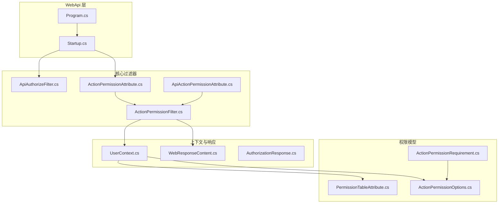
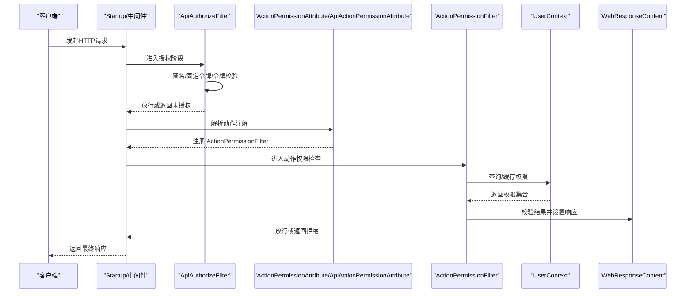
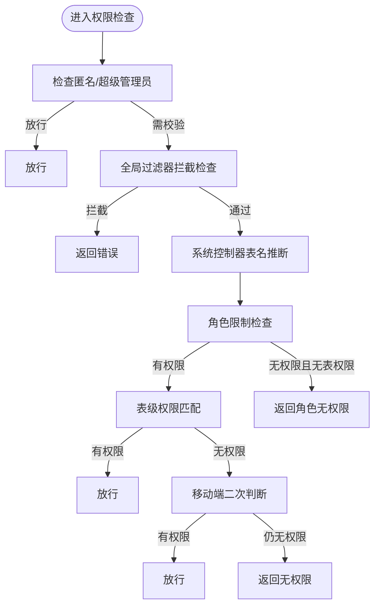
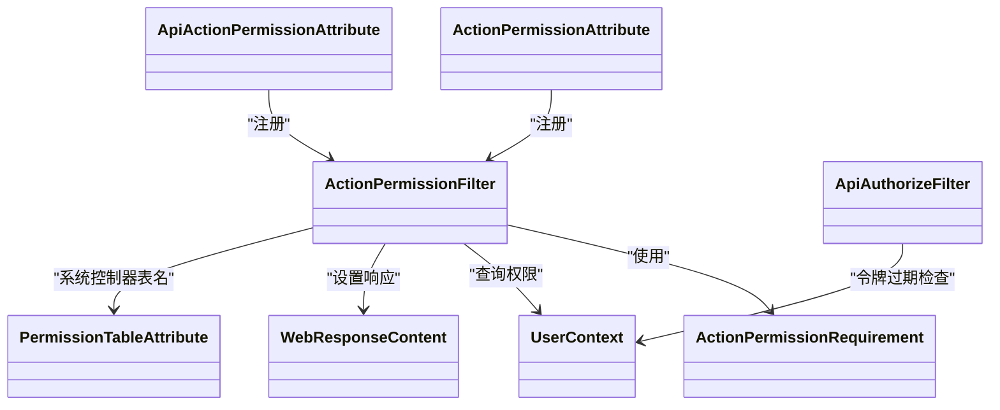

# 操作权限控制

<cite>
**本文引用的文件**
- [ActionPermissionAttribute.cs](file://VolPro.Core/Filters/ActionPermissionAttribute.cs)
- [ApiAuthorizeFilter.cs](file://VolPro.Core/Filters/ApiAuthorizeFilter.cs)
- [ActionPermissionFilter.cs](file://VolPro.Core/Filters/ActionPermissionFilter.cs)
- [ActionPermissionRequirement.cs](file://VolPro.Core/Filters/ActionPermissionRequirement.cs)
- [ApiActionPermissionAttribute.cs](file://VolPro.Core/Filters/ApiActionPermissionAttribute.cs)
- [ActionPermissionOptions.cs](file://VolPro.Core/Enums/ActionPermissionOptions.cs)
- [AuthorizationResponse.cs](file://VolPro.Core/Extensions/AuthorizationResponse.cs)
- [UserContext.cs](file://VolPro.Core/UserManager/UserContext.cs)
- [WebResponseContent.cs](file://VolPro.Core/Utilities/Response/WebResponseContent.cs)
- [PermissionTableAttribute.cs](file://VolPro.Entity/AttributeManager/PermissionTableAttribute.cs)
- [Startup.cs](file://VolPro.WebApi/Startup.cs)
- [Program.cs](file://VolPro.WebApi/Program.cs)
</cite>

## 目录
1. [简介](#简介)
2. [项目结构](#项目结构)
3. [核心组件](#核心组件)
4. [架构总览](#架构总览)
5. [组件详解](#组件详解)
6. [依赖关系分析](#依赖关系分析)
7. [性能考量](#性能考量)
8. [故障排查指南](#故障排查指南)
9. [结论](#结论)
10. [附录](#附录)

## 简介
本技术文档围绕操作权限控制系统展开，重点阐述以下内容：
- ActionPermissionAttribute 的实现原理：控制器方法级权限注解与验证机制
- ApiAuthorizeFilter 的工作流程：API 请求的权限拦截与验证逻辑
- ActionPermissionFilter 的过滤器链处理：权限检查执行顺序与异常处理
- ActionPermissionRequirement 的权限要求定义：权限标识符与权限表达式解析
- 实际应用示例：不同权限级别的 API 访问控制与动态权限验证
- 权限过滤器的配置方法与性能优化建议

## 项目结构
权限控制相关代码主要分布在以下模块：
- 过滤器层：ActionPermissionAttribute、ApiAuthorizeFilter、ActionPermissionFilter、ApiActionPermissionAttribute
- 权限模型：ActionPermissionRequirement、ActionPermissionOptions
- 上下文与响应：UserContext、WebResponseContent
- 扩展与元数据：AuthorizationResponse、PermissionTableAttribute
- 应用启动：Startup.cs、Program.cs

图表来源
- [Startup.cs](file://VolPro.WebApi/Startup.cs)
- [Program.cs](file://VolPro.WebApi/Program.cs)
- [ActionPermissionAttribute.cs](file://VolPro.Core/Filters/ActionPermissionAttribute.cs)
- [ActionPermissionFilter.cs](file://VolPro.Core/Filters/ActionPermissionFilter.cs)
- [ApiAuthorizeFilter.cs](file://VolPro.Core/Filters/ApiAuthorizeFilter.cs)
- [ApiActionPermissionAttribute.cs](file://VolPro.Core/Filters/ApiActionPermissionAttribute.cs)
- [ActionPermissionRequirement.cs](file://VolPro.Core/Filters/ActionPermissionRequirement.cs)
- [ActionPermissionOptions.cs](file://VolPro.Core/Enums/ActionPermissionOptions.cs)
- [PermissionTableAttribute.cs](file://VolPro.Entity/AttributeManager/PermissionTableAttribute.cs)
- [UserContext.cs](file://VolPro.Core/UserManager/UserContext.cs)
- [WebResponseContent.cs](file://VolPro.Core/Utilities/Response/WebResponseContent.cs)
- [AuthorizationResponse.cs](file://VolPro.Core/Extensions/AuthorizationResponse.cs)

章节来源
- [Startup.cs](file://VolPro.WebApi/Startup.cs)
- [Program.cs](file://VolPro.WebApi/Program.cs)

## 核心组件
- ActionPermissionAttribute：基于类型过滤器的控制器方法级权限注解，支持角色限制、表级权限与系统控制器模式
- ApiAuthorizeFilter：全局授权过滤器，负责令牌校验与过期提醒，支持匿名访问与固定令牌场景
- ActionPermissionFilter：异步动作过滤器，执行具体权限判定、角色限制与表级权限匹配
- ActionPermissionRequirement：权限要求载体，封装表名、操作集合、角色ID、系统控制器标记与API标记
- ApiActionPermissionAttribute：面向 API 的权限注解，继承自 ActionPermissionAttribute 并默认标记 IsApi
- UserContext：用户上下文，提供权限缓存、版本控制、角色与菜单权限聚合、移动端/PC端权限区分
- WebResponseContent：统一响应包装，便于在过滤器中设置错误/成功状态
- PermissionTableAttribute：控制器到业务表的映射元数据，用于系统控制器模式下的表名推断

章节来源
- [ActionPermissionAttribute.cs](file://VolPro.Core/Filters/ActionPermissionAttribute.cs)
- [ApiAuthorizeFilter.cs](file://VolPro.Core/Filters/ApiAuthorizeFilter.cs)
- [ActionPermissionFilter.cs](file://VolPro.Core/Filters/ActionPermissionFilter.cs)
- [ActionPermissionRequirement.cs](file://VolPro.Core/Filters/ActionPermissionRequirement.cs)
- [ApiActionPermissionAttribute.cs](file://VolPro.Core/Filters/ApiActionPermissionAttribute.cs)
- [UserContext.cs](file://VolPro.Core/UserManager/UserContext.cs)
- [WebResponseContent.cs](file://VolPro.Core/Utilities/Response/WebResponseContent.cs)
- [PermissionTableAttribute.cs](file://VolPro.Entity/AttributeManager/PermissionTableAttribute.cs)

## 架构总览
权限控制采用“注解 + 全局过滤器 + 动作过滤器”的分层设计：
- 注解层：通过 ActionPermissionAttribute/ApiActionPermissionAttribute 在控制器或动作上声明权限要求
- 全局层：ApiAuthorizeFilter 在进入动作前进行令牌有效性与过期提醒检查
- 动作层：ActionPermissionFilter 在动作执行前进行角色与表级权限校验
- 上下文层：UserContext 提供权限缓存、版本控制与权限聚合，确保高性能与一致性

图表来源
- [ApiAuthorizeFilter.cs](file://VolPro.Core/Filters/ApiAuthorizeFilter.cs)
- [ActionPermissionAttribute.cs](file://VolPro.Core/Filters/ActionPermissionAttribute.cs)
- [ActionPermissionFilter.cs](file://VolPro.Core/Filters/ActionPermissionFilter.cs)
- [UserContext.cs](file://VolPro.Core/UserManager/UserContext.cs)
- [WebResponseContent.cs](file://VolPro.Core/Utilities/Response/WebResponseContent.cs)

## 组件详解

### ActionPermissionAttribute：控制器方法级权限注解
- 设计要点
  - 基于 TypeFilterAttribute 将自身注册为 ActionPermissionFilter，并通过 Arguments 传递 ActionPermissionRequirement
  - 支持多种构造重载：按角色ID、按角色位标志、按表+操作+可选角色、按系统控制器模式等
  - 内部通过枚举组合生成 TableAction 字符串数组，配合 IsApi 标记区分 API 场景
- 关键行为
  - 角色限制：RoleIds 包含当前用户角色即放行
  - 表级权限：通过 UserContext.GetPermissions 查询用户权限并匹配 TableAction
  - 系统控制器：从控制器的 PermissionTableAttribute 或控制器名推断表名
- 使用建议
  - 优先使用 ApiActionPermissionAttribute 标注 API 动作，自动启用 IsApi
  - 表级权限与角色限制可并存，满足“角色限制优先”的策略

章节来源
- [ActionPermissionAttribute.cs](file://VolPro.Core/Filters/ActionPermissionAttribute.cs)
- [ApiActionPermissionAttribute.cs](file://VolPro.Core/Filters/ApiActionPermissionAttribute.cs)
- [ActionPermissionOptions.cs](file://VolPro.Core/Enums/ActionPermissionOptions.cs)

### ApiAuthorizeFilter：API 请求的权限拦截与验证
- 设计要点
  - 仅进行令牌合法性检查，不参与业务权限判定
  - 支持匿名访问（IAllowAnonymous）与固定令牌（IFixedTokenFilter）场景
  - 对即将过期的令牌通过响应头提示前端刷新
- 工作流程
  - 若存在匿名标记：优先执行任务过滤器或固定令牌过滤器；若携带令牌但未认证，尝试注入身份以便后续流程获取用户信息
  - 令牌过期阈值判断：当剩余有效期小于阈值且非刷新接口时，设置响应头提示刷新
- 异常处理
  - 该过滤器不直接抛出异常，而是通过后续过滤器或动作返回统一响应

章节来源
- [ApiAuthorizeFilter.cs](file://VolPro.Core/Filters/ApiAuthorizeFilter.cs)
- [AuthorizationResponse.cs](file://VolPro.Core/Extensions/AuthorizationResponse.cs)

### ActionPermissionFilter：动作过滤器链处理
- 设计要点
  - 实现 IAsyncActionFilter，在动作执行前后插入权限检查
  - 支持匿名放行、超级管理员放行、全局过滤器拦截
  - 支持系统控制器模式下从控制器元数据推断表名
- 执行顺序
  1) 匿名/超级管理员放行
  2) 全局过滤器拦截（演示环境）
  3) 系统控制器表名推断
  4) 角色限制优先
  5) 表级权限匹配（含移动端二次判断）
  6) 设置响应并放行或拒绝
- 异常处理
  - 通过 WebResponseContent.Error 设置错误状态与消息
  - 日志记录无权限操作信息

图表来源
- [ActionPermissionFilter.cs](file://VolPro.Core/Filters/ActionPermissionFilter.cs)
- [UserContext.cs](file://VolPro.Core/UserManager/UserContext.cs)
- [WebResponseContent.cs](file://VolPro.Core/Utilities/Response/WebResponseContent.cs)

章节来源
- [ActionPermissionFilter.cs](file://VolPro.Core/Filters/ActionPermissionFilter.cs)
- [UserContext.cs](file://VolPro.Core/UserManager/UserContext.cs)
- [WebResponseContent.cs](file://VolPro.Core/Utilities/Response/WebResponseContent.cs)

### ActionPermissionRequirement：权限要求定义
- 字段说明
  - TableName：受控业务表名
  - TableAction：操作集合（如新增、删除、更新、查询、导出、审核、上传、导入）
  - SysController：是否为系统控制器模式
  - RoleIds：允许访问的角色ID集合
  - IsApi：是否为 API 场景
- 权限表达式解析
  - TableAction 由 ActionPermissionOptions 枚举组合生成字符串数组
  - 通过 UserContext.GetPermissions 查询用户权限并匹配

章节来源
- [ActionPermissionRequirement.cs](file://VolPro.Core/Filters/ActionPermissionRequirement.cs)
- [ActionPermissionOptions.cs](file://VolPro.Core/Enums/ActionPermissionOptions.cs)

### UserContext：权限上下文与缓存
- 职责
  - 提供用户信息、角色ID、部门ID、岗位ID等上下文信息
  - 缓存角色权限与用户授权数据，带版本号与并发锁，避免缓存击穿
  - 支持超级管理员放行、移动端/PC端权限区分、菜单数据权限
- 性能特性
  - 角色权限与用户授权数据均采用内存+分布式缓存两级缓存
  - 版本号对比决定是否刷新缓存
  - 并发安全：按角色/用户粒度加锁，降低锁竞争

章节来源
- [UserContext.cs](file://VolPro.Core/UserManager/UserContext.cs)

### WebResponseContent：统一响应包装
- 职责
  - 提供 OK/Error/Set 等方法，统一响应结构（状态、消息、数据、编码）
  - 与过滤器链配合，快速设置拒绝响应
- 使用
  - 在 ActionPermissionFilter 中根据校验结果设置响应

章节来源
- [WebResponseContent.cs](file://VolPro.Core/Utilities/Response/WebResponseContent.cs)

### PermissionTableAttribute：系统控制器表名映射
- 职责
  - 为系统控制器提供显式表名映射，若未标注则回退到控制器名
- 与系统控制器模式配合
  - ActionPermissionFilter 在 SysController=true 时读取该属性或控制器名

章节来源
- [PermissionTableAttribute.cs](file://VolPro.Entity/AttributeManager/PermissionTableAttribute.cs)

## 依赖关系分析
- 组件耦合
  - ActionPermissionAttribute/ApiActionPermissionAttribute 依赖 ActionPermissionFilter 与 ActionPermissionRequirement
  - ActionPermissionFilter 依赖 UserContext、WebResponseContent、PermissionTableAttribute
  - ApiAuthorizeFilter 依赖 AuthorizationResponse、AppSetting、UserContext
- 外部依赖
  - JWT 令牌解析与过期时间计算
  - 缓存服务（内存/Redis）与数据库（SqlSugar）用于权限数据加载与缓存版本管理
- 循环依赖
  - 未发现循环依赖，职责边界清晰

图表来源
- [ActionPermissionAttribute.cs](file://VolPro.Core/Filters/ActionPermissionAttribute.cs)
- [ApiActionPermissionAttribute.cs](file://VolPro.Core/Filters/ApiActionPermissionAttribute.cs)
- [ActionPermissionFilter.cs](file://VolPro.Core/Filters/ActionPermissionFilter.cs)
- [ActionPermissionRequirement.cs](file://VolPro.Core/Filters/ActionPermissionRequirement.cs)
- [ApiAuthorizeFilter.cs](file://VolPro.Core/Filters/ApiAuthorizeFilter.cs)
- [UserContext.cs](file://VolPro.Core/UserManager/UserContext.cs)
- [WebResponseContent.cs](file://VolPro.Core/Utilities/Response/WebResponseContent.cs)
- [PermissionTableAttribute.cs](file://VolPro.Entity/AttributeManager/PermissionTableAttribute.cs)

## 性能考量
- 缓存策略
  - 角色权限与用户授权数据均带版本号，避免频繁刷新
  - 并发安全：按角色/用户粒度加锁，减少锁竞争
- 数据库访问
  - 通过 Join 查询聚合菜单与角色授权，减少多次查询
  - 表名统一转小写，避免运行时转换开销
- 过滤器链优化
  - 早期放行：匿名/超级管理员/全局拦截直接返回
  - 快速失败：角色限制优先，无权限立即返回
- 建议
  - 合理设置缓存版本更新频率
  - 对热点角色/用户适当预热缓存
  - 避免在权限判定中进行复杂计算，尽量使用索引与聚合数据

[本节为通用性能指导，无需列出章节来源]

## 故障排查指南
- 常见问题
  - 无权限错误：检查 ActionPermissionRequirement 的 TableName 与 TableAction 是否与 Sys_Menu/Sys_RoleAuth 配置一致
  - 角色限制无效：确认用户角色ID是否包含在 RoleIds 中
  - 系统控制器表名推断失败：为控制器添加 PermissionTableAttribute 或确保控制器名与表名一致
  - 令牌过期：关注响应头 vol_exp 提示，调用刷新接口
- 排查步骤
  - 查看 ActionPermissionFilter 的日志输出，定位具体权限缺失点
  - 核对 UserContext 的权限缓存版本与实际数据库数据是否一致
  - 确认 ApiAuthorizeFilter 是否正确识别匿名/固定令牌场景
- 相关实现参考
  - 权限日志记录位置
  - 统一响应设置位置
  - 令牌过期提示设置位置

章节来源
- [ActionPermissionFilter.cs](file://VolPro.Core/Filters/ActionPermissionFilter.cs)
- [UserContext.cs](file://VolPro.Core/UserManager/UserContext.cs)
- [ApiAuthorizeFilter.cs](file://VolPro.Core/Filters/ApiAuthorizeFilter.cs)
- [WebResponseContent.cs](file://VolPro.Core/Utilities/Response/WebResponseContent.cs)

## 结论
该权限控制系统通过注解驱动与过滤器链协同，实现了灵活而高效的控制器方法级权限控制。其核心优势在于：
- 明确的职责分离：注解负责声明、过滤器负责执行、上下文负责数据
- 高性能缓存：版本化缓存与并发锁保障高并发下的稳定性
- 可扩展性：支持角色限制、表级权限、系统控制器模式与移动端/PC端差异化

[本节为总结性内容，无需列出章节来源]

## 附录

### 配置方法与最佳实践
- 在 Startup.cs 中注册全局授权过滤器与中间件，确保 ApiAuthorizeFilter 位于动作过滤器之前
- 在控制器或动作上使用 ActionPermissionAttribute/ApiActionPermissionAttribute 声明权限要求
- 对系统控制器使用 PermissionTableAttribute 指定表名，或保持控制器名与表名一致
- 合理划分 ActionPermissionOptions，避免权限组合过于复杂导致维护困难

章节来源
- [Startup.cs](file://VolPro.WebApi/Startup.cs)
- [Program.cs](file://VolPro.WebApi/Program.cs)
- [ActionPermissionAttribute.cs](file://VolPro.Core/Filters/ActionPermissionAttribute.cs)
- [ApiActionPermissionAttribute.cs](file://VolPro.Core/Filters/ApiActionPermissionAttribute.cs)
- [PermissionTableAttribute.cs](file://VolPro.Entity/AttributeManager/PermissionTableAttribute.cs)

### 实际应用示例（步骤说明）
- 示例一：API 新增权限
  - 在动作上添加 ApiActionPermissionAttribute，指定表名与 Add 权限
  - 确保用户具备对应角色或表级 Add 权限
- 示例二：角色限制访问
  - 在动作上添加 ActionPermissionAttribute，并传入允许的角色ID数组
  - 仅当用户角色ID在数组内才放行
- 示例三：系统控制器模式
  - 为控制器添加 PermissionTableAttribute 或保持控制器名与表名一致
  - 使用 SysController=true 的注解重载，自动推断表名并进行权限匹配
- 示例四：动态权限验证
  - 在动作中结合 UserContext.GetPermissions 与表级权限集合进行二次校验
  - 支持移动端/PC端差异化权限

章节来源
- [ActionPermissionAttribute.cs](file://VolPro.Core/Filters/ActionPermissionAttribute.cs)
- [ApiActionPermissionAttribute.cs](file://VolPro.Core/Filters/ApiActionPermissionAttribute.cs)
- [ActionPermissionFilter.cs](file://VolPro.Core/Filters/ActionPermissionFilter.cs)
- [UserContext.cs](file://VolPro.Core/UserManager/UserContext.cs)