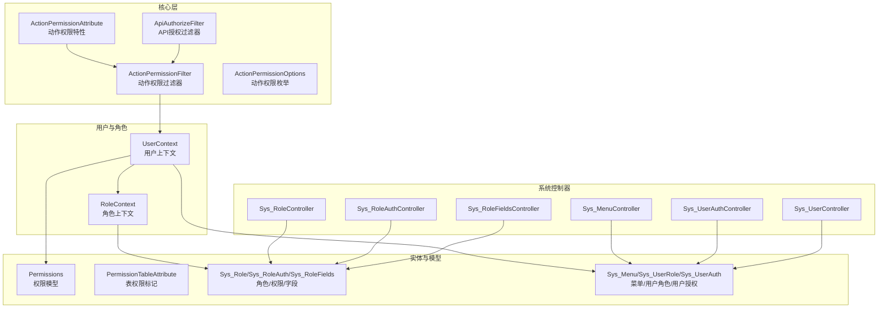
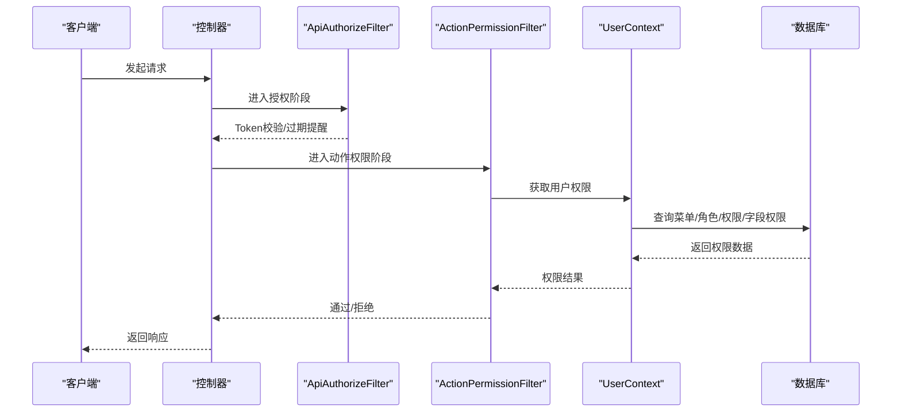
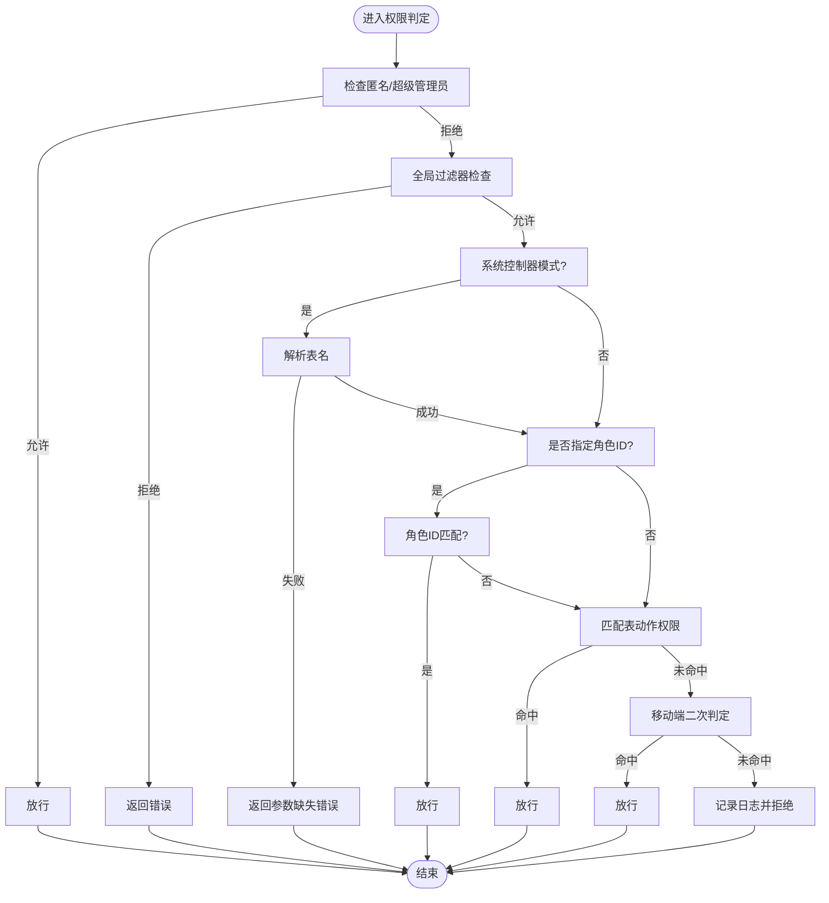
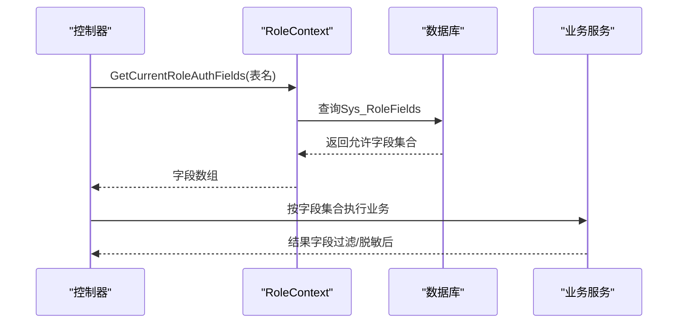
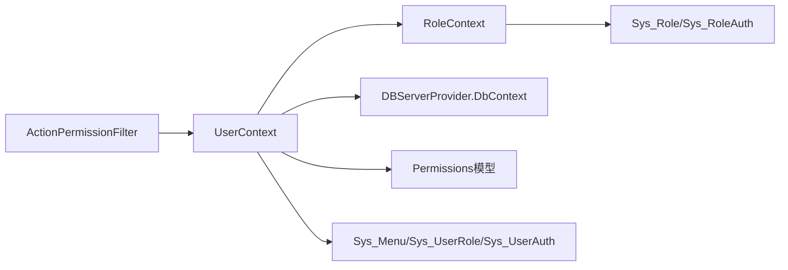

# 权限控制

<cite>
**本文引用的文件**
- [ActionPermissionAttribute.cs](file://VolPro.Core/Filters/ActionPermissionAttribute.cs)
- [ActionPermissionFilter.cs](file://VolPro.Core/Filters/ActionPermissionFilter.cs)
- [ApiAuthorizeFilter.cs](file://VolPro.Core/Filters/ApiAuthorizeFilter.cs)
- [ActionPermissionOptions.cs](file://VolPro.Core/Enums/ActionPermissionOptions.cs)
- [PermissionTableAttribute.cs](file://VolPro.Entity/AttributeManager/PermissionTableAttribute.cs)
- [Permissions.cs](file://VolPro.Entity/DomainModels/System/Permissions.cs)
- [UserContext.cs](file://VolPro.Core/UserManager/UserContext.cs)
- [RoleContext.cs](file://VolPro.Core/UserManager/RoleContext.cs)
- [Sys_Role.cs](file://VolPro.Entity/DomainModels/System/Sys_Role.cs)
- [Sys_RoleAuth.cs](file://VolPro.Entity/DomainModels/System/Sys_RoleAuth.cs)
- [Sys_RoleFields.cs](file://VolPro.Entity/DomainModels/System/Sys_RoleFields.cs)
- [Sys_UserRole.cs](file://VolPro.Entity/DomainModels/System/Sys_UserRole.cs)
- [Sys_MenuRole.cs](file://VolPro.Entity/DomainModels/System/Sys_MenuRole.cs)
- [Sys_UserAuth.cs](file://VolPro.Entity/DomainModels/System/Sys_UserAuth.cs)
- [Sys_Menu.cs](file://VolPro.Entity/DomainModels/System/Sys_Menu.cs)
- [Sys_User.cs](file://VolPro.Entity/DomainModels/System/Sys_User.cs)
- [Sys_UserDepartment.cs](file://VolPro.Entity/DomainModels/System/Sys_UserDepartment.cs)
- [Sys_UserPost.cs](file://VolPro.Entity/DomainModels/System/Sys_UserPost.cs)
- [Sys_Department.cs](file://VolPro.Entity/DomainModels/System/Sys_Department.cs)
- [Sys_Post.cs](file://VolPro.Entity/DomainModels/System/Sys_Post.cs)
- [Sys_Dictionary.cs](file://VolPro.Entity/DomainModels/System/Sys_Dictionary.cs)
- [Sys_DictionaryList.cs](file://VolPro.Entity/DomainModels/System/Sys_DictionaryList.cs)
- [Sys_Log.cs](file://VolPro.Entity/DomainModels/System/Sys_Log.cs)
- [Sys_Region.cs](file://VolPro.Entity/DomainModels/System/Sys_Region.cs)
- [Sys_ReportOptions.cs](file://VolPro.Entity/DomainModels/System/Sys_ReportOptions.cs)
- [Sys_PrintOptions.cs](file://VolPro.Entity/DomainModels/System/Sys_PrintOptions.cs)
- [Sys_Role.cs](file://VolPro.Sys/Repositories/System/Sys_RoleRepository.cs)
- [Sys_RoleService.cs](file://VolPro.Sys/Services/System/Sys_RoleService.cs)
- [Sys_RoleController.cs](file://VolPro.WebApi/Controllers/Sys/Sys_RoleController.cs)
- [Sys_UserController.cs](file://VolPro.WebApi/Controllers/Sys/Sys_UserController.cs)
- [Sys_MenuController.cs](file://VolPro.WebApi/Controllers/Sys/Sys_MenuController.cs)
- [Sys_RoleAuthController.cs](file://VolPro.WebApi/Controllers/Sys/Sys_RoleAuthController.cs)
- [Sys_RoleFieldsController.cs](file://VolPro.WebApi/Controllers/Sys/Sys_RoleFieldsController.cs)
- [Sys_UserAuthController.cs](file://VolPro.WebApi/Controllers/Sys/Sys_UserAuthController.cs)
- [Sys_DepartmentController.cs](file://VolPro.WebApi/Controllers/Sys/Sys_DepartmentController.cs)
- [Sys_PostController.cs](file://VolPro.WebApi/Controllers/Sys/Sys_PostController.cs)
- [Sys_DictionaryController.cs](file://VolPro.WebApi/Controllers/Sys/Sys_DictionaryController.cs)
- [Sys_RegionController.cs](file://VolPro.WebApi/Controllers/Sys/Sys_RegionController.cs)
- [Sys_ReportOptionsController.cs](file://VolPro.WebApi/Controllers/Sys/Sys_ReportOptionsController.cs)
- [Sys_PrintOptionsController.cs](file://VolPro.WebApi/Controllers/Sys/Sys_PrintOptionsController.cs)
</cite>

## 目录
1. [简介](#简介)
2. [项目结构](#项目结构)
3. [核心组件](#核心组件)
4. [架构总览](#架构总览)
5. [详细组件分析](#详细组件分析)
6. [依赖分析](#依赖分析)
7. [性能考虑](#性能考虑)
8. [故障排查指南](#故障排查指南)
9. [结论](#结论)
10. [附录](#附录)

## 简介
本文件面向权限控制系统，围绕基于角色的访问控制（RBAC）模型，系统性阐述角色定义、权限分配与继承、控制器方法级权限控制、动态权限验证、字段级权限控制（含敏感数据访问限制与数据脱敏思路）、权限过滤器工作原理与自定义验证逻辑、权限配置最佳实践（权限矩阵与继承策略），以及权限调试与问题诊断方法。文档以代码为依据，结合架构图与流程图，帮助开发者快速理解并高效落地权限体系。

## 项目结构
权限控制相关能力分布在以下模块：
- 核心过滤与枚举：Filters、Enums
- 用户上下文与角色上下文：UserManager
- 实体与数据模型：Entity（System、AttributeManager）
- 系统功能控制器：WebApi/Controllers/Sys
- 系统服务与仓储：Sys/Services、Sys/Repositories



图表来源
- [ActionPermissionAttribute.cs:10-95](file://VolPro.Core/Filters/ActionPermissionAttribute.cs#L10-L95)
- [ActionPermissionFilter.cs:22-123](file://VolPro.Core/Filters/ActionPermissionFilter.cs#L22-L123)
- [ApiAuthorizeFilter.cs:16-86](file://VolPro.Core/Filters/ApiAuthorizeFilter.cs#L16-L86)
- [ActionPermissionOptions.cs:7-22](file://VolPro.Core/Enums/ActionPermissionOptions.cs#L7-L22)
- [UserContext.cs:22-704](file://VolPro.Core/UserManager/UserContext.cs#L22-L704)
- [RoleContext.cs:16-243](file://VolPro.Core/UserManager/RoleContext.cs#L16-L243)
- [Permissions.cs:10-38](file://VolPro.Entity/DomainModels/System/Permissions.cs#L10-L38)
- [PermissionTableAttribute.cs:5-12](file://VolPro.Entity/AttributeManager/PermissionTableAttribute.cs#L5-L12)

章节来源
- [ActionPermissionAttribute.cs:10-95](file://VolPro.Core/Filters/ActionPermissionAttribute.cs#L10-L95)
- [ActionPermissionFilter.cs:22-123](file://VolPro.Core/Filters/ActionPermissionFilter.cs#L22-L123)
- [ApiAuthorizeFilter.cs:16-86](file://VolPro.Core/Filters/ApiAuthorizeFilter.cs#L16-L86)
- [ActionPermissionOptions.cs:7-22](file://VolPro.Core/Enums/ActionPermissionOptions.cs#L7-L22)
- [UserContext.cs:22-704](file://VolPro.Core/UserManager/UserContext.cs#L22-L704)
- [RoleContext.cs:16-243](file://VolPro.Core/UserManager/RoleContext.cs#L16-L243)
- [Permissions.cs:10-38](file://VolPro.Entity/DomainModels/System/Permissions.cs#L10-L38)
- [PermissionTableAttribute.cs:5-12](file://VolPro.Entity/AttributeManager/PermissionTableAttribute.cs#L5-L12)

## 核心组件
- 动作权限特性与过滤器
  - ActionPermissionAttribute：用于在控制器或Action上声明权限需求，支持角色限定、表级权限与系统控制器模式。
  - ActionPermissionFilter：实现权限判定逻辑，处理匿名访问、全局过滤、角色ID校验、表动作权限匹配、移动端权限二次判定与日志记录。
- 授权过滤器
  - ApiAuthorizeFilter：负责Token合法性与过期提醒，配合ActionPermissionFilter完成细粒度权限控制。
- 用户与角色上下文
  - UserContext：提供用户信息、角色集合、权限缓存、用户可见用户列表、租户选择、子角色/子部门递归查询等能力。
  - RoleContext：维护角色树、字段级权限初始化与查询、角色下用户查询等。
- 权限模型与标记
  - Permissions：封装菜单、表名、用户权限数组、菜单类型与数据权限。
  - PermissionTableAttribute：为控制器标注受控表名，用于SysController模式自动推断表名。
- 权限枚举
  - ActionPermissionOptions：Add/Delete/Update/Search/Export/Audit/Upload/Import等动作权限位枚举，采用2的幂次组合，便于按位运算聚合。

章节来源
- [ActionPermissionAttribute.cs:10-95](file://VolPro.Core/Filters/ActionPermissionAttribute.cs#L10-L95)
- [ActionPermissionFilter.cs:22-123](file://VolPro.Core/Filters/ActionPermissionFilter.cs#L22-L123)
- [ApiAuthorizeFilter.cs:16-86](file://VolPro.Core/Filters/ApiAuthorizeFilter.cs#L16-L86)
- [UserContext.cs:22-704](file://VolPro.Core/UserManager/UserContext.cs#L22-L704)
- [RoleContext.cs:16-243](file://VolPro.Core/UserManager/RoleContext.cs#L16-L243)
- [Permissions.cs:10-38](file://VolPro.Entity/DomainModels/System/Permissions.cs#L10-L38)
- [PermissionTableAttribute.cs:5-12](file://VolPro.Entity/AttributeManager/PermissionTableAttribute.cs#L5-L12)
- [ActionPermissionOptions.cs:7-22](file://VolPro.Core/Enums/ActionPermissionOptions.cs#L7-L22)

## 架构总览
权限控制采用“特性+过滤器+上下文+实体模型”的分层架构：
- 特性层：在控制器/Action上声明权限需求（角色、表、动作）。
- 过滤器层：在Action执行前后进行权限判定与拦截。
- 上下文层：统一管理用户、角色、权限缓存与递归查询。
- 实体层：持久化角色、菜单、权限、字段权限、用户授权等元数据。



图表来源
- [ApiAuthorizeFilter.cs:29-82](file://VolPro.Core/Filters/ApiAuthorizeFilter.cs#L29-L82)
- [ActionPermissionFilter.cs:34-120](file://VolPro.Core/Filters/ActionPermissionFilter.cs#L34-L120)
- [UserContext.cs:263-389](file://VolPro.Core/UserManager/UserContext.cs#L263-L389)

## 详细组件分析

### RBAC模型与角色定义
- 角色与继承
  - Sys_Role：角色主表，包含父子关系、数据库服务绑定、数据权限标识等。
  - RoleContext：加载角色树、计算子角色集合、提供角色下用户查询。
- 角色-菜单-权限
  - Sys_Menu：菜单与表名映射，定义菜单动作集合。
  - Sys_RoleAuth：角色到菜单权限的映射，保存具体权限值。
  - UserContext.GetPermissions：按角色合并权限，去重并按菜单分组，输出Permissions集合。
- 用户-角色
  - Sys_UserRole：用户与角色关联，支持多角色。
  - UserContext.RoleIds：解析用户角色集合，含超级管理员特例。

```mermaid
classDiagram
class Sys_Role {
+int Role_Id
+int ParentId
+string RoleName
+Guid DbServiceId
+int DatAuth
}
class Sys_Menu {
+int Menu_Id
+int ParentId
+string TableName
+string Auth
+int MenuType
}
class Sys_RoleAuth {
+int Role_Id
+int Menu_Id
+string AuthValue
+string AuthMenuData
}
class Sys_UserRole {
+int UserId
+int RoleId
+int Enable
}
class Permissions {
+int Menu_Id
+int ParentId
+string TableName
+string MenuAuth
+string UserAuth
+string[] UserAuthArr
+int MenuType
+string AuthMenuData
}
Sys_Menu ||--o{ Sys_RoleAuth : "角色-菜单映射"
Sys_Role ||--o{ Sys_RoleAuth : "角色-权限映射"
Sys_UserRole ||--o{ Sys_Role : "用户-角色"
Permissions --> Sys_Menu : "来源于菜单"
Permissions --> Sys_RoleAuth : "来源于角色权限"
```

图表来源
- [Sys_Role.cs](file://VolPro.Entity/DomainModels/System/Sys_Role.cs)
- [Sys_Menu.cs](file://VolPro.Entity/DomainModels/System/Sys_Menu.cs)
- [Sys_RoleAuth.cs](file://VolPro.Entity/DomainModels/System/Sys_RoleAuth.cs)
- [Sys_UserRole.cs](file://VolPro.Entity/DomainModels/System/Sys_UserRole.cs)
- [Permissions.cs:10-38](file://VolPro.Entity/DomainModels/System/Permissions.cs#L10-L38)

章节来源
- [RoleContext.cs:112-218](file://VolPro.Core/UserManager/RoleContext.cs#L112-L218)
- [UserContext.cs:263-389](file://VolPro.Core/UserManager/UserContext.cs#L263-L389)
- [Sys_Role.cs](file://VolPro.Entity/DomainModels/System/Sys_Role.cs)
- [Sys_Menu.cs](file://VolPro.Entity/DomainModels/System/Sys_Menu.cs)
- [Sys_RoleAuth.cs](file://VolPro.Entity/DomainModels/System/Sys_RoleAuth.cs)
- [Sys_UserRole.cs](file://VolPro.Entity/DomainModels/System/Sys_UserRole.cs)
- [Permissions.cs:10-38](file://VolPro.Entity/DomainModels/System/Permissions.cs#L10-L38)

### 操作权限管理（控制器方法级）
- 声明方式
  - ActionPermissionAttribute支持多种构造：
    - 仅角色ID限定；
    - 表名+动作+可选角色；
    - 系统控制器模式（自动从PermissionTableAttribute或控制器名推断表名）。
- 执行流程
  - 匿名或超级管理员直接放行；
  - 全局过滤器对演示环境进行额外限制；
  - 若指定角色ID但无表动作权限，仅角色ID满足即放行；
  - 否则匹配用户对该表的动作权限集合，移动端权限二次判定；
  - 记录无权限日志并返回错误响应。



图表来源
- [ActionPermissionFilter.cs:43-120](file://VolPro.Core/Filters/ActionPermissionFilter.cs#L43-L120)
- [ActionPermissionAttribute.cs:50-92](file://VolPro.Core/Filters/ActionPermissionAttribute.cs#L50-L92)
- [PermissionTableAttribute.cs:5-12](file://VolPro.Entity/AttributeManager/PermissionTableAttribute.cs#L5-L12)

章节来源
- [ActionPermissionAttribute.cs:10-95](file://VolPro.Core/Filters/ActionPermissionAttribute.cs#L10-L95)
- [ActionPermissionFilter.cs:22-123](file://VolPro.Core/Filters/ActionPermissionFilter.cs#L22-L123)
- [ApiAuthorizeFilter.cs:29-82](file://VolPro.Core/Filters/ApiAuthorizeFilter.cs#L29-L82)

### 动态权限验证与自定义逻辑
- 动态权限来源
  - UserContext.GetPermissions：按角色ID查询菜单权限，合并UserAuth为字符串数组，支持移动端类型过滤。
  - 支持菜单动作数组与用户权限数组的匹配，便于扩展新动作。
- 自定义验证
  - 可在Action中调用UserContext.ExistsPermissions或直接使用UserContext.GetPermissions(func)进行自定义筛选。
  - 支持按菜单类型（移动端/PC端）区分权限集。

章节来源
- [UserContext.cs:188-289](file://VolPro.Core/UserManager/UserContext.cs#L188-L289)
- [UserContext.cs:208-212](file://VolPro.Core/UserManager/UserContext.cs#L208-L212)
- [UserContext.cs:484-504](file://VolPro.Core/UserManager/UserContext.cs#L484-L504)

### 字段级权限控制（敏感数据与脱敏）
- 字段权限来源
  - Sys_RoleFields：角色到表字段的授权集合，按表名与角色维度存储。
  - RoleContext.GetCurrentRoleAuthFields：按当前用户角色与表名返回允许访问的字段集合。
- 使用方式
  - 在数据查询/导出/展示前，结合字段权限集合进行字段过滤或脱敏处理。
  - 支持获取所有表的字段权限集合，便于批量处理。
- 超级管理员
  - 超级管理员默认不限制字段访问（返回空集合）。



图表来源
- [RoleContext.cs:54-77](file://VolPro.Core/UserManager/RoleContext.cs#L54-L77)
- [Sys_RoleFields.cs](file://VolPro.Entity/DomainModels/System/Sys_RoleFields.cs)

章节来源
- [RoleContext.cs:28-110](file://VolPro.Core/UserManager/RoleContext.cs#L28-L110)
- [Sys_RoleFields.cs](file://VolPro.Entity/DomainModels/System/Sys_RoleFields.cs)

### 权限过滤器工作原理
- ApiAuthorizeFilter
  - 处理匿名、固定Token、任务型接口等场景；对即将过期的Token设置响应头提示刷新。
- ActionPermissionFilter
  - 统一入口：OnActionExecutionAsync -> OnActionExecutionPermission
  - 优先级：匿名/超级管理员 > 全局过滤器 > 角色ID > 表动作权限 > 移动端二次判定
  - 缓存与并发：角色权限与用户授权均采用版本号+缓存键+锁机制，避免并发冲突与脏读。

章节来源
- [ApiAuthorizeFilter.cs:29-82](file://VolPro.Core/Filters/ApiAuthorizeFilter.cs#L29-L82)
- [ActionPermissionFilter.cs:34-120](file://VolPro.Core/Filters/ActionPermissionFilter.cs#L34-L120)
- [UserContext.cs:283-389](file://VolPro.Core/UserManager/UserContext.cs#L283-L389)

### 权限配置最佳实践
- 权限矩阵设计
  - 以ActionPermissionOptions的位组合表达动作集合，便于复用与扩展。
  - 建议为每张业务表建立Sys_Menu项，明确动作集合与菜单类型（移动端/PC端）。
- 权限继承策略
  - 利用RoleContext的角色树，将通用权限赋予父角色，子角色自动继承。
  - 对于特殊场景，可在Sys_RoleAuth中对特定菜单覆盖权限。
- 字段权限
  - 将敏感字段纳入Sys_RoleFields，按角色精确授权。
  - 导出/报表场景建议先字段过滤再脱敏，确保最小暴露面。
- 控制器声明
  - 优先使用PermissionTableAttribute标注表名，简化SysController模式。
  - 对关键操作启用ActionPermissionAttribute，避免遗漏。

章节来源
- [ActionPermissionOptions.cs:7-22](file://VolPro.Core/Enums/ActionPermissionOptions.cs#L7-L22)
- [PermissionTableAttribute.cs:5-12](file://VolPro.Entity/AttributeManager/PermissionTableAttribute.cs#L5-L12)
- [RoleContext.cs:161-196](file://VolPro.Core/UserManager/RoleContext.cs#L161-L196)
- [Sys_RoleAuth.cs](file://VolPro.Entity/DomainModels/System/Sys_RoleAuth.cs)

### 权限调试与诊断
- 日志定位
  - ActionPermissionFilter在无权限时记录详细日志（用户ID、用户名、表名、动作），便于快速定位。
- 缓存一致性
  - 菜单/角色/字段权限变更后，需刷新对应版本号或触发缓存失效，避免旧权限生效。
- 常见问题
  - 表名大小写：权限存储时已转小写，查询时保持一致。
  - 菜单类型：移动端与PC端权限可分离，注意MenuType匹配。
  - 超级管理员：拥有全量权限，若出现异常需检查角色ID是否误设为1。

章节来源
- [ActionPermissionFilter.cs:113-118](file://VolPro.Core/Filters/ActionPermissionFilter.cs#L113-L118)
- [UserContext.cs:265-282](file://VolPro.Core/UserManager/UserContext.cs#L265-L282)

## 依赖分析
- 组件耦合
  - ActionPermissionFilter依赖UserContext进行权限查询，UserContext依赖RoleContext与数据库查询。
  - 权限模型Permissions由Sys_Menu与Sys_RoleAuth联合生成。
- 外部依赖
  - 缓存服务（ICacheService）用于权限版本号与权限数据缓存。
  - 数据库上下文（DBServerProvider.DbContext）用于权限与元数据查询。
- 循环依赖
  - 通过上下文与仓储解耦，避免直接循环引用。



图表来源
- [ActionPermissionFilter.cs:28-33](file://VolPro.Core/Filters/ActionPermissionFilter.cs#L28-L33)
- [UserContext.cs:263-389](file://VolPro.Core/UserManager/UserContext.cs#L263-L389)
- [RoleContext.cs:112-149](file://VolPro.Core/UserManager/RoleContext.cs#L112-L149)

章节来源
- [ActionPermissionFilter.cs:22-123](file://VolPro.Core/Filters/ActionPermissionFilter.cs#L22-L123)
- [UserContext.cs:22-704](file://VolPro.Core/UserManager/UserContext.cs#L22-L704)
- [RoleContext.cs:16-243](file://VolPro.Core/UserManager/RoleContext.cs#L16-L243)

## 性能考虑
- 缓存策略
  - 角色权限与用户授权采用版本号+锁机制，降低并发冲突与重复查询。
  - 菜单动作数组与用户权限数组预处理，避免运行时重复转换。
- 查询优化
  - 权限查询使用左连接与条件过滤，减少不必要的数据传输。
  - 超级管理员直接返回全量权限，避免复杂查询。
- 并发控制
  - 使用ConcurrentDictionary与lock保护关键路径，确保线程安全。

章节来源
- [UserContext.cs:283-389](file://VolPro.Core/UserManager/UserContext.cs#L283-L389)
- [UserContext.cs:419-475](file://VolPro.Core/UserManager/UserContext.cs#L419-L475)

## 故障排查指南
- 无权限错误
  - 检查ActionPermissionFilter日志，确认表名、动作与用户角色是否匹配。
  - 确认PermissionTableAttribute与控制器名是否正确映射。
- 超级管理员仍受限
  - 检查UserContext.IsSuperAdmin逻辑与角色ID是否为1。
- 字段权限异常
  - 核对Sys_RoleFields配置与表名大小写一致性。
  - 确认RoleContext字段缓存是否已刷新。
- Token过期
  - ApiAuthorizeFilter会在即将过期时设置响应头，前端应监听并刷新Token。

章节来源
- [ActionPermissionFilter.cs:113-118](file://VolPro.Core/Filters/ActionPermissionFilter.cs#L113-L118)
- [UserContext.cs:70-85](file://VolPro.Core/UserManager/UserContext.cs#L70-L85)
- [ApiAuthorizeFilter.cs:75-82](file://VolPro.Core/Filters/ApiAuthorizeFilter.cs#L75-L82)

## 结论
该权限系统以RBAC为核心，结合特性声明、过滤器执行、上下文缓存与实体模型，实现了控制器方法级权限控制、动态权限验证与字段级权限管理。通过角色继承、菜单动作位组合与移动端/PC端权限分离，系统具备良好的可扩展性与可维护性。建议在生产环境中完善权限审计、缓存监控与异常告警，持续优化权限配置与查询性能。

## 附录
- 关键控制器（系统管理）
  - Sys_RoleController、Sys_MenuController、Sys_RoleAuthController、Sys_RoleFieldsController、Sys_UserAuthController、Sys_UserController、Sys_DepartmentController、Sys_PostController、Sys_DictionaryController、Sys_RegionController、Sys_ReportOptionsController、Sys_PrintOptionsController等，均与权限模型紧密关联，用于维护角色、菜单、权限与字段授权等元数据。

章节来源
- [Sys_RoleController.cs](file://VolPro.WebApi/Controllers/Sys/Sys_RoleController.cs)
- [Sys_MenuController.cs](file://VolPro.WebApi/Controllers/Sys/Sys_MenuController.cs)
- [Sys_RoleAuthController.cs](file://VolPro.WebApi/Controllers/Sys/Sys_RoleAuthController.cs)
- [Sys_RoleFieldsController.cs](file://VolPro.WebApi/Controllers/Sys/Sys_RoleFieldsController.cs)
- [Sys_UserAuthController.cs](file://VolPro.WebApi/Controllers/Sys/Sys_UserAuthController.cs)
- [Sys_UserController.cs](file://VolPro.WebApi/Controllers/Sys/Sys_UserController.cs)
- [Sys_DepartmentController.cs](file://VolPro.WebApi/Controllers/Sys/Sys_DepartmentController.cs)
- [Sys_PostController.cs](file://VolPro.WebApi/Controllers/Sys/Sys_PostController.cs)
- [Sys_DictionaryController.cs](file://VolPro.WebApi/Controllers/Sys/Sys_DictionaryController.cs)
- [Sys_RegionController.cs](file://VolPro.WebApi/Controllers/Sys/Sys_RegionController.cs)
- [Sys_ReportOptionsController.cs](file://VolPro.WebApi/Controllers/Sys/Sys_ReportOptionsController.cs)
- [Sys_PrintOptionsController.cs](file://VolPro.WebApi/Controllers/Sys/Sys_PrintOptionsController.cs)