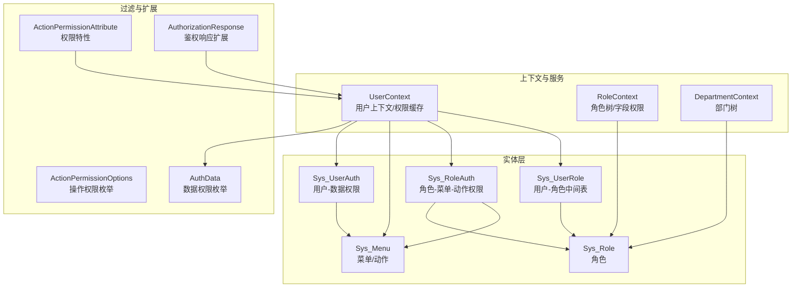
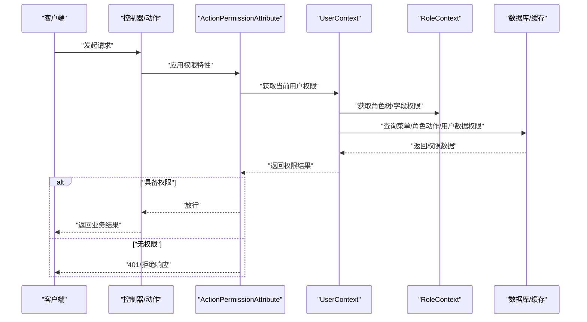
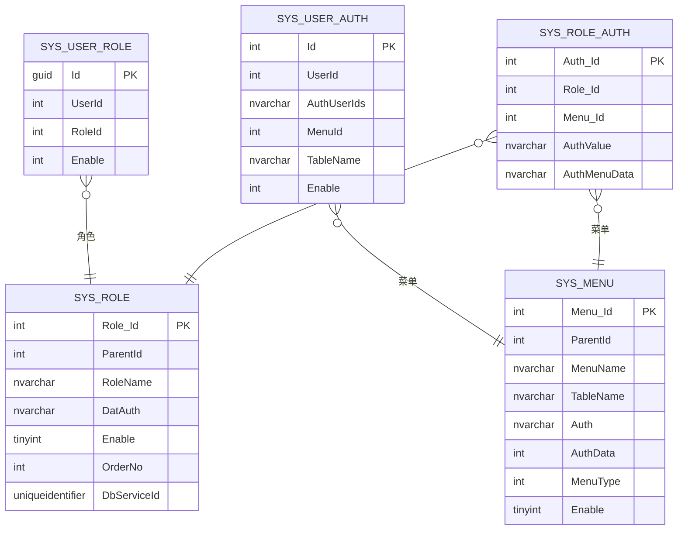
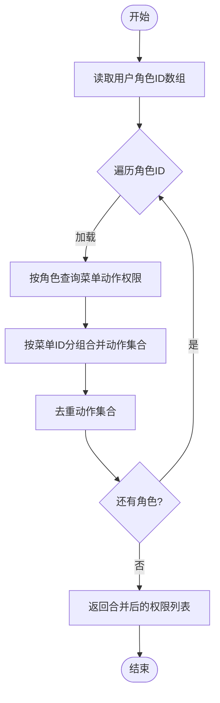
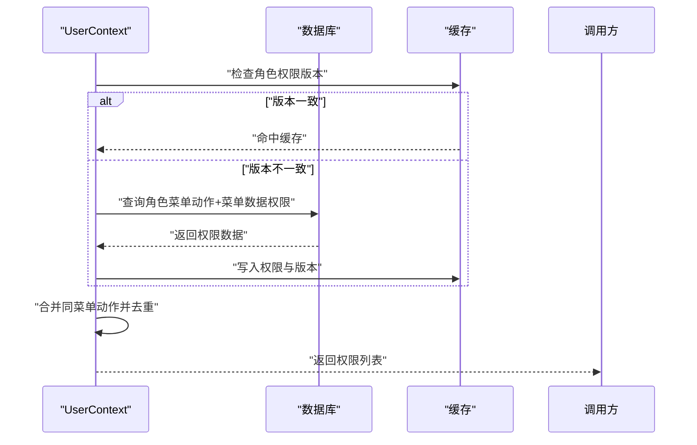
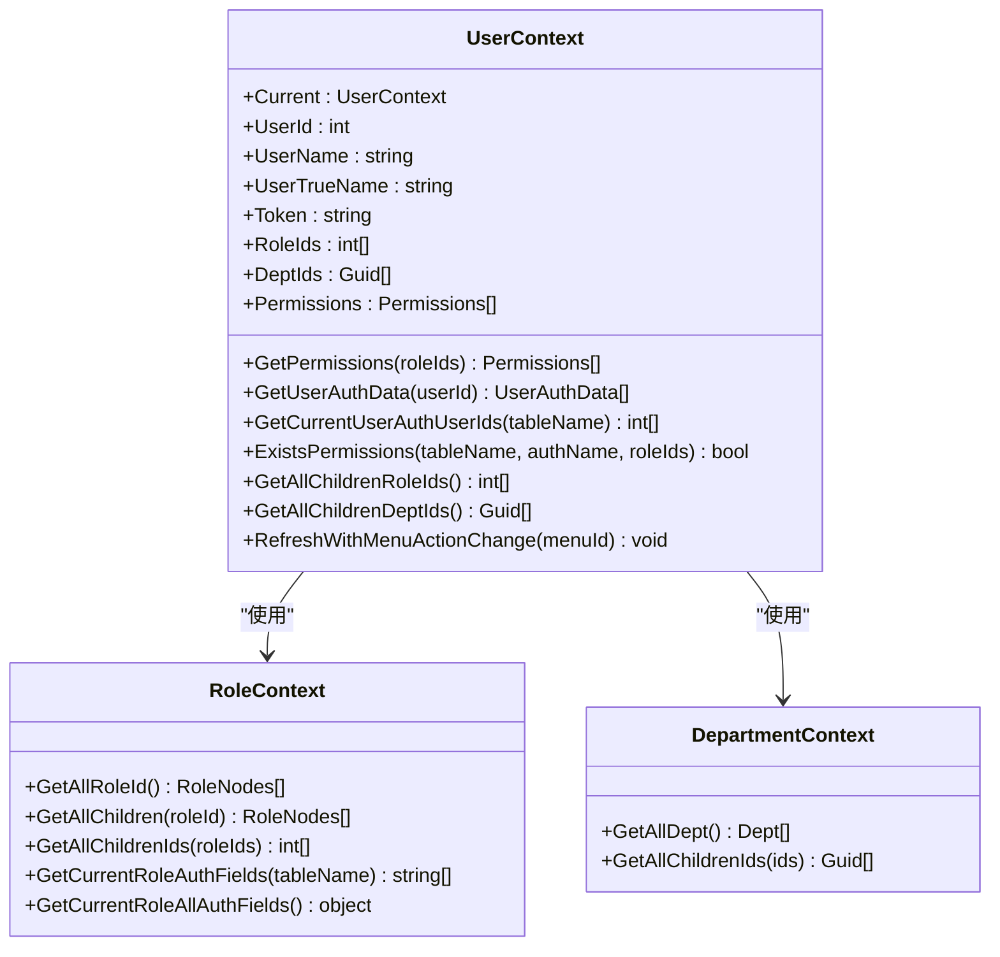
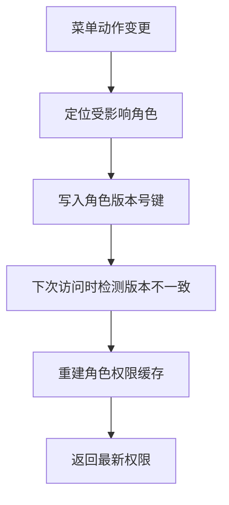
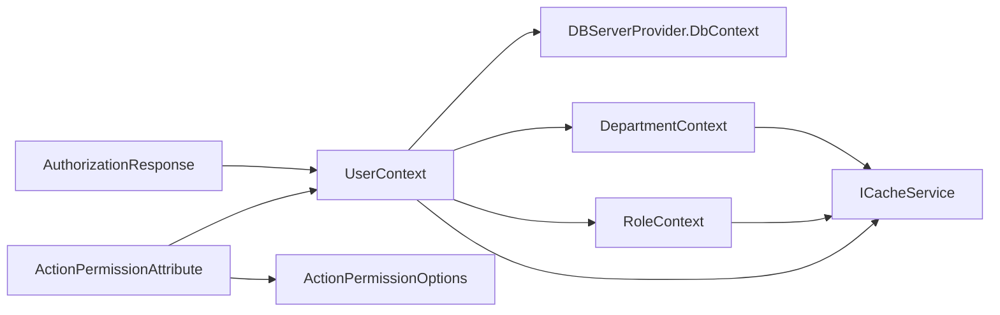

# 用户角色权限

<cite>
**本文引用的文件**
- [Sys_UserRole.cs](file://VolPro.Entity/DomainModels/System/Sys_UserRole.cs)
- [Sys_UserAuth.cs](file://VolPro.Entity/DomainModels/System/Sys_UserAuth.cs)
- [Sys_Role.cs](file://VolPro.Entity/DomainModels/System/Sys_Role.cs)
- [Sys_RoleAuth.cs](file://VolPro.Entity/DomainModels/System/Sys_RoleAuth.cs)
- [Sys_Menu.cs](file://VolPro.Entity/DomainModels/System/Sys_Menu.cs)
- [UserContext.cs](file://VolPro.Core/UserManager/UserContext.cs)
- [RoleContext.cs](file://VolPro.Core/UserManager/RoleContext.cs)
- [DepartmentContext.cs](file://VolPro.Core/UserManager/DepartmentContext.cs)
- [ActionPermissionAttribute.cs](file://VolPro.Core/Filters/ActionPermissionAttribute.cs)
- [AuthorizationResponse.cs](file://VolPro.Core/Extensions/AuthorizationResponse.cs)
- [ActionPermissionOptions.cs](file://VolPro.Core/Enums/ActionPermissionOptions.cs)
- [AuthData.cs](file://VolPro.Core/Enums/AuthData.cs)
</cite>

## 目录
1. [简介](#简介)
2. [项目结构](#项目结构)
3. [核心组件](#核心组件)
4. [架构总览](#架构总览)
5. [详细组件分析](#详细组件分析)
6. [依赖分析](#依赖分析)
7. [性能考量](#性能考量)
8. [故障排查指南](#故障排查指南)
9. [结论](#结论)
10. [附录](#附录)

## 简介
本文件围绕用户角色权限体系进行系统化技术文档编制，重点涵盖以下内容：
- 实体设计与关联：Sys_UserRole、Sys_UserAuth 的设计原则与与角色、菜单、权限的关系。
- 多角色绑定与优先级：如何通过用户-角色中间表支持多角色，以及在权限合并时的优先级与去重策略。
- 权限继承与合并：基于角色-菜单-动作的继承链路，以及角色权限合并、菜单数据权限与用户级数据权限的协同。
- 用户上下文（UserContext）工作原理：当前用户信息获取、角色解析、权限缓存与版本控制、数据权限聚合。
- 应用场景：动态权限分配、权限缓存与失效、移动端/PC端菜单类型区分、数据权限（组织、角色、本人等）。
- 最佳实践与常见问题：权限设计建议、缓存版本管理、并发安全、异常处理与日志记录。

## 项目结构
权限模块主要分布在以下层次：
- 实体层：Sys_UserRole、Sys_UserAuth、Sys_Role、Sys_RoleAuth、Sys_Menu 等。
- 上下文与服务层：UserContext（用户上下文）、RoleContext（角色树与字段权限）、DepartmentContext（部门树）。
- 过滤与扩展：ActionPermissionAttribute（权限特性）、AuthorizationResponse（鉴权响应扩展）、ActionPermissionOptions（操作权限枚举）、AuthData（数据权限枚举）。

图表来源
- [Sys_UserRole.cs:17-47](file://VolPro.Entity/DomainModels/System/Sys_UserRole.cs#L17-L47)
- [Sys_UserAuth.cs:18-64](file://VolPro.Entity/DomainModels/System/Sys_UserAuth.cs#L18-L64)
- [Sys_Role.cs:18-72](file://VolPro.Entity/DomainModels/System/Sys_Role.cs#L18-L72)
- [Sys_RoleAuth.cs:14-56](file://VolPro.Entity/DomainModels/System/Sys_RoleAuth.cs#L14-L56)
- [Sys_Menu.cs:19-81](file://VolPro.Entity/DomainModels/System/Sys_Menu.cs#L19-L81)
- [UserContext.cs:22-130](file://VolPro.Core/UserManager/UserContext.cs#L22-L130)
- [RoleContext.cs:16-148](file://VolPro.Core/UserManager/RoleContext.cs#L16-L148)
- [DepartmentContext.cs:15-77](file://VolPro.Core/UserManager/DepartmentContext.cs#L15-L77)
- [ActionPermissionAttribute.cs:10-94](file://VolPro.Core/Filters/ActionPermissionAttribute.cs#L10-L94)
- [AuthorizationResponse.cs:13-44](file://VolPro.Core/Extensions/AuthorizationResponse.cs#L13-L44)
- [ActionPermissionOptions.cs:7-21](file://VolPro.Core/Enums/ActionPermissionOptions.cs#L7-L21)
- [AuthData.cs:9-18](file://VolPro.Core/Enums/AuthData.cs#L9-L18)

章节来源
- [Sys_UserRole.cs:17-109](file://VolPro.Entity/DomainModels/System/Sys_UserRole.cs#L17-L109)
- [Sys_UserAuth.cs:18-126](file://VolPro.Entity/DomainModels/System/Sys_UserAuth.cs#L18-L126)
- [Sys_Role.cs:18-141](file://VolPro.Entity/DomainModels/System/Sys_Role.cs#L18-L141)
- [Sys_RoleAuth.cs:14-98](file://VolPro.Entity/DomainModels/System/Sys_RoleAuth.cs#L14-L98)
- [Sys_Menu.cs:19-183](file://VolPro.Entity/DomainModels/System/Sys_Menu.cs#L19-L183)
- [UserContext.cs:22-703](file://VolPro.Core/UserManager/UserContext.cs#L22-L703)
- [RoleContext.cs:16-242](file://VolPro.Core/UserManager/RoleContext.cs#L16-L242)
- [DepartmentContext.cs:15-127](file://VolPro.Core/UserManager/DepartmentContext.cs#L15-L127)
- [ActionPermissionAttribute.cs:10-94](file://VolPro.Core/Filters/ActionPermissionAttribute.cs#L10-L94)
- [AuthorizationResponse.cs:13-44](file://VolPro.Core/Extensions/AuthorizationResponse.cs#L13-L44)
- [ActionPermissionOptions.cs:7-21](file://VolPro.Core/Enums/ActionPermissionOptions.cs#L7-L21)
- [AuthData.cs:9-18](file://VolPro.Core/Enums/AuthData.cs#L9-L18)

## 核心组件
- 实体模型
  - Sys_UserRole：用户-角色绑定表，支持多角色绑定与启用状态。
  - Sys_UserAuth：用户级数据权限（按菜单维度），用于限制用户可见的“数据用户ID”集合。
  - Sys_Role：角色基础信息与数据库服务绑定。
  - Sys_RoleAuth：角色对菜单的动作权限与菜单数据权限。
  - Sys_Menu：菜单与动作定义，含权限字符串与菜单类型（移动端/PC端）。
- 上下文与服务
  - UserContext：用户上下文，负责用户信息、角色ID、权限缓存、版本控制、数据权限聚合、租户与部门选择。
  - RoleContext：角色树构建与字段权限缓存，提供角色继承展开与用户可访问用户ID查询。
  - DepartmentContext：部门树构建与子部门展开。
- 过滤与扩展
  - ActionPermissionAttribute：控制器/动作级权限特性，支持表级权限、角色限定、系统控制器标记。
  - AuthorizationResponse：统一鉴权失败响应扩展。
  - ActionPermissionOptions：操作权限枚举（新增、删除、更新、查询、导出、审核、上传、导入）。
  - AuthData：数据权限枚举（全部、本组织与本角色及其下、本组织及下、本组织、本角色及其下、本角色、仅自己）。

章节来源
- [Sys_UserRole.cs:17-109](file://VolPro.Entity/DomainModels/System/Sys_UserRole.cs#L17-L109)
- [Sys_UserAuth.cs:18-126](file://VolPro.Entity/DomainModels/System/Sys_UserAuth.cs#L18-L126)
- [Sys_Role.cs:18-141](file://VolPro.Entity/DomainModels/System/Sys_Role.cs#L18-L141)
- [Sys_RoleAuth.cs:14-98](file://VolPro.Entity/DomainModels/System/Sys_RoleAuth.cs#L14-L98)
- [Sys_Menu.cs:19-183](file://VolPro.Entity/DomainModels/System/Sys_Menu.cs#L19-L183)
- [UserContext.cs:22-703](file://VolPro.Core/UserManager/UserContext.cs#L22-L703)
- [RoleContext.cs:16-242](file://VolPro.Core/UserManager/RoleContext.cs#L16-L242)
- [DepartmentContext.cs:15-127](file://VolPro.Core/UserManager/DepartmentContext.cs#L15-L127)
- [ActionPermissionAttribute.cs:10-94](file://VolPro.Core/Filters/ActionPermissionAttribute.cs#L10-L94)
- [AuthorizationResponse.cs:13-44](file://VolPro.Core/Extensions/AuthorizationResponse.cs#L13-L44)
- [ActionPermissionOptions.cs:7-21](file://VolPro.Core/Enums/ActionPermissionOptions.cs#L7-L21)
- [AuthData.cs:9-18](file://VolPro.Core/Enums/AuthData.cs#L9-L18)

## 架构总览
用户权限架构围绕“用户-角色-菜单-动作-数据权限”的链路展开，结合缓存版本控制与并发安全，实现高性能的权限判定与数据范围控制。

图表来源
- [ActionPermissionAttribute.cs:10-94](file://VolPro.Core/Filters/ActionPermissionAttribute.cs#L10-L94)
- [UserContext.cs:22-130](file://VolPro.Core/UserManager/UserContext.cs#L22-L130)
- [RoleContext.cs:16-148](file://VolPro.Core/UserManager/RoleContext.cs#L16-L148)
- [AuthorizationResponse.cs:15-31](file://VolPro.Core/Extensions/AuthorizationResponse.cs#L15-L31)

## 详细组件分析

### 实体设计与关联
- Sys_UserRole
  - 设计要点：主键、用户ID、角色ID、启用状态；支持多角色绑定与启用控制。
  - 关联：与 Sys_Role 一对多，与用户表通过用户ID关联。
- Sys_UserAuth
  - 设计要点：用户级数据权限，按菜单维度存储“可查看的用户ID集合”，支持启用状态。
  - 关联：与 Sys_Menu 通过菜单ID关联，用于限制用户可见的数据范围。
- Sys_RoleAuth
  - 设计要点：角色对菜单的动作权限字符串与菜单数据权限字符串。
  - 关联：与 Sys_Menu、Sys_Role 关联，构成角色-菜单-动作-数据权限矩阵。
- Sys_Menu
  - 设计要点：菜单、动作、权限字符串、菜单类型（移动端/PC端）、启用状态。
- Sys_Role
  - 设计要点：角色基础信息、父级、数据库服务绑定、启用状态。

图表来源
- [Sys_UserRole.cs:17-109](file://VolPro.Entity/DomainModels/System/Sys_UserRole.cs#L17-L109)
- [Sys_UserAuth.cs:18-126](file://VolPro.Entity/DomainModels/System/Sys_UserAuth.cs#L18-L126)
- [Sys_Role.cs:18-141](file://VolPro.Entity/DomainModels/System/Sys_Role.cs#L18-L141)
- [Sys_RoleAuth.cs:14-98](file://VolPro.Entity/DomainModels/System/Sys_RoleAuth.cs#L14-L98)
- [Sys_Menu.cs:19-183](file://VolPro.Entity/DomainModels/System/Sys_Menu.cs#L19-L183)

章节来源
- [Sys_UserRole.cs:17-109](file://VolPro.Entity/DomainModels/System/Sys_UserRole.cs#L17-L109)
- [Sys_UserAuth.cs:18-126](file://VolPro.Entity/DomainModels/System/Sys_UserAuth.cs#L18-L126)
- [Sys_Role.cs:18-141](file://VolPro.Entity/DomainModels/System/Sys_Role.cs#L18-L141)
- [Sys_RoleAuth.cs:14-98](file://VolPro.Entity/DomainModels/System/Sys_RoleAuth.cs#L14-L98)
- [Sys_Menu.cs:19-183](file://VolPro.Entity/DomainModels/System/Sys_Menu.cs#L19-L183)

### 用户角色绑定机制（多角色与优先级）
- 多角色支持
  - 用户可通过 Sys_UserRole 绑定多个角色，启用状态控制生效范围。
  - UserContext 在获取权限时遍历角色ID数组，分别加载各角色的菜单动作权限。
- 角色优先级与合并
  - 对同一菜单，来自不同角色的动作权限进行去重合并，最终形成该菜单的可用动作集合。
  - 合并后按菜单ID分组，保留首个父级、表名、菜单类型等元信息。
- 并发与缓存
  - 使用线程安全字典与对象锁，按角色ID与用户ID分别加锁，避免并发重复加载。
  - 基于版本号（yyyyMMddHHMMssfff）的缓存策略，当菜单/角色变更时刷新版本，确保一致性。

图表来源
- [UserContext.cs:263-389](file://VolPro.Core/UserManager/UserContext.cs#L263-L389)

章节来源
- [UserContext.cs:263-389](file://VolPro.Core/UserManager/UserContext.cs#L263-L389)

### 权限继承与合并（角色-菜单-动作-数据权限）
- 角色-菜单-动作继承
  - 通过 Sys_RoleAuth 与 Sys_Menu 的关联，角色获得对菜单的动作权限字符串。
  - UserContext 将动作字符串反序列化为具体动作数组，供后续校验使用。
- 菜单数据权限
  - Sys_RoleAuth 中的 AuthMenuData 字段与 Sys_Menu 的 AuthData 字段共同决定菜单级数据权限策略。
- 用户级数据权限
  - Sys_UserAuth 的 AuthUserIds 存储用户可见的“数据用户ID集合”，UserContext 提供按表名查询与聚合方法，用于数据层过滤。
- 移动端/PC端菜单类型
  - Sys_Menu 的 MenuType 字段区分移动端（1）与 PC 端（0），UserContext 在筛选权限时按当前请求头自动匹配。

图表来源
- [UserContext.cs:283-389](file://VolPro.Core/UserManager/UserContext.cs#L283-L389)
- [Sys_RoleAuth.cs:14-65](file://VolPro.Entity/DomainModels/System/Sys_RoleAuth.cs#L14-L65)
- [Sys_Menu.cs:19-98](file://VolPro.Entity/DomainModels/System/Sys_Menu.cs#L19-L98)

章节来源
- [UserContext.cs:283-389](file://VolPro.Core/UserManager/UserContext.cs#L283-L389)
- [Sys_RoleAuth.cs:14-65](file://VolPro.Entity/DomainModels/System/Sys_RoleAuth.cs#L14-L65)
- [Sys_Menu.cs:19-98](file://VolPro.Entity/DomainModels/System/Sys_Menu.cs#L19-L98)

### 用户上下文（UserContext）工作原理
- 当前用户信息
  - 通过 JWT Claims 或自定义身份注入获取 UserId，随后从缓存或数据库加载 UserInfo（含角色ID、部门ID、岗位ID等）。
- 权限获取与缓存
  - 角色权限：按角色ID查询菜单动作与菜单数据权限，写入静态字典并维护版本号；并发通过对象锁与线程安全字典保护。
  - 用户数据权限：按用户查询 Sys_UserAuth，聚合为“表名 -> 可见用户ID集合”的映射。
- 数据权限与租户
  - 支持根据请求头 serviceId、deptId 选择当前服务库与部门库；超级管理员可跨库访问。
  - 提供获取当前租户下所有用户ID、子角色下用户ID、指定用户子角色下用户ID等查询接口。
- 菜单类型与移动端
  - 依据请求头 uapp 判断移动端/PC端，筛选对应菜单类型。

图表来源
- [UserContext.cs:22-703](file://VolPro.Core/UserManager/UserContext.cs#L22-L703)
- [RoleContext.cs:16-242](file://VolPro.Core/UserManager/RoleContext.cs#L16-L242)
- [DepartmentContext.cs:15-127](file://VolPro.Core/UserManager/DepartmentContext.cs#L15-L127)

章节来源
- [UserContext.cs:22-703](file://VolPro.Core/UserManager/UserContext.cs#L22-L703)
- [RoleContext.cs:16-242](file://VolPro.Core/UserManager/RoleContext.cs#L16-L242)
- [DepartmentContext.cs:15-127](file://VolPro.Core/UserManager/DepartmentContext.cs#L15-L127)

### 动态权限分配与权限缓存机制
- 动态权限分配
  - 通过 ActionPermissionAttribute 在控制器/动作上声明权限要求，支持表级动作权限、角色限定、系统控制器标记。
  - 支持传入多个角色ID或枚举组合，内部自动拆分为角色数组。
- 权限缓存
  - 角色权限缓存：按角色ID维护权限列表与版本号，版本不一致时刷新。
  - 用户数据权限缓存：按用户ID维护版本号与权限列表，版本不一致时刷新。
  - 缓存键命名规范：角色使用 GetRoleIdKey()，用户使用 GetUserIdKey()，用户数据权限使用 uh:userId 前缀。
- 版本刷新
  - 菜单动作变更时，遍历受影响角色并刷新其版本号，触发下次访问时重建缓存。
  - 提供手动刷新接口（如 RoleContext.Refresh()）以强制失效缓存。

图表来源
- [UserContext.cs:171-181](file://VolPro.Core/UserManager/UserContext.cs#L171-L181)
- [UserContext.cs:283-389](file://VolPro.Core/UserManager/UserContext.cs#L283-L389)

章节来源
- [ActionPermissionAttribute.cs:10-94](file://VolPro.Core/Filters/ActionPermissionAttribute.cs#L10-L94)
- [UserContext.cs:171-181](file://VolPro.Core/UserManager/UserContext.cs#L171-L181)
- [UserContext.cs:283-389](file://VolPro.Core/UserManager/UserContext.cs#L283-L389)

### 实际应用场景
- 动态权限分配
  - 控制器/动作级权限：通过 ActionPermissionAttribute 指定表名与动作（新增、删除、更新、查询、导出、审核、上传、导入）。
  - 角色限定：支持限定特定角色访问，或组合多个角色。
- 权限缓存与失效
  - 菜单/角色变更后自动刷新版本，确保权限即时生效。
- 数据权限
  - 菜单级数据权限：通过 Sys_Menu 的 AuthData 与 Sys_RoleAuth 的 AuthMenuData 控制。
  - 用户级数据权限：通过 Sys_UserAuth 的 AuthUserIds 限制用户可见的“数据用户ID集合”。

章节来源
- [ActionPermissionAttribute.cs:10-94](file://VolPro.Core/Filters/ActionPermissionAttribute.cs#L10-L94)
- [ActionPermissionOptions.cs:7-21](file://VolPro.Core/Enums/ActionPermissionOptions.cs#L7-L21)
- [AuthData.cs:9-18](file://VolPro.Core/Enums/AuthData.cs#L9-L18)
- [Sys_Menu.cs:19-98](file://VolPro.Entity/DomainModels/System/Sys_Menu.cs#L19-L98)
- [Sys_RoleAuth.cs:14-65](file://VolPro.Entity/DomainModels/System/Sys_RoleAuth.cs#L14-L65)
- [Sys_UserAuth.cs:18-64](file://VolPro.Entity/DomainModels/System/Sys_UserAuth.cs#L18-L64)

## 依赖分析
- UserContext 依赖
  - 数据访问：DBServerProvider.DbContext 与 SqlSugar 查询。
  - 缓存：ICacheService（内存/Redis）。
  - 上下文：Autofac 容器、HttpContext、Claims。
  - 角色/部门：RoleContext、DepartmentContext。
- RoleContext 依赖
  - Sys_Role、Sys_RoleFields、Sys_Menu。
  - 缓存：ICacheService。
- DepartmentContext 依赖
  - Sys_Department。
  - 缓存：ICacheService。
- 过滤与扩展
  - ActionPermissionAttribute 依赖 UserContext 与 ActionPermissionOptions。
  - AuthorizationResponse 依赖 AppSetting 与日志服务。

图表来源
- [UserContext.cs:22-703](file://VolPro.Core/UserManager/UserContext.cs#L22-L703)
- [RoleContext.cs:16-242](file://VolPro.Core/UserManager/RoleContext.cs#L16-L242)
- [DepartmentContext.cs:15-127](file://VolPro.Core/UserManager/DepartmentContext.cs#L15-L127)
- [ActionPermissionAttribute.cs:10-94](file://VolPro.Core/Filters/ActionPermissionAttribute.cs#L10-L94)
- [AuthorizationResponse.cs:13-44](file://VolPro.Core/Extensions/AuthorizationResponse.cs#L13-L44)

章节来源
- [UserContext.cs:22-703](file://VolPro.Core/UserManager/UserContext.cs#L22-L703)
- [RoleContext.cs:16-242](file://VolPro.Core/UserManager/RoleContext.cs#L16-L242)
- [DepartmentContext.cs:15-127](file://VolPro.Core/UserManager/DepartmentContext.cs#L15-L127)
- [ActionPermissionAttribute.cs:10-94](file://VolPro.Core/Filters/ActionPermissionAttribute.cs#L10-L94)
- [AuthorizationResponse.cs:13-44](file://VolPro.Core/Extensions/AuthorizationResponse.cs#L13-L44)

## 性能考量
- 缓存策略
  - 静态字典 + 版本号：角色权限与用户数据权限均采用静态字典缓存，版本号作为失效标志，降低数据库与序列化开销。
  - 锁粒度：按角色ID与用户ID分别加锁，避免全局阻塞。
- 查询优化
  - 使用 LeftJoin 联合查询角色菜单动作与菜单数据权限，减少多次往返。
  - 按菜单ID分组合并，避免重复计算。
- 并发安全
  - ConcurrentDictionary 与 lock 保护共享字典与版本号，防止并发重复加载。
- 响应与日志
  - 鉴权失败统一响应，便于前端处理与日志记录。

[本节为通用性能讨论，无需列出具体文件来源]

## 故障排查指南
- 无权限/401
  - 检查 ActionPermissionAttribute 参数是否正确设置表名与动作。
  - 确认用户是否拥有对应角色，角色是否启用。
  - 查看 UserContext 是否正确解析 JWT Claims 与用户ID。
- 权限未生效
  - 菜单/角色变更后需等待版本号刷新，或手动触发刷新。
  - 检查缓存键是否存在，确认版本号是否更新。
- 数据权限异常
  - 检查 Sys_UserAuth 的 AuthUserIds 是否正确配置。
  - 确认菜单数据权限（菜单级与角色级）是否满足预期。
- 日志与响应
  - 使用 AuthorizationResponse 记录鉴权失败日志，便于定位问题。

章节来源
- [AuthorizationResponse.cs:15-31](file://VolPro.Core/Extensions/AuthorizationResponse.cs#L15-L31)
- [UserContext.cs:171-181](file://VolPro.Core/UserManager/UserContext.cs#L171-L181)
- [Sys_UserAuth.cs:18-64](file://VolPro.Entity/DomainModels/System/Sys_UserAuth.cs#L18-L64)

## 结论
本权限体系通过清晰的实体设计与上下文封装，实现了多角色支持、权限继承与合并、数据权限控制与缓存版本管理。配合 ActionPermissionAttribute 的声明式权限控制与 UserContext 的高效缓存策略，能够在高并发场景下稳定运行，并支持移动端/PC端差异化展示与数据权限精细化控制。

[本节为总结性内容，无需列出具体文件来源]

## 附录
- 最佳实践
  - 权限设计：遵循最小权限原则，明确表级动作枚举与数据权限策略。
  - 缓存管理：变更菜单/角色后及时刷新版本，避免脏读。
  - 并发控制：避免在热点路径频繁重建权限，利用版本号与锁保护。
  - 日志记录：统一鉴权失败响应，便于问题追踪。
- 常见问题
  - 角色未生效：检查 Sys_UserRole 的启用状态与用户绑定。
  - 动作权限不匹配：核对 Sys_RoleAuth 的 AuthValue 与 Sys_Menu 的 Auth。
  - 数据权限越权：核对 Sys_UserAuth 与菜单数据权限配置。

[本节为通用指导内容，无需列出具体文件来源]