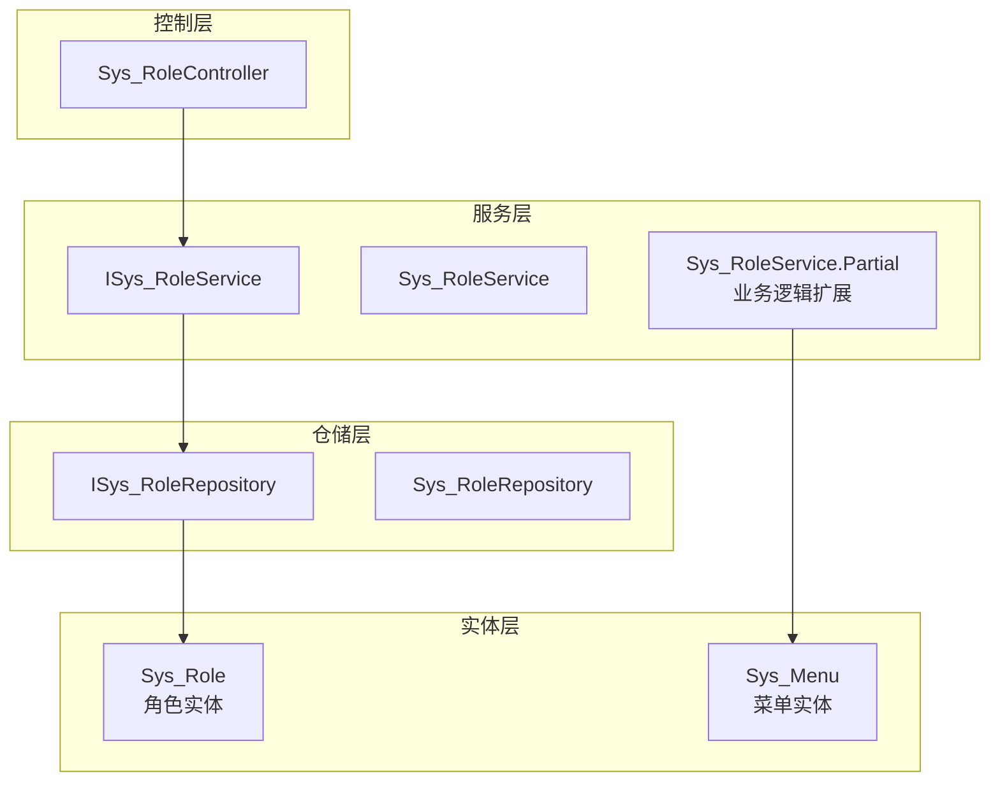
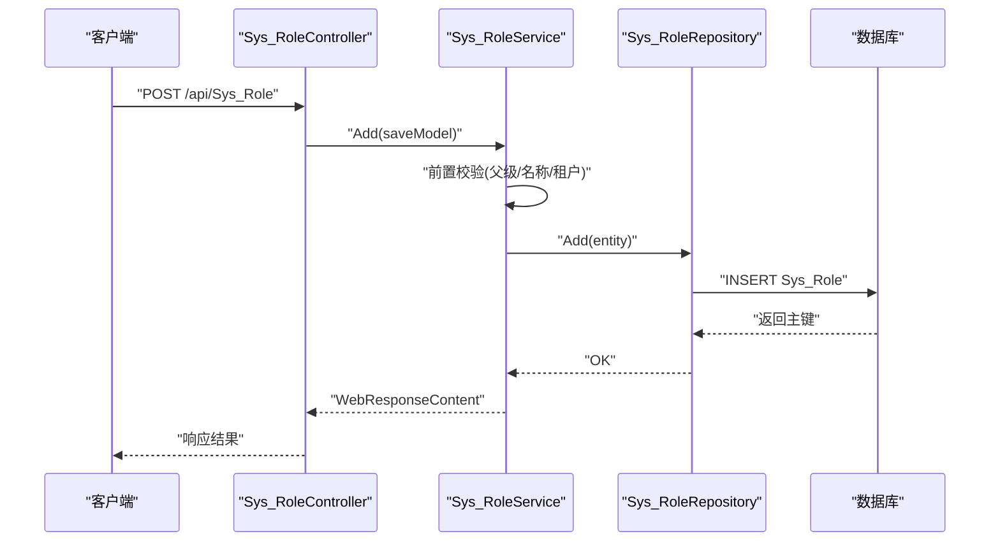
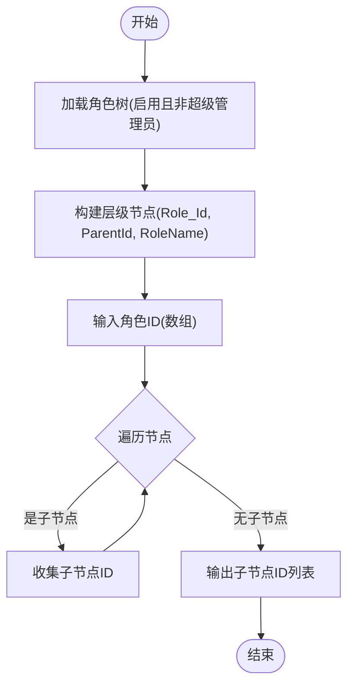
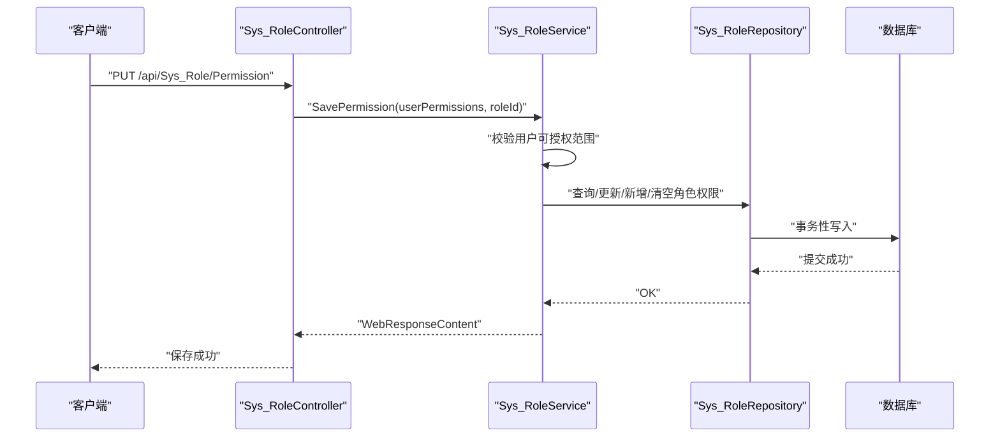
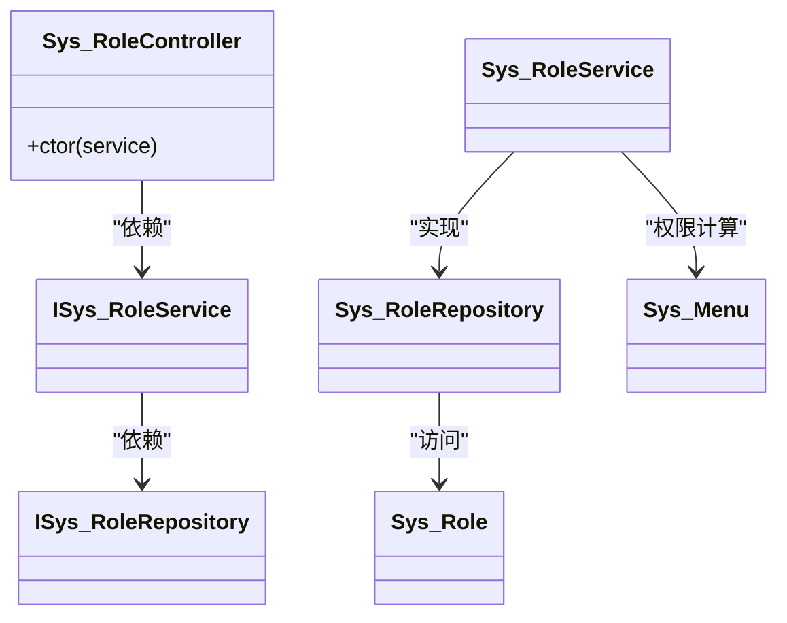

# 角色管理

<cite>
**本文引用的文件**
- [Sys_Role.cs](file://VolPro.Entity/DomainModels/System/Sys_Role.cs)
- [Sys_Menu.cs](file://VolPro.Entity/DomainModels/System/Sys_Menu.cs)
- [ISys_RoleRepository.cs](file://VolPro.Sys/IRepositories/System/ISys_RoleRepository.cs)
- [Sys_RoleRepository.cs](file://VolPro.Sys/Repositories/System/Sys_RoleRepository.cs)
- [ISys_RoleService.cs](file://VolPro.Sys/IServices/System/ISys_RoleService.cs)
- [Sys_RoleService.cs](file://VolPro.Sys/Services/System/Sys_RoleService.cs)
- [Sys_RoleService.Partial.cs](file://VolPro.Sys/Services/System/Partial/Sys_RoleService.cs)
- [Sys_RoleController.cs](file://VolPro.WebApi/Controllers/Sys/Sys_RoleController.cs)
</cite>

## 目录
1. [简介](#简介)
2. [项目结构](#项目结构)
3. [核心组件](#核心组件)
4. [架构总览](#架构总览)
5. [详细组件分析](#详细组件分析)
6. [依赖分析](#依赖分析)
7. [性能考虑](#性能考虑)
8. [故障排查指南](#故障排查指南)
9. [结论](#结论)
10. [附录](#附录)

## 简介
本文件面向角色管理系统的技术文档，围绕 Sys_Role 实体及其服务层展开，系统性说明角色实体设计、角色层级结构与权限继承机制、状态与排序管理、服务层业务逻辑（创建、更新、删除、查询）、最佳实践（命名规范、层级设计、权限分配策略），以及 API 接口说明与使用示例。

## 项目结构
角色管理位于系统模块中，采用分层架构：
- 实体层：Sys_Role 定义角色数据模型
- 仓储层：ISys_RoleRepository / Sys_RoleRepository 提供数据访问
- 服务层：ISys_RoleService / Sys_RoleService 及其 Partial 扩展实现业务逻辑
- 控制层：Sys_RoleController 提供 REST API 入口
- 权限相关：Sys_Menu 与菜单/动作权限体系配合角色进行权限继承与控制

图表来源
- [Sys_Role.cs:18-141](file://VolPro.Entity/DomainModels/System/Sys_Role.cs#L18-L141)
- [Sys_Menu.cs:19-183](file://VolPro.Entity/DomainModels/System/Sys_Menu.cs#L19-L183)
- [ISys_RoleRepository.cs:15-17](file://VolPro.Sys/IRepositories/System/ISys_RoleRepository.cs#L15-L17)
- [Sys_RoleRepository.cs:15-26](file://VolPro.Sys/Repositories/System/Sys_RoleRepository.cs#L15-L26)
- [ISys_RoleService.cs:12-14](file://VolPro.Sys/IServices/System/ISys_RoleService.cs#L12-L14)
- [Sys_RoleService.cs:15-26](file://VolPro.Sys/Services/System/Sys_RoleService.cs#L15-L26)
- [Sys_RoleService.Partial.cs:22-395](file://VolPro.Sys/Services/System/Partial/Sys_RoleService.cs#L22-L395)
- [Sys_RoleController.cs:14-23](file://VolPro.WebApi/Controllers/Sys/Sys_RoleController.cs#L14-L23)

章节来源
- [Sys_Role.cs:18-141](file://VolPro.Entity/DomainModels/System/Sys_Role.cs#L18-L141)
- [Sys_Menu.cs:19-183](file://VolPro.Entity/DomainModels/System/Sys_Menu.cs#L19-L183)
- [ISys_RoleRepository.cs:15-17](file://VolPro.Sys/IRepositories/System/ISys_RoleRepository.cs#L15-L17)
- [Sys_RoleRepository.cs:15-26](file://VolPro.Sys/Repositories/System/Sys_RoleRepository.cs#L15-L26)
- [ISys_RoleService.cs:12-14](file://VolPro.Sys/IServices/System/ISys_RoleService.cs#L12-L14)
- [Sys_RoleService.cs:15-26](file://VolPro.Sys/Services/System/Sys_RoleService.cs#L15-L26)
- [Sys_RoleService.Partial.cs:22-395](file://VolPro.Sys/Services/System/Partial/Sys_RoleService.cs#L22-L395)
- [Sys_RoleController.cs:14-23](file://VolPro.WebApi/Controllers/Sys/Sys_RoleController.cs#L14-L23)

## 核心组件
- Sys_Role 实体：定义角色主键、父子关系、名称、部门关联、启用状态、排序、创建/修改信息、数据库服务标识等字段
- Sys_Menu 实体：定义菜单树形结构、权限与动作集合，用于角色权限继承与控制
- 仓储与服务：基于通用基类，提供分页查询、层级遍历、权限保存等能力
- 控制器：通过权限表注解绑定到 Sys_Role 表，提供标准 CRUD API

章节来源
- [Sys_Role.cs:18-141](file://VolPro.Entity/DomainModels/System/Sys_Role.cs#L18-L141)
- [Sys_Menu.cs:19-183](file://VolPro.Entity/DomainModels/System/Sys_Menu.cs#L19-L183)
- [ISys_RoleRepository.cs:15-17](file://VolPro.Sys/IRepositories/System/ISys_RoleRepository.cs#L15-L17)
- [Sys_RoleRepository.cs:15-26](file://VolPro.Sys/Repositories/System/Sys_RoleRepository.cs#L15-L26)
- [ISys_RoleService.cs:12-14](file://VolPro.Sys/IServices/System/ISys_RoleService.cs#L12-L14)
- [Sys_RoleService.cs:15-26](file://VolPro.Sys/Services/System/Sys_RoleService.cs#L15-L26)
- [Sys_RoleService.Partial.cs:22-395](file://VolPro.Sys/Services/System/Partial/Sys_RoleService.cs#L22-L395)
- [Sys_RoleController.cs:14-23](file://VolPro.WebApi/Controllers/Sys/Sys_RoleController.cs#L14-L23)

## 架构总览
角色管理采用经典的分层架构，控制器负责请求入口与权限标注，服务层封装业务规则（含角色层级与权限继承），仓储层负责数据持久化，实体层承载数据模型。

图表来源
- [Sys_RoleController.cs:18-22](file://VolPro.WebApi/Controllers/Sys/Sys_RoleController.cs#L18-L22)
- [Sys_RoleService.cs:17-25](file://VolPro.Sys/Services/System/Sys_RoleService.cs#L17-L25)
- [Sys_RoleService.Partial.cs:310-325](file://VolPro.Sys/Services/System/Partial/Sys_RoleService.cs#L310-L325)
- [Sys_RoleRepository.cs:17-25](file://VolPro.Sys/Repositories/System/Sys_RoleRepository.cs#L17-L25)

## 详细组件分析

### 实体设计与属性定义（Sys_Role）
- 主键与标识：Role_Id（整型，自增主键）
- 父级关系：ParentId（整型，必填，用于构建角色树）
- 名称：RoleName（字符串，最大长度 50，必填）
- 部门关联：Dept_Id、DeptName（整型可空、字符串可空），支持按部门维度隔离
- 数据库权限：DatAuth（字符串，最大长度 400），用于存储数据权限表达式或标识
- 启用状态：Enable（字节型可空，tinyint 映射），1 表示启用
- 排序：OrderNo（整型可空），用于界面排序
- 创建/修改：Creator、CreateDate、Modifier、ModifyDate（字符串/日期可空）
- 删除标记：DeleteBy（字符串可空，序列化忽略）
- 数据库服务：DbServiceId（GUID 可空），多租户/多数据库隔离标识

章节来源
- [Sys_Role.cs:24-29](file://VolPro.Entity/DomainModels/System/Sys_Role.cs#L24-L29)
- [Sys_Role.cs:34-38](file://VolPro.Entity/DomainModels/System/Sys_Role.cs#L34-L38)
- [Sys_Role.cs:44-47](file://VolPro.Entity/DomainModels/System/Sys_Role.cs#L44-L47)
- [Sys_Role.cs:52-63](file://VolPro.Entity/DomainModels/System/Sys_Role.cs#L52-L63)
- [Sys_Role.cs:69-72](file://VolPro.Entity/DomainModels/System/Sys_Role.cs#L69-L72)
- [Sys_Role.cs:78-80](file://VolPro.Entity/DomainModels/System/Sys_Role.cs#L78-L80)
- [Sys_Role.cs:85-87](file://VolPro.Entity/DomainModels/System/Sys_Role.cs#L85-L87)
- [Sys_Role.cs:94-121](file://VolPro.Entity/DomainModels/System/Sys_Role.cs#L94-L121)
- [Sys_Role.cs:127-138](file://VolPro.Entity/DomainModels/System/Sys_Role.cs#L127-L138)

### 角色层级结构与权限继承
- 层级结构：通过 ParentId 建模父子关系；服务层提供“获取某角色及其所有子角色”的能力，用于权限边界控制与数据范围限制
- 权限继承：服务层在“编辑权限”场景中，会根据当前用户的角色集合计算其可授权的菜单与动作集合，并对被授权角色的菜单权限进行校验与保存
- 超级管理员：Role_Id=1 的角色为超级管理员，不受层级限制；服务层在分页查询与权限保存时对超级管理员做特殊处理

图表来源
- [Sys_RoleService.Partial.cs:160-172](file://VolPro.Sys/Services/System/Partial/Sys_RoleService.cs#L160-L172)
- [Sys_RoleService.Partial.cs:143-159](file://VolPro.Sys/Services/System/Partial/Sys_RoleService.cs#L143-L159)
- [Sys_RoleService.Partial.cs:190-193](file://VolPro.Sys/Services/System/Partial/Sys_RoleService.cs#L190-L193)

章节来源
- [Sys_RoleService.Partial.cs:143-159](file://VolPro.Sys/Services/System/Partial/Sys_RoleService.cs#L143-L159)
- [Sys_RoleService.Partial.cs:160-172](file://VolPro.Sys/Services/System/Partial/Sys_RoleService.cs#L160-L172)
- [Sys_RoleService.Partial.cs:190-193](file://VolPro.Sys/Services/System/Partial/Sys_RoleService.cs#L190-L193)

### 角色状态管理与排序
- 启用/禁用：Enable 字段控制角色启用状态；分页查询与权限树构建时过滤 Enable=1 的角色
- 排序：OrderNo 字段用于界面展示顺序；可通过排序字段调整角色在树中的显示顺序
- 超级管理员：Role_Id=1 固定为超级管理员，ParentId 强制为 0，不可被修改

章节来源
- [Sys_Role.cs:78-80](file://VolPro.Entity/DomainModels/System/Sys_Role.cs#L78-L80)
- [Sys_Role.cs:85-87](file://VolPro.Entity/DomainModels/System/Sys_Role.cs#L85-L87)
- [Sys_RoleService.Partial.cs:354-362](file://VolPro.Sys/Services/System/Partial/Sys_RoleService.cs#L354-L362)

### 服务层业务逻辑
- 分页查询：重写 GetPageData，注入查询表达式，确保普通用户只能看到自身及子角色的数据
- 权限树：GetCurrentUserTreePermission / GetUserTreePermission 返回菜单树与动作集合，受当前用户权限约束
- 权限保存：SavePermission 校验用户可授权范围，批量新增/更新/清空角色菜单权限，并刷新缓存版本
- 新增：Add 前置校验父级角色合法性、租户数据库服务默认值、角色名称唯一性（预留）
- 更新：Update 前置校验父级不能选择自己、不能形成循环依赖、普通用户仅能操作自身及子角色
- 删除：Del 前置校验删除范围仅限自身及子角色

图表来源
- [Sys_RoleService.Partial.cs:202-308](file://VolPro.Sys/Services/System/Partial/Sys_RoleService.cs#L202-L308)
- [Sys_RoleService.Partial.cs:254-285](file://VolPro.Sys/Services/System/Partial/Sys_RoleService.cs#L254-L285)

章节来源
- [Sys_RoleService.Partial.cs:38-52](file://VolPro.Sys/Services/System/Partial/Sys_RoleService.cs#L38-L52)
- [Sys_RoleService.Partial.cs:57-92](file://VolPro.Sys/Services/System/Partial/Sys_RoleService.cs#L57-L92)
- [Sys_RoleService.Partial.cs:202-308](file://VolPro.Sys/Services/System/Partial/Sys_RoleService.cs#L202-L308)
- [Sys_RoleService.Partial.cs:310-325](file://VolPro.Sys/Services/System/Partial/Sys_RoleService.cs#L310-L325)
- [Sys_RoleService.Partial.cs:350-386](file://VolPro.Sys/Services/System/Partial/Sys_RoleService.cs#L350-L386)
- [Sys_RoleService.Partial.cs:327-339](file://VolPro.Sys/Services/System/Partial/Sys_RoleService.cs#L327-L339)

### API 接口说明与使用示例
- 控制器路由：/api/Sys_Role
- 权限表注解：PermissionTable(Name="Sys_Role") 绑定到 Sys_Role 表
- 基础控制器：ApiBaseController<ISys_RoleService> 提供标准 CRUD 能力
- 示例请求（描述性）：
  - 新增角色：POST /api/Sys_Role（Body 包含 RoleName、ParentId、Dept_Id、Enable、OrderNo 等）
  - 更新角色：PUT /api/Sys_Role（Body 包含 Role_Id、RoleName、ParentId 等）
  - 删除角色：DELETE /api/Sys_Role/{ids}
  - 查询分页：GET /api/Sys_Role/page
  - 保存角色权限：PUT /api/Sys_Role/Permission（Body 包含 roleId 与 userPermissions 列表）

章节来源
- [Sys_RoleController.cs:14-23](file://VolPro.WebApi/Controllers/Sys/Sys_RoleController.cs#L14-L23)

## 依赖分析
- 控制器依赖服务接口 ISys_RoleService
- 服务依赖仓储接口 ISys_RoleRepository
- 服务扩展依赖菜单/动作权限上下文（Sys_Menu、Sys_Actions 等）
- 仓储依赖 SysDbContext 进行数据访问

图表来源
- [Sys_RoleController.cs:16-22](file://VolPro.WebApi/Controllers/Sys/Sys_RoleController.cs#L16-L22)
- [ISys_RoleService.cs:12-14](file://VolPro.Sys/IServices/System/ISys_RoleService.cs#L12-L14)
- [Sys_RoleService.cs:15-26](file://VolPro.Sys/Services/System/Sys_RoleService.cs#L15-L26)
- [ISys_RoleRepository.cs:15-17](file://VolPro.Sys/IRepositories/System/ISys_RoleRepository.cs#L15-L17)
- [Sys_RoleRepository.cs:15-26](file://VolPro.Sys/Repositories/System/Sys_RoleRepository.cs#L15-L26)
- [Sys_Role.cs:18-141](file://VolPro.Entity/DomainModels/System/Sys_Role.cs#L18-L141)
- [Sys_Menu.cs:19-183](file://VolPro.Entity/DomainModels/System/Sys_Menu.cs#L19-L183)

章节来源
- [Sys_RoleController.cs:16-22](file://VolPro.WebApi/Controllers/Sys/Sys_RoleController.cs#L16-L22)
- [ISys_RoleService.cs:12-14](file://VolPro.Sys/IServices/System/ISys_RoleService.cs#L12-L14)
- [Sys_RoleService.cs:15-26](file://VolPro.Sys/Services/System/Sys_RoleService.cs#L15-L26)
- [ISys_RoleRepository.cs:15-17](file://VolPro.Sys/IRepositories/System/ISys_RoleRepository.cs#L15-L17)
- [Sys_RoleRepository.cs:15-26](file://VolPro.Sys/Repositories/System/Sys_RoleRepository.cs#L15-L26)
- [Sys_Role.cs:18-141](file://VolPro.Entity/DomainModels/System/Sys_Role.cs#L18-L141)
- [Sys_Menu.cs:19-183](file://VolPro.Entity/DomainModels/System/Sys_Menu.cs#L19-L183)

## 性能考虑
- 分页查询：通过 QueryRelativeExpression 限制可见角色集合，避免全表扫描
- 角色树构建：一次性加载角色列表后在内存中构建树，减少多次数据库往返
- 权限保存：批量更新/新增/清空，减少事务次数；保存后刷新缓存版本键，保证一致性
- 多租户：DbServiceId 支持按数据库服务隔离，避免跨租户数据泄露

## 故障排查指南
- 无法删除角色：检查当前用户是否具备删除目标角色及其子角色的权限
- 无法更新角色：确认父级角色选择合法，避免自引用与循环依赖
- 权限保存失败：核对用户可授权范围与被授权角色的菜单权限是否匹配
- 分页数据异常：确认 Enable 字段与超级管理员角色的过滤逻辑

章节来源
- [Sys_RoleService.Partial.cs:327-339](file://VolPro.Sys/Services/System/Partial/Sys_RoleService.cs#L327-L339)
- [Sys_RoleService.Partial.cs:350-386](file://VolPro.Sys/Services/System/Partial/Sys_RoleService.cs#L350-L386)
- [Sys_RoleService.Partial.cs:202-308](file://VolPro.Sys/Services/System/Partial/Sys_RoleService.cs#L202-L308)
- [Sys_RoleService.Partial.cs:38-52](file://VolPro.Sys/Services/System/Partial/Sys_RoleService.cs#L38-L52)

## 结论
该角色管理体系以 Sys_Role 为核心，结合 Sys_Menu 的菜单/动作权限模型，实现了灵活的角色层级与权限继承。服务层在安全边界、权限校验、批量权限保存等方面提供了完善的业务保障。建议在实际部署中结合多租户与数据权限策略，持续优化角色命名与层级设计，确保权限分配清晰、可审计、易维护。

## 附录
- 最佳实践
  - 命名规范：角色名称应语义明确、避免重复，建议采用“组织/职能/级别”分段命名
  - 层级设计：尽量保持扁平化，避免超过 3-4 层深度；使用 Dept_Id 进行部门级隔离
  - 权限分配：遵循最小权限原则；优先使用菜单级权限而非逐项细粒度授权
  - 审计与变更：启用创建/修改记录字段，定期审计角色与权限变更
- API 使用要点
  - 新增/更新前先调用“获取权限树”接口，确保仅对可授权范围内的菜单进行赋权
  - 删除角色前需清理其关联用户与权限，避免悬挂数据