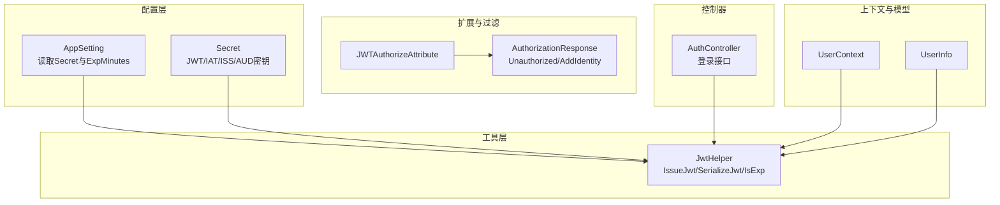
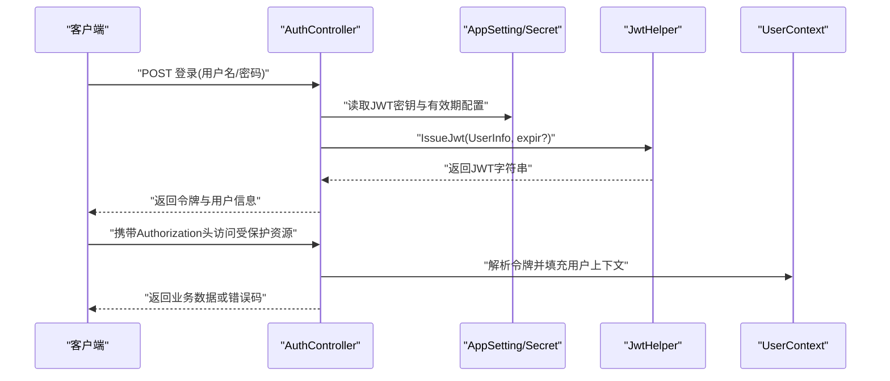
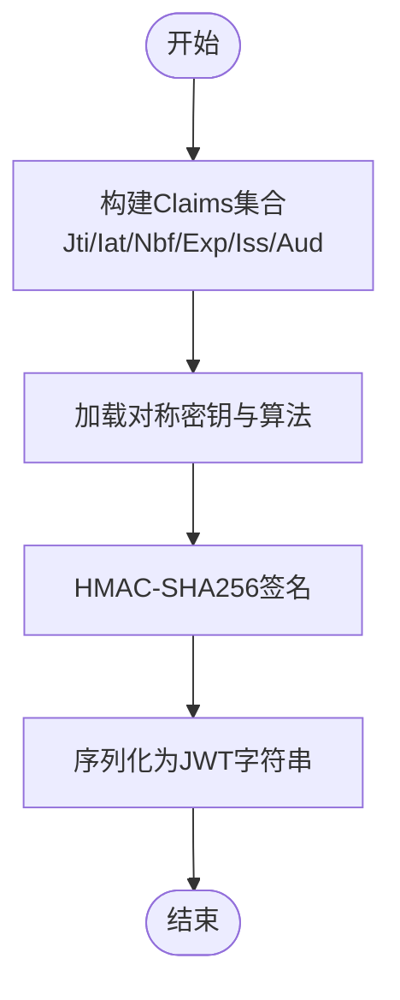
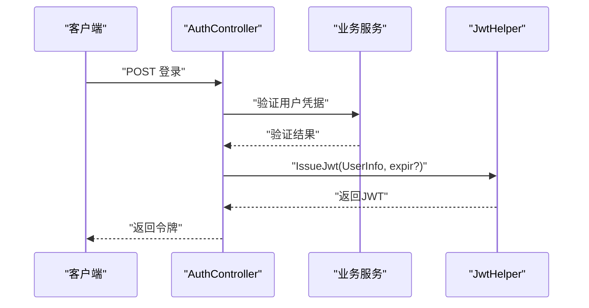
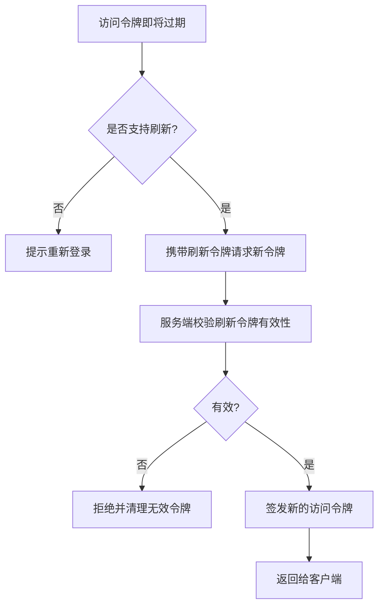
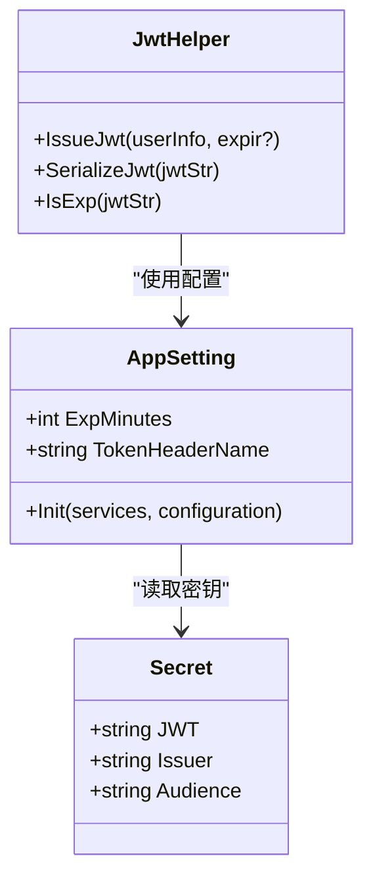
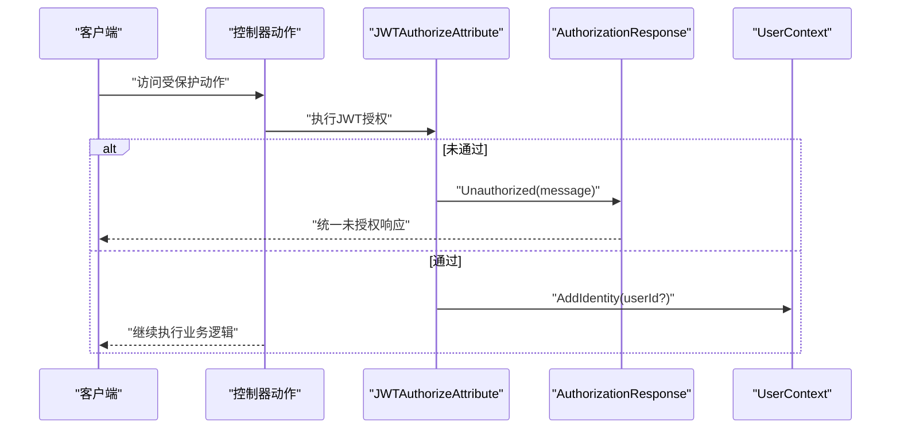
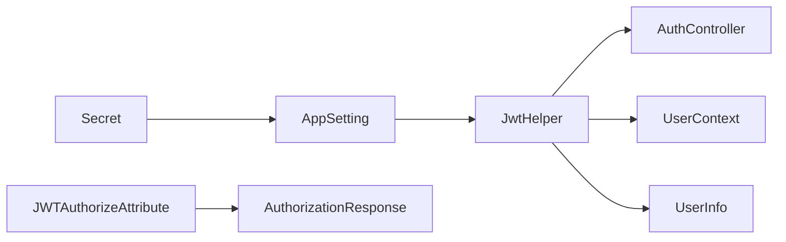

# 身份认证

<cite>
**本文引用的文件**
- [JwtHelper.cs](file://VolPro.Core/Utilities/JwtHelper.cs)
- [AppSetting.cs](file://VolPro.Core/Configuration/AppSetting.cs)
- [Secret.cs](file://VolPro.Core/Const/Secret.cs)
- [JWTAuthorize.cs](file://VolPro.Core/Filters/JWTAuthorize.cs)
- [AuthorizationResponse.cs](file://VolPro.Core/Extensions/AuthorizationResponse.cs)
- [UserContext.cs](file://VolPro.Core/UserManager/UserContext.cs)
- [UserInfo.cs](file://VolPro.Entity/DomainModels/System/UserInfo.cs)
- [AuthController.cs](file://VolPro.WebApi/Controllers/Auth/AuthController.cs)
</cite>

## 目录
1. [简介](#简介)
2. [项目结构](#项目结构)
3. [核心组件](#核心组件)
4. [架构总览](#架构总览)
5. [详细组件分析](#详细组件分析)
6. [依赖关系分析](#依赖关系分析)
7. [性能考虑](#性能考虑)
8. [故障排查指南](#故障排查指南)
9. [结论](#结论)
10. [附录](#附录)

## 简介
本文件面向“身份认证系统”的技术文档，聚焦于基于JWT（JSON Web Token）的认证机制实现，涵盖以下主题：
- JWT令牌生成、签名与解析
- 登录认证流程：从用户凭据校验到令牌发放
- 令牌刷新策略：短期访问令牌与长期刷新令牌的管理思路
- 安全配置：密钥管理、算法选择、令牌有效期设置
- 认证中间件与过滤器的实现要点
- 自定义认证处理器开发指南
- 常见问题排查与性能优化建议

该系统采用对称密钥（HMAC）算法签发JWT，并通过全局配置集中管理密钥与有效期；同时提供统一的认证过滤器与响应封装，便于在控制器层快速集成。

## 项目结构
围绕身份认证的关键模块分布如下：
- 配置层：集中读取密钥、令牌有效期等参数
- 工具层：JWT生成、解析、过期判断
- 过滤器层：认证属性与授权过滤
- 扩展层：统一的授权响应封装
- 上下文层：用户上下文与用户信息模型
- 控制器层：认证入口（登录）接口

图表来源
- [AppSetting.cs:85-163](file://VolPro.Core/Configuration/AppSetting.cs#L85-L163)
- [Secret.cs:6-35](file://VolPro.Core/Const/Secret.cs#L6-L35)
- [JwtHelper.cs:21-47](file://VolPro.Core/Utilities/JwtHelper.cs#L21-L47)
- [JWTAuthorize.cs:8-14](file://VolPro.Core/Filters/JWTAuthorize.cs#L8-L14)
- [AuthorizationResponse.cs:15-42](file://VolPro.Core/Extensions/AuthorizationResponse.cs#L15-L42)
- [UserContext.cs](file://VolPro.Core/UserManager/UserContext.cs)
- [UserInfo.cs](file://VolPro.Entity/DomainModels/System/UserInfo.cs)
- [AuthController.cs](file://VolPro.WebApi/Controllers/Auth/AuthController.cs)

章节来源
- [AppSetting.cs:85-163](file://VolPro.Core/Configuration/AppSetting.cs#L85-L163)
- [JwtHelper.cs:21-47](file://VolPro.Core/Utilities/JwtHelper.cs#L21-L47)
- [JWTAuthorize.cs:8-14](file://VolPro.Core/Filters/JWTAuthorize.cs#L8-L14)
- [AuthorizationResponse.cs:15-42](file://VolPro.Core/Extensions/AuthorizationResponse.cs#L15-L42)
- [UserContext.cs](file://VolPro.Core/UserManager/UserContext.cs)
- [UserInfo.cs](file://VolPro.Entity/DomainModels/System/UserInfo.cs)
- [AuthController.cs](file://VolPro.WebApi/Controllers/Auth/AuthController.cs)

## 核心组件
- JWT助手（JwtHelper）
  - 生成JWT：根据用户信息与有效期配置签发令牌
  - 解析JWT：从令牌中提取用户标识与角色等声明
  - 过期判断：解析Exp并比较当前时间
- 应用配置（AppSetting）
  - 读取Secret与ExpMinutes，决定签发算法、密钥与有效期
- 安全常量（Secret）
  - 统一存放JWT密钥、发行者与受众等
- 认证过滤器（JWTAuthorizeAttribute）
  - 提供基于JWT的授权特性
- 授权响应扩展（AuthorizationResponse）
  - 统一返回未授权结果与将用户身份注入上下文的能力
- 用户上下文（UserContext）
  - 提供当前用户信息的读取与管理
- 用户信息模型（UserInfo）
  - 用于承载令牌中的用户标识与角色等

章节来源
- [JwtHelper.cs:21-94](file://VolPro.Core/Utilities/JwtHelper.cs#L21-L94)
- [AppSetting.cs:40-64](file://VolPro.Core/Configuration/AppSetting.cs#L40-L64)
- [Secret.cs:6-35](file://VolPro.Core/Const/Secret.cs#L6-L35)
- [JWTAuthorize.cs:8-14](file://VolPro.Core/Filters/JWTAuthorize.cs#L8-L14)
- [AuthorizationResponse.cs:15-42](file://VolPro.Core/Extensions/AuthorizationResponse.cs#L15-L42)
- [UserContext.cs](file://VolPro.Core/UserManager/UserContext.cs)
- [UserInfo.cs](file://VolPro.Entity/DomainModels/System/UserInfo.cs)

## 架构总览
下图展示从客户端发起登录请求到服务端签发JWT的整体流程，以及后续请求携带令牌进行鉴权的路径。

图表来源
- [AuthController.cs](file://VolPro.WebApi/Controllers/Auth/AuthController.cs)
- [AppSetting.cs:85-163](file://VolPro.Core/Configuration/AppSetting.cs#L85-L163)
- [Secret.cs:6-35](file://VolPro.Core/Const/Secret.cs#L6-L35)
- [JwtHelper.cs:21-47](file://VolPro.Core/Utilities/JwtHelper.cs#L21-L47)
- [UserContext.cs](file://VolPro.Core/UserManager/UserContext.cs)

## 详细组件分析

### JWT令牌生成与解析（JwtHelper）
- 生成流程
  - 依据用户信息与有效期配置构造Claims集合
  - 使用对称密钥与HMAC-SHA256算法进行签名
  - 输出JWT字符串
- 解析流程
  - 读取JWT并解析Claims
  - 将关键字段映射到UserInfo对象
- 过期判断
  - 读取Exp声明并转换为本地时间
  - 比较当前时间与过期时间，判定是否过期

图表来源
- [JwtHelper.cs:21-47](file://VolPro.Core/Utilities/JwtHelper.cs#L21-L47)

章节来源
- [JwtHelper.cs:21-94](file://VolPro.Core/Utilities/JwtHelper.cs#L21-L94)

### 登录认证流程（AuthController）
- 输入：用户名/密码
- 校验：调用业务层进行凭据验证
- 发放：成功后调用JwtHelper签发JWT
- 返回：令牌与用户信息
- 后续：客户端在请求头中携带Authorization头访问受保护资源

图表来源
- [AuthController.cs](file://VolPro.WebApi/Controllers/Auth/AuthController.cs)
- [JwtHelper.cs:21-47](file://VolPro.Core/Utilities/JwtHelper.cs#L21-L47)

章节来源
- [AuthController.cs](file://VolPro.WebApi/Controllers/Auth/AuthController.cs)
- [JwtHelper.cs:21-47](file://VolPro.Core/Utilities/JwtHelper.cs#L21-L47)

### 令牌刷新策略（短期访问令牌 + 长期刷新令牌）
- 设计思路
  - 短期访问令牌：有效期较短，用于日常业务访问
  - 长期刷新令牌：有效期较长，仅用于换取新的访问令牌
  - 刷新流程：客户端持有刷新令牌，在访问令牌即将过期时向服务端申请新令牌
- 实施要点
  - 在JwtHelper中区分不同场景的有效期（如菜单类型影响有效期）
  - 在AppSetting中集中配置ExpMinutes，支持按环境调整
  - 在控制器中提供刷新接口，接收刷新令牌并签发新的访问令牌
  - 对刷新令牌进行严格校验与撤销控制（例如黑名单或状态检查）

图表来源
- [JwtHelper.cs:23-23](file://VolPro.Core/Utilities/JwtHelper.cs#L23-L23)
- [AppSetting.cs:142-142](file://VolPro.Core/Configuration/AppSetting.cs#L142-L142)

章节来源
- [JwtHelper.cs:21-47](file://VolPro.Core/Utilities/JwtHelper.cs#L21-L47)
- [AppSetting.cs:142-142](file://VolPro.Core/Configuration/AppSetting.cs#L142-L142)

### 安全配置选项（密钥、算法、有效期）
- 密钥管理
  - Secret类集中存储JWT密钥、发行者（Issuer）、受众（Audience）
  - AppSetting.Init负责从配置文件读取并注入到运行时
- 算法选择
  - 使用对称密钥算法（HMAC-SHA256），由JwtHelper显式指定
- 有效期设置
  - ExpMinutes来自配置，作为默认访问令牌有效期
  - 可按菜单类型等场景动态调整（例如长时效场景）

图表来源
- [Secret.cs:6-35](file://VolPro.Core/Const/Secret.cs#L6-L35)
- [AppSetting.cs:85-163](file://VolPro.Core/Configuration/AppSetting.cs#L85-L163)
- [JwtHelper.cs:21-47](file://VolPro.Core/Utilities/JwtHelper.cs#L21-L47)

章节来源
- [Secret.cs:6-35](file://VolPro.Core/Const/Secret.cs#L6-L35)
- [AppSetting.cs:85-163](file://VolPro.Core/Configuration/AppSetting.cs#L85-L163)
- [JwtHelper.cs:21-47](file://VolPro.Core/Utilities/JwtHelper.cs#L21-L47)

### 认证中间件与过滤器（JWTAuthorizeAttribute 与 AuthorizationResponse）
- JWTAuthorizeAttribute
  - 提供基于JWT的授权特性，可直接用于控制器或动作
- AuthorizationResponse
  - 统一未授权响应格式
  - 支持将用户身份注入HttpContext，便于后续中间件或服务读取

图表来源
- [JWTAuthorize.cs:8-14](file://VolPro.Core/Filters/JWTAuthorize.cs#L8-L14)
- [AuthorizationResponse.cs:15-42](file://VolPro.Core/Extensions/AuthorizationResponse.cs#L15-L42)
- [UserContext.cs](file://VolPro.Core/UserManager/UserContext.cs)

章节来源
- [JWTAuthorize.cs:8-14](file://VolPro.Core/Filters/JWTAuthorize.cs#L8-L14)
- [AuthorizationResponse.cs:15-42](file://VolPro.Core/Extensions/AuthorizationResponse.cs#L15-L42)
- [UserContext.cs](file://VolPro.Core/UserManager/UserContext.cs)

### 自定义认证处理器开发指南
- 处理器职责
  - 解析请求头中的Authorization值
  - 调用JwtHelper解析并校验令牌
  - 将用户标识写入HttpContext以便后续中间件使用
- 关键步骤
  - 读取配置中的TokenHeaderName
  - 调用JwtHelper.GetUserId或SerializeJwt
  - 通过AuthorizationResponse.AddIdentity将身份注入上下文
- 注意事项
  - 对异常令牌进行捕获并返回标准化错误
  - 结合UserContext统一管理用户上下文生命周期

章节来源
- [AuthorizationResponse.cs:34-41](file://VolPro.Core/Extensions/AuthorizationResponse.cs#L34-L41)
- [JwtHelper.cs:84-94](file://VolPro.Core/Utilities/JwtHelper.cs#L84-L94)
- [AppSetting.cs:48-48](file://VolPro.Core/Configuration/AppSetting.cs#L48-L48)

## 依赖关系分析
- JwtHelper依赖AppSetting与Secret进行密钥与有效期配置
- 控制器依赖JwtHelper完成令牌签发
- 过滤器与扩展依赖JwtHelper与UserContext进行授权与上下文注入
- UserInfo作为令牌载荷的载体，贯穿解析与上下文使用

图表来源
- [Secret.cs:6-35](file://VolPro.Core/Const/Secret.cs#L6-L35)
- [AppSetting.cs:85-163](file://VolPro.Core/Configuration/AppSetting.cs#L85-L163)
- [JwtHelper.cs:21-94](file://VolPro.Core/Utilities/JwtHelper.cs#L21-L94)
- [AuthController.cs](file://VolPro.WebApi/Controllers/Auth/AuthController.cs)
- [JWTAuthorize.cs:8-14](file://VolPro.Core/Filters/JWTAuthorize.cs#L8-L14)
- [AuthorizationResponse.cs:15-42](file://VolPro.Core/Extensions/AuthorizationResponse.cs#L15-L42)
- [UserContext.cs](file://VolPro.Core/UserManager/UserContext.cs)
- [UserInfo.cs](file://VolPro.Entity/DomainModels/System/UserInfo.cs)

章节来源
- [JwtHelper.cs:21-94](file://VolPro.Core/Utilities/JwtHelper.cs#L21-L94)
- [AppSetting.cs:85-163](file://VolPro.Core/Configuration/AppSetting.cs#L85-L163)
- [Secret.cs:6-35](file://VolPro.Core/Const/Secret.cs#L6-L35)
- [JWTAuthorize.cs:8-14](file://VolPro.Core/Filters/JWTAuthorize.cs#L8-L14)
- [AuthorizationResponse.cs:15-42](file://VolPro.Core/Extensions/AuthorizationResponse.cs#L15-L42)
- [UserContext.cs](file://VolPro.Core/UserManager/UserContext.cs)
- [UserInfo.cs](file://VolPro.Entity/DomainModels/System/UserInfo.cs)
- [AuthController.cs](file://VolPro.WebApi/Controllers/Auth/AuthController.cs)

## 性能考虑
- 令牌体积与声明数量
  - 减少不必要的Claims，避免令牌过大导致网络传输与解析开销增加
- 密钥与算法
  - 使用对称密钥（HMAC）提升签名/验签性能；若并发高且跨服务部署，可评估引入对称密钥轮换与分布式缓存
- 有效期策略
  - 合理设置ExpMinutes，平衡安全性与刷新频率
- 缓存与上下文
  - 将用户标识注入HttpContext，减少重复解析令牌的次数
- 网络与存储
  - 若引入刷新令牌，建议使用高性能缓存存储（如Redis）并配合原子操作与过期策略

## 故障排查指南
- 常见问题
  - 令牌无效或签名失败：检查Secret配置与JWT密钥一致性
  - 令牌过早过期：核对ExpMinutes与菜单类型对有效期的影响
  - 请求未携带Authorization头：确认前端正确传递TokenHeaderName
  - 未授权访问：检查JWTAuthorizeAttribute是否正确应用，以及AuthorizationResponse是否返回了标准未授权响应
- 排查步骤
  - 在JwtHelper中打印或记录关键参数（密钥、算法、Claims、Exp）
  - 使用AuthorizationResponse.Unauthorized输出统一错误信息
  - 在UserContext中验证是否成功注入用户身份
- 建议
  - 在中间件层增加日志记录，定位令牌解析失败的具体环节
  - 对异常令牌进行捕获并返回明确的错误码与消息

章节来源
- [JwtHelper.cs:54-94](file://VolPro.Core/Utilities/JwtHelper.cs#L54-L94)
- [AuthorizationResponse.cs:29-32](file://VolPro.Core/Extensions/AuthorizationResponse.cs#L29-L32)
- [AppSetting.cs:142-142](file://VolPro.Core/Configuration/AppSetting.cs#L142-L142)

## 结论
本系统通过集中配置与工具化封装，实现了简洁高效的JWT认证能力。JwtHelper承担令牌生成与解析的核心职责，AppSetting与Secret提供安全配置支撑，JWTAuthorizeAttribute与AuthorizationResponse确保授权与响应的一致性。结合短期访问令牌与长期刷新令牌策略，可在保证安全性的前提下优化用户体验。建议在生产环境中进一步完善令牌撤销、密钥轮换与分布式缓存等机制，持续提升系统的安全性与可维护性。

## 附录
- 关键配置项
  - Secret.JWT：JWT对称密钥
  - Secret.Issuer/Audience：发行者与受众
  - AppSetting.ExpMinutes：默认访问令牌有效期（分钟）
  - AppSetting.TokenHeaderName：令牌请求头名称
- 常用方法参考路径
  - 生成JWT：[JwtHelper.cs:21-47](file://VolPro.Core/Utilities/JwtHelper.cs#L21-L47)
  - 解析JWT：[JwtHelper.cs:54-65](file://VolPro.Core/Utilities/JwtHelper.cs#L54-L65)
  - 过期判断：[JwtHelper.cs:79-82](file://VolPro.Core/Utilities/JwtHelper.cs#L79-L82)
  - 未授权响应：[AuthorizationResponse.cs:29-32](file://VolPro.Core/Extensions/AuthorizationResponse.cs#L29-L32)
  - 注入身份：[AuthorizationResponse.cs:34-41](file://VolPro.Core/Extensions/AuthorizationResponse.cs#L34-L41)