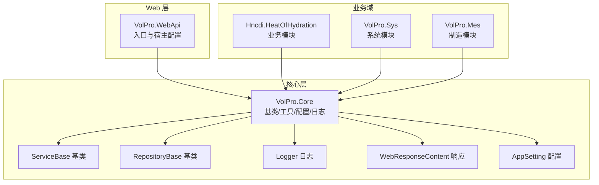
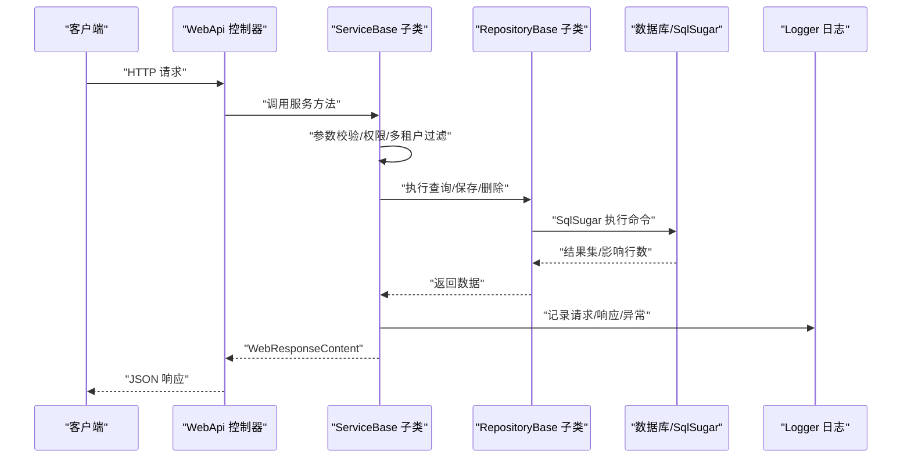
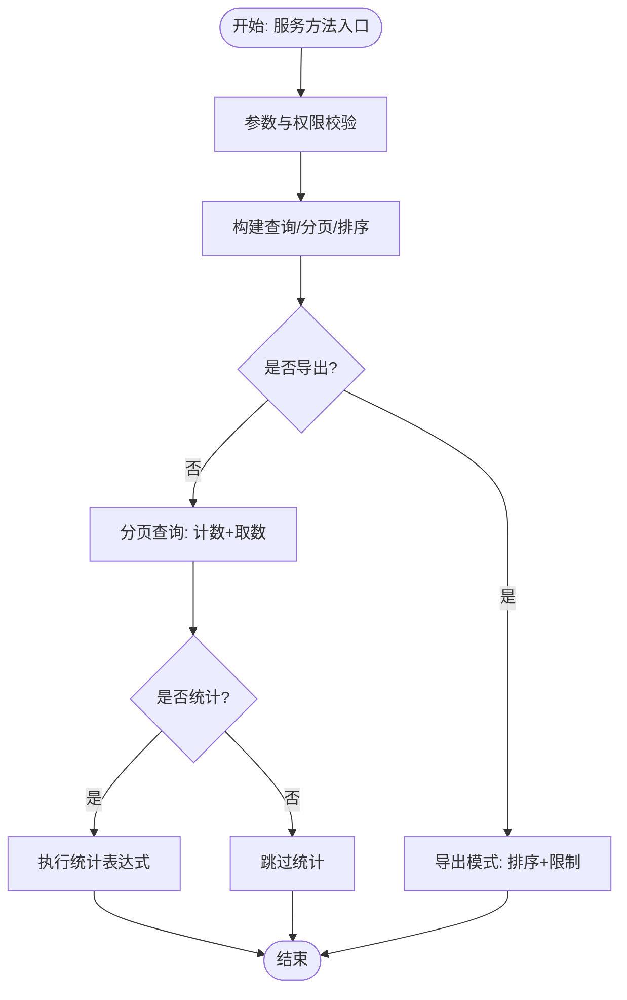
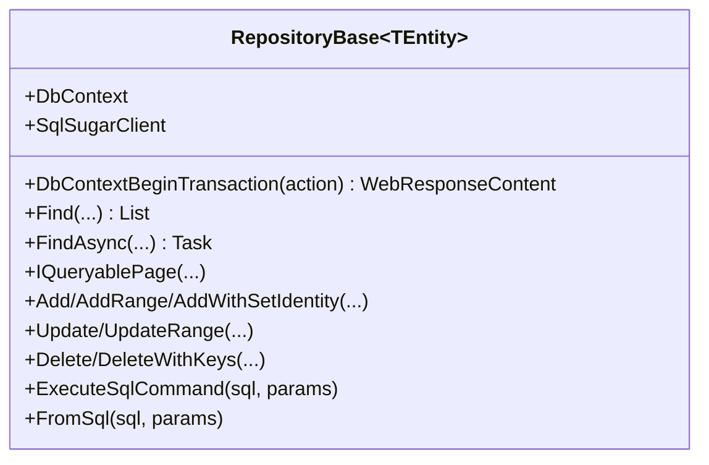
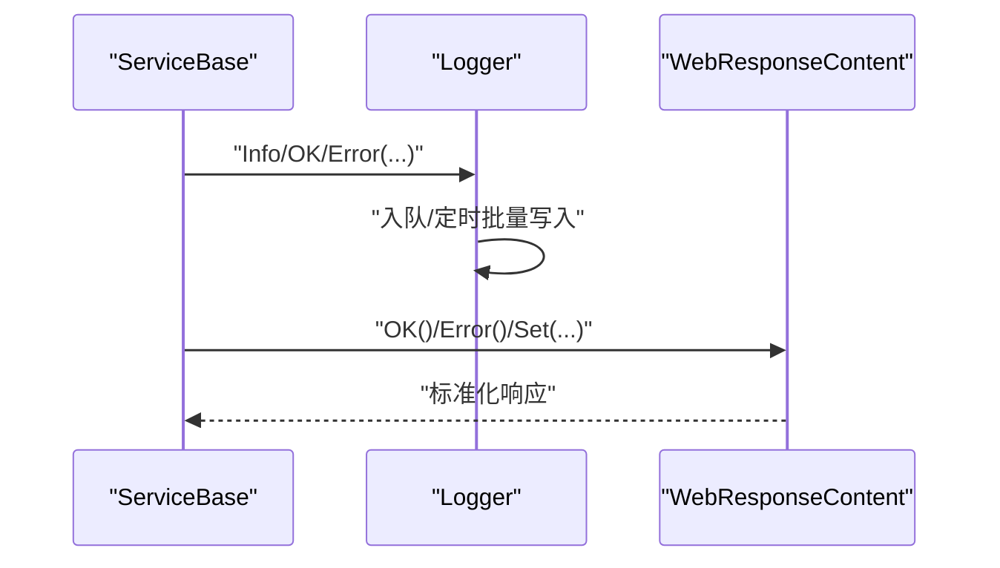
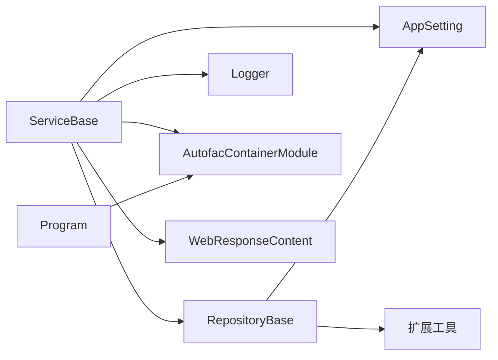

# 代码规范与最佳实践

<cite>
**本文引用的文件**
- [.editorconfig](file://.editorconfig)
- [ServiceBase.cs](file://VolPro.Core/BaseProvider/ServiceBase.cs)
- [RepositoryBase.cs](file://VolPro.Core/BaseProvider/RepositoryBase.cs)
- [AutofacContainerModule.cs](file://VolPro.Core/Extensions/AutofacManager/AutofacContainerModule.cs)
- [Logger.cs](file://VolPro.Core/Services/Logger.cs)
- [WebResponseContent.cs](file://VolPro.Core/Utilities/Response/WebResponseContent.cs)
- [AppSetting.cs](file://VolPro.Core/Configuration/AppSetting.cs)
- [Program.cs](file://VolPro.WebApi/Program.cs)
</cite>

## 目录
1. [引言](#引言)
2. [项目结构](#项目结构)
3. [核心组件](#核心组件)
4. [架构总览](#架构总览)
5. [详细组件分析](#详细组件分析)
6. [依赖关系分析](#依赖关系分析)
7. [性能考虑](#性能考虑)
8. [故障排查指南](#故障排查指南)
9. [结论](#结论)
10. [附录](#附录)

## 引言
本文件面向“水化热平台”项目的C#开发团队，系统性梳理并制定统一的代码规范与最佳实践。内容涵盖命名约定、代码格式化、注释标准、ServiceBase与RepositoryBase等核心基类的最佳实践、异常处理与日志记录、性能优化建议、以及代码审查检查清单与质量保障措施。本文以仓库中的实际实现为依据，确保规范可落地、可执行。

## 项目结构
项目采用多项目分层组织，核心能力集中在 VolPro.Core，业务域模块按功能划分（如 Hncdi.HeatOfHydration、VolPro.Sys、VolPro.Mes 等），Web 层位于 VolPro.WebApi。.editorconfig 提供统一的代码风格约束，VolPro.Core 的 BaseProvider 提供通用的仓储与服务基类，日志与响应体封装在 Core 中，便于跨模块复用。

图表来源
- [Program.cs:1-39](file://VolPro.WebApi/Program.cs#L1-L39)
- [ServiceBase.cs:1-200](file://VolPro.Core/BaseProvider/ServiceBase.cs#L1-L200)
- [RepositoryBase.cs:1-120](file://VolPro.Core/BaseProvider/RepositoryBase.cs#L1-L120)
- [Logger.cs:1-120](file://VolPro.Core/Services/Logger.cs#L1-L120)
- [WebResponseContent.cs:1-108](file://VolPro.Core/Utilities/Response/WebResponseContent.cs#L1-L108)
- [AppSetting.cs:1-120](file://VolPro.Core/Configuration/AppSetting.cs#L1-L120)

章节来源
- [Program.cs:1-39](file://VolPro.WebApi/Program.cs#L1-L39)

## 核心组件
- ServiceBase：抽象服务基类，封装分页查询、导入导出、上传下载、主从明细保存、事务封装、权限与多租户过滤、雪花ID生成等通用能力。
- RepositoryBase：抽象仓储基类，封装查询、分页、插入/更新/删除、事务、拆表支持、SQL执行等通用能力。
- Logger：统一异步日志队列写入，支持多数据库类型批量写入与文本兜底。
- WebResponseContent：统一响应体封装，标准化状态、消息与数据结构。
- AppSetting：集中配置读取与初始化，含连接串、雪花算法开关、权限字段等。

章节来源
- [ServiceBase.cs:1-200](file://VolPro.Core/BaseProvider/ServiceBase.cs#L1-L200)
- [RepositoryBase.cs:1-120](file://VolPro.Core/BaseProvider/RepositoryBase.cs#L1-L120)
- [Logger.cs:1-120](file://VolPro.Core/Services/Logger.cs#L1-L120)
- [WebResponseContent.cs:1-108](file://VolPro.Core/Utilities/Response/WebResponseContent.cs#L1-L108)
- [AppSetting.cs:1-120](file://VolPro.Core/Configuration/AppSetting.cs#L1-L120)

## 架构总览
下图展示 Web 请求经由控制器进入服务层，服务层通过仓储层访问数据库，并在过程中进行权限与多租户过滤、事务控制、日志记录与响应封装。

图表来源
- [ServiceBase.cs:280-340](file://VolPro.Core/BaseProvider/ServiceBase.cs#L280-L340)
- [RepositoryBase.cs:67-96](file://VolPro.Core/BaseProvider/RepositoryBase.cs#L67-L96)
- [Logger.cs:120-170](file://VolPro.Core/Services/Logger.cs#L120-L170)
- [WebResponseContent.cs:22-70](file://VolPro.Core/Utilities/Response/WebResponseContent.cs#L22-L70)

## 详细组件分析

### ServiceBase 最佳实践
- 统一分页与排序
  - 使用 ValidatePageOptions 与 GetPageDataSort 完成分页、排序与查询条件合法性校验，避免 SQL 注入与无效字段。
  - 支持导出场景下的排序与限制行数，避免超大数据量导出。
- 权限与多租户
  - 通过 GetSearchQueryable 与 TenancyManager 实现多租户过滤；结合角色权限字段过滤，仅返回允许查看的列。
- 主从明细与事务
  - Add/Update 支持主从明细保存；DbContextBeginTransaction 提供统一事务入口，异常自动回滚。
- 导入/导出/上传
  - 导入：EPPlusHelper 读取 Excel 并映射实体，支持忽略列与自定义读取回调；导入后统一设置默认值、雪花ID、多租户值与创建码。
  - 导出：根据列配置与权限字段动态生成导出列，支持回调调整忽略列。
  - 上传：统一目录结构与异常捕获，记录错误日志并返回统一响应。
- 性能与健壮性
  - 使用缓存上下文与依赖注入获取服务；对大列表操作采用批量写入与异步日志队列。

图表来源
- [ServiceBase.cs:285-340](file://VolPro.Core/BaseProvider/ServiceBase.cs#L285-L340)
- [ServiceBase.cs:612-652](file://VolPro.Core/BaseProvider/ServiceBase.cs#L612-L652)

章节来源
- [ServiceBase.cs:206-340](file://VolPro.Core/BaseProvider/ServiceBase.cs#L206-L340)
- [ServiceBase.cs:514-605](file://VolPro.Core/BaseProvider/ServiceBase.cs#L514-L605)
- [ServiceBase.cs:612-652](file://VolPro.Core/BaseProvider/ServiceBase.cs#L612-L652)

### RepositoryBase 最佳实践
- 事务封装
  - DbContextBeginTransaction 统一封装事务提交/回滚与异常处理，开发侧只需关注业务逻辑。
- 查询与分页
  - Find/FindAsync 提供多种谓词与选择器组合；IQueryablePage 支持字典排序与行数统计。
- 插入/更新/删除
  - Add/AddRange/AddWithSetIdentity 支持雪花ID与拆表；Update/UpdateRange 支持指定字段更新；Delete/DeleteWithKeys 支持拆表删除。
- SQL 执行
  - ExecuteSqlCommand/FromSql 提供原生 SQL 能力，注意参数化与注入风险。

图表来源
- [RepositoryBase.cs:67-96](file://VolPro.Core/BaseProvider/RepositoryBase.cs#L67-L96)
- [RepositoryBase.cs:153-202](file://VolPro.Core/BaseProvider/RepositoryBase.cs#L153-L202)
- [RepositoryBase.cs:250-283](file://VolPro.Core/BaseProvider/RepositoryBase.cs#L250-L283)
- [RepositoryBase.cs:546-597](file://VolPro.Core/BaseProvider/RepositoryBase.cs#L546-L597)
- [RepositoryBase.cs:609-618](file://VolPro.Core/BaseProvider/RepositoryBase.cs#L609-L618)

章节来源
- [RepositoryBase.cs:67-96](file://VolPro.Core/BaseProvider/RepositoryBase.cs#L67-L96)
- [RepositoryBase.cs:250-283](file://VolPro.Core/BaseProvider/RepositoryBase.cs#L250-L283)
- [RepositoryBase.cs:546-597](file://VolPro.Core/BaseProvider/RepositoryBase.cs#L546-L597)

### 日志与响应规范
- 日志
  - Logger 采用异步队列+定时批量写入，支持多数据库类型（含 PgSql/Kdbndp/DM）；异常时写本地文件兜底。
  - 建议在服务层关键流程调用 Logger.Info/OK/Error 记录请求参数、响应参数与异常信息。
- 响应
  - WebResponseContent 统一 Status/Code/Message/Data 结构，提供 OK/Error/Set 系列便捷方法，减少重复样板代码。

图表来源
- [Logger.cs:120-170](file://VolPro.Core/Services/Logger.cs#L120-L170)
- [WebResponseContent.cs:22-104](file://VolPro.Core/Utilities/Response/WebResponseContent.cs#L22-L104)

章节来源
- [Logger.cs:1-120](file://VolPro.Core/Services/Logger.cs#L1-L120)
- [WebResponseContent.cs:1-108](file://VolPro.Core/Utilities/Response/WebResponseContent.cs#L1-L108)

### 配置与依赖注入
- AppSetting
  - 初始化 IConfiguration 并注入 Secret/Connection/CreateMember/ModifyMember/GlobalFilter/Kafka 等配置项；提供 UseSnow、UserAuth、FileAuth 等全局开关。
- 依赖注入
  - 通过 AutofacContainerModule.GetService 获取服务实例，确保跨模块解耦与可测试性。

章节来源
- [AppSetting.cs:85-174](file://VolPro.Core/Configuration/AppSetting.cs#L85-L174)
- [AutofacContainerModule.cs:1-15](file://VolPro.Core/Extensions/AutofacManager/AutofacContainerModule.cs#L1-L15)

## 依赖关系分析
- ServiceBase 依赖 RepositoryBase、AppSetting、Logger、AutofacContainerModule、WebResponseContent 等。
- RepositoryBase 依赖 BaseDbContext/SqlSugarClient、AppSetting、扩展工具等。
- WebApi 通过 Program 启动并注册 Autofac 作为 ServiceProviderFactory。

图表来源
- [ServiceBase.cs:1-40](file://VolPro.Core/BaseProvider/ServiceBase.cs#L1-L40)
- [RepositoryBase.cs:1-40](file://VolPro.Core/BaseProvider/RepositoryBase.cs#L1-L40)
- [Program.cs:36-36](file://VolPro.WebApi/Program.cs#L36-L36)

章节来源
- [ServiceBase.cs:1-40](file://VolPro.Core/BaseProvider/ServiceBase.cs#L1-L40)
- [RepositoryBase.cs:1-40](file://VolPro.Core/BaseProvider/RepositoryBase.cs#L1-L40)
- [Program.cs:36-36](file://VolPro.WebApi/Program.cs#L36-L36)

## 性能考虑
- 数据访问
  - 使用分页与排序字典，避免一次性加载全量数据；导出场景限制行数。
  - 利用 SqlSugar 的批量插入/更新与拆表能力，减少往返次数。
- 日志
  - 异步队列+定时批量写入，降低 IO 压力；异常时写本地文件兜底。
- 缓存与雪花ID
  - AppSetting.UseSnow 开启时，长整型主键采用雪花ID生成，避免并发冲突。
- 事务
  - 将多个写操作包裹在 DbContextBeginTransaction 中，减少锁竞争与回滚成本。

章节来源
- [ServiceBase.cs:305-335](file://VolPro.Core/BaseProvider/ServiceBase.cs#L305-L335)
- [RepositoryBase.cs:67-96](file://VolPro.Core/BaseProvider/RepositoryBase.cs#L67-L96)
- [Logger.cs:172-207](file://VolPro.Core/Services/Logger.cs#L172-L207)
- [AppSetting.cs:77-78](file://VolPro.Core/Configuration/AppSetting.cs#L77-L78)

## 故障排查指南
- 异常处理
  - RepositoryBase 事务异常统一回滚并返回错误消息；开发环境输出完整异常堆栈，生产环境屏蔽敏感信息。
- 日志定位
  - 在关键路径调用 Logger.Info/OK/Error 记录请求参数、响应参数与异常；若批量写入失败，检查本地日志文件。
- 响应一致性
  - 统一使用 WebResponseContent 返回，避免遗漏状态或消息字段。

章节来源
- [RepositoryBase.cs:86-95](file://VolPro.Core/BaseProvider/RepositoryBase.cs#L86-L95)
- [Logger.cs:199-206](file://VolPro.Core/Services/Logger.cs#L199-L206)
- [WebResponseContent.cs:61-104](file://VolPro.Core/Utilities/Response/WebResponseContent.cs#L61-L104)

## 结论
本文基于仓库现有实现，总结了水化热平台的 C# 代码规范与最佳实践，重点覆盖命名与结构、基类使用、异常与日志、性能优化与质量保障。建议在后续迭代中持续完善单元测试与集成测试，强化代码审查检查清单，确保规范落地与质量稳定。

## 附录

### C# 编码规范与注释标准
- 命名约定
  - 类/接口：帕斯卡命名（如 ServiceBase、RepositoryBase）
  - 方法/属性：帕斯卡命名（如 GetPageData、DbContextBeginTransaction）
  - 字段：私有字段使用驼峰命名（如 _propertyInfo），公共属性使用帕斯卡命名
  - 常量：全大写下划线（如 ParameterError）
- 代码格式化
  - 使用 .editorconfig 统一风格；当前配置抑制特定空引用警告，其余风格遵循项目默认。
- 注释标准
  - 公共 API 与复杂逻辑需提供 XML 注释，说明参数、返回值与异常情况。
  - 关键流程与边界条件补充行内注释，解释设计意图与潜在风险。

章节来源
- [.editorconfig:1-5](file://.editorconfig#L1-L5)
- [ServiceBase.cs:88-107](file://VolPro.Core/BaseProvider/ServiceBase.cs#L88-L107)
- [RepositoryBase.cs:62-101](file://VolPro.Core/BaseProvider/RepositoryBase.cs#L62-L101)

### 代码审查检查清单
- 规范性
  - 是否遵循命名与注释规范；是否存在魔法字符串；是否使用常量替代。
- 安全性
  - 是否存在 SQL 注入风险；是否对输入参数进行校验与过滤；是否正确使用参数化查询。
- 可靠性
  - 是否使用统一响应体；异常是否被捕获并记录；事务是否正确提交/回滚。
- 性能
  - 是否使用分页与排序字典；是否存在 N+1 查询；是否合理使用缓存与批量写入。
- 可维护性
  - 是否复用基类能力；是否存在重复代码；是否具备单元测试覆盖。

### 基于.editorconfig 的风格要求
- 当前配置仅抑制特定空引用诊断，其余风格以项目默认为准。建议在团队内统一格式化设置，保持一致性。

章节来源
- [.editorconfig:1-5](file://.editorconfig#L1-L5)