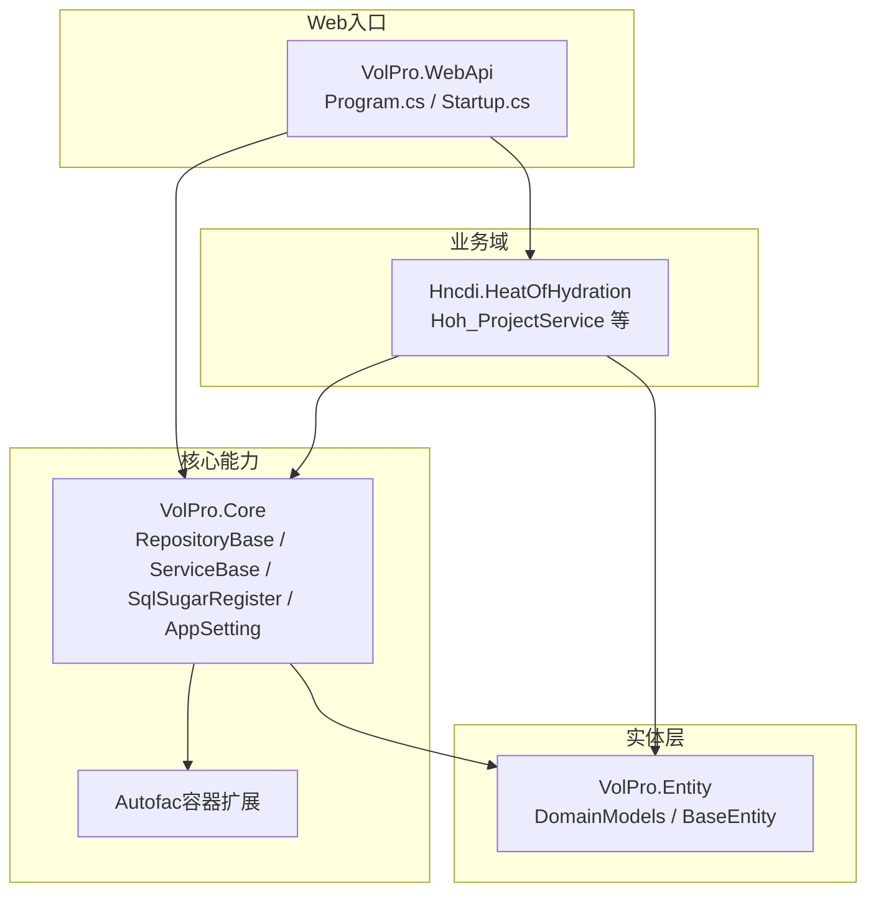
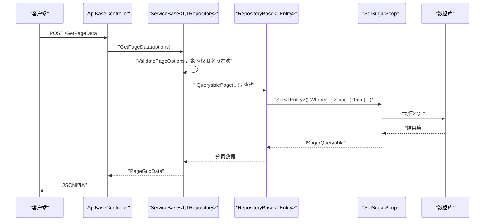
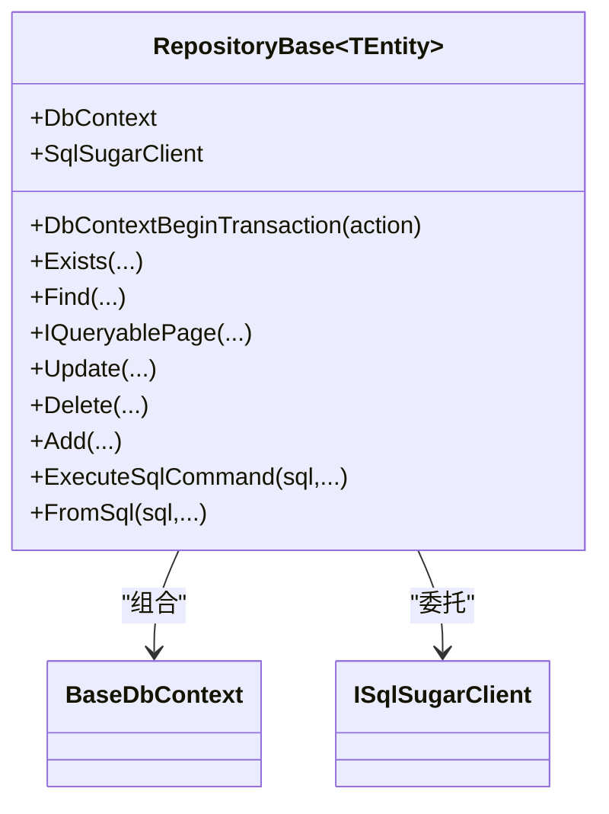
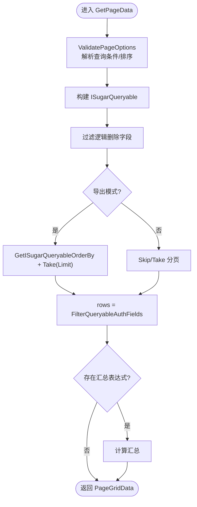
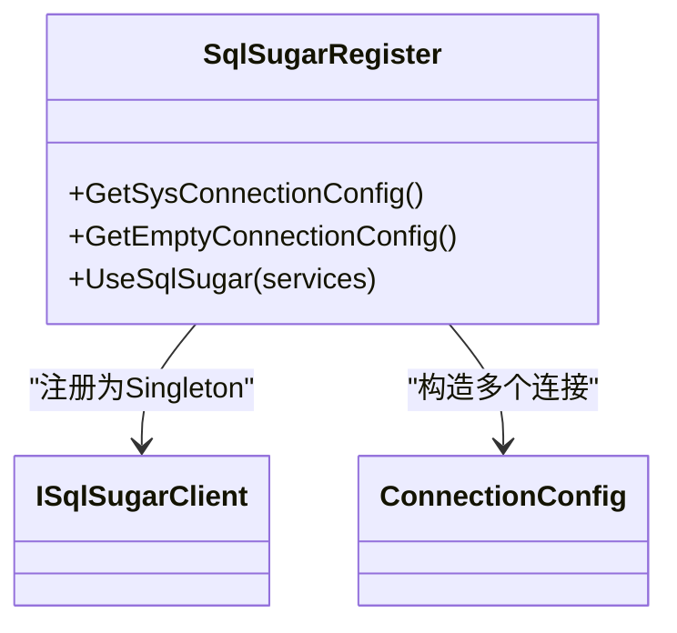
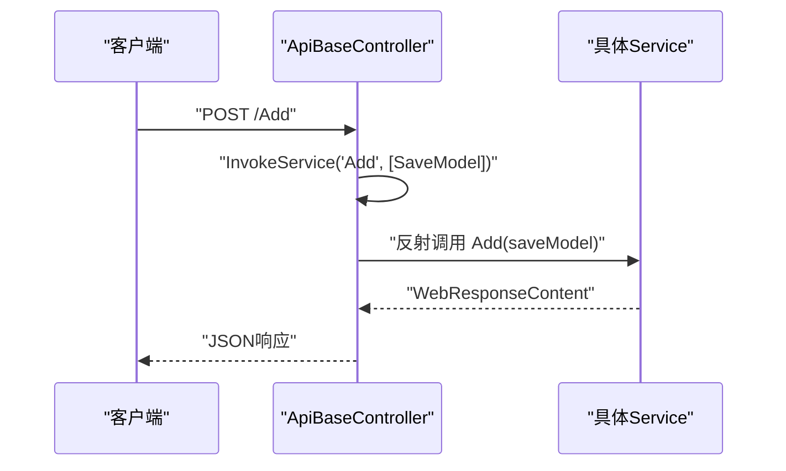
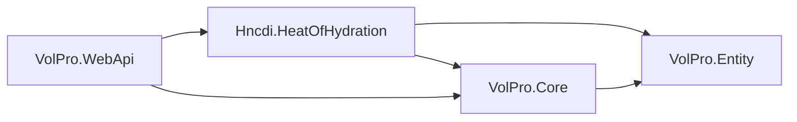

# 开发指南

<cite>
**本文引用的文件**
- [VolPro.Core.csproj](file://VolPro.Core/VolPro.Core.csproj)
- [Hncdi.HeatOfHydration.csproj](file://Hncdi.HeatOfHydration/Hncdi.HeatOfHydration.csproj)
- [Program.cs](file://VolPro.WebApi/Program.cs)
- [Startup.cs](file://VolPro.WebApi/Startup.cs)
- [.editorconfig](file://.editorconfig)
- [RepositoryBase.cs](file://VolPro.Core/BaseProvider/RepositoryBase.cs)
- [ServiceBase.cs](file://VolPro.Core/BaseProvider/ServiceBase.cs)
- [SqlSugarRegister.cs](file://VolPro.Core/DbSqlSugar/SqlSugarRegister.cs)
- [ApiBaseController.cs](file://VolPro.Core/Controllers/Basic/ApiBaseController.cs)
- [AutofacContainerModule.cs](file://VolPro.Core/Extensions/AutofacManager/AutofacContainerModule.cs)
- [AppSetting.cs](file://VolPro.Core/Configuration/AppSetting.cs)
- [Hoh_ProjectService.cs](file://Hncdi.HeatOfHydration/Services/Hoh/Hoh_ProjectService.cs)
- [appsettings.json](file://VolPro.WebApi/appsettings.json)
- [launchSettings.json](file://VolPro.WebApi/Properties/launchSettings.json)
</cite>

## 目录
1. [简介](#简介)
2. [项目结构](#项目结构)
3. [核心组件](#核心组件)
4. [架构总览](#架构总览)
5. [详细组件分析](#详细组件分析)
6. [依赖关系分析](#依赖关系分析)
7. [性能考量](#性能考量)
8. [故障排查指南](#故障排查指南)
9. [结论](#结论)
10. [附录](#附录)

## 简介
本开发指南面向“水化热平台”项目，聚焦于C#编码规范、命名约定、注释标准、设计模式应用、开发工具与IDE配置、单元测试与集成测试、插件与扩展开发、以及代码审查与质量保障流程。文档以仓库现有代码为基础，结合项目工程结构与关键实现文件，给出可落地的最佳实践与实施建议。

## 项目结构
项目采用多项目解决方案，围绕“核心能力库 + 业务域模块 + Web入口 + 实体层”的分层组织方式：
- 核心能力库（VolPro.Core）：提供通用基础设施（DI容器、ORM、中间件、过滤器、缓存、工作流、打印、定时任务等）
- 业务域模块（Hncdi.HeatOfHydration）：承载水化热相关业务的仓储与服务
- Web入口（VolPro.WebApi）：ASP.NET Core主机，负责启动、路由、认证、Swagger、SignalR、静态文件等
- 实体层（VolPro.Entity）：领域模型与基础实体
- 其他模块（VolPro.Sys、VolPro.Mes、VolPro.Builder、VolPro.DbTest）：系统管理、MES集成、代码生成器、数据库测试等

图表来源
- [Program.cs:1-39](file://VolPro.WebApi/Program.cs#L1-L39)
- [Startup.cs:1-407](file://VolPro.WebApi/Startup.cs#L1-L407)
- [RepositoryBase.cs:1-651](file://VolPro.Core/BaseProvider/RepositoryBase.cs#L1-L651)
- [ServiceBase.cs:1-800](file://VolPro.Core/BaseProvider/ServiceBase.cs#L1-L800)
- [SqlSugarRegister.cs:1-155](file://VolPro.Core/DbSqlSugar/SqlSugarRegister.cs#L1-L155)
- [Hoh_ProjectService.cs:1-24](file://Hncdi.HeatOfHydration/Services/Hoh/Hoh_ProjectService.cs#L1-L24)

章节来源
- [VolPro.Core.csproj:1-73](file://VolPro.Core/VolPro.Core.csproj#L1-L73)
- [Hncdi.HeatOfHydration.csproj:1-15](file://Hncdi.HeatOfHydration/Hncdi.HeatOfHydration.csproj#L1-L15)
- [Program.cs:1-39](file://VolPro.WebApi/Program.cs#L1-L39)
- [Startup.cs:1-407](file://VolPro.WebApi/Startup.cs#L1-L407)

## 核心组件
- 数据访问基座（RepositoryBase）：封装SqlSugar ORM的常用CRUD、分页、事务、条件拼装、雪花ID生成、逻辑删除、多租户过滤等
- 业务服务基座（ServiceBase）：封装分页查询、导入导出、主从明细保存、权限字段过滤、审计字段默认值、工作流集成等
- ORM注册（SqlSugarRegister）：集中注册多数据库连接、AOP日志、字段命名策略、外部服务配置
- 控制器基座（ApiBaseController）：统一暴露分页、导入导出、上传下载、新增编辑、删除、审核等REST接口
- 配置中心（AppSetting）：集中加载appsettings.json，提供运行期配置读取与解密
- 容器扩展（AutofacContainerModule）：通过Autofac获取服务实例

章节来源
- [RepositoryBase.cs:1-651](file://VolPro.Core/BaseProvider/RepositoryBase.cs#L1-L651)
- [ServiceBase.cs:1-800](file://VolPro.Core/BaseProvider/ServiceBase.cs#L1-L800)
- [SqlSugarRegister.cs:1-155](file://VolPro.Core/DbSqlSugar/SqlSugarRegister.cs#L1-L155)
- [ApiBaseController.cs:1-230](file://VolPro.Core/Controllers/Basic/ApiBaseController.cs#L1-L230)
- [AppSetting.cs:1-237](file://VolPro.Core/Configuration/AppSetting.cs#L1-L237)
- [AutofacContainerModule.cs:1-15](file://VolPro.Core/Extensions/AutofacManager/AutofacContainerModule.cs#L1-L15)

## 架构总览
系统采用“控制器-服务-仓储-ORM-实体”的分层架构，结合Autofac实现依赖注入，使用SqlSugar作为ORM，配合中间件、过滤器、认证授权、Swagger、SignalR等完善Web能力。

图表来源
- [ApiBaseController.cs:35-41](file://VolPro.Core/Controllers/Basic/ApiBaseController.cs#L35-L41)
- [ServiceBase.cs:285-340](file://VolPro.Core/BaseProvider/ServiceBase.cs#L285-L340)
- [RepositoryBase.cs:250-283](file://VolPro.Core/BaseProvider/RepositoryBase.cs#L250-L283)
- [SqlSugarRegister.cs:76-131](file://VolPro.Core/DbSqlSugar/SqlSugarRegister.cs#L76-L131)

## 详细组件分析

### 组件A：仓储基座 RepositoryBase
- 职责：封装数据访问通用能力，包括事务、分页、条件查询、更新/删除、主从明细同步、雪花ID生成、逻辑删除、多租户过滤、原生SQL执行等
- 关键点：
  - 事务封装：DbContextBeginTransaction统一捕获异常并回滚
  - 条件拼装：WhereIF系列方法按条件动态拼接查询
  - 主从明细：UpdateRange支持主表+明细批量保存与差异处理
  - 雪花ID：AddRange/AddWithSetIdentity在long主键时生成全局唯一ID
  - 多租户：GetSearchQueryable结合TenancyManager过滤
  - 日志：SqlSugarScope.Aop.OnLogExecuting输出SQL日志

图表来源
- [RepositoryBase.cs:29-651](file://VolPro.Core/BaseProvider/RepositoryBase.cs#L29-L651)

章节来源
- [RepositoryBase.cs:67-96](file://VolPro.Core/BaseProvider/RepositoryBase.cs#L67-L96)
- [RepositoryBase.cs:129-150](file://VolPro.Core/BaseProvider/RepositoryBase.cs#L129-L150)
- [RepositoryBase.cs:250-283](file://VolPro.Core/BaseProvider/RepositoryBase.cs#L250-L283)
- [RepositoryBase.cs:347-377](file://VolPro.Core/BaseProvider/RepositoryBase.cs#L347-L377)
- [RepositoryBase.cs:575-597](file://VolPro.Core/BaseProvider/RepositoryBase.cs#L575-L597)

### 组件B：服务基座 ServiceBase
- 职责：封装业务服务通用能力，包括分页查询、权限字段过滤、导入导出、主从明细保存、审计字段默认值、工作流集成、文件上传下载等
- 关键点：
  - 分页与排序：GetPageData + GetPageDataSort + IQueryablePage
  - 权限字段过滤：FilterQueryableAuthFields按角色权限裁剪字段
  - 导入导出：EPPlusHelper模板导出、Excel读取、忽略列控制
  - 主从保存：Add/Add<TDetail>支持主表+明细一次性提交
  - 审计字段：SetAuditDefaultValue/SetDefaultVal自动填充创建/修改人与时间
  - 工作流：WorkFlowContainer集成（在Startup中注册）

图表来源
- [ServiceBase.cs:285-340](file://VolPro.Core/BaseProvider/ServiceBase.cs#L285-L340)
- [ServiceBase.cs:346-378](file://VolPro.Core/BaseProvider/ServiceBase.cs#L346-L378)

章节来源
- [ServiceBase.cs:285-340](file://VolPro.Core/BaseProvider/ServiceBase.cs#L285-L340)
- [ServiceBase.cs:346-378](file://VolPro.Core/BaseProvider/ServiceBase.cs#L346-L378)
- [ServiceBase.cs:514-605](file://VolPro.Core/BaseProvider/ServiceBase.cs#L514-L605)
- [ServiceBase.cs:659-761](file://VolPro.Core/BaseProvider/ServiceBase.cs#L659-L761)

### 组件C：ORM注册 SqlSugarRegister
- 职责：集中注册SqlSugarScope，支持多数据库连接、AOP日志、字段命名策略（如人大金仓全大写）
- 关键点：
  - UseSqlSugar：扫描配置中的DbContext连接，注册为Singleton
  - OnLogExecuting：统一输出SQL日志
  - ConfigureExternalServices：EntityService回调中按数据库类型调整列名大小写

图表来源
- [SqlSugarRegister.cs:23-155](file://VolPro.Core/DbSqlSugar/SqlSugarRegister.cs#L23-L155)

章节来源
- [SqlSugarRegister.cs:76-131](file://VolPro.Core/DbSqlSugar/SqlSugarRegister.cs#L76-L131)
- [SqlSugarRegister.cs:137-151](file://VolPro.Core/DbSqlSugar/SqlSugarRegister.cs#L137-L151)

### 组件D：控制器基座 ApiBaseController
- 职责：统一暴露通用CRUD与报表能力，结合JWT授权与权限过滤
- 关键点：
  - 统一路由：GetPageData、Upload、DownLoadTemplate、Import、Export、Del、Audit、AntiAudit、Add、Update
  - 反射调用：InvokeService根据方法名反射调用具体Service实现
  - 权限控制：JWTAuthorize、ApiActionPermission、ActionLog

图表来源
- [ApiBaseController.cs:176-205](file://VolPro.Core/Controllers/Basic/ApiBaseController.cs#L176-L205)
- [ApiBaseController.cs:213-227](file://VolPro.Core/Controllers/Basic/ApiBaseController.cs#L213-L227)

章节来源
- [ApiBaseController.cs:35-41](file://VolPro.Core/Controllers/Basic/ApiBaseController.cs#L35-L41)
- [ApiBaseController.cs:176-205](file://VolPro.Core/Controllers/Basic/ApiBaseController.cs#L176-L205)
- [ApiBaseController.cs:213-227](file://VolPro.Core/Controllers/Basic/ApiBaseController.cs#L213-L227)

### 组件E：配置中心 AppSetting
- 职责：集中加载appsettings.json，提供运行期配置读取、解密、默认值设置
- 关键点：
  - Init：绑定Secret/Connection/CreateMember/ModifyMember/GlobalFilter/Kafka等配置段
  - 连接串解密：DbConnectionString/RedisConnectionString按Secret解密
  - 功能开关：UseSnow/UserAuth/FileAuth/UseDynamicShareDB等

章节来源
- [AppSetting.cs:85-163](file://VolPro.Core/Configuration/AppSetting.cs#L85-L163)
- [AppSetting.cs:165-173](file://VolPro.Core/Configuration/AppSetting.cs#L165-L173)

### 组件F：业务服务示例 Hoh_ProjectService
- 职责：水化热项目实体的服务实现，继承ServiceBase并接入Autofac容器
- 关键点：
  - 通过AutofacContainerModule.GetService获取实例
  - Partial文件用于业务扩展，避免被代码生成器覆盖

章节来源
- [Hoh_ProjectService.cs:1-24](file://Hncdi.HeatOfHydration/Services/Hoh/Hoh_ProjectService.cs#L1-L24)
- [AutofacContainerModule.cs:9-12](file://VolPro.Core/Extensions/AutofacManager/AutofacContainerModule.cs#L9-L12)

## 依赖关系分析
- 项目引用：Hncdi.HeatOfHydration 依赖 VolPro.Core 与 VolPro.Entity；VolPro.Core 依赖 VolPro.Entity
- 容器与ORM：AutofacServiceProviderFactory + SqlSugarScope
- Web启动：Program.CreateHostBuilder -> Startup.ConfigureServices/ConfigureContainer/Configure

图表来源
- [Hncdi.HeatOfHydration.csproj:9-12](file://Hncdi.HeatOfHydration/Hncdi.HeatOfHydration.csproj#L9-L12)
- [VolPro.Core.csproj:69-70](file://VolPro.Core/VolPro.Core.csproj#L69-L70)
- [Program.cs:36-36](file://VolPro.WebApi/Program.cs#L36-L36)

章节来源
- [VolPro.Core.csproj:1-73](file://VolPro.Core/VolPro.Core.csproj#L1-L73)
- [Hncdi.HeatOfHydration.csproj:1-15](file://Hncdi.HeatOfHydration/Hncdi.HeatOfHydration.csproj#L1-L15)
- [Program.cs:1-39](file://VolPro.WebApi/Program.cs#L1-L39)
- [Startup.cs:214-307](file://VolPro.WebApi/Startup.cs#L214-L307)

## 性能考量
- ORM与日志：SqlSugar AOP OnLogExecuting会输出SQL，建议在生产关闭或降低日志级别
- 分页与排序：IQueryablePage + Skip/Take，确保排序字段建立索引
- 事务：DbContextBeginTransaction仅包裹必要逻辑，避免长事务
- 导入导出：EPPlus导出前先做权限字段裁剪，减少序列化体积
- 雪花ID：UseSnow启用时，避免重复生成主键冲突
- 缓存：UseRedis与内存缓存二选一，注意连接串解密与可用性

章节来源
- [SqlSugarRegister.cs:115-125](file://VolPro.Core/DbSqlSugar/SqlSugarRegister.cs#L115-L125)
- [ServiceBase.cs:307-322](file://VolPro.Core/BaseProvider/ServiceBase.cs#L307-L322)
- [ServiceBase.cs:648-652](file://VolPro.Core/BaseProvider/ServiceBase.cs#L648-L652)
- [AppSetting.cs:116-118](file://VolPro.Core/Configuration/AppSetting.cs#L116-L118)

## 故障排查指南
- 启动异常（未配置数据库默认连接）：检查appsettings.json中Connection.DbConnectionString
- JWT鉴权失败：确认Secret配置与前端Authorization头格式（Bearer token）
- CORS跨域问题：检查CorsUrls配置与前端地址一致
- 文件上传过大：关注Kestrel/IISServer最大请求体限制，必要时调整
- 导入失败：检查Excel模板列与实体字段映射、忽略列配置、起始行配置
- 静态文件访问：确认VirtualPath.StaticFile与访问别名FolderName配置

章节来源
- [AppSetting.cs:144-147](file://VolPro.Core/Configuration/AppSetting.cs#L144-L147)
- [Startup.cs:84-114](file://VolPro.WebApi/Startup.cs#L84-L114)
- [Startup.cs:116-130](file://VolPro.WebApi/Startup.cs#L116-L130)
- [appsettings.json:16-57](file://VolPro.WebApi/appsettings.json#L16-L57)
- [ServiceBase.cs:531-605](file://VolPro.Core/BaseProvider/ServiceBase.cs#L531-L605)

## 结论
本指南基于现有代码结构与实现，总结了水化热平台的开发规范、设计模式应用、工具配置、测试与质量保障要点。建议团队在日常开发中遵循统一的命名与注释规范、复用基座能力、严格控制事务与日志、完善配置与异常处理，以提升系统的稳定性与可维护性。

## 附录

### A. C#编码规范与命名约定
- 命名风格
  - 类型：PascalCase（如RepositoryBase、ServiceBase）
  - 方法：PascalCase（如GetPageData、DbContextBeginTransaction）
  - 参数：camelCase（如options、predicate）
  - 常量：UPPER_SNAKE_CASE（如JWT、Audience）
- 命名空间：按功能域划分（如VolPro.Core.BaseProvider、Hncdi.HeatOfHydration.Services）
- 文件命名：接口以I开头（如IHoh_ProjectRepository），实现类与接口同名去I（如Hoh_ProjectRepository）
- 注释标准
  - 类/方法：使用XML注释，说明用途、参数、返回值、异常
  - 私有成员：简要说明用途，避免过度注释
  - 关键逻辑：在复杂分支处添加注释说明

章节来源
- [RepositoryBase.cs:29-651](file://VolPro.Core/BaseProvider/RepositoryBase.cs#L29-L651)
- [ServiceBase.cs:31-81](file://VolPro.Core/BaseProvider/ServiceBase.cs#L31-L81)
- [ApiBaseController.cs:19-34](file://VolPro.Core/Controllers/Basic/ApiBaseController.cs#L19-L34)

### B. 设计模式应用指导
- 仓储模式（Repository Pattern）
  - 通过RepositoryBase封装数据访问，统一CRUD、分页、事务
- 服务层模式（Service Layer）
  - 通过ServiceBase封装业务逻辑，统一导入导出、主从保存、权限字段过滤
- 依赖注入（DI）
  - 使用Autofac注册与解析服务，通过AutofacContainerModule.GetService获取实例
- 工厂/注册表模式
  - SqlSugarRegister集中注册多数据库连接，统一配置与日志

章节来源
- [RepositoryBase.cs:67-96](file://VolPro.Core/BaseProvider/RepositoryBase.cs#L67-L96)
- [ServiceBase.cs:72-81](file://VolPro.Core/BaseProvider/ServiceBase.cs#L72-L81)
- [AutofacContainerModule.cs:9-12](file://VolPro.Core/Extensions/AutofacManager/AutofacContainerModule.cs#L9-L12)
- [SqlSugarRegister.cs:76-131](file://VolPro.Core/DbSqlSugar/SqlSugarRegister.cs#L76-L131)

### C. 开发工具与IDE配置
- IDE：推荐使用Visual Studio，启用EditorConfig以统一代码风格
- EditorConfig：抑制特定诊断（如CS8604）可在本地生效
- 启动配置：launchSettings.json提供IIS Express与Project两种启动方式
- Web启动：Program.cs使用AutofacServiceProviderFactory，Startup.cs集中配置服务与管道

章节来源
- [.editorconfig:1-5](file://.editorconfig#L1-L5)
- [launchSettings.json:1-28](file://VolPro.WebApi/Properties/launchSettings.json#L1-L28)
- [Program.cs:1-39](file://VolPro.WebApi/Program.cs#L1-L39)
- [Startup.cs:60-213](file://VolPro.WebApi/Startup.cs#L60-L213)

### D. 单元测试与集成测试
- 测试框架选择：建议使用xUnit或NUnit
- Mock对象使用：对仓储接口（IRepository<T>）与服务接口（IService<T>）进行Mock，模拟数据访问与业务逻辑
- 集成测试：使用TestServer或InMemoryHost，覆盖控制器到服务到仓储的完整链路
- 建议测试点：
  - 分页查询：ValidatePageOptions + IQueryablePage
  - 导入导出：EPPlus模板与忽略列
  - 主从保存：Add<TDetail>与明细差异处理
  - 权限字段过滤：FilterQueryableAuthFields
  - 事务：DbContextBeginTransaction的回滚逻辑

章节来源
- [ServiceBase.cs:285-340](file://VolPro.Core/BaseProvider/ServiceBase.cs#L285-L340)
- [ServiceBase.cs:514-605](file://VolPro.Core/BaseProvider/ServiceBase.cs#L514-L605)
- [ServiceBase.cs:778-800](file://VolPro.Core/BaseProvider/ServiceBase.cs#L778-L800)
- [RepositoryBase.cs:67-96](file://VolPro.Core/BaseProvider/RepositoryBase.cs#L67-L96)

### E. 插件开发与扩展开发
- 自定义模块开发：在Hncdi.HeatOfHydration或其他业务域模块中，遵循Partial扩展与Autofac注入
- 第三方集成：Kafka、Redis、PDF、定时任务等通过AppSetting与Startup配置启用
- 扩展点：
  - 工作流：WorkFlowContainer在Startup中注册
  - 打印：PrintContainer在Startup中注册
  - 中间件/过滤器：在Startup.Configure中按需启用

章节来源
- [Startup.cs:214-307](file://VolPro.WebApi/Startup.cs#L214-L307)
- [Startup.cs:309-383](file://VolPro.WebApi/Startup.cs#L309-L383)
- [AppSetting.cs:57-109](file://VolPro.Core/Configuration/AppSetting.cs#L57-L109)

### F. 代码审查流程与质量保证
- 代码审查清单
  - 命名与注释是否符合规范
  - 是否复用基座能力（RepositoryBase/ServiceBase）
  - 事务范围是否合理，异常处理是否完善
  - 导入导出与权限字段过滤是否正确
  - 配置项（Secret/Connection/Kafka）是否安全且正确
- 质量工具
  - EditorConfig统一风格
  - SqlSugar日志辅助定位SQL问题
  - Swagger文档辅助接口评审

章节来源
- [.editorconfig:1-5](file://.editorconfig#L1-L5)
- [SqlSugarRegister.cs:115-125](file://VolPro.Core/DbSqlSugar/SqlSugarRegister.cs#L115-L125)
- [Startup.cs:133-169](file://VolPro.WebApi/Startup.cs#L133-L169)