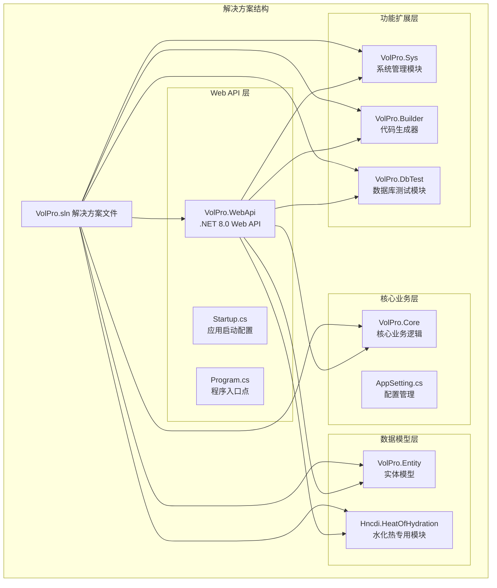
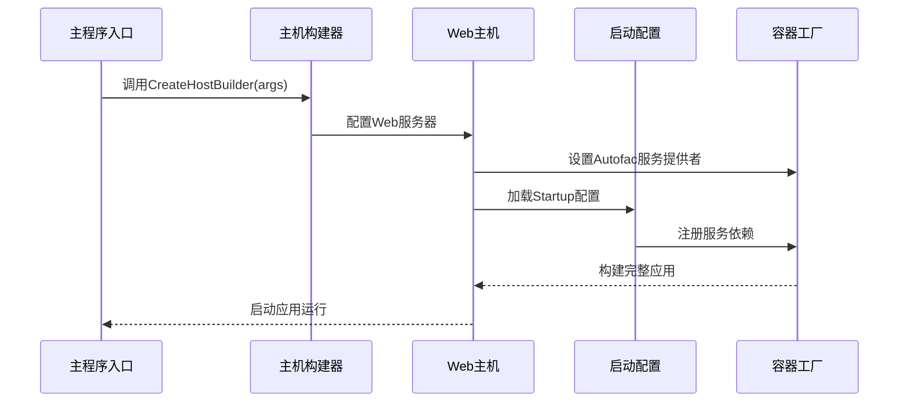
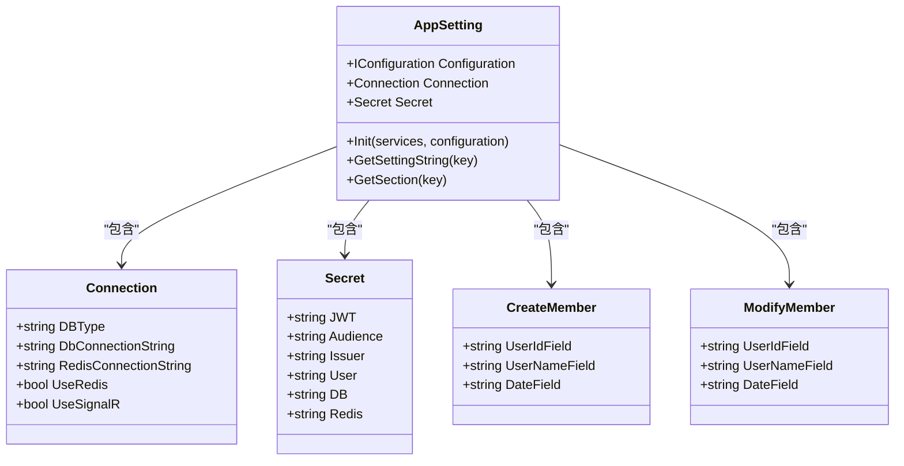
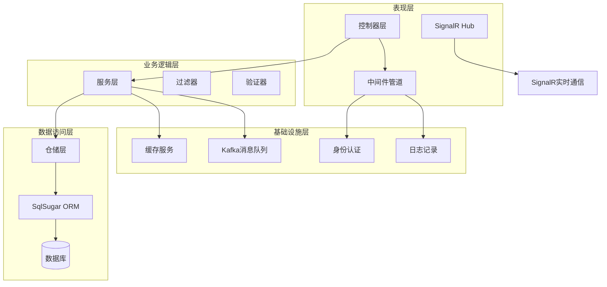
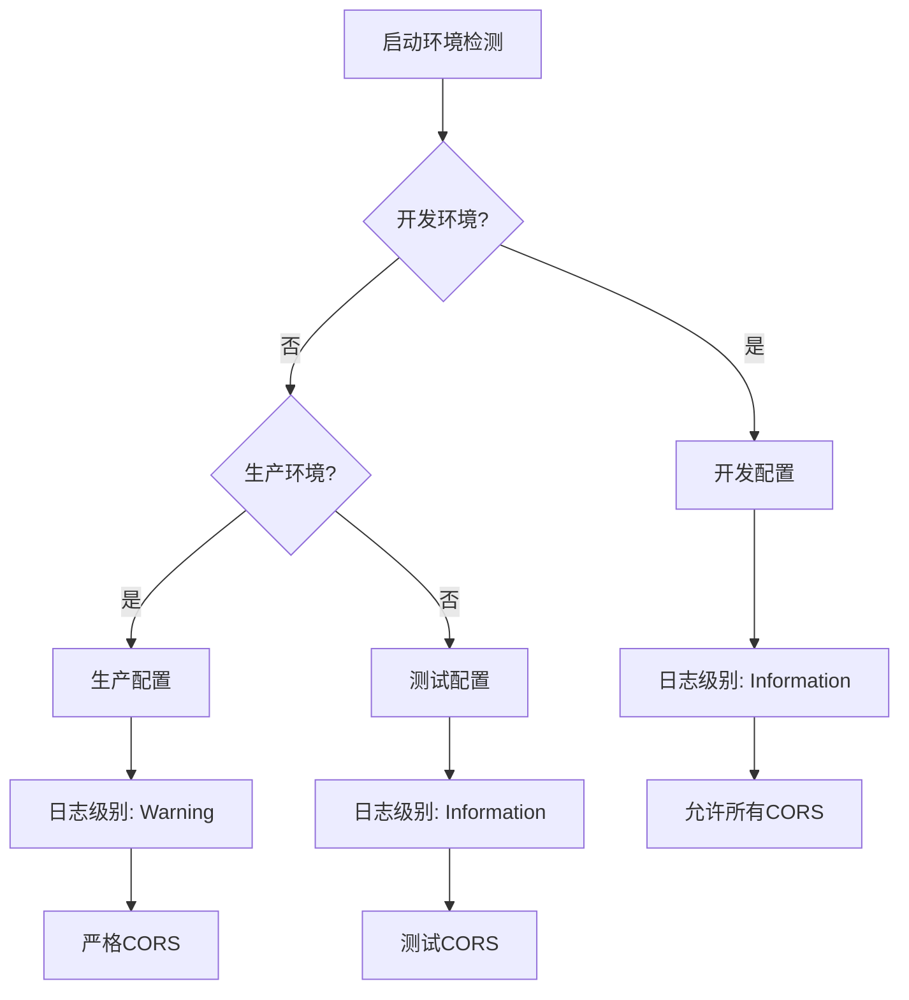
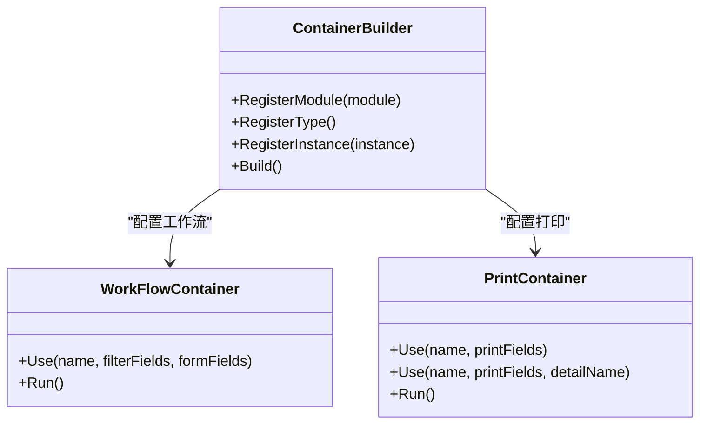
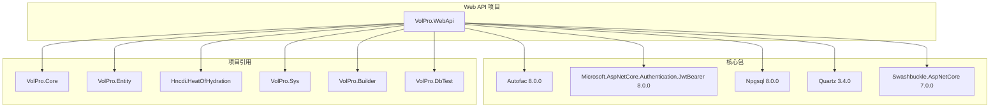

# 开发环境配置

<cite>
**本文档引用的文件**
- [Program.cs](file://VolPro.WebApi/Program.cs)
- [Startup.cs](file://VolPro.WebApi/Startup.cs)
- [appsettings.json](file://VolPro.WebApi/appsettings.json)
- [appsettings.Development.json](file://VolPro.WebApi/appsettings.Development.json)
- [dev_run.bat](file://VolPro.WebApi/dev_run.bat)
- [dev_run2.bat](file://VolPro.WebApi/dev_run2.bat)
- [launchSettings.json](file://VolPro.WebApi/Properties/launchSettings.json)
- [AppSetting.cs](file://VolPro.Core/Configuration/AppSetting.cs)
- [VolPro.WebApi.csproj](file://VolPro.WebApi/VolPro.WebApi.csproj)
- [VolPro.sln](file://VolPro.sln)
</cite>

## 目录
1. [简介](#简介)
2. [项目结构](#项目结构)
3. [核心组件](#核心组件)
4. [架构概览](#架构概览)
5. [详细组件分析](#详细组件分析)
6. [依赖关系分析](#依赖关系分析)
7. [性能考虑](#性能考虑)
8. [故障排除指南](#故障排除指南)
9. [结论](#结论)

## 简介

水化热平台是一个基于.NET 8.0构建的企业级Web API应用，采用现代化的软件架构设计。该平台专注于混凝土水化热监测和数据分析，提供了完整的开发、测试和生产环境配置方案。

本项目采用多层架构模式，包括表示层(VolPro.WebApi)、业务逻辑层(VolPro.Core)、数据访问层(VolPro.Entity)以及专门的功能模块(如Hncdi.HeatOfHydration)。系统集成了多种技术栈，包括Autofac依赖注入容器、SqlSugar ORM、SignalR实时通信、JWT身份认证等先进特性。

## 项目结构

水化热平台采用标准的.NET解决方案结构，包含以下主要项目：

**图表来源**
- [VolPro.sln:1-69](file://VolPro.sln#L1-L69)
- [VolPro.WebApi.csproj:1-55](file://VolPro.WebApi/VolPro.WebApi.csproj#L1-L55)

**章节来源**
- [VolPro.sln:1-69](file://VolPro.sln#L1-L69)
- [VolPro.WebApi.csproj:1-55](file://VolPro.WebApi/VolPro.WebApi.csproj#L1-L55)

## 核心组件

### 应用程序启动流程

水化热平台的应用程序启动采用标准的.NET 8.0主机构建模式，通过Program.cs中的Main方法和CreateHostBuilder方法实现。

**图表来源**
- [Program.cs:17-36](file://VolPro.WebApi/Program.cs#L17-L36)
- [Startup.cs:60-213](file://VolPro.WebApi/Startup.cs#L60-L213)

### 配置管理系统

系统采用分层配置管理策略，通过AppSetting类统一管理各种配置参数：

**图表来源**
- [AppSetting.cs:13-174](file://VolPro.Core/Configuration/AppSetting.cs#L13-L174)

**章节来源**
- [Program.cs:15-38](file://VolPro.WebApi/Program.cs#L15-L38)
- [AppSetting.cs:85-163](file://VolPro.Core/Configuration/AppSetting.cs#L85-L163)

## 架构概览

水化热平台采用分层架构设计，确保了良好的可维护性和扩展性：

**图表来源**
- [Startup.cs:60-383](file://VolPro.WebApi/Startup.cs#L60-L383)
- [AppSetting.cs:176-236](file://VolPro.Core/Configuration/AppSetting.cs#L176-L236)

## 详细组件分析

### 数据库连接配置

系统支持多种数据库类型，通过Connection类统一管理连接字符串：

| 数据库类型 | 连接字符串键 | 默认值示例 |
|-----------|-------------|-----------|
| SQL Server | DbConnectionString | Data Source=...;Initial Catalog=... |
| MySQL | ServiceDbContext | Data Source=...;Database=... |
| PostgreSQL | ServiceDbContext | Host=...;Port=...;User id=... |
| Oracle | ServiceDbContext | user id=...;data source=... |

**章节来源**
- [appsettings.json:16-57](file://VolPro.WebApi/appsettings.json#L16-L57)
- [AppSetting.cs:176-184](file://VolPro.Core/Configuration/AppSetting.cs#L176-L184)

### 环境配置差异

系统提供三种主要环境配置：

**图表来源**
- [appsettings.json:2-8](file://VolPro.WebApi/appsettings.json#L2-L8)
- [appsettings.Development.json:2-9](file://VolPro.WebApi/appsettings.Development.json#L2-L9)

**章节来源**
- [launchSettings.json:10-26](file://VolPro.WebApi/Properties/launchSettings.json#L10-L26)
- [Startup.cs:311-318](file://VolPro.WebApi/Startup.cs#L311-L318)

### 启动脚本使用

系统提供多种启动方式以适应不同的开发需求：

#### dev_run.bat 脚本
- 使用 `dotnet watch --no-hot-reload` 实现实时监控
- 自动创建临时批处理文件
- 错误日志记录到 error.log 文件
- 支持异常情况下的自动清理

#### dev_run2.bat 脚本
- 简化的开发启动方式
- 使用 `dotnet watch run --framework net8.0`
- 适合快速启动和调试

**章节来源**
- [dev_run.bat:1-20](file://VolPro.WebApi/dev_run.bat#L1-L20)
- [dev_run2.bat:1-3](file://VolPro.WebApi/dev_run2.bat#L1-L3)

### 依赖注入容器配置

系统采用Autofac作为主要的依赖注入容器，通过ConfigureContainer方法实现：

**图表来源**
- [Startup.cs:214-307](file://VolPro.WebApi/Startup.cs#L214-L307)

**章节来源**
- [Startup.cs:214-307](file://VolPro.WebApi/Startup.cs#L214-L307)

## 依赖关系分析

### NuGet包依赖

系统的核心NuGet包依赖关系如下：

**图表来源**
- [VolPro.WebApi.csproj:32-47](file://VolPro.WebApi/VolPro.WebApi.csproj#L32-L47)

**章节来源**
- [VolPro.WebApi.csproj:32-47](file://VolPro.WebApi/VolPro.WebApi.csproj#L32-L47)

### 环境变量配置

系统通过launchSettings.json配置环境变量：

| 配置文件 | ASPNETCORE_ENVIRONMENT | 应用程序URL | 启动浏览器 |
|---------|----------------------|------------|-----------|
| IIS Express | Development | http://localhost:1309 https://localhost:44318 | 是 |
| VolPro.WebApi | Development | https://localhost:5001 http://localhost:5000 | 是 |

**章节来源**
- [launchSettings.json:10-26](file://VolPro.WebApi/Properties/launchSettings.json#L10-L26)

## 性能考虑

### 缓存策略

系统实现了多层次的缓存机制：

1. **内存缓存**: 默认启用，适用于短期数据缓存
2. **Redis缓存**: 可选配置，适用于分布式场景
3. **静态文件缓存**: 针对上传文件的优化

### 数据库连接优化

- 支持多种数据库类型
- 连接字符串加密存储
- 动态分库支持
- 逻辑删除字段配置

### 实时通信配置

- SignalR集成用于实时数据推送
- 可配置的CORS策略
- WebSocket连接池管理

## 故障排除指南

### 常见启动问题

1. **端口冲突**
   - 检查Program.cs中的端口配置
   - 修改launchSettings.json中的应用程序URL

2. **数据库连接失败**
   - 验证appsettings.json中的连接字符串
   - 检查数据库服务状态

3. **JWT认证失败**
   - 确认Secret配置正确
   - 检查Token有效期设置

### 调试技巧

1. **开发模式调试**
   - 使用dev_run.bat进行实时监控
   - 查看error.log文件获取详细错误信息

2. **生产环境诊断**
   - 检查日志配置
   - 监控SignalR连接状态
   - 验证缓存配置

**章节来源**
- [Program.cs:28-36](file://VolPro.WebApi/Program.cs#L28-L36)
- [dev_run.bat:10-15](file://VolPro.WebApi/dev_run.bat#L10-L15)

## 结论

水化热平台的开发环境配置展现了现代.NET 8.0应用的最佳实践。通过清晰的分层架构、完善的配置管理和灵活的启动方式，为开发者提供了高效、稳定的开发体验。

关键优势包括：
- 标准化的项目结构和命名约定
- 灵活的环境配置和部署选项
- 完善的依赖注入和生命周期管理
- 全面的错误处理和日志记录机制
- 支持多种数据库和缓存方案

建议在实际部署时：
1. 根据生产环境需求调整配置参数
2. 配置适当的监控和告警机制
3. 建立完整的CI/CD流水线
4. 制定详细的运维和故障恢复预案