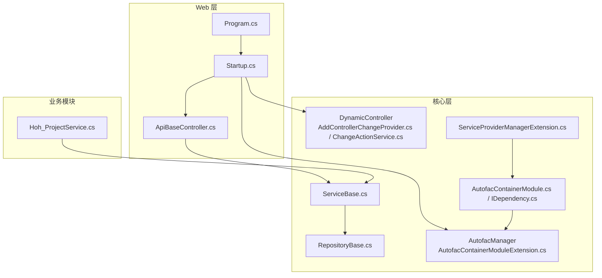
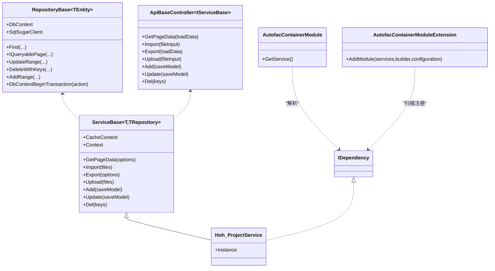
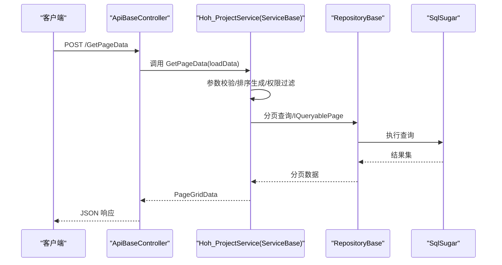
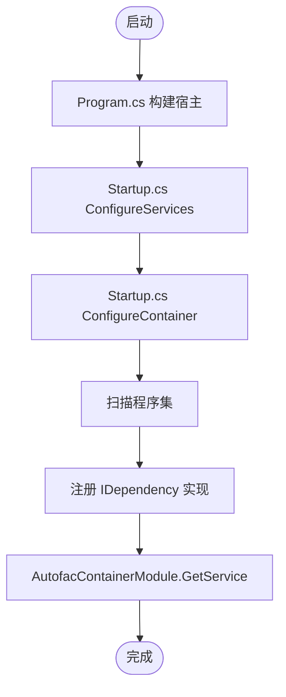
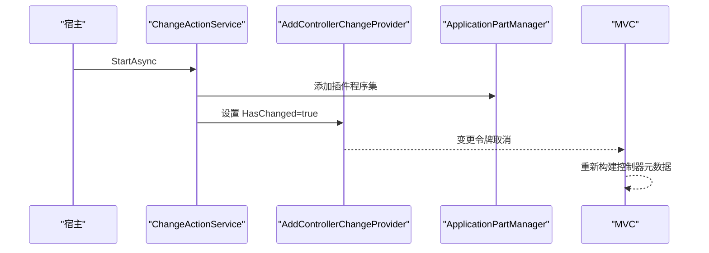
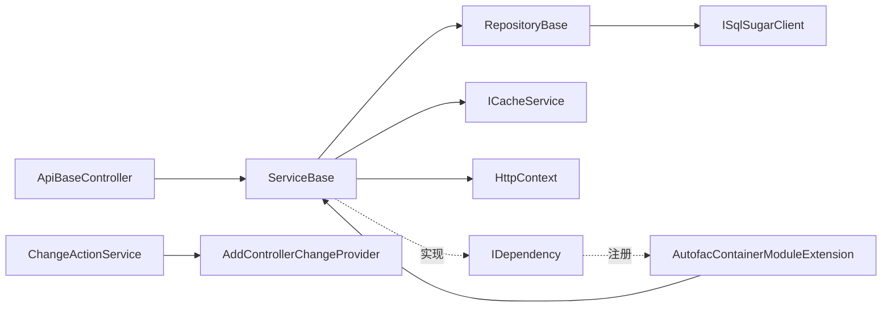

# 扩展开发指南

<cite>
**本文档引用的文件**
- [ServiceBase.cs](file://VolPro.Core/BaseProvider/ServiceBase.cs)
- [RepositoryBase.cs](file://VolPro.Core/BaseProvider/RepositoryBase.cs)
- [ApiBaseController.cs](file://VolPro.Core/Controllers/Basic/ApiBaseController.cs)
- [AddControllerChangeProvider.cs](file://VolPro.Core/Controllers/DynamicController/AddControllerChangeProvider.cs)
- [ChangeActionService.cs](file://VolPro.Core/Controllers/DynamicController/ChangeActionService.cs)
- [AutofacContainerModule.cs](file://VolPro.Core/Extensions/AutofacManager/AutofacContainerModule.cs)
- [AutofacContainerModuleExtension.cs](file://VolPro.Core/Extensions/AutofacManager/AutofacContainerModuleExtension.cs)
- [IDependency.cs](file://VolPro.Core/Extensions/AutofacManager/IDependency.cs)
- [ServiceProviderManagerExtension.cs](file://VolPro.Core/Extensions/ServiceProviderManagerExtension.cs)
- [Program.cs](file://VolPro.WebApi/Program.cs)
- [Startup.cs](file://VolPro.WebApi/Startup.cs)
- [Hoh_ProjectService.cs](file://Hncdi.HeatOfHydration/Services/Hoh/Hoh_ProjectService.cs)
</cite>

## 目录
1. [简介](#简介)
2. [项目结构](#项目结构)
3. [核心组件](#核心组件)
4. [架构总览](#架构总览)
5. [详细组件分析](#详细组件分析)
6. [依赖关系分析](#依赖关系分析)
7. [性能考虑](#性能考虑)
8. [故障排除指南](#故障排除指南)
9. [结论](#结论)
10. [附录](#附录)

## 简介
本指南面向希望在水化热平台基础上进行扩展开发的工程师，重点围绕以下目标展开：
- 基于 ServiceBase 的自定义模块与插件开发方法
- Autofac 容器的扩展配置与依赖注入的自定义注册
- 基于 DynamicController 的动态控制器开发方法
- 第三方服务集成的指导（API 调用与数据转换）
- 扩展点识别与插件架构设计的最佳实践

## 项目结构
该代码库采用多项目分层组织，核心能力集中在 VolPro.Core 中，Web API 入口位于 VolPro.WebApi，业务模块以 Hncdi.HeatOfHydration 为代表。关键扩展点包括：
- 控制器基类与动态控制器机制
- 仓储与服务抽象基类
- Autofac 容器注册与生命周期管理
- 插件加载与动态路由刷新

**图表来源**
- [Program.cs:1-39](file://VolPro.WebApi/Program.cs#L1-L39)
- [Startup.cs:1-407](file://VolPro.WebApi/Startup.cs#L1-L407)
- [ApiBaseController.cs:1-230](file://VolPro.Core/Controllers/Basic/ApiBaseController.cs#L1-L230)
- [ServiceBase.cs:1-800](file://VolPro.Core/BaseProvider/ServiceBase.cs#L1-L800)
- [RepositoryBase.cs:1-651](file://VolPro.Core/BaseProvider/RepositoryBase.cs#L1-L651)
- [AddControllerChangeProvider.cs:1-24](file://VolPro.Core/Controllers/DynamicController/AddControllerChangeProvider.cs#L1-L24)
- [ChangeActionService.cs:1-53](file://VolPro.Core/Controllers/DynamicController/ChangeActionService.cs#L1-L53)
- [AutofacContainerModuleExtension.cs:1-119](file://VolPro.Core/Extensions/AutofacManager/AutofacContainerModuleExtension.cs#L1-L119)
- [AutofacContainerModule.cs:1-15](file://VolPro.Core/Extensions/AutofacManager/AutofacContainerModule.cs#L1-L15)
- [IDependency.cs:1-13](file://VolPro.Core/Extensions/AutofacManager/IDependency.cs#L1-L13)
- [ServiceProviderManagerExtension.cs:1-32](file://VolPro.Core/Extensions/ServiceProviderManagerExtension.cs#L1-L32)
- [Hoh_ProjectService.cs:1-24](file://Hncdi.HeatOfHydration/Services/Hoh/Hoh_ProjectService.cs#L1-L24)

**章节来源**
- [Program.cs:1-39](file://VolPro.WebApi/Program.cs#L1-L39)
- [Startup.cs:1-407](file://VolPro.WebApi/Startup.cs#L1-L407)

## 核心组件
- ServiceBase 抽象服务基类：封装分页查询、导入导出、上传下载、主从表保存、多租户与权限过滤等通用能力，并通过 Autofac 注入缓存服务与 HttpContext。
- RepositoryBase 抽象仓储基类：提供事务、分页查询、更新、插入、删除等通用数据访问能力，统一基于 SqlSugar 的 ISqlSugarClient。
- ApiBaseController 控制器基类：统一暴露 GetPageData、Add、Update、Del、Import、Export、Upload、DownLoadTemplate 等标准接口，通过反射调用具体 Service 实现。
- DynamicController 动态控制器：通过 AddControllerChangeProvider 与 ChangeActionService 支持运行时刷新控制器注册与变更通知。
- AutofacManager：通过 AutofacContainerModuleExtension 扫描程序集并注册实现 IDependency 接口的类型；AutofacContainerModule 提供静态 GetService 方法；IDependency 作为插件标记接口；ServiceProviderManagerExtension 提供全局服务解析扩展。
- Hoh_ProjectService 示例：展示如何继承 ServiceBase 并实现 IDependency，从而被 Autofac 自动注册与注入。

**章节来源**
- [ServiceBase.cs:1-800](file://VolPro.Core/BaseProvider/ServiceBase.cs#L1-L800)
- [RepositoryBase.cs:1-651](file://VolPro.Core/BaseProvider/RepositoryBase.cs#L1-L651)
- [ApiBaseController.cs:1-230](file://VolPro.Core/Controllers/Basic/ApiBaseController.cs#L1-L230)
- [AddControllerChangeProvider.cs:1-24](file://VolPro.Core/Controllers/DynamicController/AddControllerChangeProvider.cs#L1-L24)
- [ChangeActionService.cs:1-53](file://VolPro.Core/Controllers/DynamicController/ChangeActionService.cs#L1-L53)
- [AutofacContainerModule.cs:1-15](file://VolPro.Core/Extensions/AutofacManager/AutofacContainerModule.cs#L1-L15)
- [AutofacContainerModuleExtension.cs:1-119](file://VolPro.Core/Extensions/AutofacManager/AutofacContainerModuleExtension.cs#L1-L119)
- [IDependency.cs:1-13](file://VolPro.Core/Extensions/AutofacManager/IDependency.cs#L1-L13)
- [ServiceProviderManagerExtension.cs:1-32](file://VolPro.Core/Extensions/ServiceProviderManagerExtension.cs#L1-L32)
- [Hoh_ProjectService.cs:1-24](file://Hncdi.HeatOfHydration/Services/Hoh/Hoh_ProjectService.cs#L1-L24)

## 架构总览
系统采用“控制器-服务-仓储-数据源”的分层架构，结合 Autofac 进行依赖注入，支持动态控制器刷新与插件式扩展。

**图表来源**
- [ServiceBase.cs:1-800](file://VolPro.Core/BaseProvider/ServiceBase.cs#L1-L800)
- [RepositoryBase.cs:1-651](file://VolPro.Core/BaseProvider/RepositoryBase.cs#L1-L651)
- [ApiBaseController.cs:1-230](file://VolPro.Core/Controllers/Basic/ApiBaseController.cs#L1-L230)
- [Hoh_ProjectService.cs:1-24](file://Hncdi.HeatOfHydration/Services/Hoh/Hoh_ProjectService.cs#L1-L24)
- [IDependency.cs:1-13](file://VolPro.Core/Extensions/AutofacManager/IDependency.cs#L1-L13)
- [AutofacContainerModule.cs:1-15](file://VolPro.Core/Extensions/AutofacManager/AutofacContainerModule.cs#L1-L15)
- [AutofacContainerModuleExtension.cs:1-119](file://VolPro.Core/Extensions/AutofacManager/AutofacContainerModuleExtension.cs#L1-L119)

## 详细组件分析

### 基于 ServiceBase 的自定义模块与插件开发
- 继承与职责
  - 在业务模块中创建服务类继承 ServiceBase<T, TRepository>，并在构造函数中注入对应仓储接口，即可获得分页查询、导入导出、上传下载、主从保存等能力。
  - 通过实现 IDependency 接口，使服务被 Autofac 自动扫描并注册，便于在控制器或其他服务中注入使用。
- 关键扩展点
  - 分页查询：GetPageData(options) 内部完成查询参数校验、排序生成、权限字段过滤、统计汇总等。
  - 数据导入导出：Import(files)/Export(options) 支持模板下载、Excel 解析、字段映射、权限列控制。
  - 文件上传：Upload(files) 统一上传路径与异常日志记录。
  - 主从保存：Add/saveModel 支持主表与明细表一次性提交，自动处理新增/修改/删除。
- 最佳实践
  - 将业务逻辑集中在 Partial 文件中，避免被代码生成器覆盖。
  - 合理使用 AddOnExecuting/ExportOnExecuting/ImportOnExecuting 等钩子扩展行为。
  - 对复杂查询使用 QueryRelativeExpression 或自定义 SQL（QuerySql）增强灵活性。

**图表来源**
- [ApiBaseController.cs:1-230](file://VolPro.Core/Controllers/Basic/ApiBaseController.cs#L1-L230)
- [ServiceBase.cs:285-340](file://VolPro.Core/BaseProvider/ServiceBase.cs#L285-L340)
- [RepositoryBase.cs:250-283](file://VolPro.Core/BaseProvider/RepositoryBase.cs#L250-L283)

**章节来源**
- [ServiceBase.cs:1-800](file://VolPro.Core/BaseProvider/ServiceBase.cs#L1-L800)
- [Hoh_ProjectService.cs:1-24](file://Hncdi.HeatOfHydration/Services/Hoh/Hoh_ProjectService.cs#L1-L24)

### Autofac 容器扩展配置与依赖注入
- 容器启动流程
  - Program.cs 使用 AutofacServiceProviderFactory 创建宿主，确保 ASP.NET Core 与 Autofac 协同工作。
  - Startup.cs 在 ConfigureServices 中初始化配置与中间件，在 ConfigureContainer 中调用 AddModule 完成服务注册。
- 扫描与注册
  - AutofacContainerModuleExtension.AddModule 通过扫描当前项目编译库，筛选实现 IDependency 的类型，按自身类型与已实现接口注册，并设置生命周期。
  - 根据配置选择内存缓存或 Redis 缓存实现为 ICacheService。
- 服务解析
  - AutofacContainerModule.GetService<TService>() 提供静态入口，结合 ServiceProviderManagerExtension.GetService 实现 HttpContext 上下文解析。
- 插件式开发建议
  - 将插件类实现 IDependency 接口，确保被自动发现与注册。
  - 如需动态加载外部 DLL，可参考 Startup.cs 中关于插件目录的注释部分进行扩展。

**图表来源**
- [Program.cs:1-39](file://VolPro.WebApi/Program.cs#L1-L39)
- [Startup.cs:214-217](file://VolPro.WebApi/Startup.cs#L214-L217)
- [AutofacContainerModuleExtension.cs:36-115](file://VolPro.Core/Extensions/AutofacManager/AutofacContainerModuleExtension.cs#L36-L115)
- [AutofacContainerModule.cs:1-15](file://VolPro.Core/Extensions/AutofacManager/AutofacContainerModule.cs#L1-L15)
- [IDependency.cs:1-13](file://VolPro.Core/Extensions/AutofacManager/IDependency.cs#L1-L13)
- [ServiceProviderManagerExtension.cs:1-32](file://VolPro.Core/Extensions/ServiceProviderManagerExtension.cs#L1-L32)

**章节来源**
- [Program.cs:1-39](file://VolPro.WebApi/Program.cs#L1-L39)
- [Startup.cs:214-217](file://VolPro.WebApi/Startup.cs#L214-L217)
- [AutofacContainerModuleExtension.cs:1-119](file://VolPro.Core/Extensions/AutofacManager/AutofacContainerModuleExtension.cs#L1-L119)
- [AutofacContainerModule.cs:1-15](file://VolPro.Core/Extensions/AutofacManager/AutofacContainerModule.cs#L1-L15)
- [IDependency.cs:1-13](file://VolPro.Core/Extensions/AutofacManager/IDependency.cs#L1-L13)
- [ServiceProviderManagerExtension.cs:1-32](file://VolPro.Core/Extensions/ServiceProviderManagerExtension.cs#L1-L32)

### 基于 DynamicController 的动态控制器开发
- 变更通知
  - AddControllerChangeProvider 提供 IActionDescriptorChangeProvider，用于触发控制器元数据变更通知。
  - ChangeActionService 实现 IHostedService，在启动时可加载插件程序集并将其加入 ApplicationPartManager，随后触发变更令牌取消。
- 开发步骤
  - 在插件项目中定义控制器类，确保其被加载到 ApplicationPartManager。
  - 通过 ChangeActionService 触发 AddControllerChangeProvider 的变更令牌，使 MVC 重新构建控制器元数据。
- 注意事项
  - 插件目录加载与程序集装配相关代码目前处于注释状态，可根据需要解除注释并完善异常处理。

**图表来源**
- [ChangeActionService.cs:1-53](file://VolPro.Core/Controllers/DynamicController/ChangeActionService.cs#L1-L53)
- [AddControllerChangeProvider.cs:1-24](file://VolPro.Core/Controllers/DynamicController/AddControllerChangeProvider.cs#L1-L24)

**章节来源**
- [ChangeActionService.cs:1-53](file://VolPro.Core/Controllers/DynamicController/ChangeActionService.cs#L1-L53)
- [AddControllerChangeProvider.cs:1-24](file://VolPro.Core/Controllers/DynamicController/AddControllerChangeProvider.cs#L1-L24)

### 第三方服务集成指导（API 调用与数据转换）
- HTTP 客户端与中间件
  - Startup.cs 已注册 HttpClient，可在服务中注入 IHttpClientFactory 发起第三方 API 请求。
  - 中间件链路包含异常处理、静态文件、语言包、认证授权等，确保请求在统一管道中流转。
- 数据转换与模型映射
  - 使用 EPPlusHelper 进行 Excel 模板导出与读取，支持字段映射与忽略列配置。
  - 利用 AutoMapper 或手动映射将第三方响应转换为内部领域模型，保持一致性。
- 最佳实践
  - 对外请求统一通过独立服务封装，便于限流、熔断与日志记录。
  - 对敏感字段进行脱敏与加密存储，遵循安全规范。

**章节来源**
- [Startup.cs:183-213](file://VolPro.WebApi/Startup.cs#L183-L213)
- [ServiceBase.cs:514-652](file://VolPro.Core/BaseProvider/ServiceBase.cs#L514-L652)

## 依赖关系分析
- 控制器依赖服务：ApiBaseController 通过反射调用 ServiceBase 的公开方法，实现统一接口。
- 服务依赖仓储：ServiceBase 持有 IRepository<T> 实例，RepositoryBase 提供 ISqlSugarClient 访问数据库。
- 容器依赖注入：AutofacContainerModuleExtension 扫描 IDependency 实现并注册；AutofacContainerModule 提供静态解析入口。
- 动态控制器：ChangeActionService 与 AddControllerChangeProvider 协作，驱动 MVC 元数据重建。

**图表来源**
- [ApiBaseController.cs:1-230](file://VolPro.Core/Controllers/Basic/ApiBaseController.cs#L1-L230)
- [ServiceBase.cs:1-800](file://VolPro.Core/BaseProvider/ServiceBase.cs#L1-L800)
- [RepositoryBase.cs:1-651](file://VolPro.Core/BaseProvider/RepositoryBase.cs#L1-L651)
- [AutofacContainerModuleExtension.cs:1-119](file://VolPro.Core/Extensions/AutofacManager/AutofacContainerModuleExtension.cs#L1-L119)
- [AutofacContainerModule.cs:1-15](file://VolPro.Core/Extensions/AutofacManager/AutofacContainerModule.cs#L1-L15)
- [IDependency.cs:1-13](file://VolPro.Core/Extensions/AutofacManager/IDependency.cs#L1-L13)
- [ChangeActionService.cs:1-53](file://VolPro.Core/Controllers/DynamicController/ChangeActionService.cs#L1-L53)
- [AddControllerChangeProvider.cs:1-24](file://VolPro.Core/Controllers/DynamicController/AddControllerChangeProvider.cs#L1-L24)

**章节来源**
- [ApiBaseController.cs:1-230](file://VolPro.Core/Controllers/Basic/ApiBaseController.cs#L1-L230)
- [ServiceBase.cs:1-800](file://VolPro.Core/BaseProvider/ServiceBase.cs#L1-L800)
- [RepositoryBase.cs:1-651](file://VolPro.Core/BaseProvider/RepositoryBase.cs#L1-L651)
- [AutofacContainerModuleExtension.cs:1-119](file://VolPro.Core/Extensions/AutofacManager/AutofacContainerModuleExtension.cs#L1-L119)
- [AutofacContainerModule.cs:1-15](file://VolPro.Core/Extensions/AutofacManager/AutofacContainerModule.cs#L1-L15)
- [IDependency.cs:1-13](file://VolPro.Core/Extensions/AutofacManager/IDependency.cs#L1-L13)
- [ChangeActionService.cs:1-53](file://VolPro.Core/Controllers/DynamicController/ChangeActionService.cs#L1-L53)
- [AddControllerChangeProvider.cs:1-24](file://VolPro.Core/Controllers/DynamicController/AddControllerChangeProvider.cs#L1-L24)

## 性能考虑
- 分页与排序
  - ServiceBase 在分页查询时根据主键或配置字段生成排序，避免全表扫描；导出场景限制数量以降低内存压力。
- 缓存策略
  - 根据配置选择内存缓存或 Redis 缓存，减少重复查询与计算开销。
- 事务与批量操作
  - RepositoryBase 提供 DbContextBeginTransaction 与批量插入/更新，减少往返次数与锁竞争。
- 动态控制器
  - 变更通知仅在必要时触发，避免频繁重建元数据带来的性能损耗。

[本节为通用指导，无需特定文件引用]

## 故障排除指南
- 依赖注入问题
  - 确认服务实现 IDependency 接口且位于可扫描程序集中。
  - 检查 AutofacContainerModuleExtension 的扫描范围与异常输出。
- 动态控制器不生效
  - 确认 ChangeActionService 已注册为托管服务，且 AddControllerChangeProvider 的令牌已被取消。
  - 检查插件程序集是否正确加载至 ApplicationPartManager。
- 文件上传/导出异常
  - 查看 ServiceBase 的上传/导出日志与异常捕获，确认路径与权限。
- 分页查询结果异常
  - 检查权限字段过滤与排序字段合法性，确保字段映射正确。

**章节来源**
- [AutofacContainerModuleExtension.cs:59-75](file://VolPro.Core/Extensions/AutofacManager/AutofacContainerModuleExtension.cs#L59-L75)
- [ChangeActionService.cs:29-44](file://VolPro.Core/Controllers/DynamicController/ChangeActionService.cs#L29-L44)
- [ServiceBase.cs:498-504](file://VolPro.Core/BaseProvider/ServiceBase.cs#L498-L504)
- [ServiceBase.cs:612-652](file://VolPro.Core/BaseProvider/ServiceBase.cs#L612-L652)

## 结论
通过 ServiceBase、RepositoryBase、Autofac 容器与 DynamicController 的协同，水化热平台提供了清晰的扩展点与插件化能力。开发者可快速实现自定义模块与第三方服务集成，同时保持良好的性能与可维护性。建议在扩展过程中严格遵循依赖注入约定、插件接口规范与动态控制器刷新机制，确保系统稳定演进。

[本节为总结性内容，无需特定文件引用]

## 附录
- 快速开始清单
  - 创建服务类继承 ServiceBase<T, TRepository>，实现 IDependency。
  - 在 Startup.cs 的 ConfigureContainer 中确认 AddModule 已调用。
  - 如需动态控制器，确保 ChangeActionService 与 AddControllerChangeProvider 正常工作。
  - 对外 API 集成使用 IHttpClientFactory，配合数据转换工具完成模型映射。

[本节为补充信息，无需特定文件引用]