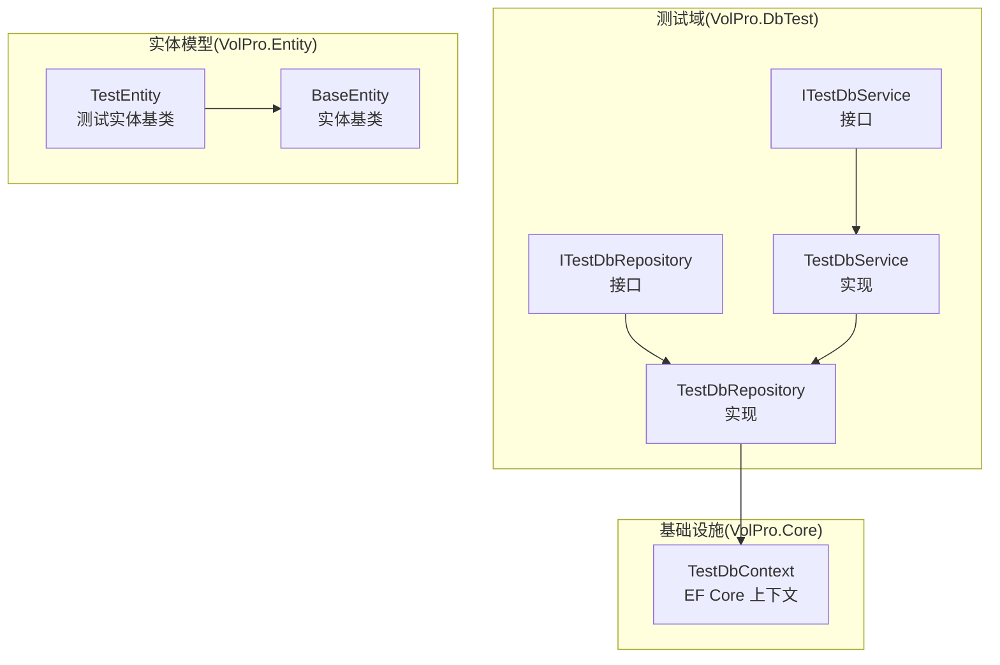
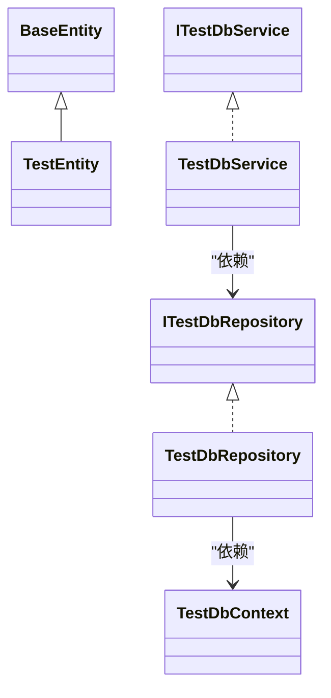
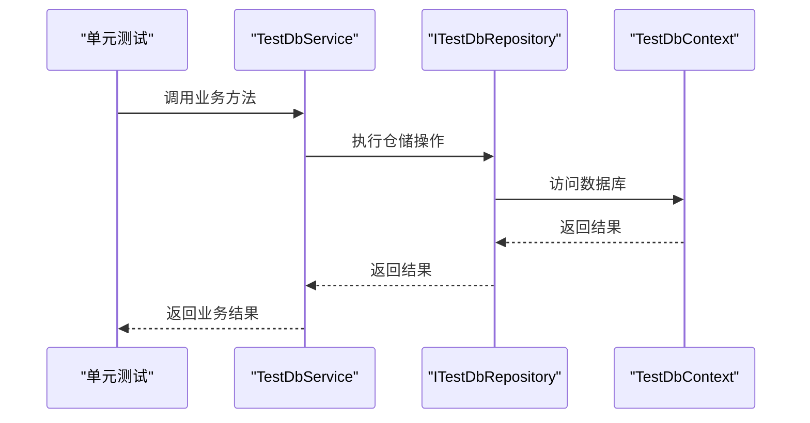
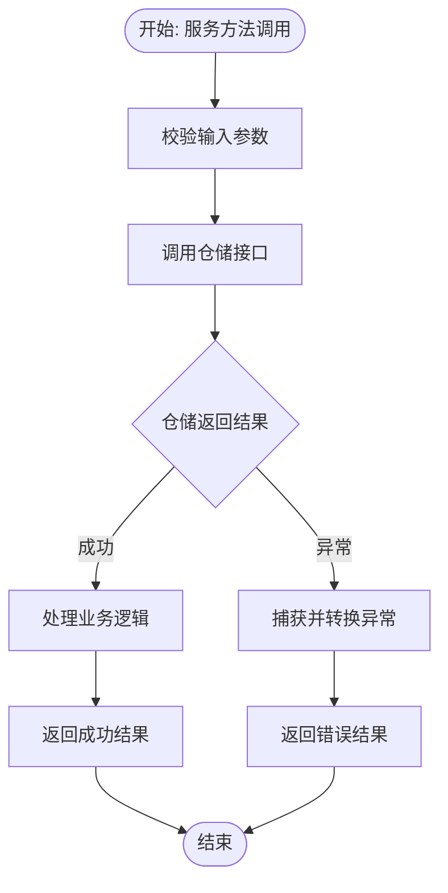
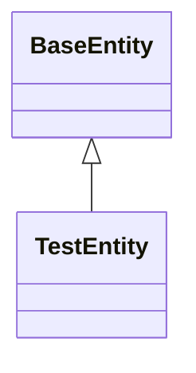
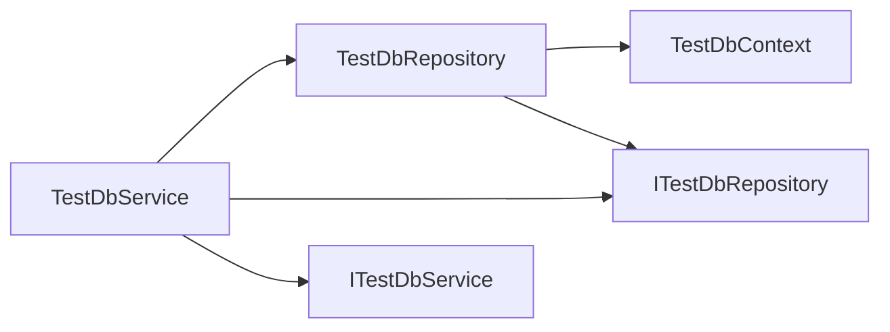

# 测试策略与实践

<cite>
**本文引用的文件**
- [VolPro.DbTest.csproj](file://VolPro.DbTest/VolPro.DbTest.csproj)
- [TestDbService.cs](file://VolPro.DbTest/Services/Test/TestDbService.cs)
- [TestDbRepository.cs](file://VolPro.DbTest/Repositories/Test/TestDbRepository.cs)
- [ITestDbRepository.cs](file://VolPro.DbTest/IRepositories/Test/ITestDbRepository.cs)
- [ITestDbService.cs](file://VolPro.DbTest/IServices/Test/ITestDbService.cs)
- [TestDbContext.cs](file://VolPro.Core/EFDbContext/TestDbContext.cs)
- [TestEntity.cs](file://VolPro.Entity/SystemModels/TestEntity.cs)
- [BaseEntity.cs](file://VolPro.Entity/SystemModels/BaseEntity.cs)
</cite>

## 目录
1. [引言](#引言)
2. [项目结构](#项目结构)
3. [核心组件](#核心组件)
4. [架构总览](#架构总览)
5. [详细组件分析](#详细组件分析)
6. [依赖分析](#依赖分析)
7. [性能考虑](#性能考虑)
8. [故障排查指南](#故障排查指南)
9. [结论](#结论)
10. [附录](#附录)

## 引言
本文件面向“水化热平台”的测试策略与实践，聚焦于基于 VolPro.DbTest 模块的测试设计与落地方法。内容涵盖单元测试与集成测试的编写思路、测试框架选择与配置（xUnit/NUnit）、Mock 对象与测试数据准备策略，并结合 TestEntity 与 TestDbService/TestDbRepository 的实际实现，给出数据访问层测试的最佳实践。同时提供测试覆盖率目标与持续集成配置建议，帮助团队建立稳定、可维护的测试体系。

## 项目结构
围绕测试主题，本次分析涉及以下关键模块与文件：
- VolPro.DbTest：测试功能域的仓储与服务实现，提供数据访问层测试样例
- VolPro.Core：基础设施与数据库上下文，提供 EF Core 上下文与 SqlSugar 集成
- VolPro.Entity：实体模型基类与系统模型，提供 TestEntity 基类用于测试实体

图示来源
- [TestDbRepository.cs:13-23](file://VolPro.DbTest/Repositories/Test/TestDbRepository.cs#L13-L23)
- [ITestDbRepository.cs:15-17](file://VolPro.DbTest/IRepositories/Test/ITestDbRepository.cs#L15-L17)
- [ITestDbService.cs:9-11](file://VolPro.DbTest/IServices/Test/ITestDbService.cs#L9-L11)
- [TestDbService.cs:15-26](file://VolPro.DbTest/Services/Test/TestDbService.cs#L15-L26)
- [TestDbContext.cs:12-18](file://VolPro.Core/EFDbContext/TestDbContext.cs#L12-L18)
- [BaseEntity.cs:7-9](file://VolPro.Entity/SystemModels/BaseEntity.cs#L7-L9)
- [TestEntity.cs:7-9](file://VolPro.Entity/SystemModels/TestEntity.cs#L7-L9)

章节来源
- [VolPro.DbTest.csproj:1-33](file://VolPro.DbTest/VolPro.DbTest.csproj#L1-L33)

## 核心组件
- TestDbRepository：基于仓储基类实现对 TestDb 实体的数据访问，构造函数注入 TestDbContext，体现依赖注入与上下文解耦
- TestDbService：基于服务基类实现业务逻辑封装，依赖 ITestDbRepository，支持通过静态 Instance 获取 Autofac 容器中的实例
- ITestDbRepository/ITestDbService：定义数据访问与服务契约，便于单元测试时进行接口 Mock
- TestDbContext：基于 BaseDbContext，使用 DbManger 获取命名连接（SqlSugar），为测试提供可替换的数据库上下文
- TestEntity/BaseEntity：实体基类抽象，便于在测试中派生出测试专用实体类型

章节来源
- [TestDbRepository.cs:13-23](file://VolPro.DbTest/Repositories/Test/TestDbRepository.cs#L13-L23)
- [TestDbService.cs:15-26](file://VolPro.DbTest/Services/Test/TestDbService.cs#L15-L26)
- [ITestDbRepository.cs:15-17](file://VolPro.DbTest/IRepositories/Test/ITestDbRepository.cs#L15-L17)
- [ITestDbService.cs:9-11](file://VolPro.DbTest/IServices/Test/ITestDbService.cs#L9-L11)
- [TestDbContext.cs:12-18](file://VolPro.Core/EFDbContext/TestDbContext.cs#L12-L18)
- [TestEntity.cs:7-9](file://VolPro.Entity/SystemModels/TestEntity.cs#L7-L9)
- [BaseEntity.cs:7-9](file://VolPro.Entity/SystemModels/BaseEntity.cs#L7-L9)

## 架构总览
下图展示了测试域与基础设施之间的交互关系，以及测试实体的继承层次：

图示来源
- [BaseEntity.cs:7-9](file://VolPro.Entity/SystemModels/BaseEntity.cs#L7-L9)
- [TestEntity.cs:7-9](file://VolPro.Entity/SystemModels/TestEntity.cs#L7-L9)
- [ITestDbRepository.cs:15-17](file://VolPro.DbTest/IRepositories/Test/ITestDbRepository.cs#L15-L17)
- [TestDbRepository.cs:13-23](file://VolPro.DbTest/Repositories/Test/TestDbRepository.cs#L13-L23)
- [ITestDbService.cs:9-11](file://VolPro.DbTest/IServices/Test/ITestDbService.cs#L9-L11)
- [TestDbService.cs:15-26](file://VolPro.DbTest/Services/Test/TestDbService.cs#L15-L26)
- [TestDbContext.cs:12-18](file://VolPro.Core/EFDbContext/TestDbContext.cs#L12-L18)

## 详细组件分析

### 数据访问层测试（Repository 层）
- 测试目标
  - 验证仓储对 TestDb 的增删改查行为
  - 验证仓储与 TestDbContext 的协作
  - 验证仓储在不同数据库环境下的兼容性（SqlSugar）
- 测试策略
  - 使用内存数据库或轻量级测试数据库（如 SQLite In-Memory）作为测试后端，确保隔离与可重复性
  - 在单元测试中以接口 ITestDbRepository 进行 Mock，验证服务层调用链
  - 在集成测试中注入真实 TestDbContext，执行端到端数据库操作
- 关键实现参考
  - 仓储构造函数注入 TestDbContext，体现依赖注入与上下文解耦
  - 仓储实现位于 Partial 文件夹，便于扩展而不影响自动生成代码

图示来源
- [TestDbService.cs:15-26](file://VolPro.DbTest/Services/Test/TestDbService.cs#L15-L26)
- [ITestDbRepository.cs:15-17](file://VolPro.DbTest/IRepositories/Test/ITestDbRepository.cs#L15-L17)
- [TestDbContext.cs:12-18](file://VolPro.Core/EFDbContext/TestDbContext.cs#L12-L18)

章节来源
- [TestDbRepository.cs:13-23](file://VolPro.DbTest/Repositories/Test/TestDbRepository.cs#L13-L23)
- [ITestDbRepository.cs:15-17](file://VolPro.DbTest/IRepositories/Test/ITestDbRepository.cs#L15-L17)
- [TestDbContext.cs:12-18](file://VolPro.Core/EFDbContext/TestDbContext.cs#L12-L18)

### 服务层测试（Service 层）
- 测试目标
  - 验证服务层业务逻辑正确性
  - 验证服务层对仓储接口的调用顺序与参数传递
  - 验证异常处理与边界条件
- 测试策略
  - 使用 Moq 或类似框架对 ITestDbRepository 进行 Mock，模拟不同场景（成功、失败、空结果等）
  - 通过构造函数注入或 Autofac 容器解析方式提供测试实例
  - 对复杂业务流程进行分步骤断言，确保每个环节的行为符合预期

图示来源
- [TestDbService.cs:15-26](file://VolPro.DbTest/Services/Test/TestDbService.cs#L15-L26)
- [ITestDbRepository.cs:15-17](file://VolPro.DbTest/IRepositories/Test/ITestDbRepository.cs#L15-L17)

章节来源
- [TestDbService.cs:15-26](file://VolPro.DbTest/Services/Test/TestDbService.cs#L15-L26)
- [ITestDbService.cs:9-11](file://VolPro.DbTest/IServices/Test/ITestDbService.cs#L9-L11)

### 实体基类测试（TestEntity/BaseEntity）
- 测试目标
  - 验证实体基类的继承关系与属性约定
  - 验证测试实体 TestEntity 的可用性与扩展性
- 测试策略
  - 通过派生类验证基类约束与默认行为
  - 在测试中创建最小化实体实例，验证序列化、映射等行为

图示来源
- [BaseEntity.cs:7-9](file://VolPro.Entity/SystemModels/BaseEntity.cs#L7-L9)
- [TestEntity.cs:7-9](file://VolPro.Entity/SystemModels/TestEntity.cs#L7-L9)

章节来源
- [BaseEntity.cs:7-9](file://VolPro.Entity/SystemModels/BaseEntity.cs#L7-L9)
- [TestEntity.cs:7-9](file://VolPro.Entity/SystemModels/TestEntity.cs#L7-L9)

## 依赖分析
- 组件耦合
  - TestDbRepository 依赖 TestDbContext，通过构造函数注入实现解耦
  - TestDbService 依赖 ITestDbRepository 接口，便于单元测试时替换
- 外部依赖
  - VolPro.DbTest 依赖 VolPro.Core 与 VolPro.Entity
  - TestDbContext 通过 DbManger 获取命名连接，便于在测试中替换为 SqlSugar 或其他实现
- 可能的循环依赖
  - 当前结构清晰，未发现循环依赖迹象

图示来源
- [TestDbRepository.cs:13-23](file://VolPro.DbTest/Repositories/Test/TestDbRepository.cs#L13-L23)
- [TestDbService.cs:15-26](file://VolPro.DbTest/Services/Test/TestDbService.cs#L15-L26)
- [ITestDbRepository.cs:15-17](file://VolPro.DbTest/IRepositories/Test/ITestDbRepository.cs#L15-L17)
- [ITestDbService.cs:9-11](file://VolPro.DbTest/IServices/Test/ITestDbService.cs#L9-L11)

章节来源
- [VolPro.DbTest.csproj:27-30](file://VolPro.DbTest/VolPro.DbTest.csproj#L27-L30)
- [TestDbContext.cs:12-18](file://VolPro.Core/EFDbContext/TestDbContext.cs#L12-L18)

## 性能考虑
- 单元测试
  - 优先使用内存数据库或 In-Memory Provider，避免真实数据库 IO 开销
  - 控制测试粒度，避免在单个测试中执行过多数据库操作
- 集成测试
  - 使用轻量级测试数据库（如 SQLite In-Memory）或专用测试实例
  - 合理组织事务与回滚，减少测试间相互影响
- 代码与数据准备
  - 使用工厂模式或构建器模式生成测试数据，提升可读性与可维护性
  - 避免在测试中进行大量外部依赖调用，必要时使用 Mock

## 故障排查指南
- 依赖注入问题
  - 确认 Autofac 容器已注册 ITestDbRepository 与 TestDbContext
  - 检查静态 Instance 是否能正确解析服务实例
- 数据库连接问题
  - 确认 TestDbContext 正确从 DbManger 获取命名连接
  - 在测试环境中提供有效的连接字符串或替代实现
- 接口契约不匹配
  - 确保 ITestDbRepository 与 ITestDbService 的方法签名一致
  - 单元测试中使用 Mock 验证接口契约是否被正确调用

章节来源
- [TestDbService.cs:23-25](file://VolPro.DbTest/Services/Test/TestDbService.cs#L23-L25)
- [TestDbContext.cs:15-17](file://VolPro.Core/EFDbContext/TestDbContext.cs#L15-L17)
- [ITestDbRepository.cs:15-17](file://VolPro.DbTest/IRepositories/Test/ITestDbRepository.cs#L15-L17)

## 结论
通过 VolPro.DbTest 模块的仓储与服务实现，可以清晰地划分测试职责：单元测试关注接口契约与业务逻辑，集成测试关注数据库交互与上下文配置。结合 TestEntity 与 BaseEntity 的基类设计，能够快速扩展测试实体与场景。建议在团队内统一测试框架（xUnit/NUnit），采用 Mock 与测试数据工厂，配合覆盖率与 CI 配置，持续提升测试质量与交付效率。

## 附录
- 测试框架选择与配置
  - xUnit：适合结构化测试，断言丰富，社区成熟
  - NUnit：语法灵活，适合复杂场景与参数化测试
  - 建议：统一团队偏好，保持项目一致性
- Mock 对象与测试数据
  - 使用 Moq/NSubstitute 进行接口 Mock
  - 使用工厂/构建器生成测试数据，保证可读性与可维护性
- 测试覆盖率与持续集成
  - 覆盖率目标：单元测试行覆盖率≥80%，分支覆盖率≥60%
  - 集成测试覆盖率：关键路径≥90%
  - CI 建议：在 Pull Request 中自动运行单元测试与覆盖率检查；在主干合并前执行集成测试与数据库兼容性测试