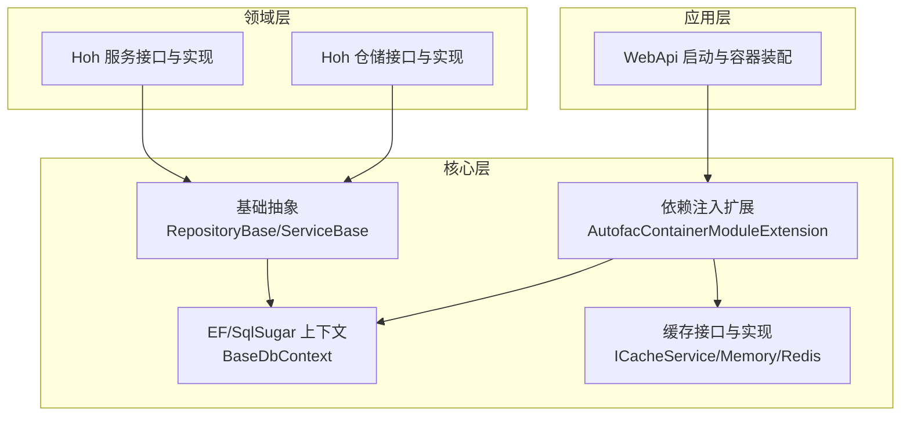
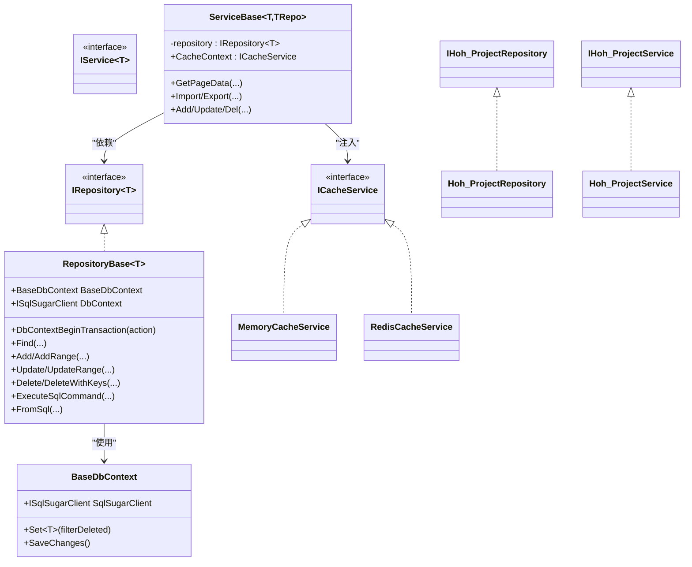
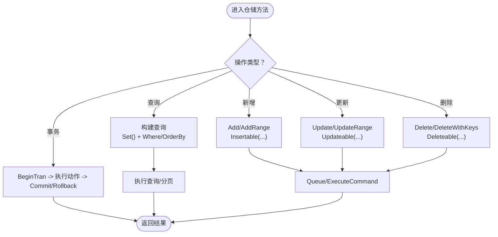
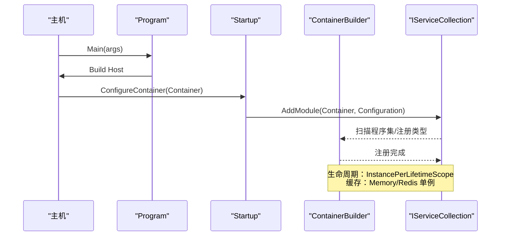
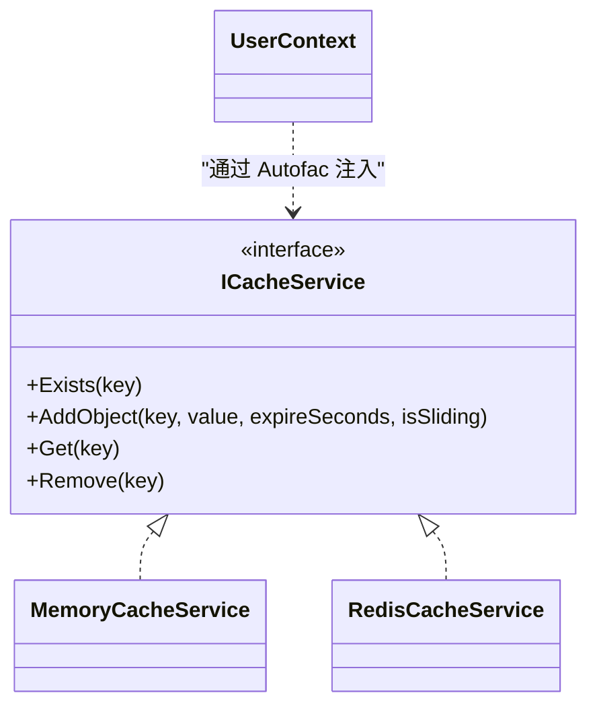
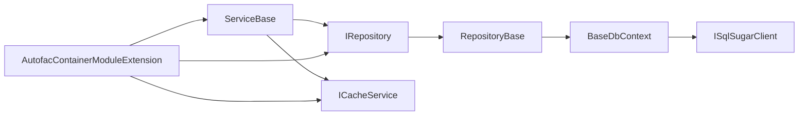

# 设计模式应用

<cite>
**本文引用的文件**
- [RepositoryBase.cs](file://VolPro.Core/BaseProvider/RepositoryBase.cs)
- [ServiceBase.cs](file://VolPro.Core/BaseProvider/ServiceBase.cs)
- [IRepository.cs](file://VolPro.Core/BaseProvider/IRepository.cs)
- [IService.cs](file://VolPro.Core/BaseProvider/IService.cs)
- [BaseDbContext.cs](file://VolPro.Core/EFDbContext/BaseDbContext.cs)
- [AutofacContainerModule.cs](file://VolPro.Core/Extensions/AutofacManager/AutofacContainerModule.cs)
- [AutofacContainerModuleExtension.cs](file://VolPro.Core/Extensions/AutofacManager/AutofacContainerModuleExtension.cs)
- [IDependency.cs](file://VolPro.Core/Extensions/AutofacManager/IDependency.cs)
- [ICacheService.cs](file://VolPro.Core/CacheManager/IService/ICacheService.cs)
- [MemoryCacheService.cs](file://VolPro.Core/CacheManager/Service/MemoryCacheService .cs)
- [RedisCacheService.cs](file://VolPro.Core/CacheManager/Service/RedisCacheService.cs)
- [Program.cs](file://VolPro.WebApi/Program.cs)
- [Startup.cs](file://VolPro.WebApi/Startup.cs)
- [IHoh_ProjectRepository.cs](file://Hncdi.HeatOfHydration/IRepositories/Hoh/IHoh_ProjectRepository.cs)
- [Hoh_ProjectRepository.cs](file://Hncdi.HeatOfHydration/Repositories/Hoh/Hoh_ProjectRepository.cs)
- [IHoh_ProjectService.cs](file://Hncdi.HeatOfHydration/IServices/Hoh/IHoh_ProjectService.cs)
- [Hoh_ProjectService.cs](file://Hncdi.HeatOfHydration/Services/Hoh/Hoh_ProjectService.cs)
</cite>

## 目录
1. [简介](#简介)
2. [项目结构](#项目结构)
3. [核心组件](#核心组件)
4. [架构总览](#架构总览)
5. [详细组件分析](#详细组件分析)
6. [依赖关系分析](#依赖关系分析)
7. [性能考量](#性能考量)
8. [故障排查指南](#故障排查指南)
9. [结论](#结论)
10. [附录](#附录)

## 简介
本文件聚焦于“水化热平台”在代码层面的设计模式落地，围绕仓储模式、依赖注入模式与工厂模式展开，结合基类抽象与Autofac容器配置，系统性阐述如何在ServiceBase与RepositoryBase之上正确应用这些模式，并给出单例、观察者等其他模式的应用场景与最佳实践指引。

## 项目结构
项目采用分层+模块化的组织方式：
- 核心层（VolPro.Core）：提供通用基础设施（EF/SqlSugar上下文、仓储与服务基类、缓存、依赖注入扩展、中间件、工具集等）
- 领域层（Hncdi.HeatOfHydration）：按业务域划分仓储与服务接口与实现（如Hoh、Project）
- 应用层（VolPro.WebApi）：ASP.NET Core启动与容器装配入口

图表来源
- [Startup.cs:214-235](file://VolPro.WebApi/Startup.cs#L214-L235)
- [AutofacContainerModuleExtension.cs:36-115](file://VolPro.Core/Extensions/AutofacManager/AutofacContainerModuleExtension.cs#L36-L115)
- [BaseDbContext.cs:18-40](file://VolPro.Core/EFDbContext/BaseDbContext.cs#L18-L40)
- [RepositoryBase.cs:29-651](file://VolPro.Core/BaseProvider/RepositoryBase.cs#L29-L651)
- [ServiceBase.cs:31-800](file://VolPro.Core/BaseProvider/ServiceBase.cs#L31-L800)

章节来源
- [Program.cs:15-39](file://VolPro.WebApi/Program.cs#L15-L39)
- [Startup.cs:50-407](file://VolPro.WebApi/Startup.cs#L50-L407)

## 核心组件
- 仓储基类与接口
  - IRepository<T>：定义统一的仓储契约（查询、分页、增删改、事务等）
  - RepositoryBase<T>：基于BaseDbContext与SqlSugar实现具体仓储能力，封装常用CRUD与事务
- 服务基类与接口
  - IService<T>：定义服务层通用能力（分页、导入导出、工作流、映射等）
  - ServiceBase<T, TRepository>：组合仓储与缓存、鉴权、多租户、雪花ID等横切关注点
- 数据上下文
  - BaseDbContext：桥接EF与SqlSugar，暴露Set<TEntity>()与SaveQueues()
- 依赖注入与容器
  - AutofacContainerModule/Extension：扫描程序集、注册生命周期、注入缓存与上下文
  - IDependency：标记可被自动发现与注册的类型

章节来源
- [IRepository.cs:19-328](file://VolPro.Core/BaseProvider/IRepository.cs#L19-L328)
- [RepositoryBase.cs:29-651](file://VolPro.Core/BaseProvider/RepositoryBase.cs#L29-L651)
- [IService.cs:14-165](file://VolPro.Core/BaseProvider/IService.cs#L14-L165)
- [ServiceBase.cs:31-800](file://VolPro.Core/BaseProvider/ServiceBase.cs#L31-L800)
- [BaseDbContext.cs:18-40](file://VolPro.Core/EFDbContext/BaseDbContext.cs#L18-L40)
- [AutofacContainerModule.cs:7-15](file://VolPro.Core/Extensions/AutofacManager/AutofacContainerModule.cs#L7-L15)
- [AutofacContainerModuleExtension.cs:36-115](file://VolPro.Core/Extensions/AutofacManager/AutofacContainerModuleExtension.cs#L36-L115)
- [IDependency.cs:9-13](file://VolPro.Core/Extensions/AutofacManager/IDependency.cs#L9-L13)

## 架构总览
下图展示了“仓储模式 + 依赖注入 + 工厂思想”的协同关系：服务层通过构造函数注入仓储接口；仓储由Autofac按生命周期注册；具体仓储实现继承RepositoryBase复用通用能力；缓存通过单例策略注入到服务层。

图表来源
- [IRepository.cs:19-328](file://VolPro.Core/BaseProvider/IRepository.cs#L19-L328)
- [RepositoryBase.cs:29-651](file://VolPro.Core/BaseProvider/RepositoryBase.cs#L29-L651)
- [IService.cs:14-165](file://VolPro.Core/BaseProvider/IService.cs#L14-L165)
- [ServiceBase.cs:31-800](file://VolPro.Core/BaseProvider/ServiceBase.cs#L31-L800)
- [BaseDbContext.cs:18-40](file://VolPro.Core/EFDbContext/BaseDbContext.cs#L18-L40)
- [ICacheService.cs:8-96](file://VolPro.Core/CacheManager/IService/ICacheService.cs#L8-L96)
- [MemoryCacheService .cs:9-190](file://VolPro.Core/CacheManager/Service/MemoryCacheService .cs#L9-L190)
- [RedisCacheService.cs:12-120](file://VolPro.Core/CacheManager/Service/RedisCacheService.cs#L12-L120)
- [IHoh_ProjectRepository.cs](file://Hncdi.HeatOfHydration/IRepositories/Hoh/IHoh_ProjectRepository.cs)
- [Hoh_ProjectRepository.cs](file://Hncdi.HeatOfHydration/Repositories/Hoh/Hoh_ProjectRepository.cs)
- [IHoh_ProjectService.cs](file://Hncdi.HeatOfHydration/IServices/Hoh/IHoh_ProjectService.cs)
- [Hoh_ProjectService.cs](file://Hncdi.HeatOfHydration/Services/Hoh/Hoh_ProjectService.cs)

## 详细组件分析

### 仓储模式：RepositoryBase 与 IRepository
- 抽象与实现分离
  - IRepository<T>定义查询、分页、增删改、事务等契约
  - RepositoryBase<T>基于BaseDbContext与SqlSugar实现具体逻辑，屏蔽EF/SqlSugar差异
- 关键能力
  - 事务：DbContextBeginTransaction封装提交/回滚与异常处理
  - 查询：Find/FindAsync/FindFirst/WhereIF/IQueryablePage等
  - 写入：Add/AddRange/AddWithSetIdentity/Update/UpdateRange/Delete/DeleteWithKeys
  - SQL：ExecuteSqlCommand/FromSql
- 多租户与拆表
  - 通过特性与扩展方法在查询时自动拼接多租户过滤与分表逻辑

图表来源
- [RepositoryBase.cs:67-96](file://VolPro.Core/BaseProvider/RepositoryBase.cs#L67-L96)
- [RepositoryBase.cs:153-211](file://VolPro.Core/BaseProvider/RepositoryBase.cs#L153-L211)
- [RepositoryBase.cs:286-332](file://VolPro.Core/BaseProvider/RepositoryBase.cs#L286-L332)
- [RepositoryBase.cs:483-540](file://VolPro.Core/BaseProvider/RepositoryBase.cs#L483-L540)
- [RepositoryBase.cs:559-597](file://VolPro.Core/BaseProvider/RepositoryBase.cs#L559-L597)

章节来源
- [IRepository.cs:19-328](file://VolPro.Core/BaseProvider/IRepository.cs#L19-L328)
- [RepositoryBase.cs:29-651](file://VolPro.Core/BaseProvider/RepositoryBase.cs#L29-L651)
- [BaseDbContext.cs:18-40](file://VolPro.Core/EFDbContext/BaseDbContext.cs#L18-L40)

### 依赖注入模式：Autofac 容器与生命周期
- 容器装配
  - Program 中设置 AutofacServiceProviderFactory
  - Startup.ConfigureContainer 中调用 AddModule(builder, configuration)，完成扫描与注册
- 注册策略
  - 扫描实现 IDependency 的类型，注册为自身与已实现接口，生命周期为 InstancePerLifetimeScope
  - 用户上下文、模型验证状态、缓存（内存或Redis）按配置单例注入
- 服务获取
  - 通过 AutofacContainerModule.GetService<T>() 在运行时获取服务实例

图表来源
- [Program.cs:17-36](file://VolPro.WebApi/Program.cs#L17-L36)
- [Startup.cs:214-235](file://VolPro.WebApi/Startup.cs#L214-L235)
- [AutofacContainerModuleExtension.cs:36-115](file://VolPro.Core/Extensions/AutofacManager/AutofacContainerModuleExtension.cs#L36-L115)
- [AutofacContainerModule.cs:9-12](file://VolPro.Core/Extensions/AutofacManager/AutofacContainerModule.cs#L9-L12)

章节来源
- [Program.cs:15-39](file://VolPro.WebApi/Program.cs#L15-L39)
- [Startup.cs:214-235](file://VolPro.WebApi/Startup.cs#L214-L235)
- [AutofacContainerModuleExtension.cs:36-115](file://VolPro.Core/Extensions/AutofacManager/AutofacContainerModuleExtension.cs#L36-L115)
- [AutofacContainerModule.cs:7-15](file://VolPro.Core/Extensions/AutofacManager/AutofacContainerModule.cs#L7-L15)
- [IDependency.cs:9-13](file://VolPro.Core/Extensions/AutofacManager/IDependency.cs#L9-L13)

### 工厂模式：基于接口与容器的“按需创建”
- 该框架未显式提供工厂接口，但通过以下方式体现工厂思想：
  - 仓储与服务均以接口形式暴露，具体实现由Autofac在运行时解析并注入
  - 通过泛型约束与基类（RepositoryBase/ServiceBase）形成“约定优于配置”的工厂式装配
- 实践建议
  - 对于复杂对象创建，可在容器中注册工厂委托或使用Func<T>延迟解析
  - 对于多实现场景，可通过命名或标签区分不同实现

章节来源
- [IRepository.cs:19-328](file://VolPro.Core/BaseProvider/IRepository.cs#L19-L328)
- [IService.cs:14-165](file://VolPro.Core/BaseProvider/IService.cs#L14-L165)
- [AutofacContainerModuleExtension.cs:78-82](file://VolPro.Core/Extensions/AutofacManager/AutofacContainerModuleExtension.cs#L78-L82)

### 单例模式：缓存服务与用户上下文
- 缓存服务
  - MemoryCacheService/RedisCacheService 实现 ICacheService
  - Startup 中根据配置选择注入 Memory 或 Redis 实现，并设置 SingleInstance
- 用户上下文
  - UserContext 注册为 InstancePerLifetimeScope，用于在请求范围内共享用户信息

图表来源
- [ICacheService.cs:8-96](file://VolPro.Core/CacheManager/IService/ICacheService.cs#L8-L96)
- [MemoryCacheService .cs:9-190](file://VolPro.Core/CacheManager/Service/MemoryCacheService .cs#L9-L190)
- [RedisCacheService.cs:12-120](file://VolPro.Core/CacheManager/Service/RedisCacheService.cs#L12-L120)
- [AutofacContainerModuleExtension.cs:83-84](file://VolPro.Core/Extensions/AutofacManager/AutofacContainerModuleExtension.cs#L83-L84)

章节来源
- [AutofacContainerModuleExtension.cs:98-105](file://VolPro.Core/Extensions/AutofacManager/AutofacContainerModuleExtension.cs#L98-L105)

### 观察者模式：动作观察与工作流
- 动作观察
  - ActionObserver 注册为 InstancePerLifetimeScope，可用于订阅与响应系统动作事件
- 工作流
  - Startup 中通过 WorkFlowContainer 配置审批流程，体现“发布-订阅”式的流程编排

章节来源
- [AutofacContainerModuleExtension.cs:84](file://VolPro.Core/Extensions/AutofacManager/AutofacContainerModuleExtension.cs#L84-L84)
- [Startup.cs:217-234](file://VolPro.WebApi/Startup.cs#L217-L234)

### 正确使用 ServiceBase 与 RepositoryBase 的最佳实践
- 服务层
  - 通过构造函数注入 IRepository<T>，避免在服务内直接依赖具体仓储实现
  - 利用 ServiceBase 的分页、导入导出、明细处理、事务包装等能力
  - 使用 CacheContext 访问缓存，遵循单例注入策略
- 仓储层
  - 继承 RepositoryBase<T>，复用事务、分页、查询、写入等通用逻辑
  - 对于多租户与分表场景，确保实体特性与扩展方法正确配置
- 控制器层
  - 通过依赖注入获取服务实例，避免硬编码创建对象

章节来源
- [ServiceBase.cs:31-800](file://VolPro.Core/BaseProvider/ServiceBase.cs#L31-L800)
- [RepositoryBase.cs:29-651](file://VolPro.Core/BaseProvider/RepositoryBase.cs#L29-L651)
- [IHoh_ProjectService.cs](file://Hncdi.HeatOfHydration/IServices/Hoh/IHoh_ProjectService.cs)
- [IHoh_ProjectRepository.cs](file://Hncdi.HeatOfHydration/IRepositories/Hoh/IHoh_ProjectRepository.cs)

## 依赖关系分析
- 组件耦合
  - 服务层仅依赖仓储接口，降低对具体实现的耦合
  - 仓储层依赖 BaseDbContext 与 SqlSugar，统一数据访问
- 外部依赖
  - Autofac 负责类型解析与生命周期管理
  - 缓存可选内存或Redis，通过配置切换
- 潜在风险
  - 若未正确实现 IDependency，类型不会被扫描注册
  - 缓存实现未单例可能导致并发问题

图表来源
- [ServiceBase.cs:56-76](file://VolPro.Core/BaseProvider/ServiceBase.cs#L56-L76)
- [RepositoryBase.cs:31-48](file://VolPro.Core/BaseProvider/RepositoryBase.cs#L31-L48)
- [BaseDbContext.cs:22-40](file://VolPro.Core/EFDbContext/BaseDbContext.cs#L22-L40)
- [AutofacContainerModuleExtension.cs:78-105](file://VolPro.Core/Extensions/AutofacManager/AutofacContainerModuleExtension.cs#L78-L105)

章节来源
- [AutofacContainerModuleExtension.cs:36-115](file://VolPro.Core/Extensions/AutofacManager/AutofacContainerModuleExtension.cs#L36-L115)
- [ServiceBase.cs:31-800](file://VolPro.Core/BaseProvider/ServiceBase.cs#L31-L800)
- [RepositoryBase.cs:29-651](file://VolPro.Core/BaseProvider/RepositoryBase.cs#L29-L651)

## 性能考量
- 事务批处理
  - RepositoryBase 使用 Queue/ExecuteCommand 批量写入，减少往返次数
- 分页与排序
  - IQueryablePage 支持指定排序字典，避免全表扫描
- 缓存策略
  - 内存缓存适合本地开发与小规模部署；Redis 适合分布式与高并发
- 多租户与拆表
  - 在查询阶段即加入过滤条件，避免不必要的数据传输

## 故障排查指南
- 依赖注入未生效
  - 确认类型实现 IDependency 接口且位于可被扫描的程序集
  - 检查 AddModule 是否被调用以及注册链路
- 缓存异常
  - 检查 AppSetting.UseRedis 与连接字符串配置
  - 确保缓存实现为单例
- 事务未提交
  - 确认 DbContextBeginTransaction 返回的状态与异常分支
- 多租户过滤无效
  - 检查实体特性与扩展方法是否正确配置

章节来源
- [AutofacContainerModuleExtension.cs:36-115](file://VolPro.Core/Extensions/AutofacManager/AutofacContainerModuleExtension.cs#L36-L115)
- [RepositoryBase.cs:67-96](file://VolPro.Core/BaseProvider/RepositoryBase.cs#L67-L96)
- [ServiceBase.cs:113-138](file://VolPro.Core/BaseProvider/ServiceBase.cs#L113-L138)

## 结论
本项目通过“仓储基类 + 服务基类 + Autofac容器”的组合，有效实现了仓储模式、依赖注入与工厂思想的落地。配合单例缓存与观察者机制，形成了清晰的分层架构与可维护的横切关注点实现。遵循本文最佳实践，可在保证扩展性的同时提升开发效率与运行性能。

## 附录
- 示例文件定位
  - 仓储接口与实现：Hncdi.HeatOfHydration/IRepositories/Hoh 与 Repositories/Hoh
  - 服务接口与实现：Hncdi.HeatOfHydration/IServices/Hoh 与 Services/Hoh
- 关键配置
  - Program.cs：设置 AutofacServiceProviderFactory
  - Startup.cs：ConfigureContainer 中 AddModule 与缓存注册
  - AutofacContainerModule/Extension：扫描与注册策略